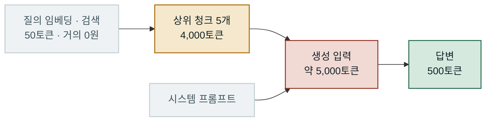
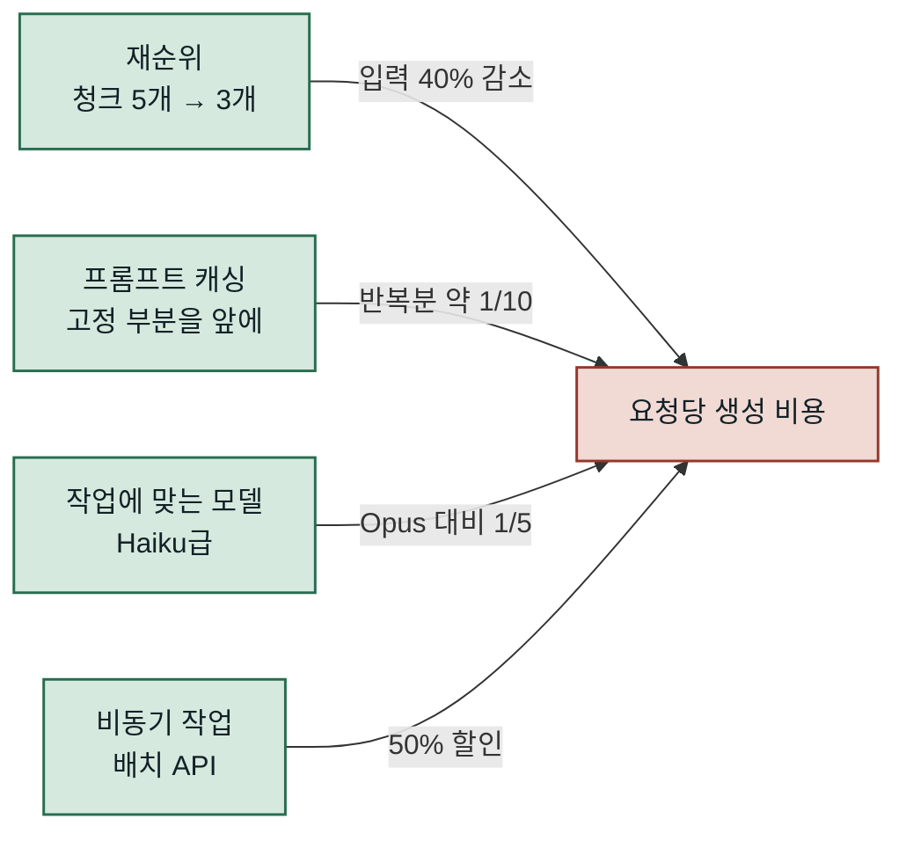
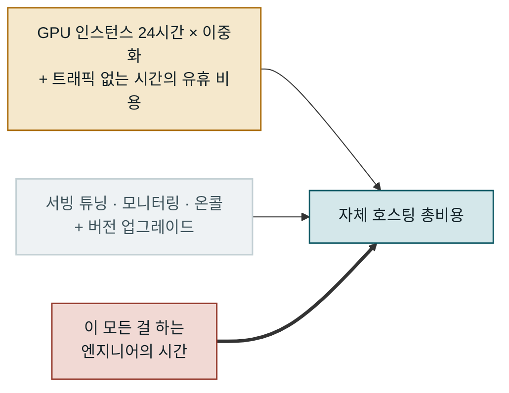
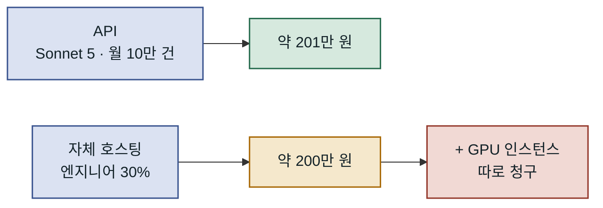
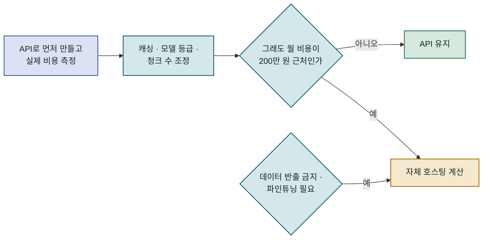

## 결론부터

**임베딩은 거의 항상 API가 쌉니다. 생성(generation)은 규모가 커지면 갈립니다. 그리고 두 경우 모두, 계산에서 빠지기 쉬운 가장 큰 항목은 사람 시간입니다.**

왜 그런지 숫자로 봅니다.

## 환산 기준

이 글의 모든 API 단가는 달러 표시입니다. **원화 정가는 없습니다.** 아래 원화 금액은 환율 **1달러 = 1,340원**(2026년 9월 10일 기준)으로 환산한 세전 값이고, 개인 결제라면 부가세 10%가 더 붙습니다.

## 1단계: 임베딩 비용은 생각보다 훨씬 작습니다

OpenAI 임베딩 단가입니다 (100만 토큰당).

| 모델 | 달러 | 원화 |
|---|---|---|
| text-embedding-3-small | $0.02 | **27원** |
| text-embedding-3-large | $0.13 | **174원** |

사내 문서 **10만 건**, 건당 평균 2,000토큰이라고 가정합니다. 총 2억 토큰입니다.

```text
2억 토큰 ÷ 100만 × 27원 = 5,400원
```

전체 문서를 임베딩하는 데 **5,400원**입니다. large를 써도 약 3만 5천 원입니다. 이건 한 번 드는 비용이고, 이후엔 신규·변경 문서만 처리하면 됩니다.

여기에 GPU를 띄워서 아끼려는 시도는, **점심값도 안 되는 돈**을 아끼려고 운영 부담을 지는 일입니다. 최초 색인이 수십억 토큰 규모가 아니라면 이 항목은 논쟁거리가 아닙니다.

## 2단계: 쿼리 시점 임베딩도 작습니다

검색 요청마다 질의를 임베딩해야 합니다. 질의는 짧습니다 — 50토큰이라고 하죠.

```text
월 100만 건 검색 × 50토큰 = 5,000만 토큰
5,000만 ÷ 100만 × 27원 = 1,350원
```

월 100만 검색에 **1,350원**입니다.

## 3단계: 여기가 진짜 비용입니다 — 생성

RAG는 검색만으로 끝나지 않습니다. 찾아온 문서를 컨텍스트에 넣고 모델이 답을 씁니다. 그리고 **검색된 문서가 통째로 입력 토큰이 됩니다.**

한 번의 답변에 상위 5개 청크(각 800토큰) + 질의 + 시스템 프롬프트 = 약 5,000 입력 토큰, 출력 500 토큰이라고 하겠습니다.



임베딩을 지나는 동안은 거의 공짜고, 검색된 청크가 생성 입력으로 들어가는 순간 비용이 커집니다.

Claude 단가로 계산하면 (100만 토큰당, 원화 환산):

| 모델 | 입력 | 출력 | 요청 1건 | 월 10만 건 |
|---|---|---|---|---|
| Opus 5 | 6,700원 | 33,500원 | 50원 | **약 502만 원** |
| Sonnet 5 | 2,680원 | 13,400원 | 20원 | **약 201만 원** |
| Haiku 4.5 | 1,340원 | 6,700원 | 10원 | **약 100만 원** |

임베딩이 5,400원이었는데 생성이 월 수백만 원입니다. **비용의 99%가 여기 있습니다.**

요청 1건이 10~50원이라는 감각이 중요합니다. 사용자 한 명이 하루 20번 물어보면 하루 200~1,000원, 한 달에 6,000~3만 원입니다. **사용자 한 명이 구독료만큼 쓰는 셈**이라, 사내 도구인지 외부 서비스인지에 따라 사업성이 완전히 달라집니다.

## 그래서 최적화할 곳은 정해져 있습니다

임베딩 모델을 바꾸는 것보다 훨씬 효과가 큰 것들입니다.



네 가지 모두 임베딩이 아니라 생성 비용을 직접 줄입니다.

**1. 검색 품질을 올려서 청크 수를 줄이세요.**
상위 5개를 넣던 걸 3개로 줄이면 입력 토큰이 40% 줄어듭니다. 재순위(rerank)를 붙여 정확도를 올리면 적은 청크로도 같은 답이 나옵니다. **검색 품질 개선이 곧 비용 절감입니다.**

**2. 프롬프트 캐싱을 거세요.**
시스템 프롬프트와 고정 지시문은 매 요청 반복됩니다. 캐시 읽기는 원가의 약 10분의 1입니다. 고정 부분을 앞에, 변하는 부분(질의, 검색 결과)을 뒤에 두는 것만으로 걸립니다.

**3. 작업에 맞는 모델을 쓰세요.**
"문서에서 답 찾아 요약"은 대부분 Haiku급으로 충분합니다. 위 표에서 Opus와 Haiku는 5배 차이입니다. 전부를 큰 모델로 돌리는 건 대개 측정해 보지 않아서입니다.

**4. 비동기로 되는 건 배치로.**
지연에 민감하지 않은 작업(야간 색인 요약, 일괄 분류)은 배치 API가 50% 저렴합니다.

## 그럼 직접 띄우는 건 언제 답인가

비용 때문이라면 손익분기는 **생성** 쪽에서만 의미가 생깁니다. 그리고 그 계산에는 대개 빠지는 항목이 있습니다.



굵은 선으로 표시한 엔지니어의 시간이 보통 가장 큽니다. 연봉 8,000만 원인 시니어 엔지니어가 이 일에 30%를 쓰면 **월 200만 원**입니다. 4대보험과 간접비를 얹으면 더 큽니다. 위 표에서 Sonnet 5로 월 10만 건을 처리하는 비용(약 201만 원)과 거의 같습니다.

즉 **엔지니어 한 명의 30%를 태워서 API 비용을 0으로 만들어도 본전**입니다. 그 사이 GPU 인스턴스 비용은 따로 나갑니다.



위가 API, 아래가 자체 호스팅입니다. 사람 시간만으로 API 비용과 같아지고, GPU 비용은 그 위에 얹힙니다.

**비용이 아닌 이유로는 정당합니다.** 데이터가 외부로 나갈 수 없는 규제 환경, 극단적으로 안정적인 지연 요구, 특수 도메인 파인튜닝이 필요한 경우. 이때는 계산이 아니라 요구사항이 결정합니다.

## 판단 순서

1. **API로 먼저 만드세요.** 동작하는 걸 만들기 전에 인프라를 고민하는 건 순서가 틀렸습니다.
2. **실제 비용을 측정하세요.** 예측한 트래픽은 대개 틀립니다.
3. 월 비용이 **200만 원**(엔지니어 한 명의 30%)에 근접하면, 그때 자체 호스팅을 계산합니다.
4. 그 전에 **캐싱·모델 등급·청크 수**를 먼저 조정합니다. 대개 여기서 절반이 줄어듭니다.



비용만 보면 조정을 거친 뒤에도 월 200만 원 근처일 때 자체 호스팅을 계산합니다. 규제나 파인튜닝 같은 요구사항은 이 순서를 건너뜁니다.

## 정리

- 임베딩은 논쟁거리가 아닙니다. 10만 문서에 **5,400원**입니다.
- 비용의 거의 전부는 **생성 시점의 입력 토큰**입니다.
- 그래서 **검색 품질 개선이 곧 비용 최적화**입니다.
- 자체 호스팅의 손익분기 계산에는 **사람 시간**이 들어가야 합니다. 대개 그게 가장 큽니다.

여러분의 RAG는 월 얼마가 나오고 있나요? 그리고 그 비용의 대부분은 어디에 있나요?

---

**출처**

1. [OpenAI API 가격](https://developers.openai.com/api/docs/pricing) — 임베딩·생성 단가.
2. [Anthropic API 가격 문서](https://platform.claude.com/docs/en/about-claude/pricing) — Claude 모델 단가. 본문 계산은 Anthropic 1차 API 기준입니다.
3. [OpenAI, Embeddings 가이드](https://platform.openai.com/docs/guides/embeddings) — 임베딩 모델의 차원 수와 입력 한도.
4. [BAAI/bge-m3 모델 카드](https://huggingface.co/BAAI/bge-m3) — 자체 호스팅 후보로 든 모델의 스펙.
