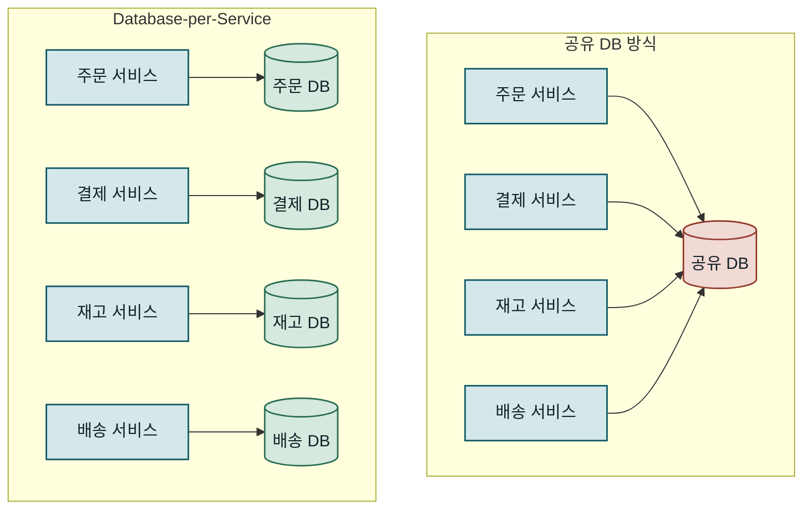
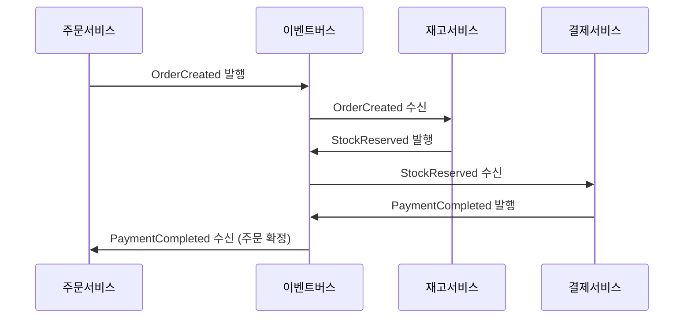
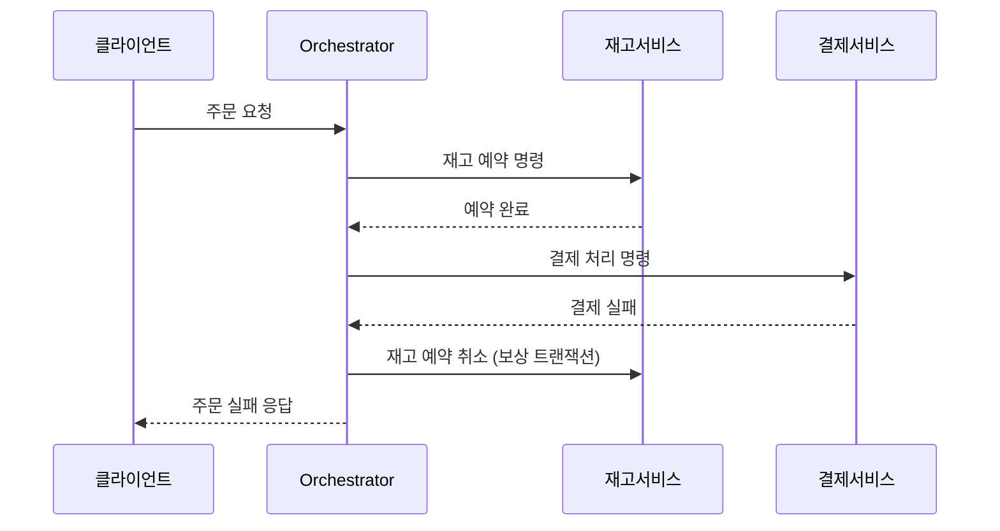
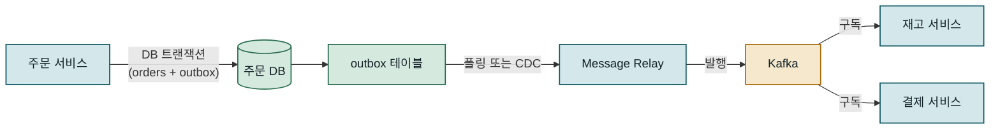
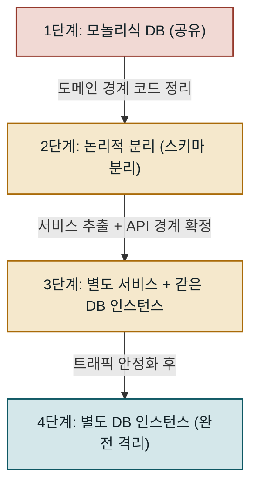

권한이 아직 없어서 파일로는 저장하지 않겠습니다. 아래에 완성된 블로그 포스트를 바로 출력합니다.

---

## 목차

1. 개요
2. Database-per-Service 패턴의 핵심 원리
3. 데이터 격리 구현 전략
4. 분산 데이터 일관성 — Saga 패턴
5. 성능 특성과 대안 패턴 비교
6. 운영 환경 적용 시 고려사항
7. 맺음말

---

## 개요

### 문제 배경: 공유 데이터베이스가 만드는 결합

마이크로서비스 아키텍처로의 전환을 결정한 팀이 처음 마주치는 함정은 서비스는 분리했지만 데이터베이스는 하나로 남겨두는 선택입니다. 서비스 경계를 코드 수준에서는 나눴어도 모든 서비스가 동일한 DB에 접근하면 실질적인 격리가 이루어지지 않습니다. **Database-per-Service 패턴**은 각 마이크로서비스가 자신만의 데이터 저장소를 소유하도록 강제함으로써 서비스 간 결합도를 근본적으로 낮추는 아키텍처 패턴입니다. 이 글에서는 패턴의 구조적 원리부터 Saga 패턴을 통한 분산 일관성 유지, 그리고 단계적 마이그레이션까지 실제 프로젝트에서 마주치는 핵심 트레이드오프를 다룹니다.

공유 DB 방식의 문제는 배포 단계에서 가장 뚜렷하게 드러납니다. 주문 서비스의 스키마를 변경하려면 결제 서비스, 재고 서비스, 배송 서비스 팀이 모두 같은 시점에 변경을 조율해야 합니다. 한 서비스의 쿼리가 테이블에 풀스캔을 발생시키면 그 부하를 모든 서비스가 공유합니다. 특정 서비스에 맞는 인덱스를 추가하면 다른 서비스의 쓰기 성능에 영향을 줍니다. 이러한 문제들은 마이크로서비스가 제공해야 할 독립적 배포와 독립적 확장이라는 두 가지 핵심 가치를 모두 훼손합니다.

---

아래 그림은 공유 DB 환경과 Database-per-Service 환경의 아키텍처 차이를 보여줍니다.

<!-- fig: db-per-service-architecture -->


두 아키텍처가 서비스 수 증가에 따라 어떻게 다르게 동작하는지를 보면 패턴 선택의 이유가 명확해집니다.

### 기존 방식의 한계: 공유 데이터베이스 안티패턴

공유 데이터베이스 방식에서 각 서비스는 서로 다른 테이블을 소유하거나, 심하면 같은 테이블에서 각자의 조건으로 데이터를 읽고 씁니다. 초기에는 SQL 조인이 가능하고 트랜잭션이 단순해서 편리하게 느껴지지만, 시스템이 성장할수록 문제가 누적됩니다.

가장 근본적인 문제는 **스키마 소유권의 불명확함**입니다. `orders` 테이블에 `payment_status` 컬럼을 추가해야 한다면 주문 서비스가 관리해야 할까요, 결제 서비스가 관리해야 할까요? 공유 DB 환경에서는 이 경계가 흐릿해지고 시간이 지날수록 테이블 하나에 여러 서비스의 관심사가 섞이는 **Big Table 안티패턴**으로 변질됩니다. 결국 아무도 완전히 이해하지 못하는 테이블이 생기고, 누군가 컬럼 하나를 삭제하거나 타입을 바꾸면 어느 서비스가 영향 받는지 파악하는 것조차 어렵습니다.

또한 서비스마다 데이터 특성이 다릅니다. 사용자 세션 데이터는 Redis 같은 인메모리 저장소가 적합하고, 제품 카탈로그는 전문 검색을 위해 Elasticsearch가 효율적이며, 주문 이력은 관계형 DB가 적합합니다. 공유 DB는 이 다양성을 허용하지 않고 모든 서비스를 단일 기술 스택에 묶어둡니다. **폴리글랏 퍼시스턴스(Polyglot Persistence)**라고 불리는 이 유연성은 Database-per-Service 패턴의 중요한 이점 중 하나입니다.

---

## Database-per-Service 패턴의 핵심 원리

### 서비스 경계와 데이터 소유권

Database-per-Service 패턴의 첫 번째 원칙은 **데이터 소유권의 명확화**입니다. 각 서비스는 자신이 소유한 데이터에 대해 완전한 책임을 집니다. 다른 서비스는 해당 데이터에 직접 접근할 수 없으며, 반드시 데이터를 소유한 서비스가 노출하는 API를 통해서만 접근할 수 있습니다. 이 규칙은 처음에는 제약처럼 느껴지지만, 서비스 간 계약을 명시적으로 만들고 내부 구현의 변경이 외부에 파급되는 것을 차단합니다.

도메인 주도 설계(DDD)의 **바운디드 컨텍스트(Bounded Context)** 개념과 직접 연결됩니다. 각 마이크로서비스는 하나의 바운디드 컨텍스트에 대응하며, 그 컨텍스트 안의 데이터를 완전히 소유합니다. `User`라는 개념이 주문 서비스에서는 배송지와 결제 수단을 가진 구매자이고, 마케팅 서비스에서는 구매 이력과 선호도를 가진 세그먼트 대상이라면, 두 서비스는 각자의 컨텍스트에 맞는 별도 데이터 구조를 유지합니다. 이는 데이터 중복처럼 보이지만, 각 서비스가 상대방의 내부 변경에 영향 받지 않고 독립적으로 진화할 수 있게 하는 의도적인 설계입니다. 한 서비스의 스키마 변경이 다른 서비스의 배포를 강제하지 않는다는 것이 핵심입니다.

| 구분 | 공유 데이터베이스 | Database-per-Service |
|---|---|---|
| 데이터 소유권 | 불명확, 복수 서비스 공동 | 서비스가 단독 소유 |
| 스키마 변경 | 전 팀 조율 필요 | 서비스 팀 단독 결정 |
| 기술 선택 | 단일 DB 기술로 고정 | 서비스별 최적 기술 |
| 장애 격리 | DB 장애 = 전 서비스 영향 | 해당 서비스만 영향 |
| 쿼리 방식 | 테이블 조인 가능 | API 조합 또는 이벤트 |
| 배포 독립성 | 스키마 변경 시 공동 배포 | 독립 배포 가능 |

### 폴리글랏 퍼시스턴스와 기술 다양성

Database-per-Service 패턴의 두 번째 원칙은 각 서비스가 자신의 도메인에 가장 적합한 저장소 기술을 선택할 수 있다는 것입니다. 단일 공유 DB에서는 모든 팀이 Oracle이든 PostgreSQL이든 하나의 기술을 사용해야 했지만, 이 패턴에서는 각 서비스가 독립적으로 선택합니다.

이 유연성은 실제 프로젝트에서 상당한 성능 차이를 만들어냅니다. 상품 검색 서비스가 PostgreSQL의 `LIKE` 쿼리 대신 Elasticsearch를 도입하면 검색 응답 시간을 수백 밀리초에서 수십 밀리초로 단축할 수 있습니다. 소셜 그래프를 관리하는 서비스가 관계형 DB의 자기 참조 조인 대신 Neo4j 같은 그래프 DB를 쓰면, 친구의 친구 관계를 수십 홉 이상 탐색하는 쿼리가 실용적인 응답 시간 안에 처리됩니다. 세션 데이터를 Redis에 저장하면 DB 트랜잭션 없이 TTL 기반 만료를 자동으로 처리합니다.

```
주문 서비스     → PostgreSQL    (트랜잭션, 복잡한 조인)
상품 서비스     → Elasticsearch (전문 검색, 집계)
세션 서비스     → Redis         (인메모리, TTL 자동 만료)
그래프 서비스   → Neo4j         (관계 탐색, 다중 홉)
분석 서비스     → ClickHouse    (컬럼 지향, 집계 쿼리)
```

각 저장소 기술은 특정 접근 패턴에 최적화되어 있습니다. 폴리글랏 퍼시스턴스는 이 최적화를 서비스 단위로 적용할 수 있게 해 주지만, DB 운영 기술과 모니터링이 기술별로 다르다는 운영 부담도 함께 커집니다. 팀이 실제로 운영할 수 있는 기술 범위 안에서 선택하는 것이 중요합니다.

### 데이터 경계 정의 방법

서비스 경계와 데이터 경계를 어디서 나누느냐는 Database-per-Service 패턴에서 가장 어려운 질문입니다. 경계를 너무 작게 나누면 서비스가 지나치게 세분화되어 분산 시스템의 복잡성만 늘어나고, 너무 크게 나누면 사실상 모놀리식과 다름없어집니다.

효과적인 기준은 **업무 변경 빈도와 팀 구조**입니다. 함께 자주 변경되는 데이터는 같은 서비스에, 독립적으로 변경되는 데이터는 다른 서비스에 배치합니다. Conway's Law에 따르면 시스템의 구조는 그것을 만든 조직의 커뮤니케이션 구조를 닮는 경향이 있습니다. 주문 팀과 결제 팀이 별도로 존재한다면 주문 DB와 결제 DB가 분리되는 것이 자연스럽습니다. 반대로 같은 팀이 주문과 배송을 함께 담당한다면 두 도메인을 하나의 서비스로 묶는 것이 오히려 효율적입니다.

| 분리 기준 | 설명 | 위험 신호 |
|---|---|---|
| 변경 빈도 | 함께 자주 변경 → 같은 서비스 | 분리했는데 항상 같이 배포됨 |
| 팀 경계 | 팀이 다르면 서비스도 구분 | 한 팀이 여러 DB를 소유 |
| 트랜잭션 범위 | 강한 일관성 필요 → 같은 서비스 | 분산 트랜잭션 과다 발생 |
| 확장 요구 | 독립적 확장 필요 → 분리 | DB가 나뉘었는데 함께 스케일링 |
| 조회 패턴 | 항상 조인되는 데이터 → 같은 서비스 | API 조합이 10회 이상 중첩됨 |

---

## 데이터 격리 구현 전략

### 물리적 분리 vs 논리적 분리

Database-per-Service를 구현할 때 가장 먼저 결정해야 할 사항은 데이터베이스를 물리적으로 분리할 것인지, 같은 DB 인스턴스 안에서 논리적으로만 분리할 것인지입니다. 두 방식 모두 서비스 간 직접 접근을 차단하는 목표는 같지만, 운영 복잡성과 격리 수준에서 차이가 있습니다.

**물리적 분리**는 서비스마다 별도의 DB 인스턴스를 운영하는 방식입니다. 한 DB에 장애가 발생해도 다른 서비스의 DB는 영향 받지 않으며, 각 인스턴스를 독립적으로 스케일링할 수 있습니다. 연결 풀 설정, 최대 커넥션 수, 쿼리 타임아웃도 서비스별로 조정됩니다. 그러나 인스턴스마다 운영 비용이 발생하고 백업, 모니터링, 패치 관리 대상이 늘어납니다.

**논리적 분리**는 같은 DB 인스턴스에서 스키마나 데이터베이스 이름 공간만 분리하는 방식입니다. PostgreSQL의 스키마(schema)나 MySQL의 데이터베이스(database)를 서비스별로 나누고, 계정 권한으로 접근을 제어합니다. 초기 전환 비용이 낮고 인프라 복잡성도 줄지만, DB 인스턴스 자체의 장애나 부하 폭발은 격리되지 않습니다. 서비스 A의 쿼리가 DB 인스턴스를 과부하 시키면 서비스 B도 함께 응답이 느려집니다.

| 분리 방식 | 장애 격리 | 독립 확장 | 운영 복잡성 | 비용 | 권장 상황 |
|---|---|---|---|---|---|
| 물리적 분리 | ✅ 완전 격리 | ✅ 독립 가능 | 높음 | 높음 | 트래픽이 큰 핵심 서비스 |
| 논리적 (스키마) | ❌ 인스턴스 공유 | ❌ 함께 스케일 | 낮음 | 낮음 | 초기 전환, 소규모 서비스 |
| 논리적 (DB명) | ❌ 인스턴스 공유 | ❌ 함께 스케일 | 중간 | 중간 | MySQL 환경 초기 분리 |

일반적인 권장 경로는 논리적 분리로 시작해 서비스가 안정화되고 트래픽이 증가할 때 물리적 분리로 이전하는 것입니다. 논리적 분리 단계에서 이미 접근 권한과 코드 경계가 명확히 나뉘어 있다면, 물리적 분리는 인프라 변경과 연결 설정 업데이트만으로 마무리됩니다.

### 서비스 간 데이터 접근 — API 컴포지션 패턴

데이터가 서비스별로 격리되면 기존의 테이블 조인이 불가능해집니다. 주문 목록에 상품명을 함께 보여주려면 주문 DB와 상품 DB를 SQL로 조인할 수 없으므로, 애플리케이션 계층에서 데이터를 조합해야 합니다.

**API 컴포지션 패턴**은 여러 서비스의 API를 호출한 결과를 합쳐 하나의 응답을 만드는 방식입니다. 주문 목록을 보여주는 BFF(Backend for Frontend) 또는 API Gateway가 주문 서비스와 상품 서비스에 각각 요청을 보내고 결과를 합칩니다. 서비스가 적고 요청 빈도가 낮다면 충분하지만, 서비스가 많아질수록 N+1 문제와 유사한 상황이 발생합니다. 주문 10건을 가져온 뒤 각 주문의 상품 정보를 10번 조회하면 11번의 네트워크 요청이 발생합니다. 아래 코드는 이 문제를 배치 API 호출로 해결하는 구현 예입니다.

```java
@Service
public class OrderQueryService {

    private final OrderServiceClient orderClient;
    private final ProductServiceClient productClient;

    public List<OrderSummary> getOrderSummaries(String userId) {
        // 1. 주문 서비스에서 주문 목록 조회
        List<Order> orders = orderClient.getOrdersByUser(userId);

        // 2. 필요한 상품 ID를 한 번에 수집 (중복 제거)
        Set<String> productIds = orders.stream()
            .flatMap(order -> order.getItems().stream())
            .map(OrderItem::getProductId)
            .collect(Collectors.toSet());

        // 3. 상품 서비스에 배치 조회 — 단건 N회 대신 1회 호출
        Map<String, Product> productMap = productClient
            .getProductsByIds(productIds)
            .stream()
            .collect(Collectors.toMap(Product::getId, Function.identity()));

        // 4. 조합 후 반환 (총 API 호출 2회: 주문 목록 1회 + 상품 배치 1회)
        return orders.stream()
            .map(order -> toSummary(order, productMap))
            .collect(Collectors.toList());
    }
}
```

핵심은 상품 조회를 단건 N회가 아니라 배치 1회로 처리하는 것입니다. 서비스 클라이언트가 `getProductsByIds()`처럼 복수 ID를 한 번에 받는 배치 API를 지원하도록 설계해야 API 컴포지션의 성능 문제를 줄일 수 있습니다. 배치 API 없이 N번 호출하는 방식은 코드는 단순하지만 트래픽 증가와 함께 레이턴시가 선형으로 늘어나는 위험이 있습니다.

### CQRS로 복잡한 조회 처리하기

API 컴포지션이 복잡해지면 **CQRS(Command Query Responsibility Segregation)** 패턴을 결합하는 방법이 효과적입니다. 쓰기(Command)와 읽기(Query) 모델을 분리하여, 복잡한 조회에 최적화된 별도의 읽기 전용 데이터 저장소를 운영하는 방식입니다.

주문과 상품 정보를 조합한 뷰가 자주 조회된다면, 이벤트를 구독하여 조합된 형태로 데이터를 미리 만들어두는 **Materialized View**를 운영합니다. 주문 서비스가 주문 생성 이벤트를 발행하면, 조회 전담 서비스가 이를 수신하여 상품 정보를 가져와 미리 조합된 문서를 저장합니다. 조회 시점에는 이 문서를 단순 조회하면 되므로 응답이 빠릅니다.

```
[쓰기 경로]
주문 서비스 DB ──이벤트 발행──→ 이벤트 버스(Kafka)
                                        │
                                조회 전담 서비스
                                (상품 정보와 선조합)
                                        │
                                읽기 전용 저장소
                                (Elasticsearch)
[읽기 경로]
클라이언트 ──→ API Gateway ──→ 읽기 전용 저장소 (단순 조회)
```

CQRS의 단점은 읽기 모델이 쓰기 이벤트를 처리할 때까지 약간의 지연이 발생한다는 점입니다. 주문을 생성한 직후 목록을 조회하면 방금 생성한 주문이 아직 보이지 않을 수 있습니다. 이 지연을 허용할 수 없는 시나리오에서는 쓰기 직후 즉시 읽어야 하는 경우만 쓰기 DB에서 조회하고, 일반 목록 조회는 읽기 DB를 사용하는 하이브리드 전략을 사용합니다.

| 조회 방식 | 레이턴시 | 데이터 신선도 | 구현 복잡도 | 적합한 상황 |
|---|---|---|---|---|
| 실시간 API 호출 | 높음 | 항상 최신 | 낮음 | 최신성이 필수인 단건 조회 |
| 배치 API 호출 | 중간 | 항상 최신 | 중간 | N+1 없는 목록 조회 |
| Materialized View | 낮음 | 이벤트 처리 후 반영 | 높음 | 복잡한 통합 조회, 집계 |
| 데이터 복제 (로컬 캐시) | 매우 낮음 | 동기화 지연 가능 | 높음 | 변경 드문 참조 데이터 |

---

## 분산 데이터 일관성 — Saga 패턴

### 2PC의 한계와 최종 일관성

공유 DB를 분리하면서 가장 크게 포기해야 하는 것은 **ACID 트랜잭션**입니다. 주문이 생성될 때 주문 DB에 주문을 저장하고 재고 DB에서 재고를 차감하는 작업을 하나의 트랜잭션으로 묶을 수 없습니다.

분산 환경에서 여러 DB를 하나의 트랜잭션으로 묶는 방법으로 **2PC(2 Phase Commit)**가 있습니다. 코디네이터가 모든 참여 서비스에 "준비됐냐"고 묻고(Phase 1), 모두 준비됐으면 "커밋하라"고 명령하는(Phase 2) 방식입니다. 이론적으로 원자성을 보장하지만, 코디네이터 장애 시 참여자들이 블로킹 상태에 빠지고, 성능 오버헤드가 크며, NoSQL 저장소 대부분이 지원하지 않는 한계가 있습니다.

| 일관성 방식 | 원자성 보장 | 성능 영향 | 장애 내성 | 구현 복잡도 | 마이크로서비스 적합성 |
|---|---|---|---|---|---|
| 공유 DB ACID | ✅ 강한 일관성 | 낮음 | 단일 장애점 | 낮음 | ❌ 서비스 격리 불가 |
| 2PC | ✅ 강한 일관성 | 높음 (블로킹) | 코디네이터 취약 | 중간 | ❌ 비권장 |
| Saga (Choreography) | ❌ 최종 일관성 | 낮음 | 높음 | 중간 | ✅ 권장 |
| Saga (Orchestration) | ❌ 최종 일관성 | 낮음 | 높음 | 높음 | ✅ 복잡한 흐름 권장 |

Database-per-Service 패턴에서 데이터 일관성은 **최종 일관성(Eventual Consistency)**으로 접근합니다. 모든 서비스의 데이터가 즉각 일치하지 않더라도, 충분한 시간이 지나면 일관된 상태에 도달한다는 보장입니다. 이 보장을 구현하는 핵심 도구가 Saga 패턴입니다.

### Saga 패턴 — Choreography vs Orchestration

**Saga 패턴**은 여러 서비스에 걸친 비즈니스 트랜잭션을 일련의 로컬 트랜잭션으로 분해하고, 각 로컬 트랜잭션이 성공하면 다음 단계를 트리거하며, 실패하면 이전 단계들을 되돌리는 **보상 트랜잭션(Compensating Transaction)**을 실행하는 방식입니다.

Saga를 구현하는 방법은 두 가지입니다. **Choreography** 방식은 중앙 코디네이터 없이 각 서비스가 이벤트를 발행하고 구독하며 자율적으로 다음 단계를 진행합니다. **Orchestration** 방식은 Saga Orchestrator가 각 서비스에 명령을 내리고 응답을 수집하여 전체 흐름을 관리합니다. 아래 두 그림에서 같은 주문 처리 흐름이 방식에 따라 어떻게 달라지는지 확인할 수 있습니다.

<!-- fig: saga-choreography -->


Choreography 방식의 실패 흐름에서는 결제서비스가 `PaymentFailed` 이벤트를 발행하고, 재고서비스가 이를 구독하여 자율적으로 재고 예약을 취소합니다. 흐름이 단순하고 서비스 수가 적을 때 유효하지만, 참여 서비스가 늘어날수록 흐름이 서비스들에 흩어져 전체 상태를 한눈에 파악하기 어렵습니다.

<!-- fig: saga-orchestration -->


Orchestration 방식은 전체 흐름이 Orchestrator 한 곳에 집중되어 가시성이 높고 디버깅이 쉽습니다. 실패 시 보상 트랜잭션 실행도 명확합니다. 단점은 Orchestrator가 단일 장애점이 될 수 있고 비즈니스 로직이 Orchestrator에 집중되는 경향이 있습니다. Temporal이나 AWS Step Functions 같은 워크플로우 엔진을 Orchestrator로 사용하면 상태 관리와 재시도 로직을 위임할 수 있습니다.

| 비교 항목 | Choreography | Orchestration |
|---|---|---|
| 중앙 제어 | 없음 (분산) | Orchestrator |
| 서비스 결합도 | 낮음 (이벤트 기반) | 중간 (명령 기반) |
| 흐름 가시성 | 낮음 (흩어짐) | 높음 (집중됨) |
| 디버깅 난이도 | 어려움 | 쉬움 |
| 보상 트랜잭션 | 각 서비스가 처리 | Orchestrator가 지시 |
| 권장 규모 | 서비스 2~3개 | 서비스 4개 이상 |

Temporal 워크플로우 기반 Orchestration 구현에 대한 자세한 내용은 아래 글에서 이어집니다.
[관련글:Temporal Saga 구현 — 보상 트랜잭션을 코드로 다루는 법]

### 트랜잭셔널 아웃박스 패턴

Saga 패턴에서 흔히 발생하는 문제가 있습니다. 서비스가 자신의 DB에 데이터를 저장하고 이벤트를 발행하는 두 작업이 원자적으로 이루어지지 않으면, DB 저장은 성공했는데 이벤트 발행이 실패하거나 그 반대 상황이 발생할 수 있습니다. 이 경우 Saga는 다음 단계로 진행되지 않아 데이터 불일치 상태가 됩니다.

**트랜잭셔널 아웃박스(Transactional Outbox) 패턴**은 이 문제를 해결합니다. 이벤트를 메시지 브로커에 직접 발행하는 대신, 비즈니스 데이터와 같은 DB 트랜잭션 안에서 `outbox` 테이블에 이벤트를 함께 저장합니다. 별도의 **Message Relay** 프로세스가 `outbox` 테이블을 폴링하거나 DB 변경 로그를 읽어(CDC, Change Data Capture) 메시지 브로커에 발행합니다.

<!-- fig: transactional-outbox -->


이 패턴은 "최소 한 번(at-least-once)" 발행을 보장합니다. Message Relay가 발행 후 outbox 레코드를 삭제하기 전에 장애가 발생하면 같은 이벤트를 다시 발행할 수 있으므로, 이벤트를 소비하는 쪽에서 **멱등성(Idempotency)**을 반드시 보장해야 합니다. 이벤트 ID를 `processed_events` 테이블에 기록하고 중복 수신 시 처리를 건너뛰는 로직이 필요합니다.

---

## 성능 특성과 대안 패턴 비교

### 조회 성능과 데이터 복제 전략

Database-per-Service 패턴의 가장 현실적인 성능 우려는 **교차 서비스 조회**입니다. 공유 DB에서는 SQL 조인으로 한 번에 가져올 데이터를 여러 번의 네트워크 왕복으로 가져와야 합니다. 네트워크 레이턴시가 추가되고, 서비스 하나가 응답이 느리면 전체 응답에 영향이 미칩니다. 특히 조회가 집약적인 서비스에서 이 비용이 두드러집니다.

이를 완화하는 전략 중 하나는 **데이터 복제**입니다. 자주 참조되는 데이터의 일부를 사용하는 서비스의 DB에 복사해두는 방식입니다. 주문 서비스가 상품 이름과 가격을 자신의 DB에 복사해두면 상품 서비스를 호출하지 않고 조회할 수 있습니다. 단, 원본 데이터가 변경될 때 복제본도 업데이트해야 하는 동기화 문제가 생기고, 이 동기화도 이벤트 기반으로 처리합니다. 상품 가격이 변경되면 상품 서비스가 이벤트를 발행하고, 주문 서비스가 이를 수신하여 로컬 복사본을 업데이트합니다.

> 데이터 복제는 "최신 가격 vs 주문 당시 가격" 같은 비즈니스 의미 차이를 명확히 하지 않으면, 기술적 편의가 아니라 버그의 원인이 됩니다.

데이터 복제를 선택할 때는 복제 데이터의 신선도가 비즈니스 요구사항을 만족하는지 반드시 확인해야 합니다. 주문 이력의 상품명은 주문 당시 값을 유지해도 되지만, 재고 수량은 항상 최신이어야 합니다.

### 대안 패턴과의 비교

Database-per-Service 패턴이 유일한 선택이 아닙니다. 상황에 따라 다른 패턴이 더 적합할 수 있습니다.

**Schema-per-Service 패턴**은 하나의 DB 인스턴스에서 서비스마다 별도 스키마를 사용합니다. 완전한 DB 격리보다 운영이 단순하고, PostgreSQL의 스키마 레벨 접근 제어로 서비스 간 직접 접근을 막을 수 있습니다. 물리적 격리 없이도 논리적 소유권을 명확히 할 수 있어서, 팀 규모가 작거나 마이크로서비스로 전환 중인 초기 단계에서 유효한 선택입니다.

**Shared Database with Controlled Access 패턴**은 공유 DB를 유지하되, ORM이나 API 계층에서 서비스 간 접근을 제어하는 방식입니다. 테이블마다 소유 서비스를 정의하고, 다른 서비스는 소유 서비스가 제공하는 레파지토리 인터페이스를 통해서만 접근합니다. 이는 진정한 데이터 격리라기보다는 접근 규율을 코드로 강제하는 방식으로, 모놀리식에서 마이크로서비스로 점진적 전환하는 중간 단계로 활용됩니다.

| 패턴 | 격리 수준 | 운영 복잡성 | 전환 용이성 | 권장 단계 |
|---|---|---|---|---|
| 공유 DB | 없음 | 낮음 | — | 모놀리식 |
| 공유 DB + 접근 제어 | 코드 수준 | 낮음 | 높음 | 전환 초기 |
| Schema-per-Service | 논리적 격리 | 중간 | 중간 | 전환 중기 |
| Database-per-Service | 완전 격리 | 높음 | 낮음 | 성숙한 마이크로서비스 |

### 언제 이 패턴을 선택할 것인가

Database-per-Service 패턴은 분산 시스템의 복잡성을 상당히 높입니다. 따라서 모든 상황에 적합한 정답이 아닙니다. 아래 조건이 대부분 해당될 때 이 패턴의 효과가 가장 큽니다.

서비스마다 배포 주기와 팀이 명확히 구분되어 있고, 각 서비스의 데이터 특성이 달라 다른 저장소 기술이 필요하며, 트래픽이 서비스마다 독립적으로 증가하여 별도 스케일링이 필요한 경우입니다. 반대로 팀이 작고 서비스 간 강한 트랜잭션 일관성이 필요한 상황이라면, 공유 DB 혹은 Schema-per-Service에서 시작하는 것이 더 현실적입니다.

> 아키텍처의 목표는 최신 패턴을 따르는 것이 아니라, 팀과 서비스가 지속 가능하게 성장하도록 돕는 것입니다.

---

## 운영 환경 적용 시 고려사항

### 흔한 실수와 함정

Database-per-Service 패턴을 적용하면서 가장 자주 발생하는 실수는 **이벤트 처리 실패 처리의 누락**입니다. 이벤트를 발행했는데 소비자가 처리 중 실패한 경우, 재처리 메커니즘이 없다면 데이터 불일치가 영구적으로 남습니다. Kafka의 경우 Consumer Group의 오프셋을 관리하고, 처리 실패 시 Dead Letter Queue(DLQ)로 이동시켜 별도 운영 처리 흐름을 마련해야 합니다.

두 번째 함정은 **보상 트랜잭션의 실패 가능성을 과소평가**하는 것입니다. Saga 패턴에서 보상 트랜잭션이 실패하면 시스템은 불일치 상태에 빠집니다. 보상 트랜잭션도 재시도 가능하고 멱등적으로 설계되어야 하며, 자동 재시도로도 해결되지 않는 경우를 위한 수동 조정 절차와 관리 도구를 함께 준비해야 합니다. 이런 불완전 상태를 감지하는 알림과 조정 인터페이스가 없다면, 문제를 며칠 후에야 고객 민원으로 발견하게 됩니다.

세 번째는 **서비스 간 API 버전 관리 소홀**입니다. 서비스 A의 API를 변경할 때 서비스 B가 이전 버전을 사용하고 있다면, 두 서비스를 동시에 배포해야 하는 상황이 생깁니다. 이는 독립 배포라는 목표와 상충합니다. API를 하위 호환 방식으로 발전시키거나, **소비자 주도 계약 테스트(Consumer-Driven Contract Testing)**를 도입하여 변경이 소비자를 깨뜨리는지를 배포 전에 확인합니다.

| 실수 유형 | 증상 | 예방 방법 |
|---|---|---|
| 이벤트 처리 실패 무시 | 데이터 불일치 누적 | DLQ + 알림 + 재처리 UI |
| 보상 트랜잭션 미비 | 불완전한 롤백 상태 | 멱등 보상 + 수동 조정 도구 |
| API 하위 호환 깨기 | 동시 배포 강제 | 소비자 주도 계약 테스트 |
| 이벤트 스키마 무관리 | 역직렬화 오류 | Schema Registry 도입 |
| 분산 추적 미비 | 장애 원인 파악 불가 | OpenTelemetry 연동 |
| 서비스 과도한 세분화 | 분산 트랜잭션 과다 | 경계 재조정 |

### 모니터링과 디버깅

단일 DB 환경에서는 슬로우 쿼리 로그와 DB 대시보드만으로 대부분의 문제를 파악할 수 있었습니다. Database-per-Service 환경에서는 여러 서비스에 걸친 요청의 흐름을 추적해야 하므로 **분산 추적(Distributed Tracing)**이 필수적입니다.

OpenTelemetry를 통해 각 서비스의 요청에 공통 Trace ID를 부여하면, Jaeger나 Zipkin 같은 도구에서 요청이 어느 서비스를 거쳤는지, 각 서비스에서 얼마나 걸렸는지, 어디서 에러가 발생했는지를 한 화면에서 파악할 수 있습니다. 이벤트 기반 비동기 흐름에서는 이벤트 헤더에 Trace Context를 전파하여 메시지 브로커를 통해 이어지는 흐름도 추적합니다.

모니터링해야 할 핵심 지표를 정리하면 다음과 같습니다.

| 지표 유형 | 지표명 | 의미 | 경보 기준 |
|---|---|---|---|
| 서비스 간 통신 | API 호출 레이턴시 | 서비스 응답 건강도 | p99 > 500ms |
| 서비스 간 통신 | API 에러율 | 서비스 가용성 | 1% 초과 |
| 이벤트 처리 | Consumer Lag | 처리 지연 = 일관성 지연 | 설정 임계값 초과 |
| Saga 관리 | DLQ 메시지 수 | 처리 실패 누적 | 0보다 크면 즉시 알림 |
| Saga 관리 | 보상 트랜잭션 실행 빈도 | Saga 실패율 | 급증 시 알림 |
| DB 성능 | 서비스별 쿼리 레이턴시 | DB 병목 감지 | p95 > 100ms |

특히 **Consumer Lag**은 Saga 흐름의 건강 상태를 나타내는 직접적인 지표입니다. Lag이 증가한다는 것은 이벤트 처리 속도가 발행 속도를 따라가지 못한다는 신호이며, 데이터 일관성 지연이 길어지고 있음을 의미합니다.

### 점진적 마이그레이션 전략

모놀리식 DB를 한 번에 분리하는 것은 위험합니다. **Strangler Fig 패턴**을 활용한 점진적 분리가 현장에서 검증된 방식입니다.

<!-- fig: migration-path -->


각 단계 사이에 충분한 안정화 시간을 두고, 단계를 되돌릴 수 있는 롤백 계획을 함께 준비합니다. 1단계에서 4단계로 직행하지 말고, 2단계와 3단계에서 이벤트 발행·구독 로직, API 계약, 모니터링이 제대로 작동하는지 검증합니다. 성급한 전환보다 한 도메인씩 검증하며 나아가는 것이 전체 전환을 안전하게 완료하는 현실적인 경로입니다.

---

## 맺음말

### 핵심 요약

Database-per-Service 패턴은 마이크로서비스 아키텍처에서 진정한 서비스 독립성을 달성하기 위한 데이터 격리 전략입니다. 각 서비스가 자신의 DB를 소유함으로써 독립적 배포, 독립적 확장, 기술 스택의 자유로운 선택이 가능해집니다. 그 대가로 ACID 트랜잭션을 포기하고 Saga 패턴, 트랜잭셔널 아웃박스, 분산 추적이라는 복잡성을 팀이 직접 관리해야 합니다. API 컴포지션과 CQRS로 교차 서비스 조회를 처리하고, Choreography와 Orchestration 방식 중 팀 규모와 흐름 복잡도에 맞는 Saga 방식을 선택합니다.

### 적용 판단 기준

이 패턴을 도입하기 전에 스스로 물어볼 세 가지 질문이 있습니다. 서비스마다 독립적으로 배포하고 스케일링할 필요가 실제로 있는가? 서비스별 데이터 특성이 달라 다른 저장소 기술이 필요한가? 분산 트랜잭션의 복잡성을 관리할 팀 역량과 운영 도구가 갖춰져 있는가?

세 질문 모두에 확신 있게 "예"라고 답할 수 있을 때 Database-per-Service 패턴이 그 복잡성을 충분히 정당화합니다. 그렇지 않다면 Schema-per-Service나 공유 DB에 접근 제어를 더한 중간 단계에서 시작하는 것이 더 현실적입니다. 마이크로서비스 전환은 목적지가 아니라 방향이며, 팀의 현재 역량과 서비스의 실제 요구에 맞게 단계적으로 나아가는 것이 지속 가능한 아키텍처를 만드는 길입니다.

---
