## 목차

1. 개요
2. AI Agent 메모리의 유형과 역할
3. 단기 메모리 설계 — 컨텍스트와 세션 관리
4. 장기 메모리 설계 — 벡터 DB와 에피소딕 기억
5. 외부 메모리 설계 — 도구 호출과 지식 베이스
6. 메모리 레이어 선택 기준과 트레이드오프
7. 맺음말

---

## 개요

### 문제 배경

AI Agent가 단순한 질답 시스템을 넘어 복잡한 업무를 수행하려면 "기억"이 필요합니다. 사용자가 어제 요청한 내용을 오늘 이어서 처리하거나, 긴 작업 흐름 속에서 중간 결과를 보존하거나, 조직 전체의 지식을 빠르게 참조하는 능력이 그것입니다. AI Agent의 메모리 레이어 설계는 단순한 구현 문제가 아니라 에이전트가 "얼마나 오래, 어디까지, 얼마나 정확하게 기억하는가"를 결정하는 아키텍처 선택입니다. 이 글은 단기·장기·외부 메모리를 구분하는 기준, 각각의 설계 방식, 그리고 실제 프로젝트에서 어느 메모리 레이어를 언제 선택해야 하는지를 다룹니다.

### 기존 방식의 한계

LLM(대규모 언어 모델) 기반 시스템 초기에는 메모리를 별도로 설계하지 않고, 매번 전체 대화 기록을 프롬프트에 붙여 넣는 방식이 주류였습니다. 이 방법은 구현이 단순하다는 장점이 있지만 세 가지 근본적인 한계를 가집니다. 첫째, **컨텍스트 윈도우 길이 제한**으로 인해 장기 대화에서 앞부분이 잘려 나갑니다. 둘째, 모든 과거 내용을 매 호출마다 전송하면 **토큰 비용이 기하급수적으로 증가**합니다. 셋째, 사용자별·세션별 상태를 프롬프트 문자열 하나로 관리하면 **동시 처리나 상태 공유가 구조적으로 불가능**합니다. 이러한 한계를 극복하기 위해 메모리를 레이어별로 분리하는 설계가 등장했고, 현재는 LangChain, LlamaIndex, AutoGen 등 주요 에이전트 프레임워크 모두가 메모리 모듈을 독립적으로 제공하고 있습니다.

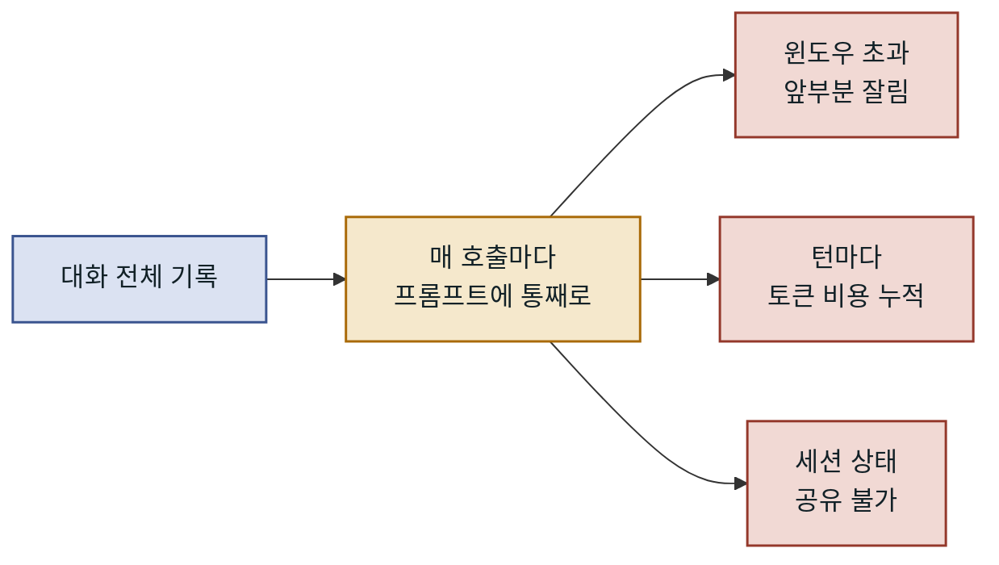

기록을 한 문자열에 몰아 두는 선택 하나가 세 가지 한계로 갈라집니다.

---

## AI Agent 메모리의 유형과 역할

AI Agent의 메모리는 인간의 기억 구조에서 영감을 받아 설계됩니다. 인지 심리학에서 작업 기억(working memory), 장기 기억(long-term memory), 그리고 외부 참조(external reference)를 구분하는 것처럼, AI Agent도 동일한 구조로 메모리를 나눌 수 있습니다. 이 구분이 단순한 메타포에 머무르지 않고 실제 설계 결정으로 이어지는 이유는, 각 유형이 서로 다른 **생존 주기(lifetime)**, **접근 비용(access cost)**, **갱신 빈도(update frequency)**를 갖기 때문입니다. 이 세 가지 차원을 기준으로 어떤 정보를 어떤 메모리에 배치할지를 결정하는 것이 메모리 레이어 설계의 핵심입니다.

### 메모리 생존 주기와 접근 범위

단기 메모리는 현재 실행 중인 단일 세션이나 태스크 범위에서만 유효합니다. 에이전트가 종료되거나 새 세션이 시작되면 단기 메모리는 사라집니다. 장기 메모리는 세션을 넘어 영속적으로 저장되며, 특정 사용자나 에이전트 인스턴스가 재실행될 때 다시 불러옵니다. 외부 메모리는 에이전트가 직접 관리하지 않는 외부 지식 저장소로, 필요할 때 쿼리나 API 호출을 통해 접근합니다. 이 세 유형은 서로 배타적이지 않으며, 하나의 에이전트가 세 가지를 동시에 활용하는 것이 일반적입니다.

| 유형 | 생존 주기 | 저장 위치 | 접근 방식 | 주요 용도 |
|------|----------|----------|----------|----------|
| 단기(Working) | 단일 세션/태스크 | 인프로세스(In-process) | 직접 참조 | 현재 대화, 중간 결과 |
| 장기(Persistent) | 영속(Persistent) | DB / Vector Store | 쿼리 검색 | 사용자 선호, 이전 작업 기록 |
| 외부(External) | 에이전트 외부 | 외부 시스템 | 도구 호출 | 최신 정보, 조직 지식 베이스 |

### 메모리 유형별 데이터 흐름

각 메모리 유형은 에이전트의 추론 루프(reasoning loop) 내에서 서로 다른 시점에 개입합니다. 단기 메모리는 LLM에게 직접 주입되는 컨텍스트이며, 장기 메모리는 "어떤 내용을 컨텍스트에 포함할지" 결정하는 검색 단계를 거칩니다. 외부 메모리는 LLM이 도구 호출(tool call)을 결정한 다음에야 접근됩니다. 이 시퀀스를 이해하는 것이 레이어 설계의 출발점입니다.

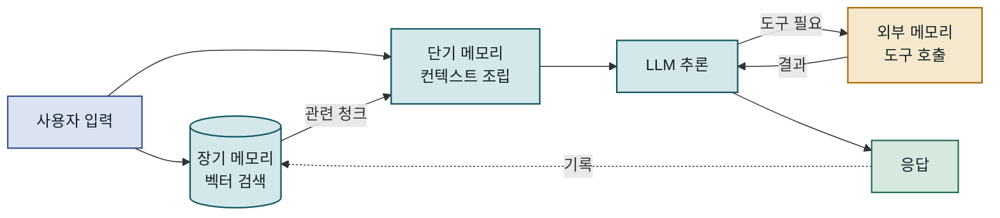

장기 메모리는 LLM을 부르기 전에, 외부 메모리는 LLM이 필요하다고 판단한 뒤에 개입합니다.

### 메모리와 상태(State)의 차이

에이전트 설계에서 자주 혼동되는 개념이 메모리와 상태입니다. **상태(State)**는 에이전트가 현재 수행 중인 작업의 진행 정도를 나타내는 구조화된 데이터입니다. 예를 들어 현재 처리 단계, 수집된 파라미터, 서브태스크 완료 여부 같은 것들입니다. **메모리(Memory)**는 더 넓은 개념으로, 상태를 포함하여 과거 경험, 사용자 정보, 도메인 지식까지 아우릅니다. 실제 프로젝트에서는 상태 머신(State Machine)으로 에이전트 흐름을 제어하고, 메모리 레이어로 지식을 보강하는 이중 구조가 권장됩니다. 이 둘을 같은 저장소에 혼재시키면 디버깅이 어렵고 메모리 오염 문제가 발생할 수 있습니다.

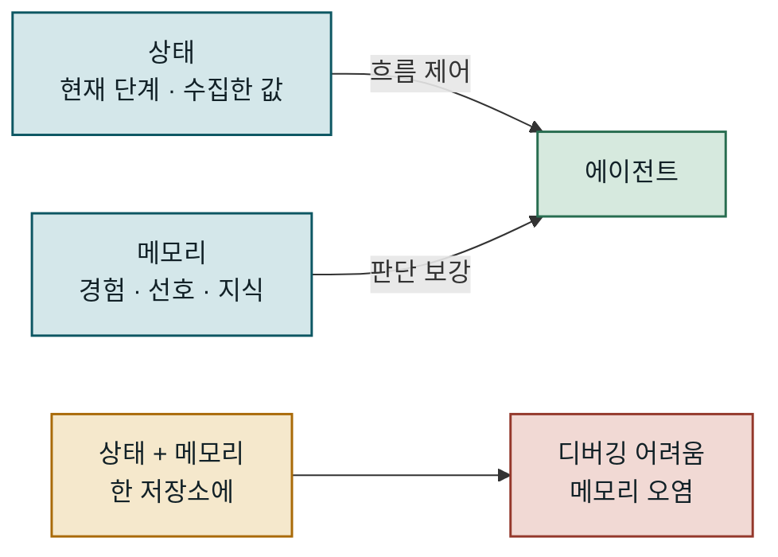

위처럼 상태는 흐름을, 메모리는 판단을 따로 맡습니다. 아래처럼 한 저장소에 섞으면 둘의 경계가 흐려집니다.

---

## 단기 메모리 설계 — 컨텍스트와 세션 관리

단기 메모리는 AI Agent가 현재 대화나 태스크를 수행하는 동안 유지하는 정보의 집합입니다. LLM의 입력 프롬프트에 직접 삽입되기 때문에, 단기 메모리의 설계는 곧 **프롬프트 엔지니어링**과 **토큰 예산 관리**의 문제이기도 합니다. 단기 메모리가 너무 작으면 에이전트가 앞의 대화를 잊어버리고, 너무 크면 관련 없는 내용이 LLM의 주의를 분산시키거나 비용이 과도하게 증가합니다. 따라서 단기 메모리 설계의 핵심은 "무엇을 얼마나 오래 컨텍스트에 유지할 것인가"를 명확한 기준으로 결정하는 것입니다.

### 컨텍스트 윈도우 구성 전략

컨텍스트 윈도우는 단기 메모리가 실제로 LLM에 전달되는 공간입니다. 이를 효율적으로 사용하려면 우선순위 기반 슬롯 할당이 필요합니다. 일반적으로 시스템 프롬프트(역할 정의, 지시사항)에 전체 윈도우의 10~20%, 장기 메모리에서 검색된 관련 청크에 20~30%, 최근 대화 기록에 30~40%, 현재 사용자 입력과 도구 결과에 나머지를 배분합니다. 이 비율은 고정된 것이 아니라 에이전트의 역할과 태스크 특성에 따라 조정해야 합니다. 예를 들어 단일 문서 분석 에이전트라면 검색된 청크 슬롯을 50% 이상으로 늘리는 것이 유리할 수 있습니다.

| 슬롯 | 권장 비율 | 내용 | 교체 주기 |
|------|----------|------|----------|
| 시스템 프롬프트 | 10~20% | 역할 정의, 제약 조건 | 세션 시작 시 고정 |
| 검색된 컨텍스트 | 20~30% | 장기 메모리에서 검색 결과 | 매 턴마다 재검색 |
| 대화 히스토리 | 30~40% | 최근 N턴 대화 | 슬라이딩 윈도우 |
| 현재 입력/도구 결과 | 10~20% | 이번 턴 데이터 | 매 턴 교체 |

### 슬라이딩 윈도우와 요약 압축

단기 메모리를 단순히 최근 N개 메시지만 유지하는 방식(슬라이딩 윈도우)은 구현이 쉽지만, 중요한 초기 정보가 잘릴 위험이 있습니다. 이를 보완하기 위해 **요약 압축(summarization compression)** 기법을 활용합니다. 오래된 메시지들을 LLM을 이용해 요약한 후, 원본 대신 요약을 컨텍스트에 포함하는 방식입니다. 이렇게 하면 정보 손실을 최소화하면서 토큰 수를 대폭 줄일 수 있습니다. 다만 요약 자체도 LLM 호출을 소비하므로, 요약 트리거 시점(예: 컨텍스트가 임계값의 80%를 초과할 때)을 신중하게 설정해야 합니다.

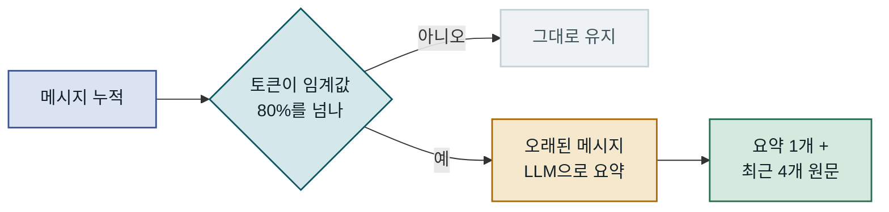

요약은 임계값을 넘을 때만 돌고, 가장 최근 대화는 요약 대상에서 빠집니다.

아래 코드는 슬라이딩 윈도우와 요약 압축을 결합한 단기 메모리 관리의 구현 예시입니다. 메시지가 누적되어 토큰 임계값에 근접하면 오래된 메시지를 자동으로 요약하고 최근 대화만 원문으로 보존합니다.

```python
from dataclasses import dataclass, field
from typing import List
from anthropic import Anthropic

@dataclass
class ShortTermMemory:
    max_tokens: int = 4096
    summary_threshold: float = 0.8   # 80% 초과 시 요약 트리거
    messages: List[dict] = field(default_factory=list)
    compressed_summary: str = ""

    def _estimate_tokens(self) -> int:
        # 간단한 토큰 추정: 4자 ≈ 1토큰 (현업에서는 tiktoken 사용 권장)
        return sum(len(m["content"]) for m in self.messages) // 4

    def add_message(self, role: str, content: str, client: Anthropic):
        self.messages.append({"role": role, "content": content})
        if self._estimate_tokens() > self.max_tokens * self.summary_threshold:
            self._compress(client)

    def _compress(self, client: Anthropic):
        to_summarize = self.messages[:-4]   # 최근 4개 제외한 나머지 요약
        if not to_summarize:
            return
        prompt = (
            "다음 대화를 핵심 사실과 결정 사항 위주로 3~5문장으로 요약하세요.\n\n"
            + "\n".join(f"{m['role']}: {m['content']}" for m in to_summarize)
        )
        resp = client.messages.create(
            model="claude-opus-4-5",
            max_tokens=512,
            messages=[{"role": "user", "content": prompt}]
        )
        self.compressed_summary = resp.content[0].text   # 결과: 요약 텍스트 저장
        self.messages = self.messages[-4:]               # 최근 4개만 보존

    def build_context(self) -> List[dict]:
        ctx = []
        if self.compressed_summary:
            ctx.append({"role": "user",
                        "content": f"[이전 대화 요약]\n{self.compressed_summary}"})
            ctx.append({"role": "assistant", "content": "이전 내용을 참고하겠습니다."})
        ctx.extend(self.messages)
        return ctx
```

이 구조의 핵심은 압축 후에도 **최근 대화의 원본**을 보존한다는 점입니다. 요약은 항상 정보 손실을 수반하므로, 가장 최근의 컨텍스트는 원문 그대로 유지하는 것이 응답 정확도에 유리합니다. 또한 `compressed_summary`를 사용자 메시지 형태로 주입하는 방식은, 시스템 프롬프트를 수정하지 않고도 요약 내용을 자연스럽게 전달한다는 점에서 구조적 유연성을 높여 줍니다.

### 멀티턴 태스크에서의 상태 보존

에이전트가 여러 단계에 걸쳐 하나의 태스크를 수행할 때는 단순한 메시지 히스토리 외에 **태스크 상태(task state)**도 단기 메모리의 일부로 관리해야 합니다. 예를 들어 코드 리뷰 에이전트가 여러 파일을 순서대로 검토할 때, 어느 파일까지 처리했는지와 어떤 이슈가 발견됐는지를 별도 구조체에 유지하지 않으면 LLM에게 모든 판단을 맡기게 되어 일관성이 떨어집니다. 태스크 상태는 프롬프트 문자열이 아닌 정형화된 딕셔너리나 Pydantic 모델로 관리하고, LLM에 전달할 때만 직렬화(serialize)하는 패턴이 유지보수에 유리합니다. 이 패턴은 에이전트 재시작 시 상태를 복원하거나, 태스크를 다른 에이전트에 위임할 때도 일관된 인터페이스를 제공합니다.

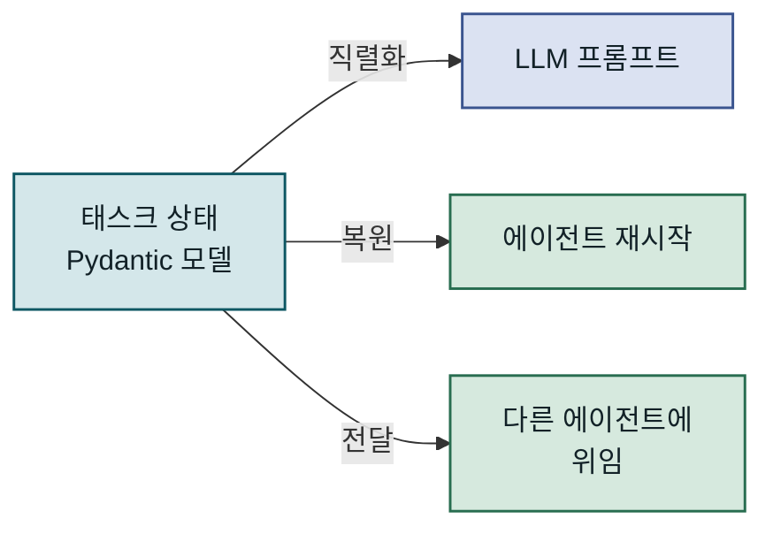

상태를 구조체로 들고 있으면 프롬프트, 재시작, 위임이 모두 같은 원본을 씁니다.

---

## 장기 메모리 설계 — 벡터 DB와 에피소딕 기억

장기 메모리는 에이전트가 세션을 종료한 후에도 남아야 하는 정보를 다룹니다. 사용자의 선호도, 이전 프로젝트에서 사용한 접근법, 특정 도메인에서 반복적으로 등장하는 지식 등이 여기에 해당합니다. 장기 메모리 설계에서 가장 중요한 결정은 **무엇을 저장할 것인가**와 **어떻게 검색할 것인가**입니다. 이 두 가지 결정이 에이전트의 장기적 성능과 비용 효율성을 좌우합니다. 모든 것을 무분별하게 저장하면 검색 노이즈가 증가하고, 반대로 너무 선택적으로 저장하면 에이전트가 과거 경험을 활용하지 못하게 됩니다.

### 에피소딕 메모리와 시맨틱 메모리의 구분

장기 메모리 내에서도 저장 대상에 따라 성격이 달라집니다. **에피소딕 메모리(episodic memory)**는 "언제 어떤 일이 있었는가"에 관한 기록입니다. 특정 사용자가 2025년 3월에 결제 시스템 오류를 보고했고 어떤 방법으로 해결됐는지와 같은 사건 기록이 여기에 해당합니다. 반면 **시맨틱 메모리(semantic memory)**는 "어떤 사실을 알고 있는가"에 관한 지식으로, 도메인 개념, 규칙, 사용자의 일반적인 선호도가 포함됩니다. 이 두 유형은 저장 방식과 검색 전략이 다르기 때문에 분리하여 관리하는 것이 권장됩니다.

| 구분 | 에피소딕 메모리 | 시맨틱 메모리 |
|------|---------------|-------------|
| 핵심 질문 | "언제, 무슨 일이?" | "무엇을 알고 있는가?" |
| 저장 단위 | 사건/대화 청크 | 사실/규칙/선호도 |
| 검색 기준 | 시간·사용자 필터 + 의미 검색 | 의미 유사도 |
| 갱신 방식 | 새 이벤트 추가(append-only) | 덮어쓰기 또는 버전 관리 |
| 활용 예시 | "지난번에 이 오류를 어떻게 해결했는가" | "이 사용자는 Python을 선호한다" |

### 벡터 임베딩 기반 검색 설계

장기 메모리의 검색 품질은 에이전트의 실제 활용 가능성을 결정합니다. 단순 키워드 검색으로는 의미적으로 연관된 정보를 찾기 어렵기 때문에, 대부분의 현대적 AI Agent 시스템은 **벡터 임베딩(vector embedding)**을 기반으로 한 유사도 검색을 사용합니다. 텍스트를 고차원 벡터로 변환한 후, 코사인 유사도나 내적(dot product)으로 관련 청크를 검색하는 방식입니다. 이때 검색 품질에 영향을 미치는 요소는 임베딩 모델의 품질, 청킹(chunking) 전략, 메타데이터 필터링의 조합입니다. 특히 에피소딕과 시맨틱을 별도 컬렉션으로 분리하면, 검색 시 노이즈를 줄이고 유형별로 다른 갱신 정책을 적용할 수 있습니다.

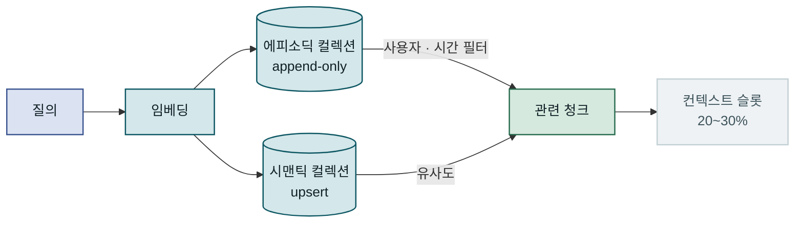

같은 질의가 두 컬렉션을 따로 거치고, 합쳐진 결과만 컨텍스트 슬롯에 들어갑니다.

아래는 `chromadb`를 활용하여 에피소딕/시맨틱 메모리를 분리 관리하는 구현 예시입니다. 에피소딕 메모리는 항목을 계속 추가하고, 시맨틱 메모리는 동일 `fact_id`에 대해 upsert(갱신)를 허용합니다.

```python
import chromadb
from anthropic import Anthropic
from datetime import datetime

class LongTermMemory:
    def __init__(self, user_id: str):
        self.user_id = user_id
        self.db = chromadb.PersistentClient(path="./memory_store")
        # 에피소딕/시맨틱을 컬렉션으로 분리하여 노이즈 감소
        self.episodic = self.db.get_or_create_collection("episodic")
        self.semantic = self.db.get_or_create_collection("semantic")

    def store_episode(self, content: str, metadata: dict = {}):
        ep_id = f"{self.user_id}_{datetime.now().isoformat()}"
        self.episodic.add(
            ids=[ep_id],
            documents=[content],
            metadatas=[{"user_id": self.user_id,
                        "timestamp": datetime.now().isoformat(), **metadata}]
        )  # 결과: 새 에피소드가 append-only 방식으로 추가됨

    def store_fact(self, fact_id: str, content: str):
        uid = f"{self.user_id}_{fact_id}"
        existing = self.semantic.get(ids=[uid])
        if existing["ids"]:
            self.semantic.update(   # 기존 사실 갱신(upsert)
                ids=[uid], documents=[content],
                metadatas=[{"user_id": self.user_id,
                            "updated_at": datetime.now().isoformat()}]
            )
        else:
            self.semantic.add(
                ids=[uid], documents=[content],
                metadatas=[{"user_id": self.user_id,
                            "created_at": datetime.now().isoformat()}]
            )

    def retrieve(self, query: str, n_results: int = 3) -> dict:
        ep = self.episodic.query(
            query_texts=[query], n_results=n_results,
            where={"user_id": self.user_id}
        )
        sem = self.semantic.query(
            query_texts=[query], n_results=n_results,
            where={"user_id": self.user_id}
        )
        return {
            "episodes": ep["documents"][0],   # 결과: 관련 에피소드 문서 목록
            "facts": sem["documents"][0]       # 결과: 관련 사실 문서 목록
        }
```

이 코드의 핵심은 에피소딕 메모리는 `append-only`로 새 항목을 추가하고, 시맨틱 메모리는 `upsert`로 기존 사실을 갱신한다는 점입니다. 같은 벡터 DB를 사용하더라도 컬렉션을 분리함으로써 검색 시 노이즈를 줄이고 갱신 정책을 유형별로 다르게 적용할 수 있습니다.

### 장기 메모리 갱신과 망각 전략

장기 메모리가 계속 쌓이면 검색 성능이 저하되고 오래된 정보가 최신 판단을 오염시킬 수 있습니다. 이를 방지하기 위해 **망각(forgetting) 전략**이 필요합니다. 가장 단순한 방법은 TTL(Time-To-Live)을 설정해 일정 기간이 지난 에피소딕 메모리를 자동 삭제하는 것입니다. 더 정교한 방법은 접근 빈도와 중요도를 결합한 가중치를 부여하여, 자주 검색되고 중요도가 높은 메모리는 장기 보존하고 그렇지 않은 것은 삭제 또는 압축하는 것입니다. 이 개념은 Ebbinghaus의 망각 곡선(forgetting curve)에서 영감을 받은 것으로, AI Agent 연구에서도 적극적으로 채택되고 있습니다. 망각 전략 없이 운영하면 6개월 이상 운영된 에이전트에서 검색 응답 시간이 눈에 띄게 느려지는 경향이 있습니다.

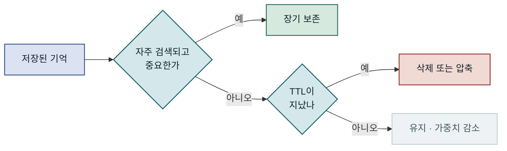

보존 여부를 한 번에 정하지 않고, 중요도와 나이를 차례로 거릅니다.

---

## 외부 메모리 설계 — 도구 호출과 지식 베이스

외부 메모리는 에이전트가 직접 소유하거나 관리하지 않는 정보 원천입니다. 기업의 사내 위키, 실시간 API 데이터, 관계형 데이터베이스 쿼리 결과 등이 여기에 해당합니다. 외부 메모리의 특징은 에이전트가 **도구 호출(tool call)을 통해 능동적으로 정보를 가져온다**는 점입니다. 이 때문에 외부 메모리는 단기·장기 메모리와 달리 에이전트의 추론 능력, 즉 도구를 언제 호출할지 결정하는 능력과 직결됩니다. 외부 메모리가 제대로 작동하려면 도구 인터페이스 설계와 LLM의 도구 선택 능력이 함께 성숙해야 합니다.

### RAG와 외부 메모리의 설계 차이

**RAG(Retrieval-Augmented Generation)**와 외부 메모리는 혼동되기 쉽지만 근본적인 차이가 있습니다. RAG는 사전에 정해진 지식 베이스에서 관련 청크를 자동으로 검색하여 프롬프트에 포함하는 **수동적·자동적** 방식입니다. 반면 외부 메모리는 에이전트가 스스로 "어떤 도구를 사용해 어떤 정보를 가져올지"를 결정하는 **능동적·선택적** 방식입니다. RAG에서는 검색이 항상 자동 실행되지만, 외부 메모리 접근은 에이전트가 필요하다고 판단했을 때만 발생합니다.

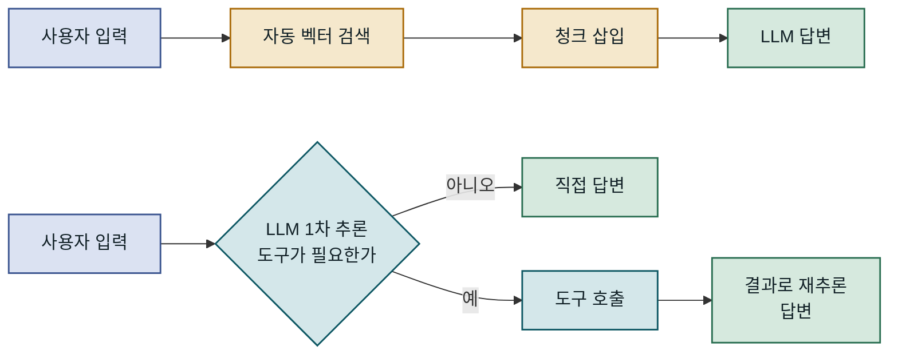

위가 RAG, 아래가 외부 메모리 방식입니다. 위는 검색이 항상 먼저 돌고, 아래는 LLM이 필요하다고 판단할 때만 도구로 나갑니다.

이 차이는 운영 환경에서 큰 영향을 미칩니다. RAG는 검색 품질에 의존하므로 관련 없는 청크가 삽입될 위험이 있지만 응답 속도가 빠릅니다. 외부 메모리(도구 호출) 방식은 에이전트가 판단을 잘못하면 필요한 정보를 아예 가져오지 않을 수 있지만, 불필요한 정보 삽입을 줄이고 최신 데이터에 접근할 수 있다는 장점이 있습니다.

### 외부 메모리 도구 설계 원칙

외부 메모리 도구를 설계할 때는 세 가지 원칙이 중요합니다. 첫째, **도구 인터페이스는 LLM이 이해하기 쉽도록 자연어 설명을 충분히 제공**해야 합니다. 도구 이름과 파라미터 설명이 모호하면 LLM이 도구를 잘못 호출하거나 아예 호출을 건너뛸 수 있습니다. 둘째, **각 도구는 단일 책임을 가져야** 합니다. 하나의 도구가 너무 많은 역할을 하면 LLM이 어떤 상황에서 이 도구를 써야 할지 판단하기 어렵습니다. 셋째, **도구 호출 결과는 구조화된 형태로 반환**해야 합니다. LLM이 도구 결과를 자연스럽게 이해하고 후속 추론에 활용하려면 JSON처럼 명확한 형식이 자연어보다 유리합니다.

| 원칙 | 좋은 예 | 피해야 할 예 |
|------|--------|------------|
| 명확한 도구명 | `search_user_history(user_id, query)` | `get_info(params)` |
| 단일 책임 | `lookup_product(id)`, `list_orders(user)` 분리 | `query_database(sql)` 하나로 통합 |
| 구조화된 결과 | `{"title": ..., "content": ..., "score": ...}` | "찾은 결과입니다: ..." 자연어 반환 |
| 오류 처리 | `{"error": "not_found", "suggestion": ...}` | 빈 문자열 반환 |

### 외부 메모리 연동 시 지연 관리

외부 메모리 접근은 네트워크 I/O를 수반하므로 지연(latency)이 발생합니다. 단일 API 호출이 수백 밀리초를 소비하면, 여러 도구를 순차 호출하는 에이전트는 응답 시간이 크게 늘어납니다. 이를 완화하기 위해 **병렬 도구 호출(parallel tool calling)**을 지원하는 프레임워크를 선택하거나, 의존 관계가 없는 도구 호출을 동시에 실행하는 전략을 취해야 합니다. Claude API를 비롯한 최신 LLM API는 한 번의 응답에서 여러 도구 호출을 반환하는 기능을 제공하며, 이를 `asyncio`로 비동기 실행하면 전체 지연을 실질적으로 줄일 수 있습니다. 경험적으로, 병렬 도구 호출을 적용하면 3개의 순차 호출(각 300ms)을 단일 라운드 300ms로 처리하는 효과를 얻을 수 있습니다.

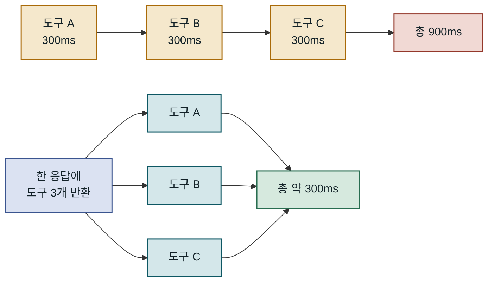

위가 순차 호출, 아래가 `asyncio`로 동시에 실행한 병렬 호출입니다. 전체 지연이 가장 느린 도구 하나 수준으로 줄어듭니다.

---

## 메모리 레이어 선택 기준과 트레이드오프

세 가지 메모리 유형을 이해했다면, 다음 단계는 실제 프로젝트에서 어떤 메모리를 언제 사용할지 결정하는 것입니다. 이 결정은 에이전트가 다루는 정보의 특성, 요구되는 응답 속도, 허용 가능한 비용, 그리고 데이터 프라이버시 요건에 따라 달라집니다. 단일 메모리 유형으로 모든 요구를 충족하려 하면 비효율이 발생하고, 반대로 모든 유형을 무분별하게 조합하면 복잡도만 높아집니다. 의사결정의 기준을 명확히 하는 것이 설계의 출발점입니다.

### 어떤 정보를 어느 레이어에 저장할 것인가

메모리 레이어 선택의 핵심 기준은 **정보의 생존 주기**, **접근 빈도**, **개인화 정도**입니다. 현재 태스크에만 필요한 임시 계산 결과나 사용자 입력은 단기 메모리에 둡니다. 여러 세션에 걸쳐 반복적으로 필요하고 사용자별로 다른 정보(선호도, 과거 결정 이유)는 장기 메모리에 저장합니다. 에이전트가 생성하거나 소유하지 않는 외부 권위 있는 데이터(API 응답, 데이터베이스 레코드)는 외부 메모리로 접근합니다. 이 분류 기준을 플로우차트로 정리하면 현장에서 빠르게 결정할 수 있습니다.

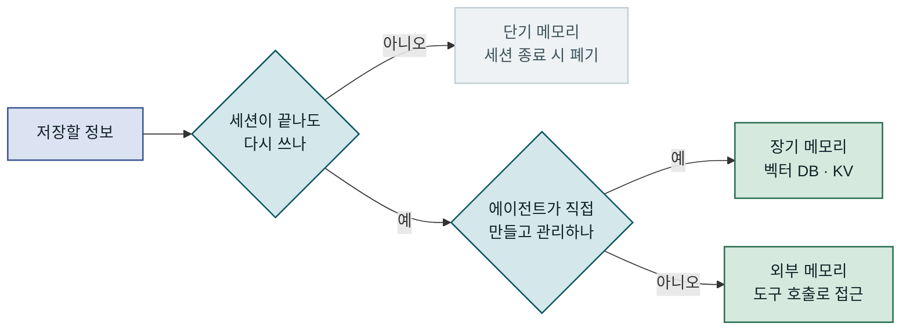

질문 두 개면 세 레이어 중 어디에 둘지가 정해집니다.

### 성능과 비용 트레이드오프

각 메모리 레이어는 서로 다른 비용 구조를 가집니다. 단기 메모리는 LLM 입력 토큰 비용으로 직결되며, 내용이 길수록 매 호출마다 비용이 증가합니다. 장기 메모리는 벡터 DB 저장 비용, 임베딩 생성 비용, 그리고 검색 지연이 발생합니다. 외부 메모리는 API 호출 비용과 추가 LLM 추론 라운드가 필요합니다. 세 가지를 조합할 때는 각 레이어가 실제로 응답 품질을 얼마나 높이는지를 측정하고, 기여도 대비 비용이 합리적인지 판단해야 합니다.

| 메모리 유형 | 응답 지연 | 토큰 비용 | 저장 비용 | 정보 최신성 | 주의점 |
|------------|---------|---------|---------|-----------|-------|
| 단기 메모리 | 없음 | 높음(크기 비례) | 없음 | 항상 최신 | 컨텍스트 길이 상한 |
| 장기 메모리 | 저~중 | 낮음(검색 결과만) | 중간 | 저장 시점 기준 | 검색 품질 의존 |
| 외부 메모리 | 중~고(I/O) | 낮음~중간 | 없음(외부 관리) | 항상 최신 | LLM 도구 판단 오류 |

> 토큰 비용 최적화의 핵심은 "무엇을 LLM이 직접 볼 필요가 있는가"를 끊임없이 좁히는 것입니다. 저장 비용보다 추론 비용이 훨씬 크다는 사실을 항상 기억해야 합니다.

### 운영 환경 적용 시 고려사항

메모리 레이어를 운영 환경에 배포할 때 가장 자주 간과되는 문제는 **동시성(concurrency)**과 **데이터 격리(isolation)**입니다. 여러 사용자가 동시에 에이전트를 사용하는 환경에서는 장기 메모리의 읽기/쓰기 충돌이 발생할 수 있습니다. 특히 에피소딕 메모리를 append-only 방식으로 관리할 때도 벡터 DB의 인덱스 갱신이 원자적이지 않을 수 있어, 일시적인 검색 일관성 문제가 나타날 수 있습니다. 이를 방지하려면 사용자별로 독립된 컬렉션 또는 네임스페이스를 사용하고, 메모리 쓰기 작업은 별도의 비동기 큐를 통해 처리하는 것이 안전합니다.

또한 장기 메모리에는 개인 식별 정보(PII)가 포함될 가능성이 높습니다. GDPR, PIPA(개인정보 보호법) 등의 규제를 준수하려면 사용자가 자신의 메모리 데이터를 삭제할 수 있는 API를 제공해야 하며, 저장 시 암호화와 접근 제어도 필수입니다. 메모리 레이어를 단순한 기술 컴포넌트가 아니라 **데이터 거버넌스 대상**으로 취급하는 시각이 필요합니다. 이 관점이 없으면 에이전트가 성장할수록 규제 리스크도 함께 증가합니다.

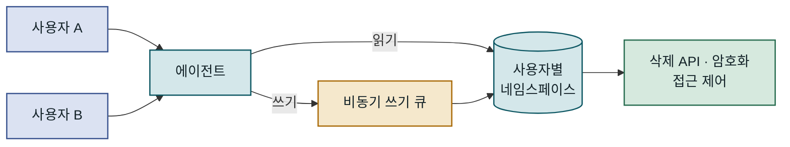

읽기는 사용자별 공간에서 바로 하고 쓰기는 큐를 거쳐 들어갑니다. 쌓인 기억은 그 자체로 삭제·암호화 대상입니다.

---

## 맺음말

### 핵심 요약

AI Agent의 메모리 레이어 설계는 에이전트의 지능과 유용성을 결정하는 핵심 아키텍처 결정입니다. 단기 메모리는 현재 세션의 컨텍스트를 관리하며 토큰 효율성이 핵심 관심사입니다. 슬라이딩 윈도우와 요약 압축을 결합하면 비용 증가 없이 대화 연속성을 유지할 수 있습니다. 장기 메모리는 세션을 넘어 에이전트의 "경험"을 축적하며, 에피소딕과 시맨틱을 분리하는 것이 검색 품질을 높이는 열쇠입니다. 외부 메모리는 에이전트가 통제할 수 없는 외부 세계의 정보를 도구 호출로 능동적으로 가져오는 방식으로, RAG와는 근본적으로 다른 설계 철학을 가집니다.

### 적용 판단 기준

새로운 AI Agent 시스템을 설계할 때 메모리 레이어의 복잡도는 단계적으로 높여 가는 것이 권장됩니다. 처음에는 단기 메모리(슬라이딩 윈도우)만으로 시작하고, 사용자 경험 개선이 필요하다는 명확한 근거가 생겼을 때 장기 메모리를 추가합니다. 외부 메모리는 에이전트가 "알 수 없는 최신 정보"를 필요로 하는 사용 사례가 구체적으로 정의됐을 때 도입하는 것이 복잡도 관리에 유리합니다. 모든 메모리 레이어를 처음부터 도입하면 각 레이어의 효과를 측정하기 어렵고, 장애 발생 시 원인 파악이 복잡해집니다.

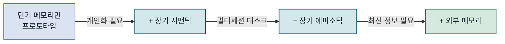

레이어는 필요가 확인될 때마다 하나씩 더합니다. 아래 표는 단계별 도입 이유입니다.

| 에이전트 성숙도 | 권장 메모리 구성 | 도입 이유 |
|--------------|----------------|---------|
| 초기 프로토타입 | 단기 메모리만 | 구현 단순, 빠른 검증 가능 |
| 사용자 개인화 필요 | + 장기(시맨틱) | 선호도·사용 패턴 축적 |
| 복잡한 태스크 지속 | + 장기(에피소딕) | 멀티세션 태스크 연속성 |
| 최신 정보 필요 | + 외부 메모리 | 실시간 데이터 접근 |
