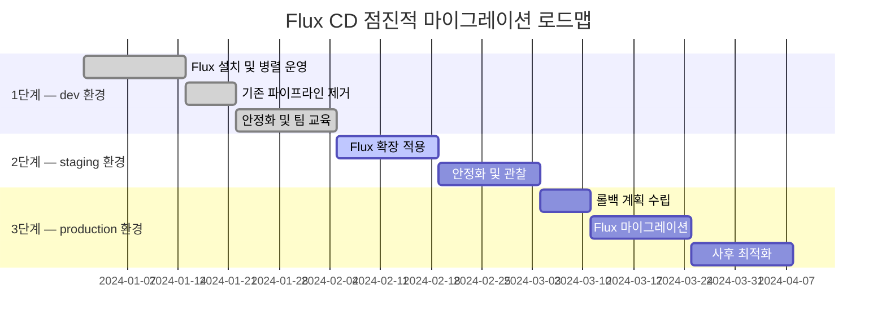

| 보안 계층 | 적용 방법 | 효과 | 주의점 |
|---|---|---|---|
| RBAC 분리 | serviceAccountName 필드 명시 | 네임스페이스별 권한 격리 | 과도한 분리는 운영 복잡도 증가 |
| 네트워크 정책 | NetworkPolicy로 이그레스 제한 | Git·레지스트리 외 외부 통신 차단 | 웹훅 Receiver IP 허용 필요 |
| SSH 키 관리 | 클러스터별 별도 Deploy Key | 하나의 키 유출이 전체에 영향 없음 | 키 로테이션 자동화 권장 |
| SOPS 복호화 키 | Age 키를 클러스터 Secret에 저장 | 복호화 권한이 클러스터 내부에 한정 | 키 백업 전략 필수 |

네트워크 정책으로 Flux 컨트롤러의 이그레스 트래픽을 Git 저장소와 컨테이너 레지스트리 주소로만 제한하면 추가적인 방어 계층이 생깁니다. 컨트롤러가 의도하지 않은 외부 주소로 데이터를 전송하는 시나리오를 방지하는 데 효과적입니다.

---

## 운영 환경 적용 시 고려사항

### 흔한 실수와 함정

Flux CD를 처음 도입하는 팀이 자주 마주치는 문제들이 있습니다. 가장 흔한 실수는 **Kustomization 의존성 순서를 고려하지 않는 것**입니다. 애플리케이션이 특정 CRD를 필요로 하는데 `dependsOn` 없이 동시에 적용되면, CRD가 등록되기 전에 해당 리소스를 생성하려다 `no kind is registered for the type` 오류가 반복됩니다. CRD를 설치하는 Kustomization과 해당 CRD를 사용하는 Kustomization을 분리하고 `dependsOn`으로 순서를 명시하면 이 문제가 해소됩니다.

두 번째는 **`prune: true` 없이 운영하다 발생하는 리소스 누적**입니다. Git에서 삭제한 매니페스트가 클러스터에 계속 남아 있으면 시간이 지날수록 Git과 클러스터의 격차가 커지고, 어느 시점부터는 무엇이 Flux로 관리되는지 파악하기 어려워집니다. `prune: true`를 기본으로 설정하되, StatefulSet의 PVC처럼 삭제하면 데이터가 사라지는 리소스에는 개별 보호 애노테이션을 적용합니다.

세 번째는 **무한 조정 루프**입니다. `HelmRelease`의 `values`에 현재 시각처럼 매번 바뀌는 값을 넣거나, 외부 컨트롤러가 Flux가 관리하는 필드를 계속 변경하면 Flux가 매번 "드리프트를 발견했다"고 판단하여 끊임없이 `apply`를 반복합니다. `gotk_reconcile_condition{status="True", type="Ready"}`가 계속 갱신되는 패턴이 보이면 의심해야 합니다.

| 실수 유형 | 증상 | 해결 방법 | 주의점 |
|---|---|---|---|
| dependsOn 미설정 | CRD not found 오류 반복 | infrastructure → apps 순서 명시 | 순환 의존성 금지 |
| prune: false 유지 | 삭제 리소스 클러스터 잔류 | prune: true + 보호 애노테이션 | PVC 삭제 주의 |
| 짧은 폴링 주기 | GitHub API Rate Limit 초과 | 웹훅 Receiver + 주기 5분으로 연장 | 웹훅 HMAC 검증 설정 필수 |
| 무한 조정 루프 | 지속적 apply 반복 | 변경 원인 필드 추적, valuesFrom 사용 | `flux events` 로 원인 파악 |
| fieldManager 충돌 | apply 시 conflict 오류 | 리소스 오너십 정리, HPA 충돌 확인 | SSA 충돌 로그 확인 |

> **실용적 팁**: `flux reconcile kustomization my-app --with-source` 명령으로 폴링 주기를 기다리지 않고 즉시 강제 동기화를 실행할 수 있습니다. 장애 대응 시간을 단축하는 데 유용하지만, 이 명령을 자주 사용한다면 자동화 설정을 재검토해야 할 신호입니다.

### 모니터링과 알림 구성

Flux CD는 각 CRD 오브젝트의 `.status` 필드에 상세한 상태 정보를 기록하며, Prometheus 메트릭 엔드포인트를 기본으로 제공합니다. `flux get all` 명령은 모든 Flux 오브젝트의 현재 상태를 한눈에 보여주며, `Ready` 컬럼이 `False`이면 `flux describe kustomization <이름>` 명령으로 이벤트 로그를 확인합니다.

`notification-controller`를 활용하면 Flux 이벤트를 Slack, Microsoft Teams, PagerDuty로 실시간 전달할 수 있습니다. `Alert` 오브젝트에서 `eventSeverity: error`로 필터링하면 정상 동기화 알림은 제외하고 문제 상황만 수신합니다. 조정 실패, 헬스 체크 실패, 이미지 업데이트 발생 이벤트를 채널별로 분리하여 수신하면 운영 가시성이 크게 높아집니다.

| Prometheus 메트릭 | 의미 | 경보 기준 | 주의점 |
|---|---|---|---|
| `gotk_reconcile_duration_seconds` | 각 조정 소요 시간 | p99 > timeout 50% | 히스토그램 버킷 설정 확인 |
| `gotk_reconcile_condition{status="False"}` | 조정 실패 상태 | 값 > 0 이면 즉시 경보 | Ready·Stalled 구분 |
| `gotk_source_duration_seconds` | 소스 폴링 소요 시간 | p99 > 30초 | 네트워크 지연 영향 |
| `controller_runtime_reconcile_errors_total` | API 서버 에러 누적 수 | 급격한 증가 시 | 클러스터 API 상태 연계 확인 |
| `gotk_suspend_status` | Suspend 여부 | 장시간 suspend 유지 | 수동 suspend 후 해제 누락 빈발 |

Grafana 대시보드는 Flux 커뮤니티가 제공하는 공식 대시보드(Grafana.com ID: 16714)를 임포트하여 사용할 수 있습니다. 조정 성공률, 소요 시간, 리소스별 상태를 시각화하며, 대규모 클러스터 환경에서는 네임스페이스·컨트롤러별로 패널을 분리하면 문제 위치를 빠르게 좁힐 수 있습니다.

### 마이그레이션 전략과 규모 확장

기존 CI/CD 환경에서 Flux CD로 전환할 때는 빅뱅(Big Bang) 방식보다 점진적 접근이 훨씬 안전합니다. dev 환경에 먼저 Flux를 설치하고 기존 파이프라인과 **병렬로** 운영하면서, Flux가 올바르게 동기화되는지 충분히 관찰합니다. 드리프트 교정 동작, `prune` 동작, 비밀값 복호화가 모두 예상대로 작동함을 확인한 후 기존 파이프라인의 `kubectl apply` 단계를 제거합니다. staging을 확장한 뒤, production은 마지막으로 마이그레이션하며 상세한 롤백 계획을 수립해 둡니다.

<!-- fig: flux-migration-phases -->

*환경별 3단계 점진적 마이그레이션 로드맵 — 각 단계 완료를 확인한 후 다음 단계로 진행*

클러스터 수가 수십 개로 늘어나면 각 클러스터마다 `flux bootstrap`을 별도로 실행하고 설정을 관리하는 것이 번거로울 수 있습니다. **Flux Operator**는 Flux 인스턴스 자체를 쿠버네티스 리소스(`FluxInstance` CRD)로 관리하여, Flux 설치·업그레이드·설정 변경을 중앙에서 일관되게 처리합니다. Terraform으로 클러스터를 프로비저닝할 때 Flux Operator 설치와 `FluxInstance` 생성을 함께 자동화하면, 새 클러스터 온보딩이 완전히 코드로 표현됩니다.

---

## 맺음말

### 핵심 요약

Flux CD는 Pull 기반 아키텍처로 CI 서버의 클러스터 접근 권한을 제거하고, Git을 단일 진실 공급원으로 삼아 클러스터 상태 드리프트를 자동으로 감지하고 교정합니다. `clusters/`·`apps/`·`infrastructure/` 세 디렉토리 구조와 Kustomize 오버레이 패턴은 멀티 환경 설정의 중복을 최소화하면서 환경별 차이를 코드로 명확히 표현하는 검증된 방법입니다. 자체 개발 서비스는 Kustomize로, 외부 오픈소스 컴포넌트는 Helm으로 관리하는 혼합 전략이 현업에서 가장 널리 정착된 패턴입니다.

SOPS 기반 비밀값 암호화, `dependsOn`을 이용한 배포 순서 보장, 웹훅 기반 실시간 동기화는 단순 설치를 넘어 운영 안정성을 높이는 핵심 설정입니다. `image-automation-controller`까지 구성하면 Git 커밋에서 클러스터 배포까지 사람의 개입 없이 완결되는 루프가 완성됩니다.

### 적용 판단 기준

Flux CD가 특히 적합한 상황을 정리하면 다음과 같습니다. 여러 클러스터를 독립적으로 운영하면서 단일 Git 저장소로 일관성을 유지하고 싶을 때, CI 서버에 쿠버네티스 자격증명을 저장하는 것이 보안상 부담스러울 때, 클러스터 상태 드리프트를 자동으로 교정하는 자가 복구 메커니즘이 필요할 때입니다.

반면, 팀이 시각적 대시보드를 통해 여러 클러스터를 중앙에서 통합 관리해야 하거나 비개발 직군도 배포 현황을 파악해야 하는 환경이라면 ArgoCD가 더 자연스러운 선택일 수 있습니다. GitOps 도구의 이점은 환경 수와 팀 규모가 커질수록 두드러지므로, 단일 소규모 환경에서는 기존 파이프라인 방식이 더 단순할 수도 있습니다. Flux CD의 공식 문서와 멀티 환경 예제 저장소는 [fluxcd.io](https://fluxcd.io)에서, CNCF 졸업 프로젝트 상세 정보는 [cncf.io/projects/flux](https://www.cncf.io/projects/flux/)에서 확인할 수 있습니다. GitHub의 `flux2-kustomize-helm-example` 저장소는 이 글에서 설명한 구조를 그대로 구현한 공식 예제로, 실제 프로젝트 시작점으로 활용하기에 적합합니다.
