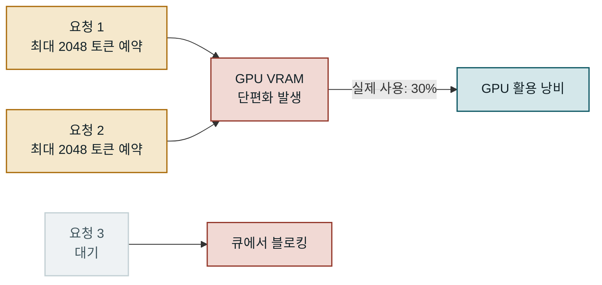
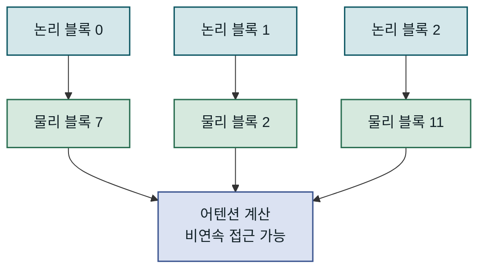
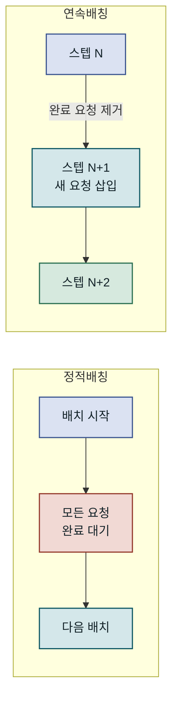
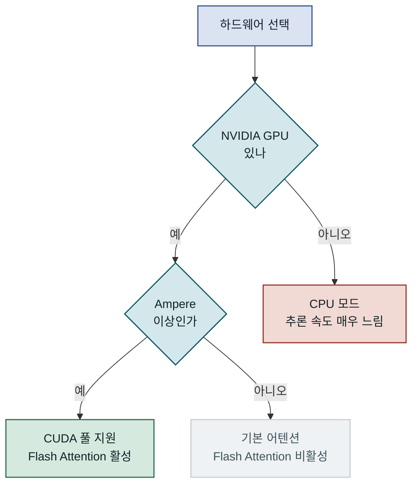
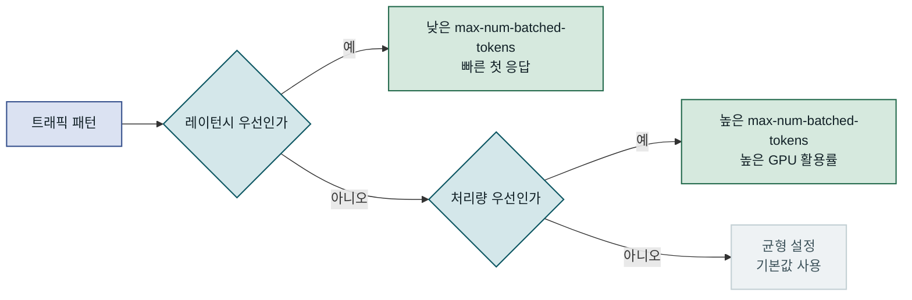
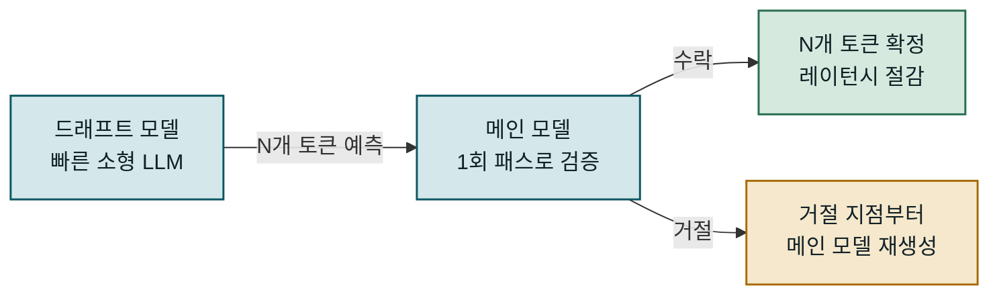
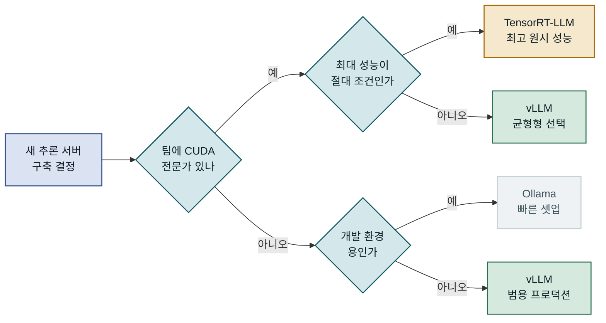
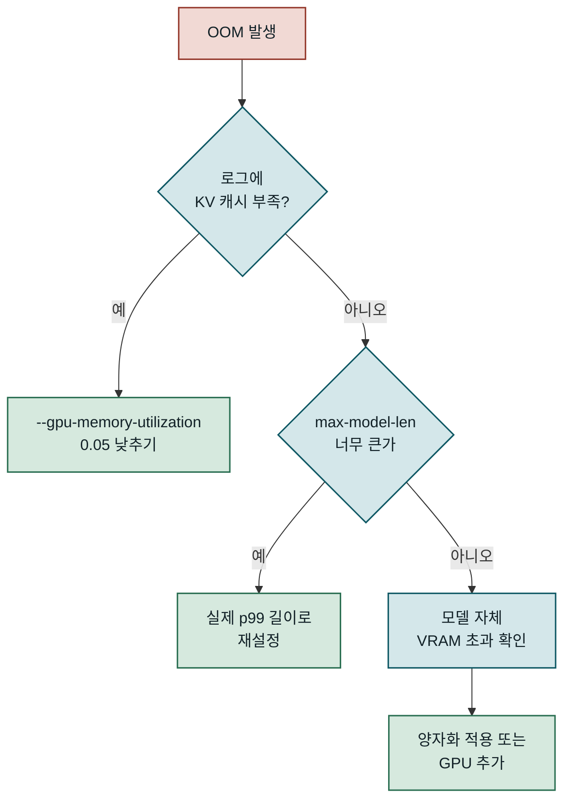
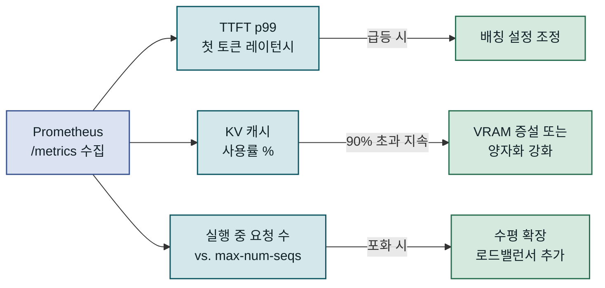

## 목차

1. 개요
2. vLLM의 핵심 원리: PagedAttention과 연속 배칭
3. 추론 서버 환경 구성과 기본 서빙
4. 고성능 서빙 설정과 파라미터 튜닝
5. 다른 추론 프레임워크와의 비교
6. 운영 환경 적용 시 고려사항
7. 맺음말

---

## 개요

오픈소스 LLM을 프로덕션에서 운용하려 할 때, 단순히 `transformers` 라이브러리로 모델을 불러오는 방식은 GPU 메모리 낭비가 심각하고 처리량이 지나치게 낮습니다. vLLM은 이 문제를 정면으로 다루는 오픈소스 추론 엔진으로, UC Berkeley에서 개발되어 현재 가장 널리 쓰이는 LLM 서빙 프레임워크 중 하나입니다. PagedAttention이라는 혁신적인 KV 캐시 관리 기법과 연속 배칭(Continuous Batching)을 결합하여, 기존 방식 대비 처리량을 최대 24배까지 끌어올릴 수 있습니다. 이 글에서는 vLLM의 동작 원리부터 실제 추론 서버 구성, 파라미터 튜닝, 그리고 운영 환경에서 마주치는 함정까지 다룹니다.

### 문제 배경: GPU 메모리 낭비와 낮은 처리량

LLM 추론에서 가장 큰 병목은 KV 캐시(Key-Value Cache)입니다. 트랜스포머 모델이 토큰을 생성할 때마다, 이전 토큰들의 어텐션 키와 값 행렬을 메모리에 저장해야 합니다. 요청마다 최대 시퀀스 길이만큼 연속된 GPU 메모리를 사전 할당하면, 실제로 짧은 응답을 생성하더라도 긴 시퀀스용 메모리가 통째로 예약됩니다. 이 **메모리 단편화** 문제는 동시에 처리할 수 있는 요청 수를 심각하게 제한합니다.

전통적인 정적 배칭(Static Batching) 방식도 처리량 측면에서 근본적인 한계를 가집니다. 배치 내 한 요청이 1000 토큰, 다른 요청이 50 토큰을 생성한다면, 짧은 요청이 완료된 뒤에도 긴 요청이 끝날 때까지 GPU는 절반만 활용됩니다. 새 요청은 배치 전체가 종료되어야 삽입할 수 있어, 대기 시간과 GPU 유휴 시간이 함께 늘어납니다.

### 기존 방식의 한계

`transformers` 기반 서빙에서 나타나는 한계를 수치로 살펴보면 문제의 심각성이 명확해집니다. A100 80GB GPU에서 LLaMA-3 70B 모델을 8-bit 양자화로 불러올 때, 배치 크기 1로 처리하면 GPU 활용률이 20~30%에 그칩니다. 배치 크기를 늘리면 처리량은 오르지만, 최대 시퀀스 길이에 비례해 KV 캐시가 메모리를 선점하므로 OOM(Out of Memory) 오류가 빈번하게 발생합니다. FastAPI로 직접 추론 엔드포인트를 구성해도 이 근본 문제는 해결되지 않습니다. 라이브러리가 GPU 메모리 할당을 세밀하게 통제하지 않기 때문입니다.



기존 방식에서는 요청마다 최대 시퀀스 길이만큼 연속 메모리를 선점하여, GPU VRAM의 상당 부분이 실제로 사용되지 않은 채 낭비됩니다.

---

## vLLM의 핵심 원리: PagedAttention과 연속 배칭

vLLM의 성능 우위는 두 가지 핵심 기법에서 비롯됩니다. PagedAttention과 연속 배칭은 각각 메모리 효율과 처리량 문제를 해결하며, 두 기법이 결합될 때 시너지가 극대화됩니다.

### PagedAttention: 운영체제의 가상 메모리를 GPU에

PagedAttention은 운영체제의 페이징(Paging) 개념을 KV 캐시 관리에 그대로 가져옵니다. 기존에는 시퀀스 하나에 연속된 대형 메모리 블록이 필요했지만, PagedAttention은 KV 캐시를 **블록(Block)** 단위로 분리합니다. 블록 크기는 기본적으로 16~32 토큰이며, 각 블록은 GPU 메모리의 어느 위치에든 비연속적으로 배치할 수 있습니다.

이 구조의 핵심은 **블록 테이블(Block Table)** 입니다. 각 요청은 자신이 사용하는 물리 블록의 주소를 담은 논리-물리 매핑 테이블을 가집니다. 토큰이 추가될 때마다 새 물리 블록을 할당하고 테이블을 업데이트합니다. 요청이 완료되면 해당 물리 블록들을 즉시 반환합니다. 덕분에 메모리 단편화가 거의 사라지고, 실제 생성된 토큰 수에 딱 맞는 메모리만 소비됩니다.



논리 블록과 물리 블록이 분리되어 있어, GPU 메모리 어디에 블록이 있어도 어텐션 계산에 참여할 수 있습니다.

PagedAttention이 가져오는 또 다른 이점은 **복사-쓰기(Copy-on-Write) 기법을 통한 KV 캐시 공유**입니다. 동일한 시스템 프롬프트를 사용하는 요청들이 프롬프트 부분의 물리 블록을 공유하면, 중복 계산 없이 여러 요청이 초기 KV 캐시를 재활용합니다. 이는 챗봇처럼 고정된 시스템 프롬프트가 긴 경우 메모리 절감 효과가 특히 큽니다. 블록을 수정해야 할 때는 그 시점에 복사본을 만들어 독립성을 유지합니다.

### 연속 배칭: 빈 슬롯 없는 GPU 활용

연속 배칭(Continuous Batching), 또는 반복 레벨 스케줄링(Iteration-Level Scheduling)은 고정 배치의 낭비를 근본적으로 없앱니다. 기존 정적 배칭에서는 배치 단위로 요청을 묶고 전체가 완료될 때까지 다음 요청을 받지 않았습니다. 연속 배칭에서는 **각 토큰 생성 스텝(iteration)이 끝날 때마다** 완료된 요청을 빼고 새 요청을 즉시 삽입합니다.

실제 시스템에서 이 차이는 극명하게 드러납니다. 동시 접속 사용자가 50명이라면, 각자 생성하는 응답 길이가 제각각입니다. 연속 배칭이 없다면 가장 긴 응답이 끝날 때까지 다른 50명이 대기합니다. 연속 배칭을 적용하면 응답을 완료한 사용자의 GPU 슬롯에 즉시 새 요청이 들어와, GPU가 쉬지 않고 동작합니다.



정적 배칭은 배치 전체가 끝나야 다음 요청을 받지만, 연속 배칭은 매 스텝마다 완료된 슬롯을 채워 GPU 활용률을 극대화합니다.

### 스케줄러와 프리엠션

vLLM의 스케줄러는 대기 중인 요청, 실행 중인 요청, 스왑된(CPU로 이동된) 요청을 세 개의 큐로 관리합니다. GPU 메모리가 부족해지면 일부 요청의 KV 캐시를 CPU 메모리로 스왑아웃합니다. 메모리가 확보되면 다시 스왑인하여 추론을 재개합니다. 이 프리엠션 메커니즘 덕분에 시스템은 메모리 압박 상황에서도 OOM 없이 동작을 유지할 수 있습니다. 스왑 비용은 무시할 수 없지만, 아예 요청을 거절하거나 서버가 다운되는 것보다 훨씬 나은 폴백 전략입니다.

> **핵심**: vLLM의 메모리 낭비율(Waste)은 이론적으로 마지막 블록의 미사용 토큰 수에 한정됩니다. 기존 방식의 낭비가 전체 시퀀스 길이에 비례했던 것과 근본적으로 다릅니다.

---

## 추론 서버 환경 구성과 기본 서빙

vLLM은 설치와 기본 서버 기동이 비교적 단순하지만, 하드웨어 환경과 모델 크기에 따라 고려해야 할 변수가 많습니다. 특히 멀티-GPU 설정과 양자화 조합에서 선택의 폭이 넓어 초기 구성을 잘못 잡으면 성능이 기대에 미치지 못할 수 있습니다.

### 설치와 하드웨어 요구사항

vLLM은 CUDA 12.1 이상, Python 3.9 이상 환경을 요구합니다. NVIDIA GPU 기준으로 Ampere 아키텍처(A100, A10G, RTX 3090 이상)를 권장하며, Flash Attention 2 지원 여부가 성능에 직접 영향을 미칩니다. AMD GPU는 ROCm 백엔드를 통해 지원되지만, 안정성과 기능 면에서 CUDA보다 한 발 뒤처져 있습니다.

설치는 pip 단일 명령으로 끝나지만, CUDA 버전과 PyTorch 버전의 매트릭스를 반드시 확인해야 합니다. CUDA 12.1 환경이라면 `pip install vllm`으로 최신 안정 버전이 설치됩니다. 반면 CUDA 11.8 환경에서는 별도 빌드 인덱스를 지정해야 합니다. Docker 이미지를 활용하면 이 복잡성을 피할 수 있어 프로덕션 환경에서는 공식 Docker 이미지(`vllm/vllm-openai`)를 권장합니다.



Flash Attention 2 지원 여부는 vLLM의 성능 대부분을 좌우하므로, Ampere 이상 GPU가 현업에서 vLLM을 도입할 때 사실상 최소 조건입니다.

### OpenAI 호환 API 서버 기동

vLLM이 인기를 끄는 이유 중 하나는 OpenAI API와 완전 호환되는 서버를 한 줄 명령으로 띄울 수 있다는 점입니다. `/v1/completions`, `/v1/chat/completions`, `/v1/embeddings` 엔드포인트를 그대로 제공하여 기존 OpenAI SDK를 코드 수정 없이 연결할 수 있습니다.

아래는 Llama-3.1-8B-Instruct 모델을 4-bit AWQ 양자화로 서빙하는 기본 명령입니다. 단일 A10G(24GB) GPU에서도 동작할 수 있도록 양자화를 적용했습니다.

```bash
# vLLM OpenAI 호환 서버 기동
# --model: HuggingFace 모델 ID 또는 로컬 경로
# --quantization: 양자화 방식 (awq, gptq, fp8, bitsandbytes)
# --max-model-len: 지원할 최대 시퀀스 길이
# --gpu-memory-utilization: GPU VRAM 사용 비율 (기본 0.9)
# --tensor-parallel-size: 텐서 병렬화에 사용할 GPU 수

vllm serve meta-llama/Meta-Llama-3.1-8B-Instruct \
  --quantization awq \
  --max-model-len 8192 \
  --gpu-memory-utilization 0.85 \
  --tensor-parallel-size 1 \
  --host 0.0.0.0 \
  --port 8000 \
  --served-model-name llama3-8b

# 서버 기동 후 확인
# INFO:     Started server process [PID]
# INFO:     Uvicorn running on http://0.0.0.0:8000
# INFO:     # GPU blocks: 2340, # CPU blocks: 512
```

`GPU blocks` 수치가 중요합니다. vLLM은 시작 시점에 `--gpu-memory-utilization` 비율만큼 VRAM을 PagedAttention 블록으로 분할합니다. 블록 수가 많을수록 동시에 처리할 수 있는 토큰 수가 늘어나 배칭 효과가 커집니다. 블록이 너무 적으면 요청이 자주 스왑아웃되어 지연 시간이 증가합니다.

서버가 기동되면 기존 OpenAI 클라이언트로 곧바로 연결할 수 있습니다. `base_url`만 바꾸면 되므로, 이미 OpenAI API를 사용하는 서비스를 vLLM 기반 로컬 서버로 전환하는 데 코드 변경이 최소화됩니다.

### 멀티-GPU 텐서 병렬화 설정

70B 이상 모델은 단일 GPU에 올릴 수 없습니다. vLLM은 **텐서 병렬화(Tensor Parallelism)** 와 **파이프라인 병렬화(Pipeline Parallelism)** 를 모두 지원합니다. 텐서 병렬화는 어텐션 헤드와 FFN 레이어를 여러 GPU에 분산하여 레이턴시를 줄이는 방식이고, 파이프라인 병렬화는 레이어를 GPU별로 순차 배분하여 메모리 요구량을 낮추는 방식입니다.

| 병렬화 방식 | 적합한 상황 | 장점 | 주의점 |
|---|---|---|---|
| 텐서 병렬 | 레이턴시 중요, 동일 노드 GPU | 응답 시간 단축 | NVLink 없으면 PCIe 병목 |
| 파이프라인 병렬 | 메모리 부족, 노드 간 분산 | VRAM 요구량 분산 | 버블(idle stage) 발생 |
| 텐서+파이프라인 | 초대형 모델(>100B) | 최대 규모 지원 | 설정 복잡도 증가 |

실제로 Llama-3-70B를 4장의 A100 80GB에서 서빙할 때, `--tensor-parallel-size 4`를 주면 FP16 기준으로 각 GPU가 약 35GB를 사용합니다. GPU 간 통신은 NVLink가 있으면 이상적이지만, PCIe 4.0 환경에서도 배치 크기를 조정하면 실용적인 처리량을 얻을 수 있습니다.

---

## 고성능 서빙 설정과 파라미터 튜닝

vLLM은 기본 설정만으로도 높은 성능을 발휘하지만, 실제 트래픽 패턴과 SLA 요구사항에 맞게 파라미터를 조정하면 추가로 30~50%의 처리량 향상을 기대할 수 있습니다. 중요한 것은 파라미터 하나가 레이턴시, 처리량, 메모리 세 가지 목표에 동시에 영향을 미친다는 점입니다.

### 스케줄링과 배칭 파라미터

`--max-num-seqs`는 동시에 스케줄링하는 최대 시퀀스 수입니다. 이 값이 너무 크면 각 요청의 KV 캐시 블록이 부족해 스왑이 빈번해지고, 너무 작으면 GPU가 충분히 채워지지 않아 처리량이 떨어집니다. 경험적으로 GPU 블록 수를 최대 시퀀스 수의 예상 평균 토큰 수로 나눈 값이 `--max-num-seqs`의 상한선이 됩니다.

`--max-num-batched-tokens`는 한 번의 추론 패스에서 처리할 최대 토큰 수입니다. 프리필(Prefill) 단계와 디코딩(Decoding) 단계 모두에 적용되며, 높게 설정하면 첫 토큰 생성 시간(TTFT, Time to First Token)이 늘어나지만 전체 처리량은 증가합니다. 실시간 응답이 중요한 챗봇이라면 낮게 잡고, 배치 처리 위주라면 높게 잡는 것이 일반적입니다.



레이턴시와 처리량은 트레이드오프 관계이며, 트래픽 특성을 먼저 분석한 뒤 파라미터를 조정해야 합니다.

### 양자화 방식 선택

양자화는 모델 크기와 추론 속도를 조정하는 가장 강력한 수단입니다. vLLM이 지원하는 주요 양자화 방식은 AWQ, GPTQ, FP8, BitsAndBytes(bnb) 네 가지입니다.

**AWQ(Activation-Aware Weight Quantization)** 는 활성화 값의 분포를 고려하여 가중치를 4-bit로 압축합니다. 정확도 손실이 GPTQ보다 낮고 추론 속도가 빠르며, 현재 vLLM에서 가장 널리 권장되는 방식입니다. **GPTQ** 는 레이어별 오류 최소화 방식으로 4-bit 또는 3-bit 양자화를 수행하며, AWQ보다 약간 낮은 정확도를 보이는 대신 더 넓은 범위의 모델에 적용됩니다. **FP8** 는 NVIDIA H100/H200에서 하드웨어 가속을 받을 수 있어, Hopper 아키텍처 GPU를 사용한다면 가장 먼저 고려해야 할 옵션입니다. **BitsAndBytes** 는 설치가 간편하지만 vLLM에서 성능 최적화가 덜 되어 있어 개발·테스트 용도에 적합합니다.

| 양자화 방식 | 비트 수 | 속도 | 정확도 | 주요 용도 |
|---|---|---|---|---|
| FP8 | 8-bit | ★★★★★ | ★★★★★ | H100/H200 프로덕션 |
| AWQ | 4-bit | ★★★★☆ | ★★★★☆ | 범용 프로덕션 |
| GPTQ | 3~4-bit | ★★★☆☆ | ★★★☆☆ | 메모리 극한 절약 |
| BitsAndBytes | 4~8-bit | ★★☆☆☆ | ★★★★☆ | 개발·테스트 |

### Speculative Decoding으로 레이턴시 단축

Speculative Decoding은 작은 드래프트 모델이 여러 토큰을 미리 생성하고, 메인 모델이 한 번의 패스로 이를 검증하는 기법입니다. 드래프트 토큰이 검증을 통과하면 한 번의 포워드 패스로 여러 토큰을 확정할 수 있어, 레이턴시가 크게 줄어듭니다.

vLLM에서 Speculative Decoding을 활성화하려면 `--speculative-model`과 `--num-speculative-tokens` 파라미터를 추가합니다. 예를 들어 Llama-3-70B 메인 모델에 Llama-3-8B를 드래프트 모델로 붙이면, 응답 토큰의 어휘 분포가 비슷한 경우 레이턴시를 30~40% 단축할 수 있습니다. 단, 드래프트 모델이 메인 모델과 어휘 분포가 유사해야 효과가 크고, 창의적 생성보다 사실 기반 응답이나 코드 생성 작업에서 수용률이 높습니다.



드래프트 모델의 토큰이 수락될수록 메인 모델의 포워드 패스 횟수가 줄어 레이턴시가 감소하지만, 거절이 잦으면 오히려 추가 비용이 발생합니다.

---

## 다른 추론 프레임워크와의 비교

vLLM만이 유일한 선택지는 아닙니다. Text Generation Inference(TGI), TensorRT-LLM, Ollama, DeepSpeed-MII 등 각기 다른 설계 목표를 가진 프레임워크가 존재합니다. 올바른 선택은 팀의 기술 역량, 하드웨어 환경, SLA 요구사항을 종합적으로 고려해야 합니다.

### TGI, TensorRT-LLM, Ollama와의 비교

**HuggingFace TGI(Text Generation Inference)** 는 vLLM과 유사한 연속 배칭을 지원하며, HuggingFace 생태계와의 통합이 긴밀합니다. 지원 모델 범위가 넓고 Safetensors 형식을 기본으로 다루는 점이 강점이지만, 처리량 벤치마크에서 vLLM이 대체로 앞서는 경향이 있습니다. FlashInfer 백엔드 통합 등 성능 개선이 계속 이루어지고 있어 격차는 줄어드는 추세입니다.

**NVIDIA TensorRT-LLM** 은 NVIDIA GPU에서 가장 높은 원시 성능을 제공합니다. TensorRT 그래프 최적화, INT8/FP8 커널, 멀티헤드 어텐션 최적화 등 하드웨어 수준 가속을 극한까지 활용합니다. 그러나 모델을 TensorRT 엔진으로 컴파일해야 하며, 컴파일에 수 시간이 걸리기도 하고 CUDA 버전과 GPU 모델에 종속성이 강합니다. 설정 복잡도가 높아 팀 내 CUDA 전문 지식이 있어야 유지보수할 수 있습니다.

**Ollama** 는 개발자 친화적인 로컬 실행 도구입니다. 단일 명령으로 모델을 다운받아 실행할 수 있어 개발 환경이나 개인 프로젝트에는 탁월하지만, 대규모 동시 요청 처리나 멀티-GPU 클러스터 운용에는 적합하지 않습니다. 프로덕션 서빙 목적으로 Ollama를 선택하면 처리량 한계에 빠르게 부딪힙니다.



TensorRT-LLM은 최고 성능을 내지만 운영 비용이 높고, vLLM은 성능과 운영 편의성의 균형점에 있습니다.

### 벤치마크 수치와 해석

공개된 벤치마크를 살펴보면, A100 80GB에서 LLaMA-2-13B 기준 vLLM은 `transformers` 기반 단순 서빙 대비 처리량이 약 14~24배 높습니다. TGI와 비교하면 동일 조건에서 vLLM이 10~30% 더 높은 처리량을 보이는 경우가 많습니다. TensorRT-LLM은 같은 조건에서 vLLM보다 10~20% 빠를 수 있지만, 이 차이가 운영 복잡도 증가를 정당화하는지는 서비스의 규모와 SLA에 달려 있습니다.

벤치마크 수치를 그대로 받아들이면 위험합니다. 입력 프롬프트 길이, 출력 길이 분포, 동시 접속 수, GPU 모델, 배치 설정에 따라 결과가 크게 달라지기 때문입니다. 반드시 **자신의 실제 워크로드를 재현하는 커스텀 벤치마크**를 직접 수행해야 합니다. vLLM 저장소의 `benchmarks/benchmark_serving.py` 스크립트로 실제 트래픽 패턴을 시뮬레이션하는 것을 강력히 권장합니다.

| 프레임워크 | 처리량 | 운영 난이도 | 모델 지원 범위 | 언제 선택하나 |
|---|---|---|---|---|
| vLLM | ★★★★☆ | ★★★☆☆ | ★★★★★ | 범용 프로덕션 |
| TensorRT-LLM | ★★★★★ | ★☆☆☆☆ | ★★★☆☆ | CUDA 팀·극한 최적화 |
| TGI | ★★★☆☆ | ★★★★☆ | ★★★★★ | HuggingFace 연동 |
| Ollama | ★★☆☆☆ | ★★★★★ | ★★★★☆ | 개발·테스트 환경 |

---

## 운영 환경 적용 시 고려사항

성능 좋은 추론 서버를 구성했더라도, 프로덕션 운영은 전혀 다른 도전입니다. GPU 메모리 관리, 모니터링, 장애 대응, 비용 최적화까지 체계적으로 준비해야 합니다. 이 섹션에서는 운영 초기에 자주 마주치는 실수와 그 해결 접근법을 다룹니다.

### 흔한 실수와 함정

**OOM 루프** 는 가장 흔한 초기 오류입니다. `--gpu-memory-utilization`을 기본값 0.9로 두면, 모델 가중치와 KV 캐시 블록이 VRAM을 모두 사용한 뒤 운영체제가 그래픽 드라이버와 통신하는 데 필요한 메모리조차 부족해지는 상황이 발생할 수 있습니다. 실제로는 0.85 전후에서 시작하여 블록 수와 스왑 발생 빈도를 관찰하며 조정하는 것이 안전합니다.

**`--max-model-len` 설정 실수** 도 자주 발생합니다. 모델이 128K 컨텍스트를 지원한다고 해서 그대로 설정하면, KV 캐시 블록이 극도로 커져 동시 처리 가능 요청 수가 급감합니다. 실제 워크로드의 99 퍼센타일 시퀀스 길이를 분석하고, 그 값에 여유를 약간 더해 설정하는 것이 현실적입니다. 대부분의 챗봇 워크로드는 8K~16K 설정으로 충분합니다.

**모델 로딩 시간** 을 간과하는 경우도 있습니다. 70B 모델을 FP16으로 로딩하면 수 분이 소요됩니다. Kubernetes 환경에서 Pod를 자주 재시작하는 구성이라면, 사전에 공유 볼륨이나 모델 캐시 전략을 마련하지 않으면 서비스 복구 시간이 지나치게 길어집니다.



OOM 발생 시 로그의 KV 캐시 부족 메시지 여부를 먼저 확인하고, 원인에 따라 다른 파라미터를 조정해야 합니다.

### 모니터링과 디버깅

vLLM은 `/metrics` 엔드포인트를 통해 Prometheus 형식의 메트릭을 노출합니다. 운영 중에 반드시 추적해야 할 지표는 다음과 같습니다.

`vllm:num_requests_running`은 현재 실행 중인 요청 수입니다. 이 값이 `--max-num-seqs`에 지속적으로 근접하면 서버가 포화 상태에 가까워졌다는 신호입니다. `vllm:gpu_cache_usage_perc`는 KV 캐시 블록 사용률인데, 이 값이 90% 이상을 지속하면 스왑이 빈번히 발생하여 레이턴시 스파이크가 나타날 가능성이 높습니다.

`vllm:time_to_first_token_seconds`와 `vllm:time_per_output_token_seconds`는 레이턴시 SLA를 감시하는 핵심 지표입니다. p50보다 p95, p99 값을 집중적으로 확인해야 합니다. 평균이 좋아 보여도 99 퍼센타일이 튀는 경우, 특정 조건에서 스왑이 발생하거나 배칭이 과도하게 몰리는 문제를 의심할 수 있습니다.



세 가지 핵심 메트릭은 각각 레이턴시, 메모리, 처리량 병목을 가리키므로 동시에 추적하여 조치 방향을 결정해야 합니다.

### 수평 확장과 마이그레이션

단일 vLLM 인스턴스로 처리량 한계에 부딪히면 수평 확장이 필요합니다. vLLM 자체에는 클러스터 조율 기능이 없으므로, 앞단에 로드밸런서를 두고 여러 인스턴스로 요청을 분산합니다. 상태 비저장(Stateless) 구조이므로 라운드로빈이나 최소 연결 방식이 모두 동작합니다. 단, 세션 컨텍스트를 서버에 저장하는 경우라면 스티키 세션이 필요합니다.

Kubernetes 환경에서는 GPU 리소스를 명시적으로 요청해야 합니다. `nvidia.com/gpu: 1`로 GPU 1장을 요청하되, 텐서 병렬화를 쓴다면 요청 GPU 수와 `--tensor-parallel-size`를 맞춰야 합니다. HPA(Horizontal Pod Autoscaler)를 vLLM 메트릭과 연동하면 트래픽에 따라 자동 확장이 가능하지만, GPU Pod 스케줄링 지연이 수 분에 달하므로 사전 워밍업 전략이 필요합니다. 최소 replica 수를 0으로 내리지 않고 상시 1~2개를 유지하는 것이 실제로 더 경제적인 경우가 많습니다.

기존 `transformers` 기반 서버에서 vLLM으로 전환할 때는 단계적 마이그레이션을 권장합니다. 먼저 동일 모델을 vLLM으로 띄워 응답 품질을 비교하고, 이후 트래픽의 10%를 vLLM으로 라우팅하여 메트릭과 오류율을 관찰합니다. 문제가 없으면 트래픽 비율을 단계적으로 높입니다. 특히 샘플링 파라미터(temperature, top_p 등)의 기본값이 프레임워크마다 미묘하게 다를 수 있으니 응답 분포를 사전에 검증해야 합니다.

---

## 맺음말

### 핵심 요약

vLLM은 PagedAttention을 통한 KV 캐시 블록 관리와 연속 배칭을 결합하여, 기존 방식 대비 처리량을 수십 배 끌어올리는 오픈소스 추론 엔진입니다. 설치부터 OpenAI 호환 API 서버 기동까지의 장벽이 낮고, AWQ·GPTQ·FP8 등 다양한 양자화 방식을 지원하여 하드웨어 제약에 맞게 모델 크기를 조절할 수 있습니다. Speculative Decoding, 텐서 병렬화, 정밀한 스케줄링 파라미터 튜닝을 통해 레이턴시와 처리량을 동시에 최적화할 수 있으며, Prometheus 메트릭과 Kubernetes를 결합한 수평 확장 구조로 프로덕션 규모까지 대응할 수 있습니다.

### 적용 판단 기준

vLLM을 선택해야 하는 시점은 명확합니다. **동시 접속 사용자가 10명을 넘거나 SLA로 처리량을 보장해야 한다면**, `transformers` 직접 서빙을 계속 유지하는 것은 비용 낭비입니다. 반면 단순한 개발 환경이나 소규모 개인 프로젝트라면 Ollama처럼 셋업이 간단한 도구가 더 실용적입니다. NVIDIA H100/H200을 보유하고 팀에 CUDA 전문 지식이 있다면 TensorRT-LLM이 극한 성능을 제공하지만, 그 외 대부분의 현업 환경에서 vLLM은 성능과 운영 편의성의 균형이 가장 잘 맞는 선택입니다. 도입 전에 반드시 자신의 실제 워크로드로 벤치마크를 수행하고, `--gpu-memory-utilization`과 `--max-model-len`을 트래픽 분포에 맞게 조정한 뒤 배포해야 기대한 성능을 안정적으로 유지할 수 있습니다.
