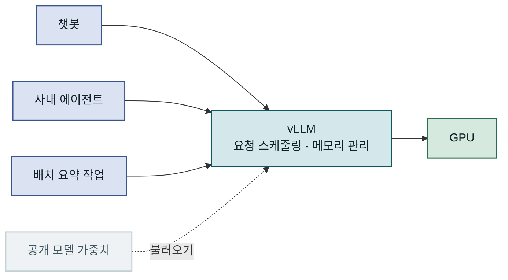
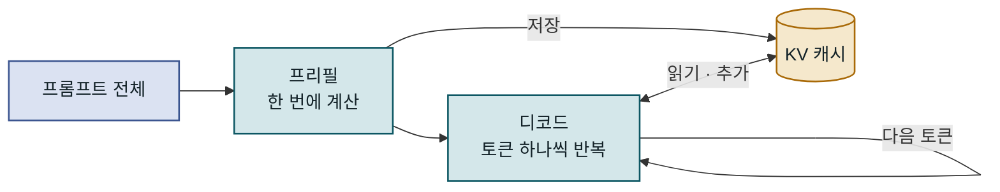
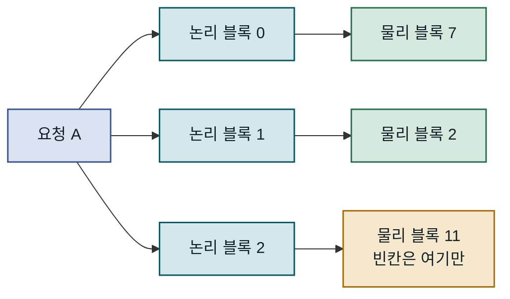
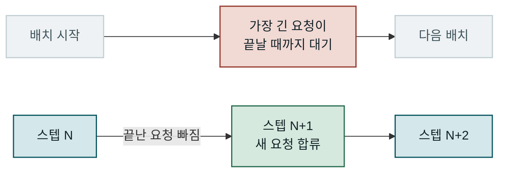
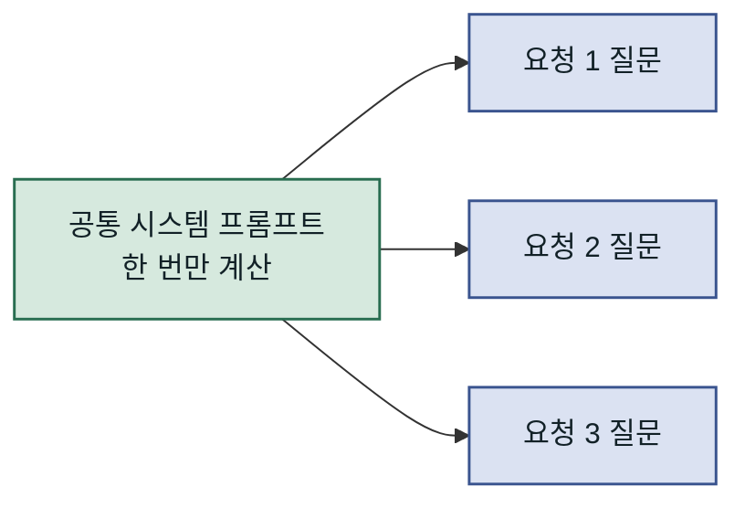
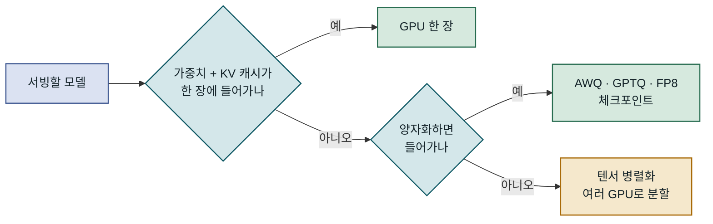
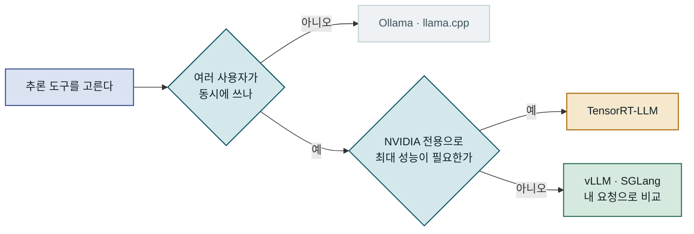

## 목차

1. 개요
2. LLM 추론이 GPU 메모리를 쓰는 방식
3. vLLM의 핵심 아이디어
4. vLLM으로 할 수 있는 일
5. 다른 추론 도구와의 차이
6. 맺음말

---

## 개요

### vLLM을 한 문장으로

vLLM은 대규모 언어 모델(LLM)을 GPU에서 빠르고 효율적으로 돌리기 위한 오픈소스 **추론·서빙 엔진**입니다. 모델을 새로 만드는 도구도, 학습 프레임워크도 아닙니다. Llama, Qwen, Mistral처럼 이미 공개된 모델 가중치를 받아서, 여러 사용자의 요청을 동시에 처리하는 API 서버로 바꿔 주는 실행 계층입니다. 2023년 UC Berkeley 연구진이 PagedAttention 논문과 함께 공개했고, 지금은 오픈소스 LLM을 직접 서빙하려는 팀이 가장 먼저 검토하는 선택지 중 하나가 되었습니다.

이 글은 설치 방법보다 앞선 질문, 즉 vLLM이 무엇이고 왜 이런 엔진이 따로 필요하며 내부에서 어떤 아이디어로 처리량을 끌어올리는지를 다룹니다. 설치와 파라미터 튜닝, 운영 시 주의점은 [vLLM으로 오픈소스 LLM 고성능 추론 서버 구축하기](/posts/2026-09-13-vLLM%EC%9C%BC%EB%A1%9C-%EC%98%A4%ED%94%88%EC%86%8C%EC%8A%A4-LLM-%EA%B3%A0%EC%84%B1%EB%8A%A5-%EC%B6%94%EB%A1%A0-%EC%84%9C%EB%B2%84-%EA%B5%AC%EC%B6%95%ED%95%98%EA%B8%B0)에서 이어서 다룹니다.



vLLM은 애플리케이션과 GPU 사이에서, 여러 요청을 한 GPU에 빈틈 없이 밀어 넣는 역할을 맡습니다.

### 왜 추론 엔진이 따로 필요한가

모델을 한 번 돌려 보는 것이 목적이라면 Hugging Face `transformers`로 가중치를 불러와 `generate()`를 호출해도 답은 나옵니다. 문제는 사용자가 한 명이 아닐 때 드러납니다. 요청이 동시에 수십 개 들어오면 GPU 한 장이 몇 개의 요청을 함께 처리할 수 있는지가 곧 비용이 됩니다. 단순한 구현은 배치를 통째로 묶어 처리하고 요청별 캐시를 연속된 텐서로 관리하기 때문에, 짧은 요청이 끝난 자리에서 GPU가 놀거나 메모리가 금방 바닥나는 경향이 있습니다. 같은 GPU로 몇 배의 요청을 처리할 수 있느냐는 결국 추론 서버를 몇 대 띄워야 하느냐로 이어집니다.

vLLM이 푸는 문제는 모델의 답변 품질이 아니라 이 **처리량과 메모리 효율**입니다. 같은 모델을 같은 GPU에서 돌리면 답변 내용은 거의 같지만, 한 번에 받아 줄 수 있는 요청 수와 초당 생성 토큰 수가 달라집니다.

| 구분 | 직접 구현 (`transformers` + 웹 서버) | vLLM | 차이가 드러나는 때 |
|---|---|---|---|
| 동시 요청 | 배치를 직접 묶고 끝날 때까지 대기 | 엔진이 매 스텝 요청을 넣고 뺌 | 요청 길이가 제각각일 때 |
| KV 캐시 메모리 | 요청별 연속 텐서, 빈틈이 생김 | 고정 크기 블록으로 필요한 만큼 할당 | 긴 대화가 몰릴 때 |
| API | 직접 작성 | OpenAI 호환 서버 내장 | 기존 SDK 코드를 옮길 때 |
| 알맞은 자리 | 실험, 단일 사용자 | 여러 사용자가 쓰는 서비스 | 트래픽이 늘 때 |

---

## LLM 추론이 GPU 메모리를 쓰는 방식

vLLM의 아이디어를 이해하려면 LLM이 토큰을 만들 때 GPU 안에서 어떤 일이 벌어지는지 먼저 봐야 합니다. 핵심 단어는 **KV 캐시**입니다. 모델 가중치는 서버를 띄울 때 한 번 올리고 끝나지만, KV 캐시는 요청이 들어올 때마다 새로 생기고 토큰이 생성될수록 계속 커집니다. 서빙 엔진의 성능 차이는 대부분 이 캐시를 어떻게 배치하고 재사용하느냐에서 나옵니다.

### 프리필과 디코드

LLM 추론은 두 단계로 나뉩니다. **프리필(prefill)** 단계에서는 사용자가 보낸 프롬프트 전체를 한 번에 모델에 통과시켜 첫 토큰을 만듭니다. 이어지는 **디코드(decode)** 단계에서는 토큰을 하나씩 생성합니다. 새 토큰을 만들 때마다 앞선 모든 토큰의 어텐션 키(Key)와 값(Value)을 다시 계산하면 너무 느리기 때문에, 한 번 계산한 값을 GPU 메모리에 쌓아 두고 재사용합니다. 이렇게 쌓아 두는 값이 KV 캐시입니다.

두 단계는 성격이 다릅니다. 프리필은 많은 토큰을 한꺼번에 행렬 연산하므로 GPU 연산 능력에 묶이고, 디코드는 한 번에 토큰 하나만 계산하는 대신 KV 캐시를 계속 읽고 늘려야 하므로 메모리에 묶입니다. 답변이 수백 토큰이면 디코드가 수백 번 반복되기 때문에, 서빙 비용의 상당 부분은 디코드 단계에서 KV 캐시를 얼마나 효율적으로 다루느냐에 달려 있습니다.



프리필은 요청마다 한 번, 디코드는 생성할 토큰 수만큼 돌고, 그동안 KV 캐시는 계속 커집니다.

### KV 캐시가 차지하는 크기

KV 캐시 크기는 토큰 하나당 `2 × 레이어 수 × KV 헤드 수 × 헤드 차원 × 자료형 바이트 수`로 어림할 수 있습니다. 앞의 2는 키와 값 두 벌을 뜻합니다. Llama 3 8B 모델(레이어 32개, KV 헤드 8개, 헤드 차원 128)을 16비트로 돌리면 토큰 하나에 약 131KB가 필요하고, 8,000토큰짜리 대화 하나면 약 1GB가 됩니다.

| 동시 대화 수 | 대화당 길이 | KV 캐시 합계 (Llama 3 8B, 16비트) | 주의점 |
|---|---|---|---|
| 1 | 8,000토큰 | 약 1GB | 가중치 약 16GB는 별도 |
| 16 | 8,000토큰 | 약 17GB | 가중치와 합치면 24GB GPU를 넘음 |
| 64 | 2,000토큰 | 약 17GB | 짧은 대화가 많아도 합계는 비슷 |

가중치는 고정된 크기지만 KV 캐시는 동시 요청 수와 대화 길이에 비례해 늘어납니다. 그래서 같은 GPU가 요청을 몇 개까지 받아 줄 수 있는지는 KV 캐시를 얼마나 빈틈 없이 채워 넣느냐로 정해집니다. 어려운 점은 요청이 끝날 때까지 몇 토큰을 생성할지 미리 알 수 없다는 것입니다. 최대 길이만큼 미리 잡아 두면 대부분이 빈 공간으로 남고, 조금씩 늘리면 연속된 공간을 찾지 못해 중간중간 빈틈이 생깁니다. PagedAttention 논문은 기존 서빙 시스템에서 KV 캐시용으로 잡은 메모리의 60~80%가 이렇게 낭비된다고 보고했습니다.

---

## vLLM의 핵심 아이디어

vLLM의 성능은 한 가지 기법이 아니라 메모리 관리와 스케줄링을 함께 바꾼 결과입니다. 그 출발점이 이름에도 들어간 PagedAttention이고, 메모리를 블록 단위로 다룰 수 있게 되면서 연속 배칭과 프리픽스 캐싱이 자연스럽게 따라옵니다. 세 가지를 차례로 보면 vLLM이 왜 같은 GPU에서 더 많은 요청을 처리하는지 설명할 수 있습니다.

### PagedAttention — KV 캐시를 페이지로 나누기

PagedAttention은 운영체제의 **가상 메모리 페이징**에서 가져온 아이디어입니다. 운영체제가 프로세스 메모리를 고정 크기 페이지로 쪼개 물리 메모리 곳곳에 흩어 두고 페이지 테이블로 연결하듯, vLLM은 KV 캐시를 고정 크기 **블록**(기본값 16토큰)으로 나눕니다. 요청 입장에서는 캐시가 쭉 이어져 있는 것처럼 보이지만, 실제 블록은 GPU 메모리의 빈 자리 어디에나 놓입니다. 요청마다 있는 **블록 테이블**이 논리 블록과 물리 블록의 짝을 기록하고, 어텐션 커널은 이 테이블을 따라 흩어진 블록을 읽습니다.

이렇게 하면 메모리를 미리 크게 잡아 둘 필요가 없습니다. 토큰이 16개 쌓일 때마다 블록을 하나씩 받으면 되므로, 낭비는 요청마다 마지막 블록에 남는 빈칸 정도로 줄어듭니다. 논문은 이 방식으로 KV 캐시 낭비를 4% 미만으로 줄였고, 같은 지연 시간 기준으로 당시의 FasterTransformer, Orca 대비 2~4배 처리량을 냈다고 보고합니다. 이 수치는 2023년 비교이고 다른 엔진들도 그 사이 비슷한 기법을 받아들였으니, 절대 수치보다는 차이가 생기는 원리에 주목하는 편이 좋습니다.



요청은 블록이 이어져 있다고 보지만 실제 블록은 GPU 메모리 곳곳에 흩어져 있고, 남는 공간은 마지막 블록에만 생깁니다.

### 연속 배칭 — 끝난 자리에 바로 새 요청 넣기

전통적인 **정적 배칭**은 요청 여러 개를 한 배치로 묶어 함께 처리하고, 배치 안의 모든 요청이 끝나야 다음 배치를 시작합니다. 한 요청은 20토큰, 다른 요청은 800토큰을 생성한다면 짧은 요청이 끝난 뒤에도 그 자리는 긴 요청이 끝날 때까지 비어 있고, 새로 들어온 요청은 그동안 줄을 서서 기다립니다.

vLLM은 **연속 배칭**(continuous batching)을 씁니다. 배치 구성을 요청 단위가 아니라 디코드 스텝 단위로 다시 짜는 방식입니다. 매 스텝마다 끝난 요청은 빠지고, 대기 중인 요청이 그 자리에 바로 합류합니다. 요청이 빠질 때 그 요청의 블록만 반납하면 되므로, PagedAttention의 블록 관리가 이 방식을 싸게 만들어 줍니다. 메모리가 모자라면 스케줄러가 일부 요청을 잠시 밀어내고 나중에 이어서 처리합니다.



위가 정적 배칭, 아래가 연속 배칭입니다. 아래에서는 배치의 구성원이 매 스텝 바뀌어 GPU가 쉬는 틈이 줄어듭니다.

### 프리픽스 캐싱 — 같은 앞부분은 한 번만 계산

실제 서비스의 요청은 앞부분이 겹치는 경우가 많습니다. 모든 요청에 같은 시스템 프롬프트가 붙고, RAG에서는 같은 문서를 여러 질문이 참조하며, 여러 턴에 걸친 대화는 매번 이전 대화를 다시 보냅니다. vLLM의 **자동 프리픽스 캐싱**(automatic prefix caching)은 블록 내용을 해시로 식별해, 이미 계산해 둔 블록과 같은 앞부분이 들어오면 그 블록을 그대로 재사용하고 프리필을 건너뜁니다.

효과는 공통 앞부분이 길수록 커집니다. 수천 토큰짜리 시스템 프롬프트를 쓰는 에이전트라면 두 번째 요청부터는 달라진 부분만 계산하므로 첫 토큰이 나오기까지의 시간이 크게 줄 수 있습니다. 반대로 요청마다 앞부분이 전부 다르면 얻는 것이 거의 없으니, 프롬프트를 설계할 때 변하지 않는 부분을 앞에, 요청마다 달라지는 부분을 뒤에 두는 편이 유리합니다.



공통 앞부분의 블록은 한 번 계산해 두고, 요청마다 달라지는 질문 부분만 새로 계산합니다.

---

## vLLM으로 할 수 있는 일

내부 구조를 몰라도 vLLM을 쓰는 방법은 크게 두 가지입니다. 하나는 API 서버로 띄워 여러 애플리케이션이 호출하게 하는 방식이고, 다른 하나는 파이썬 코드 안에서 엔진을 직접 불러 대량의 프롬프트를 한꺼번에 처리하는 방식입니다. 여기에 모델이 GPU 한 장에 들어가지 않을 때 쓰는 병렬화와 양자화가 더해집니다.

### OpenAI 호환 API 서버

`vllm serve` 한 줄이면 OpenAI API와 같은 형식의 서버가 뜹니다. `/v1/chat/completions`, `/v1/completions` 같은 경로를 그대로 제공하므로, OpenAI SDK로 작성한 애플리케이션은 `base_url`만 바꿔 자체 서빙 모델로 옮겨 갈 수 있습니다. 아래는 7B 크기 모델을 24GB급 GPU 한 장에 띄우는 예시입니다.

```bash
pip install vllm

# 모델을 내려받아 8000번 포트에 OpenAI 호환 서버를 띄운다
vllm serve Qwen/Qwen2.5-7B-Instruct \
  --max-model-len 8192 \
  --gpu-memory-utilization 0.90
# 결과: 로그 끝에 http://0.0.0.0:8000 에서 요청을 받는다는 메시지가 찍힌다
```

`--gpu-memory-utilization`은 vLLM이 GPU 메모리 중 얼마를 가져갈지 정하는 값입니다. vLLM은 시작할 때 가중치를 올리고 남은 몫을 KV 캐시 블록 풀로 한꺼번에 확보하기 때문에, 요청이 하나도 없어도 `nvidia-smi`에는 메모리가 거의 다 찬 것으로 보입니다. 고장이 아니라 설계입니다. 서버가 뜨면 기존 OpenAI SDK로 바로 호출할 수 있습니다.

```python
from openai import OpenAI

# 서버에 API 키 검사를 켜지 않았다면 아무 문자열이나 넣어도 된다
client = OpenAI(base_url="http://localhost:8000/v1", api_key="EMPTY")

resp = client.chat.completions.create(
    model="Qwen/Qwen2.5-7B-Instruct",
    messages=[{"role": "user", "content": "KV 캐시를 한 문장으로 설명해 줘"}],
    max_tokens=128,
)
print(resp.choices[0].message.content)  # 결과: 모델이 생성한 답변 문자열
```

핵심은 애플리케이션 코드가 vLLM을 전혀 모른다는 점입니다. 호출하는 쪽은 OpenAI 형식만 알면 되므로, 나중에 엔진을 바꾸거나 외부 API로 되돌아가더라도 수정 범위가 주소와 모델 이름으로 좁혀집니다.

### 오프라인 배치 추론

서버 없이 파이썬 안에서 엔진을 직접 쓸 수도 있습니다. 수만 건의 리뷰 요약이나 데이터 라벨링처럼 사람이 기다리지 않는 작업이라면, HTTP를 거치지 않고 프롬프트 목록을 통째로 넘기는 편이 단순하고 빠릅니다. 엔진이 내부에서 연속 배칭으로 알아서 묶어 처리하므로, 배치 크기를 직접 나눌 필요가 없습니다.

```python
from vllm import LLM, SamplingParams

reviews = ["배송이 빠르고 포장이 꼼꼼했어요", "사이즈가 생각보다 한 치수 작아요"]
prompts = [f"다음 리뷰를 한 줄로 요약해 줘: {r}" for r in reviews]

llm = LLM(model="Qwen/Qwen2.5-7B-Instruct")   # 채팅 템플릿이 필요하면 llm.chat()을 쓴다
params = SamplingParams(temperature=0.2, max_tokens=64)

for out in llm.generate(prompts, params):     # 결과는 입력 순서대로 돌아온다
    print(out.outputs[0].text)                # 결과: 리뷰별 한 줄 요약
```

서버 방식과 같은 엔진이 돌기 때문에 PagedAttention과 연속 배칭의 이점을 그대로 얻습니다. 차이는 요청이 네트워크로 들어오느냐, 리스트로 한 번에 들어오느냐뿐입니다.

### 큰 모델과 양자화

모델이 GPU 한 장에 들어가지 않으면 두 가지 길이 있습니다. 첫째는 **양자화**로 가중치를 줄이는 것입니다. vLLM은 AWQ, GPTQ 같은 4비트 양자화 체크포인트와 FP8 같은 8비트 형식을 불러올 수 있고, 가중치가 줄어든 만큼 KV 캐시에 쓸 공간도 늘어납니다. 대신 모델과 작업에 따라 답변 품질이 조금 떨어질 수 있으니 실제 요청으로 비교해 봐야 합니다. 둘째는 **텐서 병렬화**로, `--tensor-parallel-size` 옵션을 주면 레이어 하나를 여러 GPU에 나눠 올립니다. 한 서버 안의 GPU끼리 쓰는 것이 기본이고, 노드를 넘길 때는 파이프라인 병렬화를 함께 씁니다.



먼저 한 장에 넣을 방법을 찾고, 그래도 안 되면 여러 GPU로 나눕니다. 나누는 순간 GPU 사이의 통신 비용이 붙습니다.

---

## 다른 추론 도구와의 차이

LLM을 직접 돌리는 도구는 vLLM 말고도 많고, 이름이 비슷한 층위에 섞여 있어 헷갈리기 쉽습니다. 크게 보면 한 사람이 자기 컴퓨터에서 쓰는 로컬 실행 도구와, 여러 사용자의 요청을 받는 서빙 엔진으로 나뉩니다. vLLM은 뒤쪽에 속합니다.

### 로컬 실행 도구와의 차이

Ollama와 llama.cpp는 노트북이나 개인 PC에서 모델을 쉽게 돌리는 데 초점을 맞춘 도구입니다. GGUF라는 양자화 형식을 주로 쓰고, CPU나 Apple Silicon에서도 잘 돌아갑니다. 설치가 간단하고 메모리가 적은 환경에서도 동작한다는 점이 강점입니다. vLLM은 반대로 데이터센터급 GPU에서 많은 요청을 동시에 처리하는 데 맞춰져 있습니다. 어느 쪽이 더 좋다기보다 풀려는 문제가 다릅니다.

| 항목 | vLLM | Ollama · llama.cpp | 고를 때 볼 것 |
|---|---|---|---|
| 주 대상 | 여러 사용자가 쓰는 API 서버 | 개인 PC · 노트북의 단일 사용자 | 동시 사용자 수 |
| 하드웨어 | NVIDIA GPU 중심, AMD · Intel 등도 지원 | CPU, Apple Silicon, 소비자용 GPU | 가진 장비 |
| 모델 형식 | Hugging Face 가중치, AWQ · GPTQ · FP8 | GGUF 중심 | 쓰려는 체크포인트 |
| 동시 요청 | 연속 배칭으로 많이 처리 | 적은 수를 가정 | 트래픽 규모 |

같은 모델을 로컬에서 Ollama로 실험하다가 서비스로 옮길 때 vLLM으로 바꾸는 흐름이 흔합니다. 이때 모델 형식이 달라 체크포인트를 다시 받아야 할 수 있다는 점은 미리 알아 두는 편이 좋습니다.

### 서빙 엔진 사이에서 vLLM의 위치

서빙 엔진 중에서는 SGLang과 TensorRT-LLM이 자주 함께 비교됩니다. SGLang은 vLLM과 목표가 가깝고, 프리픽스를 트리 구조로 공유하는 RadixAttention으로 여러 번 호출이 이어지는 워크로드에서 강점을 보이는 경향이 있습니다. TensorRT-LLM은 NVIDIA가 만든 엔진으로, 모델과 GPU에 맞춰 엔진을 빌드하는 과정을 거치는 대신 NVIDIA 하드웨어에서 성능을 끝까지 끌어내는 데 초점을 둡니다. vLLM은 지원하는 모델과 하드웨어의 폭이 넓고 새 모델이 공개되면 빠르게 지원이 붙는 편이라, 일단 시작하기에 무난한 선택으로 꼽힙니다.



엔진 간 벤치마크는 버전이 오를 때마다 순위가 바뀌므로, 공개된 수치보다 내 요청 패턴으로 직접 재 보는 편이 정확합니다.

---

## 맺음말

### 핵심 요약

vLLM은 공개 LLM을 GPU에서 여러 사용자에게 서빙하기 위한 추론 엔진입니다. 서빙 비용을 좌우하는 KV 캐시를 PagedAttention으로 블록 단위로 관리해 메모리 낭비를 줄이고, 그 위에서 연속 배칭과 프리픽스 캐싱으로 같은 GPU가 처리하는 요청 수를 늘립니다. OpenAI 호환 서버를 내장하고 있어, 이미 OpenAI SDK로 작성한 애플리케이션을 주소만 바꿔 연결할 수 있습니다.

### 적용 판단 기준

vLLM이 필요한지는 모델 크기보다 동시 요청 수와 데이터가 나갈 수 있는지로 먼저 판단하는 편이 좋습니다. GPU를 직접 운영하는 비용은 생각보다 크기 때문에, 트래픽이 적다면 관리형 API가 더 쌀 수 있습니다.

| 상황 | vLLM이 맞나 | 이유 |
|---|---|---|
| 사내 여러 팀이 함께 쓰는 LLM API | 맞음 | 동시 요청 처리량이 곧 GPU 비용 |
| 데이터를 외부 API로 보낼 수 없는 환경 | 맞음 | 자체 GPU에서 공개 모델을 서빙 |
| 노트북에서 혼자 모델 실험 | 과함 | Ollama · llama.cpp가 훨씬 간단 |
| 트래픽이 적고 GPU 운영 인력이 없음 | 재검토 | 관리형 API가 총비용이 낮을 수 있음 |

### 참고 자료

- [vLLM 공식 문서](https://docs.vllm.ai)
- [vLLM GitHub 저장소](https://github.com/vllm-project/vllm)
- [Efficient Memory Management for Large Language Model Serving with PagedAttention (arXiv:2309.06180)](https://arxiv.org/abs/2309.06180)
