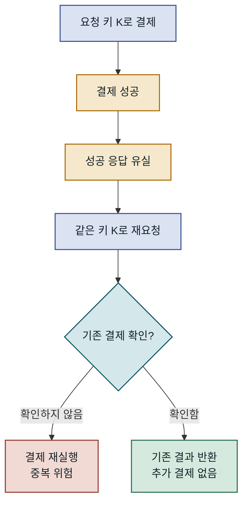
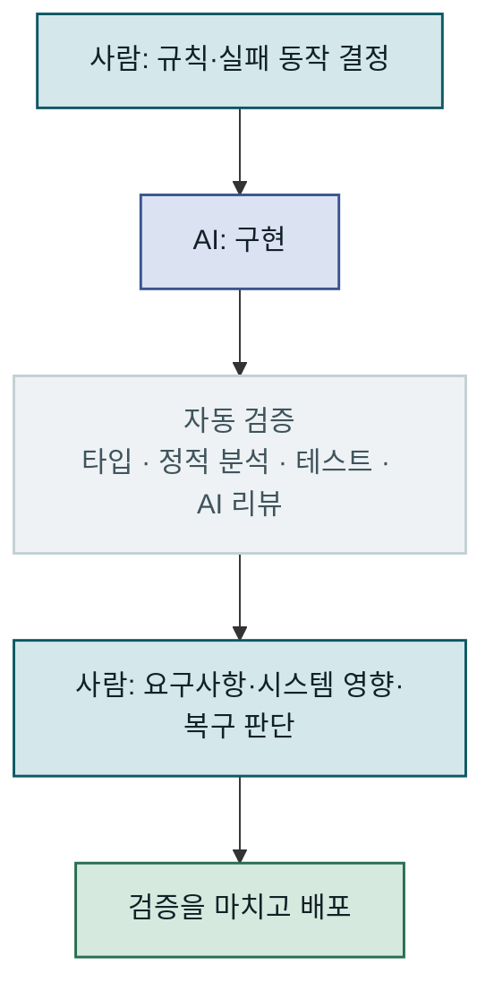

AI가 구현을 빠르게 해 주면 PR도 빨리 쌓입니다. 그런데 리뷰 대기와 수정 요청까지 늘어나면, 팀이 배포하는 속도는 그대로일 수 있습니다. 생성된 코드를 사람이 처음부터 끝까지 정독하는 방식은 작업량이 늘수록 오래 유지하기 어렵습니다. 그렇다고 AI 리뷰어를 하나 더 붙이면 해결될까요? 저는 **리뷰의 중심을 코드의 모든 줄에서 결정과 실패 조건으로 옮기고, 어디를 깊게 볼지 미리 정해야 한다**고 생각합니다.

## 구현에서 빠진 고민과 리뷰의 기준

예전에는 구현자가 코드를 쓰면서 요구사항을 해석하고, 어떤 실패를 허용할지 고민했습니다. 리뷰어는 그 결정을 다시 확인했습니다. AI에 구현을 맡기면 첫 번째 고민이 생략될 수 있습니다. 리뷰까지 AI에 맡기면 코드는 존재하지만, 왜 그렇게 만들었는지 설명할 사람이 없는 상태가 됩니다.

이때 문제는 AI가 틀린 코드를 썼다는 것만이 아닙니다. 맞아 보이는 코드라도 **무엇을 반드시 지켜야 하는지** 합의하지 않았다면, 리뷰어가 검증할 기준이 없습니다. 생성 속도에 맞춰 읽는 속도만 높이려 하면 판단의 빈자리는 남습니다.

## 정상 응답만으로는 보이지 않는 결제 실패

주문 API가 결제 서비스를 호출하고 성공 응답을 반환하는 코드는 쉽게 그럴듯해 보입니다. 단위 테스트도 정상 응답을 확인할 수 있습니다. 하지만 결제는 성공했는데 우리 서버가 응답을 받지 못한 뒤, 고객이 같은 요청을 다시 보내면 어떻게 될까요? 두 번째 호출이 다시 결제를 만들면 정상 경로의 테스트가 모두 통과해도 서비스는 안전하지 않습니다.

응답 유실 뒤의 재요청은 정상 응답 테스트만으로 확인되지 않습니다. 어느 분기로 갈지는 같은 요청을 식별하고 기존 결제 결과를 확인하도록 설계했는지에 달려 있습니다.

그래서 구현 전에 사람이 적어야 할 규칙이 있습니다. 예를 들면 **“같은 요청으로 두 번 결제되면 안 된다”**라는 규칙입니다. 여기서 같은 요청을 식별할 키의 범위, 결제 성공 여부를 모를 때 조회·재시도·보류 중 무엇을 할지도 정해야 합니다.

특히 **키를 누가 만들고 재시도할 때 어떻게 유지하는지**가 빠지면 이 규칙은 쉽게 무너집니다. 클라이언트가 재시도할 때마다 새 키를 만들면, 서버가 아무리 꼼꼼히 중복을 확인해도 두 요청은 서로 다른 요청으로 보입니다. 클라이언트가 주문 시도마다 키를 한 번 만들어 재요청에도 그대로 보내게 하거나, 서버가 주문서처럼 이미 존재하는 업무 식별자로 키를 정해야 합니다. 멱등 키를 쓴다는 말만으로는 충분하지 않습니다. 응답 유실 뒤 재요청을 실패 주입 테스트로 재현하고, 실제로 중복 결제가 발생하지 않는지 확인할 수 있어야 합니다.

또 다른 규칙은 **“외부 호출 실패가 DB 트랜잭션을 오래 붙잡으면 안 된다”**라는 규칙입니다. 결제 서비스의 지연을 트랜잭션 안에서 기다리면 커넥션과 잠금이 함께 묶일 수 있습니다. 호출을 트랜잭션 밖으로 옮기면 이번에는 DB 기록과 외부 결제 사이의 간극을 어떻게 복구할지 결정해야 합니다. 어느 쪽이든 코드의 문법보다 실패했을 때의 동작이 먼저입니다.

테스트는 이런 조건을 확인하는 데 필요합니다. 다만 **어떤 실패를 테스트해야 하는지는 테스트가 스스로 결정하지 않습니다.** 요구사항과 운영 조건을 아는 사람이 그 목록을 만들어야 합니다.

## 리뷰의 일을 세 단계로 나누기

첫째, **구현 전에 사람이 규칙과 실패 시 동작을 정합니다.** 변경이 지켜야 할 불변 조건, 외부 시스템이 응답하지 않을 때의 처리, 이미 처리된 요청이 다시 왔을 때의 결과를 짧게 적습니다. 이 문장이 구현과 리뷰의 기준이 됩니다.

둘째, **반복 검증은 자동화합니다.** 타입 검사, 정적 분석, 테스트, 알려진 결함 패턴 탐지는 도구에 맡길 수 있습니다. AI 리뷰도 중복 호출 가능성이나 예외 처리 누락 같은 후보를 찾는 데 쓸 수 있습니다. 중요한 것은 경고의 개수가 아니라, 앞서 정한 조건을 검증하는 테스트와 근거가 있는지입니다.

셋째, **최종 판단은 사람이 합니다.** 요구사항을 제대로 해석했는지, 기존 주문·결제 흐름과 충돌하지 않는지, 장애가 나면 무엇을 보고 발견하며 어떻게 복구할 수 있는지 확인합니다. 이 단계는 파일 전체를 같은 밀도로 읽는 일이 아닙니다. 위험이 모이는 상태 전이, 외부 호출 경계, 재시도 경로를 집중해서 보는 일입니다. 변경 범위를 이해하는 데 필요한 코드는 당연히 읽어야 합니다.

이렇게 나누면 사람 리뷰가 줄 수 있는 가치가 또렷해집니다. 자동 검사가 통과했다는 사실은 출발점이고, 시스템이 실패할 때도 의도한 규칙을 지킨다는 판단이 승인 근거가 됩니다.

자동 검증은 사람이 살펴볼 범위를 좁혀 주고, 배포를 승인할 근거는 앞서 정한 규칙과 마지막 판단에서 나옵니다.

## 위험도와 PR 크기로 리뷰 깊이 조절하기

세 단계를 모든 PR에 같은 무게로 적용하면 병목은 리뷰에서 규칙 작성으로 자리만 옮깁니다. 리뷰 시간을 실제로 줄이는 것은 **깊게 볼 변경과 가볍게 넘길 변경을 미리 구분하는 기준**입니다. 기준이 없으면 리뷰어는 모든 PR을 최악의 경우처럼 읽거나, 반대로 모든 PR을 대충 넘기게 됩니다.

| 위험도 | 예시 | 필요한 확인 |
| --- | --- | --- |
| 높음 | 결제·정산·권한, 상태 전이, 데이터 마이그레이션, 외부 호출 경계 | 구현 전 규칙과 실패 동작 기록, 실패 주입 테스트, 도메인 담당자의 리뷰 |
| 보통 | 기존 패턴을 따르는 조회 API, 화면에 필요한 필드 추가 | 자동 검증 통과, 변경 요약과 영향 범위 확인 |
| 낮음 | 문구 수정, 내부 도구, 테스트 보강 | 자동 검증 통과 후 가벼운 승인 |

등급은 변경된 경로와 모듈로 대부분 정할 수 있습니다. 결제 모듈이나 마이그레이션 디렉터리를 건드리면 담당자 리뷰를 필수로 요청하도록 설정해 두면, 매번 사람이 등급을 판단하지 않아도 됩니다. 다만 설정 파일이라도 타임아웃이나 재시도 횟수처럼 실패 시 동작을 바꾸는 값은 높음으로 올려야 합니다.

PR 크기도 같은 문제입니다. AI는 한 번에 많은 파일을 고치기 쉬워서, 리뷰어가 한 번에 판단할 수 없는 PR이 자주 만들어집니다. 앞의 결제 예시라면 요청 키를 저장할 스키마 변경, 중복 확인 로직, 결제 호출 경로 교체를 따로 올리는 편이 낫습니다. 이름 변경이나 포맷 정리 같은 기계적인 변경은 동작을 바꾸는 변경과 섞지 않아야 합니다. 그래야 높음 등급의 PR에서 리뷰어가 볼 코드가 실제로 위험한 부분으로 좁혀집니다.

## AI 리뷰 의견을 옮기는 사람의 책임

AI가 “중복 결제 위험”이라는 의견을 남겼다면 그대로 작성자에게 “AI가 문제라는데 해명해 봐요”라고 전달해서는 안 됩니다. 그 말만으로는 작성자가 문제를 이해하기 위해 처음부터 검증 비용을 치러야 합니다.

사람이 자기 이름으로 의견을 제기한다면, **어떤 조건에서 문제가 생기는지**, 현재 코드에서 그 조건이 가능한지, 재현할 수 있는지부터 확인해야 합니다. 예를 들어 “결제 성공 후 응답이 유실되고 동일한 요청 키로 재시도하면 결제 호출이 다시 실행된다”처럼 조건과 관찰 결과를 함께 제시하는 편이 낫습니다. 재현하지 못했더라도 어떤 가정이 확인되지 않았는지 분명히 적을 수 있습니다. AI의 지적은 조사할 단서이지, 검증을 마친 판정은 아닙니다.

## PR에 판단 근거 남기기

리뷰어가 매번 설계를 역추적하지 않도록 PR 설명에 네 가지만 남겨도 도움이 됩니다.

1. 변경 전에 정한 규칙과, 실패했을 때 기대하는 동작.
2. 정상 경로와 재요청·응답 유실 등 경계 조건에서 실제로 확인한 결과.
3. 타입 검사·정적 분석·테스트 결과와 아직 검증하지 못한 조건.
4. 장애를 발견할 신호와 재처리·되돌리기 같은 복구 경로.

여기서 조심할 점이 있습니다. **PR 설명도 AI가 쓸 수 있습니다.** 문장을 다듬는 데 쓰는 것은 괜찮지만, AI가 코드를 보고 규칙과 검증 결과를 그럴듯하게 채우면 앞에서 경계한 “설명할 사람이 없는 코드”가 PR 설명에서 다시 생깁니다. 오히려 “검증 완료”라는 문장이 리뷰어를 안심시켜 확인을 건너뛰게 만들 수 있습니다. 규칙은 구현 전에 사람이 적어 둔 내용을 옮기고, 검증 근거는 CI 실행 링크나 테스트 로그처럼 실제로 실행된 결과를 가리켜야 합니다.

### 샘플 PR 설명: 결제 응답 유실 후 중복 결제 방지

아래는 **가상의 PR 설명**입니다. 검증 결과와 운영 절차는 실제 변경에서 확인한 내용으로 바꿔 적어야 합니다.

**변경 내용**

- 주문 요청 키를 유일하게 기록해 한 요청만 결제 처리를 선점한다. 결제 서비스에도 같은 키를 전달하고, 재요청에서는 기존 결제 상태를 먼저 확인한다. 외부 호출은 DB 트랜잭션 밖에서 수행한다.

**구현 전에 정한 규칙과 실패 시 동작**

- 같은 주문 요청 키로 결제는 최대 한 번만 생성한다. 동시 재요청에서도 이 규칙을 지킨다.
- 요청 키는 클라이언트가 주문 시도마다 한 번 생성하고, 재시도할 때도 같은 키를 보낸다. 키가 없는 결제 요청은 거부한다.
- 결제 서비스가 응답하지 않으면 성공·실패를 추측하지 않고 주문을 `결제 확인 중`으로 둔다. 결제 서비스의 조회 기능으로 결과가 확인되면 상태를 갱신한다. 결과를 확인할 수 없는 동안에는 새 결제를 만들지 않는다.
- 외부 호출이 지연돼도 DB 트랜잭션을 열린 채 기다리지 않는다.

**검증 근거**

- 정상 요청: 결제 한 건이 생성되고 주문 상태가 완료로 바뀌는지 확인한다.
- 결제 성공 직후 응답 유실을 주입한 뒤 같은 키로 재요청: 두 번째 결제 호출 없이 기존 결과를 찾는지 확인한다.
- 같은 키의 동시 재요청: 결제 생성 건수가 한 건인지 확인한다.
- 타입 검사·정적 분석·테스트의 **실제 실행 명령과 결과(CI 실행 링크)**, 결제 서비스 장애처럼 아직 검증하지 못한 조건을 이 자리에 적는다.

**관측과 복구**

- `결제 확인 중` 상태가 오래 지속되는 주문과 동일 키의 중복 결제 시도를 집계해 알린다. 담당자는 결제 서비스 내역과 주문 기록을 대조한 뒤 확인된 결과로 상태를 보정한다.
- 배포를 되돌려도 이미 성공한 결제는 취소되지 않는다. 되돌리기 전에 미확정 주문을 식별하고, 기존 결제 내역을 확인·정리할 절차를 준비한다.

이 설명이 있으면 리뷰어는 코드가 그 주장과 일치하는지 확인할 수 있습니다. 설명이 틀렸다면 그 차이 자체가 좋은 리뷰 의견이 됩니다. 반대로 “테스트 통과”만 적힌 PR은 어떤 서비스 규칙을 검증했는지 다시 추측하게 만듭니다.

## PR 개수보다 배포까지 걸린 시간 보기

PR이 두 배로 늘었는데 리뷰 대기와 재작업도 두 배로 늘었다면 구현 단계만 빨라진 셈입니다. 팀의 생산성은 **작업을 시작해 필요한 검증을 마치고 안전하게 배포하기까지의 시간**으로 보는 편이 맞습니다. 구체적으로는 다음 값을 함께 보면 병목이 어디에 있는지 드러납니다.

- **첫 리뷰까지 대기 시간**: PR을 올린 뒤 리뷰어가 처음 반응하기까지 걸린 시간. 리뷰어 수에 비해 PR이 많은지 보여 줍니다.
- **승인까지 수정 요청 왕복 횟수**: 규칙이 구현 전에 합의되지 않았거나 PR이 너무 커서 한 번에 판단하지 못하는지 보여 줍니다.
- **배포 후 되돌림·긴급 수정 비율**: 리뷰를 빨리 통과시킨 대가가 운영에서 돌아오고 있는지 보여 줍니다.

이 값들은 앞서 나눈 위험도 등급별로 따로 보는 편이 좋습니다. 낮음 등급의 대기 시간이 길다면 가벼운 변경까지 무겁게 리뷰하고 있다는 뜻이고, 높음 등급의 되돌림이 늘었다면 깊게 봐야 할 변경을 놓치고 있다는 뜻입니다. 숫자 하나로 안전을 증명할 수는 없지만, PR 개수만 세는 것보다는 병목의 위치를 정확히 보여 줍니다.

AI 코딩 시대의 리뷰는 더 많은 코드를 더 빨리 훑는 경주가 아닙니다. 사람이 먼저 실패 조건과 지켜야 할 규칙을 정하고, 위험도에 따라 어디를 깊게 볼지 나누고, 자동화로 반복 확인을 덜어 낸 뒤, 마지막에는 시스템의 동작을 설명할 수 있는 사람이 판단해야 합니다. 그렇게 해야 구현 속도가 실제 배포 속도로 이어집니다.
