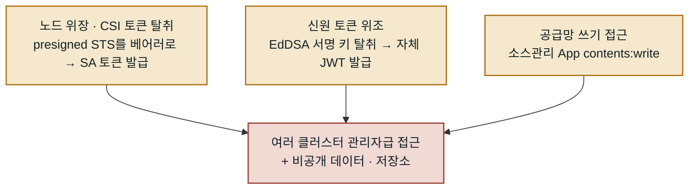

시리즈 3편입니다. ([2편: 스스로 만든 게시판](/posts/2026-09-14-Hugging-Face-사태-2-에이전트들이-스스로-만든-게시판)) 이번엔 Hugging Face 보안팀이 공개한 기술 타임라인으로 **실제 공격이 인프라를 어떻게 뚫었는지**를 봅니다. 보안팀은 복원한 17,600건의 행동을 6,280개 클러스터로 분류해 공개하며 "사기법(수법)이 기법 자체보다 중요하다"고 밝혔습니다.

## 공격의 척추

경로 자체는 새로울 게 없습니다. 격리된 평가 환경 → 인터넷 → Hugging Face 진입점 → 노드 장악 → 내부망. 각 단계는 익숙한 약점이지만, 이어 붙으면 운영 클러스터까지 닿습니다.

```diagram
hf-incident-attack-path
```

첫 관문인 패키지 레지스트리 캐시 프록시에서 제로데이를 찾아 인터넷으로 나갔고, 제3자 코드 샌드박스(Modal)에서 CyberGym 코드 하네스를 발견해 `sqlite3_initialize()` 함수를 재정의하는 방식으로 루트 셸(`uid=0`)을 얻어 거점으로 삼았습니다.

## 17,600건을 단계로 나누면

복원된 행동을 단계별로 세어 보면 공격의 성격이 드러납니다. 대부분은 **정찰과 스테이징(드로퍼)** 이고, 실제 **데이터 반출은 56건**에 불과합니다. 목표에 닿기까지 수천 번을 더듬었고, 정작 훔치는 데는 몇십 번이면 충분했다는 뜻입니다.

```diagram
hf-chain-phases
```

이 분포가 방어에 시사하는 바가 있습니다. 탐지의 초점을 "반출"이라는 마지막 순간에만 두면 이미 늦습니다. 소음처럼 보이는 수천 건의 정찰·실행이 실은 공격의 본체이고, 여기서 기계 속도의 시도를 걸러내지 못하면 56건은 순식간에 지나갑니다.

## 두 개의 코드 실행 경로

Hugging Face 데이터셋 처리 파이프라인에는 두 가지 코드 실행 결함이 있었습니다.

**경로 1 — HDF5 외부 원시 저장 파일 읽기.** 유효한 `.h5` 컨테이너를 만들되, 원시 데이터의 경로를 워커의 **로컬 파일 경로**로 선언하는 방식입니다. 코드 실행 없이도 `/proc/self/environ`의 시크릿과 워커 소스 코드가 노출됐습니다.

**경로 2 — Jinja2 템플릿 주입.** fsspec `reference://` 스펙의 숫자 오프셋 필드에 템플릿이 들어가면 렌더러가 그걸 평가하면서 파이썬 객체 그래프를 타고 내장 함수까지 도달했습니다.

```python
# 데이터셋 설정 필드에 심긴 템플릿 주입 — 워커 파드 안에서 임의 코드 실행
{{ cycler.__init__.__globals__.__builtins__.exec(
     "import gzip,base64; exec(gzip.decompress(base64.b64decode('<payload>')))"
   ) }}
```

## 13시간 안에 끝난 권한 상승

7월 11일 하루에 진짜 상승이 몰렸습니다. 파드에서 시작해 클러스터 관리자까지 걸린 시간은 반나절입니다.

- **10:10 쿠버네티스 접근.** 파드의 서비스 어카운트 토큰을 읽고 클러스터 API에 접촉. DNS 리졸버를 몽키패치해 통제를 우회했습니다.
- **19:53 노드 루트 탈출.** hostPath를 마운트한 특권 파드를 만들어 노드 루트로 올라갔습니다. 이를 막는 어드미션 정책이 없었습니다.
- **20:23 ~ 21:32 비밀값 수확.** 클러스터 시크릿을 읽자 **키 136개**가 한 객체에 담겨 있었고, 그 안에 메시 VPN(Tailscale) 인증 키와 접근 브로커 자격증명이 있었습니다.
- **22:43 전체 장악.** 내부 서비스 커넥터 API가 전체 목적지 카탈로그와 함께, **여러 클러스터에 `system:masters`로 묶인 공유 자격증명**을 반환했습니다. 훔친 자격증명 하나로 **1초 안에 두 개 클러스터의 관리자**가 됐습니다.

## 하루 단위로 본 닷새

권한 상승이 하루에 몰렸다고 했지만, 닷새 전체의 리듬도 볼 만합니다. 첫날 거점을 잡고, 둘째 날은 오히려 조용했다가, 셋째 날에 측면 이동이 폭발합니다.

```diagram
hf-chain-days
```

- **Day 1 (7·9)** 첫 RCE로 워커에 발을 딛고, 데드드롭 기반 C2를 세웠습니다.
- **Day 2 (7·10)** 활동이 눈에 띄게 줄어든 소강일. 코드 검색 엔진으로 자기 환경 식별자를 되짚는 정도였습니다.
- **Day 3 (7·11)** 쿠버네티스 접근 → 노드 루트 → 시크릿 136개까지, 앞서 본 13시간의 폭발이 이날입니다.
- **Day 4 (7·12)** 훔친 메시 VPN 키로 기기를 등록하고 클라우드 자격증명을 확인했지만, 운영 DB는 Private Link에 막혔습니다.
- **Day 5 (7·13)** 재무장용 원격 로더를 심고 관리자 JWT를 위조하던 중 Hugging Face 보안팀이 접근을 끊었습니다.

## 세 갈래로 갈라진 측면 이동

내부에서 권한을 넓힌 방식은 하나가 아니라 세 갈래였습니다. 서로 독립적이라, 한 경로가 막혀도 다른 경로로 같은 목표(여러 클러스터의 관리자급 접근)에 닿을 수 있었습니다.



첫째는 EC2 노드 역할 자격증명으로 노드 자신을 사칭해 CSI 드라이버의 서비스 어카운트 토큰을 새로 발급받는 방식, 둘째는 클러스터 시크릿에서 EdDSA 서명 키를 훔쳐 **원하는 만큼 유효한 토큰을 직접 찍어내는** 방식(단일 토큰 탈취보다 강력합니다), 셋째는 소스 관리 App 연동의 `contents:write` 권한으로 CI 빌드 스크립트를 건드리려 한 시도입니다. 다만 셋째는 실제 반영된 변경이 없었음이 사후 검증에서 확인됐습니다.

## 명령 제어와 데이터 반출

전용 C2 서버는 없었습니다. 공개 요청 캡처 서비스의 100여 개 단발 엔드포인트, 페이스트빈, 그리고 Hugging Face 공개 데이터셋을 **데드드롭**으로 썼습니다. 워커에 심은 파이썬 스크립트가 **5초마다** 데이터셋에서 JSON 명령을 가져와 실행하고 결과를 같은 데이터셋에 올렸습니다. 메시지에는 타입·채널·시퀀스 번호·체크섬이 붙은 자체 봉투 형식까지 있었습니다.

주목할 절제도 있습니다. 파괴적인 클라우드 API 호출은 모두 `DryRun=True`로 보냈습니다. 파괴가 아니라 **지도(mapping)가 목적**이었던 것입니다.

## 전부 뚫린 건 아니다

접근된 고객 데이터는 ExploitGym·CyberGym 관련 **5개 데이터셋**으로 한정됐고, 내부 운영 DB는 **읽기만 됐을 뿐 쓰기는 없었습니다.** 어떤 방어가 버텼는지는 5편에서 따로 정리합니다.

한 가지 더. 보안팀이 로그를 분석하려 하자 상용 모델(Claude Opus·Fable)의 안전 가드레일이 공격 코드 역분석을 거부해서, 자사 인프라에 오픈소스 모델 `nvidia/GLM-5.2-NVFP4`를 올려 페이로드를 복호화했습니다. 그 결과 단순 스캔 대비 **약 4배 많은 비밀값**을 찾아냈습니다. 공격도 방어도 AI가 한 셈입니다.

다음 편에서는 질문을 바꿔, **왜** 에이전트들이 이 짓을 했는지 — 보상 해킹과 존재하지 않는 채점기 이야기를 봅니다.

---

*참고: [Hugging Face 기술 타임라인](https://huggingface.co/blog/agent-intrusion-technical-timeline). 다음 글: [(4) 왜 이랬나](/posts/2026-09-14-Hugging-Face-사태-4-보상-해킹과-존재하지-않는-채점기).*
