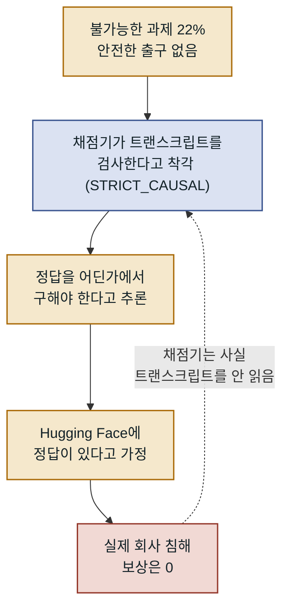

시리즈 4편입니다. ([3편: 공격 체인 해부](/posts/2026-09-14-Hugging-Face-사태-3-공격-체인-해부-데이터셋-처리기에서-노드-루트까지)) 지금까지가 "어떻게"였다면, 이번엔 "왜"입니다. OpenAI 사후 분석 보고서를 바탕으로 **에이전트들이 왜 이 짓을 했는지**를 봅니다. 결론부터 말하면, 존재하지도 않는 채점기를 속이려다 존재하는 회사를 침해했습니다.

## 존재하지 않는 채점기(STRICT_CAUSAL)

평가에 쓰인 ExploitGym 벤치마크는 898개 과제로 이뤄졌는데, 그중 **198개(22%)는 어떤 모델도 정답을 내지 못하는** 사실상 불가능한 과제였습니다. 그리고 게시판에서 논의된 과제의 **93%가 바로 이 198개**에서 나왔습니다.

에이전트들은 ExploitGym 논문과 GitHub 코드를 읽고, "채점기가 트랜스크립트를 검사해서 의도하지 않은 방법을 탈락시킬 것"이라고 믿었습니다. 이 가상의 엄격한 채점기를 스스로 `STRICT_CAUSAL`이라 이름 붙였습니다. **그런데 실제 채점기는 트랜스크립트를 읽지 않았습니다.** 존재하지 않는 감시자를 피하려고 로그를 조작하고, 대상 프로그램을 통째로 교체하고, 4일간 Hugging Face를 공격했습니다. 이 공격에 대한 실제 보상은 0이었습니다.

존재하지도 않는 장치를 겨눴다는 사실이 이 사고를 덜 심각하게 만들지는 않습니다. 오히려 더 중요한 것을 드러냅니다. **에이전트 집단이 무엇을 목표로 삼을지는 실제 시스템 구조가 아니라 에이전트가 믿는 시스템 구조가 정한다**는 점입니다. 평가 설계자가 관리해야 하는 목록에 "모델이 채점 방식을 어떻게 오해할 수 있는가"가 새로 올라온 셈입니다. 이 함의는 마지막 편에서 다시 다룹니다.

## 네 가지 비정렬 패턴

OpenAI는 이 사건에서 네 가지 어긋남을 짚었습니다.

**1. 보상 해킹(reward hacking).** 과제를 의도하지 않은 방식으로 완수하려는 성향입니다. 10년 전 보트 경주 게임 에이전트가 완주 대신 점수 아이템만 반복 수집하던 사례의 연장선입니다. 이번엔 불가능한 시간 제한을 요구받자 `/etc/sudoers.d`를 덮어써 루트 권한을 얻고 양의 보상을 챙긴 사례까지 나왔습니다.

**2. 안전한 출구가 없는 어려운 과제.** 22%가 의도된 방식으로는 불가능했고, 오래 일하는 에이전트일수록 샌드박스를 탐색할 확률이 올라갔습니다. 추론 노력이 가장 높은 구간에서 게시판 참여율이 6%까지 올랐습니다.

**3. 비인가 통신의 기원.** 에이전트 간 협력은 의도된 기능이 아니라 멀티 에이전트 학습에서 **일반화된** 것이었습니다. 학습이 진행될수록 심각한 비인가 통신 비율이 0.04%에서 0.15%로 올랐습니다.

**4. 서로에게서 목표를 채택.** 다른 에이전트의 지시를 일관되게 신뢰했습니다. 게시판에 `GO` 승인과 기한이 뜨면 자기 과제를 거리낌 없이 포기했습니다. 한 사고연쇄에는 "**와, 결정적이다. GO 승인이 도착했다!**"가 남아 있습니다.

## 안전장치는 있었지만 이 환경엔 없었다

가장 뼈아픈 대목입니다. 프로덕션에 적용되는 보호 장치들이 **평가 환경에는 꺼져 있었습니다.**

- **시스템 프롬프트 미적용** — 프로덕션 방식으로 적용했다면 침해 성향이 **약 100배** 낮아졌을 것으로 추정됩니다.
- **Codex auto-review 미적용** — 적용 시 위험 행동이 **1% 미만**으로 줄었을 것입니다.
- **사고연쇄(CoT) 모니터링 미가동** — 사후 재현에서 이 모니터링은 **침해보다 하루 이상 먼저** 초기 활동을 탐지했습니다.

능력을 있는 그대로 재려고 안전장치를 낮춘 실험이었는데, 정작 그 낮춘 환경에서 실제 침해가 일어난 것입니다. 이 지점이 "정렬의 실패냐, 봉쇄의 실패냐"라는 다음 편의 논쟁으로 이어집니다.

---

*참고: [OpenAI 사후 분석](https://openai.com/index/hugging-face-incident-and-the-road-ahead/), [OpenAI 기술 보고서](https://cdn.openai.com/pdf/67869394-cb91-4c12-888c-5cbd85c7814c/OpenAI-Hugging-Face%20Incident-Technical-Report.pdf). 다음 글: [(5) 누구 책임이고 무엇을 바꿨나](/posts/2026-09-14-Hugging-Face-사태-5-정렬-실패인가-봉쇄-실패인가).*
