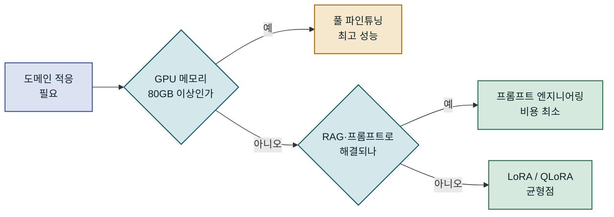
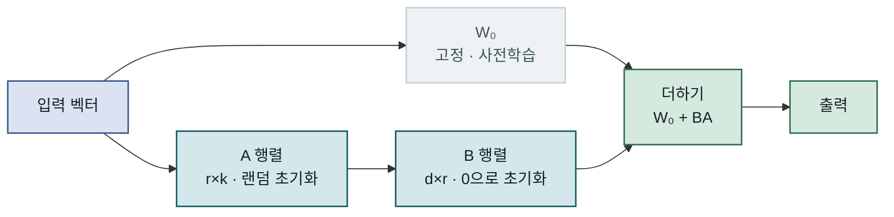
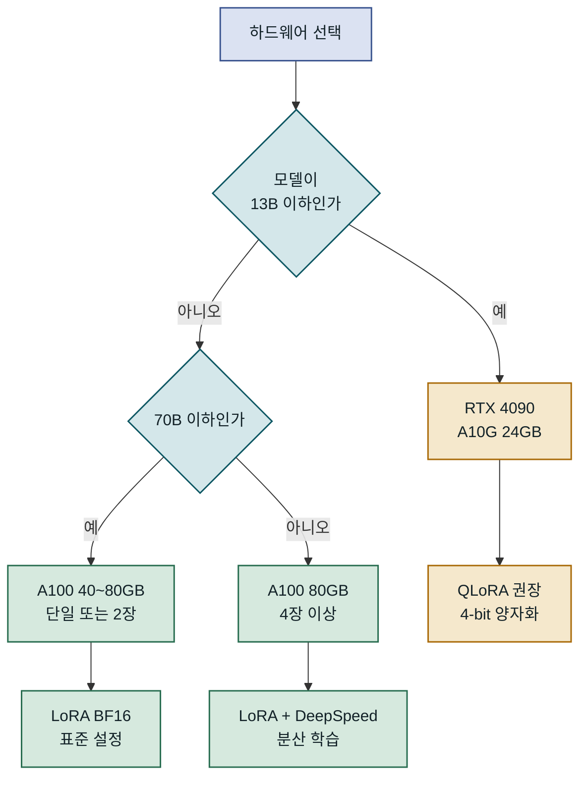
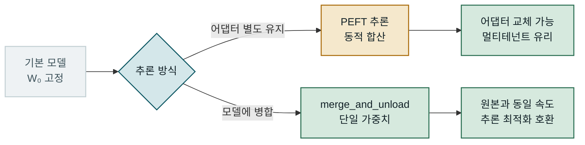
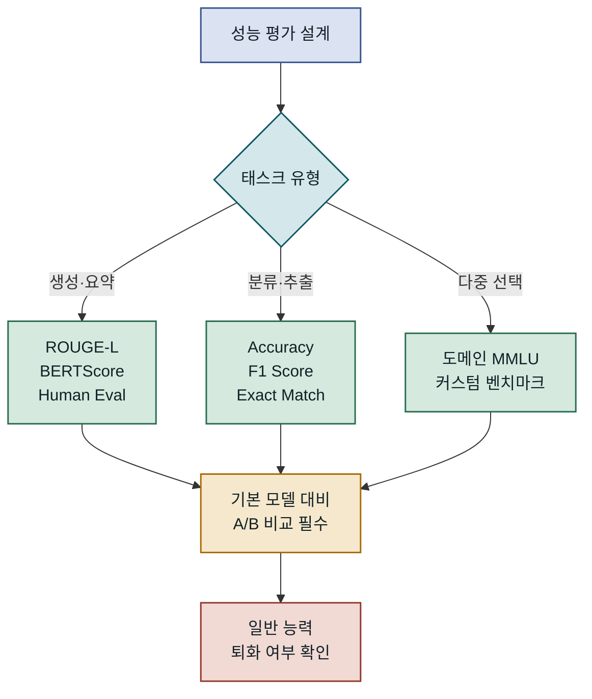
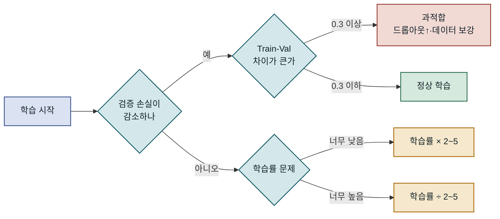
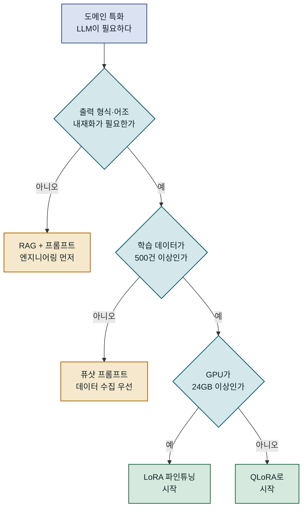

## 목차

1. 개요
2. LoRA의 수학적 원리와 내부 구조
3. 파인튜닝 환경 구성과 데이터 준비
4. LoRA 파인튜닝 구현 단계
5. 성능 특성과 대안 기술 비교
6. 운영 환경 적용 시 고려사항
7. 맺음말

---

## 개요

### 문제 배경: 대형 언어 모델 파인튜닝의 장벽

대형 언어 모델(LLM)을 특정 도메인이나 업무 방식에 맞게 조정하려면, 전통적으로 모든 파라미터를 갱신하는 풀 파인튜닝(Full Fine-Tuning)이 필요했습니다. LLaMA 3 8B처럼 비교적 소규모의 모델도 FP32 기준으로 파라미터당 4바이트가 필요해, 단순 추론에만 약 32GB의 GPU 메모리를 요구합니다. 여기에 Adam 옵티마이저 상태(파라미터당 8바이트 추가)와 그래디언트 저장량까지 합산하면 학습 시 메모리 요구량은 추론의 3~4배에 달합니다. **LoRA(Low-Rank Adaptation)**는 이 장벽을 허무는 파라미터 효율적 파인튜닝(PEFT) 기법으로, 전체 파라미터의 1% 미만만 학습하면서도 풀 파인튜닝에 근접한 도메인 적응 효과를 달성합니다. 단일 RTX 4090 또는 A10G GPU만으로도 7B~8B 규모 모델의 도메인 특화 파인튜닝이 가능해, 적은 자원으로도 오픈소스 LLM을 조직의 언어와 출력 형식에 맞게 특화할 수 있습니다.

### 기존 방식의 한계

풀 파인튜닝은 메모리 문제뿐 아니라 **치명적 망각(Catastrophic Forgetting)**이라는 구조적 약점을 안고 있습니다. 도메인 특화 데이터로만 수 에폭 학습하면, 모델이 기존에 보유하던 언어 이해력과 일반 상식을 잃어버리는 현상이 발생합니다. 이를 방지하기 위한 재생 버퍼(replay buffer)나 정규화 기법은 학습 파이프라인의 복잡도를 크게 높입니다. 프롬프트 엔지니어링이나 RAG(Retrieval-Augmented Generation)로 일부 한계를 보완할 수 있지만, 모델이 특정 어조나 출력 형식을 일관되게 내재화해야 하는 경우에는 파인튜닝이 유일한 선택입니다. 법률 문서 요약, 의료 코드 분류, 기업 고유의 응대 스타일 학습 같은 시나리오가 대표적입니다.



도메인 특화 요구를 충족하는 방법 선택은 GPU 자원과 태스크 성격을 함께 고려해야 합니다. LoRA는 두 조건을 모두 균형 있게 충족시킬 수 있는 현실적인 경로입니다.

---

## LoRA의 수학적 원리와 내부 구조

### 저랭크 행렬 분해의 직관

LoRA는 2021년 Microsoft Research가 발표한 논문 "LoRA: Low-Rank Adaptation of Large Language Models"에서 제안됐습니다. 핵심 가설은 "사전학습된 모델의 가중치 행렬은 파인튜닝 중에 실제로 필요한 변화량이 낮은 내재 차원(Intrinsic Dimension)을 가진다"는 것입니다. 즉, 원래 가중치 행렬 W₀의 업데이트 ΔW는 사실상 낮은 랭크(rank)를 갖는다는 아이디어입니다.

수식으로 표현하면, 사전학습된 가중치 W₀ ∈ ℝ^(d×k)가 있을 때 풀 파인튜닝은 W₀ + ΔW를 직접 학습합니다. 반면 LoRA는 ΔW를 두 개의 작은 행렬로 분해합니다: **ΔW = BA**, 여기서 B ∈ ℝ^(d×r), A ∈ ℝ^(r×k)이며 r ≪ min(d, k)입니다. `r`이 **랭크(rank)**이며, 보통 4~64 사이의 작은 값을 사용합니다. 학습 시에는 W₀를 고정(freeze)한 채 B와 A만 업데이트합니다. d=k=4096, r=8일 때, 원래 1677만 개 파라미터 대신 6만 5536개만 학습하면 됩니다. 약 256배 감소입니다.



학습 시작 시 B는 0으로 초기화되어 ΔW = BA = 0에서 출발합니다. 이는 학습 초기에 LoRA가 원본 모델과 동일하게 동작함을 보장하는 안전 설계입니다. 추론 시에는 W₀ + BA를 미리 계산해 단일 행렬로 병합할 수 있어, 추론 지연 증가 없이 사용이 가능합니다.

---

### 적용 레이어 선택 전략

LoRA는 트랜스포머 아키텍처의 모든 선형 레이어에 적용할 수 있지만, 어느 레이어에 적용할지가 성능에 큰 영향을 미칩니다. 원논문에서는 어텐션의 쿼리(Q)와 값(V) 행렬에만 적용해도 충분하다고 제안했지만, 이후 연구들은 키(K), 아웃풋(O), FFN(Feed-Forward Network) 레이어까지 포함하면 더 좋은 결과를 얻는 경우가 많음을 보였습니다. 특히 FFN 레이어는 도메인 특화 어휘와 사실적 지식을 저장하는 데 중요한 역할을 담당하므로, 도메인 언어 패턴을 학습시킬 때는 FFN까지 포함하는 것이 유리합니다.

| 적용 대상 | 학습 파라미터 | 성능 | 메모리 | 언제 쓰나 |
|---|---|---|---|---|
| Q, V만 | 매우 적음 | 기본 충분 | 최소 | 소규모 데이터·과적합 우려 |
| Q, K, V, O | 적음 | 우수 | 낮음 | 일반적인 출발점 |
| 전체 어텐션 + FFN | 보통 | 최우수 | 보통 | 대규모 데이터·고정밀 요구 |

소규모 데이터셋(수천 건 이하)에서는 Q와 V만 학습해도 과적합 없이 안정적인 결과를 얻는 경향이 있습니다. 대규모 데이터셋(수만 건 이상)과 높은 정밀도가 요구되는 태스크에서는 모든 어텐션 레이어와 FFN까지 포함하는 구성이 권장됩니다.

### 랭크(r)와 알파(α) 하이퍼파라미터

LoRA에는 두 개의 주요 하이퍼파라미터가 있습니다. **랭크 r**은 어댑터 행렬의 크기를 결정합니다. r이 클수록 학습 파라미터가 많아져 표현력이 높아지지만 메모리와 과적합 위험도 증가합니다. 일반적으로 r=8~16이 출발점으로 적합하며, 복잡한 도메인 적응에서는 r=32~64까지 늘리기도 합니다.

**스케일링 팩터 α**는 LoRA 업데이트의 크기를 제어합니다. 실제 스케일은 α/r로 계산되며, α=r이면 스케일이 1.0입니다. 관행적으로 α를 r의 2배(예: r=8이면 α=16)로 설정하는 경우가 많으며, 이는 LoRA 업데이트를 원래 가중치보다 더 강하게 반영합니다. 학습이 불안정하거나 목표 도메인과 원래 모델의 분포 차이가 클 때는 α를 r과 동일하게 유지하는 편이 안전합니다. 이 두 값은 데이터 규모와 도메인 거리에 따라 실험적으로 조정해야 하며, 고정된 최적값은 존재하지 않습니다.

---

## 파인튜닝 환경 구성과 데이터 준비

### 하드웨어와 소프트웨어 요구사항

LoRA 파인튜닝에 필요한 GPU 메모리는 기본 모델 크기, 배치 크기, 시퀀스 길이, LoRA 설정에 따라 달라집니다. 아래 표는 BF16 정밀도와 LoRA r=16 기준의 대략적인 메모리 요구량입니다.

| 모델 크기 | 최소 GPU | 권장 GPU | 배치×시퀀스 |
|---|---|---|---|
| 7B | RTX 4090 24GB | A10G 24GB | 4×512 |
| 13B | A10G 24GB(4bit) | A100 40GB | 2×512 |
| 33B | A100 80GB | 2×A100 40GB | 4×1024 |
| 70B | 4×A100 80GB | 8×A100 80GB | 8×2048 |

클라우드 환경에서는 AWS g5.xlarge(A10G 24GB, 약 $1.01/hr), GCP a2-highgpu-1g(A100 40GB, 약 $3.67/hr) 수준이 7~13B 모델 파인튜닝의 현실적인 선택입니다.



GPU 메모리가 충분하지 않다면 **QLoRA**를 고려할 수 있습니다. QLoRA는 4-bit NF4(Normal Float 4) 양자화로 기본 모델을 로드한 뒤 LoRA 어댑터를 BF16으로 학습하는 방식으로, RTX 4090 한 장으로 13B 모델까지 파인튜닝할 수 있습니다. 소프트웨어 스택은 PyTorch 2.0 이상, Transformers 4.38 이상, PEFT 0.10 이상, TRL 0.8 이상을 권장합니다.

### 데이터셋 준비와 포맷

파인튜닝 데이터의 품질이 결과를 결정합니다. 양보다 질이 훨씬 중요하며, 잘 큐레이션된 1,000개 샘플이 노이즈 섞인 100,000개보다 나은 결과를 낼 수 있는 경우가 많습니다. 지도학습 파인튜닝(SFT)에서 가장 널리 쓰이는 포맷은 **채팅 형식(Chat Format)**입니다. Llama 3 계열은 `<|begin_of_text|>`, `<|start_header_id|>`, `<|eot_id|>` 같은 특수 토큰을 사용하는 고유한 채팅 템플릿을 가지며, Mistral·Mixtral 계열은 `[INST]...[/INST]` 형식을 씁니다. 이 템플릿을 잘못 적용하면 모델이 역할 경계를 제대로 학습하지 못해, 추론 시 assistant가 해야 할 말을 user 입장에서 생성하는 등의 오동작이 발생합니다.


입력 프롬프트 부분에 레이블 마스킹(-100)을 적용해 손실 계산에서 제외하는 것이 반드시 필요합니다. 이 과정 없이 학습하면 모델이 질문 자체를 생성하는 방식을 학습하게 됩니다.

### 토크나이저 설정과 시퀀스 길이

토크나이저 설정을 간과하는 것이 데이터 전처리에서 가장 흔한 실수입니다. `padding_side="right"`, `truncation_side="right"`, `pad_token` 설정(없는 경우 `eos_token`으로 대체)이 반드시 필요합니다. 특히 `pad_token`이 설정되지 않으면 배치 처리 시 오류가 발생하거나, 일부 모델에서는 eos 토큰이 패딩으로 사용되어 학습이 조기 종료되는 이상 동작이 나타납니다.

시퀀스 최대 길이(`max_seq_length`)는 GPU 메모리와 직접 비례합니다. 어텐션 메커니즘은 시퀀스 길이의 제곱에 비례하는 메모리를 소비하므로, 512 → 1024로 늘리면 어텐션 메모리가 약 4배 증가합니다. 실제 데이터의 토큰 길이 분포를 먼저 분석해, 95 퍼센타일 길이를 최대 시퀀스 길이로 설정하는 것이 효율적입니다. **Flash Attention 2**는 이 문제를 크게 완화합니다. 표준 어텐션 대비 메모리를 선형에 가깝게 유지하면서 속도도 개선하며, Transformers 4.36 이상에서 `attn_implementation="flash_attention_2"` 인자 하나로 활성화할 수 있습니다. Ampere 이상(A100, RTX 3000 시리즈 이상) GPU에서 지원됩니다.

---

## LoRA 파인튜닝 구현 단계

### 모델 로드와 LoRA 설정

기본 모델 로드부터 LoRA 어댑터 설정까지의 핵심 코드입니다. Hugging Face Transformers와 PEFT 라이브러리를 조합하면 주요 설정을 수십 줄 안에 완성할 수 있습니다. 아래 예제는 RTX 4090 환경에서 Llama 3 8B Instruct를 QLoRA 방식으로 로드하고 LoRA 어댑터를 연결하는 과정을 보여 줍니다.

```python
from transformers import AutoModelForCausalLM, AutoTokenizer, BitsAndBytesConfig
from peft import LoraConfig, get_peft_model, TaskType
import torch

MODEL_ID = "meta-llama/Meta-Llama-3-8B-Instruct"

# QLoRA: 4-bit NF4 양자화로 메모리를 절반 이하로 줄임
bnb_config = BitsAndBytesConfig(
    load_in_4bit=True,
    bnb_4bit_quant_type="nf4",           # 정규분포에 최적화된 4-bit 표현
    bnb_4bit_compute_dtype=torch.bfloat16,
    bnb_4bit_use_double_quant=True,      # 이중 양자화: 추가 ~0.4bpw 절약
)

model = AutoModelForCausalLM.from_pretrained(
    MODEL_ID,
    quantization_config=bnb_config,
    device_map="auto",                    # GPU 메모리에 맞게 레이어 자동 배치
    attn_implementation="flash_attention_2",
)
model.config.use_cache = False            # 학습 시 KV 캐시 비활성화 (메모리 절약)

tokenizer = AutoTokenizer.from_pretrained(MODEL_ID)
tokenizer.padding_side = "right"         # SFT 시 오른쪽 패딩 필수

lora_config = LoraConfig(
    task_type=TaskType.CAUSAL_LM,
    r=16,                                # 랭크: 8~32 사이에서 시작
    lora_alpha=32,                       # 스케일 = alpha/r = 2.0
    lora_dropout=0.05,
    target_modules=[                     # Llama 3 구조 기준 전체 어텐션 + FFN
        "q_proj", "k_proj", "v_proj", "o_proj",
        "gate_proj", "up_proj", "down_proj",
    ],
    bias="none",
)

model = get_peft_model(model, lora_config)
model.print_trainable_parameters()
# trainable params: 83,886,080 || all params: 8,114,569,216 || trainable%: 1.03
```

`print_trainable_parameters()`가 출력하는 학습 파라미터 비율(약 1%)이 LoRA의 핵심을 직관적으로 보여 줍니다. `target_modules`에 FFN 레이어(`gate_proj`, `up_proj`, `down_proj`)까지 포함한 것은 도메인 특화 어휘와 개념 습득에 FFN이 중요한 역할을 한다는 근거 때문이며, 어텐션만 포함할 때 대비 학습 파라미터는 약 2배 늘어나지만 성능 향상 폭이 더 큰 경우가 많습니다.

### 학습 설정과 SFTTrainer

TRL의 `SFTTrainer`는 지도학습 파인튜닝에 특화된 편의 기능을 제공합니다. 채팅 템플릿 자동 적용, 프롬프트 부분 레이블 마스킹, 긴 시퀀스 패킹(packing) 등을 내장하고 있어, 수작업으로 처리하던 복잡한 전처리를 크게 단순화합니다. 아래는 데이터 로드부터 학습 실행까지의 전체 흐름을 보여 주는 예제입니다.

```python
from trl import SFTTrainer, SFTConfig
from datasets import load_dataset

dataset = load_dataset("json", data_files={
    "train": "data/train.jsonl",
    "validation": "data/val.jsonl"
})

training_args = SFTConfig(
    output_dir="./lora-llama3-domain",
    num_train_epochs=3,
    per_device_train_batch_size=4,
    gradient_accumulation_steps=4,       # 유효 배치 크기 = 4×4 = 16
    learning_rate=2e-4,
    lr_scheduler_type="cosine",
    warmup_ratio=0.05,
    bf16=True,
    gradient_checkpointing=True,         # 활성화 재계산으로 메모리 30~40% 절약
    max_seq_length=2048,
    packing=False,
    dataset_text_field="text",
    logging_steps=10,
    eval_strategy="steps",
    eval_steps=100,
    save_steps=200,
    save_total_limit=3,
    load_best_model_at_end=True,
    max_grad_norm=0.3,                   # QLoRA 환경 권장값
)

trainer = SFTTrainer(
    model=model,
    args=training_args,
    train_dataset=dataset["train"],
    eval_dataset=dataset["validation"],
    processing_class=tokenizer,
)

trainer.train()
trainer.save_model("./lora-adapter-final")  # 어댑터 가중치만 저장 (~80~200MB)
```

`gradient_accumulation_steps=4`는 GPU 메모리가 부족할 때 유효 배치 크기를 늘리는 핵심 기법입니다. 실제로 GPU에는 배치 4개씩만 올리되, 4번 순전파를 누적한 뒤 역전파를 수행해 배치 16처럼 동작합니다. `gradient_checkpointing=True`는 순전파 시 중간 활성화를 저장하지 않고 역전파 시 재계산해 메모리를 추가 절약하며, 학습 속도는 약 20~30% 느려지지만 메모리는 30~40% 줄어듭니다.

### 어댑터 병합과 추론

학습이 완료된 LoRA 어댑터는 기본 모델과 별도로 저장됩니다(파일 크기 수십~수백 MB). 추론 시에는 두 가지 방법 중 선택할 수 있습니다.



어댑터를 별도로 유지하는 방식은 하나의 기본 모델에 여러 어댑터를 교체하며 사용하는 멀티테넌트 구조에 유리합니다. `merge_and_unload()`는 ΔW = BA를 W₀에 더해 단일 모델로 만드는 방식으로, 추론 지연이 원본 모델과 완전히 동일하며 vLLM, TensorRT-LLM 같은 추론 최적화 프레임워크에도 그대로 올릴 수 있어 프로덕션 배포에서 권장됩니다.

---

## 성능 특성과 대안 기술 비교

### LoRA와 다른 PEFT 기법의 비교

PEFT 기법은 LoRA 외에도 다양합니다. 각 방법은 학습 파라미터 수, 성능, 메모리 효율, 추론 오버헤드 측면에서 서로 다른 트레이드오프를 가집니다. 어느 방법이 절대적으로 우월한 것이 아니라, 데이터 규모, GPU 가용량, 요구 정밀도에 따라 적합한 선택이 달라집니다.

| 기법 | 학습 파라미터 | GPU 메모리 | 추론 오버헤드 | 주의점 |
|---|---|---|---|---|
| 풀 파인튜닝 | 100% | 최대 | 없음 | 높은 비용, 망각 위험 |
| LoRA | 0.1~1% | 낮음 | 병합 시 없음 | 범용, 가장 널리 사용 |
| QLoRA | 0.1~1% | 매우 낮음 | 미세 오차 | 소규모 GPU에 최적 |
| IA³ | ~0.01% | 최소 | 약간 | 모델 지원 제한적 |
| Prefix Tuning | ~0.1% | 낮음 | 시퀀스 길이↑ | 분류 태스크에 강점 |
| Prompt Tuning | ~0.001% | 최소 | 있음 | 대형 모델에서만 효과적 |

**IA³(Infused Adapter by Inhibiting and Amplifying Inner Activations)**는 학습 파라미터가 LoRA보다 훨씬 적지만, 현재 주류 모델 지원이 LoRA보다 부족하고 최대 성능이 LoRA에 미치지 못하는 경우가 많습니다. **Prefix Tuning**은 각 레이어에 학습 가능한 토큰을 앞에 붙이는 방식으로, 분류 태스크에서 강점이 있지만 시퀀스 길이가 늘어나 추론 비용이 증가합니다. 범용성과 성능 균형 측면에서 LoRA가 현재 기준 최선의 선택으로 자리잡고 있습니다.

### QLoRA와의 관계

QLoRA는 LoRA의 변형이 아니라 **LoRA + 4-bit 양자화**의 조합입니다. 기본 모델을 4-bit NF4로 양자화해 메모리를 줄이고, 어댑터는 BF16으로 학습합니다. 2023년 Tim Dettmers 등이 발표한 QLoRA 논문은 33B 모델을 단일 48GB GPU에서 파인튜닝할 수 있음을 보여 소규모 팀의 LLM 파인튜닝 진입 장벽을 크게 낮췄습니다.

다만 QLoRA는 4-bit 양자화로 인한 정보 손실이 있어, 동일한 LoRA 설정 대비 최종 성능이 약간(1~3% 수준) 낮을 수 있습니다. 메모리 여유가 있다면 BF16 기반 표준 LoRA를 사용하는 것이 품질 면에서 유리합니다. 학습 후 병합 시에도 4-bit 가중치를 BF16으로 역양자화하는 과정에서 미세한 오차가 누적될 수 있으므로, 고정밀 도메인에서는 이 점을 고려해야 합니다.

### 벤치마크와 실제 성능 측정

파인튜닝 성능 측정은 목표 태스크에 맞는 지표를 선택해야 합니다. 일반적인 언어 이해 벤치마크(MMLU, HellaSwag 등)는 도메인 특화 파인튜닝의 성과를 정확히 반영하지 못하는 경우가 많습니다.



도메인 파인튜닝의 성공 지표로는 커스텀 테스트셋에서의 성능 향상, 기본 모델 대비 도메인 특화 질문 정답률, 출력 형식 준수율 등이 있습니다. 동시에 **일반 언어 능력 퇴화 여부**도 반드시 측정해야 합니다. 검증 손실이 낮다고 해서 실제 도메인 태스크 성능이 반드시 높은 것은 아니며, 일반 MMLU 또는 MT-Bench 점수를 파인튜닝 전후로 비교하는 절차가 권장됩니다.

---

## 운영 환경 적용 시 고려사항

### 흔한 실수와 함정

LoRA 파인튜닝 프로젝트에서 가장 자주 마주치는 실수는 데이터 관련 문제입니다. 채팅 템플릿을 모델 계열에 맞게 적용하지 않거나, 레이블 마스킹을 누락하는 경우가 대표적입니다. 레이블 마스킹 없이 학습하면 모델이 입력 프롬프트까지 생성 대상으로 학습해, 추론 시 프롬프트를 그대로 반복하거나 역할 혼동이 발생합니다. Hugging Face의 `apply_chat_template()` 메서드와 TRL `SFTTrainer`의 `dataset_text_field` 옵션을 함께 사용하면 이 문제를 비교적 안전하게 처리할 수 있습니다.

학습률 설정도 매우 중요합니다. LoRA 파인튜닝의 적정 학습률은 풀 파인튜닝보다 1~2 오더(magnitude) 높은 2e-4 ~ 3e-4 범위가 일반적입니다. 너무 낮으면 학습이 느리고, 너무 높으면 어댑터 가중치가 발산합니다. 학습 손실과 검증 손실의 차이가 0.3 이상으로 벌어지면 과적합 신호로 볼 수 있으며, LoRA 드롭아웃을 높이거나 데이터를 보강해야 합니다.



치명적 망각을 방지하기 위해 LoRA의 낮은 학습 파라미터 비율이 자연스러운 완충 역할을 하지만, 도메인 데이터만으로 에폭을 과도하게 반복하면 여전히 발생할 수 있습니다. 3~5 에폭을 넘기지 않고 검증 손실이 최저점을 지나면 조기 종료하는 방식이 권장됩니다.

### 모니터링과 디버깅

학습 중 모니터링해야 할 핵심 지표는 학습 손실, 검증 손실, 그래디언트 노름(gradient norm), GPU 메모리 사용량, 그리고 학습 처리량(tokens/sec)입니다. Weights & Biases 또는 MLflow를 사용하면 이 지표들을 시각화하고 실험 이력을 관리할 수 있습니다. 특히 여러 LoRA 랭크 및 알파 조합을 비교 실험할 때, 체계적인 로깅 없이는 어떤 설정이 효과적이었는지 재현하기 어렵습니다.

그래디언트 노름이 갑자기 치솟는(spike) 현상은 학습 불안정의 신호입니다. `max_grad_norm=0.3` 클리핑으로 완화할 수 있으며, QLoRA 환경에서는 기본값인 1.0보다 낮은 0.3을 권장합니다. NaN 손실이 발생하면 대부분 데이터 전처리 오류(긴 시퀀스 잘림, 잘못된 토큰 ID)이거나 학습률이 지나치게 높은 경우입니다.

> **핵심 원칙**: 파인튜닝 결과물은 항상 기본 모델 대비 A/B 테스트로 검증해야 합니다. 검증 손실이 낮다고 해서 실제 도메인 태스크 성능이 반드시 높은 것은 아닙니다.

프로덕션 배포에서는 어댑터 버전 관리가 필수입니다. Hugging Face Hub Private 저장소 또는 자체 구축 레지스트리에 어댑터별로 학습 메타데이터(데이터 버전, LoRA 설정, 검증 지표)를 함께 기록해야 재현성을 확보할 수 있습니다. 어댑터 파일만 배포하고 기본 모델은 공유하는 구조로 운영하면 저장 비용과 배포 속도 모두 개선됩니다.

### 확장과 마이그레이션 전략

파인튜닝 모델이 프로덕션에서 검증되면, 이를 기반으로 추가 개선을 진행하는 경우가 많습니다. LoRA 어댑터는 다단계로 쌓아 올리는 것이 가능합니다. 먼저 범용 명령 이해를 위한 1차 어댑터를 학습하고, 이를 기반으로 특정 서브도메인에 대한 2차 어댑터를 학습하는 방식입니다.

| 전략 | 설명 | 적합한 경우 | 주의점 |
|---|---|---|---|
| 단일 어댑터 | 하나의 어댑터로 전체 도메인 커버 | 도메인이 단일·균질할 때 | 너무 다양하면 성능 희석 |
| 순차 병합 | 어댑터를 모델에 병합 후 추가 학습 | 도메인 적응 → 태스크 특화 2단계 | 매 단계마다 검증 필요 |
| 어댑터 스위칭 | 요청별로 다른 어댑터 동적 로드 | 다수 고객사 멀티테넌트 서비스 | 스위칭 지연 고려 |
| 앙상블 | 여러 어댑터 병렬 추론 후 통합 | 높은 정확도·다양성 요구 | 추론 비용 증가 |

기본 모델 버전이 업그레이드되면(예: Llama 3 8B → Llama 3.1 8B) 어댑터를 재학습해야 합니다. LoRA 어댑터는 특정 가중치 행렬의 형태에 맞춰 학습되기 때문에, 모델 아키텍처가 달라지면 이전 어댑터를 직접 재사용할 수 없습니다. 이를 고려해 파인튜닝 데이터셋과 학습 스크립트를 버전 관리해 두는 것이 필수이며, 어댑터 학습 비용이 낮기 때문에 기본 모델 업그레이드 시 재학습 비용은 충분히 감내할 수 있는 수준입니다.

---

## 맺음말

### 핵심 요약

LoRA는 대형 언어 모델의 가중치 변화량을 저랭크 행렬로 분해해, 전체 파라미터의 1% 미만만 학습하면서도 풀 파인튜닝에 근접한 도메인 적응 효과를 달성합니다. RTX 4090 단 한 장으로도 7B~8B 규모 오픈소스 LLM의 도메인 특화 파인튜닝이 가능하며, QLoRA로 4-bit 양자화를 결합하면 13B 모델까지 범위가 넓어집니다. 데이터 품질과 올바른 채팅 템플릿 적용이 학습 파라미터 설정 못지않게 결과에 결정적 영향을 미칩니다. 어댑터는 기본 모델과 분리된 소규모 파일로 관리하며, 프로덕션 배포 시에는 `merge_and_unload()`로 병합해 추론 속도 손실 없이 운영할 수 있습니다.

### 적용 판단 기준



LoRA 파인튜닝이 적합한 상황은 세 가지로 정리할 수 있습니다. 첫째, 모델이 특정 도메인의 언어 패턴, 출력 형식, 어조를 일관되게 내재화해야 하는 경우입니다. RAG나 프롬프트 엔지니어링만으로는 일관된 형식 준수가 어려울 때, 파인튜닝은 명확한 개선을 가져옵니다. 둘째, 보유한 GPU가 A100 80GB 미만이라 풀 파인튜닝이 물리적으로 불가능한 경우입니다. LoRA와 QLoRA는 이 제약 안에서 현실적인 대안입니다. 셋째, 기본 모델의 언어 이해 능력은 유지하면서 특정 태스크 성능만 개선하고 싶을 때입니다. LoRA의 낮은 파라미터 학습 비율은 치명적 망각 위험을 자연스럽게 낮춥니다.

반면 학습 데이터가 500건 미만으로 매우 적거나, 원하는 행동 변화가 단순히 출력 형식 조정 수준이라면, 파인튜닝보다 시스템 프롬프트 최적화나 퓨샷 프롬프트 엔지니어링이 더 빠르고 비용 효율적인 선택일 수 있습니다. 파인튜닝은 명확한 필요가 확인된 이후에 착수하는 것이 현명합니다.
