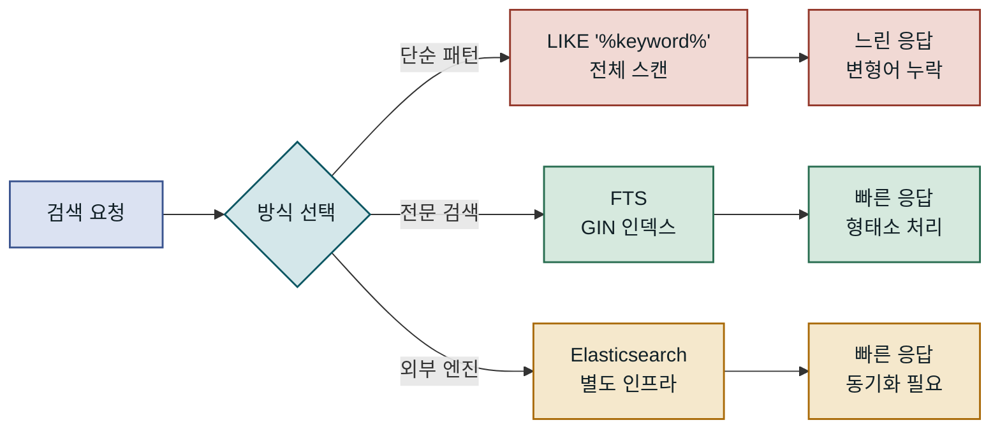
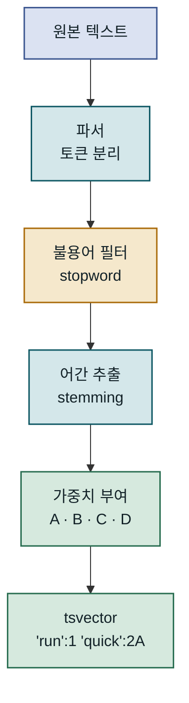
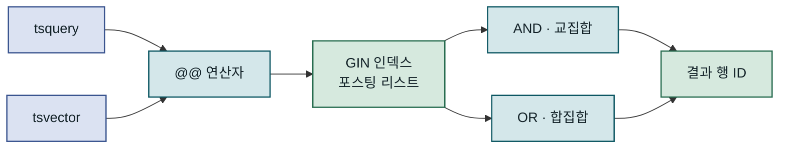
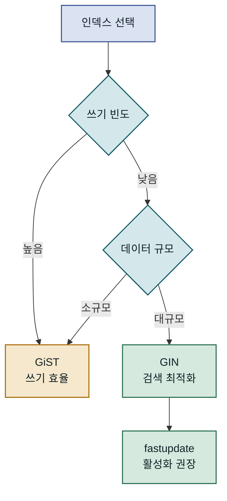
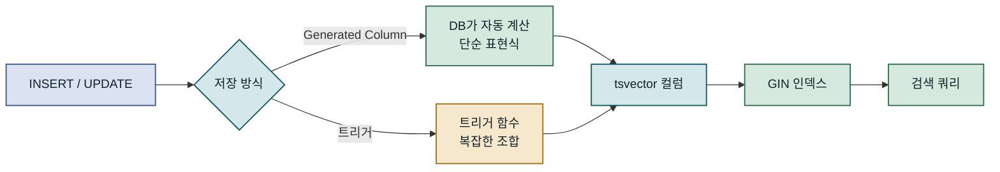
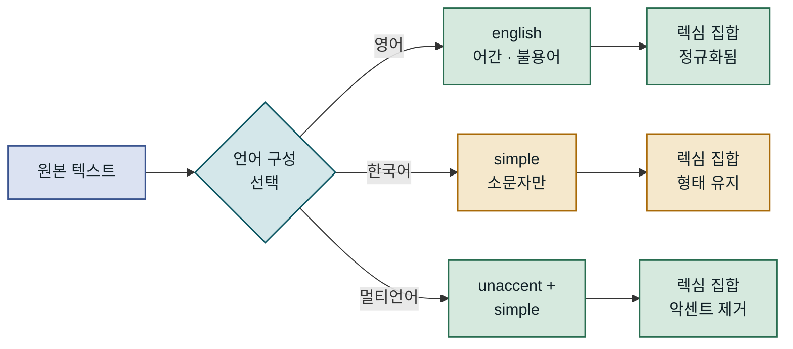
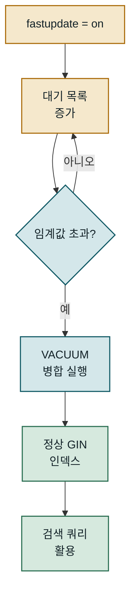

## 목차

1. 개요
2. tsvector와 tsquery의 동작 원리
3. GIN 인덱스 설계와 성능 특성
4. 검색 기능 실전 구현
5. 한국어 검색과 다국어 처리
6. 운영 환경 적용 시 고려사항
7. 맺음말

---

## 개요

### 문제 배경

데이터베이스에서 텍스트 검색 요구사항은 크게 두 가지로 나뉩니다. 정확한 값을 찾는 `=` 연산자나 패턴 일치를 위한 `LIKE`, 그리고 의미 기반의 전문 검색(Full Text Search)입니다. 초기에는 `LIKE '%키워드%'`로 충분해 보이지만, 데이터가 수백만 건을 넘어서는 순간 성능과 품질 두 가지 문제가 동시에 터집니다. PostgreSQL의 Full Text Search는 `tsvector`로 문서를 정규화하고 `tsquery`로 검색 조건을 표현하며, GIN 인덱스로 밀리초 단위 응답을 가능하게 합니다. 추가 인프라 없이 현재 PostgreSQL 안에서 의미 있는 수준의 전문 검색을 구현하는 것이 핵심 가치입니다.

### 기존 방식의 한계

`LIKE '%검색어%'` 방식의 가장 큰 문제는 인덱스를 전혀 활용하지 못한다는 점입니다. 앞쪽 와일드카드(`%`)가 붙으면 PostgreSQL은 B-tree 인덱스의 범위 스캔을 포기하고 전체 테이블을 순차 스캔합니다. 게다가 `LIKE`는 형태소 분석 없이 단순 문자열 매칭을 수행하므로, "실행"을 검색하면 "실행하다", "실행 중", "재실행" 같은 변형어를 찾지 못합니다. 검색 품질과 성능 모두 떨어집니다.

Elasticsearch나 OpenSearch 같은 전용 검색 엔진을 도입하면 이 문제를 해결할 수 있지만, 운영 복잡도가 크게 올라갑니다. 동기화 파이프라인 구축, 별도 인프라 유지, 데이터 정합성 관리 등이 추가됩니다. PostgreSQL Full Text Search는 이 둘의 중간 지점을 제공합니다. 애플리케이션이 이미 PostgreSQL을 사용하고 있다면, 추가 인프라 없이 형태소 기반 검색과 인덱스 가속을 동시에 얻을 수 있습니다.



LIKE, FTS, 외부 검색 엔진은 각각 비용과 품질 면에서 다른 트레이드오프를 가지며, FTS는 중간 지점에서 운영 단순성과 검색 품질을 동시에 확보합니다.

---

## tsvector와 tsquery의 동작 원리

### tsvector: 문서를 검색 가능한 형태로

`tsvector`는 PostgreSQL이 문서를 전처리한 결과물입니다. 원본 텍스트를 그대로 저장하는 대신, **렉심(lexeme)**이라 부르는 정규화된 단어 목록과 각 단어의 위치 정보를 압축해 담습니다. 렉심은 불용어(stopword) 제거, 소문자 변환, 어간 추출(stemming)을 거친 결과입니다. 예를 들어 "Running quickly through the forest"라는 문장은 `'forest':4 'quick':2 'run':1`처럼 변환됩니다. "the"는 불용어로 제거되고, "Running"은 "run"으로, "quickly"는 "quick"으로 어간 처리됩니다.

위치 정보는 단순 존재 여부를 넘어 구문 검색(phrase search)과 근접 검색(proximity search)을 가능하게 합니다. 위치 번호 뒤에 붙는 알파벳 `A`, `B`, `C`, `D`는 가중치(weight)를 나타냅니다. `A`가 가장 높고 `D`가 기본값입니다. 이 가중치를 활용하면 제목에서 키워드가 등장할 때 본문보다 높은 점수를 부여하는 랭킹 시스템을 구현할 수 있습니다. 가중치는 `setweight(to_tsvector('english', title), 'A')` 형태로 지정하며, 두 `tsvector` 값은 `||` 연산자로 합칩니다.

`to_tsvector(config, text)` 함수가 이 변환을 담당합니다. 첫 번째 인수 `config`는 텍스트 검색 구성(text search configuration)을 지정합니다. `'english'`를 넘기면 영어 형태소 분석기와 불용어 사전을 사용합니다. 설정을 생략하면 `default_text_search_config` 세션 변수를 따르며, 보통 `'simple'`이나 서버 로케일에 맞는 언어가 기본값입니다.



원본 텍스트가 tsvector로 변환되는 과정은 파서 → 필터 → 어간 추출 → 가중치 부여 순으로 진행되며, 각 단계가 렉심의 품질을 결정합니다.

---

### tsquery: 검색 조건 표현

`tsquery`는 검색 조건을 표현하는 타입입니다. 렉심들을 `&`(AND), `|`(OR), `!`(NOT), `<->`(FOLLOWED BY, 구문 검색) 연산자로 연결합니다. `to_tsquery('english', 'running & forest')`는 내부적으로 `'run' & 'forest'`로 변환됩니다. 입력한 단어도 `tsvector`와 동일한 정규화 과정을 거치기 때문에 형태가 다른 단어도 매칭됩니다.

`plainto_tsquery`는 사용자 입력 처리에 더 적합합니다. 특수 연산자 없이 자연어를 입력받아 모든 단어를 AND로 연결합니다. "fast full text search"를 넘기면 `'fast' & 'full' & 'text' & 'search'`가 됩니다. 반면 `websearch_to_tsquery`는 구글 검색 문법을 지원합니다. 큰따옴표로 구문 검색, 빼기 기호로 제외, 따옴표 없는 단어는 AND 결합합니다. 사용자에게 검색창을 직접 노출하는 경우 `websearch_to_tsquery`가 가장 자연스러운 경험을 제공합니다.

| 함수 | 용도 | 입력 예 | 변환 결과 |
|---|---|---|---|
| `to_tsquery` | 정밀 제어, 연산자 직접 사용 | `'run & forest'` | `'run' & 'forest'` |
| `plainto_tsquery` | 단순 AND 검색 | `'run fast'` | `'run' & 'fast'` |
| `phraseto_tsquery` | 구문(어순) 검색 | `'quick brown'` | `'quick' <-> 'brown'` |
| `websearch_to_tsquery` | 사용자 친화적 검색창 | `'"quick fox" -lazy'` | `'quick' <-> 'fox' & !'lazi'` |

### 텍스트 처리 파이프라인

`tsvector`와 `tsquery`가 `@@` 연산자로 매칭될 때 PostgreSQL이 실제로 하는 일은 두 렉심 집합의 교집합 확인입니다. GIN 인덱스가 있으면 이 교집합 연산이 포스팅 리스트(posting list) 탐색으로 치환되어 수백만 건도 밀리초 안에 처리됩니다. 포스팅 리스트는 특정 렉심이 등장하는 행의 ID 목록입니다. GIN은 렉심별 포스팅 리스트를 정렬 상태로 유지하여 AND 연산을 리스트 교차(list intersection)로, OR 연산을 리스트 합산(list union)으로 구현합니다.

이 구조 덕분에 `@@` 연산은 조건에 포함된 렉심 수에 비례하는 비용만 발생합니다. 렉심 빈도가 낮을수록(선택도가 높을수록) 포스팅 리스트가 짧아지고 교차 비용이 줄어듭니다. 반대로 매우 일반적인 단어(예: "data")는 포스팅 리스트가 길어 비용이 올라갑니다. `tsquery`에 구체적인 단어를 포함하는 것이 성능 면에서 유리한 이유가 여기에 있습니다.



`@@` 연산자가 GIN 인덱스를 활용할 때 AND/OR는 포스팅 리스트 집합 연산으로 처리되어 전체 테이블 스캔 없이 결과를 추립니다.

---

## GIN 인덱스 설계와 성능 특성

### GIN vs GiST: 어떤 인덱스를 선택할 것인가

PostgreSQL Full Text Search는 GIN(Generalized Inverted Index)과 GiST(Generalized Search Tree) 두 가지 인덱스 타입을 지원합니다. 두 타입 모두 `tsvector` 컬럼을 인덱싱할 수 있지만 내부 구조와 트레이드오프가 다릅니다.

GIN은 역인덱스(inverted index) 구조입니다. 렉심 → 행 ID 목록의 매핑을 B-tree 안에 저장합니다. 검색 속도가 빠르고, 특히 AND 조건에서 두 포스팅 리스트를 교차하는 비용이 낮습니다. 단점은 쓰기 비용입니다. 새 문서가 삽입되면 해당 문서의 모든 렉심에 대한 포스팅 리스트를 갱신해야 합니다. PostgreSQL은 이 부담을 줄이기 위해 `fastupdate` 옵션을 제공합니다. 변경사항을 즉시 반영하지 않고 "대기 목록(pending list)"에 모아뒀다가 한 번에 병합합니다. 읽기 성능은 오르지만 `VACUUM` 시점에 일시적인 부하가 발생할 수 있습니다.

GiST는 손실형(lossy) 압축을 사용해 인덱스 크기가 더 작습니다. 인덱스 스캔 후 항상 힙 재확인(heap recheck)이 필요하지만, 쓰기 오버헤드는 낮습니다. 작은 데이터셋이거나 삽입·수정이 빈번한 환경에서 유리합니다. 대규모 읽기 중심 서비스라면 GIN이 거의 항상 더 나은 선택입니다.

| 항목 | GIN | GiST |
|---|---|---|
| 검색 속도 | 빠름 (포스팅 리스트 교차) | GIN 대비 느림 (힙 재확인) |
| 인덱스 크기 | 큼 | 작음 |
| 삽입·수정 비용 | 높음 | 낮음 |
| fastupdate 지원 | 있음 | 없음 |
| 적합한 상황 | 읽기 많음, 정적 데이터 | 쓰기 많음, 소규모 데이터 |
| 주의점 | VACUUM 시 일시 부하 | 재확인 비용 |



쓰기 빈도와 데이터 규모에 따라 GIN과 GiST 중 더 적합한 인덱스가 결정됩니다.

---

### 인덱스 생성과 저장 컬럼 전략

`tsvector` 값을 매 쿼리마다 계산하면 CPU 비용이 발생합니다. 특히 여러 컬럼(제목, 본문, 태그 등)을 합쳐 검색하는 경우라면 반복 계산 비용이 무시하기 어려운 수준이 됩니다. 이를 해결하는 방법은 `tsvector`를 별도 컬럼에 미리 계산해 저장하는 것입니다.

**저장 생성 컬럼(generated stored column)**을 사용하면 PostgreSQL이 자동으로 갱신합니다. `GENERATED ALWAYS AS (...) STORED` 문법으로 정의하면 행이 삽입·수정될 때마다 표현식을 재계산해 저장합니다. 애플리케이션이나 트리거를 따로 관리할 필요가 없어 정합성 유지가 쉽습니다. 단, PostgreSQL 16 기준으로 GENERATED STORED 컬럼은 표현식 안에서 변동적인 함수를 사용할 수 없고, `setweight` 같은 함수를 여러 컬럼에 조합해 쓸 때 제약이 있습니다. 이 경우 트리거를 사용하는 방법이 더 유연합니다.

트리거 방식은 복잡한 `tsvector` 조합 로직을 PostgreSQL 함수 안에서 자유롭게 구현할 수 있습니다. `BEFORE INSERT OR UPDATE` 트리거를 걸어 `NEW.search_vector`를 직접 계산하면 됩니다. 유연성은 높지만 트리거 함수 관리와 마이그레이션 시 주의가 필요합니다.



미리 계산된 tsvector 컬럼에 GIN 인덱스를 걸면 검색 쿼리가 매번 계산 없이 인덱스만 탐색합니다.

---

### 쿼리 실행 계획 분석

인덱스가 실제로 사용되는지는 `EXPLAIN (ANALYZE, BUFFERS)`로 확인합니다. `Bitmap Index Scan on gin_idx`가 등장하면 GIN 인덱스가 활성화된 것입니다. `Seq Scan`이 보인다면 통계 정보가 오래됐거나, 결과 집합이 너무 커서 플래너가 순차 스캔을 선택한 경우입니다. 소규모 테이블에서는 인덱스를 만들어도 플래너가 순차 스캔을 선택하는 경우가 흔합니다. 이는 플래너가 올바른 판단을 한 것이므로, 실제 운영 규모(수십만 건 이상)에서 실행 계획을 검증하는 것이 중요합니다.

`ts_rank`와 `ts_rank_cd` 함수는 검색 결과에 관련도 점수를 부여합니다. 두 함수 모두 `tsvector`와 `tsquery`를 인수로 받고 `float4` 점수를 반환합니다. `ts_rank`는 렉심 빈도를 기반으로, `ts_rank_cd`는 커버 밀도(cover density)를 기반으로 점수를 계산합니다. 커버 밀도는 키워드들이 문서 안에서 얼마나 가까이 있는지를 반영하므로 구문 관련성이 더 잘 드러납니다. 두 함수 모두 `normalization` 파라미터로 문서 길이를 점수에 반영할지 제어할 수 있습니다. 긴 문서일수록 키워드 빈도가 높아지는 편향을 보정하려면 `normalization = 1`(문서 길이로 나눔)이나 `normalization = 32`(자체 순위로 나눔)를 사용합니다.

---

## 검색 기능 실전 구현

### 스키마 설계와 tsvector 컬럼 추가

블로그 포스트 검색을 예로 듭니다. `posts` 테이블에는 `title`, `body` 컬럼이 있고, 제목은 본문보다 높은 가중치를 받아야 합니다. `setweight` 함수로 제목에 `A`, 본문에 `C`를 부여하고 두 `tsvector`를 `||` 연산자로 합칩니다. GENERATED STORED 컬럼으로 정의하면 별도 트리거 없이 자동으로 갱신됩니다.

```sql
-- 기존 테이블에 검색 컬럼 추가 및 GIN 인덱스 생성
ALTER TABLE posts
  ADD COLUMN search_vector tsvector
  GENERATED ALWAYS AS (
    setweight(to_tsvector('english', coalesce(title, '')), 'A') ||
    setweight(to_tsvector('english', coalesce(body,  '')), 'C')
  ) STORED;

CREATE INDEX idx_posts_search
  ON posts USING GIN (search_vector);
  -- fastupdate는 기본값 on; 대기 목록 병합을 VACUUM에 위임

-- 기존 행에 즉시 적용됨 (ALTER TABLE이 전체 재작성 수행)
-- 수백만 건이면 유지보수 시간대 또는 pg_repack 활용 권장
```

`coalesce`로 NULL을 빈 문자열로 변환하지 않으면 `to_tsvector`가 NULL을 반환하고 `||` 연산 전체가 NULL이 됩니다. 이 실수가 의외로 자주 발생합니다. 생성 컬럼은 기존 행에 대해 즉시 계산을 수행하므로, 수백만 건이 있는 테이블에서 `ALTER TABLE`을 실행하면 전체 테이블 재작성이 일어납니다. `pg_repack` 같은 도구를 사용하면 락을 최소화하면서 컬럼을 추가할 수 있습니다.

| 가중치 | 레이블 | 권장 용도 |
|---|---|---|
| A | 최우선 | 제목, URL 슬러그 |
| B | 높음 | 부제목, 메타 설명 |
| C | 보통 | 태그, 카테고리 |
| D | 기본 | 본문 전체 |

### 검색 쿼리 작성과 결과 랭킹

사용자 입력은 항상 `websearch_to_tsquery`나 `plainto_tsquery`를 통해 안전하게 처리합니다. 원시 `to_tsquery`에 사용자 입력을 그대로 넘기면 특수문자 때문에 파싱 오류가 발생할 수 있습니다. 검색 쿼리에서는 `@@` 연산자로 매칭하고 `ts_rank_cd`로 점수를 계산합니다.

```sql
-- 기본 검색 쿼리: 랭킹 + 스니펫 포함
SELECT
  p.id,
  p.title,
  ts_rank_cd(p.search_vector, query, 1) AS score,
  ts_headline(
    'english', p.body, query,
    'MaxWords=35, MinWords=15, ShortWord=3, HighlightAll=false'
  ) AS snippet
FROM posts p,
     websearch_to_tsquery('english', '검색할 키워드') AS query
WHERE p.search_vector @@ query
ORDER BY score DESC
LIMIT 20;

-- score: 0.0~1.0 사이의 관련도 점수 (normalization=1 적용)
-- snippet: 키워드 주변 맥락을 <b>강조</b>한 HTML 조각
```

`ts_headline`은 본문에서 키워드 주변 컨텍스트를 추출해 HTML `<b>` 태그로 강조합니다. 이 함수는 **인덱스를 사용하지 않고** 원본 텍스트를 처리하므로, WHERE 절과 ORDER BY 이후에 실행되어야 합니다. 결과가 수천 건일 때 `ts_headline`을 호출하면 성능이 급격히 저하됩니다. 반드시 `LIMIT`으로 결과를 줄인 뒤 적용해야 합니다. `MaxWords`, `MinWords` 옵션으로 스니펫 길이를 제어하고, `ShortWord`로 짧은 단어 강조를 조절합니다.

### 복합 필터와 페이지네이션

전문 검색은 대부분 다른 필터 조건과 함께 사용됩니다. 특정 카테고리 안에서 검색하거나, 날짜 범위를 제한하거나, 상태가 `'published'`인 행만 대상으로 하는 경우입니다. 이때 인덱스 선택 전략이 중요합니다. PostgreSQL 플래너는 `search_vector @@ query` 조건의 선택도와 `category_id = 5` 같은 조건의 선택도를 비교해 어느 인덱스를 먼저 적용할지 결정합니다. 카테고리 조건이 더 선택적이라면 B-tree 인덱스로 필터링한 뒤 나머지 행에 GIN 스캔을 적용하는 방식이 효율적일 수 있습니다.

페이지네이션에서는 OFFSET 방식보다 키셋(keyset) 페이지네이션이 유리합니다. OFFSET 기반은 50페이지를 요청하면 앞의 950건을 스캔하고 버리는 방식이어서, 뒤로 갈수록 느려집니다. `score DESC, id DESC` 기준으로 마지막 행의 값을 기억하고 다음 페이지에서 `WHERE (score, id) < (last_score, last_id)` 조건으로 범위를 좁히면 일정한 성능을 유지할 수 있습니다. Full Text Search와 키셋 페이지네이션을 결합하면 수십만 건 규모에서도 일관된 응답 시간을 기대할 수 있습니다.


`ts_headline`은 LIMIT 이후 소수의 행에만 적용해야 성능을 유지할 수 있습니다.

---

## 한국어 검색과 다국어 처리

### 언어별 텍스트 검색 구성

PostgreSQL은 텍스트 검색 구성(text search configuration)을 언어별로 분리합니다. `\dF` 메타커맨드로 설치된 구성 목록을 확인할 수 있습니다. `english`, `german`, `french` 등 주요 유럽 언어는 기본 설치에 포함됩니다. 각 구성은 파서, 불용어 사전, 동의어 사전, 어간 추출기의 조합으로 이루어집니다.

언어별 구성 선택이 중요한 이유는 어간 추출과 불용어 처리가 언어에 따라 완전히 다르기 때문입니다. `'english'` 구성에서 "the", "is", "at"은 불용어로 제거됩니다. `'simple'` 구성은 소문자 변환만 수행하고 어간 추출이나 불용어 제거를 하지 않습니다. 어간 추출이 불필요하거나 언어를 특정할 수 없는 경우 `'simple'`이 안전한 기본값입니다. 다중 언어 콘텐츠를 단일 `tsvector` 컬럼에 담아야 한다면 `'simple'`에 `unaccent` 확장을 추가해 악센트 기호를 제거하는 방식이 실용적입니다.



언어 구성이 다르면 렉심 집합의 품질이 달라지며, 한국어는 별도 확장이 없으면 `simple` 구성이 현실적인 최선입니다.

---

### 한국어 검색의 현실적 한계

PostgreSQL 기본 설치에는 한국어 전용 텍스트 검색 구성이 없습니다. 한국어 형태소 분석기인 은전한닢(MeCab 기반), KoNLPy, Komoran 등은 PostgreSQL 내장 프레임워크와 직접 통합되지 않습니다. `'simple'` 구성을 사용하면 소문자 변환만 되고 어간 추출이 없어, "검색하다"와 "검색"은 다른 렉심으로 취급됩니다. 사용자가 "검색"을 입력해도 "검색하다"가 담긴 문서는 매칭되지 않습니다.

> **핵심 규칙**: 한국어 검색에서 PostgreSQL 내장 FTS만 사용하면 형태소 변화를 처리할 수 없습니다. `pg_bigm` 확장이나 외부 형태소 분석 후 전처리 저장 방식을 병행해야 합니다.

이 한계를 우회하는 현실적인 방법이 있습니다. **pg_bigm** 확장은 바이그램(bigram) 기반 전문 검색을 제공합니다. 바이그램은 연속된 두 글자를 토큰으로 삼습니다. "한국어"는 "한국", "국어"로 분해됩니다. 형태소 분석 없이도 부분 문자열 검색이 가능해지고, GIN 인덱스를 활용할 수 있어 `LIKE '%keyword%'`보다 훨씬 빠릅니다. 단, 바이그램 특성상 매우 짧은 단어(한 글자)는 검색이 어렵고, 인덱스 크기가 커진다는 점을 감안해야 합니다.

### pg_bigm을 활용한 한국어 바이그램 검색

`pg_bigm`을 설치하면 `%` 연산자(유사도 검색)와 GIN 기반 `LIKE` 가속 검색이 가능해집니다. `CREATE INDEX idx_title_bigm ON posts USING GIN (title gin_bigm_ops)`로 인덱스를 만들면, `WHERE title LIKE '%검색%'` 쿼리가 순차 스캔 대신 GIN 인덱스를 활용합니다. 원본 FTS와 병행 사용도 가능합니다. 영문 필드는 `tsvector` + GIN, 한국어 필드는 `pg_bigm` + GIN을 각각 적용하고 쿼리 레이어에서 합산하는 구조입니다.

외부 형태소 분석 방식은 애플리케이션 레이어(Python, Java 등)에서 형태소를 추출해 별도 컬럼에 저장하는 방법입니다. 예를 들어 KoNLPy로 명사만 추출해 공백으로 연결한 문자열을 `morphemes` 컬럼에 저장하고, 이 컬럼에 `simple` 구성으로 `tsvector`를 적용합니다. 품질은 높지만 파이프라인 복잡도가 올라가고 형태소 분석기의 정확도에 의존한다는 트레이드오프가 있습니다. 두 방식 중 `pg_bigm`은 구축 비용이 낮고, 외부 형태소 분석은 검색 품질이 높습니다. 서비스 요구사항에 따라 선택하거나 병행합니다.

---

## 운영 환경 적용 시 고려사항

### 흔한 실수와 함정

가장 자주 발생하는 실수는 `tsvector`를 매 쿼리마다 즉석 계산하는 것입니다. `WHERE to_tsvector('english', body) @@ query`처럼 WHERE 절에서 직접 계산하면 GIN 인덱스가 동작하지 않습니다. 인덱스는 미리 계산된 컬럼 값을 보고 있으므로, 함수를 씌워 다른 표현식을 만들면 플래너가 인덱스를 인식하지 못합니다. 함수 기반 인덱스를 만들거나, 계산 결과를 별도 컬럼에 저장해야 GIN이 활성화됩니다.

두 번째 함정은 `ts_headline` 성능입니다. 이 함수는 결과 행 수에 선형으로 비례하는 비용이 발생합니다. 1,000건의 결과에 `ts_headline`을 적용하면 원본 텍스트를 1,000번 파싱합니다. 반드시 `LIMIT`으로 결과를 줄인 뒤 적용해야 합니다. CTE를 사용해 검색과 스니펫 생성을 명시적으로 분리하면 의도를 명확히 드러낼 수 있습니다.

세 번째는 `fastupdate`와 `VACUUM` 상호작용입니다. `fastupdate = on`이면 GIN 대기 목록이 쌓이고 `VACUUM` 시점에 인덱스에 병합됩니다. 대기 목록이 너무 크면 수동으로 `SELECT gin_clean_pending_list('idx_posts_search')`를 실행하거나, 오토베큠 설정을 조정해 대기 목록이 과도하게 커지지 않도록 관리해야 합니다.



fastupdate 대기 목록이 임계값을 넘으면 VACUUM이 병합하며, 이 시점에 일시적인 쓰기 부하가 발생합니다.

---

### 모니터링과 디버깅

운영 환경에서 Full Text Search 성능을 추적할 때 살펴야 할 지표가 있습니다. `pg_stat_user_indexes` 뷰에서 `idx_scan`(인덱스 스캔 횟수), `idx_tup_read`(읽은 인덱스 튜플 수), `idx_tup_fetch`(실제 힙에서 가져온 튜플 수)를 모니터링합니다. `idx_scan`이 0이거나 매우 낮으면 인덱스가 실제로 사용되지 않는다는 신호입니다.

슬로우 쿼리는 `pg_stat_statements` 확장으로 추적합니다. `mean_exec_time`이 높은 Full Text Search 쿼리를 찾아 `EXPLAIN (ANALYZE, BUFFERS, FORMAT JSON)`으로 상세 분석합니다. `Bitmap Heap Scan`에서 `Recheck Cond`가 나타나면 GiST 인덱스 또는 GIN `fastupdate` 대기 목록에서 재확인이 일어난 것입니다.

`ts_debug(config, text)` 함수는 텍스트 처리 파이프라인의 각 단계를 투명하게 보여줍니다. 특정 단어가 왜 렉심으로 인식되지 않는지 디버깅할 때 유용합니다. `ts_lexize(dictionary, word)`로 특정 사전이 단어를 어떻게 처리하는지 확인하고, `ts_parse(parser, text)`로 파서가 어떤 토큰을 생성하는지 볼 수 있습니다.

| 도구 | 용도 | 확인 방법 |
|---|---|---|
| `EXPLAIN (ANALYZE, BUFFERS)` | 실행 계획, 인덱스 활용 확인 | Bitmap Index Scan 등장 여부 |
| `pg_stat_user_indexes` | 인덱스 사용 통계 | `idx_scan` 값 추이 |
| `pg_stat_statements` | 슬로우 쿼리 추적 | `mean_exec_time` 정렬 |
| `ts_debug` | 텍스트 파이프라인 투명성 | 렉심 미인식 원인 파악 |
| `gin_clean_pending_list` | 대기 목록 수동 병합 | fastupdate 환경 관리 |

### 확장과 마이그레이션 전략

데이터가 수천만 건 이상으로 늘어나면 PostgreSQL FTS의 한계가 드러납니다. 단일 서버에서 GIN 인덱스 유지 비용이 올라가고, 분산 처리가 불가능합니다. 이 시점에 Elasticsearch나 OpenSearch로 마이그레이션을 고려합니다. 마이그레이션 중간 단계로 PostgreSQL FTS와 외부 검색 엔진을 병행 운영하는 **듀얼 라이트(dual write)** 패턴을 사용할 수 있습니다. 쓰기는 PostgreSQL과 검색 엔진 양쪽에 하고, 읽기는 처음엔 PostgreSQL에서, 검증이 끝나면 검색 엔진으로 전환합니다.

반대로 Elasticsearch에서 PostgreSQL로 돌아오는 경우도 있습니다. 검색 트래픽이 예상보다 적거나 데이터 규모가 수십만 건 이하에 머무는 경우, 별도 인프라 유지 비용이 이점보다 크다고 판단될 때입니다. PostgreSQL FTS를 잘 설계하면 수백만 건 수준까지 충분히 운영할 수 있습니다. 파티셔닝과 읽기 전용 복제본을 조합하면 단일 인스턴스의 한계를 더 늦출 수 있습니다. Full Text Search 쿼리는 CPU 바운드보다 I/O 바운드 경향이 있어, 읽기 복제본으로 검색 부하를 분산하는 것이 효과적입니다.

---

## 맺음말

### 핵심 요약

PostgreSQL Full Text Search는 `tsvector`와 `tsquery`를 핵심 타입으로, GIN 인덱스를 성능 구조로 삼는 내장 전문 검색 솔루션입니다. `tsvector`는 원본 텍스트를 어간 추출과 불용어 제거를 거친 렉심 집합으로 변환하고, `tsquery`는 검색 조건을 논리 연산자로 표현합니다. `@@` 연산자가 두 타입을 매칭할 때 GIN 인덱스가 포스팅 리스트 교차 연산으로 결과를 수십 밀리초 안에 추립니다.

`setweight`로 필드별 가중치를 다르게 주고, `ts_rank_cd`로 관련도 점수를 계산하며, `ts_headline`으로 검색 스니펫을 생성하는 것이 기본 패턴입니다. GENERATED STORED 컬럼으로 `tsvector`를 미리 계산해두면 쿼리 비용이 낮아집니다. 한국어는 `pg_bigm` 확장이나 외부 형태소 분석 전처리가 필요하며, `fastupdate`와 `VACUUM`의 상호작용, `ts_headline` 적용 시점, 즉석 `tsvector` 계산 금지가 운영에서 놓치기 쉬운 포인트입니다.

### 적용 판단 기준

PostgreSQL Full Text Search는 이미 PostgreSQL을 데이터 저장소로 사용하고 있고, 검색 트래픽이 초당 수백 건 이하이며, 데이터 규모가 수천만 건을 넘지 않을 때 적합합니다. 영문 콘텐츠라면 기본 구성만으로도 즉시 사용 가능하고, 별도 검색 인프라를 추가하지 않아도 되므로 운영 복잡도를 낮게 유지하면서 `LIKE` 검색 대비 의미 있는 성능과 품질 향상을 얻을 수 있습니다.

반면 초당 수천 건 이상의 검색 요청, 수억 건 규모의 데이터, 정교한 한국어 형태소 분석, 실시간 인덱싱이 필수인 환경에서는 Elasticsearch나 OpenSearch가 더 적합합니다. PostgreSQL FTS를 먼저 도입해 실제 부하를 측정하고, 병목이 드러나는 시점에 전용 검색 엔진으로 이전하는 점진적 접근이 초기 투자 비용을 낮추는 현실적인 전략입니다.
