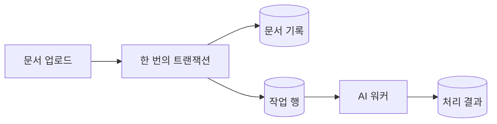
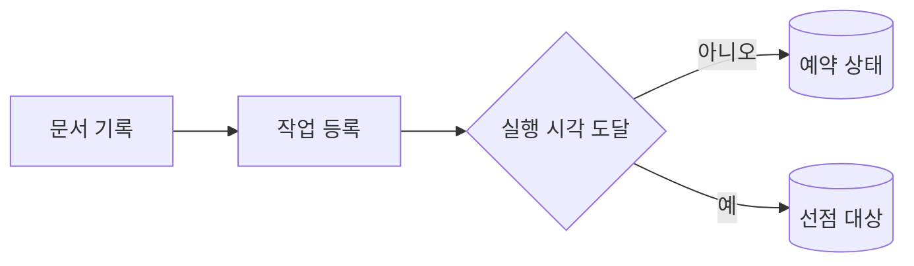
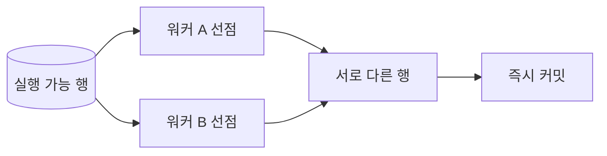
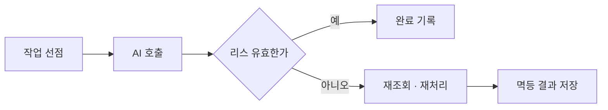
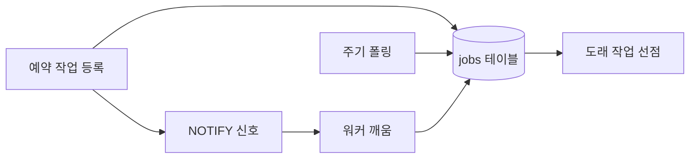
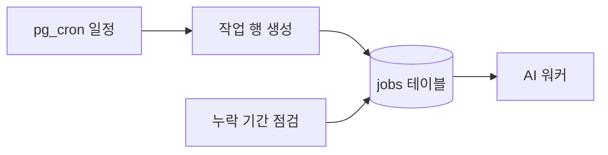
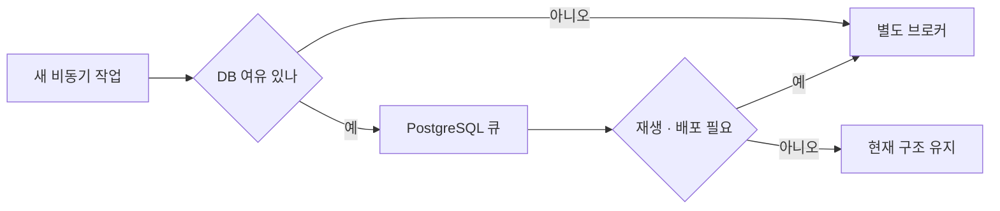
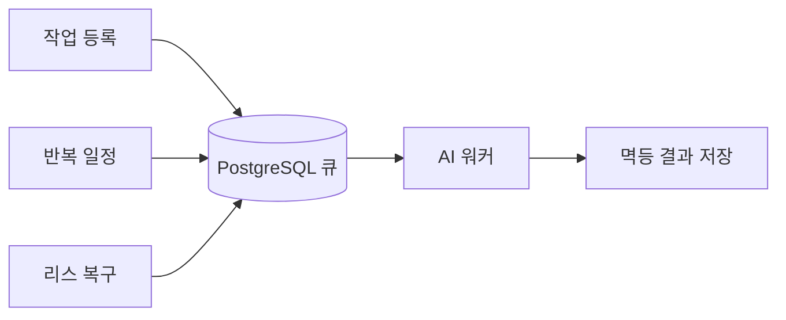

## 목차

1. PostgreSQL을 큐로 쓰려는 이유
2. 작업 테이블과 원자적 선점
3. 실패·중복 실행·리스 복구
4. 예약 작업과 반복 스케줄
5. 운영 중 병목과 관측 지표
6. 별도 브로커가 필요한 경계
7. 맺음말

---

## PostgreSQL을 큐로 쓰려는 이유

### AI 작업이 동기 요청에 맞지 않을 때

문서 업로드 후 텍스트 추출, 임베딩 생성, 이미지 분석처럼 수 초에서 수 분이 걸리는 AI 작업을 HTTP 요청 안에서 끝내려 하면 응답 시간과 실패 처리가 불안정해집니다. 요청은 작업을 등록하고 곧바로 ID를 돌려주며, 워커가 뒤에서 처리하는 구성이 자연스럽습니다. 여기서 꼭 Kafka나 RabbitMQ부터 도입해야 하는 것은 아닙니다. 이미 PostgreSQL을 사용한다면 **작업 행을 저장하고 여러 워커가 나누어 가져오는 큐**를 먼저 고려할 수 있습니다.

이 방식의 핵심 장점은 비즈니스 데이터와 작업 등록을 한 트랜잭션에 넣을 수 있다는 점입니다. 문서 메타데이터는 커밋됐는데 임베딩 작업 메시지 발행은 실패하는 간극을 줄일 수 있습니다. 반면 데이터베이스는 업무 조회와 쓰기도 처리합니다. 작업 행의 빈번한 갱신과 폴링이 핵심 테이블의 지연 시간에 영향을 주기 시작하면, 인프라를 줄인 이점보다 격리 부족이 더 큰 문제가 됩니다.



문서와 작업 행을 함께 커밋하면 작업 등록 여부를 같은 데이터베이스에서 확인할 수 있습니다. AI 호출 자체는 커밋 뒤 워커가 수행합니다.

### 큐, 스케줄러, 워커는 서로 다른 역할입니다

**큐**는 처리할 작업을 보관하고 누가 가져갔는지 기록합니다. **스케줄러**는 작업이 언제 실행 가능해지는지 결정합니다. **워커**는 실제 임베딩 API 호출이나 파일 변환을 실행합니다. PostgreSQL은 앞의 두 역할에 필요한 상태를 저장할 수 있지만, 데이터베이스 안에서 외부 API 호출을 오래 실행하는 구조까지 권장한다는 뜻은 아닙니다. 특히 AI 작업은 모델 서버의 속도 제한, 대용량 입력, 재시도 정책에 따라 실행 시간이 크게 달라집니다.

| 역할 | PostgreSQL이 맡는 일 | 애플리케이션이 맡는 일 | 주의점 |
|---|---|---|---|
| 작업 큐 | 작업 행·상태·예약 시각 보관 | 선점·실행·완료 처리 | 중복 실행 대비 |
| 스케줄 | `run_at` 저장, 선택적으로 `pg_cron` 실행 | 반복 작업 생성·누락 복구 | 시간대·장애 복구 |
| AI 워커 | 결과·진행 기록 저장 | 모델 호출·동시 실행 제한 | DB 트랜잭션 밖에서 실행 |

이 세 역할을 분리하면 나중에 큐만 별도 서비스로 옮겨도 작업을 만드는 비즈니스 코드와 워커 실행 코드를 비교적 명확하게 유지할 수 있습니다.

---

## 작업 테이블과 원자적 선점

### 먼저 작업 행이 표현해야 할 것

AI 작업 테이블에는 종류와 입력 참조, 실행 가능 시각, 상태, 시도 횟수, 실행권의 만료 시각이 필요합니다. 입력 문서 전체나 사용자 프롬프트를 `payload`에 복사하기보다는 식별자와 필요한 옵션만 두는 편이 보관 기간과 접근 권한을 관리하기 쉽습니다. 아래 예시는 `ready → running → done`을 기본 경로로, 반복 실패를 `dead`로 보내는 간단한 모델입니다. `idempotency_key`는 같은 문서와 모델 버전의 작업을 중복 등록하지 않기 위한 선택적 키입니다.

```sql
CREATE TABLE jobs (
    id bigint GENERATED ALWAYS AS IDENTITY PRIMARY KEY,
    kind text NOT NULL,
    payload jsonb NOT NULL,
    status text NOT NULL DEFAULT 'ready'
        CHECK (status IN ('ready', 'running', 'done', 'dead')),
    run_at timestamptz NOT NULL DEFAULT now(),
    attempts integer NOT NULL DEFAULT 0 CHECK (attempts >= 0),
    max_attempts integer NOT NULL DEFAULT 5 CHECK (max_attempts > 0),
    lease_token uuid,
    lease_until timestamptz,
    idempotency_key text UNIQUE,
    created_at timestamptz NOT NULL DEFAULT now(),
    finished_at timestamptz
);

CREATE INDEX jobs_ready_due_idx ON jobs (run_at, id)
    WHERE status = 'ready';
CREATE INDEX jobs_running_lease_idx ON jobs (lease_until)
    WHERE status = 'running';
```

`ready` 작업만 찾는 쿼리에는 부분 인덱스가 도움이 될 수 있습니다. `run_at`이 미래인 작업도 같은 테이블에 보관하므로, 워커는 `run_at <= now()` 조건으로 실행 가능한 행만 읽습니다. 문서 업로드와 작업 등록은 같은 트랜잭션으로 묶고, 중복 등록이 정상적으로 일어날 수 있다면 `INSERT ... ON CONFLICT (idempotency_key) DO NOTHING`을 사용할 수 있습니다. 키의 범위는 `문서 ID + 모델 버전 + 작업 종류`처럼 결과가 달라지는 입력을 모두 포함해야 합니다.



예약 작업과 즉시 작업은 별도 큐가 없어도 `run_at` 하나로 구분할 수 있습니다. 단, 인덱스와 보관 정책은 실제 작업량으로 검증해야 합니다.

### 여러 워커가 같은 작업을 가져가지 않게 하기

워커가 `SELECT`로 작업을 읽은 다음 별도 `UPDATE`로 상태를 바꾸면 두 워커가 같은 행을 볼 수 있습니다. PostgreSQL의 `FOR UPDATE SKIP LOCKED`는 다른 트랜잭션이 잠근 행을 기다리지 않고 건너뜁니다. 공식 문서도 이를 **큐와 비슷한 테이블에서 소비자 간 잠금 경합을 줄이는 용도**로 설명합니다. 아래 쿼리는 한 문장 안에서 최대 10건을 선택하고 `running`으로 바꾸며, 선점한 행을 `RETURNING`으로 돌려줍니다. `:lease_token`은 이 선점 시도마다 애플리케이션이 새로 만든 UUID 매개변수입니다.

```sql
WITH picked AS (
    SELECT id
    FROM jobs
    WHERE status = 'ready' AND run_at <= now()
    ORDER BY run_at, id
    LIMIT 10
    FOR UPDATE SKIP LOCKED
)
UPDATE jobs AS j
SET status = 'running',
    attempts = attempts + 1,
    lease_token = :lease_token,
    lease_until = clock_timestamp() + interval '2 minutes'
FROM picked
WHERE j.id = picked.id
RETURNING j.id, j.kind, j.payload, j.attempts, j.lease_until;
```

선점 쿼리는 **짧은 트랜잭션에서 실행하고 바로 커밋**해야 합니다. 임베딩 API가 끝날 때까지 행 잠금을 유지하면 다른 워커뿐 아니라 데이터베이스의 정리 작업에도 부담을 줍니다. `SKIP LOCKED`는 잠긴 행을 건너뛰므로 절대적인 FIFO 순서를 보장하지 않습니다. 순서가 비즈니스 규칙이라면 단순 `ORDER BY`만으로 해결하려고 해서는 안 됩니다.



행 잠금은 선점 트랜잭션 동안만 중복 선택을 막습니다. 커밋 이후의 장시간 작업은 별도의 리스와 멱등 처리로 보호해야 합니다.

---

## 실패·중복 실행·리스 복구

### 리스는 완료 보장이 아닙니다

선점 후 워커 프로세스가 죽으면 작업은 `running`에 남습니다. 이를 다시 실행하기 위해 **리스(lease)**, 즉 일정 시간 동안만 유효한 실행권을 둡니다. `lease_until`이 지난 작업을 회수하는 별도 짧은 작업이 `ready`로 되돌리거나, 최대 시도를 넘겼다면 `dead`로 보냅니다. 워커가 정상적으로 오래 실행된다면 주기적으로 리스를 연장해야 합니다. 두 분은 예시 값일 뿐이며, 실제 값은 작업 시간 분포와 재시도 지연 요구에 맞춰 정합니다.

완료를 저장할 때는 작업 ID뿐 아니라 **현재 리스 토큰**과 만료 시각을 확인합니다. 아래 SQL은 `:id`, `:lease_token`에 해당하는 선점 시도만 완료하도록 제한합니다. 갱신 행 수가 0이면 이미 리스를 잃었거나 다른 워커가 재선점했을 수 있으므로, 예전 워커가 결과를 덮어쓰지 않도록 합니다. 장시간 작업의 리스 연장도 같은 토큰을 조건에 걸어야 합니다.

```sql
UPDATE jobs
SET status = 'done',
    lease_token = NULL,
    lease_until = NULL,
    finished_at = clock_timestamp()
WHERE id = :id
  AND status = 'running'
  AND lease_token = :lease_token
  AND lease_until > clock_timestamp();
```

리스가 만료됐지만 외부 AI API 호출은 이미 성공했을 수 있습니다. 이때 작업을 재실행하면 API 비용이나 결과 저장이 중복될 수 있습니다. 따라서 위 조건은 **오래된 워커의 완료 기록을 막을 뿐**, 외부 부작용을 한 번만 일으킨다는 보장은 하지 않습니다. 임베딩 결과는 `문서 ID + 모델 버전`에 유니크 제약을 두고 upsert하거나, 외부 API가 지원하는 멱등 키를 전달하는 식으로 재실행에 대비해야 합니다.



리스는 장애 후 작업이 영원히 멈추지 않도록 하는 장치입니다. 중복 실행을 없애는 장치가 아니라는 점을 결과 저장 단계에 반영해야 합니다.

### 재시도와 격리해야 할 실패

일시적인 모델 API 시간 초과라면 다음 `run_at`을 미래로 미루고 `ready`로 되돌립니다. 잘못된 파일 형식처럼 다시 해도 실패할 오류라면 곧바로 `dead`로 보내는 편이 낫습니다. 재시도 간격은 지수 백오프와 작은 무작위 지연을 적용해 한꺼번에 실패한 작업이 같은 시각에 다시 몰리지 않게 할 수 있습니다. 최대 시도에 도달한 작업은 원인과 입력 참조를 남겨 재처리 여부를 판단해야 합니다.

실패 처리도 `WHERE id = :id AND lease_token = :lease_token AND status = 'running'` 조건으로 갱신합니다. 만료된 리스 회수 작업과 정상 워커의 실패 기록이 경쟁할 수 있기 때문입니다. 회수 작업은 `lease_until < clock_timestamp()`인 행만 대상으로 짧은 배치로 처리하고, `attempts >= max_attempts`는 `dead`로 분기합니다. 반복 장애 중에도 무한 재시도로 데이터베이스와 모델 API를 압박하지 않도록 워커 동시 실행 수를 제한해야 합니다.

| 실패 지점 | 재시도 조건 | 별도 기록 | 주의점 |
|---|---|---|---|
| 모델 API 일시 장애 | 백오프 후 재시도 | 오류 유형·시도 횟수 | 동시 요청 제한 |
| 워커 중단 | 리스 만료 후 회수 | 이전 리스 토큰 | 외부 호출 중복 가능 |
| 입력 자체 오류 | 재시도 중단 | 검증 실패 이유 | `dead` 작업 점검 |
| 완료 기록 실패 | 결과 조회 후 재처리 | 결과의 멱등 키 | 이미 과금됐을 수 있음 |

---

## 예약 작업과 반복 스케줄

### 한 번 실행할 작업은 `run_at`으로 충분합니다

예약 시각이 정해진 단발 작업이라면 `run_at`을 미래로 저장하고 워커가 도래한 행을 선점하면 됩니다. 예를 들어 업로드 직후가 아니라 밤에 임베딩을 생성하려면 작업 행의 시각만 조정합니다. 시각을 `timestamptz`로 저장하고, 사용자에게 표시할 시간대와 실제 실행 기준 시각을 구분해야 합니다. 서버와 애플리케이션의 타임존 설정이 달라도 비교 기준이 일관되도록 입력 시각의 시간대를 명확히 정합니다.

워커는 주기적으로 실행 가능 작업을 확인할 수 있습니다. 대기 시간을 줄이려면 새 작업 등록 뒤 `NOTIFY`를 보내 워커를 깨우는 방법도 있습니다. 하지만 `LISTEN/NOTIFY`는 **영속 작업 기록을 대신할 수 없습니다**. 연결이 끊겼거나 워커가 듣고 있지 않을 때의 작업은 테이블에 남아 있어야 합니다. 알림은 빠른 깨우기 신호로 쓰고, 일정 간격의 폴링은 누락된 신호를 복구하는 안전망으로 남겨 두는 편이 좋습니다.



알림이 유실되거나 연결이 재설정돼도 주기 폴링이 테이블의 미처리 작업을 다시 찾습니다.

### 반복 일정에는 `pg_cron`을 검토합니다

매일 새 임베딩 갱신 작업을 만드는 일정처럼 **반복 실행**이 필요하면 `pg_cron` 확장을 사용할 수 있습니다. `pg_cron`은 PostgreSQL 안에서 SQL 명령을 예약 실행하는 확장입니다. 외부 모델 API를 직접 호출하는 워커가 아니므로, 다음 예제처럼 정해진 시각에 작업 행을 생성하고 애플리케이션 워커가 이를 처리하도록 연결합니다. 예제는 확장이 애플리케이션 데이터베이스에 설치돼 있고, `cron.timezone`을 UTC로 설정했다고 가정합니다.

```sql
SELECT cron.schedule(
    'daily-ai-ingest',
    '0 2 * * *',
    $$
    INSERT INTO jobs (kind, payload, run_at, idempotency_key)
    VALUES (
        'daily_ingest',
        '{}'::jsonb,
        statement_timestamp(),
        'daily_ingest:' || to_char(
            statement_timestamp() AT TIME ZONE 'UTC', 'YYYY-MM-DD'
        )
    )
    ON CONFLICT (idempotency_key) DO NOTHING
    $$
);
```

고유 키는 같은 날짜의 작업이 두 번 만들어지는 것을 막습니다. 다만 데이터베이스 장애나 스케줄 설정 오류로 아예 실행되지 않은 날짜까지 자동으로 채우지는 않습니다. 누락 기간을 확인하고 작업을 보충하는 절차가 따로 필요합니다. 관리형 PostgreSQL에서는 확장 사용 가능 여부와 권한을 먼저 확인해야 하며, `pg_cron` 자체도 연결 또는 백그라운드 워커 자원을 사용합니다. 시간대 변경과 일광절약시간을 쓰는 일정이라면 특정 시각이 건너뛰거나 반복될 수 있으므로, 예약 시각보다 **논리적 실행일**을 멱등 키로 삼는 설계를 검토합니다.



반복 일정은 작업을 **생성**하고, 큐는 생성된 작업을 **전달**합니다. 두 단계 모두 멱등 키와 누락 점검이 필요합니다.

---

## 운영 중 병목과 관측 지표

### 데이터베이스에는 작업 행의 수명 비용이 남습니다

작업 큐는 `ready → running → done`으로 행을 계속 갱신하고, 완료 작업을 지우거나 보관합니다. 이 변경은 WAL(미리 쓰기 로그)을 만들고 죽은 튜플을 남기므로, 작업량이 늘면 자동 VACUUM과 인덱스 유지 비용을 확인해야 합니다. 업무 데이터와 같은 인스턴스를 사용한다면 큐의 급증이 일반 API의 지연 시간과 복제 지연에도 영향을 줄 수 있습니다. `SKIP LOCKED`는 워커끼리 같은 행을 기다리는 시간을 줄일 뿐, 이러한 쓰기 비용을 없애지는 않습니다.

완료 작업은 조회 요구와 보관 기간을 정해 주기적으로 정리합니다. 대량 삭제 한 번으로 모든 행을 지우면 WAL과 잠금 부담이 커질 수 있어 작은 배치로 처리하거나, 규모가 커지면 날짜 기준 파티셔닝을 검토할 수 있습니다. 파티셔닝은 초기부터 필수는 아닙니다. 먼저 `EXPLAIN (ANALYZE, BUFFERS)`로 선점 쿼리의 실제 읽기 범위를 보고, 인덱스가 조건과 맞는지 확인하는 편이 순서에 맞습니다.


큐의 비용은 작업 행의 개수보다 **얼마나 자주 쓰고 지우는지**에서 먼저 드러날 수 있습니다.

### 처리량보다 지연과 누락을 먼저 봅니다

대기 행 수만 보면 아직 `run_at`이 오지 않은 정상 예약 작업 때문에 경보가 과하게 울릴 수 있습니다. 실행 가능하지만 오래 기다린 작업의 **가장 오래된 대기 시간**, 단위 시간당 완료·실패 건수, 만료 리스 수를 함께 봐야 합니다. AI 작업이라면 모델별 호출 시간과 오류율, 외부 API의 속도 제한 응답도 분리해 기록합니다. 워커가 느린 것인지 데이터베이스에서 선점이 느린 것인지 구분해야 증설 방향이 보입니다.

| 지표 | 알려 주는 문제 | 먼저 확인할 곳 | 주의점 |
|---|---|---|---|
| 도래 작업의 최대 대기 시간 | 워커 처리 지연 | 워커 수·모델 응답 | 미래 예약 제외 |
| 리스 만료·재시도 비율 | 중단·시간 초과 | 작업 시간 분포 | 리스가 너무 짧을 수 있음 |
| `dead` 작업 증가 | 영구 오류·재시도 실패 | 입력 검증·외부 장애 | 무한 재시도 금지 |
| DB 쓰기·WAL·복제 지연 | 큐가 본업에 미치는 부담 | 작업 행 정리·인덱스 | 인스턴스 전체 관찰 |

운영 중에는 워커 동시 실행 수와 선점 배치 크기를 독립적으로 조정해야 합니다. 배치를 크게 가져와도 GPU나 외부 모델 호출 한도가 낮으면 리스만 점유한 작업이 늘어납니다. 필요한 만큼만 선점하고, 처리 용량을 넘는 작업은 `ready`에 남겨 두는 것이 회복을 쉽게 만듭니다.

---

## 별도 브로커가 필요한 경계

### PostgreSQL이 적합한 조건

처리량이 비교적 작고, 작업 결과가 같은 PostgreSQL의 업무 데이터와 밀접하며, 몇 초의 대기 지연을 허용한다면 단일 저장소로 시작하는 선택이 합리적일 수 있습니다. 문서 상태 변경과 임베딩 작업 등록을 한 트랜잭션으로 묶을 수 있고, 실패 작업도 SQL로 조사하기 쉽습니다. 다만 **측정 없이 특정 건수나 초당 처리량을 안전한 기준으로 제시할 수는 없습니다**. 작업의 크기, 인덱스, 워커 수, 기존 데이터베이스 부하에 따라 한계가 달라집니다.

반대로 많은 독립 소비자에게 사건을 배포하거나, 높은 처리량과 긴 보존·재생 기능이 필요하거나, 큐의 급증을 업무 데이터베이스와 분리해야 한다면 별도 브로커가 유리합니다. Kafka의 로그 재생과 RabbitMQ의 메시지 라우팅처럼 필요한 기능이 다르므로, 단순히 “큐가 커졌다”는 이유만으로 하나를 고르지 말고 원하는 전달·재처리 모델부터 정해야 합니다. 어떤 브로커를 써도 외부 API 호출의 멱등성과 결과 저장의 중복 방지는 애플리케이션에 남습니다.



선택의 기준은 제품 이름보다 **업무 DB의 여유와 필요한 메시지 기능**입니다. 워커를 먼저 분리해 두면 저장소 교체 시 영향 범위를 줄일 수 있습니다.

### 옮길 때 지켜야 할 계약

처음부터 워커 코드가 `jobs` 테이블의 모든 컬럼에 직접 의존하게 만들 필요는 없습니다. 작업 등록, 선점, 완료, 실패를 작은 인터페이스로 감싸고, 작업 종류·입력 참조·멱등 키를 안정적인 계약으로 둡니다. 그러면 데이터베이스 큐를 별도 브로커로 바꾸더라도 AI 처리 로직을 다시 작성할 범위가 줄어듭니다. 다만 트랜잭션 안에서 바로 브로커로 발행할 수 없으므로, 이전 시점에는 아웃박스나 CDC처럼 **업무 DB 커밋과 발행 사이의 간극**을 다루는 구조가 필요합니다.

마이그레이션에서는 기존 `ready` 작업을 어떻게 소진할지, 새 작업을 어느 저장소에 등록할지, 중복 전송이 일어나도 결과가 안전한지를 먼저 정합니다. “두 큐에 동시에 발행”하는 기간에는 같은 작업이 두 번 실행될 수 있습니다. 문서 ID와 모델 버전을 기준으로 결과 upsert를 검증하면 이 전환을 통제하기 쉽습니다.

> 큐 저장소는 바꿀 수 있어도 이미 실행된 외부 작업은 되돌리기 어렵습니다. 멱등 키를 작업 계약에 남겨 두는 이유입니다.

---

## 맺음말

### 판단의 핵심

PostgreSQL 하나로 단발 예약, 작업 선점, 반복 작업 생성까지 구성할 수 있습니다. `run_at`은 작업의 실행 시각을, `FOR UPDATE SKIP LOCKED`는 여러 워커의 동시 선점을, 선택적인 `pg_cron`은 반복 SQL 일정을 맡습니다. 그러나 이 조합을 **별도 워커 없이 데이터베이스가 AI 작업을 모두 실행한다**는 뜻으로 이해해서는 안 됩니다. 오래 걸리는 모델 호출은 트랜잭션 밖에서 수행하고, 결과는 리스 토큰과 멱등 키로 보호해야 합니다.



작업 행은 오래 살아남고, 워커는 언제든 다시 시작할 수 있으며, 같은 작업이 재실행돼도 결과가 안전해야 합니다.

### 적용 기준

기존 PostgreSQL의 여유가 있고 작업량이 제한적이라면 작은 큐로 시작해도 됩니다. 도래 작업의 대기 시간, 리스 만료, `dead` 작업, WAL과 복제 지연을 측정하며 한계를 판단합니다. 데이터베이스의 본업을 방해하거나 재생·다중 소비자 기능이 필요해지는 시점에는 별도 브로커로 분리합니다. 스케줄러 역시 작업을 언제 만들지 결정하는 역할에 머물게 하고, 누락된 실행일을 보충하는 절차를 마련해야 합니다.

> 결론은 “PostgreSQL이면 충분하다”가 아니라, 큐의 실패 복구와 데이터베이스 자원 비용을 감당할 수 있는 범위에서 충분하다는 것입니다.

참고 자료: [PostgreSQL `SELECT` 잠금 절](https://www.postgresql.org/docs/current/sql-select.html), [PostgreSQL `NOTIFY` 문서](https://www.postgresql.org/docs/current/sql-notify.html), [`pg_cron` 공식 저장소](https://github.com/citusdata/pg_cron)
