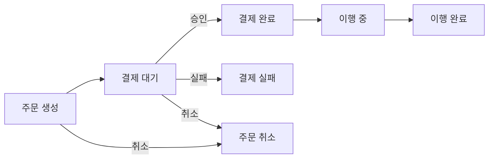
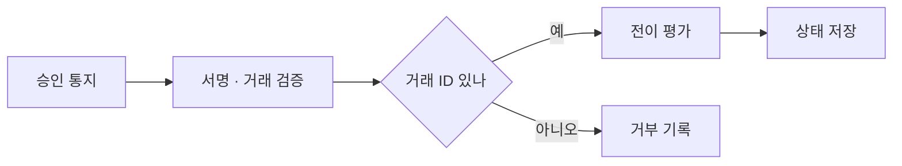
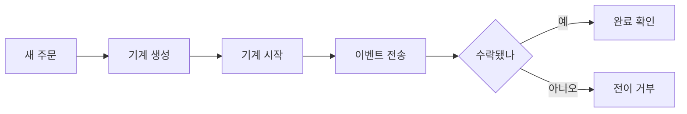
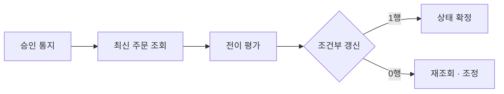
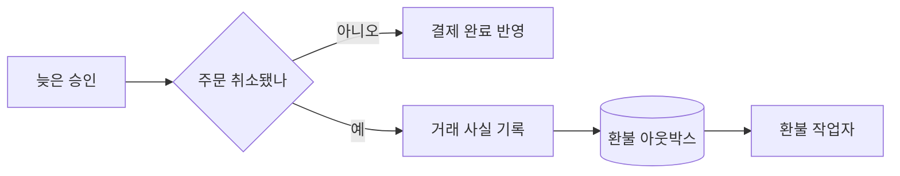
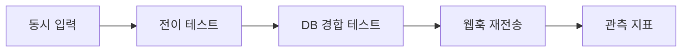
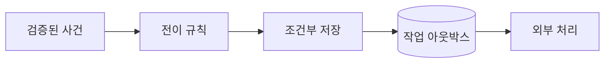

## 목차

1. 주문·결제 상태를 먼저 분리하기
2. Spring State Machine의 전이 규칙 정의하기
3. 이벤트를 보내고 결과 확인하기
4. 데이터베이스와 결제 통지 연결하기
5. 운영 환경에서 선택하고 검증하기
6. 맺음말

---

## 주문·결제 상태를 먼저 분리하기

### 상태와 사건을 구별하는 이유

주문·결제 흐름에는 `CREATED`, `PAID` 같은 **상태**와 결제 승인 통지, 주문 취소 요청 같은 **사건**이 함께 등장합니다. 상태는 현재 확정된 사실이고, 사건은 그 사실을 바꾸려는 입력입니다. `paid`와 `cancelled`라는 불리언 두 개만 두면 둘 다 참인 조합을 어떻게 해석할지 매번 결정해야 합니다. `switch` 문을 한곳에 모으더라도 HTTP 요청, 결제사 콜백, 배치 작업이 각각 다른 경로에서 상태를 변경하면 허용되지 않은 조합이 다시 생길 수 있습니다.

Spring State Machine은 상태, 이벤트, 전이, 가드(전이 허용 조건)를 한 모델에 선언할 수 있게 합니다. 주문 하나를 상태 기계 하나의 식별자로 다룰 수 있지만, 이것만으로 동시성이나 영속성이 해결되지는 않습니다. 설계의 첫 단계는 **어떤 변경을 허용할지**를 명시하고, 그다음 데이터베이스가 그 결정을 원자적으로 확정하도록 만드는 것입니다.



이 도식은 주문 상태의 허용 경로입니다. `결제 완료 → 주문 취소`처럼 환불을 수반하는 경로는 단순한 화살표 하나로 넣지 않고 별도 절차로 다룹니다.

### 주문 상태와 결제 상태는 같은 값이 아닙니다

결제사의 승인 응답을 받았다는 사실과 주문을 이행해도 된다는 판단은 다릅니다. 결제사는 승인 후 취소·부분 취소·환불을 처리할 수 있고, 주문은 배송 또는 서비스 제공 단계에 들어갈 수 있습니다. 따라서 주문 테이블의 상태와 결제 시도·거래 테이블의 상태를 분리하는 편이 안전합니다. 예를 들어 주문은 `CANCELLED`인데 늦게 도착한 결제 승인 통지는 결제 거래에 기록하고, 환불 또는 수동 조정 작업으로 이어질 수 있습니다. 이미 취소된 주문을 다시 `PAID`로 되돌려서는 안 됩니다.

| 기록 | 질문 | 예시 상태 | 판단에 쓰는 곳 |
|---|---|---|---|
| 주문 | 상품을 제공해도 되는가? | `PAYMENT_PENDING`, `PAID`, `CANCELLED` | 이행·고객 화면 |
| 결제 시도 | 결제사가 무엇을 처리했는가? | `REQUESTED`, `APPROVED`, `FAILED`, `REFUNDED` | 정산·환불 |
| 결제 통지 | 이 통지를 처리했는가? | 고유 이벤트 ID와 수신 시각 | 중복 제거·감사 |

이 구분은 상태 기계를 두 개 만들어야 한다는 뜻은 아닙니다. 글의 예제는 **주문 상태 기계**를 중심으로 다루되, 결제사의 원장과 통지 기록은 별도 데이터로 보존합니다.

---

## Spring State Machine의 전이 규칙 정의하기

### 상태·이벤트·가드의 역할

전이는 출발 상태, 도착 상태, 이벤트로 정의합니다. 예를 들어 `PAYMENT_PENDING`에서 `PAYMENT_SUCCEEDED`를 받으면 `PAID`로 이동할 수 있습니다. 같은 이벤트를 `CANCELLED`에서 받았을 때는 대응 전이가 없으므로 상태가 바뀌지 않습니다. **가드**는 현재 전이에 추가 조건을 붙입니다. 결제 거래 ID가 없으면 승인 이벤트를 받지 않도록 할 수 있습니다. 다만 가드는 결제사 서명 검증이나 실제 승인 조회를 대체하지 않습니다. 외부 입력 검증은 이벤트를 보내기 전에 끝내야 합니다.

**액션**은 전이 때 실행할 동작입니다. 로그나 메트릭처럼 재실행돼도 안전한 작업에는 편리하지만, 결제 승인 요청이나 환불 같은 외부 호출을 액션에 직접 넣으면 재시도와 장애 복구가 어려워집니다. 전이는 내부 상태를 결정하고, 외부 호출은 영속화된 작업 기록을 따라 실행하도록 책임을 나누는 편이 좋습니다.



가드는 전이 조건을 표현할 뿐이고, 결제사의 통지가 진짜인지 확인하는 단계는 앞에 따로 둡니다.

### 주문 전이 설정 예시

다음 코드는 Spring Statemachine 4.x의 `@EnableStateMachineFactory`를 사용해 주문마다 별도 기계를 만들 수 있도록 설정합니다. 코드가 보여 주는 것은 **전이 규칙**이며, 주문별 상태 복원과 저장은 뒤에서 다룹니다. `PAYMENT_SUCCEEDED`에는 검증된 결제 거래 ID를 메시지 헤더로 전달한다고 가정합니다.

```java
enum OrderState {
    CREATED, PAYMENT_PENDING, PAID, PAYMENT_FAILED,
    CANCELLED, FULFILLING, COMPLETED
}

enum OrderEvent {
    START_PAYMENT, PAYMENT_SUCCEEDED, PAYMENT_FAILED,
    CANCEL, START_FULFILLMENT, COMPLETE
}

@Configuration
@EnableStateMachineFactory
class OrderMachineConfig
        extends EnumStateMachineConfigurerAdapter<OrderState, OrderEvent> {

    @Override
    public void configure(StateMachineStateConfigurer<OrderState, OrderEvent> states)
            throws Exception {
        states.withStates()
                .initial(OrderState.CREATED)
                .states(EnumSet.allOf(OrderState.class));
    }

    @Override
    public void configure(StateMachineTransitionConfigurer<OrderState, OrderEvent> transitions)
            throws Exception {
        transitions
            .withExternal().source(OrderState.CREATED)
                .target(OrderState.PAYMENT_PENDING).event(OrderEvent.START_PAYMENT)
            .and().withExternal().source(OrderState.PAYMENT_PENDING)
                .target(OrderState.PAID).event(OrderEvent.PAYMENT_SUCCEEDED)
                .guard(ctx -> ctx.getMessageHeader("paymentId") instanceof String id
                        && !id.isBlank())
            .and().withExternal().source(OrderState.PAYMENT_PENDING)
                .target(OrderState.PAYMENT_FAILED).event(OrderEvent.PAYMENT_FAILED)
            .and().withExternal().source(OrderState.CREATED)
                .target(OrderState.CANCELLED).event(OrderEvent.CANCEL)
            .and().withExternal().source(OrderState.PAYMENT_PENDING)
                .target(OrderState.CANCELLED).event(OrderEvent.CANCEL)
            .and().withExternal().source(OrderState.PAID)
                .target(OrderState.FULFILLING).event(OrderEvent.START_FULFILLMENT)
            .and().withExternal().source(OrderState.FULFILLING)
                .target(OrderState.COMPLETED).event(OrderEvent.COMPLETE);
    }
}
```

예제에서 `CANCEL`은 결제 완료 전까지만 허용됩니다. `PAYMENT_PENDING`에서 취소하더라도 결제사 요청이 이미 진행 중일 수 있으므로, 실제 서비스에서는 결제 조회·취소 또는 늦은 승인에 대한 환불 정책이 추가로 필요합니다. 설정만으로 그 경합이 사라지지는 않습니다.

---

## 이벤트를 보내고 결과 확인하기

### 새 주문에서 전이를 시험하기

Spring Statemachine 4.x는 `sendEvent(Mono<Message<E>>)`의 **리액티브 API**를 제공합니다. 반환된 `Flux`를 구독하지 않으면 이벤트가 처리되지 않습니다. 동기식 애플리케이션의 경계에서는 완료를 기다리고, 수락·거부·지연 결과를 확인할 수 있습니다. 다음 예제는 새 주문용 기계를 시작한 뒤 첫 이벤트를 보내는 최소 흐름입니다. 기존 주문에 이 코드를 그대로 적용하면 초기 상태에서 다시 시작하므로, 저장된 상태 복원이 먼저 필요합니다.

```java
StateMachine<OrderState, OrderEvent> machine =
        factory.getStateMachine(orderId.toString());
machine.startReactively().block();

Message<OrderEvent> event = MessageBuilder
        .withPayload(OrderEvent.START_PAYMENT)
        .build();
List<StateMachineEventResult<OrderState, OrderEvent>> results = machine
        .sendEventCollect(Mono.just(event))
        .block();

if (results == null || results.stream().noneMatch(result ->
        result.getResultType() == StateMachineEventResult.ResultType.ACCEPTED)) {
    throw new IllegalStateException("허용되지 않은 주문 전이");
}
for (StateMachineEventResult<OrderState, OrderEvent> result : results) {
    result.complete().block(); // 액션 실패도 여기서 확인
}
```

`ACCEPTED`는 기계가 이벤트를 수락했다는 뜻입니다. 결제사에 실제 승인 요청이 성공했다거나 데이터베이스 커밋이 끝났다는 뜻은 아닙니다. 주문 API 응답은 이 두 작업의 결과를 별도로 판단해야 합니다.



결과 확인은 이벤트 호출 직후에 끝나지 않습니다. 액션을 사용한다면 완료 신호와 오류도 함께 확인해야 합니다.

### 주문별 기계와 상태 복원

한 개의 싱글턴 기계를 여러 주문에 공유하면 서로의 상태가 섞일 수 있습니다. `StateMachineFactory`로 주문 식별자별 기계를 얻거나 `StateMachineService`로 기계 획득·반납을 관리해야 합니다. 기존 주문을 처리할 때는 데이터베이스에 저장한 상태에서 기계를 복원한 다음 이벤트를 평가합니다. 기계의 현재 상태를 서버 메모리만 믿고 사용하면 재시작 후 `CREATED`로 돌아갈 뿐 아니라, 다른 인스턴스에서 처리한 최신 상태도 볼 수 없습니다.

Spring은 `StateMachineContext`, `StateMachinePersister`, `StateMachineRuntimePersister`를 제공합니다. 계층형 상태, 확장 변수, 여러 영역을 실제로 사용한다면 기계 컨텍스트의 영속화가 필요할 수 있습니다. 반대로 위 예제처럼 평면적인 주문 상태만 쓴다면 **주문 테이블의 상태를 기준 데이터로 삼고**, 이벤트 처리 시 그 상태를 복원하는 구조가 더 단순합니다. 두 곳에 상태를 각각 저장한다면 불일치 시 어느 쪽이 기준인지 먼저 정해야 합니다.

> 주문 한 건의 현재 상태는 여러 서버의 메모리가 아니라, 하나의 영속 기록에서 읽어야 합니다.

---

## 데이터베이스와 결제 통지 연결하기

### 전이 판단 뒤 조건부 갱신하기

상태 기계가 전이를 허용해도 두 요청이 동시에 같은 주문을 읽으면 둘 다 수락될 수 있습니다. 예를 들어 취소 요청과 결제 승인 통지가 모두 `PAYMENT_PENDING`을 읽은 상태에서 전이를 평가할 수 있습니다. 최종 판정은 **조건부 데이터베이스 갱신**으로 내려야 합니다. 주문 상태와 버전을 함께 조건에 넣고, 영향을 받은 행이 한 건일 때만 성공으로 처리합니다. 아래는 Spring `NamedParameterJdbcTemplate`의 이름 있는 매개변수를 전제로 한 SQL입니다.

```sql
UPDATE orders
SET status = :next_status,
    version = version + 1
WHERE id = :order_id
  AND status = :expected_status
  AND version = :expected_version;
```

갱신 행 수가 0이면 다른 요청이 먼저 상태를 바꿨다는 신호일 수 있습니다. 최신 주문과 결제 거래를 다시 읽고, 같은 사건의 중복인지 보상 처리가 필요한 경합인지 구분합니다. 상태 기계의 `ACCEPTED`와 SQL의 **한 행 갱신**은 서로 다른 검증 단계입니다. 주문 상태와 결제 통지 처리 기록을 같은 트랜잭션에 저장해야 중간 실패 후에도 어떤 사건을 처리했는지 추적할 수 있습니다.



상태 기계가 허용해도 조건부 갱신이 실패하면 그 전이를 확정해서는 안 됩니다.

### 웹훅 재전송과 늦은 승인

결제사 웹훅은 네트워크 장애로 재전송될 수 있습니다. 수신한 이벤트의 결제사 고유 ID에 **유니크 제약**을 두고, 이미 처리한 ID라면 같은 응답을 반환하는 멱등 처리로 시작합니다. 웹훅 서명, 금액, 주문 ID, 결제 거래 ID를 검증한 뒤 내부 이벤트로 바꾸어 보내야 합니다. 결제사마다 고유 ID의 범위와 재전송 정책이 다르므로, 중복 키를 결제사 규약에 맞춰 구성합니다.

취소가 먼저 커밋된 뒤 승인이 도착하면 `CANCELLED` 주문에는 승인 전이가 없습니다. 그렇다고 통지를 버리면 실제 돈이 이동한 사실을 놓칩니다. 결제 거래에는 승인 사실을 기록하고, 환불 또는 운영자 조정을 요청해야 합니다. 그 작업을 주문 트랜잭션 안에서 외부 API로 바로 호출하면 네트워크 지연과 재시도 때문에 잠금 시간이 길어집니다. **아웃박스**에 환불 요청을 같은 트랜잭션으로 남기고, 별도 작업자가 멱등 키를 사용해 결제사에 전달하는 구조가 복구에 유리합니다.



늦은 승인은 전이 거부로 끝낼 사건이 아닙니다. 주문과 결제의 사실을 분리해 기록해야 환불까지 이어집니다.

---

## 운영 환경에서 선택하고 검증하기

### 테스트해야 할 것은 전이표와 경합입니다

단위 테스트에서는 상태·이벤트별 기대 결과를 표로 만들어 확인합니다. `PAYMENT_PENDING + PAYMENT_SUCCEEDED`는 승인, `CANCELLED + PAYMENT_SUCCEEDED`는 거부, 거래 ID가 빠진 승인 이벤트는 가드 실패여야 합니다. 그다음 통합 테스트에서는 두 스레드가 같은 주문 버전에서 취소와 승인을 시도하게 하여 조건부 갱신이 하나만 성공하는지 검증합니다. 결제사 웹훅이 여러 번 오거나 취소 후 늦게 도착할 때도 통지 기록과 환불 작업이 중복 생성되지 않아야 합니다.

| 상황 | 기대하는 결과 | 확인할 기록 |
|---|---|---|
| 유효한 승인 | 주문 `PAID` 전이 한 번 | 주문 버전·결제 거래 |
| 같은 웹훅 재전송 | 주문 상태 변화 없음 | 통지 ID 유니크 제약 |
| 취소와 승인 동시 도착 | 주문 조건부 갱신 한 건만 성공 | 갱신 행 수·재조회 결과 |
| 취소 후 늦은 승인 | 취소 상태 유지, 환불 요청 | 결제 거래·아웃박스 |

상태 전이 거부 수, 조건부 갱신 충돌 수, 결제 통지 지연 시간, 미처리 환불 작업 수를 함께 관찰하면 실패 원인을 분리하기 쉽습니다. 거부 이벤트를 단순 오류로만 집계하면 정상적인 중복 요청과 실제 설계 누락을 구별하기 어렵습니다.



전이표만 통과한 테스트는 주문·결제 흐름의 절반만 검증한 것입니다. 저장과 재전송까지 확인해야 운영 중의 결과를 예측할 수 있습니다.

### 새 프로젝트에서의 도입 판단

Spring Statemachine은 계층형 상태, 가드, 액션, 다중 영역처럼 전이 규칙이 커질 때 유용합니다. 그러나 단순히 `CREATED → PAID → COMPLETED`처럼 몇 개의 상태만 있다면 명시적인 Java 전이 함수와 조건부 SQL이 더 작고 이해하기 쉬울 수 있습니다. 어떤 방식을 택하든 외부 결제의 멱등 처리, 데이터베이스 경합 제어, 보상 작업은 별도로 설계해야 합니다.

또 하나의 판단 요소는 프로젝트 수명입니다. **Spring Statemachine의 공식 GitHub 저장소는 2026년 7월 5일 보관되어 읽기 전용**으로 표시됩니다. 기존 시스템을 유지할 때는 현재 쓰는 버전과 의존성 호환성을 먼저 확인하고, 새 프로젝트라면 유지보수 계획을 검토한 뒤 도입해야 합니다. 이 상태를 무시하고 프레임워크를 주문·결제의 핵심 의존성으로 넣는 것은 장기적인 변경 비용을 키울 수 있습니다.

> 상태 기계는 전이 규칙을 정리하는 도구입니다. 결제 거래의 진실과 동시성의 최종 판정은 영속 계층에 남겨야 합니다.

---

## 맺음말

### 핵심 요약

주문 상태와 결제 거래 상태를 분리하면 취소 뒤 늦게 도착한 승인도 기록하고 복구할 수 있습니다. Spring State Machine에는 허용 가능한 주문 전이를 선언하고, 외부 통지를 검증한 뒤 이벤트로 전달합니다. 이벤트가 수락되더라도 데이터베이스의 상태·버전을 조건으로 갱신해야 동시 요청 중 하나만 확정할 수 있습니다. 웹훅 재전송은 고유 ID로 멱등 처리하고, 환불 같은 외부 작업은 아웃박스로 분리합니다.



이 순서를 지키면 전이 판단과 실제 상태 확정을 구분하면서, 실패한 외부 작업을 다시 처리할 수 있습니다.

### 적용 판단 기준

상태가 적고 평면적이라면 코드에 전이표를 명시하고 SQL로 경합을 막는 것으로 충분할 수 있습니다. 상태 계층, 조건 분기, 복잡한 사건 조합이 늘어나 전이 규칙을 따로 검증해야 할 때 Spring State Machine을 고려할 만합니다. 다만 저장소가 보관 상태라는 점을 새 도입의 유지보수 위험으로 평가해야 합니다. 어느 쪽이든 주문 상태를 결제 기록과 혼동하지 않고, 늦은 사건을 버리지 않는 설계가 우선입니다.

> 프레임워크 도입 여부보다 먼저, 취소와 승인 중 무엇이 먼저 확정돼도 돈과 주문의 기록이 맞는지 확인해야 합니다.

참고 자료: [Spring Statemachine 4.0.2 공식 문서](https://docs.spring.io/spring-statemachine/docs/current/reference/index.html), [Spring Statemachine GitHub 저장소](https://github.com/spring-attic/spring-statemachine), [StateMachineEventResult API](https://docs.spring.io/spring-statemachine/docs/current/api/org/springframework/statemachine/StateMachineEventResult.html)
