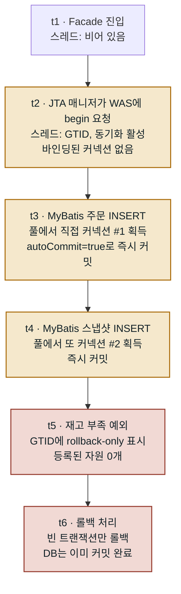
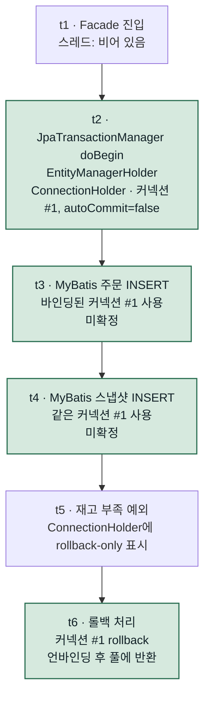

`@Transactional`은 개발하면서 거의 의심하지 않는 어노테이션입니다. 붙여 두기만 하면 예외가 났을 때 알아서 되돌려 주니까요. 저 역시 몇 년 동안 그렇게 믿고 써 왔습니다.

그러다 운영 DB에서 이상한 데이터가 보이기 시작했습니다.

- 주문은 등록됐는데 재고는 차감되지 않은 주문
- 헤더만 있고 상세는 비어 있는 문서
- 재고가 두 번 빠진 로트

모두 **중간에 예외가 났는데 앞 단계의 쓰기가 그대로 남아 있는** 모양이었습니다. 예외는 `RuntimeException` 계열이었고, 메서드에는 `@Transactional`이 제대로 붙어 있었습니다.

이 글은 "롤백이 안 된다"는 보고를 처음엔 믿지 않다가, 결국 사실로 받아들이기까지 무엇을 확인하고 무엇을 측정했는지에 대한 기록입니다. 결론을 먼저 말하면 원인은 코드에 없었고, 수정은 YAML 한 줄이었습니다. 이 글의 대부분은 그 한 줄에 도달하기까지의 과정입니다.

## 1. 증상: 절반만 저장된 데이터

먼저 실제 모양부터 보겠습니다. 예시로 쓸 주문 등록 로직은 대략 다음과 같습니다.

```java
@Transactional
public void createOrder(OrderRequest request) {
    validateCreditUnpaid(request);              // ① 미납 검증
    validateAddressOwnership(request);          // ② 배송지 소유 검증

    orderService.insert(order);                 // ③ 주문 INSERT
    snapshotService.insert(customerSnapshot);   // ③-1 고객 스냅샷 INSERT

    List<LotMapping> mappings = allocateGreedy();  // ④ 재고 로트 배분
    lotMappingService.bulkInsert(mappings);        //    매핑 벌크 INSERT

    if (allocatedQty < request.getQty()) {
        throw new BusinessException(INSUFFICIENT_STOCK);  // ⑤ 재고 부족
    }

    stockLotService.decreaseRemainQty(mappings);   // ⑥ 로트 잔량 차감
    creditService.increaseUsedAmount(order);       // ⑦ 한도 사용량 증가
}
```

⑤에서 예외가 나면 ③, ③-1, ④는 모두 취소돼야 합니다. 그런데 운영 DB를 조회해 보니 세 가지가 전부 남아 있었습니다.

```sql
-- 주문은 들어가 있고
SELECT * FROM ORDER_MASTER WHERE ORDER_ID = 'ORD-20260812-0001';        -- 1행
-- 로트 매핑도 일부 남아 있는데
SELECT * FROM ORDER_LOT_MAPPING WHERE ORDER_ID = 'ORD-20260812-0001';   -- 3행
-- 한도에는 반영되지 않았다
SELECT USED_AMOUNT FROM CREDIT_ACCOUNT WHERE CUSTOMER_ID = 'C-1001';    -- 변화 없음
```

가장 당황스러웠던 점은 **로컬에서는 같은 시나리오가 깔끔하게 롤백된다**는 것이었습니다. 코드도, SQL도, 예외도 같은데 운영에서만 데이터가 남았습니다.

## 2. 코드를 전부 뒤졌지만 문제가 없었습니다

처음엔 당연히 코드를 의심했습니다. `@Transactional`이 동작하지 않는 전형적인 이유들이 있으니까요. 체크리스트를 만들어 하나씩 확인했습니다.

| 흔한 원인 | 확인 결과 |
| --- | --- |
| `@Transactional`이 아예 없음 | 파사드에 정상적으로 붙어 있음 |
| private 메서드라 프록시를 거치지 않음 | 모두 public, 외부에서 호출 |
| 같은 클래스 안에서 호출(self-invocation) | 없음 |
| 예외를 catch로 삼킴 | 없음 |
| Checked Exception이라 롤백 대상이 아님 | `BusinessException extends RuntimeException`으로 문제없음 |
| 전파 속성이 이상함(`NOT_SUPPORTED` 등) | 모든 서비스가 `REQUIRED` |
| MyBatis가 다른 트랜잭션을 사용 | 표준 mybatis-spring 자동 구성 |

모두 정상이었습니다. 하루를 꼬박 코드만 봤는데 결함이 하나도 나오지 않았습니다.

사실 이럴 때가 가장 불안합니다. 코드에 문제가 없는데 결과가 틀리다면, 애초에 엉뚱한 곳을 보고 있다는 뜻이기 때문입니다. 그래서 질문을 바꿨습니다.

> "코드가 왜 안 되지?"에서 "로컬과 운영은 무엇이 다르지?"로

## 3. 용의자는 코드가 아니라 실행 환경이었습니다

운영은 JEUS WAS 위에서 WAR로 실행되고, 로컬은 내장 톰캣으로 실행됩니다. 이 차이에서 출발했습니다.

Spring Boot에는 `JtaAutoConfiguration`이라는 자동 구성이 있습니다. 꽤 친절한 기능인데, 판단 과정을 말로 옮기면 이렇습니다.

> "JNDI에 `java:comp/UserTransaction`이 있네? 이 앱은 WAS 위에서 도는구나. 그럼 트랜잭션은 WAS에 맡기자."
> → `JtaTransactionManager` 등록

문제는 이 판단이 절반만 맞았다는 점입니다. 트랜잭션 매니저는 JTA(글로벌 트랜잭션)로 바뀌었지만, 데이터소스는 XA가 아니었습니다. XA가 아닌 데이터소스는 글로벌 트랜잭션에 참여(enlist)할 수 없습니다.

그 결과 다음과 같은 연쇄가 만들어집니다.

1. WAS가 JNDI에 `java:comp/UserTransaction`을 노출한다.
2. Spring Boot의 `JtaAutoConfiguration`이 이를 감지한다.
3. 로컬 트랜잭션 매니저 대신 `JtaTransactionManager`가 등록된다.
4. `@Transactional`이 WAS의 글로벌 트랜잭션을 시작한다.
5. **데이터소스가 비XA라 글로벌 트랜잭션에 참여하지 못한다.** ← 여기서 어긋납니다.
6. 커넥션은 `autoCommit=true` 상태로 동작하고, SQL 한 문장마다 즉시 커밋된다.
7. 예외가 발생해 롤백을 시도한다.
8. 되돌릴 커넥션이 없으니 빈 트랜잭션만 롤백된다.
9. DB에는 이미 커밋된 데이터가 그대로 남는다.

1번부터 4번까지는 각자 맡은 일을 성실히 했을 뿐입니다. 어긋난 곳은 5번 하나이고, 그 뒤는 모두 그 결과입니다.

여기까지 정리하고 나니 몇 가지 사실이 맞아떨어졌습니다.

- 프로젝트 어디에도 `PlatformTransactionManager` 빈 정의가 없었습니다. 전적으로 자동 구성에 의존하고 있었습니다.
- 모든 모듈의 YAML에 `spring.jta.*` 설정이 한 줄도 없었습니다. 그런데 `spring.jta.enabled`는 `matchIfMissing = true`라서 적지 않으면 켜진 것으로 봅니다.
- JTA 스타터를 일부러 넣은 적이 없는데도, `spring-boot-starter-data-jpa`가 끌고 온 `jakarta.transaction-api`가 classpath에 있어 `@ConditionalOnClass` 조건도 이미 충족돼 있었습니다.

즉, JTA를 쓸 생각이 전혀 없었는데도 **WAS에 배포하는 순간 트랜잭션 매니저가 바뀌는 구조**였습니다.

### "같은 WAS의 다른 서비스는 왜 멀쩡한가요?"

팀에서 이 질문을 받았고, 충분히 나올 만한 반문이었습니다. WAS의 데이터소스 설정은 여러 서비스가 함께 쓰는 공통 설정이니, 그게 문제라면 모두 같이 깨져야 합니다. 답은 **문제가 데이터소스가 아니라 조합에 있다**는 것입니다.

비XA 데이터소스 자체에는 잘못이 없습니다. `setAutoCommit(false)` → `commit()` / `rollback()`으로 이어지는 로컬 트랜잭션에서는 잘 동작합니다. 커넥션을 직접 열고 닫는 레거시 애플리케이션은 전혀 영향을 받지 않습니다.

문제가 되는 조합은 하나뿐입니다.

> JTA 매니저가 커밋과 롤백을 책임진다고 믿고 있는데, 정작 그 트랜잭션 안에 커넥션이 없는 경우

그리고 이 조합을 만든 건 WAS가 아니라 Spring Boot의 자동 선택이었습니다. 그러니 다른 서비스가 멀쩡하다는 사실은 이 가설과 모순되지 않습니다. 다만 여기까지는 모두 추론이었습니다. 그럴듯해도 증거는 아니었기 때문에, 고치기 전에 먼저 측정하기로 했습니다.

## 4. 스레드는 무엇을 들고 있을까

측정 이야기에 앞서 정확히 무엇이 다른지 짚고 가겠습니다. 그래야 무엇을 측정할지가 정해집니다. Spring의 트랜잭션 상태는 요청을 처리하는 스레드에 `ThreadLocal`로 붙어 있습니다. 그래서 같은 시점에 스레드가 무엇을 들고 있는지 나란히 비교하면 차이가 분명하게 드러납니다.

그 전에 용어부터 정리하겠습니다. 이 문제는 결국 "트랜잭션 매니저 종류 × 데이터소스 종류"의 조합 문제라서, 네 가지 경우를 놓고 봐야 이야기가 정확해집니다.

| | 비XA 데이터소스 | XA 데이터소스 |
| --- | --- | --- |
| **JTA 매니저** | ❌ **JTA 케이스(이번 사고)**: 매니저는 글로벌 트랜잭션을 여는데 커넥션이 참여하지 못함 | ✅ JTA가 원래 의도한 조합: enlist 정상, 2PC 동작 |
| **로컬 매니저**(`JpaTransactionManager` 등) | ✅ **로컬 케이스(수정 후)**: 매니저가 커넥션 하나를 잡고 직접 커밋·롤백 | ⚠️ 동작은 정상, XA 기능을 쓰지 않을 뿐 |

이 글에서는 왼쪽 열의 두 칸만 다룹니다. 실제로 측정한 것이 이 둘이기 때문입니다.

- **JTA 케이스**: JTA 매니저 + 비XA 데이터소스 → 문제가 있던 운영 상태
- **로컬 케이스**: 로컬(JPA) 매니저 + 비XA 데이터소스 → 수정 후 정상 상태

한 가지 강조할 점이 있습니다. 두 케이스를 오가는 동안 **데이터소스는 전혀 건드리지 않았습니다.** 표에서 같은 열(비XA) 안에서 위아래로만 움직였고, 바꾼 것은 매니저 하나뿐입니다.

이론적으로는 오른쪽 위 칸, 즉 데이터소스를 XA로 바꾸는 방법도 있었습니다. 하지만 여러 팀이 공유하는 WAS 설정을 바꿔야 하고 2PC 오버헤드까지 감수해야 해서 택하지 않았습니다. 우리 애플리케이션은 DB를 하나만 쓰기 때문에 분산 트랜잭션이 필요 없었습니다. 그래서 정답은 "글로벌 트랜잭션을 제대로 만들기"가 아니라 "**글로벌 트랜잭션을 애초에 시작하지 않기**"였습니다.

### JTA 케이스: JTA 매니저 + 비XA 데이터소스



핵심은 t2입니다. 트랜잭션이라는 표시는 붙지만 커넥션은 끝까지 붙지 않습니다. 스레드에 지정된 커넥션이 없으니 t3과 t4의 MyBatis는 매번 풀에서 새 커넥션(#1, #2)을 꺼내 쓰고, 각자 `autoCommit=true`인 채로 바로 커밋합니다.

**커넥션 #1과 #2는 서로 다른 종류일까요?**

아닙니다. 둘 다 같은 데이터소스(커넥션 풀)에서 나왔고 클래스도 같습니다. 실제 진단 결과에서도 `connectionClass`는 JTA 케이스와 로컬 케이스 모두 `com.zaxxer.hikari.pool.HikariProxyConnection`이었습니다. 차이는 인스턴스가 몇 개인지, 그리고 누가 그 커넥션을 통제하는지뿐입니다.

| | 커넥션 출처 | 이번 요청이 쓰는 인스턴스 | autoCommit을 끈 주체 |
| --- | --- | --- | --- |
| JTA 케이스 | 데이터소스(풀) | SQL마다 새로 획득, 여러 개 | 없음 |
| 로컬 케이스 | 데이터소스(풀) | 매니저가 바인딩한 하나 | 매니저 |

그러니 "바인딩된 커넥션이 없다"는 말은 이상한 커넥션이 온다는 뜻이 아닙니다. **이 트랜잭션에서 쓰도록 지정된 인스턴스가 없어서 매번 새로 꺼낸다**는 뜻입니다. 풀이 반환된 물리 커넥션을 재사용할 수는 있지만, 논리적으로는 매번 별개의 사용 단위라 커밋 경계를 공유하지 않습니다.

### 로컬 케이스: 로컬(JPA) 매니저 + 비XA 데이터소스



t2에서 커넥션이 바인딩됩니다. 이후 모든 SQL이 같은 커넥션 #1을 쓰기 때문에 t6의 `rollback()` 한 번으로 모두 사라집니다. 풀과 데이터소스는 JTA 케이스와 완전히 같고, 달라진 것은 매니저 하나뿐입니다.

### 타임라인으로 나란히 보기

| 시점 | 코드 | JTA 케이스의 스레드 · MyBatis 커넥션 | 로컬 케이스의 스레드 · MyBatis 커넥션 |
| --- | --- | --- | --- |
| t1 | Facade 진입 | 비어 있음 | 비어 있음 |
| t2 | 트랜잭션 시작 | GTID만 붙음, 커넥션 없음 | 커넥션 #1 바인딩, `autoCommit=false` |
| t3 | 주문 INSERT | 새로 얻은 #1, `autoCommit=true` → 즉시 커밋 | 바인딩된 #1, 미확정 |
| t4 | 스냅샷 INSERT | 또 새로 얻은 #2 → 즉시 커밋 | 같은 #1, 미확정 |
| t5 | 예외 | GTID에 rollback-only, 자원 0개 | ConnectionHolder에 rollback-only |
| t6 | 롤백 | 빈 트랜잭션 롤백 → DB 변화 없음 | 커넥션 #1 rollback → 전부 취소 |

t2의 차이 하나가 t6의 결과를 결정합니다. 그래서 측정할 대상도 분명해졌습니다. **"t2에 커넥션이 붙었는가?"** 이것 하나입니다.

### 스레드에 담기는 것의 실체: TransactionSynchronizationManager

"스레드가 들고 있는 것"은 비유가 아니라 실제 클래스입니다. `org.springframework.transaction.support.TransactionSynchronizationManager`(이하 TSM)가 여러 개의 `ThreadLocal`에 상태를 보관합니다.

| 항목(ThreadLocal) | 내용 | 키 |
| --- | --- | --- |
| `resources` | 자원 홀더 맵: `ConnectionHolder`, `EntityManagerHolder`, `SqlSessionHolder` 등 | 자원 팩토리 객체(`DataSource`, `EntityManagerFactory`, `SqlSessionFactory`) |
| `synchronizations` | 커밋·롤백 전후 콜백 목록 | - |
| `currentTransactionName` | 현재 트랜잭션 이름 | - |
| `currentTransactionReadOnly` | 읽기 전용 여부 | - |
| `currentTransactionIsolationLevel` | 격리 수준 | - |
| `actualTransactionActive` | 실제 트랜잭션 시작 여부 | - |

여기서 중요한 건 `resources`가 자원 팩토리를 키로 쓰는 맵이라는 점입니다. `DataSource`를 키로 한 `ConnectionHolder`가 있어야 MyBatis가 그 커넥션을 찾을 수 있습니다.

그럼 매니저별로 TSM에 무엇을 넣는지 비교해 보겠습니다.

| TSM 항목 | JpaTransactionManager | JtaTransactionManager |
| --- | --- | --- |
| `actualTransactionActive` | ✔ | ✔ |
| `synchronizations` | ✔ | ✔ |
| 트랜잭션 이름 · 읽기 전용 · 격리 수준 | ✔ | ✔ |
| `resources`의 `EntityManagerHolder`(키: EMF) | ✔ | ✘ |
| `resources`의 `ConnectionHolder`(키: DataSource) | ✔ | ✘ |

이 부분은 저도 의외였습니다. JTA 매니저도 TSM을 사용합니다. 무시하는 게 아니라 트랜잭션 활성 표시도 하고 동기화 등록도 모두 합니다. **DataSource 자원만 넣지 않을 뿐입니다.** 커넥션을 트랜잭션에 묶는 일은 enlist가 담당한다고 보기 때문입니다. 그 enlist가 비XA 데이터소스에서 일어나지 않은 것이 JTA 케이스입니다.

## 5. 왜 로그 한 줄 남지 않았을까

이번 일에서 가장 답답했던 부분입니다. 몇 달 동안 롤백이 통째로 동작하지 않았는데도 경고 하나 없이 로그가 조용했습니다.

MyBatis가 커넥션을 얻는 경로를 따라가 보면 이유가 보입니다. MyBatis 코어는 Spring 트랜잭션의 존재를 전혀 모르고, 둘을 이어 주는 역할은 mybatis-spring이 맡습니다.

```text
Mapper 메서드 호출
  → SqlSessionTemplate                                   (mybatis-spring)
  → SqlSessionUtils.getSqlSession()
       └ TSM.getResource(sqlSessionFactory)              ← SqlSessionHolder 조회
  → SpringManagedTransaction.openConnection()            (mybatis-spring)
       └ DataSourceUtils.getConnection(dataSource)       ← Spring 유틸
            └ TSM.getResource(dataSource)                ← ConnectionHolder 조회
                 ├ 있으면 → 그 커넥션을 반환               (로컬 케이스)
                 └ 없으면 → dataSource.getConnection()    (JTA 케이스)
```

맨 아래 갈림길이 원인입니다. 스레드에 바인딩된 커넥션이 없으면 `DataSourceUtils`는 오류를 내지 않고 **풀에서 조용히 새 커넥션을 꺼냅니다.** 이건 버그가 아니라 의도된 동작입니다. 트랜잭션 밖에서 Mapper를 호출하는 것도 정상적인 사용 방식이기 때문입니다. 문제는 JTA 케이스에서는 모든 SQL이 매번 이 경로를 탔고, 코드 수준에서는 이것이 "트랜잭션 없이 호출한 정상 경우"와 구분되지 않는다는 점이었습니다.

커밋 시점을 보면 더 분명해집니다. `SpringManagedTransaction`은 커넥션을 열 때 두 값을 기억해 둡니다.

```java
this.connection = DataSourceUtils.getConnection(this.dataSource);
this.autoCommit = this.connection.getAutoCommit();
this.isConnectionTransactional =
        DataSourceUtils.isConnectionTransactional(this.connection, this.dataSource);
```

그리고 커밋할 때는 이렇게 동작합니다.

```java
public void commit() throws SQLException {
    if (this.connection != null && !this.isConnectionTransactional && !this.autoCommit) {
        this.connection.commit();
    }
}
```

JTA 케이스에서는 `autoCommit == true`라 조건이 거짓이 되고, 아무 일도 일어나지 않습니다. 드라이버가 이미 문장마다 커밋했으니 할 일이 없는 게 맞습니다. `rollback()`도 같은 이유로 아무 동작을 하지 않습니다.

모든 게 정상 경로처럼 조용히 지나갑니다. 예외도, 경고도, 스택 트레이스도 없습니다. 코드를 전수 확인해도 찾지 못한 이유가 여기 있었습니다. 코드에는 정말 문제가 없었습니다. 문제는 **코드가 호출하는 유틸이 런타임에 어느 분기를 타느냐**였습니다.

## 6. 추측 대신 진단 API를 만들었습니다

여기까지는 전부 추론이었습니다. 그럴듯했지만, 이것만 믿고 운영 설정을 바꾸고 싶지는 않았습니다. 추론이 틀렸다면 "고쳤는데 안 고쳐진" 상태로 며칠을 더 보내게 되니까요. 그래서 수정보다 진단 API를 먼저 만들었습니다. 순서가 중요했습니다. 고치기 전 상태에서 먼저 재현해야 "이게 원인이었다"고 말할 수 있습니다.

### 6-1. 배선 진단 API(읽기 전용)

```text
GET /api/v1/admin/diagnostics/transaction
```

앞에서 확인해야 한다고 짚은 지점을 그대로 응답 필드로 옮겼습니다.

| 필드 | 확인 내용 | BROKEN 판정값 |
| --- | --- | --- |
| `transactionManagers` | TransactionManager 타입 빈 이름 → 클래스명 맵 | `JtaTransactionManager` |
| `jndiUserTransaction` | `java:comp/UserTransaction` 조회 성공 여부 | 존재 |
| `dataSourceClass` / `xaCapable` | DataSource 실제 클래스, `isWrapperFor(XADataSource)` | 비XA |
| `actualTransactionActive` | `TSM.isActualTransactionActive()` | `true` |
| `connectionHolderBound` | `TSM.hasResource(dataSource)` | `false` |
| `autoCommitInsideTx` | 트랜잭션 안에서 `DataSourceUtils.getConnection(ds).getAutoCommit()` | `true` |
| `verdict` | 종합 판정 | `BROKEN_TX_WITHOUT_CONNECTION` |

핵심 로직만 추리면 다음과 같습니다. 짧은 메서드지만 이 글의 결론은 모두 여기서 나왔습니다.

```java
@Transactional  // ← 반드시 트랜잭션 안에서 측정해야 의미가 있습니다
public TransactionWiringResponse inspect() {
    TransactionWiringResponse res = new TransactionWiringResponse();

    // ① 어떤 매니저가 등록됐나
    Map<String, PlatformTransactionManager> beans =
            applicationContext.getBeansOfType(PlatformTransactionManager.class);
    Map<String, String> managers = new LinkedHashMap<String, String>();
    for (Map.Entry<String, PlatformTransactionManager> e : beans.entrySet()) {
        managers.put(e.getKey(), e.getValue().getClass().getName());
    }
    res.setTransactionManagers(managers);

    // ② 트랜잭션이 활성인가: TSM에 묻는다
    res.setActualTransactionActive(
            TransactionSynchronizationManager.isActualTransactionActive());

    // ③ 그 트랜잭션에 커넥션이 붙어 있는가: 같은 TSM에 묻는다
    res.setConnectionHolderBound(
            TransactionSynchronizationManager.hasResource(dataSource));

    // ④ MyBatis와 똑같은 경로로 커넥션을 얻어 autoCommit을 확인한다
    Connection conn = DataSourceUtils.getConnection(dataSource);
    try {
        res.setAutoCommitInsideTx(conn.getAutoCommit());
        res.setConnectionClass(conn.getClass().getName());
    } catch (SQLException e) {
        throw new BusinessException(DIAGNOSTICS_CONNECTION_FAILED);
    } finally {
        DataSourceUtils.releaseConnection(conn, dataSource);
    }

    // ⑤ 종합 판정
    if (res.isActualTransactionActive() && !res.isConnectionHolderBound()) {
        res.setVerdict("BROKEN_TX_WITHOUT_CONNECTION");
    } else if (res.isActualTransactionActive() && !res.isAutoCommitInsideTx()) {
        res.setVerdict("HEALTHY_LOCAL_TX");
    } else {
        res.setVerdict("UNKNOWN");
    }
    return res;
}
```

설계하면서 신경 쓴 점이 두 가지 있습니다.

**첫째, 두 지표는 반드시 함께 읽어야 합니다.**

```json
"actualTransactionActive": true,
"connectionHolderBound":   false
```

- `actualTransactionActive`만 봤다면 `true`이니 정상이라고 오판했을 것입니다. 이 값은 JTA 매니저도 표시합니다.
- `connectionHolderBound`만 봤다면 트랜잭션이 아예 없는 경우와 구분할 수 없습니다.

둘을 함께 읽어야만 "트랜잭션은 있는데 그 안에 커넥션이 없다"는 사실이 증명됩니다. 두 값이 같은 TSM 하나에서 나온다는 점이 판정의 근거였습니다.

**둘째, 진단 코드는 MyBatis와 같은 방식으로 커넥션을 얻어야 합니다.**

```java
// 이렇게 얻으면 항상 autoCommit=true라 아무 정보도 주지 못합니다
Connection conn = dataSource.getConnection();                  // ✘

// MyBatis의 SpringManagedTransaction과 같은 경로
Connection conn = DataSourceUtils.getConnection(dataSource);   // ✔
```

`dataSource.getConnection()`은 풀에서 가공되지 않은 커넥션을 꺼내므로 언제나 `autoCommit=true`입니다. 그 값을 확인해 봐야 당연한 결과만 나옵니다. MyBatis가 실제로 쓰는 커넥션을 봐야 의미가 있습니다.

이 API는 아무것도 쓰지 않으므로 운영에서도 안전하게 호출할 수 있습니다. 여기에 더해 애플리케이션 기동 시 이 판정 결과를 INFO 로그로 한 줄 남기도록 했습니다. 문제가 재발하면 로그만 보고도 바로 알 수 있게 하기 위해서입니다.

### 6-2. 롤백 확인 프로브

배선을 확인했으면 결과도 확인해야 합니다.

```text
POST /api/v1/admin/diagnostics/transaction/rollback-probe
```

동작은 단순합니다.

```java
// 파사드: 트랜잭션 "밖"에서 결과를 확인한다
public RollbackProbeResponse runProbe() {
    String probeKey = UUID.randomUUID().toString();

    try {
        probeService.insertThenThrow(probeKey);   // ← 반드시 예외가 발생합니다
    } catch (BusinessException expected) {
        // 의도한 예외이므로 삼키고 결과만 확인한다
    }

    // 트랜잭션 밖에서 조회: 롤백됐다면 0행이어야 정상
    boolean survived = probeMapper.existsByKey(probeKey);

    RollbackProbeResponse res = new RollbackProbeResponse();
    res.setProbeKey(probeKey);
    res.setSurvived(survived);
    res.setVerdict(survived ? "ROLLBACK_NOT_WORKING" : "ROLLBACK_OK");

    if (survived) {
        res.setCleanedRows(probeMapper.deleteByKey(probeKey));  // 남은 행 정리
    }
    return res;
}

// 서비스: 트랜잭션 "안"
@Transactional
public void insertThenThrow(String probeKey) {
    probeMapper.insert(probeKey, "rollback probe");
    throw new BusinessException(PROBE_INTENTIONAL_ROLLBACK);
}
```

```text
survived = true   → 롤백이 동작하지 않음
survived = false  → 정상
```

전용 테이블만 사용하므로 업무 데이터는 전혀 건드리지 않습니다. 그래서 운영 배포 후 검증에도 같은 API를 그대로 쓸 수 있었고, 이 점이 나중에 큰 도움이 됐습니다.

```sql
CREATE TABLE TX_ROLLBACK_PROBE (
    PROBE_KEY  VARCHAR2(64)  PRIMARY KEY,   -- UUID
    NOTE       VARCHAR2(200),               -- 호출 맥락
    CRT_BY     VARCHAR2(100),
    CRT_DT     TIMESTAMP DEFAULT SYSTIMESTAMP
);
```

### 6-3. 검증 환경: WAS 설정을 건드리지 않아도 됐습니다

이번 작업에서 가장 잘했다고 생각하는 판단입니다.

JTA 자동 구성을 켜는 조건은 데이터소스 종류가 아니라 **JNDI UserTransaction의 존재**입니다(`@ConditionalOnJndi`). 따라서 개발 WAS에 dev 프로파일(Hikari, 개발 DB 직접 연결)로 배포해도 `JtaTransactionManager`가 똑같이 등록되고, Hikari 커넥션 역시 enlist되지 않으니 같은 증상이 재현됩니다.

덕분에 여러 팀이 공유하는 WAS의 데이터소스 설정(`domain.xml`)을 바꿀 필요가 없었고, 오히려 데이터소스라는 변수를 뺀 더 깨끗한 재현 환경이 됐습니다.

대조 실험도 간단해졌습니다. 같은 WAR를 그대로 두고 WAS 기동 JVM 옵션만 바꾸면 됩니다.

```text
-Dspring.jta.enabled=true   →  BROKEN  (재현)
-Dspring.jta.enabled=false  →  HEALTHY (수정 효과)
```

재배포 없이 수정 전후를 비교할 수 있었고, 이 옵션은 나중에 운영 배포 후 문제가 생겼을 때 즉시 되돌리는 수단도 됐습니다.

호출은 모두 터미널에서 했습니다. 화면을 만들 필요가 없으니 프런트엔드 빌드 절차도 통째로 생략할 수 있었습니다.

```bash
BASE=http://<devIP>:<port>/app
TOKEN=$(curl -s -X POST "$BASE/api/v1/auth/login" \
  -H 'Content-Type: application/json' \
  -d '{"userId":"admin","password":"***"}' \
  | python3 -c 'import sys,json;print(json.load(sys.stdin)["data"]["accessToken"])')

curl -s "$BASE/api/v1/admin/diagnostics/transaction" -H "Authorization: Bearer $TOKEN"
curl -s -X POST "$BASE/api/v1/admin/diagnostics/transaction/rollback-probe" -H "Authorization: Bearer $TOKEN"
```

## 7. 측정: 같은 WAR에서 옵션 하나만 바꾸기

개발 환경(JEUS 8.5, `spring.profiles.active=dev`, Hikari + 개발 DB)에서 A/B를 측정했습니다. 예상대로 모든 지표가 뒤집혔습니다.

| 지표 | `spring.jta.enabled=true` | `spring.jta.enabled=false` |
| --- | --- | --- |
| 트랜잭션 매니저 | `JtaTransactionManager` | `JpaTransactionManager` |
| `connectionHolderBound` | `false` | `true` |
| `autoCommitInsideTx` | `true` | `false` |
| `verdict` | `BROKEN_TX_WITHOUT_CONNECTION` | `HEALTHY_LOCAL_TX` |
| 프로브 행 잔존(`survived`) | `true`(`cleanedRows=1`) | `false` |

JNDI 조회 결과는 양쪽이 같았습니다. WAS는 계속 UserTransaction을 노출하고 있고, Spring이 그것을 쓰지 않게 됐을 뿐입니다.

```text
java:comp/UserTransaction          → jeus.transaction.UserTransactionImpl      ✔
java:comp/TransactionManager       → 없음 (NameNotFoundException)
java:appserver/TransactionManager  → jeus.transaction.TransactionManagerImpl   ✔
java:pm/TransactionManager         → 없음 (NameNotFoundException)
java:/TransactionManager           → jeus.transaction.TransactionManagerImpl   ✔
```

Spring Boot의 `JndiJtaConfiguration`이 확인하는 다섯 개 이름 중 세 개가 조회됩니다. JTA 자동 구성이 켜질 조건이 충족되는 것이죠.

### 측정하면서 바로잡은 것

추론 단계에서 잘못 알고 있던 것이 두 가지 드러났습니다. 꼭 기록해 둘 만한 내용입니다.

**첫째, 수정 후 등록되는 매니저는 `DataSourceTransactionManager`가 아니라 `JpaTransactionManager`입니다.**

처음 가설 메모에는 `DataSourceTransactionManager`라고 적었지만, 이 프로젝트에는 `spring-boot-starter-data-jpa`가 있어서 실제로는 `JpaBaseConfiguration#transactionManager`가 등록됩니다. 이 매니저가 `EntityManagerFactory`의 DataSource를 가져와 `ConnectionHolder`를 바인딩하기 때문에 MyBatis도 같은 커넥션을 쓰게 됩니다. 로컬에서 롤백이 잘 되던 이유도 바로 이것이었습니다.

> ⚠️ 로그에서 `DataSourceTransactionManager`를 찾다가 "수정이 적용되지 않았나?" 하고 오판하기 쉽습니다. 실제로 저도 한 번 헷갈렸습니다.

**둘째, 데이터소스 타입은 원인이 아니었습니다.**

처음에는 WAS `domain.xml`의 비XA 설정도 원인 중 하나라고 봤는데, Hikari에서도 똑같이 재현됐습니다. enlist할 수 없는 데이터소스라면 종류와 상관없이 결과가 같습니다. 그래서 `domain.xml`은 수정 대상에서 빠졌고, "공통 설정이면 다른 서비스도 깨졌어야 하지 않나"라는 앞선 질문도 이것으로 완전히 풀렸습니다.

문제가 되는 조합은 **"JTA 매니저 + enlist할 수 없는 커넥션"** 하나뿐이고, 그 조합을 만든 것은 Spring Boot의 자동 선택입니다.

## 8. 예외 위치에 따라 남는 데이터가 달랐습니다

측정과 별개로, 남아 있던 데이터의 패턴 자체도 강력한 증거였습니다. 앞의 주문 등록 로직에서 예외가 발생한 위치별로 DB에 남는 것을 정리하면 다음과 같습니다.

| 예외 발생 지점 | DB에 남는 것 |
| --- | --- |
| ① 한도 미납 검증 실패 | ✅ 없음. 쓰기 전에 중단 |
| ② 배송지 소유 검증 실패 | ✅ 없음. 쓰기 전에 중단 |
| ③ 주문 INSERT 문장 자체가 실패(PK 충돌 ORA-00001 등) | ✅ 없음. 문장 단위 원자성은 DB가 보장 |
| ⑤ 재고 부족(`INSUFFICIENT_STOCK`) | ❌ 주문 + 스냅샷 + 일부 매핑 |
| ⑥ 로트 차감 가드 실패 | ❌ 주문 + 스냅샷 + 매핑(차감은 일부만) |
| ⑦ 한도 증가 실패 | ❌ 주문 + 스냅샷 + 매핑 + 차감. 사용량만 미반영되어 이중 차감의 원인이 됨 |

이 표에서 가장 중요한 행은 의외로 ③입니다.

INSERT 문장 자체가 실패하면 남는 데이터가 전혀 없습니다. 실패한 SQL 문장은 부분적인 효과를 남기지 않는다는 **문장 단위 원자성**(statement-level atomicity)을 DB 엔진이 보장하기 때문입니다.

즉, 깨져 있던 것은 여러 문장을 한 묶음으로 취소하는 **트랜잭션 단위 원자성**뿐이었고, 운영에 남은 데이터가 정확히 그 경계를 따라 분포해 있었습니다. "문장마다 즉시 커밋되고 있다"는 가설과 완벽하게 들어맞는 대조 사례였습니다.

수정 후에는 ⑤, ⑥, ⑦도 모두 "없음"으로 바뀝니다.

진단 API가 측정한 두 값도 결국 같은 이야기를 합니다. `connectionHolderBound`는 "스레드에 커넥션이 붙었는가"를, `autoCommitInsideTx`는 "그 커넥션의 커밋을 누가 통제하는가"를 확인합니다. 둘 다 앞의 타임라인에서 t2 한 칸을 서로 다른 각도에서 본 값입니다.

## 9. 수정은 한 줄이었습니다

여기까지 오면 수정은 허무할 만큼 짧습니다.

```yaml
---
spring:
  config:
    activate:
      on-profile: prod
  datasource:
    jndi-name: java:comp/env/jdbc/AppDS
  jta:
    enabled: false          # WAS의 JNDI UserTransaction 자동 감지로
                            # JtaTransactionManager가 등록되는 것을 막는다
```

`spring.jta.enabled: false`. 이것이 전부입니다.

이 설정이 `JtaAutoConfiguration`의 `@ConditionalOnProperty`를 끄면, `JpaBaseConfiguration#transactionManager`가 `JpaTransactionManager`를 등록합니다. 매니저가 커넥션을 바인딩하니 MyBatis도 같은 커넥션을 쓰고, 롤백이 정상적으로 동작합니다.

며칠을 들인 작업의 결과물이 설정 한 줄이라는 게 조금 우습기도 합니다. 그래도 저는 이 순서가 맞았다고 생각합니다. 진단 도구를 만들고, 재현하고, 측정한 다음에 이 줄을 넣었기 때문에 "고쳤다"고 자신 있게 말할 수 있습니다. 처음부터 이 줄만 넣었다면 지금도 정말 고쳐진 건지 확신하지 못했을 겁니다.

## 10. 고치고 나서 생긴 새로운 걱정

여기서 끝났다면 좋았겠지만, 이 수정에는 조심해야 할 성질이 있습니다.

> 지금까지 운영에서는 모든 SQL이 즉시 커밋되고 있었습니다.
> 즉, 코드에 적어 둔 트랜잭션 전파 설정은 사실상 의미가 없었습니다.
> 수정 후에야 처음으로 의도대로 동작하기 시작합니다.

"고쳤다"는 말은 곧 "**지금까지 한 번도 제대로 돌지 않던 코드가 이제부터 돈다**"는 뜻이기도 합니다. 그래서 아래 경로들은 반드시 확인해야 했습니다.

### ① NOT_SUPPORTED와 수동 TransactionTemplate

```java
@Transactional(propagation = Propagation.NOT_SUPPORTED)
public void uploadAndProcess(MultipartFile file) {
    ...
    TransactionTemplate tt = new TransactionTemplate(transactionManager);  // ← 주입되는 매니저가 바뀝니다
    tt.execute(new TransactionCallbackWithoutResult() {
        @Override
        protected void doInTransactionWithoutResult(TransactionStatus status) {
            headerService.insert(header);
            detailService.bulkInsert(details);
            summaryService.upsert(summary);
        }
    });
}
```

여기에 주입되는 `transactionManager`가 JTA에서 JPA로 바뀝니다. 세 단계의 쓰기 묶음이 제대로 커밋되고 롤백되는지 확인해야 했습니다.

### ② 건별 REQUIRES_NEW

일괄 적용 로직 곳곳에 `REQUIRES_NEW`가 있습니다.

```java
@Transactional(propagation = Propagation.REQUIRES_NEW)
public void applyOne(StagingRow row) {
    // 바깥 트랜잭션이 롤백돼도 "이 건은 처리했다"는 상태는 남기고 싶다
    stagingMapper.updateStatus(row.getId(), "APPLIED");
}
```

설계 의도는 "바깥 트랜잭션이 롤백돼도 처리 상태는 남긴다"입니다. 그런데 지금까지는 어차피 모든 문장이 즉시 커밋됐으니, 이 의도가 우연히 지켜지고 있었을 뿐입니다.

로컬 매니저에서 `REQUIRES_NEW`를 쓰면 대가도 따릅니다. 바깥 트랜잭션의 커넥션을 쥔 채로 커넥션을 하나 더 점유합니다. dev 프로파일은 `maximum-pool-size: 5`로 풀이 작아서 거짓 양성(false positive)이 나오기 쉬웠고, 그래서 검증할 때는 풀 크기를 운영 수준으로 올려서 확인했습니다.

### ③ 클래스 레벨 MANDATORY

```java
@Transactional(propagation = Propagation.MANDATORY)
public class DocumentNoIssuanceFacade { ... }
```

호출하는 쪽에 트랜잭션이 없으면 `IllegalTransactionStateException`이 발생합니다. 지금까지는 사실상 검증되지 않던 설정이었기 때문에, 발급 경로 전체를 다시 점검해야 했습니다.

### ④ 락 유지 시간: 가장 조심스러운 부분

이전에는 문장마다 즉시 커밋되니 행 락이 거의 곧바로 풀렸습니다. 이제는 트랜잭션이 끝날 때까지 락이 유지됩니다. 대량 업로드나 배분 작업 중에 전에는 없던 락 경합이나 타임아웃이 나타날 수 있습니다.

버그를 고쳤더니 성능 문제가 생긴다는 게 억울하게 느껴질 수 있습니다. 하지만 원래 치러야 했던 비용을 이제야 치르는 것뿐입니다. 그래서 업로드와 주문 등록을 동시에 실행하며 응답 시간을 관찰하는 것을 회귀 검증의 마지막 항목으로 넣었습니다.

### ⑤ 다른 수정과 함께 배포

이 수정이 들어가기 전까지는 어떤 예외든 데이터를 남깁니다. 그래서 다른 버그 수정과 같은 배포에 묶는 편이 안전했습니다. 이 수정 없이 다른 수정만 나가면, 그 수정이 새로 던지는 예외도 결국 데이터를 남기기 때문입니다.

### ⑥ 즉시 되돌릴 수단을 미리 확보

재배포 없이 WAS JVM 옵션 `-Dspring.jta.enabled=true`만으로 곧바로 원복할 수 있습니다. 시스템 프로퍼티가 YAML보다 우선하기 때문입니다. A/B 실험을 위해 만든 장치가 그대로 롤백 계획이 된 셈입니다. 운이 좋았다기보다 실험을 처음부터 그렇게 설계한 덕분이라고 생각합니다.

배포 직후 확인은 3분이면 끝납니다.

```text
① 기동 로그의 "Transaction wiring:" 한 줄 확인
② GET  /api/v1/admin/diagnostics/transaction                 → verdict 확인
③ POST /api/v1/admin/diagnostics/transaction/rollback-probe  → survived=false 확인
```

업무 데이터를 건드리지 않고도 배선과 결과를 모두 확인할 수 있습니다.

## 11. 남은 일과 배운 점

### 아직 남은 일

- 이미 쌓인 잘못된 데이터는 이 수정으로 사라지지 않습니다. 데이터 복구는 완전히 별개의 작업입니다.

### 배운 점

**① "코드에는 문제가 없다"는 결론이 나오면, 보고 있는 계층이 틀린 것입니다.**

하루 종일 코드를 봤는데 아무것도 나오지 않았을 때는 좌절했습니다. 하지만 돌이켜 보면 그게 가장 중요한 정보였습니다. 코드에 문제가 없다는 게 확인됐으니 한 단계 아래, 런타임 배선으로 내려갈 수 있었습니다. 그 전수 확인이 없었다면 계속 코드만 의심하고 있었을 겁니다.

**② 조용한 실패가 가장 위험합니다.**

`DataSourceUtils.getConnection()`이 홀더가 없을 때 예외 대신 새 커넥션을 돌려주는 건 설계상 옳습니다. 그런데 그 옳은 설계가 이번에는 몇 달치 데이터 손상을 완벽하게 가렸습니다. 에러 로그가 없다는 건 정상이라는 뜻이 아니라, 아직 아무도 들여다보지 않았다는 뜻일 수도 있습니다.

**③ 지표는 짝으로 봐야 의미가 있습니다.**

`actualTransactionActive`만 보면 `true`라서 정상처럼 보이고, `connectionHolderBound`만 보면 트랜잭션이 없는 경우와 구분되지 않습니다. 둘을 함께 봐야 "트랜잭션은 있는데 커넥션이 없다"는 결론이 나옵니다. 이후로는 진단을 설계할 때 "이 값 하나로 판정할 수 있나?"를 꼭 되묻게 됐습니다.

**④ 실험 장치가 곧 롤백 계획이 되도록 설계하면 좋습니다.**

A/B 비교를 위해 만든 JVM 옵션은 그대로 운영 롤백 수단이 됐고, 재현용 프로브 API는 그대로 배포 후 검증 도구가 됐습니다. 검증할 때만 쓰고 버리는 도구로 만들지 않은 것이 결과적으로 가장 큰 이득이었습니다. 진단 API는 지금도 운영에 남겨 두었습니다.

**⑤ 재발 방지 수칙은 두 줄로 정리했습니다.**

> WAS에 Spring Boot 애플리케이션을 배포할 때는 기동 로그에서 트랜잭션 매니저 자동 구성 결과를 반드시 확인한다.
> JTA를 쓸 생각이 없다면 `spring.jta.enabled: false`를 명시한다. 데이터소스 타입(XA 여부)과 트랜잭션 매니저 종류는 반드시 짝이 맞아야 한다.

이제는 `@Transactional`을 붙였다고 해서 트랜잭션이 적용됐다고 여기지 않습니다. 서버 로그에서 트랜잭션 매니저 이름을 직접 확인하는 습관이 생겼고, 그게 이번 일에서 얻은 가장 큰 소득입니다. 혹시 WAS 위에서 Spring Boot를 운영하고 계신다면, 오늘 기동 로그에서 `TransactionManager`를 한 번만 grep해 보시길 권합니다. 30초면 충분합니다.
