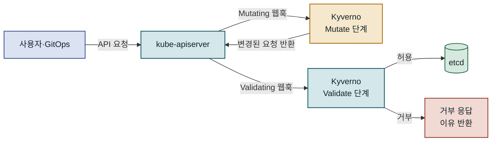
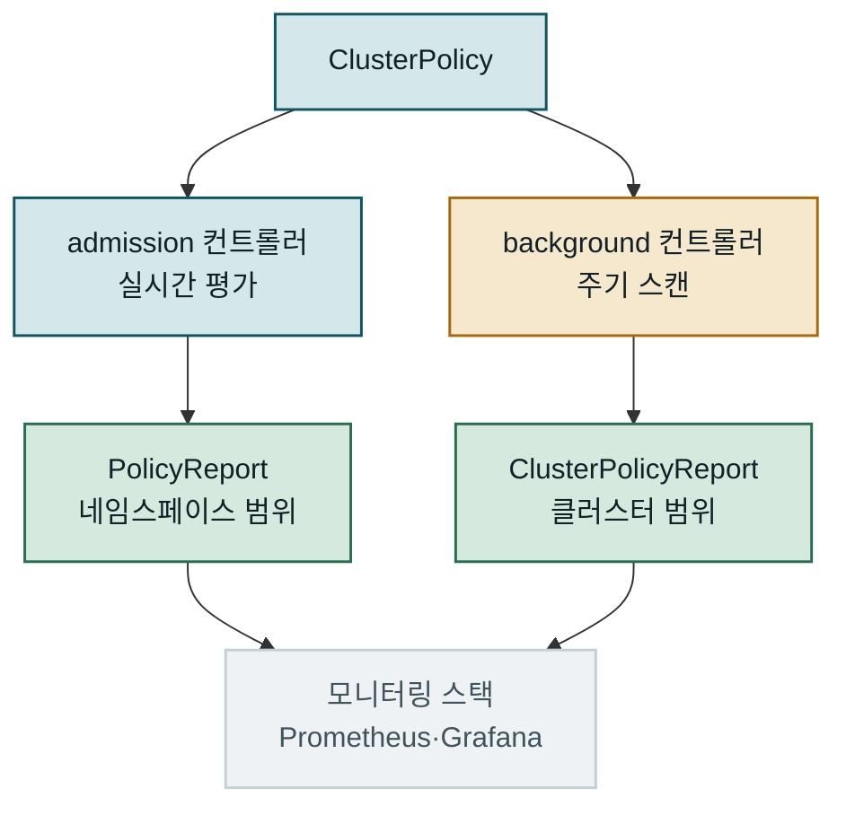
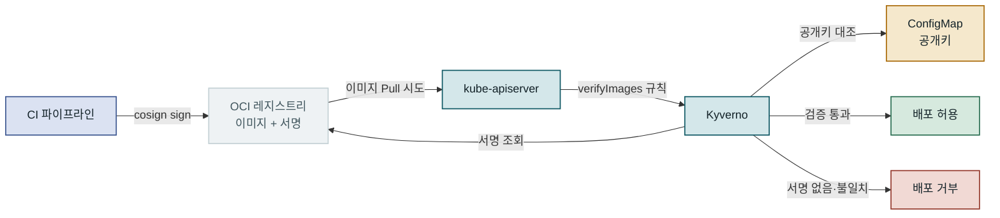
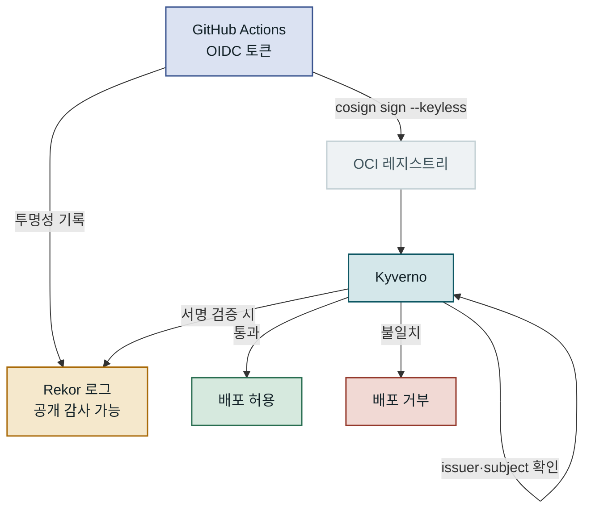
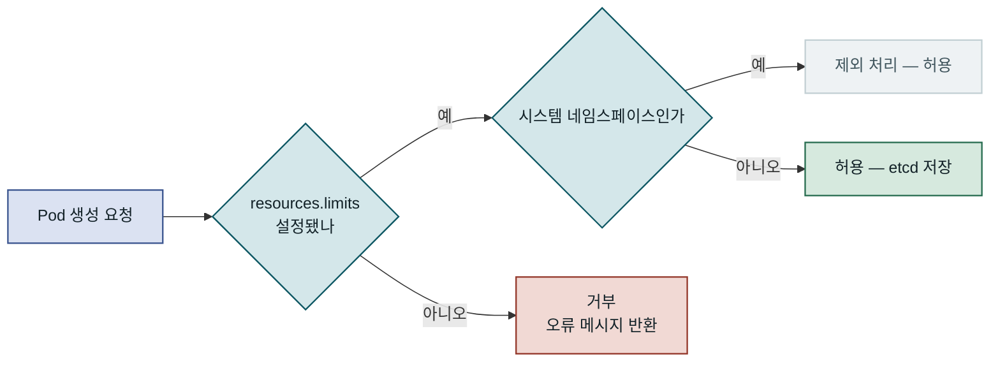
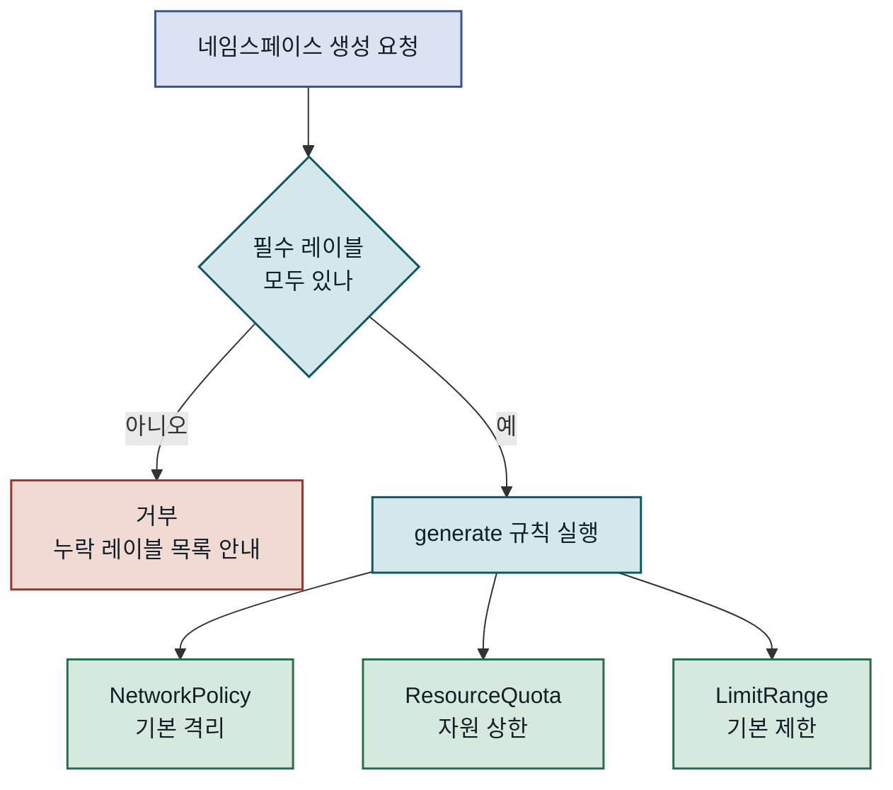
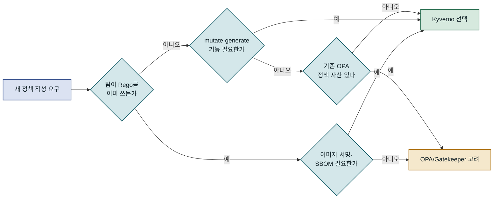
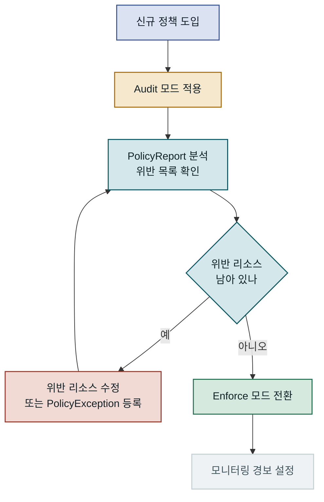
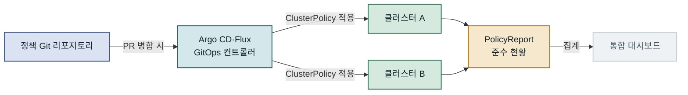

## 목차

1. 개요
2. Kyverno 아키텍처와 정책 처리 흐름
3. ClusterPolicy로 이미지 서명 검증 구현
4. 리소스 제약과 보안 컨텍스트 강제 적용
5. OPA/Gatekeeper와 비교 및 선택 기준
6. 운영 환경 적용 시 고려사항
7. 맺음말

---

## 개요

### 문제 배경: 분산된 클러스터 정책의 취약점

Kubernetes 클러스터를 운영하는 팀이 늘어날수록, 공통 정책을 일관되게 적용하는 일이 점점 어려워집니다. 개발팀이 검증되지 않은 공개 이미지를 프로덕션에 배포하거나, CPU·메모리 제한 없이 파드를 실행하거나, `root` 권한으로 컨테이너를 구동하는 상황이 빈번하게 발생합니다. 이런 사례들은 단순한 설정 오류를 넘어 공급망 공격(supply-chain attack)의 진입점이 되기도 합니다. **Kyverno**는 이 문제를 Kubernetes-native 방식으로 해결하는 정책 엔진입니다. Admission Webhook 위에서 동작하며, 리소스가 클러스터에 저장되기 전에 정책을 검사하고 자동으로 교정합니다. 이 글에서는 Kyverno의 핵심 구조부터 **이미지 서명 검증**과 **리소스 제약 강제**까지, 실제 프로젝트에서 바로 활용할 수 있는 수준으로 다룹니다.

### 기존 방식의 한계: 수동 검토와 정적 분석의 빈틈

많은 팀이 처음에는 CI/CD 파이프라인에 `kube-score`나 `kubeval` 같은 정적 분석 도구를 넣거나, 운영자가 PR 단계에서 매니페스트를 직접 검토하는 방식으로 정책을 관리합니다. 이 접근법에는 치명적인 틈이 있습니다. 파이프라인을 우회한 직접 `kubectl apply`나 GitOps 컨트롤러를 통한 긴급 배포는 정적 분석을 전혀 거치지 않습니다. 또한 정책이 코드 리포지토리에 분산되어 있으면 클러스터의 실제 상태와 일치하는지 보장하기 어렵습니다.

OPA(Open Policy Agent)와 Gatekeeper를 선택하는 팀도 있지만, Rego라는 전용 언어를 익히는 학습 곡선이 가파르고, 이미지 서명 검증 같은 Kubernetes-specific 기능은 별도 구현이 필요합니다. Kyverno는 Kubernetes 리소스와 동일한 YAML 구조로 정책을 작성하며, 이미지 서명 검증·리소스 변경(mutate)·정책 생성(generate) 기능을 단일 CRD 체계로 제공합니다. 별도 언어 없이 운영 수준의 정책을 구현할 수 있다는 점이 많은 팀이 Kyverno를 선택하는 가장 큰 이유입니다.

---

## Kyverno 아키텍처와 정책 처리 흐름

### Admission Webhook 기반 동작 원리

Kyverno는 Kubernetes의 **Dynamic Admission Control** 메커니즘 위에서 동작합니다. 클러스터에 설치되면 `MutatingWebhookConfiguration`과 `ValidatingWebhookConfiguration`을 자동으로 등록하여, 지정된 리소스 요청이 들어올 때마다 Kyverno 컨트롤러로 전달됩니다. Kyverno는 해당 요청을 **ClusterPolicy** 또는 **Policy** 규칙과 대조하여 허용(allow), 거부(deny), 변경(mutate) 여부를 결정합니다.



API 요청은 Mutate → Validate 순으로 Kyverno를 통과하며, 검증까지 통과한 요청만 etcd에 저장됩니다.

중요한 점은 Mutate 단계가 먼저 실행된다는 사실입니다. 이 덕분에 이미지 태그를 다이제스트로 교체하거나 기본 레이블을 추가하는 작업이 Validate 단계 이전에 완료됩니다. 즉, 변경된 상태를 기준으로 유효성 검사가 이루어지므로, mutate와 validate 규칙을 조합하면 더 정교한 정책을 구성할 수 있습니다.

---

Kyverno 컨트롤러는 단일 파드가 아니라 **admission**, **background**, **reports**, **cleanup** 네 가지 역할로 분리된 구성을 취합니다. admission 컨트롤러는 실시간 요청을 처리하고, background 컨트롤러는 이미 존재하는 리소스에 대해 주기적으로 정책을 재평가합니다. 이 덕분에 새 정책을 추가했을 때 기존 리소스도 준수 여부를 확인할 수 있으며, 정책 변경 전에 배포된 파드가 신규 정책을 위반하는 경우도 감지됩니다. HA(고가용성) 모드에서는 각 컨트롤러를 독립적으로 스케일 아웃할 수 있어 클러스터 규모가 커져도 안정적으로 운영됩니다.

### Policy와 ClusterPolicy의 구조

Kyverno의 정책 단위는 두 가지입니다. **Policy**는 특정 네임스페이스에 적용되는 네임스페이스 범위 리소스이고, **ClusterPolicy**는 클러스터 전체에 적용되는 클러스터 범위 리소스입니다. 두 리소스는 스펙 구조가 동일하며 차이는 적용 범위뿐입니다. 운영 환경에서는 보안 정책이나 이미지 검증처럼 전사적으로 일관되게 적용해야 하는 항목은 ClusterPolicy로, 특정 팀이나 서비스에 맞춤화된 정책은 Policy로 관리하는 것이 일반적입니다.

각 정책은 하나 이상의 **rule**로 구성됩니다. 규칙 내부는 크게 세 부분으로 나뉩니다. `match` 블록은 어떤 리소스와 작업에 이 규칙을 적용할지 선택하고, `exclude` 블록은 예외를 정의하며, 본문에는 `validate`, `mutate`, `generate`, `verifyImages` 중 하나가 위치합니다.

| 규칙 타입 | 역할 | 전형적인 사용 사례 |
|---|---|---|
| validate | 요청을 허용 또는 거부 | 리소스 제한 필수화, 레이블 강제 |
| mutate | 요청을 자동 수정 | 기본 레이블 추가, 이미지 태그→다이제스트 교체 |
| generate | 관련 리소스 자동 생성 | 네임스페이스 생성 시 NetworkPolicy 자동 생성 |
| verifyImages | 이미지 서명·SBOM 검증 | Cosign 서명 필수화, 어테스테이션 확인 |

규칙 타입이 분리되어 있기 때문에 하나의 ClusterPolicy 안에 여러 규칙을 묶어 논리적으로 관련된 정책을 한 곳에서 관리할 수 있습니다. 예를 들어 "프로덕션 배포 표준"이라는 ClusterPolicy에 이미지 서명 검증 규칙과 리소스 제한 검증 규칙을 함께 담으면 정책 가시성이 높아집니다.

### 정책 평가 결과와 PolicyReport

Kyverno는 정책 평가 결과를 **PolicyReport**와 **ClusterPolicyReport** CRD에 기록합니다. 이 리포트는 실시간 Admission 요청뿐 아니라 background 컨트롤러가 주기적으로 클러스터 전체를 스캔한 결과도 포함합니다.



PolicyReport는 실시간·백그라운드 평가 결과를 모두 집계하여 클러스터 전체의 정책 준수 현황을 단일 뷰로 보여 줍니다.

PolicyReport는 각 리소스의 정책 준수 상태를 `pass`, `fail`, `warn`, `skip`, `error`로 구분하여 기록합니다. 이 데이터를 오픈소스 `policy-reporter` Exporter로 수집하면 클러스터 전반의 정책 준수율을 Grafana 대시보드로 시각화할 수 있습니다. 특히 background 컨트롤러가 정기적으로 재평가를 실행하므로, 정책이 바뀌지 않더라도 기존 리소스가 새로운 위반 상태로 전환되는 즉시 감지됩니다.

---

## ClusterPolicy로 이미지 서명 검증 구현

### 공급망 보안과 Cosign의 역할

컨테이너 이미지 서명 검증은 공급망 보안(Supply Chain Security)의 핵심입니다. 누군가 이미지 레지스트리에 악성 이미지를 업로드하거나 기존 태그를 덮어써도, 서명이 없거나 신뢰할 수 없는 이미지는 클러스터에 진입하지 못하도록 차단할 수 있습니다. **Cosign**은 Sigstore 프로젝트의 일환으로 컨테이너 이미지에 서명하고 검증하는 사실상 표준 도구입니다. Cosign은 서명 데이터를 별도 파일로 관리하지 않고, OCI 레지스트리의 동일 레포지토리에 아티팩트 형태로 저장합니다. 이 덕분에 이미지와 서명이 항상 함께 이동하며, 레지스트리 복제나 이미지 이전 시에도 서명이 유실되지 않습니다.

Kyverno의 `verifyImages` 규칙은 Cosign과 Notary v2 두 방식을 모두 지원합니다. Cosign 방식에서는 **정적 키(static key)** 방식과 **키리스(keyless)** 방식 중 선택할 수 있습니다. 정적 키 방식은 CI 파이프라인에서 개인키로 서명하고, 클러스터에 공개키를 등록하여 검증합니다. 키리스 방식은 OIDC 토큰으로 서명자 신원을 증명하며 Fulcio CA와 Rekor 투명성 로그를 활용합니다.



이미지 서명 검증은 CI 파이프라인에서 빌드된 이미지만 클러스터에 진입하도록 보장하는 출입 통제선입니다.

---

이 구조가 중요한 이유는 "이미지 태그는 불변이 아니다"라는 사실 때문입니다. `latest`나 `v1.2.3` 같은 태그는 언제든 다른 이미지로 덮어씌워질 수 있습니다. 서명 검증은 그 순간 레지스트리에 있는 이미지가 신뢰된 빌드 파이프라인을 통해 만들어졌음을 암호학적으로 보장합니다.

### verifyImages 정책 작성

Cosign 정적 키 방식으로 이미지 서명을 검증하는 ClusterPolicy를 작성합니다. 먼저 `cosign generate-key-pair` 명령으로 키 쌍을 생성하고, 공개키를 Kubernetes Secret이나 ClusterPolicy 스펙에 인라인으로 저장합니다. 이 예시에서는 ClusterPolicy에 공개키를 직접 포함하는 방식을 사용합니다.

```yaml
apiVersion: kyverno.io/v1
kind: ClusterPolicy
metadata:
  name: verify-image-signatures
  annotations:
    policies.kyverno.io/title: 이미지 서명 검증
    policies.kyverno.io/description: >
      모든 파드 컨테이너 이미지가 신뢰된 키로 서명되었는지 확인합니다.
spec:
  validationFailureAction: Enforce   # Audit(감사만) 또는 Enforce(거부)
  background: true                   # 기존 리소스도 백그라운드 스캔
  rules:
    - name: check-image-signature
      match:
        any:
        - resources:
            kinds:
              - Pod
            namespaces:
              - "production"
              - "staging"
      verifyImages:
        - imageReferences:
            - "registry.corp.internal/myorg/*"  # 검증 대상 이미지 패턴
          attestors:
            - entries:
                - keys:
                    publicKeys: |-
                      -----BEGIN PUBLIC KEY-----
                      MFkwEwYHKoZIzj0CAQYIKoZIzj0DAQcDQgAExamplePublicKey==
                      -----END PUBLIC KEY-----
                    signatureAlgorithm: sha256
          mutateDigest: true   # 태그를 SHA256 다이제스트로 자동 교체
          verifyDigest: true   # 다이제스트 일관성 검증
          required: true       # 서명 없으면 거부
```

`validationFailureAction`을 `Enforce`로 설정하면 서명이 없거나 올바르지 않은 이미지는 클러스터 진입이 즉시 거부됩니다. `Audit`으로 설정하면 거부하지 않고 PolicyReport에 위반 항목만 기록하므로, 처음 도입할 때 영향 범위를 파악하는 용도로 활용할 수 있습니다.

`mutateDigest: true`는 이미지 태그를 배포 시점의 실제 다이제스트(`sha256:abc...`)로 자동 교체합니다. 이후 레지스트리에서 해당 태그가 다른 이미지로 변경되더라도 이미 배포된 파드는 원본 다이제스트를 참조하므로, 태그 불변성을 암묵적으로 보장합니다. 이 조합은 보안과 재현성 두 가지 목표를 동시에 달성합니다.

### 키리스 서명과 SBOM 어테스테이션 검증

**키리스(keyless)** 방식은 서명 키를 직접 관리하지 않아도 되므로 키 유출 위험을 근본적으로 줄입니다. GitHub Actions나 GitLab CI에서 OIDC 토큰을 발급받아 서명하는 방식이 현업에서 점점 많이 채택되고 있습니다. Cosign은 OIDC 토큰으로 서명자 신원을 Fulcio CA에 증명하고, 서명 기록은 Rekor 투명성 로그에 남겨 누구나 검증할 수 있도록 공개합니다.



키리스 방식에서 Kyverno는 서명의 `issuer`(예: `https://token.actions.githubusercontent.com`)와 `subject`(예: 특정 GitHub Actions 워크플로우 경로)를 함께 검증하여, 인가된 파이프라인에서 빌드된 이미지만 배포를 허용합니다.

SBOM(Software Bill of Materials) 어테스테이션 검증도 같은 `verifyImages` 규칙 안에서 처리할 수 있습니다. `attestations` 블록에 SBOM 타입과 검증 조건(예: CVSS 7.0 이상의 취약점이 포함되면 거부)을 정의하면, 이미지에 첨부된 SBOM 어테스테이션까지 함께 확인합니다. 이는 Kubernetes 클러스터 자체가 취약점 게이트 역할을 수행하는 구조입니다. CI에서 `grype`나 `trivy`로 취약점 스캔 결과를 SBOM으로 첨부하고 서명하면, 클러스터 레벨에서 이 기준을 강제할 수 있습니다.

---

## 리소스 제약과 보안 컨텍스트 강제 적용

### CPU·메모리 제한 필수화와 패턴 검증

Kubernetes에서 리소스 `limits`를 설정하지 않은 파드는 노드의 모든 CPU와 메모리를 독점할 수 있습니다. 이른바 **Noisy Neighbor** 문제로, 하나의 파드가 과도한 자원을 소모해 같은 노드의 다른 파드가 응답 불능에 빠지는 상황입니다. `LimitRange`를 사용하면 네임스페이스 단위 기본값을 설정할 수 있지만, 컨테이너가 명시적으로 큰 값을 요청하면 그대로 허용됩니다. Kyverno의 `validate` 규칙은 이보다 더 세밀한 조건을 표현할 수 있습니다.

```yaml
apiVersion: kyverno.io/v1
kind: ClusterPolicy
metadata:
  name: require-resource-limits
spec:
  validationFailureAction: Enforce
  background: true
  rules:
    - name: check-container-resources
      match:
        any:
        - resources:
            kinds:
              - Pod
      exclude:
        any:
        - resources:
            namespaces:
              - kube-system
              - kyverno
      validate:
        message: "모든 컨테이너는 CPU와 메모리 limits를 반드시 설정해야 합니다."
        pattern:
          spec:
            containers:
              - name: "*"
                resources:
                  limits:
                    memory: "?*"   # 값이 존재하고 비어 있지 않아야 함
                    cpu: "?*"
                  requests:
                    memory: "?*"
                    cpu: "?*"
```

`pattern` 기반 검증은 JMESPath 표현식 없이 직관적인 YAML 패턴으로 리소스 구조를 검사합니다. `?*`는 "값이 존재하고 비어 있지 않아야 한다"는 조건입니다. `kube-system`과 `kyverno` 네임스페이스는 `exclude` 블록으로 제외하여 클러스터 구성 요소가 영향받지 않도록 합니다.



리소스 제한 검증 흐름에서 시스템 네임스페이스는 예외로 처리하여 클러스터 구성 요소가 정책에 영향받지 않도록 분리합니다.

---

이 정책을 적용하면 `resources.limits.cpu`나 `resources.limits.memory`가 없는 파드 생성 시도는 즉시 거부됩니다. 초기 도입 시에는 `Audit` 모드로 먼저 배포하여 기존 파드 중 제한이 없는 경우를 파악하고, 순차적으로 수정한 뒤 `Enforce`로 전환하는 것이 안전합니다. `init` 컨테이너와 `ephemeral` 컨테이너에도 동일한 기준을 적용하려면 `pattern.spec.initContainers`와 `pattern.spec.ephemeralContainers`를 추가로 정의해야 합니다.

### 보안 컨텍스트 정책과 PSS 비교

보안 컨텍스트(Security Context)는 컨테이너의 권한 수준을 정의합니다. `runAsRoot: true`이거나 `privileged: true`인 컨테이너는 호스트 시스템에 훨씬 넓은 접근 권한을 가지므로, 운영 환경에서는 명시적으로 금지하는 정책이 필요합니다. Kubernetes 1.25 이후 기본 내장된 **Pod Security Standards(PSS)**와 Kyverno는 상호 보완적으로 사용할 수 있습니다. PSS는 추가 설치 없이 네임스페이스 레이블만으로 빠르게 적용되지만, 커스텀 메시지 제공이나 특정 워크로드 예외 처리에 제한이 있습니다.

| 정책 항목 | PSS restricted 프로필 | Kyverno ClusterPolicy |
|---|---|---|
| root 실행 금지 | 지원 | 지원 + 메시지 커스텀 |
| privileged 금지 | 지원 | 지원 + 세밀한 네임스페이스 예외 |
| 특정 capability 허용 목록 | 제한적 | 유연한 조건 표현 가능 |
| 이미지 서명 검증 | 미지원 | 기본 내장 |
| 자동 교정(mutate) | 미지원 | 지원 |
| 예외 관리 | 어노테이션 기반 | `exclude` 블록 + PolicyException CRD |
| 위반 기록(PolicyReport) | 미지원 | 자동 생성 |

Kyverno의 **PolicyException** CRD는 특정 워크로드가 정책 위반 없이 예외 처리될 수 있도록 명시적으로 선언하는 방법입니다. 예외 대상 리소스와 사유를 YAML로 관리하므로, "이 컨테이너는 왜 예외인지 아무도 모른다"는 상황을 방지합니다. 예외 정의 자체도 Git으로 관리되어 변경 이력과 리뷰 기록이 남습니다.

### 네임스페이스 레이블과 generate 규칙 연계

많은 조직에서 네임스페이스에 팀 소유자, 비용 센터, 환경 구분 같은 레이블을 요구합니다. 이런 레이블이 없으면 자원 비용 추적이나 RBAC 자동화가 깨집니다. Kyverno의 `validate` 규칙은 네임스페이스 생성 시 필수 레이블 존재 여부를 검사하고, `generate` 규칙을 함께 사용하면 검증 통과 후 NetworkPolicy, ResourceQuota, LimitRange 같은 리소스를 자동으로 함께 생성합니다.



네임스페이스 생성 시 validate → generate 순으로 정책이 실행되어, 레이블 검사와 리소스 자동 생성이 하나의 흐름으로 처리됩니다.

신규 팀이 네임스페이스를 요청하면 필수 레이블만 지정해도 나머지 클러스터 리소스가 자동으로 프로비저닝되는 구조입니다. 이 방식은 온보딩 체크리스트를 수동으로 따라가는 방식에 비해 누락 사고를 줄이고, 팀 간 클러스터 설정의 일관성을 유지하는 데 효과적입니다.

---

## OPA/Gatekeeper와 비교 및 선택 기준

### 정책 작성 복잡도 비교

Kubernetes 정책 엔진 시장에는 Kyverno 외에도 **OPA/Gatekeeper**가 널리 사용됩니다. 두 도구의 가장 큰 차이는 정책 언어입니다. OPA/Gatekeeper는 **Rego**라는 선언적 쿼리 언어를 사용하며, 논리 표현력이 풍부하지만 익히는 데 상당한 시간이 필요합니다. Rego는 Datalog에서 영향을 받은 언어로, 집합 연산과 재귀 표현이 자연스럽지만 기존 YAML·Go 경험만으로는 직관적이지 않습니다. Kyverno는 Kubernetes 리소스와 같은 YAML 구조로 정책을 작성하므로, 이미 Kubernetes에 익숙한 운영자라면 별도의 언어 학습 없이 접근할 수 있습니다.



정책 엔진 선택은 팀의 기존 역량, 필요한 기능의 범위, 운영 복잡도를 종합해서 결정하는 것이 합리적입니다.

### 기능 범위와 트레이드오프

| 기능 | Kyverno | OPA/Gatekeeper |
|---|---|---|
| 정책 언어 | YAML + JMESPath | Rego |
| 이미지 서명 검증 | 기본 내장 | 별도 구현 필요 |
| Mutate 규칙 | 기본 내장 | 제한적 |
| Generate 규칙 | 기본 내장 | 미지원 |
| 외부 데이터 조회 | 제한적 | Rego로 유연하게 |
| 복잡한 비즈니스 로직 | JMESPath로 가능하나 복잡 | Rego로 표현 용이 |
| PolicyReport CRD | 자동 생성 | 추가 설정 필요 |
| 커뮤니티 정책 라이브러리 | Kyverno Policies 공식 저장소 | OPA Policy Library |
| 학습 비용 | 낮음 (YAML 기반) | 높음 (Rego 습득 필요) |

OPA/Gatekeeper의 강점은 복잡한 조건 분기나 외부 데이터 조회가 필요한 정책에서 드러납니다. 예를 들어 특정 외부 API를 호출하여 승인 여부를 동적으로 결정하거나, 여러 리소스 간의 관계를 복잡한 집합 연산으로 평가하는 정책은 Rego로 더 자연스럽게 표현됩니다.

반면 Kyverno는 이미지 서명, 리소스 변경, 관련 리소스 자동 생성처럼 Kubernetes 운영에 자주 필요한 패턴을 선언적으로 처리하는 데 최적화되어 있습니다. YAML만으로 작성하고 `kyverno test` CLI로 로컬 검증까지 가능하므로, 팀 내 모든 구성원이 정책을 이해하고 수정할 수 있는 환경이 만들어집니다.

### 두 도구의 공존과 선택 기준

두 도구는 경쟁 관계라기보다 보완 관계로 볼 수 있습니다. 일부 대규모 조직에서는 Kyverno로 이미지 서명 검증과 리소스 표준화를 처리하면서, 복잡한 비즈니스 정책(예: 특정 애플리케이션은 특정 클러스터 존에만 배포 가능, 특정 팀은 특정 레지스트리만 사용 가능 등)은 OPA로 관리하는 사례도 있습니다. 다만 두 도구를 동시에 운영하면 관리 부담과 Admission Webhook 체인 복잡도가 증가하므로, 단일 도구로 커버 가능하다면 하나를 선택하는 것이 일반적으로 권장됩니다.

> 새 프로젝트에서 정책 엔진을 처음 도입한다면, 학습 곡선이 낮고 이미지 보안 기능이 내장된 Kyverno를 먼저 선택하는 것이 대부분의 상황에서 빠른 효과를 줍니다.

---

## 운영 환경 적용 시 고려사항

### 흔한 실수와 안전한 도입 절차

Kyverno를 운영 환경에 처음 도입할 때 가장 많이 겪는 문제는 **정책을 Audit 없이 바로 Enforce로 적용하는 것**입니다. 기존 클러스터에는 새 정책을 위반하는 리소스가 이미 존재하는 경우가 많습니다. 이 상황에서 Enforce 모드로 시작하면 기존 파드의 재시작이나 신규 배포가 갑자기 차단되어 예기치 않은 서비스 장애로 이어집니다. 처음에는 반드시 `validationFailureAction: Audit`으로 설정하여 PolicyReport를 통해 위반 현황을 파악한 다음, 위반 리소스를 순차적으로 수정한 뒤 Enforce로 전환해야 합니다.

두 번째 함정은 **Kyverno 자체 파드에 정책이 적용되는 상황**입니다. `kyverno` 네임스페이스는 반드시 `exclude` 블록에 포함하거나, Kyverno 설치 시 생성되는 웹훅 어노테이션을 활용해야 합니다. Kyverno가 자신의 파드를 검증하다 오류가 발생하면 admission webhook이 전체적으로 응답 불능 상태가 될 수 있습니다. 세 번째는 **`failurePolicy` 설정**입니다. Kubernetes Admission Webhook의 `failurePolicy`를 `Fail`로 설정하면 Kyverno 자체에 장애가 발생했을 때 클러스터 전체 리소스 생성이 차단됩니다. `Ignore`로 설정하면 Kyverno 장애 시 정책 검사를 건너뜁니다. Kyverno를 **HA 모드**로 배포하여 단일 장애점을 제거하는 것이 전제 조건입니다.



정책 도입은 반드시 Audit → 위반 수정 → Enforce 순으로 진행해야 운영 서비스에 미치는 영향을 최소화할 수 있습니다.

### 모니터링 지표와 디버깅 방법

Kyverno는 기본적으로 Prometheus 메트릭을 노출합니다. `kyverno_policy_results_total`은 정책 평가 결과(pass/fail)를 레이블별로 집계하고, `kyverno_admission_requests_total`은 처리된 Admission 요청 수를 추적합니다. Grafana 대시보드에서 이 지표를 시각화하면 특정 정책의 차단 빈도나 처리 지연이 발생하는 시점을 파악할 수 있습니다.

| 모니터링 지표 | 확인 내용 | 경보 조건 예시 |
|---|---|---|
| `kyverno_policy_results_total{result="fail"}` | 정책 위반 건수 | 5분 내 10건 이상 발생 시 |
| `kyverno_admission_review_duration_seconds` | 정책 평가 지연 | p99 > 500ms |
| `kyverno_controller_reconcile_errors_total` | 컨트롤러 오류 횟수 | 0보다 크면 즉시 알림 |
| `kyverno_policy_changes_total` | 정책 변경 횟수 | 예상치 못한 급증 감지 |
| `kyverno_background_scan_errors_total` | 백그라운드 스캔 오류 | 지속 발생 시 알림 |

정책 평가 실패 원인을 디버깅할 때는 `kubectl describe clusterpolicy <name>`과 Kyverno 컨트롤러 파드의 로그를 함께 확인합니다. `--log-level=4` 이상으로 설정하면 어떤 규칙이 어떤 이유로 실패했는지 상세 로그를 출력합니다. `kyverno test` CLI 명령어를 사용하면 실제 클러스터 없이 로컬에서 정책과 리소스 매니페스트를 대조하여 예상 결과를 검증할 수 있습니다. 이 CLI 테스트를 CI 파이프라인에 포함하면 정책 변경이 배포되기 전에 의도한 대로 동작하는지 사전에 확인할 수 있습니다.

### 멀티클러스터 환경과 GitOps 연계

클러스터가 여러 개인 멀티클러스터 환경에서는 Kyverno 정책을 GitOps 방식으로 관리하는 것이 표준에 가깝습니다. Argo CD나 Flux를 통해 정책 정의 파일을 각 클러스터에 동기화하면, 정책 변경 이력이 Git에 남고 감사 추적이 용이해집니다.



GitOps로 정책을 관리하면 클러스터 간 정책 일관성을 유지하고, 정책 변경의 검토 체계를 코드 리뷰 프로세스와 통합할 수 있습니다.

정책 리포지토리를 애플리케이션 코드 리포지토리와 분리하는 것을 권장합니다. 보안 정책은 조직 전체에 영향을 미치므로, 별도 리뷰어를 지정하고 변경 절차를 엄격하게 관리하는 것이 합리적입니다. 기존 클러스터에 Kyverno를 도입할 때는 **네임스페이스 단위로 단계적으로 적용**하는 전략이 안전합니다. 신규 네임스페이스에 먼저 Enforce 모드를 적용하고, 기존 네임스페이스는 Audit 모드로 시작하여 위반 항목을 순차적으로 해소합니다. 이 방식은 전체 적용에 시간이 걸리지만, 운영 중인 서비스에 미치는 영향을 최소화하는 현실적인 접근입니다.

---

## 맺음말

### 핵심 요약

Kyverno는 Kubernetes-native 정책 엔진으로, YAML 기반 선언적 문법으로 이미지 서명 검증, 리소스 제약 강제, 네임스페이스 자동 프로비저닝 등 다양한 클러스터 거버넌스 요구를 단일 체계로 처리합니다. **verifyImages 규칙**은 Cosign 서명이 없거나 신뢰할 수 없는 이미지의 클러스터 진입을 암호학적으로 차단하고, **validate 규칙**은 리소스 제한과 보안 컨텍스트를 선언적으로 강제하며, **generate 규칙**은 네임스페이스 생성 시 필수 리소스를 자동으로 함께 생성하여 온보딩 표준화를 실현합니다. PolicyReport CRD는 실시간 요청과 백그라운드 스캔 결과를 통합 기록하여 클러스터 전체의 정책 준수 상태를 가시화합니다.

OPA/Gatekeeper 대비 Kyverno의 주요 장점은 이미지 서명 검증 기능의 내장, mutate·generate 규칙 지원, 그리고 낮은 진입 장벽입니다. Rego 언어 학습 없이도 현업에서 요구하는 수준의 정책을 빠르게 구현할 수 있습니다. 다만 매우 복잡한 조건 분기나 외부 API 조회가 필요한 정책에서는 Rego의 표현력이 더 유리할 수 있으므로, 팀의 요구 사항을 먼저 파악하는 것이 중요합니다.

### 적용 판단 기준

다음 조건 중 하나 이상에 해당한다면 Kyverno 도입을 즉시 검토할 수 있습니다. 공개 레지스트리 이미지가 프로덕션 클러스터에 아무 검증 없이 진입하는 상황을 차단하고 싶은 경우, 리소스 제한 미설정으로 노드 불안정 문제가 반복되는 경우, 신규 네임스페이스 생성 시 NetworkPolicy나 ResourceQuota 설정이 빠지는 사고가 잦은 경우가 이에 해당합니다. 반면 이미 OPA/Gatekeeper를 운영 중이고 방대한 Rego 정책 자산이 있다면, 전면 교체보다 이미지 검증 부분만 Kyverno로 보완하는 방식도 현실적입니다. 어느 쪽이든 정책 도입의 첫 단계는 반드시 **Audit 모드**에서 시작해야 하며, 이 원칙을 지키면 대부분의 운영 장애를 예방할 수 있습니다. Kyverno 공식 정책 라이브러리([https://kyverno.io/policies/](https://kyverno.io/policies/))에는 이미지 서명, 보안 컨텍스트, 네트워크 정책 등 수백 가지 검증된 정책이 게시되어 있어, 처음 도입하는 팀이 참고하기에 적합합니다.
