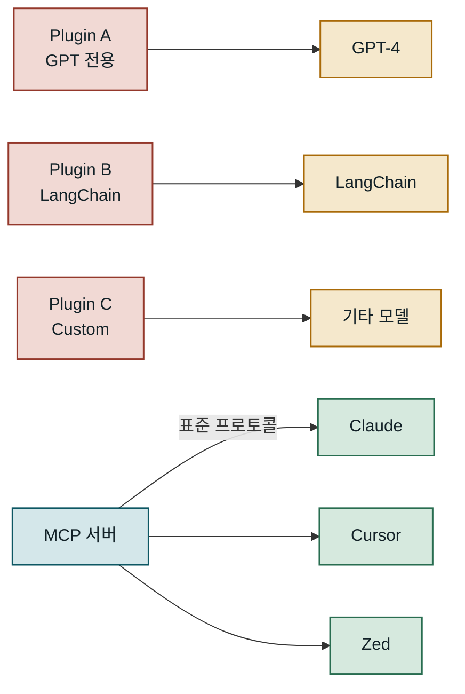
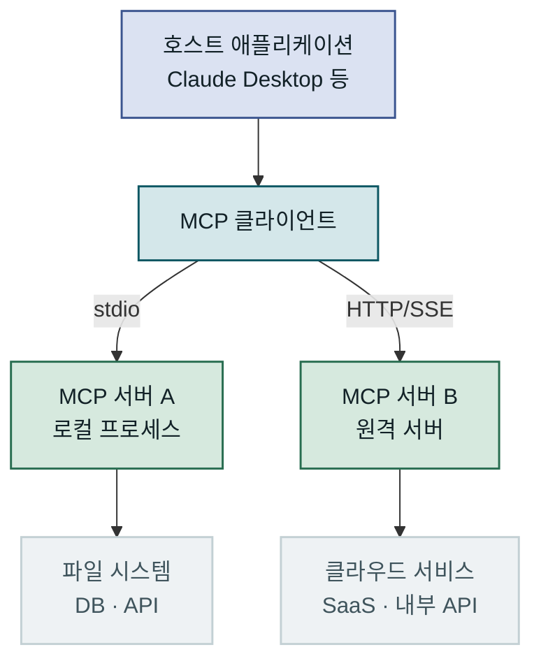
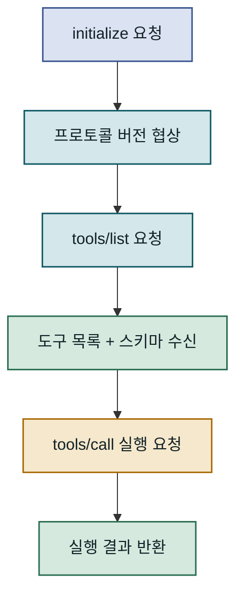
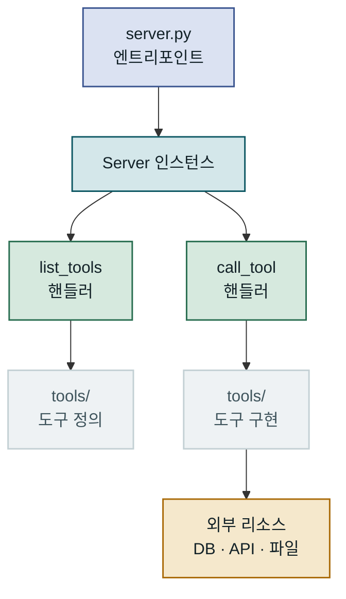
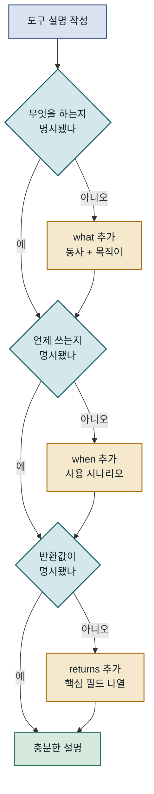
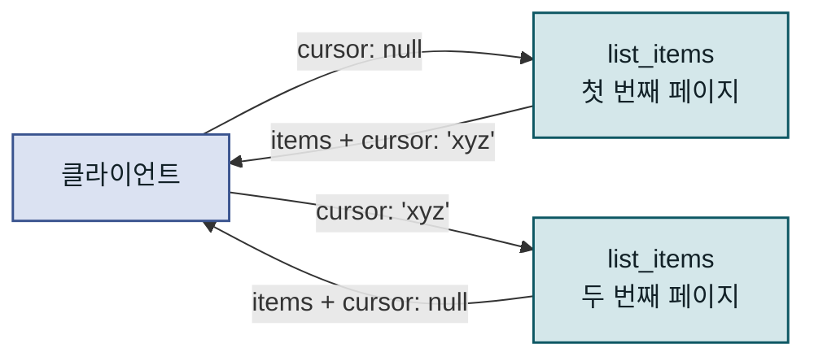
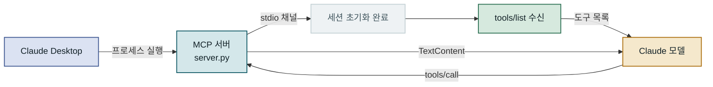
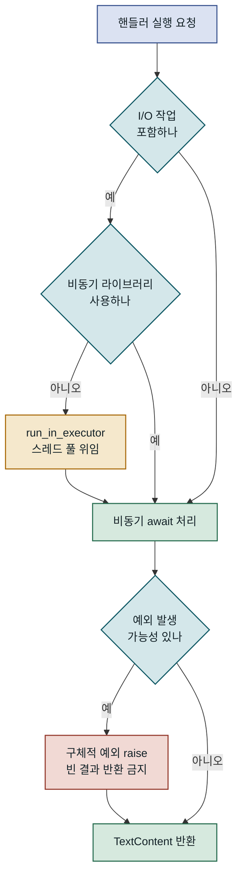
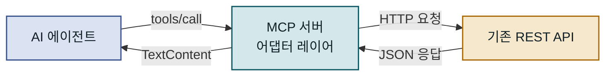

## 목차

1. 개요
2. MCP 프로토콜 구조와 동작 원리
3. Python SDK로 MCP 서버 구현하기
4. 커스텀 도구 스키마 설계
5. AI 에이전트 연동과 통합 테스트
6. 운영 환경 적용 시 고려사항
7. 맺음말

---

## 개요

### 문제 배경

**MCP(Model Context Protocol)**는 Anthropic이 2024년 공개한 개방형 표준으로, AI 모델이 외부 도구와 데이터 소스에 접근하는 방식을 통일합니다. LLM 기반 애플리케이션을 개발하다 보면 반드시 마주치는 한계가 있습니다. 모델 자체는 강력하지만 실제 데이터베이스를 조회하거나, 사내 API를 호출하거나, 특정 파일 시스템에 접근하려면 매번 별도의 연동 코드를 작성해야 했습니다. MCP Python SDK로 커스텀 MCP 서버를 직접 구현하면 이 연동 코드를 표준화된 방식으로 한 번만 작성하고 여러 AI 클라이언트에서 즉시 재사용할 수 있습니다.

### 기존 방식의 한계

MCP 이전에도 LLM에 도구를 붙이는 방법은 존재했습니다. OpenAI Function Calling, LangChain의 Tool 추상화, 각 프레임워크가 제공하는 플러그인 시스템이 대표적입니다. 이들의 공통적인 문제는 **특정 모델 또는 프레임워크에 종속**된다는 점입니다. GPT-4를 위해 작성한 함수 스키마는 Claude에서 그대로 쓸 수 없고, LangChain Tool로 작성한 코드는 다른 오케스트레이션 레이어로 이식하기 어렵습니다.

더 근본적인 문제는 **통신 방식의 파편화**입니다. 어떤 도구는 REST 엔드포인트를 노출하고, 어떤 도구는 Python 함수를 직접 임포트하도록 요구하며, 어떤 도구는 gRPC를 씁니다. 이 파편화는 AI 에이전트 시스템을 확장하거나 유지보수할 때 상당한 복잡도를 만들어 냅니다. 운영 중인 서비스에 새 모델을 도입할 때마다 연동 코드를 처음부터 다시 작성해야 하는 상황이 반복됩니다.

MCP는 이 문제를 **단일 표준 프로토콜**로 해결합니다. 서버는 도구를 MCP 형식으로 한 번만 노출하면 되고, Claude Desktop, Cursor, Zed 등 MCP를 지원하는 클라이언트라면 어디서든 그 도구를 바로 활용할 수 있습니다. 팀이 MCP 서버를 독립적으로 관리하면서 AI 에이전트 클라이언트와 느슨하게 결합된 아키텍처를 구성할 수 있습니다.



MCP 이전에는 도구마다 다른 연동 방식이 필요했지만, MCP 서버 하나로 지원 클라이언트 전체를 커버할 수 있습니다.

---

## MCP 프로토콜 구조와 동작 원리

### 아키텍처 개요

MCP는 **클라이언트-서버 모델**을 따릅니다. AI 에이전트가 동작하는 **호스트 애플리케이션**이 클라이언트 역할을 하고, 실제 도구나 데이터를 제공하는 **MCP 서버**가 서버 역할을 합니다. 둘 사이의 통신은 [JSON-RPC 2.0](https://www.jsonrpc.org/specification) 을 기반으로 하며, 전송 계층으로는 **stdio**(표준 입출력)와 **HTTP/SSE**(Server-Sent Events) 두 가지를 지원합니다.

stdio 방식은 호스트 프로세스가 MCP 서버를 자식 프로세스로 직접 실행하는 형태입니다. 프로세스 간 통신이므로 네트워크 설정이 필요 없고 지연 시간도 낮습니다. Claude Desktop 통합이나 로컬 개발 단계에서 주로 쓰입니다. 반면 **HTTP/SSE 방식**은 서버가 독립적인 HTTP 엔드포인트를 제공하므로, 원격 배포나 여러 클라이언트가 동시에 접근해야 하는 환경에 적합합니다. 하나의 클라이언트가 여러 MCP 서버에 동시 연결할 수 있다는 점도 중요합니다. 각 서버는 서로 독립적으로 동작하며, 클라이언트는 연결된 모든 서버의 도구를 통합된 목록으로 관리합니다.



호스트는 MCP 클라이언트를 통해 로컬과 원격 서버에 동시 연결할 수 있으며, 각 서버는 서로 독립적으로 운영됩니다.

### 메시지 교환 흐름

MCP 세션은 세 단계로 구성됩니다. 먼저 클라이언트가 `initialize` 요청을 보내 프로토콜 버전과 지원 기능을 협상하는 **핸드셰이크** 단계가 있습니다. 이후 클라이언트는 `tools/list`를 호출해 서버가 제공하는 도구 목록을 받아옵니다. AI 모델은 이 목록을 바탕으로 어떤 도구를 어떤 상황에 쓸 수 있는지 파악합니다. 마지막으로 실제 작업이 필요할 때 `tools/call` 요청으로 특정 도구를 실행합니다.

이 흐름에서 중요한 설계 결정은 **도구 목록 조회와 실제 호출이 분리**된다는 점입니다. 모델은 매 턴마다 도구를 다시 조회하지 않아도 되며, 세션 시작 시 받은 스키마 정보를 바탕으로 도구 호출 여부를 결정합니다. 이 설계 덕분에 서버 쪽에서 도구를 동적으로 추가하거나 제거해도 다음 세션부터 바로 반영됩니다. 세션 중에 도구 목록이 바뀌면 서버가 `notifications/tools/list_changed` 알림을 보내 클라이언트가 다시 목록을 조회하도록 유도할 수도 있습니다.



핸드셰이크 → 도구 목록 조회 → 도구 호출의 3단계가 하나의 MCP 세션을 구성하며, 도구 목록은 세션 시작 시 한 번 로드됩니다.

### 핵심 구성 요소

MCP 서버가 노출할 수 있는 리소스는 **도구(Tools)**, **리소스(Resources)**, **프롬프트(Prompts)** 세 가지입니다. 이 중 가장 범용적으로 쓰이고 AI 에이전트와의 상호작용에서 핵심이 되는 것은 도구입니다. 리소스는 파일 내용이나 DB 레코드처럼 읽기 전용으로 노출하는 데이터이고, 프롬프트는 사용자가 선택할 수 있는 재사용 가능한 프롬프트 템플릿입니다.

| 리소스 유형 | 역할 | 대표 사용처 | 모델 제어 여부 |
|---|---|---|---|
| Tools | 동작 실행 · 상태 변경 | API 호출, DB 쓰기 | 모델이 호출 결정 |
| Resources | 읽기 전용 데이터 노출 | 파일 내용, 설정값 | 클라이언트가 로드 |
| Prompts | 프롬프트 템플릿 제공 | 워크플로우 안내 | 사용자가 선택 |

도구는 이름, 설명, JSON Schema 형식의 입력 스키마로 정의됩니다. 설명은 단순한 주석이 아니라 **모델이 도구를 언제 사용할지 판단하는 핵심 신호**입니다. 애매한 설명은 모델이 잘못된 도구를 선택하거나 불필요하게 도구를 반복 호출하는 원인이 됩니다. 스키마 설계와 설명 작성에 코드 작성만큼 공을 들여야 하는 이유가 여기에 있습니다.

---

## Python SDK로 MCP 서버 구현하기

### 개발 환경 준비

Python MCP SDK는 `mcp` 패키지명으로 PyPI에 배포되어 있습니다. Python 3.10 이상이 필요하며, 의존성 관리에는 `uv`를 권장합니다. `uv`는 `pip`보다 설치 속도가 빠르고, 가상 환경과 패키지 관리를 통합적으로 제공하기 때문에 MCP 서버 프로젝트의 표준 도구로 자리 잡는 추세입니다. 기본 서버 구현에는 `mcp` 패키지만 있으면 충분하지만, HTTP/SSE 전송을 사용한다면 `uvicorn`과 `starlette`도 함께 설치해야 합니다.

프로젝트 구조는 단순하게 시작하는 것이 좋습니다. 초기에는 `server.py` 단일 파일로 시작하고, 도구 구현이 늘어날수록 `tools/` 하위 디렉토리로 관심사를 분리합니다. 각 도구 모듈을 서버 엔트리포인트에서 등록하는 패턴은 새 도구를 추가할 때 기존 코드를 수정하지 않아도 되는 이점이 있습니다. 설정값은 환경 변수로 외부화해야 컨테이너 환경에 배포할 때 코드 변경 없이 주입할 수 있습니다. API 키를 코드에 하드코딩하는 습관은 초기 프로토타입에서는 빠르게 보이지만, 팀 협업과 배포 자동화 단계에서 반드시 문제가 됩니다.



엔트리포인트에서 `Server` 인스턴스를 생성하고 두 핸들러를 등록한 뒤 전송 계층을 시작하는 세 단계가 서버 구조의 전부입니다.

### 서버 기본 구조 구현

`mcp` SDK의 핵심은 `Server` 클래스입니다. 서버 이름과 버전을 지정해 인스턴스를 생성하고, 데코레이터 방식으로 두 핸들러를 등록합니다. `@server.list_tools()`는 클라이언트가 도구 목록을 요청할 때 호출되고, `@server.call_tool()`은 모델이 특정 도구를 실행하도록 요청할 때 호출됩니다. 두 핸들러 모두 비동기 함수여야 하며, 외부 API 호출이나 DB 쿼리처럼 I/O 대기가 있는 작업을 핸들러 안에서 `await`로 직접 처리할 수 있습니다.

아래는 날씨 조회와 단위 변환 두 가지 도구를 제공하는 MCP 서버의 기본 구현입니다. 실제 환경에서는 외부 API 호출이 포함되지만, 구조 파악에 집중하기 위해 간소화된 로직을 사용합니다.

```python
import asyncio
from mcp.server import Server
from mcp.server.stdio import stdio_server
from mcp.types import Tool, TextContent

# 서버 인스턴스 생성 — 이름과 버전은 클라이언트에 노출됨
server = Server("weather-tools", version="1.0.0")

@server.list_tools()
async def list_tools() -> list[Tool]:
    return [
        Tool(
            name="get_weather",
            description=(
                "도시 이름으로 현재 날씨를 조회합니다. "
                "기온(섭씨), 습도(%), 날씨 상태를 반환합니다. "
                "고객이 특정 지역의 날씨를 물을 때 사용합니다."
            ),
            inputSchema={
                "type": "object",
                "properties": {
                    "city": {
                        "type": "string",
                        "description": "조회할 도시 이름 (한글 또는 영어)"
                    }
                },
                "required": ["city"]
            }
        ),
        Tool(
            name="convert_temperature",
            description="섭씨(Celsius)와 화씨(Fahrenheit) 간 온도를 변환합니다.",
            inputSchema={
                "type": "object",
                "properties": {
                    "value": {"type": "number", "description": "변환할 온도 값"},
                    "from_unit": {
                        "type": "string",
                        "enum": ["celsius", "fahrenheit"],
                        "description": "입력값의 단위"
                    }
                },
                "required": ["value", "from_unit"]
            }
        )
    ]

@server.call_tool()
async def call_tool(name: str, arguments: dict) -> list[TextContent]:
    if name == "get_weather":
        city = arguments["city"]
        # 실제 환경에서는 httpx로 날씨 API 호출
        result = f"{city}: 기온 22°C, 습도 65%, 맑음"  # 결과: 텍스트 형식으로 반환
        return [TextContent(type="text", text=result)]

    elif name == "convert_temperature":
        value = arguments["value"]
        if arguments["from_unit"] == "celsius":
            converted = value * 9 / 5 + 32
            return [TextContent(type="text", text=f"{value}°C = {converted:.1f}°F")]
        else:
            converted = (value - 32) * 5 / 9
            return [TextContent(type="text", text=f"{value}°F = {converted:.1f}°C")]

    raise ValueError(f"알 수 없는 도구: {name}")

async def main():
    async with stdio_server() as (read_stream, write_stream):
        await server.run(
            read_stream, write_stream,
            server.create_initialization_options()
        )

if __name__ == "__main__":
    asyncio.run(main())
```

`raise ValueError`로 예외를 던지면 SDK가 JSON-RPC 에러 응답으로 변환해 클라이언트에 전달합니다. 예외를 잡아서 빈 리스트를 반환하거나 임의의 오류 문자열을 돌려보내면 모델이 성공으로 오해하고 잘못된 결론을 내릴 수 있으므로 주의해야 합니다.

### 도구 등록과 핸들러 연결

`call_tool` 핸들러 안에서 도구 이름으로 분기하는 방식은 도구가 5개 이하일 때는 직관적이지만, 수가 늘어나면 유지보수가 어려워집니다. 이를 개선하는 접근법으로 **레지스트리 패턴**이 있습니다. 딕셔너리에 도구 이름을 키로, 핸들러 함수를 값으로 매핑해 두면 분기 로직이 단 두 줄로 줄어들고, 새 도구를 추가할 때는 핸들러 함수를 작성하고 딕셔너리에 항목만 추가하면 됩니다.

```python
from typing import Callable, Awaitable

ToolHandler = Callable[[dict], Awaitable[list[TextContent]]]

async def handle_get_weather(args: dict) -> list[TextContent]:
    city = args["city"]
    # 실제 환경: await httpx.AsyncClient().get(WEATHER_API_URL, params={"city": city})
    return [TextContent(type="text", text=f"{city}: 맑음, 22°C, 습도 65%")]

async def handle_convert_temperature(args: dict) -> list[TextContent]:
    value, unit = args["value"], args["from_unit"]
    result = value * 9/5 + 32 if unit == "celsius" else (value - 32) * 5/9
    label = "°F" if unit == "celsius" else "°C"
    return [TextContent(type="text", text=f"변환 결과: {result:.1f}{label}")]

# 도구 이름 → 핸들러 매핑 (새 도구 추가 시 여기에만 등록)
TOOL_REGISTRY: dict[str, ToolHandler] = {
    "get_weather": handle_get_weather,
    "convert_temperature": handle_convert_temperature,
}

@server.call_tool()
async def call_tool(name: str, arguments: dict) -> list[TextContent]:
    handler = TOOL_REGISTRY.get(name)
    if not handler:
        raise ValueError(f"알 수 없는 도구: {name}")
    return await handler(arguments)
```

핸들러 함수를 독립적인 모듈로 분리한 뒤 레지스트리에 등록하면, 각 도구의 비즈니스 로직을 서버 구동 없이 단위 테스트할 수 있습니다.

---

## 커스텀 도구 스키마 설계

### 도구 스키마 설계 원칙

MCP 서버를 구현하면서 가장 많은 시간을 쏟아야 할 부분은 역설적으로 코드가 아니라 **도구 설명과 스키마**입니다. AI 모델은 도구를 호출할지 말지, 어떤 인자를 넣을지를 전적으로 `name`, `description`, 그리고 `inputSchema` 안 각 프로퍼티의 `description`을 보고 판단합니다. 모델이 잘못된 도구를 선택하거나 인자를 빠뜨리는 문제의 대부분은 설명이 불충분하거나 모호한 데서 발생합니다.

좋은 도구 설명은 세 가지 요소를 포함합니다. **무엇을 하는지(what)**: 동사 + 목적어 형태로 동작을 명확히 기술합니다. **언제 쓰는지(when)**: 사용 시나리오나 트리거 조건을 적습니다. **무엇을 반환하는지(returns)**: 반환값의 핵심 필드를 나열합니다. "데이터를 가져옵니다"처럼 막연한 설명은 모델이 이 도구를 써야 할지 판단할 근거를 주지 못합니다. "주문 번호로 주문 상세 정보를 조회합니다. 주문 상태, 배송 추적 번호, 예상 도착일을 반환합니다. 고객이 주문 현황을 물을 때 사용합니다."처럼 구체적으로 작성해야 합니다.



도구 설명의 세 요소(what · when · returns)를 모두 갖췄을 때 모델의 도구 선택 정확도가 높아집니다.

### 입출력 타입과 유효성 검사

`inputSchema`는 [JSON Schema Draft 7](https://json-schema.org/specification-links.html#draft-7) 을 따릅니다. `type`, `properties`, `required`, `enum`, `minimum`, `maximum`, `pattern` 같은 표준 키워드를 모두 사용할 수 있습니다. 스키마를 꼼꼼히 정의할수록 두 가지 이점이 생깁니다. 첫째, 모델이 올바른 형식으로 인자를 생성할 가능성이 높아집니다. 둘째, 잘못된 인자가 넘어왔을 때 핸들러 안에서 별도 검증 코드를 작성하지 않아도 SDK 레벨에서 걸러낼 수 있습니다.

날짜 범위를 인자로 받는 도구라면 `"format": "date"`를 지정하고, 상태 코드처럼 정해진 값만 허용한다면 `enum`을 씁니다. 개수에 제한이 있다면 `minimum`과 `maximum`을, 특정 패턴의 문자열이라면 `pattern`으로 정규표현식을 지정합니다. 이처럼 스키마를 구체적으로 정의하면 모델이 잘못된 값을 생성할 여지 자체를 줄일 수 있습니다.

| 인자 유형 | 권장 스키마 키워드 | 비고 |
|---|---|---|
| 날짜 | `"type": "string", "format": "date"` | ISO 8601 형식 유도 |
| 고정 옵션 | `"enum": ["a", "b", "c"]` | 모델 오류 방지 효과 큼 |
| 숫자 범위 | `"minimum": 1, "maximum": 100` | 경계값 실수 방지 |
| 정규화된 ID | `"pattern": "^[A-Z]{3}-\\d{6}$"` | 형식 자동 검증 |
| 배열 입력 | `"type": "array", "items": {...}` | `minItems`도 함께 지정 |

### 복잡한 도구 패턴

도구 하나가 여러 동작을 수행할 수 있도록 `action` 같은 디스패처 인자를 쓰는 패턴은 피하는 것이 좋습니다. "action이 'create'이면 A를 하고, 'delete'이면 B를 한다"는 식의 설계는 모델에 불필요한 맥락 추론 부담을 주고, 각 동작마다 달라지는 필수 인자를 스키마로 표현하기도 어렵습니다. 단일 책임 원칙에 따라 도구 하나는 한 가지 동작에 집중하는 설계가 모델의 도구 선택 정확도를 높입니다.

페이지네이션이 있는 목록 조회처럼 상태를 유지해야 하는 경우에는 **커서 패턴**을 권장합니다. 서버가 불투명한 커서 문자열을 반환하고, 다음 호출 시 그 커서를 그대로 넘기면 서버가 위치를 복원합니다. 이 방식은 서버 쪽에서 페이지 번호를 관리할 필요가 없고, 중간에 데이터가 추가되거나 삭제되어도 일관된 순회를 보장합니다.



커서가 `null`이면 첫 페이지, 유효한 값이면 이전 호출이 반환한 위치부터 재개하며, 마지막 페이지에서 다시 `null`이 반환됩니다.

---

## AI 에이전트 연동과 통합 테스트

### Claude와의 연결 설정

구현한 MCP 서버를 Claude Desktop에 연결하는 방법은 간단합니다. stdio 방식의 경우 Claude Desktop 설정 파일(`claude_desktop_config.json`)에 서버 경로와 실행 명령을 추가합니다. 이 파일은 macOS에서 `~/Library/Application Support/Claude/` 디렉토리에 있으며, Windows에서는 `%APPDATA%\Claude\` 경로를 사용합니다. 서버를 `uv run server.py` 형태로 실행하도록 지정하면 Claude Desktop이 세션 시작 시 자동으로 서버 프로세스를 띄웁니다.

설정 파일에 `env` 키를 추가하면 서버 프로세스에 환경 변수를 주입할 수 있습니다. API 키처럼 민감한 값을 코드에 하드코딩하지 않고 런타임에 주입하는 방식은, 개발 환경과 운영 환경을 같은 코드베이스로 관리할 때 필수적인 패턴입니다. 이 습관을 초기부터 들여두면 나중에 배포 환경을 변경할 때 코드 수정 없이 설정만 바꾸면 됩니다.



Claude Desktop이 서버를 자식 프로세스로 실행하고, stdio 채널을 통해 도구 목록을 받아온 뒤, 모델이 필요할 때 도구를 호출하는 흐름입니다.

### 테스트 전략

MCP 서버 테스트는 세 레이어로 구분하는 것이 효율적입니다. 가장 빠르게 실행되는 **단위 테스트**에서는 도구 핸들러 함수를 직접 호출합니다. 외부 의존성(DB, API)은 `unittest.mock`으로 대체하고 반환값만 검증합니다. 핸들러 함수를 서버 인스턴스에서 분리해 독립적인 함수로 관리하면 이 단계의 테스트 작성이 쉬워집니다. 이 테스트는 CI 파이프라인에서 매 커밋마다 실행해도 부담이 없습니다.

**통합 테스트**에서는 실제 MCP 프로토콜 흐름을 검증합니다. `mcp` SDK가 제공하는 `ClientSession`을 이용하면 실제 클라이언트처럼 `initialize`, `tools/list`, `tools/call`을 순서대로 호출할 수 있습니다. 이 단계에서는 실제 외부 서비스 대신 테스트 전용 스텁을 사용합니다. 마지막으로 **E2E 테스트**는 [MCP Inspector](https://github.com/modelcontextprotocol/inspector) 를 사용해 도구가 올바르게 등록되고 호출되는지 확인합니다. MCP Inspector는 `npx @modelcontextprotocol/inspector` 명령으로 브라우저 기반 UI를 실행하며, JSON-RPC 메시지를 실시간으로 확인할 수 있어 Claude Desktop을 거치지 않고도 서버 동작을 빠르게 검증할 수 있습니다.

| 테스트 레이어 | 대상 | 속도 | 외부 의존성 | 실행 시점 |
|---|---|---|---|---|
| 단위 | 핸들러 함수 | 매우 빠름 | Mock | 매 커밋 |
| 통합 | MCP 프로토콜 흐름 | 중간 | 스텁 | PR 머지 전 |
| E2E | 서버 전체 + Inspector | 느림 | 실제 서비스 | 배포 전 |

### 에러 처리와 디버깅

MCP 서버의 에러는 크게 두 종류로 나뉩니다. 첫 번째는 **프로토콜 에러**로, 잘못된 JSON 형식이나 필수 필드 누락처럼 SDK가 자동으로 처리합니다. 두 번째는 **비즈니스 로직 에러**로, 존재하지 않는 주문 번호 조회나 외부 API 타임아웃처럼 핸들러 안에서 발생합니다. 비즈니스 에러는 구체적인 예외를 그대로 `raise`하면 SDK가 JSON-RPC 에러 응답으로 변환해 클라이언트에 전달합니다.

> 핸들러에서 발생한 예외를 잡아 빈 리스트를 반환하거나 임의의 에러 문자열을 돌려보내지 말 것. 모델이 성공으로 오해하고 잘못된 결론을 내립니다.

디버깅 과정에서 실제 JSON-RPC 메시지를 눈으로 보는 것이 중요합니다. MCP Inspector의 브라우저 UI에서 `tools/list` 응답을 확인하면 스키마가 의도한 대로 직렬화됐는지 즉시 알 수 있습니다. `tools/call` 요청을 직접 보내 반환값 형식을 검증하면, Claude Desktop을 열기 전에 서버 구현의 대부분을 검증할 수 있습니다.

---

## 운영 환경 적용 시 고려사항

### 흔한 실수와 함정

MCP 서버를 처음 운영 환경에 배포할 때 가장 자주 마주치는 문제는 **이벤트 루프 블로킹**입니다. `call_tool` 핸들러 안에서 `requests` 라이브러리처럼 동기 I/O를 사용하면 서버 전체가 응답을 기다리는 동안 다른 요청을 처리할 수 없습니다. MCP Python SDK는 완전히 비동기로 동작하므로, 외부 HTTP 요청에는 `httpx`나 `aiohttp`, DB 접근에는 `asyncpg`나 `sqlalchemy[asyncio]`처럼 비동기 라이브러리를 사용해야 합니다. 기존 동기 코드를 재사용해야 할 때는 `asyncio.run_in_executor`로 스레드 풀에 위임하면 이벤트 루프 블로킹을 피할 수 있습니다.

두 번째 흔한 실수는 **도구 설명의 버전 관리 소홀**입니다. 도구의 동작이 바뀌었는데 설명을 그대로 두면, 세션을 재시작하기 전까지 모델이 오래된 정보를 기반으로 도구를 호출하는 문제가 발생합니다. 도구 설명을 코드와 함께 버전 관리하고, 동작 변경 시 설명도 함께 업데이트하는 것을 팀 규칙으로 정해두는 것이 중요합니다. 인자 타입이 바뀌거나 새 필수 인자가 추가되면 기존 스키마를 그대로 유지하면서 새 버전 도구를 추가하고 이전 버전을 deprecated로 표시하는 점진적 전환 방식이 안전합니다.



비동기 I/O 체크와 예외 처리를 핸들러마다 일관되게 적용해야 안정적인 서버를 유지할 수 있습니다.

### 모니터링과 디버깅

운영 중인 MCP 서버에서 가장 먼저 모니터링해야 할 지표는 **도구 호출 응답 시간**과 **에러율**입니다. 도구가 느리거나 자주 실패하면 모델이 같은 도구를 반복 호출하거나 잘못된 결론을 내리는 경향이 있습니다. Python의 표준 `logging` 모듈로 각 도구 호출의 시작·종료 시각, 인자 요약, 에러 여부를 기록하면 문제 추적이 쉬워집니다. 단, 민감한 데이터가 인자에 포함될 수 있으므로 로그 레벨을 환경 변수로 제어하고, 프로덕션에서는 인자 전체를 남기지 않는 정책이 필요합니다.

HTTP/SSE 방식으로 배포한 서버라면 Prometheus + Grafana 조합으로 도구별 호출 횟수, 응답 시간 분포(P50/P95/P99), 에러율을 대시보드로 시각화하는 것이 효과적입니다. 핸들러 앞뒤에 데코레이터 패턴으로 메트릭 수집 코드를 붙이면, 각 도구 구현에 계측 코드를 직접 삽입하지 않아도 전체 서버의 성능 특성을 파악할 수 있습니다. 특정 도구의 응답 시간이 P95 기준으로 크게 높다면, 그 도구가 호출하는 외부 의존성에 타임아웃과 재시도 로직이 충분히 적용됐는지 확인해야 합니다.

### 확장과 마이그레이션

단일 서버에 도구가 20~30개를 넘어가기 시작하면 **도메인별 서버 분리**를 고려할 시점입니다. 주문 관련 도구는 `order-tools` 서버로, 고객 관련 도구는 `customer-tools` 서버로 분리하면, 각 팀이 서버를 독립적으로 배포하고 관리할 수 있습니다. MCP 클라이언트는 여러 서버에 동시 연결할 수 있으므로, 클라이언트 쪽 코드 변경 없이 설정 파일에 항목을 추가하는 것만으로 새 서버를 붙일 수 있습니다.

기존 REST API를 MCP 도구로 래핑하는 마이그레이션 시나리오도 현업에서 자주 등장합니다. 기존 API를 건드리지 않고 MCP 서버가 그 앞에 위치해 도구 인터페이스만 제공하는 **어댑터 패턴**을 쓰면 기존 시스템을 변경하지 않아도 됩니다. 필요하다면 MCP 서버 레이어에서 인자 변환이나 결과 가공도 처리할 수 있으므로, 기존 API의 형식이 AI 에이전트에 최적화되지 않았더라도 중간에서 조정할 수 있습니다.



기존 REST API 앞에 MCP 서버를 어댑터로 배치하면, 기존 시스템을 수정하지 않고도 AI 에이전트에서 즉시 활용할 수 있습니다.

---

## 맺음말

### 핵심 요약

MCP는 AI 에이전트와 외부 도구 사이의 통신을 표준화한 프로토콜이며, Python SDK로 서버를 구현하는 핵심은 `list_tools`와 `call_tool` 두 핸들러를 올바르게 작성하는 데 있습니다. 도구 설명과 JSON Schema 스키마가 모델의 도구 선택 정확도를 결정하므로, 코드 작성만큼 스키마 설계에 공을 들여야 합니다. 단위 테스트 → 통합 테스트 → MCP Inspector → Claude Desktop 순서로 점진적으로 검증하면 디버깅 비용을 크게 줄일 수 있습니다.

운영 단계에서는 비동기 I/O 일관성, 예외 처리 방침, 도구 설명의 버전 관리가 장기적인 안정성을 좌우합니다. 도구 수가 늘어나면 레지스트리 패턴으로 구조를 정리하고, 도메인별 서버 분리로 팀 단위 독립 배포를 가능하게 하는 것이 확장성 있는 설계 방향입니다.

### 적용 판단 기준

MCP 서버 직접 구현이 적합한 상황은 크게 두 가지입니다. 첫째, AI 에이전트가 접근해야 하는 사내 시스템(내부 DB, 레거시 API, 파일 서버)이 있고 기존 공개 MCP 서버로는 커버되지 않을 때입니다. 둘째, 한 번 구현한 도구를 Claude Desktop, Cursor, 자체 개발 에이전트 등 여러 클라이언트에서 공통으로 재사용해야 할 때입니다.

반대로 Claude API에 함수를 붙이는 수준의 일회성 프로토타입이라면, MCP 서버 구현보다 tool\_use API를 직접 사용하는 것이 더 빠릅니다. MCP는 **인터페이스 표준화의 이점이 운영 복잡도보다 커지는 시점**, 즉 여러 에이전트 클라이언트를 지원하거나 팀이 분리된 서버를 독립적으로 관리해야 할 때 진가를 발휘합니다. 아직 단일 모델, 단일 클라이언트 수준이라면 먼저 tool\_use API로 빠르게 검증한 뒤, 요구사항이 확장될 때 MCP 서버로 전환하는 점진적 접근이 현실적입니다.
