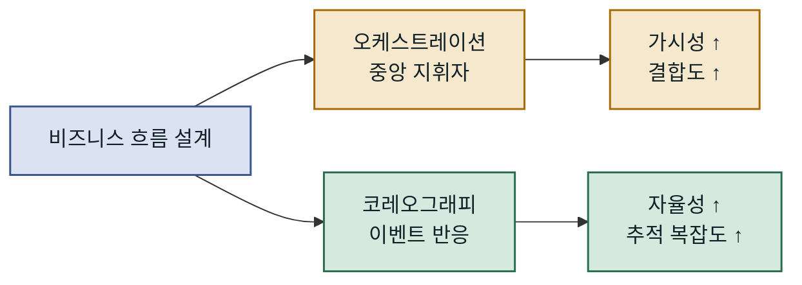
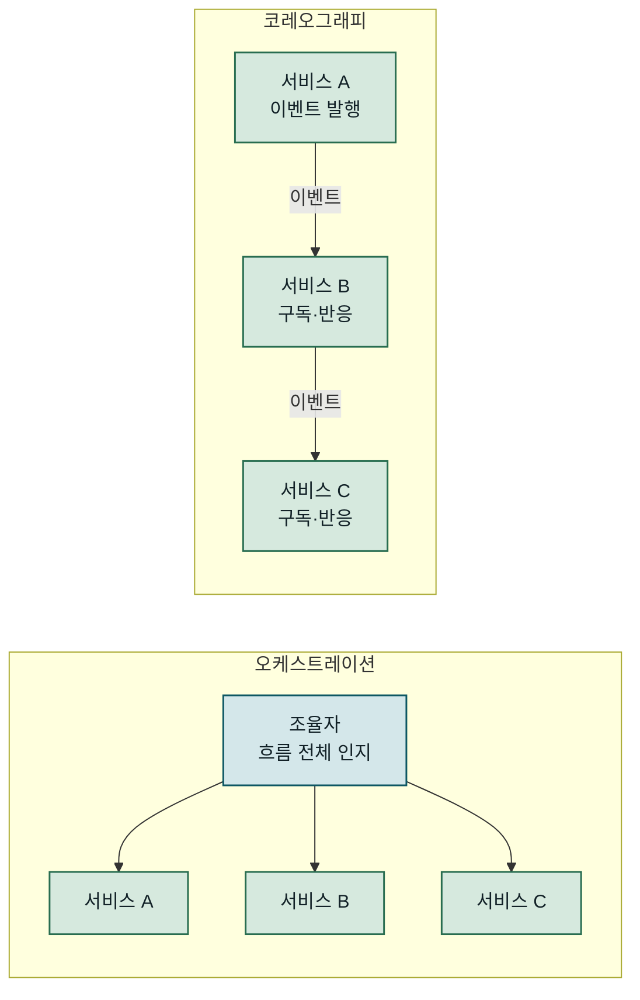
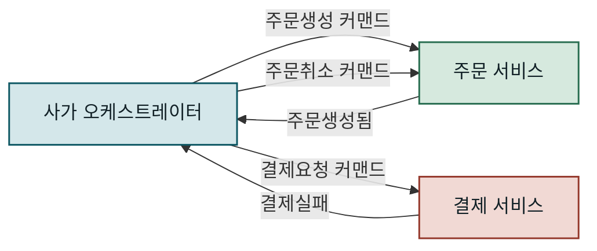
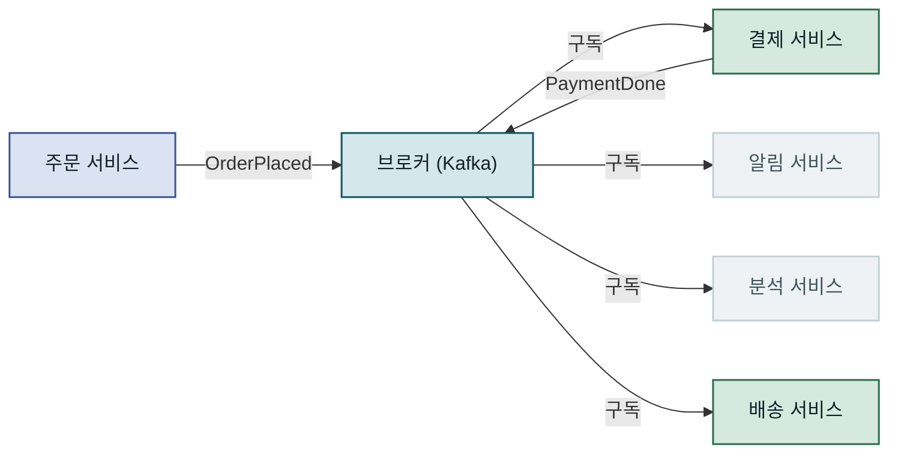
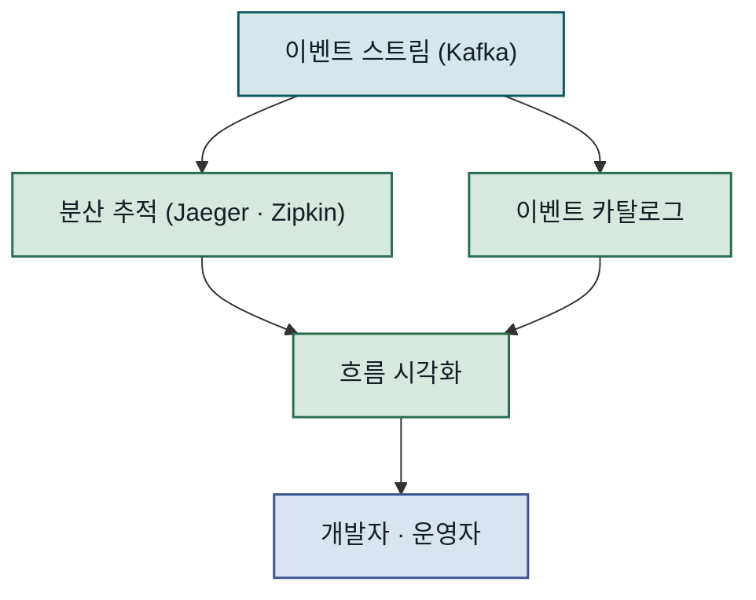
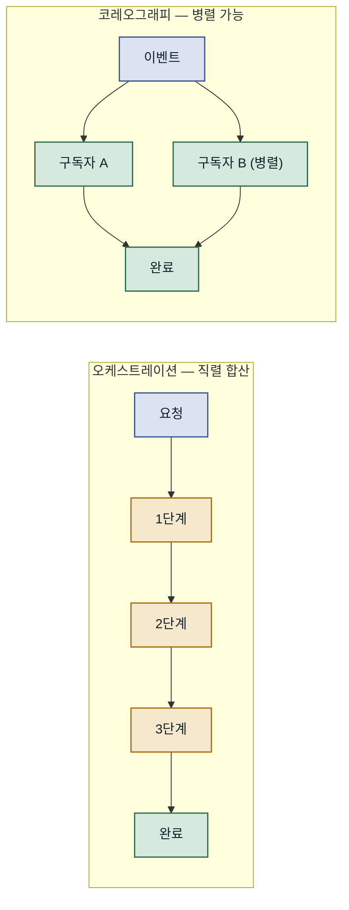
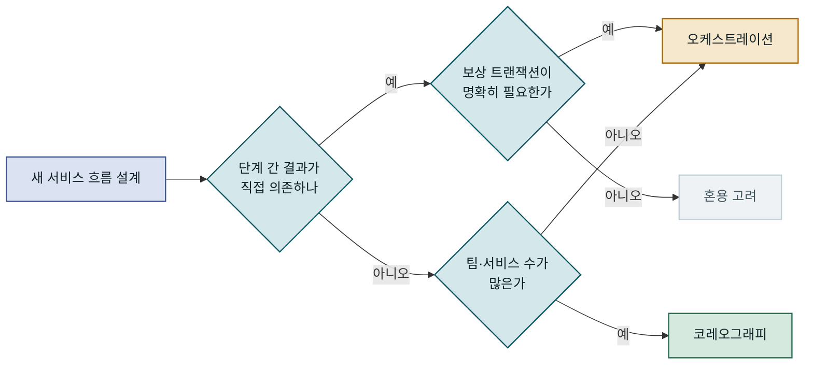
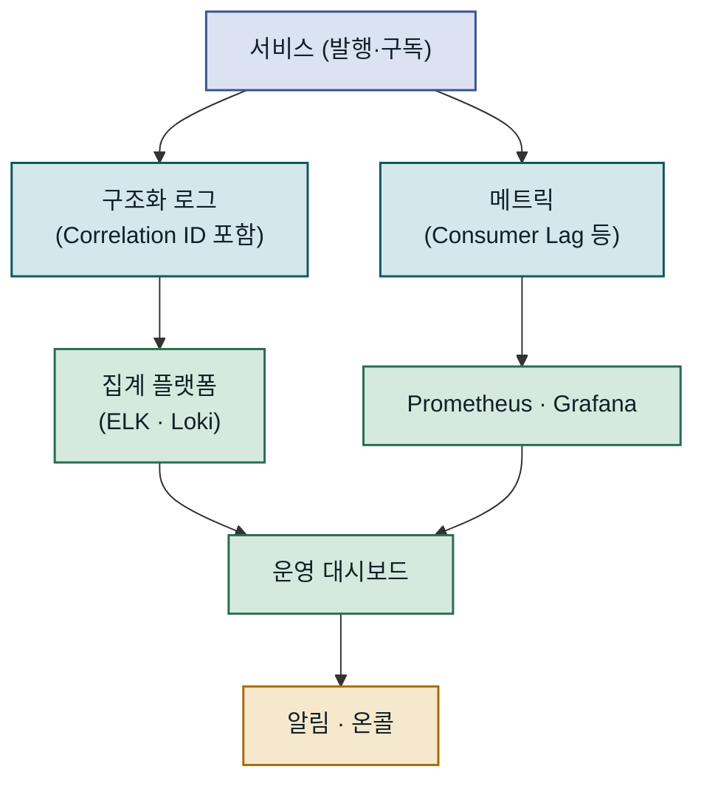

## 목차

1. 개요
2. 오케스트레이션과 코레오그래피의 핵심 개념
3. 오케스트레이션 패턴 — 중앙 지휘자 방식
4. 코레오그래피 패턴 — 자율적 이벤트 반응 방식
5. 두 패턴의 성능과 트레이드오프
6. 운영 환경에서의 설계 선택 기준
7. 맺음말

---

## 개요

### 문제 배경

마이크로서비스 아키텍처에서 여러 서비스가 협력해 하나의 비즈니스 트랜잭션을 완성할 때, 그 협력 방식이 시스템의 복잡도·유지보수성·팀 자율성을 결정합니다. **서비스 오케스트레이션(Service Orchestration)**과 **코레오그래피(Choreography)**는 이 협력 구조를 설계하는 두 가지 핵심 접근법이며, 단순한 구현 스타일 차이가 아니라 "비즈니스 흐름에 대한 지식을 어디에 두느냐"라는 근본적인 철학의 차이입니다. 어떤 방식을 선택하느냐에 따라 디버깅 방법, 팀 간 조정 비용, 장애 격리 방식이 모두 달라집니다. 이 글은 두 패턴의 동작 원리와 트레이드오프를 구체적인 예시와 함께 분석하고, 상황에 맞는 설계 기준을 제시합니다.

### 기존 방식의 한계

모놀리식 시스템에서 마이크로서비스로 전환할 때 가장 자연스러운 선택은 각 서비스 호출을 한 곳에서 순서대로 지시하는 방식입니다. 초기에는 명확하고 직관적이지만, 서비스 수가 수십 개를 넘어서면 이 중앙 집중형 접근은 병목 또는 책임 소재 없는 혼란으로 이어집니다. 반대로 이벤트 기반 설계를 무계획적으로 도입하면 어떤 서비스가 무슨 이벤트를 발행·구독하는지 추적이 어려워지고, 장애 발생 시 원인을 찾기가 매우 힘들어집니다. 두 패턴은 각각 고유한 강점과 한계를 가지며, 상황에 맞는 기준 없이 선택하면 오히려 아키텍처 부채가 쌓입니다.



두 패턴은 가시성과 자율성 사이의 트레이드오프를 서로 다른 방향으로 해소합니다.

---

## 오케스트레이션과 코레오그래피의 핵심 개념

### 두 패턴의 정의와 철학적 차이

**오케스트레이션**은 하나의 중앙 조율자(Orchestrator)가 비즈니스 흐름 전체를 인지하고, 각 참여 서비스에게 명령(Command)을 내려 작업을 진행시키는 방식입니다. 조율자는 각 단계의 결과를 기다리고, 다음 단계를 결정하며, 오류 처리와 보상 트랜잭션도 직접 관리합니다. 마치 오케스트라 지휘자가 각 파트에 큐(cue)를 주듯 전체를 통제합니다.

**코레오그래피**는 중앙 조율자 없이 각 서비스가 이벤트를 발행하고, 관심 있는 다른 서비스들이 해당 이벤트를 구독해 자율적으로 반응하는 방식입니다. 어떤 서비스도 전체 흐름을 직접 지휘하지 않으며, 비즈니스 프로세스는 서비스 간 이벤트 체인으로 자연스럽게 완성됩니다. 무용수들이 지휘자 없이 서로의 움직임에 반응하며 공연을 완성하는 것에 비유할 수 있습니다.

두 패턴의 핵심 차이는 단순히 "누가 호출하느냐"가 아닙니다. **지식의 위치(Knowledge Location)**가 다릅니다. 오케스트레이션에서는 비즈니스 흐름에 대한 지식이 조율자 한 곳에 집중됩니다. 코레오그래피에서는 이 지식이 각 서비스에 분산됩니다. "주문이 생성되면 결제를 시작한다"는 규칙은 결제 서비스가 알고 있고, "결제가 완료되면 배송을 준비한다"는 규칙은 배송 서비스가 알고 있습니다. 이 차이가 시스템이 성장할수록 설계 압력으로 나타납니다.



지식이 한 곳에 집중되느냐, 각 서비스에 분산되느냐가 두 패턴의 본질적 차이입니다.

### 이벤트와 커맨드의 구분

두 패턴을 이해할 때 **커맨드(Command)**와 **이벤트(Event)**의 구분이 중요합니다. 커맨드는 수신자에게 특정 행동을 요청합니다. "결제를 처리하라"는 커맨드이며, 발신자는 수신자가 누구인지 알고 결과를 기대합니다. 오케스트레이션은 주로 커맨드를 기반으로 작동합니다.

이벤트는 과거에 일어난 사실을 선언합니다. "주문이 생성됐다"는 이벤트이며, 발행자는 누가 이 이벤트를 소비할지 알지 못하고 신경 쓰지 않습니다. 코레오그래피는 이 이벤트의 특성을 활용해 서비스 간 결합도를 낮춥니다. 이 두 개념을 혼동하면 코레오그래피처럼 보이지만 실제로는 암묵적 오케스트레이션인 설계가 만들어집니다. 예를 들어 이벤트를 발행하면서도 "특정 서비스가 반드시 이 이벤트를 처리해야 한다"는 가정을 코드에 심는 경우가 대표적입니다.

### 어느 계층에서 선택하는가

두 패턴은 서비스 간 통신 계층에서의 전략이지만, 반드시 전체 시스템에 하나만 적용해야 하는 것은 아닙니다. 하나의 마이크로서비스 시스템에서도 복잡한 트랜잭션 흐름에는 오케스트레이션을, 느슨한 이벤트 전파에는 코레오그래피를 혼용하는 경우가 많습니다. 예를 들어 주문 처리 사가(Saga)는 오케스트레이터 방식으로 구현하면서, 주문 완료 이벤트 이후 마케팅·통계·알림 시스템의 반응은 코레오그래피로 설계하는 식입니다. 중요한 것은 각 상황에서 어떤 패턴이 **변경 비용**과 **운영 투명성** 측면에서 더 유리한지를 따지는 것입니다.

---

## 오케스트레이션 패턴 — 중앙 지휘자 방식

### 사가(Saga) 오케스트레이터 구조

분산 트랜잭션을 다루는 대표적인 오케스트레이션 구현이 **Saga 패턴**입니다. 각 단계는 로컬 트랜잭션으로 처리되며, 실패 시 이전 단계의 보상(Compensation) 트랜잭션이 역순으로 실행됩니다. 이 흐름 전체를 사가 오케스트레이터가 상태 기계(State Machine)로 관리합니다. 오케스트레이터는 각 서비스에 커맨드를 발행하고, 서비스는 결과 이벤트로 응답하며, 오케스트레이터는 이 응답을 보고 다음 커맨드를 결정하거나 보상을 시작합니다.



결제 실패가 발생하면 오케스트레이터가 즉시 보상 트랜잭션 흐름을 제어합니다.

스프링 생태계에서는 **Axon Framework**나 **Temporal**이 오케스트레이션 기반 사가를 지원합니다. 아래는 Axon Framework를 활용한 주문 처리 사가의 핵심 구조입니다. 주문 서비스가 `OrderPlacedEvent`를 발행하면 사가가 시작되고, 사가 오케스트레이터는 결제 커맨드를 발행한 뒤 성공·실패 이벤트에 따라 다음 단계를 결정합니다.

```java
@Saga
public class OrderSaga {

    @Autowired
    private transient CommandGateway commandGateway;

    private String orderId;

    @StartSaga
    @SagaEventHandler(associationProperty = "orderId")
    public void handle(OrderPlacedEvent event) {
        this.orderId = event.getOrderId();
        // 결제 서비스에 커맨드 발행
        commandGateway.send(new ProcessPaymentCommand(
            event.getOrderId(),
            event.getAmount()
        ));
    }

    @SagaEventHandler(associationProperty = "orderId")
    public void handle(PaymentProcessedEvent event) {
        // 결제 성공 → 배송 커맨드 발행
        commandGateway.send(new PrepareShipmentCommand(
            event.getOrderId(),
            event.getShippingAddress()
        ));
    }

    @SagaEventHandler(associationProperty = "orderId")
    public void handle(PaymentFailedEvent event) {
        // 결제 실패 → 보상: 주문 취소 커맨드
        commandGateway.send(new CancelOrderCommand(event.getOrderId()));
        // 결과: OrderCancelledEvent 발행 → 사가 종료
    }

    @EndSaga
    @SagaEventHandler(associationProperty = "orderId")
    public void handle(ShipmentPreparedEvent event) {
        // 사가 완료 — Axon이 상태를 영속화하고 인스턴스를 종료
    }
}
```

`@Saga` 어노테이션이 붙은 클래스는 Axon이 상태를 자동으로 영속화하며 관리합니다. `@StartSaga`·`@EndSaga`로 생명주기를 명확히 선언하고, 각 단계를 `@SagaEventHandler`로 처리합니다. 보상 트랜잭션 로직이 오케스트레이터 한 곳에 집중되어 있으므로, 전체 흐름을 파악하거나 수정할 때 단일 파일만 열면 됩니다.

### 오케스트레이션의 가시성과 디버깅

오케스트레이션의 가장 큰 실용적 강점은 **가시성**입니다. 현재 어느 단계에 있는지, 어디서 실패했는지를 오케스트레이터의 상태만 조회하면 알 수 있습니다. Temporal이나 AWS Step Functions 같은 도구는 시각적 실행 이력 대시보드를 제공하며, 특정 인스턴스의 타임라인을 재현할 수도 있습니다. 운영 환경에서 "주문 #12345는 왜 배송이 안 됐나?"라는 질문에 즉시 답할 수 있다는 것은 팀의 야간 대응 비용을 크게 줄입니다.

반면 오케스트레이터 자체가 단일 장애점이 될 수 있습니다. 오케스트레이터가 다운되면 진행 중인 모든 흐름이 멈춥니다. 이를 방지하려면 오케스트레이터를 고가용성으로 구성하거나, Temporal처럼 워크플로 상태를 외부 스토리지에 체크포인트로 저장하는 방식을 채택해야 합니다. 또 다른 위험은 오케스트레이터가 점점 비대해지는 **God Object** 문제입니다. "이 서비스가 성공하면 저 조건을 보고 다음 서비스를 호출한다"는 로직이 축적되면 하나의 클래스가 시스템의 모든 비즈니스 판단을 담게 됩니다.

| 오케스트레이션 강점 | 오케스트레이션 약점 |
|---|---|
| 비즈니스 흐름이 한 곳에 명시됨 | 오케스트레이터 복잡도 증가 위험 |
| 디버깅·모니터링 용이 | 단일 장애점 가능성 |
| 보상 트랜잭션 명시적 관리 | 서비스 간 결합도 상승 |
| 순서 제어·재시도 일관성 | 오케스트레이터 배포 의존성 |

### 오케스트레이션이 적합한 시나리오

비즈니스 트랜잭션이 엄격한 순서를 요구하거나, 실패 시 명확한 롤백 절차가 필요한 경우 오케스트레이션이 유리합니다. 금융 거래, 항공권 예약, 의료 워크플로처럼 각 단계의 결과가 다음 단계의 입력에 직접 영향을 미치는 **선형·의존적 흐름**이 대표적입니다. 결제 금액이 배송 옵션을 결정하거나, 재고 확인 결과가 주문 수락 여부를 결정하는 경우처럼 이전 단계의 응답 데이터가 다음 커맨드에 반드시 포함되어야 하는 상황입니다. 또한 외부 시스템과의 연동(레거시 API 호출, 서드파티 결제 게이트웨이)이 포함된 경우, 중앙에서 재시도·타임아웃·회로 차단기(Circuit Breaker)를 일관되게 관리하는 것이 훨씬 안전합니다.

---

## 코레오그래피 패턴 — 자율적 이벤트 반응 방식

### 이벤트 브로커 기반 설계

코레오그래피는 **이벤트 브로커(Event Broker)**를 중심으로 설계됩니다. Kafka, RabbitMQ, AWS EventBridge 같은 브로커가 이벤트를 중계하며, 각 서비스는 관심 있는 이벤트를 구독해 독립적으로 반응합니다. 어떤 서비스도 다른 서비스를 직접 호출하지 않으며, 브로커에 이벤트를 발행하거나 구독할 뿐입니다. 발행자는 자신이 발행한 이벤트의 소비자가 누구인지 알 필요가 없으며, 소비자 역시 발행자의 내부 구현에 관여하지 않습니다.



브로커를 중심으로 발행자와 구독자가 완전히 분리되어 서비스 간 직접 의존성이 사라집니다.

각 서비스는 발행하는 이벤트의 스키마만 계약으로 관리하며, 누가 그 이벤트를 구독하는지 알 필요가 없습니다. 이 특성이 코레오그래피의 가장 큰 강점인 **낮은 결합도**를 만들어 냅니다. 새 서비스를 추가할 때 기존 서비스를 변경하지 않고 이벤트를 구독하기만 하면 됩니다. A/B 테스트용 처리 서비스를 병렬로 구독시키거나, 새 분석 파이프라인을 추가하는 것이 기존 코드를 전혀 수정하지 않고 가능합니다. 이 확장성은 팀이 분화되고 서비스 수가 많아질수록 오케스트레이션 대비 압도적인 이점이 됩니다.

### 코레오그래피 구현과 이벤트 계약

코레오그래피에서 이벤트 스키마는 서비스 간 계약입니다. 이 계약이 흔들리면 구독자 전체가 영향을 받습니다. Kafka를 사용하는 경우 **Schema Registry**와 Avro 또는 Protobuf를 조합해 스키마 진화(Schema Evolution)를 관리하는 것이 현업에서 검증된 방식입니다. 특히 **하위 호환 변경(backward-compatible change)**만 허용하는 정책을 Schema Registry 수준에서 강제하면, 기존 구독자가 새 이벤트를 안전하게 소비할 수 있습니다.

아래는 Spring Kafka를 활용한 주문 이벤트 발행과 구독 구조입니다. 주문 서비스가 `OrderPlacedEvent`를 Kafka 토픽에 발행하고, 결제 서비스와 알림 서비스가 각각 독립적으로 소비합니다. 두 소비자는 서로를 알지 못합니다.

```java
// 발행자 — 주문 서비스 (팀 A 담당)
@Service
public class OrderService {
    private final KafkaTemplate<String, OrderPlacedEvent> kafkaTemplate;

    public void placeOrder(Order order) {
        order.save(); // 로컬 트랜잭션 완료
        // 이벤트 발행 — 누가 소비하는지 모름
        kafkaTemplate.send("order.placed", order.getId(),
            new OrderPlacedEvent(order.getId(), order.getAmount(),
                order.getUserId()));
        // 결과: Kafka "order.placed" 토픽에 메시지 적재
    }
}

// 구독자 — 결제 서비스 (팀 B 담당, 독립 배포)
@KafkaListener(topics = "order.placed", groupId = "payment-service")
public void handleOrderPlaced(OrderPlacedEvent event) {
    paymentProcessor.process(event.getOrderId(), event.getAmount());
    // 자체 이벤트 발행 — 다음 구독자(배송 서비스)가 반응
    kafkaTemplate.send("payment.processed",
        new PaymentProcessedEvent(event.getOrderId()));
    // 결과: "payment.processed" 토픽에 메시지 적재
}
```

발행자는 토픽에만 메시지를 보내고, 구독자는 토픽에서 메시지를 꺼내 처리한 뒤 자신의 이벤트를 다시 발행합니다. 두 서비스는 코드 수준의 의존성이 전혀 없으며, 독립적으로 배포하고 확장할 수 있습니다. 새로운 소비자(예: 포인트 적립 서비스)가 생기면 기존 코드를 변경하지 않고 동일한 토픽을 구독하기만 하면 됩니다.

### 코레오그래피의 복잡성 — 분산된 흐름 추적

코레오그래피의 가장 큰 도전은 **전체 흐름이 코드 어디에도 명시되어 있지 않다**는 점입니다. "주문 처리 프로세스"는 주문·결제·배송·알림 서비스 각각에 분산된 이벤트 핸들러들로 암묵적으로 표현됩니다. 새 개발자가 전체 흐름을 파악하려면 모든 서비스의 이벤트 발행·구독 목록을 직접 추적해야 합니다. 이 문제를 방치하면 이벤트 체인이 길어질수록 **스파게티 이벤트** 구조가 됩니다.



코레오그래피 환경에서 운영 가시성은 자동으로 생기지 않으므로, 추적 인프라를 별도로 구성해야 합니다.

이 문제를 다루는 현실적인 방법은 세 가지입니다. 첫째, **이벤트 카탈로그(Event Catalog)**를 별도로 관리해 각 이벤트의 발행자·구독자·스키마를 문서화합니다([EventCatalog](https://www.eventcatalog.dev/)가 오픈소스 도구로 주목받고 있습니다). 둘째, **분산 추적(Distributed Tracing)**을 적용해 Correlation ID로 하나의 비즈니스 흐름을 Jaeger나 Zipkin에서 시각적으로 확인합니다. 셋째, **이벤트 스토밍(Event Storming)** 설계 기법으로 코드 작성 전에 이벤트 흐름을 팀 전체가 모여 명시적으로 모델링합니다. 세 방법 모두 코드 외부에서 흐름을 가시화하는 보완책이라는 점에서, 코레오그래피 도입은 곧 이 인프라 투자를 동반한다는 것을 의미합니다.

---

## 두 패턴의 성능과 트레이드오프

### 지연 시간과 처리량 특성

오케스트레이션은 동기적 요청-응답 흐름을 사용할 경우 각 단계의 지연이 합산됩니다. 오케스트레이터 → 서비스 A → 오케스트레이터 → 서비스 B → 오케스트레이터 식의 핑퐁 구조에서 네트워크 왕복이 단계 수 × 2만큼 발생합니다. 비동기 커맨드-이벤트 방식으로 설계하면 개선되지만, 구현 복잡도가 높아집니다. 특히 Temporal 같은 워크플로 엔진을 사용하면 상태 체크포인팅으로 인한 추가 I/O가 발생하며, 이는 고빈도·저지연 시나리오에서 병목이 될 수 있습니다.

코레오그래피는 기본적으로 비동기 처리입니다. 주문 서비스가 이벤트를 발행하는 순간 자신의 처리는 완료되며, 이후 단계는 병렬로 진행될 수 있습니다. 결제와 알림이 독립적으로 동시에 진행된다면 전체 흐름 시간은 가장 오래 걸리는 단계 하나로 결정됩니다. 이 특성은 수천 건의 주문이 동시에 처리되는 고처리량 환경에서 코레오그래피가 선호되는 핵심 이유입니다.



직렬 처리 vs 병렬 처리의 차이가 고처리량 환경에서 전체 레이턴시를 좌우합니다.

### 장애 격리와 복원력 비교

코레오그래피에서 이벤트 브로커는 **버퍼** 역할을 합니다. 결제 서비스가 일시적으로 다운되더라도 이벤트는 브로커에 남아 있다가, 서비스가 복구되면 이어서 소비됩니다. 발행자인 주문 서비스는 소비자 장애를 인지하지 않으며 중단 없이 계속 이벤트를 발행할 수 있습니다. Kafka의 경우 메시지 보존 기간(retention)을 설정하면 며칠 치 이벤트를 보존할 수 있어, 서비스 장애 후 재처리도 가능합니다.

오케스트레이션에서는 오케스트레이터 자체의 가용성이 전체 흐름의 가용성입니다. 오케스트레이터가 비동기 방식을 쓰더라도, 서비스 중 하나가 응답하지 않으면 그 단계에서 흐름이 멈추거나 재시도 로직이 개입해야 합니다. Temporal은 이 문제를 워크플로 상태 영속화로 해결하지만, 결국 Temporal 클러스터의 가용성이 새로운 의존성이 됩니다.

| 특성 | 오케스트레이션 | 코레오그래피 |
|---|---|---|
| 흐름 가시성 | 높음 — 단일 조율자 조회 | 낮음 — 분산 추적 필요 |
| 서비스 결합도 | 중간 — 조율자와 결합 | 낮음 — 이벤트 스키마만 |
| 장애 격리 | 제한적 — 조율자 의존 | 높음 — 브로커 버퍼링 |
| 처리량 확장 | 단계별 수직 확장 필요 | 구독자 수평 확장 용이 |
| 롤백·보상 | 명시적·중앙화 | 각 서비스 개별 구현 |
| 신규 기능 추가 | 조율자 수정 필요 | 새 구독자 추가만으로 가능 |
| 팀 자율성 | 낮음 — 조율자 팀 협의 | 높음 — 팀별 독립 개발 |

### 기술 선택 기준

어느 패턴이 절대적으로 더 좋다는 기준은 없습니다. 아래 판단 흐름은 현장에서 반복적으로 나타나는 선택 기준을 정리한 것입니다.



단계 간 직접 의존성과 보상 트랜잭션 필요 여부가 패턴 선택의 첫 번째 판단 기준입니다.

단계 간 결과가 직접 의존(결제 금액이 배송 옵션을 결정)하고 엄격한 롤백이 필요하다면 오케스트레이션이 자연스럽습니다. 반면 이벤트 발생 후 여러 시스템이 독립적으로 반응(주문 완료 후 마케팅·통계·이메일 등)하는 경우라면 코레오그래피가 훨씬 유연합니다. 팀이 서로 다른 배포 주기를 가지고, 서비스 간 조정 오버헤드를 최소화하려 할 때도 코레오그래피가 조직 구조와 잘 맞습니다.

---

## 운영 환경에서의 설계 선택 기준

### 흔한 실수와 함정

오케스트레이션을 도입할 때 가장 자주 발생하는 실수는 **오케스트레이터에 비즈니스 로직을 축적**하는 것입니다. 오케스트레이터는 흐름만 관리해야 합니다. "결제 금액이 100만 원 이상이면 추가 인증을 요청한다"는 판단은 결제 서비스 내부에 있어야 하며, 오케스트레이터가 알 필요가 없습니다. 이 경계가 무너지면 오케스트레이터가 거대해지고, 모든 서비스가 오케스트레이터 변경에 종속됩니다. 실제로 이 문제가 발생하면 "오케스트레이터를 배포해야 새 기능이 배포된다"는 병목이 생깁니다.

코레오그래피에서의 흔한 함정은 **이벤트 순서 의존성**입니다. Kafka 파티션 내에서는 순서가 보장되지만, 파티션이 다르거나 다른 토픽 간에는 순서가 보장되지 않습니다. "결제 완료 이벤트 이후에 반드시 배송 시작 이벤트가 와야 한다"는 가정을 코드에 심어두면 예상치 못한 순서로 이벤트가 도착할 때 장애가 발생합니다. 또한 네트워크 재시도로 인해 같은 이벤트가 중복 전달될 수 있습니다. 각 구독자는 이벤트를 **멱등적으로(Idempotent)** 처리해야 하며, 중복·역순 이벤트를 안전하게 처리할 수 있어야 합니다.

> 코레오그래피의 각 서비스는 "이 이벤트가 처음 도착한 것처럼" 처리하되, "이미 처리한 이벤트라면 안전하게 무시"할 수 있어야 합니다. 멱등성은 선택이 아니라 전제 조건입니다.

또 하나의 함정은 **이벤트 스키마 하위 호환성 파괴**입니다. 발행자가 이벤트 필드를 제거하거나 타입을 변경하면, 이를 소비하는 모든 구독자가 영향을 받습니다. 이벤트 스키마는 마치 공개 API처럼 엄격하게 버저닝해야 합니다. 필드를 제거해야 할 때는 일정 기간 Deprecated 상태로 유지하면서 구독자들이 마이그레이션할 시간을 줘야 합니다.

### 모니터링과 디버깅 전략

두 패턴 모두 운영 환경에서 **Correlation ID** 기반 분산 추적은 필수입니다. 하나의 비즈니스 이벤트에서 시작된 모든 서비스 호출과 이벤트에 동일한 ID를 부여하고, 로그와 메트릭을 이 ID로 집계할 수 있어야 합니다. Spring에서는 Micrometer와 OpenTelemetry를 조합해 HTTP·Kafka·gRPC 등 다양한 채널에서 Trace Context를 자동으로 전파할 수 있습니다.



구조화 로그와 메트릭 두 채널이 합쳐질 때 운영 가시성이 완성됩니다.

오케스트레이션 환경에서는 오케스트레이터의 상태 테이블이 핵심 모니터링 대상입니다. 특정 상태에 오래 머물러 있는 인스턴스, 재시도 횟수가 임계값을 초과한 인스턴스를 알림으로 감지해야 합니다. Temporal은 워크플로 상태 대시보드와 알림 훅을 기본 제공하므로 이 작업이 비교적 간단합니다. 코레오그래피 환경에서는 **Consumer Lag**가 핵심 메트릭입니다. 특정 소비자 그룹의 랙이 급격히 증가하면 해당 서비스가 처리를 따라가지 못하고 있다는 신호이며, 즉각적인 확장이나 처리 로직 점검이 필요합니다.

### 확장과 마이그레이션 전략

대부분의 시스템은 시간이 지나면서 두 패턴을 혼용하게 됩니다. 처음에는 단순한 오케스트레이션으로 시작해, 서비스 수가 늘고 팀이 분화되면 일부 흐름을 코레오그래피로 전환하는 점진적 진화가 현실적입니다. 마이그레이션 시 가장 안전한 전략은 **이벤트 브리지(Event Bridge)** 패턴입니다. 기존 오케스트레이터가 발행하는 결과 이벤트를 브로커로 중계하고, 새로운 구독자들이 점차 직접 구독하도록 전환합니다. 이 방식으로 기존 오케스트레이터를 리스크 없이 유지하면서 코레오그래피 레이어를 점진적으로 확장할 수 있습니다.

| 조직 규모 | 권장 패턴 | 이유 |
|---|---|---|
| 팀 1-2개, 서비스 5개 이하 | 오케스트레이션 | 단순성, 빠른 디버깅 |
| 팀 3-5개, 서비스 10-30개 | 혼용 (흐름별 선택) | 트랜잭션은 오케스트레이션, 전파는 코레오그래피 |
| 팀 5개 이상, 서비스 30개+ | 코레오그래피 우선 | 팀 자율성·독립 배포가 핵심 |

팀 규모와 서비스 수도 중요한 변수입니다. 팀이 3개 이하이고 서비스가 10개 미만이라면 코레오그래피의 이점이 오케스트레이션의 관리 편의성보다 크지 않을 수 있습니다. 반대로 팀이 5개 이상이고 서비스 수가 수십 개라면 오케스트레이터 중심의 모든 흐름 관리는 그 자체로 병목이 됩니다. Conway의 법칙("시스템은 조직의 커뮤니케이션 구조를 반영한다")은 여기서도 적용됩니다. 각 팀이 자율적으로 이벤트를 발행·구독할 수 있어야 독립 배포 주기를 유지할 수 있습니다.

---

## 맺음말

### 핵심 요약

오케스트레이션과 코레오그래피는 마이크로서비스 이벤트 흐름을 설계하는 두 가지 근본적으로 다른 철학입니다. 오케스트레이션은 흐름에 대한 지식을 중앙에 집중시켜 가시성과 제어를 확보하는 대신, 오케스트레이터와의 결합도를 수용합니다. 코레오그래피는 이 지식을 각 서비스에 분산시켜 낮은 결합도와 팀 자율성을 얻는 대신, 전체 흐름 파악과 분산 추적을 위한 별도 인프라 투자가 필요합니다. 두 패턴은 서로 배타적이지 않으며, 하나의 시스템에서 상황에 따라 혼용하는 것이 일반적입니다. 중요한 것은 각 선택의 결과를 명확히 인식하고 트레이드오프를 의식적으로 수용하는 것입니다.

### 적용 판단 기준

결국 선택은 세 가지 질문으로 귀결됩니다. **첫째**, 이 흐름에서 단계 간 직접 의존성이 있는가, 실패 시 엄격한 롤백이 필요한가 — 그렇다면 오케스트레이션이 적합합니다. **둘째**, 이 이벤트에 반응해야 하는 서비스가 3개 이상이고 향후 구독자가 더 늘어날 가능성이 있는가 — 그렇다면 코레오그래피가 확장에 유리합니다. **셋째**, 이 흐름을 소유하는 팀이 단일 팀인가, 여러 팀인가 — 여러 팀이라면 각 팀이 오케스트레이터 변경 없이 독립적으로 배포할 수 있는 코레오그래피가 조직 마찰을 줄입니다. 아키텍처 결정은 기술적 정확성만큼이나 팀 구조, 배포 주기, 운영 성숙도를 반영해야 합니다. 어느 패턴도 모든 상황에서 최선이 될 수 없으며, 시스템이 진화함에 따라 설계도 함께 진화합니다.
