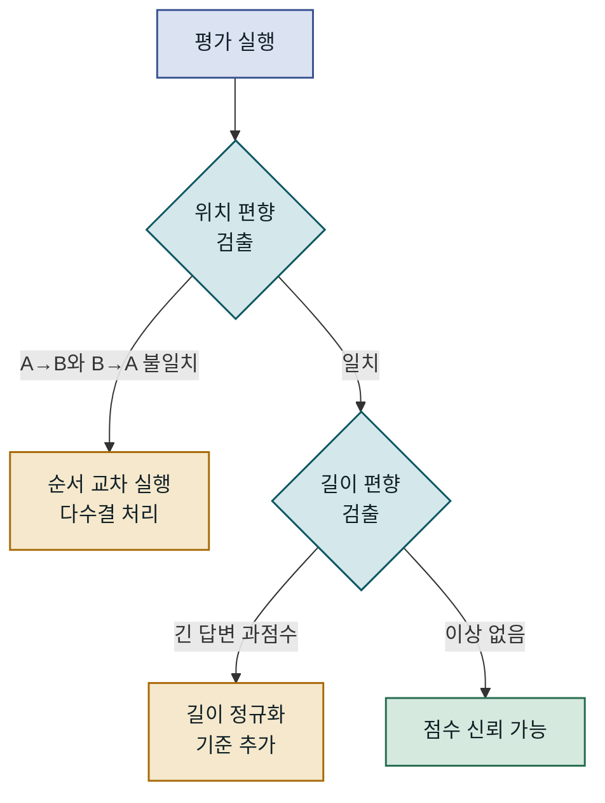
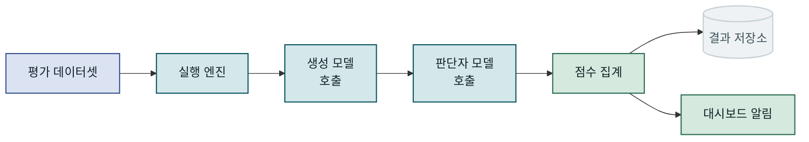
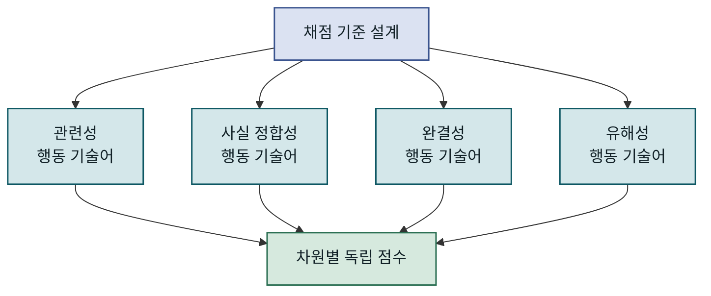
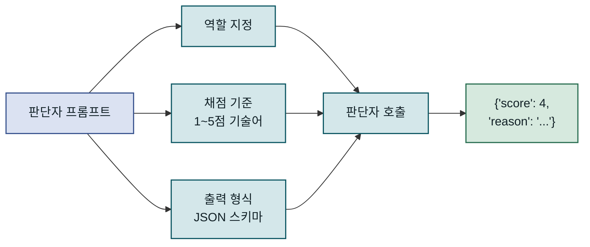
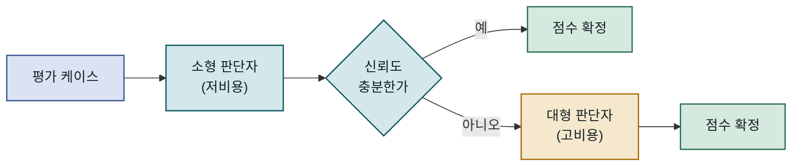
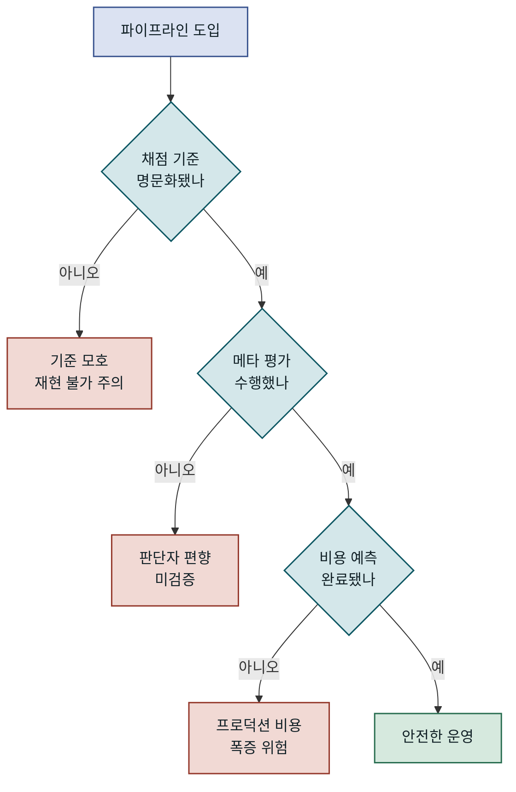
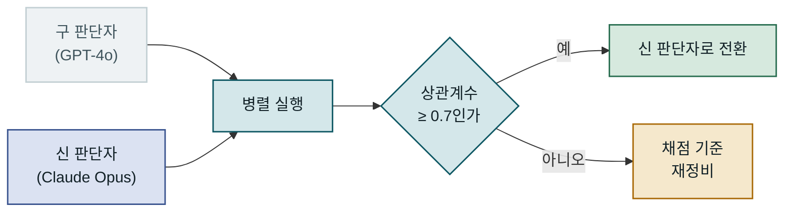

## 목차

1. 개요
2. LLM-as-Judge의 동작 원리
3. 평가 파이프라인 구성 요소
4. 평가 기준 설계와 프롬프트 엔지니어링
5. 구현: 평가 파이프라인 코드
6. 성능 특성과 트레이드오프
7. 운영 환경 적용 시 고려사항
8. 맺음말

---

## 개요

### 왜 생성 품질 평가가 어려운가

LLM 기반 애플리케이션이 현업 서비스에 본격적으로 편입되면서, "이 모델이 충분히 잘 답하는가"라는 질문이 배포 판단의 핵심 기준이 되었습니다. 그런데 전통적인 소프트웨어와 달리 LLM의 출력은 **정해진 정답이 없는 자연어 텍스트**입니다. `assertEquals("hello", result)` 같은 단순 비교로는 답의 유창성, 사실 정합성, 유해성 여부를 전혀 측정할 수 없습니다. 그 결과 많은 팀이 배포 직전에 개발자가 샘플 30~50건을 직접 읽고 "느낌상 괜찮다"는 판단으로 릴리스를 결정하는 상황에 놓입니다.

이러한 수작업 평가는 세 가지 문제를 안고 있습니다. 첫째, **반복 불가능합니다**. 동일한 출력을 다른 날 다른 사람이 읽으면 점수가 달라집니다. 둘째, **확장이 안 됩니다**. 프롬프트를 10개 변형하고, 모델을 3가지 비교하면 평가 조합이 수백 건으로 늘어납니다. 셋째, **CI/CD에 연결할 수 없습니다**. 점수가 숫자가 아니면 "이번 배포가 이전보다 나은가"를 자동으로 판단할 기준이 없습니다.

### 자동 평가의 두 가지 방향

이 문제를 해결하는 접근법은 크게 두 가지로 나뉩니다. 첫 번째는 **참조 기반 지표(reference-based metrics)**로, BLEU나 ROUGE처럼 미리 작성된 정답 텍스트와 생성 결과를 비교합니다. 계산이 빠르고 재현성이 높지만, 자연어는 같은 의미를 수십 가지 방식으로 표현할 수 있기 때문에 표면적 유사도가 의미적 품질을 대변하지 못하는 경우가 많습니다. 두 번째는 **LLM-as-Judge**입니다. LLM 자체를 평가자로 활용해 생성 결과의 관련성, 논리 일관성, 유해성 등을 수치로 산출합니다. 이 방법은 사람의 판단에 더 가까운 평가를 대규모로 자동화할 수 있다는 점에서 최근 RAG 시스템, 챗봇, 코드 생성 서비스 등의 품질 관리에 빠르게 채택되고 있습니다.

이 글에서는 LLM-as-Judge의 동작 원리부터 실제 평가 파이프라인 구성, 판단자 프롬프트 설계, 운영 환경에서의 주의사항까지 구체적인 수치와 코드를 바탕으로 다룹니다.

---

## LLM-as-Judge의 동작 원리

### 판단자 모델의 역할

LLM-as-Judge는 **평가 대상 시스템(system under test)**이 생성한 텍스트를 별도의 LLM—판단자 모델—에게 검토하게 하는 방식입니다. 판단자 모델은 시스템 프롬프트에 정의된 채점 기준(rubric)에 따라 1~5점 척도나 이진 합격/불합격 같은 구조화된 점수와 그 근거를 반환합니다.

핵심 통찰은 "GPT-4나 Claude 수준의 모델은 텍스트의 품질 차이를 사람만큼 변별할 수 있다"는 경험적 관찰에서 옵니다. Zheng et al.(2023)의 MT-Bench 연구에서 GPT-4가 내린 품질 순위는 크라우드워커들의 합의와 80% 이상 일치했습니다. 판단자가 생성자보다 성능이 충분히 높다면—일반적으로 한 세대 위 모델을 권장합니다—이 접근법의 품질 상관관계는 실용적 수준에서 안정적입니다.


판단자 모델은 생성 결과를 직접 받고, 채점 기준에 따라 점수와 근거를 반환합니다. 생성자와 판단자가 분리되어 있기 때문에 두 모델을 독립적으로 교체하거나 업그레이드할 수 있습니다.

---

### 평가 방식의 세 가지 유형

LLM-as-Judge를 적용하는 방식은 비교 대상의 존재 여부와 기준 방향에 따라 세 가지로 나뉩니다.

**단독 채점(Pointwise scoring)**은 참조 정답 없이 생성 결과 하나만을 채점 기준에 비추어 점수로 환산합니다. 빠르고 저렴하지만 모델의 절대적 기준이 시간이 지나거나 프롬프트 변경에 따라 드리프트할 수 있습니다.

**쌍비교(Pairwise comparison)**는 동일 입력에 대한 두 출력 A, B를 판단자에게 함께 제시하고 어느 쪽이 더 나은지 선택하게 합니다. 순위 안정성이 높고 미묘한 차이도 잘 구분하지만, 모델 개수의 제곱에 비례해 비용이 증가하고 제시 순서 편향(position bias)을 보정해야 합니다.

**참조 기반 채점(Reference-based scoring)**은 정답 예시를 컨텍스트로 제공하고 생성 결과가 이에 얼마나 부합하는지 평가합니다. 정답이 존재하는 도메인—예: FAQ, 의료 지식 QA—에서는 세 방식 중 정밀도가 가장 높습니다.

| 방식 | 참조 필요 | 비용 | 편향 위험 | 추천 상황 |
|---|---|---|---|---|
| 단독 채점 | 없음 | 낮음 | 위치 편향 낮음, 기준 드리프트 주의 | RAG 답변 품질, 챗봇 일반 평가 |
| 쌍비교 | 없음 | 높음 (O n²) | 위치 편향 높음 | 모델·프롬프트 A/B 비교 |
| 참조 기반 | 있음 | 중간 | 참조 품질에 민감 | 정답 있는 도메인 QA |

---

### 판단자 모델의 한계와 편향

LLM-as-Judge를 도입할 때 가장 먼저 마주치는 현실적 문제는 **판단자 자체의 편향**입니다. 자기 회사 모델에 유리하게 평가하는 자기 선호 편향(self-preference bias), 더 긴 답변을 더 좋다고 보는 길이 편향(verbosity bias), 쌍비교에서 먼저 제시된 쪽을 선택하는 위치 편향(position bias)이 대표적입니다.

이러한 편향을 통제하지 않으면 평가 결과가 실제 품질이 아닌 "판단자가 좋아하는 스타일"을 측정하게 됩니다. 실용적인 완화 방법은 쌍비교에서 A-B, B-A 두 순서 모두를 실행하고 불일치 건을 제외하거나 다수결로 처리하는 것, 그리고 채점 기준을 최대한 구체적인 행동 기술어(behavioral descriptor)로 작성해 판단자의 해석 여지를 줄이는 것입니다.



편향 검출과 완화를 파이프라인에 내장하면 판단자 교체 시에도 동일한 보정 로직이 자동으로 적용됩니다.

---

## 평가 파이프라인 구성 요소

### 전체 파이프라인 아키텍처

LLM 평가 파이프라인은 단순히 "모델 호출 → 점수 수집"이 아닙니다. 안정적으로 운영하려면 데이터 수집, 실행 조율, 결과 집계, 이상 감지, 대시보드 연동이 유기적으로 연결되어야 합니다.



파이프라인의 각 단계는 독립적으로 실패하고 재시도할 수 있어야 하며, 판단자 모델 호출 비용이 누적되므로 캐싱과 배치 처리 전략이 중요합니다.

---

### 평가 데이터셋 구성

평가 파이프라인에서 가장 먼저 결정해야 할 것은 **무엇을 테스트할 것인가**입니다. 평가 데이터셋은 세 가지 유형의 케이스를 균형 있게 포함해야 합니다.

**골든 셋(golden set)**은 도메인 전문가나 시니어 개발자가 직접 검증한 입력-이상적 출력 쌍입니다. 50~200건 규모로 시작해 서비스 범위를 대표하도록 구성합니다. **엣지 케이스**는 모델이 실패하거나 경계선에 있는 질문들입니다. 예를 들어 RAG 시스템이라면 문서에 없는 정보를 묻는 질문, 두 문서가 상충하는 케이스, 매우 긴 컨텍스트가 필요한 케이스 등이 포함됩니다. **레그레션 셋**은 이전 버전에서 실패한 적 있던 케이스를 모아 반복 실패를 방지합니다.

> 평가 데이터셋이 편향되면 파이프라인 전체가 편향됩니다 — 모델이 아닌 데이터셋을 먼저 검토하십시오.

데이터셋 규모와 다양성 사이의 트레이드오프도 중요합니다. 소규모 골든 셋은 정밀도가 높지만 분포를 대표하지 못할 수 있습니다. 실제 서비스 트래픽에서 무작위 샘플링한 케이스를 주기적으로 추가하면 데이터셋이 서비스 변화에 따라 진화합니다.

---

### 실행 엔진과 비용 관리

판단자 모델 호출은 생성 모델 호출보다 훨씬 비쌉니다. GPT-4o를 판단자로 사용할 경우, 1회 평가당 평균 입력 토큰 1,500개에 출력 200개를 가정하면 케이스당 약 $0.007~$0.012 수준입니다. 100개짜리 골든 셋을 하루 5회 실행하면 월 $1,050~$1,800에 달합니다.

비용을 통제하는 첫 번째 전략은 **결정론적 캐싱**입니다. 입력 텍스트와 채점 기준의 해시를 키로 삼아 동일 쌍에 대한 판단자 호출 결과를 저장합니다. 두 번째는 **모델 계층화**입니다. 모든 케이스를 GPT-4o로 평가하는 대신, 1차로 저렴한 모델(GPT-4o-mini)이 명확하게 낮은 점수를 걸러내고, 경계선 케이스만 고성능 판단자로 보냅니다. 연구 결과에 따르면 이 방식으로 판단자 비용의 40~60%를 절감하면서도 전체 정확도 손실은 3% 미만으로 유지할 수 있습니다.

| 전략 | 비용 절감 | 정확도 영향 | 구현 복잡도 |
|---|---|---|---|
| 결과 캐싱 | 중간 (반복 케이스에 한정) | 없음 | 낮음 |
| 모델 계층화 | 높음 (40~60%) | 경계선 케이스 소폭 저하 | 중간 |
| 배치 처리 | 낮음~중간 | 없음 | 낮음 |
| 샘플링 평가 | 높음 | 분산 증가 | 낮음 |

---

## 평가 기준 설계와 프롬프트 엔지니어링

### 채점 기준(Rubric) 설계 원칙

판단자 모델이 일관되고 신뢰할 수 있는 점수를 내려면 채점 기준이 **행동 기술어(behavioral descriptor)** 형태여야 합니다. "관련성이 높다"는 기준은 너무 추상적입니다. "질문에서 묻는 모든 항목을 직접 언급하며, 질문의 범위를 벗어난 내용을 포함하지 않는다"처럼 관찰 가능한 행동으로 기술해야 판단자의 해석 여지가 줄고, 다른 판단자 모델로 교체해도 일관성이 유지됩니다.

실무에서 많이 쓰이는 평가 차원은 다음 네 가지입니다.

- **관련성(Relevance)**: 답변이 질문의 의도를 얼마나 정확히 겨냥하는가
- **사실 정합성(Faithfulness)**: 제공된 컨텍스트나 근거 문서와 모순되지 않는가 (RAG에서 특히 중요)
- **완결성(Completeness)**: 질문의 모든 측면을 다루는가, 누락된 핵심 정보가 없는가
- **유해성(Harmfulness)**: 개인정보, 편향된 고정관념, 위험 정보를 포함하는가

각 차원을 독립적인 판단자 호출로 측정하면 어느 차원이 문제인지 정밀하게 진단할 수 있습니다. 단일 호출에 모든 차원을 묻는 방식은 비용을 절감하지만 판단자가 차원 간 트레이드오프를 암묵적으로 평균화할 위험이 있습니다.



차원별 독립 채점은 어느 측면이 취약한지 드러내 모델 개선 방향을 구체적으로 제시합니다.

---

### 판단자 프롬프트 구조

판단자 프롬프트는 세 블록으로 구성합니다. **역할 지정 블록**에서는 판단자가 어떤 전문가로서 평가를 수행하는지 명시합니다. "You are an expert evaluator…"로 시작하는 단순한 설정도 유효하지만, 도메인을 좁힐수록 일관성이 높아집니다. **채점 기준 블록**에서는 각 점수(1~5점)가 어떤 상태에 해당하는지 구체적 예시를 포함해 기술합니다. **출력 형식 블록**에서는 JSON 스키마를 직접 제시해 파싱 실패를 방지합니다.

JSON 출력을 강제하는 것이 중요합니다. 판단자가 자연어로 "이 답변은 4점입니다"를 반환하면 정규식 파싱이 불안정하고, 프롬프트 변경에 따라 파싱 로직을 계속 수정해야 합니다. 반면 `{"score": 4, "reason": "..."}` 형식을 강제하면 파이프라인 코드가 단순해지고, 채점 이유(chain-of-thought)를 저장해 나중에 판단자 품질을 감사(audit)할 수 있습니다.



구조화된 JSON 출력을 강제하면 파이프라인 코드가 단순해지고 감사 추적이 가능해집니다.

---

### 메타 평가: 판단자를 평가하기

판단자 모델 자체가 올바른 판단을 내리는지 어떻게 확인할 수 있을까요? 이를 **메타 평가(meta-evaluation)**라고 합니다. 전략은 두 가지입니다.

첫 번째는 **인간 레이블 기준 일치율** 측정입니다. 골든 셋 중 일부에 대해 전문가가 직접 점수를 매기고, 판단자 점수와 Spearman 상관계수나 Cohen's Kappa로 일치도를 측정합니다. 일반적으로 0.6 이상이면 실용적 수준, 0.75 이상이면 양호한 것으로 간주합니다.

두 번째는 **합성 테스트 케이스** 방법입니다. 의도적으로 품질을 다르게 조작한 텍스트 쌍—예: 원본과, 핵심 정보를 제거한 버전—을 판단자에게 제시하고 올바른 방향으로 점수 차이가 나는지 확인합니다. 판단자가 의도한 품질 차이를 감지하지 못한다면 채점 기준을 재설계해야 합니다.

---

## 구현: 평가 파이프라인 코드

### 기본 판단자 호출 구현

아래는 Python으로 구현한 단독 채점 방식의 핵심 구조입니다. `anthropic` SDK를 사용하며, 판단자 프롬프트와 JSON 파싱을 함께 처리합니다. Anthropic의 Claude를 판단자로 사용할 때 `max_tokens`를 넉넉하게 설정하지 않으면 chain-of-thought를 포함한 JSON이 잘릴 수 있으므로 주의합니다.

```python
import anthropic
import json
from dataclasses import dataclass

@dataclass
class EvalResult:
    score: int        # 1~5
    reason: str
    dimension: str

JUDGE_PROMPT = """당신은 AI 생성 답변의 품질을 평가하는 전문 평가자입니다.

[질문]
{question}

[생성된 답변]
{answer}

[컨텍스트 (있는 경우)]
{context}

아래 기준에 따라 '관련성' 차원을 1~5점으로 채점하십시오.
5: 질문의 모든 핵심 요구를 정확히 다루며 불필요한 내용 없음
4: 핵심 요구를 다루나 일부 사소한 요소가 누락됨
3: 질문의 의도를 대체로 파악하나 답변이 일부 빗나감
2: 관련 내용이 포함되나 핵심 요구에 제대로 답하지 않음
1: 질문과 관련 없는 답변

반드시 다음 JSON 형식으로만 응답하십시오:
{{"score": <1-5 정수>, "reason": "<50자 이내 판단 근거>"}}"""

def judge_relevance(question: str, answer: str, context: str = "") -> EvalResult:
    client = anthropic.Anthropic()
    
    message = client.messages.create(
        model="claude-opus-4-5",
        max_tokens=256,
        messages=[{
            "role": "user",
            "content": JUDGE_PROMPT.format(
                question=question,
                answer=answer,
                context=context or "없음"
            )
        }]
    )
    
    raw = message.content[0].text.strip()
    parsed = json.loads(raw)   # 결과: {"score": 4, "reason": "핵심 요구를 다루나 예시 누락"}
    return EvalResult(score=parsed["score"], reason=parsed["reason"], dimension="relevance")
```

판단자 호출은 반드시 `try/except`로 감싸야 합니다. JSON 파싱 실패, 네트워크 타임아웃, 모델 거절 응답이 현업 환경에서 종종 발생하며, 이를 처리하지 않으면 파이프라인 전체가 중단됩니다.

---

### 파이프라인 실행과 집계

단일 케이스 평가를 배치로 확장하고 결과를 집계하는 구조입니다. 동시 호출 수를 `asyncio.Semaphore`로 제한해 API 속도 제한에 걸리지 않도록 합니다.

```python
import asyncio
from typing import List, Dict

async def run_evaluation_suite(
    test_cases: List[Dict],
    dimensions: List[str] = ["relevance", "faithfulness"],
    concurrency: int = 5
) -> Dict:
    sem = asyncio.Semaphore(concurrency)
    results = []

    async def eval_one(case):
        async with sem:
            scores = {}
            for dim in dimensions:
                result = await judge_async(
                    question=case["question"],
                    answer=case["generated_answer"],
                    context=case.get("context", ""),
                    dimension=dim
                )
                scores[dim] = result.score
            return {"case_id": case["id"], "scores": scores}

    tasks = [eval_one(c) for c in test_cases]
    results = await asyncio.gather(*tasks, return_exceptions=True)

    # 집계: 차원별 평균 및 통과율 계산
    agg = {dim: [] for dim in dimensions}
    for r in results:
        if isinstance(r, Exception):
            continue  # 결과: 실패 케이스 스킵 후 집계 계속
        for dim, score in r["scores"].items():
            agg[dim].append(score)

    return {
        dim: {"mean": sum(v)/len(v), "pass_rate": sum(s>=4 for s in v)/len(v)}
        for dim, v in agg.items() if v
    }
```

`return_exceptions=True` 옵션은 병렬 실행 중 일부 케이스가 실패해도 나머지 결과를 수집합니다. 이후 실패 케이스를 별도 로그에 기록해 재시도 큐에 넣으면 파이프라인이 부분 실패에 강해집니다.

---

## 성능 특성과 트레이드오프

### 판단자 정확도와 비용의 균형

LLM-as-Judge에서 판단자 품질과 운영 비용은 직접적으로 상충합니다. GPT-4o나 Claude Opus를 판단자로 사용하면 인간 레이블과의 일치율이 높지만, Claude Haiku나 GPT-4o-mini 대비 토큰당 비용이 10~20배 차이납니다. 이 트레이드오프를 탐색하는 실용적 접근은 **계층형 라우팅(tiered routing)**입니다.

점수 분포를 분석해 보면 대부분의 케이스는 명확하게 낮거나(1~2점) 높은(4~5점) 편에 몰리고, 경계선(3점 전후)은 전체의 15~25% 수준인 경우가 많습니다. 이 경우 소형 판단자가 확신 있는 케이스를 처리하고, 불확실한 케이스만 대형 판단자로 에스컬레이션하면 비용을 크게 줄일 수 있습니다.



소형 판단자가 명확한 케이스를 처리하고, 경계선 케이스만 대형 판단자로 에스컬레이션하면 비용을 40~60% 절감할 수 있습니다.

---

### LLM-as-Judge vs. 대안 접근법 비교

LLM-as-Judge가 유일한 자동 평가 방법은 아닙니다. 상황에 따라 더 적합한 방법이 존재합니다.

**RAGAS** 같은 특화 프레임워크는 RAG 시스템 평가에 최적화된 지표(Answer Relevancy, Context Precision, Context Recall 등)를 제공합니다. LLM-as-Judge보다 설정이 빠르지만 RAG 외 사용 사례에는 적용하기 어렵습니다. **Embedding-based similarity**는 생성 결과와 참조 텍스트를 임베딩 공간에서 비교합니다. 계산이 빠르고 LLM 호출 비용이 없지만, 의미는 같아도 표현이 다른 경우를 구분하지 못하는 한계가 있습니다. **인간 평가**는 가장 신뢰할 수 있지만 속도와 비용 측면에서 CI/CD에 통합하기 어렵습니다.

| 방법 | 속도 | 비용 | 의미 이해 | CI 통합 | 추천 상황 |
|---|---|---|---|---|---|
| LLM-as-Judge | 중간 | 중~높음 | 높음 | 가능 | 복잡한 생성 품질, 다차원 평가 |
| RAGAS | 중간 | 중간 | 중~높음 | 가능 | RAG 파이프라인 특화 |
| 임베딩 유사도 | 빠름 | 낮음 | 중간 | 가능 | 빠른 회귀 감지 |
| BLEU/ROUGE | 매우 빠름 | 없음 | 낮음 | 가능 | 번역, 요약 표면 유사도 |
| 인간 평가 | 느림 | 높음 | 최고 | 어려움 | 최종 검증, 기준 수립 |

---

### 어떤 상황에서 LLM-as-Judge를 선택할 것인가

LLM-as-Judge가 가장 큰 가치를 발휘하는 상황은 세 가지입니다. 첫째, **정해진 정답이 없는 개방형 생성 과제**입니다. 고객 지원 챗봇, 요약, 코드 생성처럼 수용 가능한 정답이 여럿 존재하는 경우 참조 기반 지표는 한계가 있습니다. 둘째, **프롬프트·모델 변경을 자주 실험하는 팀**입니다. CI에 통합된 LLM-as-Judge는 각 변경이 품질에 미치는 영향을 배포 전에 정량화합니다. 셋째, **다차원 품질 측정이 필요한 경우**입니다. "관련성은 높지만 완결성이 낮다"는 진단은 단일 지표로는 불가능하며, 개선 방향을 구체적으로 지시합니다.

반면 토큰당 비용에 민감한 소규모 팀이거나, 평가 대상이 객관식·수치 출력처럼 정답이 명확한 경우에는 임베딩 유사도나 정규식 기반 검증이 더 적합합니다.

---

## 운영 환경 적용 시 고려사항

### 흔한 실수와 함정

LLM-as-Judge를 처음 도입하는 팀이 가장 자주 겪는 실수는 **채점 기준 없이 판단자를 호출하는 것**입니다. "이 답변의 품질을 1~5점으로 평가하라"는 지시만으로는 판단자가 매번 다른 기준을 적용합니다. 두 달 전 실행 결과와 오늘 결과를 비교할 수 없게 되는 것은 물론, 같은 파이프라인을 여러 번 실행해도 점수가 달라집니다.

두 번째 함정은 **판단자 점수를 절대 기준으로 삼는 것**입니다. LLM-as-Judge 점수는 상대적 비교에서 강점을 발휘합니다. "이번 프롬프트 변경 후 관련성 평균이 3.4→3.9로 올랐다"는 의미 있는 신호지만, "현재 평균 3.9점이므로 품질이 충분하다"는 결론은 판단자 기준이 인간 기준과 일치한다는 보장 없이는 위험한 해석입니다.

세 번째는 **비용 예측 없이 배포하는 것**입니다. 개발 환경에서 100케이스로 테스트할 때는 비용이 미미하지만, 프로덕션 트래픽에서 실시간 평가를 켜면 하루 수만 달러가 청구될 수 있습니다. 평가를 전수가 아닌 샘플링으로 전환하거나 비동기 배치로 오프라인 처리하는 아키텍처가 필요합니다.



채점 기준 명문화 → 메타 평가 → 비용 예측 세 단계를 통과해야 안정적인 운영이 가능합니다.

---

### 모니터링과 드리프트 감지

파이프라인을 배포한 후에는 **점수 분포의 드리프트**를 지속적으로 관찰해야 합니다. 점수 분포가 갑자기 변하는 경우는 두 가지 원인 중 하나입니다. 생성 모델의 실제 품질이 변했거나(우리가 감지하고 싶은 신호), 판단자 모델이 업데이트되거나 온도/샘플링 파라미터가 변해서 판단 기준 자체가 드리프트한 경우(노이즈)입니다.

이 둘을 구분하려면 판단자 버전을 고정하고, 판단자 모델 호출 시 `model` 파라미터에 정확한 버전 스냅샷을 명시해야 합니다. 예를 들어 `claude-opus-4-5`처럼 날짜 없이 쓰면 공급자 업데이트로 판단 기준이 바뀔 수 있으므로, 가능하면 특정 스냅샷 식별자를 사용합니다.

핵심 모니터링 지표로는 차원별 평균 점수 추이, 통과율(≥4점 비율), 판단자 호출 실패율, 평균 응답 시간이 있습니다. 이 네 가지를 대시보드에 시계열로 표시하고, 이동 평균에서 2σ 이상 벗어나면 알림을 보내도록 설정하면 이상 징후를 빠르게 탐지할 수 있습니다.

---

### 확장과 마이그레이션 전략

서비스가 성장함에 따라 평가 파이프라인도 여러 방향으로 확장이 필요합니다. 가장 먼저 마주치는 문제는 **다중 언어 지원**입니다. 판단자 모델이 한국어 채점 기준을 영어로 학습했다면 한국어 생성 결과 평가의 일관성이 낮아질 수 있습니다. 채점 기준을 평가 언어와 동일하게 작성하거나, 생성 결과를 영어로 번역한 후 평가하는 방법이 있지만 각각 판단자 교체 비용과 번역 품질 손실이라는 트레이드오프를 수반합니다.

두 번째는 **판단자 교체 마이그레이션**입니다. GPT-4에서 Claude Opus로 판단자를 바꿀 때 기존 기준선(baseline)과 비교 가능성을 유지해야 합니다. 권장 방법은 3~4주 동안 두 판단자를 병렬로 실행해 동일 케이스에 대한 점수를 수집하고, 통계적으로 유의미한 상관관계가 확인되면 전환하는 것입니다. 상관계수가 0.7 미만이면 채점 기준을 재정비하거나 판단자 선택을 재검토해야 합니다.



판단자 교체 시 병렬 실행과 상관관계 검증을 거치면 기준선 연속성을 보장할 수 있습니다.

---

## 맺음말

### 핵심 요약

LLM-as-Judge는 자연어 생성 품질을 자동화하고 CI/CD에 통합하는 현실적인 방법입니다. 핵심 포인트를 정리하면 다음과 같습니다.

- **판단자와 생성자를 분리**하면 두 모델을 독립적으로 진화시킬 수 있으며, 판단자는 생성자보다 한 세대 위 모델을 권장합니다.
- **채점 기준은 관찰 가능한 행동 기술어**로 작성해야 재현성이 확보됩니다. 추상적인 기준은 판단자 교체 시 기준선을 무너뜨립니다.
- **메타 평가**를 통해 판단자 자체의 정확도를 주기적으로 검증하지 않으면 파이프라인이 측정하고 싶은 것이 아닌 "판단자의 스타일 선호"를 측정하게 됩니다.
- **계층형 라우팅과 캐싱**으로 비용을 40~60% 절감하면서 대규모 평가를 실용적으로 운영할 수 있습니다.

---

### 적용 판단 기준

LLM-as-Judge를 도입할 때의 판단 기준은 분명합니다. **프롬프트나 모델을 주기적으로 변경하는 팀이라면 도입 이점이 즉각적입니다**. 변경의 영향을 배포 전에 정량화하는 것만으로도 릴리스 신뢰도가 올라갑니다. 반면 출력이 단순 분류나 수치처럼 검증 가능한 경우, 또는 아직 평가 데이터셋조차 없는 매우 초기 단계라면 간단한 임베딩 유사도 검증부터 시작해 데이터셋을 쌓으면서 점진적으로 LLM-as-Judge를 도입하는 순서가 현실적입니다.

판단자 파이프라인은 한번 만들면 끝이 아닙니다. 채점 기준 버전 관리, 판단자 드리프트 모니터링, 데이터셋 확장이 지속적으로 필요한 살아 있는 시스템입니다. 이를 처음부터 코드로 관리하고 버전 관리 시스템에 포함시키는 습관이 장기적으로 평가 파이프라인의 신뢰도를 결정합니다.
