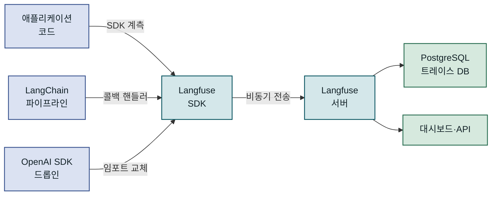
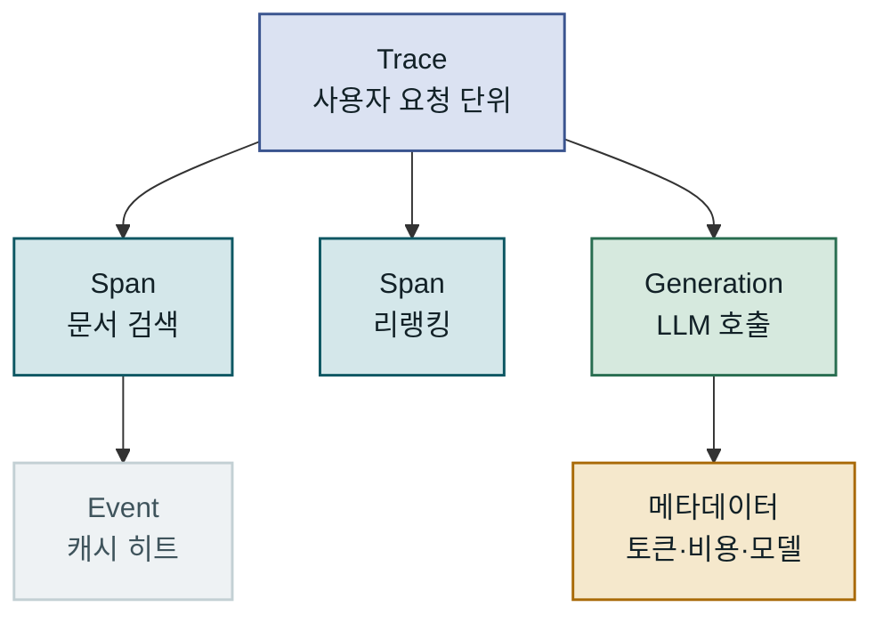
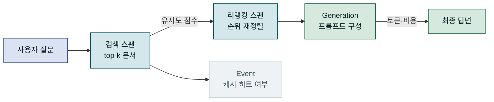
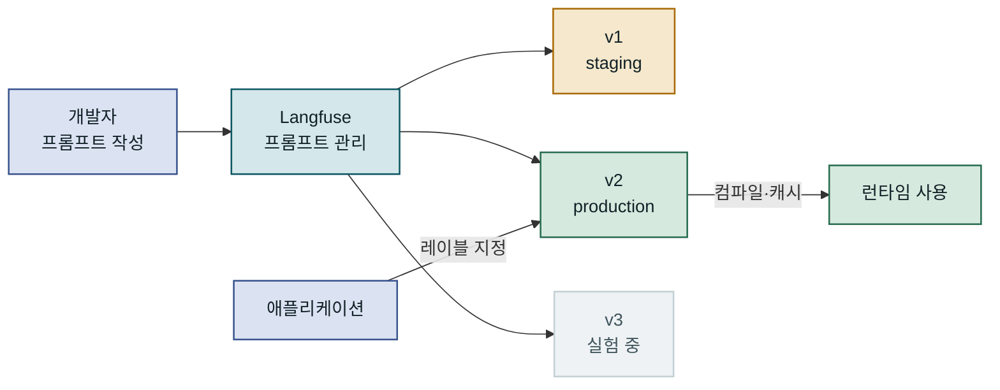
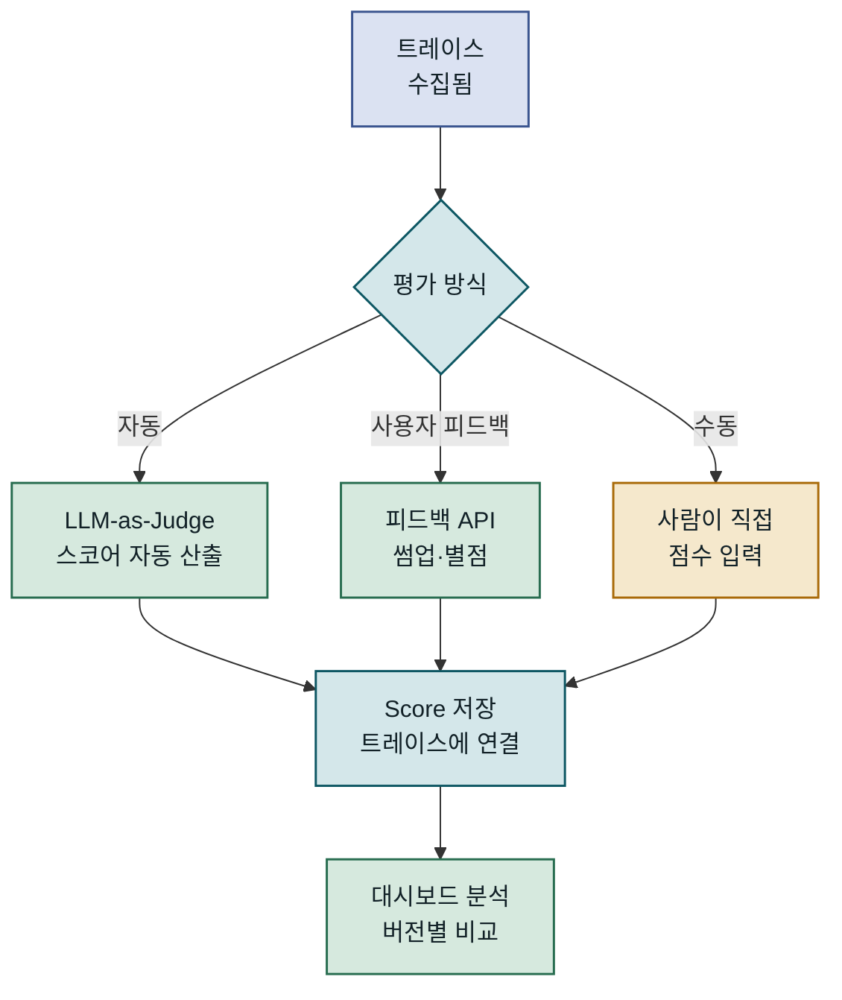
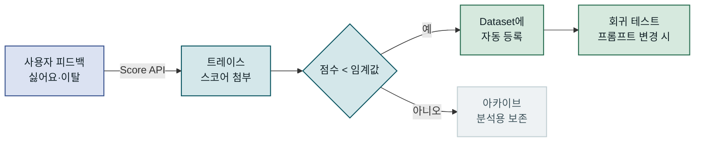
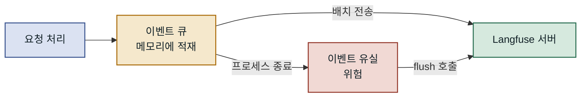
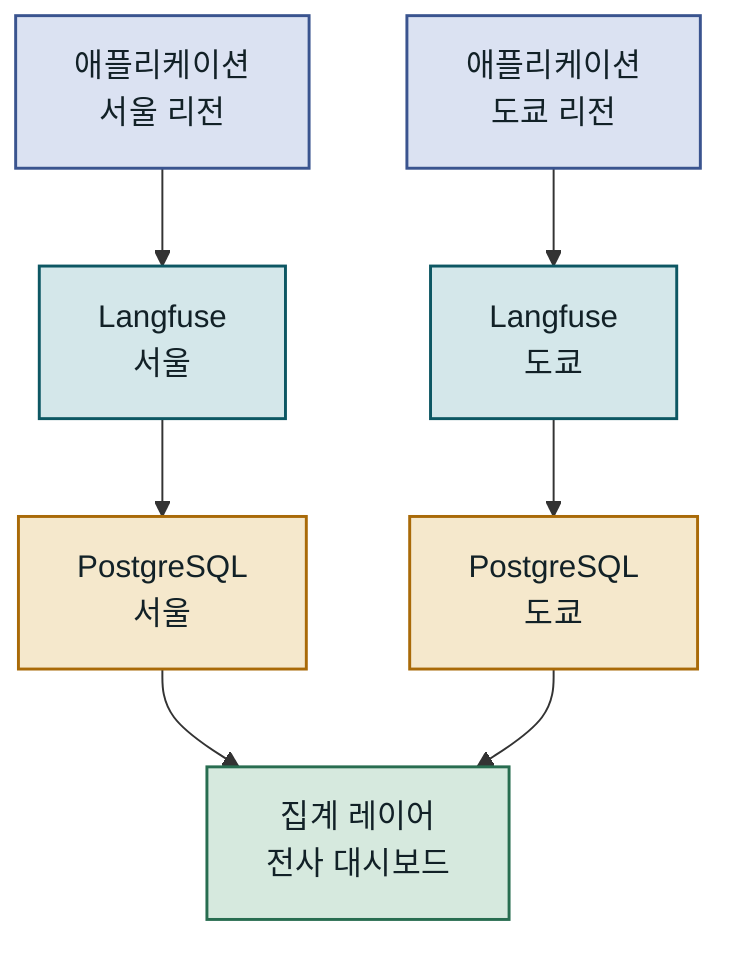

## 목차

1. 개요
2. Langfuse 아키텍처와 핵심 개념
3. 트레이싱 구현 — 요청 흐름을 눈으로 보다
4. 프롬프트 버전 관리 — 실험과 배포를 분리하다
5. 평가 자동화 — 품질을 지속적으로 측정하다
6. 운영 환경 적용 시 고려사항
7. 맺음말

---

## 개요

### 문제 배경: LLM 애플리케이션은 왜 관찰하기 어려운가

LLM을 프로덕션에 배포하고 나면, 기존 소프트웨어 시스템과는 전혀 다른 종류의 불확실성과 마주하게 됩니다. 사용자가 "응답이 이상해요"라고 신고했을 때, 어떤 프롬프트가 전송됐는지, 모델이 어떤 토큰을 소비했는지, 체인 중 어느 단계에서 의도가 왜곡됐는지를 재현하는 일이 거의 불가능에 가깝습니다. HTTP 로그에는 JSON 페이로드가 남지만, 그 안에서 무엇이 결정적이었는지는 드러나지 않습니다. **Langfuse**는 이 간극을 메우기 위해 설계된 오픈소스 LLM 옵저버빌리티(observability) 플랫폼입니다. 트레이싱, 프롬프트 버전 관리, 평가 자동화를 하나의 플랫폼에서 제공하며, RAG 파이프라인부터 에이전트 루프까지 LLM 관련 모든 호출을 구조화된 방식으로 기록합니다.

### 기존 방식의 한계: 로그만으로는 부족하다

전통적인 APM(Application Performance Monitoring) 도구는 레이턴시나 에러율 같은 숫자형 지표를 잘 다루지만, LLM 호출의 품질을 수치화하지 못합니다. 단순 로깅 방식에서는 프롬프트와 응답을 저장할 수 있지만, 여러 단계로 이루어진 체인에서 개별 스텝 간의 인과 관계가 소실됩니다. 특히 RAG 파이프라인처럼 검색 → 리랭킹 → 생성이 연속으로 이어지는 구조에서는, 최종 응답이 부정확했을 때 검색 단계의 문제인지 프롬프트 구성의 문제인지 구분할 수 없습니다. **프롬프트를 코드에 하드코딩**하면 버전 관리도 어렵고 A/B 테스트도 불가능합니다. Langfuse는 이 세 가지 결핍을 트레이싱·프롬프트 관리·평가라는 세 축으로 동시에 해결합니다.

---

## Langfuse 아키텍처와 핵심 개념

### 플랫폼 구성과 데이터 흐름

Langfuse는 크게 세 가지 경로로 데이터를 수집합니다. 첫째, SDK를 통한 직접 계측(instrumentation)입니다. Python·TypeScript SDK를 애플리케이션 코드에 삽입하면, 각 LLM 호출마다 트레이스(trace)가 자동으로 생성됩니다. 둘째, LangChain·LlamaIndex·Haystack 같은 프레임워크 통합입니다. 콜백 핸들러 하나만 등록하면 별도의 계측 코드 없이 파이프라인 전체가 기록됩니다. 셋째, OpenAI SDK 드롭인 교체 방식입니다. `from langfuse.openai import openai`처럼 임포트만 바꾸면 기존 코드 수정 없이 모든 호출이 추적됩니다. 수집된 데이터는 Langfuse 서버(클라우드 또는 자체 호스팅 PostgreSQL 기반)에 비동기로 전송되며, 대시보드에서 실시간에 가까운 분석이 가능합니다.



세 가지 계측 경로 모두 동일한 Langfuse 서버로 수렴하며, 수집 방식이 달라도 대시보드에서 통합 조회됩니다.

### 트레이스·스팬·이벤트 계층 구조

Langfuse의 데이터 모델은 계층적입니다. 최상위 단위는 **트레이스(Trace)**로, 사용자의 단일 요청에 해당합니다. 트레이스 안에는 **스팬(Span)**이 중첩될 수 있으며, 각 스팬은 하나의 논리적 작업(검색, LLM 호출, 후처리 등)을 나타냅니다. 스팬 중 LLM 호출에 특화된 것이 **제너레이션(Generation)**으로, 프롬프트·응답·모델명·토큰 수·비용 같은 LLM 특화 메타데이터를 별도 필드로 저장합니다. 마지막으로 **이벤트(Event)**는 타임스탬프만 가진 점 단위 기록으로, 캐시 히트나 특정 조건 충족 같은 순간적 상태를 남길 때 씁니다. 이 네 계층을 올바르게 활용하면, 복잡한 에이전트 루프의 실행 경로를 트리 형태로 완전히 재현할 수 있습니다.



트레이스가 루트이고, 그 아래로 스팬·제너레이션·이벤트가 중첩되는 트리 구조입니다.

### 자체 호스팅 vs 클라우드 선택

Langfuse는 MIT 라이선스 오픈소스로 자체 호스팅이 가능하며, 클라우드 버전(langfuse.com)도 제공합니다. 자체 호스팅은 Docker Compose 한 줄로 시작할 수 있고, 데이터가 외부로 나가지 않아 금융·의료 등 규제 산업에서 선호됩니다. 클라우드는 인프라 관리 부담이 없고 무료 티어(5만 관측 이벤트/월)가 넉넉한 편입니다. 다만 자체 호스팅 시 PostgreSQL 용량 계획과 백업 전략이 필요하며, 트레이스 데이터는 누적 속도가 생각보다 빠릅니다. 실제 프로젝트에서는 개발·스테이징은 클라우드, 프로덕션은 자체 호스팅으로 분리하는 방식이 유용합니다.

| 항목 | 클라우드 | 자체 호스팅 |
|---|---|---|
| 초기 설정 | 회원가입만 | Docker Compose 필요 |
| 데이터 주권 | Langfuse 서버 | 완전 자체 보유 |
| 유지보수 부담 | 없음 | PostgreSQL·버전 업그레이드 |
| 무료 범위 | 5만 이벤트/월 | 무제한 (서버 비용만) |
| 언제 선택 | 프로토타입·스타트업 | 규제 산업·대용량 |

---

## 트레이싱 구현 — 요청 흐름을 눈으로 보다

### SDK 설치와 기본 계측

Langfuse Python SDK를 설치하고 환경변수를 설정하는 것만으로 기본 계측이 시작됩니다. 핵심은 `LANGFUSE_PUBLIC_KEY`, `LANGFUSE_SECRET_KEY`, `LANGFUSE_HOST` 세 환경변수입니다. 가장 간단한 방법은 OpenAI SDK 드롭인 교체 방식으로, 기존 코드를 거의 건드리지 않고도 모든 LLM 호출을 추적할 수 있습니다. 아래 예시는 FastAPI 기반의 Q&A 엔드포인트에 Langfuse 계측을 적용하는 전형적인 패턴입니다. `observe` 데코레이터 하나로 함수 전체가 스팬으로 래핑되며, 중첩 호출은 자동으로 부모-자식 관계로 연결됩니다.

```python
from langfuse.decorators import langfuse_context, observe
from langfuse.openai import openai  # 드롭인 교체

@observe()  # 트레이스 루트 자동 생성
async def answer_question(user_id: str, question: str) -> str:
    # 트레이스에 메타데이터 추가
    langfuse_context.update_current_trace(
        user_id=user_id,
        tags=["qa", "production"],
        metadata={"question_length": len(question)},
    )

    docs = await retrieve_documents(question)  # 중첩 스팬 자동 생성
    answer = await generate_answer(question, docs)
    return answer

@observe(name="retrieve_documents")
async def retrieve_documents(query: str) -> list[str]:
    # 검색 로직 — 이 스팬은 answer_question의 자식
    results = vector_store.similarity_search(query, k=5)
    langfuse_context.update_current_observation(
        output={"doc_count": len(results)}
    )
    return [r.page_content for r in results]

@observe(name="generate_answer")
async def generate_answer(question: str, docs: list[str]) -> str:
    context = "\n".join(docs)
    response = openai.chat.completions.create(  # 자동으로 Generation 기록
        model="gpt-4o-mini",
        messages=[
            {"role": "system", "content": "Answer based on context."},
            {"role": "user", "content": f"Context:\n{context}\n\nQuestion: {question}"},
        ],
    )
    return response.choices[0].message.content
    # Langfuse 대시보드에서 확인 가능한 것:
    # - 전체 트레이스 레이턴시
    # - 각 스팬별 소요 시간
    # - 토큰 사용량과 예상 비용
    # - 프롬프트·응답 원문
```

`@observe()` 데코레이터를 중첩하면 호출 트리가 그대로 트레이스 계층으로 변환됩니다. 별도의 컨텍스트 관리 코드를 작성하지 않아도 됩니다.

### RAG 파이프라인 전체 계측

단순 LLM 호출과 달리 RAG 파이프라인에서는 검색 품질이 최종 응답에 결정적인 영향을 미칩니다. Langfuse 스팬에 검색 결과 개수, 유사도 점수, 리랭킹 후 순위 변화 같은 메타데이터를 함께 기록해 두면, 나중에 "왜 이 질문에 엉뚱한 답이 나왔나"를 분석할 때 검색 단계부터 추적할 수 있습니다. `langfuse_context.update_current_observation`을 스팬 안에서 호출하면 임의 딕셔너리를 해당 스팬에 첨부할 수 있으며, 이 데이터는 대시보드의 스팬 상세 화면과 API를 통한 분석 쿼리 모두에서 접근 가능합니다.



각 단계가 독립적인 스팬으로 기록되어, 이후 단계별 레이턴시와 품질 지표를 비교 분석할 수 있습니다.

### 세션과 사용자 연결

트레이스를 개별 호출 단위로만 보면 맥락이 단절됩니다. 멀티턴 대화 애플리케이션에서는 `session_id`를 공통 키로 설정해 여러 트레이스를 하나의 대화로 묶을 수 있습니다. `langfuse_context.update_current_trace(session_id="conv_abc123", user_id="user_456")`처럼 선언하면, 대시보드에서 특정 사용자의 전체 대화 세션을 시간순으로 조회하거나, 세션별 평균 토큰 사용량을 집계할 수 있습니다. 이 기능은 구독 플랜별 비용 할당이나 사용자별 이상 감지(비정상적으로 긴 프롬프트를 반복 전송하는 케이스 탐지 등)에도 활용됩니다.

> 트레이스는 단독으로도 유용하지만, `session_id`와 `user_id`를 일관되게 붙여야 세션 분석과 비용 귀속이 가능합니다. 초기에 설계하지 않으면 나중에 소급 적용이 어렵습니다.

---

## 프롬프트 버전 관리 — 실험과 배포를 분리하다

### 코드에서 프롬프트를 분리해야 하는 이유

프롬프트를 소스 코드 안에 문자열로 하드코딩하는 방식은 규모가 작을 때는 단순하지만, 이내 여러 문제로 이어집니다. 프롬프트를 수정하려면 코드 배포가 필요하고, 여러 버전의 프롬프트를 동시에 실험하기 위해서는 피처 플래그 시스템과 연동해야 합니다. 효과적이었던 이전 프롬프트로 롤백하려면 git 이력을 뒤지거나 배포를 되돌려야 합니다. Langfuse 프롬프트 관리는 이 문제를 **프롬프트를 독립적인 아티팩트로 버전 관리**하는 방식으로 해결합니다. 각 프롬프트는 이름·레이블·변수 목록을 가지며, `production` 레이블이 붙은 버전이 런타임에 자동으로 선택됩니다. 실험 버전은 `staging` 레이블로 분리 운영하다가, 검증이 끝나면 레이블만 바꿔 즉시 반영할 수 있습니다. 코드 배포와 프롬프트 배포가 완전히 분리됩니다.



레이블(`production`, `staging`)만 바꾸면 코드 배포 없이 프롬프트 전환이 이루어집니다.

### 프롬프트 컴파일과 트레이싱 연동

Langfuse 프롬프트는 `{{변수명}}` 형식의 머스태시 템플릿을 지원합니다. 런타임에 변수를 주입해 최종 프롬프트를 컴파일하면, 어떤 버전의 어떤 변수가 특정 응답을 만들었는지를 트레이스에 자동으로 연결할 수 있습니다. `openai.chat.completions.create`에 `langfuse_prompt` 파라미터를 전달하면, 해당 제너레이션 스팬에 프롬프트 버전 정보가 자동으로 태깅됩니다. 이 연결이 없으면 "v2 프롬프트 적용 이후 평균 응답 길이가 증가했는가"를 묻는 분석 쿼리를 작성하기가 까다롭습니다. 반대로 연결이 되어 있으면, Langfuse 대시보드에서 버전별 토큰 사용량, 레이턴시, 사용자 평점 분포를 바로 비교할 수 있습니다.

```python
from langfuse import Langfuse

langfuse = Langfuse()

# 프롬프트 관리 서버에서 최신 production 버전을 가져옴 (로컬 캐시됨)
prompt = langfuse.get_prompt("qa-system-prompt", label="production")

# 변수 주입으로 컴파일
compiled_messages = prompt.compile(
    language="Korean",
    domain="finance",
)
# compiled_messages 예시:
# [{"role": "system", "content": "당신은 금융 전문 Q&A 도우미입니다. 한국어로 답변하세요."}]

response = openai.chat.completions.create(
    model="gpt-4o-mini",
    messages=compiled_messages + [{"role": "user", "content": user_question}],
    langfuse_prompt=prompt,  # 트레이스에 v3(production) 자동 연결
)
```

`get_prompt`는 기본 600초 TTL 캐시를 사용해 매 요청마다 서버 왕복 비용이 발생하지 않습니다.

### A/B 테스트와 버전 롤백

프롬프트 관리의 진가는 실험 설계에서 드러납니다. 같은 프롬프트의 두 버전에 각각 `v4-experiment`와 `production` 레이블을 붙이고, 애플리케이션 레벨에서 트래픽을 분기하면 A/B 테스트가 가능합니다. Langfuse 대시보드에서는 `prompt_version` 기준으로 필터링해 두 그룹의 품질 점수나 사용자 피드백을 나란히 볼 수 있습니다. 문제가 발생했을 때는 대시보드에서 이전 버전에 `production` 레이블을 재지정하는 것만으로 즉시 롤백됩니다. 애플리케이션 재배포 없이, 심지어 엔지니어 없이도 프로덕트 매니저가 직접 롤백을 실행할 수 있다는 점이 현업에서 중요하게 작용합니다.

| 시나리오 | 기존 하드코딩 방식 | Langfuse 프롬프트 관리 |
|---|---|---|
| 프롬프트 수정 | 코드 변경·배포 필요 | 대시보드에서 즉시 |
| A/B 테스트 | 피처 플래그·복잡한 분기 | 레이블 분리로 단순화 |
| 롤백 | 코드 배포 되돌리기 | 레이블 재지정, 수초 내 |
| 버전 이력 | git blame 추적 | 대시보드 타임라인 |
| 비용 귀속 | 버전 식별 불가 | 버전별 토큰 비용 집계 |

---

## 평가 자동화 — 품질을 지속적으로 측정하다

### 수동 평가의 한계와 자동화 필요성

LLM 응답의 품질을 검증하는 가장 신뢰할 수 있는 방법은 사람이 직접 읽고 평가하는 것입니다. 하지만 하루 수만 건의 요청이 발생하는 프로덕션 환경에서는 샘플링조차 버겁습니다. 더 큰 문제는 품질 저하가 점진적으로 일어날 때입니다. 프롬프트 수정, 모델 버전 업그레이드, 검색 인덱스 변경이 복합적으로 작용해 응답 품질이 서서히 나빠지는 현상은 단일 이상 이벤트처럼 알림으로 잡기 어렵습니다. Langfuse의 평가(Evaluation) 기능은 이 문제를 두 가지 방식으로 다룹니다. 첫째, LLM-as-a-Judge 패턴으로 자동 평가 스크립트를 작성해 트레이스에 점수를 붙입니다. 둘째, 사용자 피드백 API를 통해 수집된 명시적·묵시적 신호를 점수로 변환해 트레이스와 연결합니다. 두 방식을 조합하면, 수동 검토가 필요한 케이스를 점수 기준으로 자동 필터링할 수 있어 인력을 최고 불확실성 케이스에 집중할 수 있습니다.



자동·수동·피드백 평가가 모두 동일한 스코어 필드로 수렴해, 대시보드에서 통합 집계됩니다.

### LLM-as-a-Judge로 자동 채점 구현

LLM-as-a-Judge는 또 다른 LLM이 원래 응답의 품질을 평가하는 패턴입니다. Langfuse는 자체적으로 평가 파이프라인을 실행하는 기능을 제공하며, Python 스크립트나 GitHub Actions에서 주기적으로 호출하는 방식으로 운영합니다. 아래는 RAG 파이프라인에서 **충실도(faithfulness)** — 응답이 검색된 문서 내용에 근거하는가 — 를 자동 채점하는 예시입니다. 채점 결과는 `langfuse.score()` 호출로 해당 트레이스에 즉시 첨부됩니다.

```python
from langfuse import Langfuse
from langfuse.openai import openai

langfuse = Langfuse()

def evaluate_faithfulness(trace_id: str, answer: str, context: str) -> float:
    """검색 문서 기반 충실도를 0~1 점수로 자동 채점합니다."""
    eval_prompt = f"""
    Given the following context and answer, rate the faithfulness of the answer
    on a scale of 0 to 1. Only output a number.
    
    Context: {context}
    Answer: {answer}
    """
    response = openai.chat.completions.create(
        model="gpt-4o-mini",
        messages=[{"role": "user", "content": eval_prompt}],
    )
    score = float(response.choices[0].message.content.strip())

    # 점수를 원래 트레이스에 연결
    langfuse.score(
        trace_id=trace_id,
        name="faithfulness",
        value=score,
        comment=f"Auto-evaluated. Score: {score:.2f}",
    )
    return score
    # 대시보드에서 확인 가능한 결과:
    # - 트레이스 상세 화면에 faithfulness: 0.87 표시
    # - 버전별/기간별 평균 faithfulness 트렌드 그래프
```

점수명(`faithfulness`, `relevance`, `toxicity` 등)을 일관성 있게 정의해 두면, 여러 평가 스크립트의 결과를 대시보드에서 비교 분석하거나 임계값 미달 시 알림을 설정할 수 있습니다.

### 사용자 피드백 연동과 데이터셋 구축

자동 평가로 잡기 어려운 신호는 사용자의 직접 반응입니다. 좋아요/싫어요 버튼, 응답 재생성 요청, 대화 이탈 같은 행동 신호를 Langfuse 스코어로 변환하면 LLM-as-a-Judge와 함께 멀티 신호 품질 지표를 구성할 수 있습니다. 더 나아가 평가 결과가 나쁜 트레이스를 선별해 **데이터셋(Dataset)**에 추가하면, 회귀 테스트 시나리오가 자연스럽게 누적됩니다. Langfuse의 Dataset API를 이용하면 특정 조건(충실도 점수 0.5 이하 등)의 트레이스를 쿼리해 데이터셋 아이템으로 자동 등록하는 스크립트를 만들 수 있으며, 이 데이터셋은 이후 프롬프트 변경이나 모델 교체 시 회귀 평가의 기준선으로 활용됩니다.



저품질 트레이스가 자동으로 회귀 테스트 데이터셋에 쌓여, 프롬프트 실험 전후 품질 비교의 기준이 됩니다.

---

## 운영 환경 적용 시 고려사항

### 흔한 실수와 성능 함정

Langfuse SDK는 기본적으로 비동기 배치 전송을 사용하지만, 프로세스가 갑자기 종료되면 큐에 쌓인 이벤트가 유실될 수 있습니다. AWS Lambda나 Google Cloud Run처럼 요청 처리 후 프로세스가 즉시 내려가는 환경에서는 `langfuse.flush()`를 명시적으로 호출해 모든 이벤트가 서버로 전송됐음을 보장해야 합니다. 또 다른 흔한 실수는 **민감 정보를 트레이스에 그대로 남기는 것**입니다. 프롬프트에 사용자 개인정보나 내부 문서 내용이 포함되는 경우, Langfuse 서버(자체 호스팅이라도 접근 권한을 가진 팀원이 볼 수 있습니다)에 저장되는 내용을 마스킹하거나 별도 필드로 분리하는 정책이 필요합니다. SDK 레벨에서는 `mask` 콜백을 등록해 특정 패턴(전화번호, 이메일, 계좌번호 등)을 자동 대체할 수 있습니다.



서버리스 환경에서 `flush()` 없이 프로세스가 종료되면 이벤트가 유실됩니다.

### 모니터링과 비용 관리

Langfuse 대시보드의 비용 트래킹 기능은 모델별·사용자별·프롬프트 버전별로 LLM API 비용을 집계합니다. 이 데이터를 활용하면 "어떤 종류의 질문이 가장 많은 토큰을 소비하는가"를 파악해 프롬프트 압축 또는 모델 다운그레이딩 대상을 식별할 수 있습니다. 레이턴시 관점에서는 P95·P99 백분위수 추이를 보는 것이 평균보다 유효합니다. 특히 멀티스텝 파이프라인에서는 평균 레이턴시가 낮더라도 특정 케이스(긴 문서 검색, 멀티홉 추론)에서 P99가 급증하는 현상이 빈번합니다. 이런 케이스를 조기에 잡으려면 스팬별 레이턴시 분포를 주기적으로 확인하고, 임계값 초과 시 Slack·PagerDuty 같은 채널로 알림을 연동하는 것이 효과적입니다.

| 지표 | 확인 주기 | 행동 기준 |
|---|---|---|
| 평균 LLM 비용/요청 | 일간 | 전주 대비 20% 이상 증가 시 조사 |
| P95 레이턴시 | 실시간·알림 | SLO 초과 시 즉시 알림 |
| faithfulness 평균 | 주간 | 0.05 이상 하락 시 프롬프트 검토 |
| 에러율 (LLM 호출) | 실시간·알림 | 5% 초과 시 알림 |
| 토큰 할당량 소진율 | 주간 | 70% 이상 시 용량 계획 검토 |

### 확장성과 마이그레이션 전략

자체 호스팅 Langfuse의 경우 트레이스 데이터가 하루 수십 GB에 달할 수 있습니다. PostgreSQL 단일 인스턴스로 시작했다가 파티셔닝이나 ClickHouse 전환이 필요한 시점이 오면 마이그레이션 비용이 큽니다. 초기부터 **데이터 보존 정책**을 명확히 정의하고(예: 90일 이후 트레이스 자동 삭제 또는 S3 아카이빙), PostgreSQL 자동 파티셔닝(`pg_partman`)을 설정해 두는 것이 장기적으로 유리합니다. 멀티 지역 배포에서는 각 지역에 Langfuse 서버를 배치하고 데이터를 지역별로 격리하는 방식이 레이턴시와 규정 준수 모두에 유리합니다. 다만 이 경우 대시보드에서 전체 트래픽을 통합 조회하려면 별도의 집계 레이어가 필요합니다.



지역별 격리로 규정 준수 요건을 충족하면서, 집계 레이어로 전사 통합 뷰를 유지합니다.

---

## 맺음말

### 핵심 요약

Langfuse는 트레이싱·프롬프트 관리·평가 세 기능을 하나의 플랫폼에서 제공하는 오픈소스 LLM 옵저버빌리티 도구입니다. `@observe()` 데코레이터와 OpenAI 드롭인 교체만으로 최소한의 코드 변경으로 전체 파이프라인을 계측할 수 있으며, 프롬프트를 코드에서 분리해 레이블 기반으로 즉시 배포·롤백이 가능합니다. LLM-as-a-Judge 패턴과 사용자 피드백 API를 조합하면 자동 품질 모니터링 체계를 구성할 수 있고, 누적된 저품질 트레이스를 데이터셋으로 전환해 회귀 평가에 활용하는 흐름까지 하나의 생태계 안에서 완결됩니다.

### 적용 판단 기준

Langfuse 도입을 진지하게 검토해야 하는 시점은 다음 세 가지 중 하나에 해당할 때입니다. **첫째**, LLM 호출이 단일 단계를 넘어 체인이나 에이전트 형태로 발전했을 때입니다. 단순 호출 하나라면 기본 로깅으로도 충분하지만, 두 단계 이상이 연결되는 순간 인과 추적의 필요성이 생깁니다. **둘째**, 프롬프트 실험을 코드 배포와 분리하고 싶을 때입니다. 팀에 비개발자 기여자(프로덕트 매니저, 도메인 전문가)가 프롬프트 개선에 참여한다면 더욱 효과적입니다. **셋째**, 품질 저하를 선제적으로 탐지해야 하는 프로덕션 서비스가 있을 때입니다. 수동 검토만으로는 점진적 품질 저하를 놓치기 쉬우며, 자동 평가 지표가 조기 경보 역할을 합니다. 반대로, 프로토타입 단계이거나 LLM 호출이 하루 수백 건 이하라면 도입 비용 대비 효용이 낮습니다. 그 경우에는 Langfuse 클라우드의 무료 티어로 가볍게 시작해 계측 경험을 쌓은 뒤, 규모가 커지면 자체 호스팅으로 전환하는 단계적 접근이 현실적입니다.
