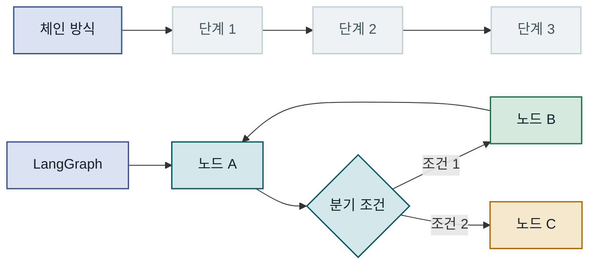
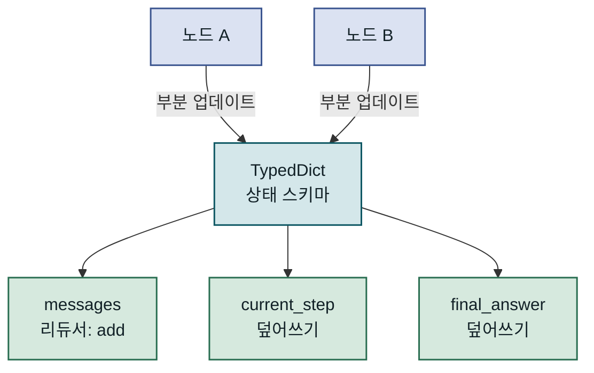
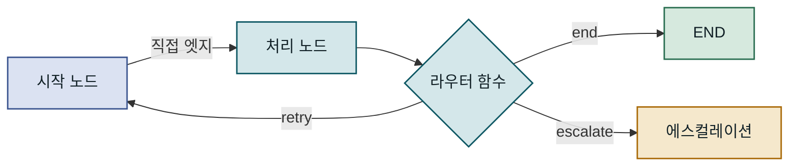
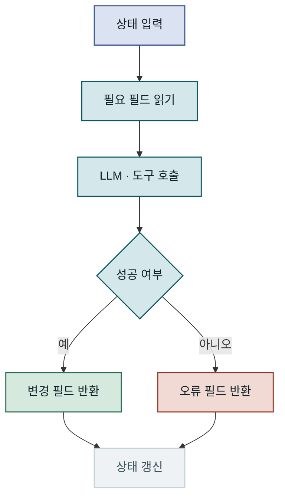
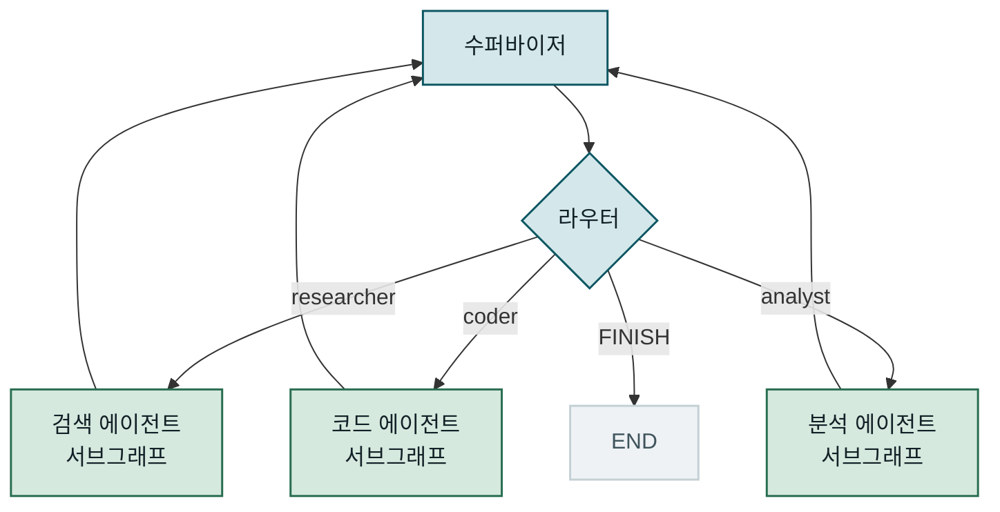
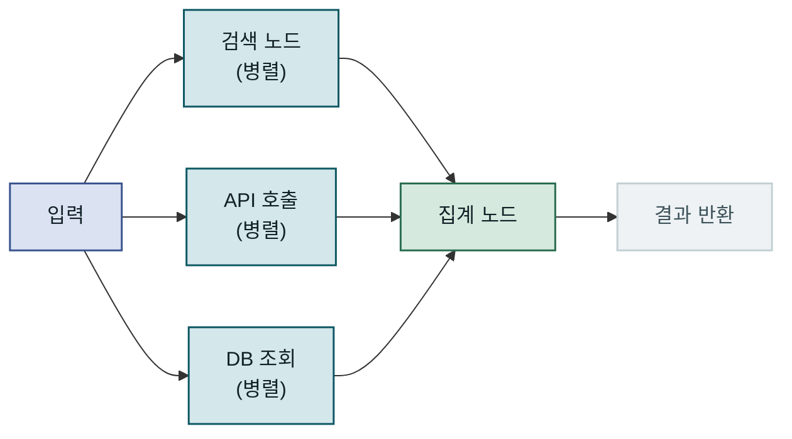
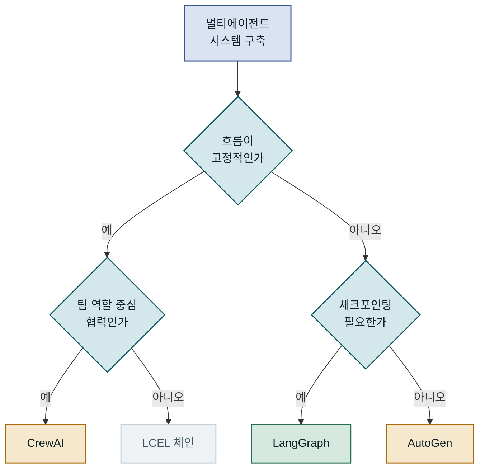
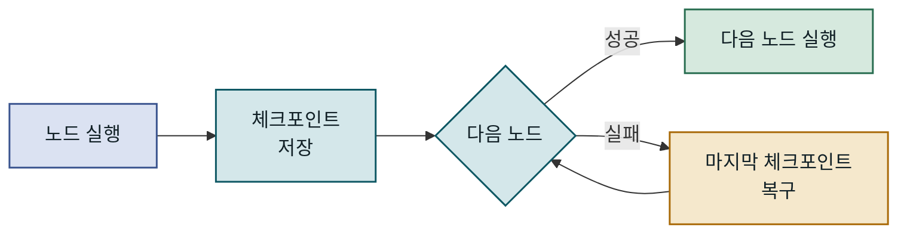

## 목차

1. 개요
2. LangGraph 핵심 구조 이해
3. 상태 스키마와 노드 설계
4. 멀티에이전트 워크플로우 구현
5. 성능 특성과 대안 비교
6. 운영 환경 적용 시 고려사항
7. 맺음말

---

## 개요

### 문제 배경: 단순 체인이 부족한 이유

LLM 기반 애플리케이션이 확산되면서, 단일 프롬프트 호출이나 선형 파이프라인으로는 처리하기 어려운 태스크가 빠르게 늘어나고 있습니다. 검색 결과를 분석하고 코드를 생성한 뒤 실행 오류를 확인해 다시 수정하는 흐름처럼, 중간 결과에 따라 경로를 바꾸거나 이전 단계로 돌아가야 하는 **상태 기반 멀티에이전트 워크플로우**가 현업 프로젝트에서 빈번해졌습니다. **LangGraph**는 이런 요구를 충족하기 위해 LangChain 팀이 2024년 초 공개한 오케스트레이션 라이브러리로, 방향 그래프(Directed Graph) 구조를 통해 에이전트들이 공유 상태를 기반으로 협력하는 복잡한 워크플로우를 선언적으로 표현합니다. 이 글은 LangGraph의 핵심 추상화를 이해하고, 실제 프로젝트에서 멀티에이전트 시스템을 설계·운영하는 데 필요한 판단 기준과 주의사항을 다룹니다.

### 기존 방식의 한계

LangChain의 LCEL(LangChain Expression Language)이나 단순 체인으로도 여러 LLM 호출을 연결하는 것은 가능합니다. 그러나 체인은 근본적으로 **선형 파이프라인**을 전제로 설계되어 있습니다. 중간 결과를 보고 실행 경로를 동적으로 변경하거나, 특정 단계로 되돌아가는 사이클을 구성하거나, 여러 에이전트가 공유 상태를 기반으로 병렬로 작업하는 시나리오를 표현하려면 체인 구조는 한계에 빠릅니다. 분기 로직을 Python 코드로 직접 구현할 수는 있지만, 상태 전달 방식이 임의적으로 흩어지고 코드의 복잡도가 빠르게 올라가 재사용이 어려워집니다. 특히 사이클이 포함된 ReAct 패턴이나 여러 에이전트가 협력하는 수퍼바이저 구조를 체인으로 구현하면, 오케스트레이션 코드가 비즈니스 로직보다 두꺼워지는 문제가 반복됩니다.



체인은 항상 직선으로 흐르지만 LangGraph는 조건 분기와 사이클을 그래프 선언만으로 자연스럽게 표현합니다.

---

## LangGraph 핵심 구조 이해

LangGraph의 모든 것은 세 가지 추상화, 즉 **상태(State)**, **노드(Node)**, **엣지(Edge)**로 이루어집니다. `StateGraph` 인스턴스를 만들고 노드와 엣지를 추가한 뒤 `compile()`을 호출하면, 이 그래프는 LangChain의 Runnable 프로토콜을 구현한 실행 가능한 객체가 됩니다. 이후 `invoke()` 또는 `ainvoke()`로 실행하면 LangGraph 런타임이 그래프를 순회하면서 각 노드를 차례로 호출합니다. 다른 그래프 기반 시스템과 비교했을 때 LangGraph가 갖는 독특한 설계는 노드 함수가 입력으로 전체 상태(State 딕셔너리)를 받고, 출력으로는 상태의 **부분 업데이트만** 반환한다는 점입니다. 변경하지 않을 필드는 반환하지 않아도 되기 때문에, 각 노드는 자신이 책임지는 영역에만 집중할 수 있고 다른 필드를 실수로 덮어쓰는 문제를 구조적으로 방지할 수 있습니다.

### StateGraph와 상태 관리

`StateGraph`는 LangGraph 워크플로우의 진입점입니다. 인스턴스를 만들 때 상태 타입을 제네릭으로 전달하면, 이후 추가하는 모든 노드와 엣지가 해당 스키마를 공유합니다. 상태는 Python의 `TypedDict`로 정의하는 것이 일반적이며, `Annotated` 타입 힌트를 활용해 필드별로 **리듀서 함수**를 지정할 수 있습니다. 리듀서는 여러 노드가 같은 필드를 동시에 업데이트하려 할 때 값을 어떻게 합칠지를 결정합니다. `messages` 필드에 `operator.add`를 리듀서로 지정하면, 각 노드가 반환하는 메시지 목록이 기존 목록에 **추가(append)** 됩니다. 이 방식은 멀티에이전트 시스템에서 대화 이력을 유지하는 데 특히 중요합니다. 리듀서가 없는 필드는 마지막으로 반환한 노드의 값이 그대로 덮어쓰이기 때문에, 필드의 의도된 업데이트 방식에 맞춰 리듀서를 명시적으로 선택해야 합니다.



상태 스키마는 그래프 전체가 공유하는 단일 진실 공급원이며, 각 필드에 선언된 리듀서가 동시 업데이트 충돌을 해소합니다.

### 노드와 엣지의 역할

노드는 단순한 Python 함수입니다. 특별한 클래스를 상속받거나 인터페이스를 구현할 필요 없이, 상태 딕셔너리를 인수로 받아 변경할 필드만 담은 딕셔너리를 반환합니다. 이 설계 덕분에 기존 비즈니스 로직이나 LangChain 체인을 노드로 래핑하는 비용이 낮고, 단위 테스트 작성도 수월합니다. 엣지는 노드 간 연결을 정의하며 두 종류가 있습니다. **일반 엣지(direct edge)**는 소스 노드 실행 후 항상 지정된 목적지 노드로 이동하며, **조건부 엣지(conditional edge)**는 상태를 입력받아 다음 노드의 이름을 문자열로 반환하는 라우터 함수를 사용합니다. 라우터 함수가 반환하는 문자열이 곧 그래프 분기를 결정하고, 특별한 상수 `END`를 반환하면 실행을 종료합니다.



조건부 엣지의 라우터 함수는 현재 상태를 보고 다음 노드를 결정하며, 같은 노드로 되돌아가는 경로를 지정하면 사이클이 형성됩니다.

### 조건부 분기와 사이클 설계

LangGraph가 단순 DAG(Directed Acyclic Graph)와 구별되는 가장 중요한 특성은 **사이클을 허용**한다는 점입니다. ReAct 패턴처럼 에이전트가 도구를 호출하고 결과를 확인한 뒤 다시 추론 단계로 돌아가는 흐름이 자연스럽게 표현됩니다. 그러나 LangGraph 자체는 반복 횟수에 제한을 두지 않으므로, 무한 루프 방지 책임은 전적으로 설계자에게 있습니다. 일반적으로는 상태에 `step_count` 같은 카운터 필드를 두고, 라우터 함수에서 최대 반복 횟수를 초과하면 강제로 `END`를 반환하도록 구현합니다. 사이클이 있는 그래프를 설계할 때는 탈출 조건(exit condition)을 먼저 정의하고 역으로 노드와 엣지를 배치하는 접근이 실수를 줄이는 데 효과적입니다.

---

## 상태 스키마와 노드 설계

워크플로우의 견고성은 상태 스키마를 얼마나 신중하게 설계하느냐에 크게 달려 있습니다. 상태가 지나치게 크면 각 노드가 불필요한 정보를 처리하게 되고, 너무 빈약하면 노드 간 맥락 전달이 불가능해집니다. 실제 프로젝트에서 반복적으로 보이는 실수는 모든 것을 하나의 플랫(flat) 딕셔너리에 담는 것입니다. 처음에는 간단해 보이지만, 에이전트 수가 늘어나면 어느 노드가 어떤 필드를 소유하는지 파악하기 어려워지고, 필드 이름 충돌이나 의도치 않은 덮어쓰기 문제가 발생합니다. 이를 해소하는 방법 중 하나는 **중첩 TypedDict**를 사용해 각 에이전트의 전용 상태 영역을 분리하는 것으로, 부모 상태와 서브그래프 상태를 명확히 구분하는 설계 원칙과도 자연스럽게 연결됩니다.

### TypedDict 기반 상태 스키마 정의

상태 스키마를 정의할 때는 필드의 **소유권**과 **업데이트 방식**을 설계 단계에서 명확히 해야 합니다. `messages`처럼 이력을 누적해야 하는 필드는 `operator.add` 리듀서를 선택하고, `current_step`처럼 매 노드가 갱신하는 단일 값 필드는 기본 동작(마지막 업데이트가 이긴다)을 사용합니다. 특히 병렬 실행(fan-out)을 도입할 계획이라면, 동시 업데이트가 발생할 가능성이 있는 모든 필드에 리듀서를 미리 지정해야 런타임 오류를 피할 수 있습니다.

```python
from typing import Annotated, TypedDict
import operator
from langchain_core.messages import BaseMessage

class AgentState(TypedDict):
    # operator.add 리듀서: 각 노드가 추가하는 메시지가 누적됨
    messages: Annotated[list[BaseMessage], operator.add]
    current_agent: str   # 현재 실행 중인 에이전트 이름
    step_count: int      # 무한 루프 방지 카운터
    final_answer: str    # 비어있으면 아직 미완료 상태

def should_continue(state: AgentState) -> str:
    """라우터 함수: 상태를 보고 다음 노드 이름을 반환"""
    if state["step_count"] >= 10:
        return "end"                 # 최대 반복 초과 → 강제 종료
    if state.get("final_answer"):
        return "end"                 # 답변 완성 → 종료
    return "continue"               # 계속 실행
```

`messages` 필드에 `operator.add`를 붙이면 여러 노드가 병렬로 메시지를 추가해도 이력이 덮어쓰이지 않고 안전하게 누적됩니다.

### 노드 함수 구현 패턴

노드 함수는 상태를 읽고 변경된 필드만 반환하는 형태로 설계하는 것이 좋습니다. 외부 I/O(LLM 호출, DB 조회 등)를 포함하더라도 상태 변이를 반환값에만 의존하도록 제한하면 단위 테스트와 디버깅이 훨씬 수월해집니다. 특히 LLM을 호출하는 노드는 항상 예외를 처리하고 실패 시 상태에 오류 정보를 남기는 방어적 설계가 중요합니다. 오류 정보를 상태에 저장해 두면 이후 라우터 함수나 오류 처리 전용 노드에서 복구 로직을 구현할 수 있습니다.



노드 내부 실패도 상태를 통해 다음 노드에 전달해야 사이클 안에서 오류 복구 로직을 안전하게 구현할 수 있습니다.

### 리듀서로 상태 충돌 해소

병렬 실행(fan-out/fan-in 패턴)에서 여러 노드가 동시에 같은 필드를 업데이트하면 충돌이 발생합니다. LangGraph는 이를 리듀서로 해결합니다. `operator.add`는 리스트를 합치고, 커스텀 함수를 작성하면 딕셔너리 병합이나 집합 합집합 같은 임의의 병합 로직도 선언할 수 있습니다. 리듀서는 상태 스키마 선언 시 한 번만 정의하면 이후 해당 필드에 쓰는 모든 노드에 자동으로 적용됩니다.

| 업데이트 패턴 | 리듀서 | 적용 예 | 주의점 |
|---|---|---|---|
| 이력 누적 | `operator.add` | `messages: list[BaseMessage]` | 리스트 크기 증가 주의 |
| 마지막 값 우선 | 없음(기본) | `current_agent: str` | 병렬 실행 시 비결정적 |
| 딕셔너리 병합 | 커스텀 merge 함수 | `tool_results: dict` | 키 충돌 처리 필요 |
| 중복 제거 집합 | 커스텀 union 함수 | `visited_urls: set` | set 직렬화 고려 |
| 최댓값 유지 | 커스텀 max 함수 | `max_confidence: float` | 초기값 설정 중요 |

---

## 멀티에이전트 워크플로우 구현

멀티에이전트 시스템을 LangGraph로 구현할 때 가장 널리 사용되는 구조는 **수퍼바이저 패턴(Supervisor Pattern)**입니다. 수퍼바이저 에이전트가 전체 태스크를 분석하고, 사용 가능한 전문 에이전트 중 어느 것에게 작업을 위임할지를 결정합니다. 전문 에이전트는 각자의 도메인(웹 검색, 코드 실행, 데이터 분석 등)에 집중하며, 태스크를 마치면 결과를 공유 상태에 기록하고 수퍼바이저에게 제어권을 반환합니다. 단일 에이전트가 모든 도구를 직접 관리하는 방식에 비해, 이 구조는 각 에이전트의 시스템 프롬프트를 특정 역할에 집중시킬 수 있어 LLM 호출의 품질이 향상되는 경향이 있습니다. 또한 새로운 전문 에이전트를 추가할 때 기존 에이전트에 영향을 주지 않으므로 확장이 수월합니다.

### 수퍼바이저 패턴 구현

수퍼바이저 노드는 LLM에게 현재 상태와 사용 가능한 에이전트 목록을 제공하고, 다음에 호출할 에이전트 이름을 **구조화된 출력(structured output)**으로 반환받도록 설계합니다. LangChain의 `with_structured_output`을 활용하면 LLM이 항상 유효한 에이전트 이름만 반환하도록 강제할 수 있어, 라우터 함수에서 예외 처리 부담을 줄일 수 있습니다. 수퍼바이저가 반환하는 에이전트 이름을 상태 필드에 저장하고, 조건부 엣지의 라우터 함수가 이 필드를 읽어 분기하면 수퍼바이저의 결정이 그래프 실행 흐름으로 자연스럽게 이어집니다.

```python
from pydantic import BaseModel
from langchain_openai import ChatOpenAI

AGENTS = ["researcher", "coder", "analyst"]

class RouteDecision(BaseModel):
    next: str  # 에이전트 이름 또는 "FINISH"

llm = ChatOpenAI(model="gpt-4o")

def supervisor_node(state: AgentState) -> dict:
    # LLM이 에이전트 목록을 보고 다음 담당자를 구조화 출력으로 반환
    supervisor = (
        supervisor_prompt           # 에이전트 목록 + 현재 상태 포함
        | llm.with_structured_output(RouteDecision)
    )
    decision = supervisor.invoke({"messages": state["messages"],
                                  "agents": AGENTS})
    return {
        "current_agent": decision.next,            # 라우터가 읽는 필드
        "step_count": state["step_count"] + 1
    }

def router(state: AgentState) -> str:
    agent = state["current_agent"]
    return "end" if agent == "FINISH" else agent   # 노드 이름 또는 END
```

수퍼바이저가 반환한 에이전트 이름이 라우터 함수를 거쳐 그래프 분기를 제어하는 핵심 메커니즘입니다.

### 서브그래프를 활용한 에이전트 캡슐화

**서브그래프**는 복잡한 에이전트를 독립된 `StateGraph`로 캡슐화하는 기능입니다. 서브그래프는 부모 그래프와 별도의 상태 스키마를 가질 수 있으며, 부모 상태와의 매핑은 서브그래프를 노드로 등록할 때 입력·출력 변환 함수로 처리합니다. 이 구조를 활용하면 여러 프로젝트에서 공통으로 사용하는 에이전트(예: RAG 검색 에이전트, 코드 실행 에이전트)를 독립적인 패키지처럼 재사용할 수 있습니다. 서브그래프 내부의 상태 변경이 부모 그래프의 상태와 격리되므로, 전문 에이전트의 내부 구현이 바뀌어도 수퍼바이저 로직에는 영향을 주지 않습니다.



각 전문 에이전트가 작업을 마치면 수퍼바이저로 제어권이 돌아오고, 이 사이클이 멀티에이전트 협력의 기본 반복 구조를 형성합니다.

### Human-in-the-Loop 패턴

LangGraph는 **인터럽트(interrupt)** 메커니즘을 통해 특정 노드 실행 직전에 그래프를 일시 중단하고 사람의 승인을 기다릴 수 있습니다. 이 기능은 **체크포인터(Checkpointer)**와 함께 사용해야 하며, 중단된 상태를 영속적으로 저장했다가 승인 신호가 오면 해당 시점에서 그래프를 재개합니다. 그래프 컴파일 시 `interrupt_before=["payment_node"]`처럼 인터럽트 지점을 선언하거나, 노드 내부에서 동적으로 `interrupt()` 함수를 호출해 입력을 받는 방식 모두 지원됩니다. 결제 처리, 데이터 삭제, 외부 API 전송처럼 자동화 흐름 안에서도 반드시 사람이 확인해야 하는 액션을 안전하게 포함시킬 수 있습니다.

> 인터럽트가 활성화된 상태에서 그래프를 재개할 때는 반드시 `Command(resume=<입력값>)`를 전달해야 하며, 그냥 `invoke()`를 다시 호출하면 처음부터 새 실행이 시작됩니다.

---

## 성능 특성과 대안 비교

LangGraph를 도입하기 전에 다른 멀티에이전트 프레임워크와 비교 검토하는 과정은 불필요한 기술 부채를 막는 데 중요합니다. 프레임워크마다 전제하는 에이전트 협력 모델과 제어 수준이 다르고, 사용 사례에 따라 최적의 선택이 달라집니다. LangGraph는 그래프 실행 제어를 개발자에게 완전히 위임하는 **저수준 오케스트레이터**에 가깝습니다. 추상화 수준이 높은 프레임워크에 비해 초기 설계 비용이 크지만, 복잡한 분기 로직, 사이클, 체크포인팅처럼 세밀한 제어가 필요한 시나리오에서 명확한 강점을 보입니다. 반면 에이전트 역할이 고정되고 순서가 명확한 단순한 협업 시나리오에서는 설정 비용 대비 얻는 이점이 크지 않을 수 있습니다.

### 동기·비동기 실행 선택

LangGraph는 동기 실행과 `async/await` 기반 비동기 실행을 모두 지원합니다. 노드 함수를 `async def`로 정의하고 `await graph.ainvoke()`를 호출하면 됩니다. 여러 노드를 병렬로 실행하는 **팬아웃(fan-out)**은 `Send` API를 통해 구현하며, 독립적인 태스크를 동시에 처리한 뒤 팬인(fan-in) 노드에서 결과를 취합하는 구조입니다. I/O 집약적인 워크플로우(다수의 API 호출, 웹 검색 등)에서 비동기 병렬 실행을 활용하면 전체 레이턴시를 크게 단축할 수 있습니다. 다만 공유 상태에 동시 접근이 발생하므로, 병렬 노드가 동일한 필드를 업데이트하는 경우 리듀서를 반드시 지정해야 합니다.



팬아웃으로 분기된 노드들은 독립적으로 실행되며, 모두 완료된 후 집계 노드가 결과를 취합합니다.

### LangGraph vs 대안 프레임워크

| 프레임워크 | 협력 모델 | 사이클 지원 | 상태 관리 | 제어 수준 | 언제 쓰나 |
|---|---|---|---|---|---|
| **LangGraph** | 그래프 기반 | ✅ 기본 지원 | TypedDict + 리듀서 | 낮음(세밀 제어) | 복잡한 분기·체크포인팅 필요 시 |
| **AutoGen** | 대화 기반 | 제한적 | 메시지 이력 | 중간 | 에이전트 간 자유 대화 시 |
| **CrewAI** | 역할 기반 | ❌ | 에이전트 메모리 | 높음(추상화) | 고정 역할·순서가 명확할 때 |
| **LlamaIndex Workflows** | 이벤트 기반 | ✅ | 컨텍스트 객체 | 중간 | LlamaIndex 생태계 사용 시 |
| **LCEL 체인** | 선형 파이프라인 | ❌ | 없음 | 매우 높음 | 단순 고정 파이프라인 |

### 어떤 상황에서 선택할 것인가



흐름이 조건에 따라 달라지고, 실행 재개나 Human-in-the-Loop 같은 세밀한 제어가 필요한 경우 LangGraph가 가장 적합한 선택입니다.

---

## 운영 환경 적용 시 고려사항

LangGraph 워크플로우를 프로토타입에서 운영 환경으로 이전할 때는 로컬에서 잘 동작하던 것이 규모가 커지거나 오류 상황에서 예상치 못한 문제를 드러내는 경우가 많습니다. 특히 멀티에이전트 시스템은 LLM 호출 수가 많아 비용이 빠르게 증가하고, 중간 단계의 실패가 전체 워크플로우를 처음부터 다시 실행하게 만들 수 있습니다. 또한 공유 상태를 기반으로 여러 에이전트가 협력하는 구조는 어느 노드에서 어떤 상태 전환이 일어났는지 추적하기 어려워, 예상치 못한 동작을 재현하거나 원인을 파악하는 데 많은 시간이 소요되는 경향이 있습니다. 이런 문제들을 체계적으로 해결하기 위한 준비가 프로덕션 단계의 핵심 과제입니다.

### 상태 영속성과 체크포인팅

LangGraph의 체크포인터는 각 노드 실행 후 상태를 저장하는 메커니즘입니다. 기본 제공되는 `MemorySaver`는 개발 단계에 적합한 인메모리 저장소로, 프로세스가 재시작되면 모든 상태를 잃습니다. 운영 환경에서는 `SqliteSaver` 또는 `AsyncPostgresSaver`를 사용해 상태를 영속적으로 저장해야 합니다. 이렇게 하면 특정 노드에서 실패하더라도 마지막 체크포인트에서 재개할 수 있어, 비용이 큰 LLM 호출을 처음부터 반복하지 않아도 됩니다. 체크포인터를 사용할 때는 반드시 `config={"configurable": {"thread_id": "..."}}` 형태로 **스레드 ID**를 지정해야 합니다. 스레드 ID는 독립된 실행 컨텍스트를 식별하는 키로, 여러 사용자의 워크플로우가 서로 간섭하지 않도록 격리하는 역할을 합니다. 실수로 같은 스레드 ID를 재사용하면 이전 실행의 상태 위에서 새 실행이 시작되므로, ID 생성 전략을 명확히 정의해야 합니다.



체크포인터가 있으면 중간 실패가 처음부터 재실행으로 이어지지 않아, 비용과 시간을 절약할 수 있습니다.

### 모니터링과 디버깅

멀티에이전트 워크플로우는 여러 LLM 호출이 서로 맞물려 있어 문제가 발생했을 때 원인을 찾기 어렵습니다. **LangSmith**는 LangChain 생태계의 공식 추적 도구로, 각 노드에서 발생한 LLM 호출, 프롬프트 내용, 토큰 수, 레이턴시를 시각적으로 확인할 수 있습니다. `LANGCHAIN_TRACING_V2=true` 환경변수 하나만 설정하면 별도 코드 변경 없이 추적이 활성화됩니다. 로컬 디버깅에서는 `astream_events()`로 각 노드의 입출력을 실시간 스트리밍으로 확인하거나, `graph.get_graph().draw_mermaid_png()`로 현재 그래프 구조를 이미지로 출력하는 방법이 유용합니다.

| 지표 | 측정 방법 | 임곗값 기준 | 주의점 |
|---|---|---|---|
| 노드 실행 시간 | LangSmith 타임라인 | 노드 유형별 기준선 | LLM 레이턴시 포함 |
| 평균 사이클 횟수 | `step_count` 상태 필드 | 설계 시 정한 최댓값 | 무한 루프 전조 신호 |
| LLM 호출 실패율 | 예외 로그·LangSmith | 1% 이하 목표 | 재시도 정책 필수 |
| 상태 저장 크기 | 체크포인트 용량 | 노드당 ~100KB 이하 | messages 무제한 누적 금지 |

### 확장성과 마이그레이션 전략

단일 프로세스로 운영하다 규모가 커지면 **LangGraph Platform**(구 LangGraph Cloud)으로 이전을 고려할 수 있습니다. 이 플랫폼은 워크플로우를 REST API 서버로 배포하고, 수평 확장, 큐 기반 비동기 실행, 웹 UI를 통한 상태 시각화를 제공합니다. 다만 플랫폼 종속성이 생기므로, 자체 인프라를 유지해야 하는 환경이라면 FastAPI + `AsyncPostgresSaver` 조합으로 유사한 기능을 직접 구축하는 것이 현실적인 대안입니다. 상태 스키마를 변경할 때는 기존 체크포인트와의 **역직렬화 호환성**을 반드시 확인해야 합니다. 필드를 추가하거나 타입을 변경하면 이전 버전의 체크포인트를 읽지 못하는 문제가 발생할 수 있으며, 사전에 마이그레이션 스크립트를 준비하는 것이 안전합니다. 특히 `messages` 필드에 커스텀 메시지 타입을 사용하는 경우, Pydantic 스키마 버전 변경 시 역직렬화 오류가 운영 중에 조용히 발생할 수 있으므로 스키마 변경은 신중하게 진행해야 합니다.

---

## 맺음말

### 핵심 요약

LangGraph는 **상태(State)·노드(Node)·조건부 엣지(Conditional Edge)** 세 가지 추상화를 조합해 복잡한 멀티에이전트 워크플로우를 선언적으로 표현합니다. `TypedDict` 기반 상태 스키마와 리듀서를 활용하면 에이전트 간 공유 상태를 안전하게 관리할 수 있고, 수퍼바이저 패턴으로 에이전트 협력 구조를 체계화할 수 있습니다. 체크포인팅은 장시간 실행되는 워크플로우의 복원력을 보장하고 Human-in-the-Loop를 가능하게 하는 핵심 기능입니다. 운영 환경에서는 LangSmith를 통한 추적, 상태 크기 관리, 스레드 ID 전략이 안정적인 서비스의 토대가 됩니다.

### 적용 판단 기준

LangGraph 도입을 고려할 때 핵심 판단 기준은 워크플로우의 **복잡성**과 **제어 요구사항**입니다. 단순한 RAG 파이프라인이나 순서가 고정된 에이전트 체인이라면 LCEL이나 CrewAI처럼 추상화 수준이 더 높은 도구가 적합합니다. 반면 실행 중 조건에 따라 경로가 바뀌고, 중간에 사람이 개입해야 하고, 특정 지점에서 재개해야 하며, 에이전트 수와 역할이 시간이 지남에 따라 늘어날 가능성이 있다면 LangGraph의 저수준 제어가 장기적으로 유리합니다. 프로토타입 단계에서는 추상화 수준이 높은 도구로 빠르게 검증하고, 프로덕션 수준의 제어와 신뢰성이 필요해지는 시점에 LangGraph로 재설계하는 점진적 전략도 현실적인 접근법입니다. LangGraph의 공식 문서와 예제 저장소(https://github.com/langchain-ai/langgraph)에는 수퍼바이저, ReAct, 멀티에이전트 협업 등 주요 패턴의 레퍼런스 구현이 지속적으로 추가되고 있으므로, 설계 초기에 참고하는 것을 권장합니다.
