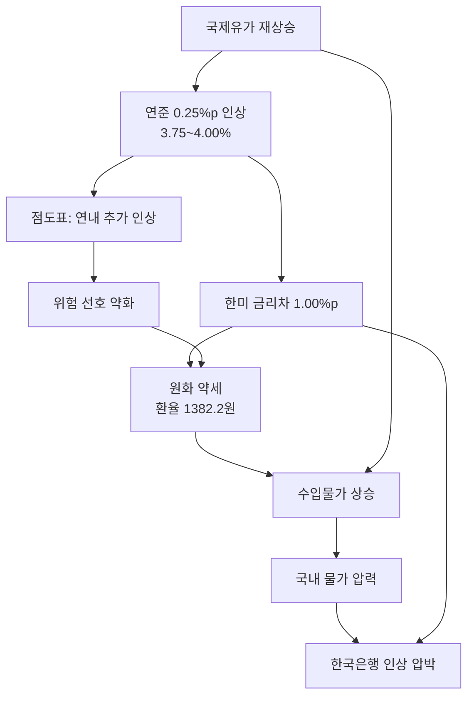

## 목차

1. 개요
2. 연준이 올린 것과, 그보다 중요한 점도표
3. 첫 번째 경로 — 금리차와 환율
4. 두 번째 경로 — 시장금리와 자산 가격
5. 세 번째 경로 — 가계부채와 내수
6. 한국은행의 선택지
7. 무엇을 지켜봐야 하는가
8. 맺음말

---

## 개요

### 무슨 일이 있었나

현지시간 9월 16일 연방공개시장위원회(FOMC)가 기준금리를 0.25%포인트 올려 **연 3.75~4.00%**로 결정했습니다. 2023년 7월 이후 3년 2개월 만의 인상이고, 참석 위원 만장일치였습니다. 성장률과 물가 전망은 올라가고 실업률 전망은 내려간 결과입니다. 경기는 예상보다 버티는데 물가 압력은 더 커졌다는 판단이며, 미국과 이란의 지정학적 갈등이 길어지면서 다시 오른 국제유가가 그 판단을 밀어붙였습니다.

인상 자체는 시장이 예상하던 결과였습니다. 그런데도 국제 금융시장이 출렁인 이유는 따로 있습니다. 연준이 **연내 추가 인상 가능성**을 함께 시사했기 때문입니다.

### 이 글에서 다루는 것

금리 인상은 한 번의 사건이 아니라 여러 경로를 타고 퍼지는 과정입니다. 이 글은 이번 결정이 한국 경제로 전달되는 경로를 세 갈래 — 환율, 시장금리, 가계부채 — 로 나누어 살펴보고, 10월 금융통화위원회를 앞둔 한국은행의 선택지를 정리합니다. 개별 자산에 대한 투자 판단이 아니라, 어떤 변수가 어떤 순서로 움직이는지를 이해하는 데 목적이 있습니다.

---

## 연준이 올린 것과, 그보다 중요한 점도표

### 0.25%포인트보다 무거운 신호

이번 인상의 무게는 인상 폭이 아니라 점도표에 있습니다. 연준 위원들의 향후 기준금리 전망을 점으로 찍은 이 표에서, **18명 중 16명이 '연내 1회 이상 추가 인상'에 투표**했습니다. 그중 4명은 연내 2회를 내다봤습니다. 올해 남은 FOMC는 10월과 12월 두 번뿐이므로, 4명은 두 번 연속 인상을 상정하고 있다는 뜻입니다.

올해 말 기준금리 전망치 중간값도 지난 6월 3.8%에서 **4.1%로 0.3%포인트 상향**됐습니다. 단발성 인상이 아니라 긴축 사이클의 재개로 읽히는 근거입니다.

| 항목 | 6월 전망 | 9월 전망 |
|---|---|---|
| 기준금리 | 3.50~3.75% | **3.75~4.00%** |
| 연말 기준금리 중간값 | 3.8% | **4.1%** |
| 연내 추가 인상 투표 | — | 18명 중 16명 |
| 연내 2회 인상 전망 | — | 4명 |

### 시장의 즉각적인 반응

발표 전까지 내려가던 미국 국채금리는 곧바로 상승세로 돌아섰고, **10년물 금리는 다시 5%를 넘어섰습니다**. 뉴욕 증시 3대 지수는 모두 하락했습니다. 여기에 일본은행(BOJ)까지 18일 금리 인상에 나설 가능성이 거론되면서, 주요국이 동시에 긴축으로 방향을 되돌렸다는 해석이 붙었습니다.

한국에 중요한 것은 이 대목입니다. 미국 혼자 올리는 긴축과 주요국이 함께 도는 긴축은 환율에 주는 압력의 성격이 다릅니다.

---

## 첫 번째 경로 — 금리차와 환율

### 1.00%포인트로 다시 벌어진 간격

이번 인상으로 한미 기준금리 차는 **상단 기준 1.00%포인트**로 다시 벌어졌습니다. 금리가 더 높은 통화로 자금이 이동하려는 압력이 커지고, 그만큼 원화는 약해집니다.

반응은 하루 만에 나타났습니다. 17일 원달러 환율은 전 거래일보다 13.2원 오른 **1382.2원**에 주간 거래를 마쳤습니다. 6거래일 연속 상승이며, 지난달 28일 이후 처음으로 1380원을 넘어섰습니다.

### 환율이 물가로 번지는 구간

환율 상승은 그 자체로 끝나지 않습니다. 원유·원자재·중간재를 수입해 쓰는 구조에서 원화가 약해지면 수입물가가 오르고, 시차를 두고 소비자물가로 옮겨갑니다. 지금 국면이 까다로운 이유는 **유가 상승과 환율 상승이 같은 방향으로 겹쳐 있다**는 점입니다. 연준을 인상으로 떠민 유가가, 한국에서는 환율을 통해 한 번 더 물가를 밀어 올립니다.

정부도 이 대목을 보고 있습니다. 구윤철 부총리 겸 재정경제부 장관 주재로 합동 확대거시경제금융회의가 열려 금융·외환시장 점검과 대응 방향이 논의됐습니다.

---

## 두 번째 경로 — 시장금리와 자산 가격

### 장기금리가 먼저 움직인다

기준금리는 단기금리지만, 실제로 가계와 기업이 부담하는 조달 비용은 국채금리를 기준으로 형성됩니다. 미 10년물이 5%를 다시 넘어서면 한국 국고채 금리도 따라 오르고, 그 위에 신용 스프레드가 얹혀 회사채와 대출 금리가 결정됩니다.

| 자산 | 금리 인상기의 방향 | 이유 |
|---|---|---|
| 국채 | 가격 하락(금리 상승) | 할인율 상승 |
| 회사채 | 가격 하락 + 스프레드 확대 | 할인율 + 신용위험 |
| 성장주 | 상대적 약세 | 먼 미래 현금흐름의 현재가치 하락 |
| 달러 | 강세 | 금리차에 따른 자금 이동 |
| 부동산 | 수요 위축 | 대출 이자 부담 증가 |

성장주가 금리에 민감한 이유는 단순합니다. 기업 가치는 미래 현금흐름을 현재가치로 할인한 값인데, 이익이 먼 미래에 몰려 있을수록 할인율 상승의 타격이 큽니다. 이익이 지금 나오는 기업보다 앞으로 날 기업의 가치가 더 많이 깎입니다.

### 스타트업과 기술 기업의 조달 환경

이 구조는 비상장 영역에도 그대로 적용됩니다. 벤처 투자는 금리가 낮을 때 가장 활발하고, 금리가 오르면 안전자산 대비 기대수익 기준이 높아지면서 밸류에이션 기준이 빠르게 보수화됩니다. 2022~2023년 긴축기에 후속 라운드가 얼어붙었던 경험이 그대로 재현될 수 있습니다. 긴축 재개 국면에서 자금 조달을 계획하고 있다면, **조달 시점을 늦추는 선택의 비용이 이전보다 커졌다**는 점을 계산에 넣어야 합니다.

---

## 세 번째 경로 — 가계부채와 내수

### 이자 부담이 소비를 깎는다

한국 가계부채는 변동금리 비중이 높아 정책금리 변화가 비교적 빠르게 실제 이자 부담으로 전달됩니다. 대출 이자가 늘면 처분가능소득이 줄고, 그만큼 소비가 줄어듭니다. 금리 인상이 물가를 잡는 원리 자체가 이 수요 위축이지만, 부담은 균등하게 분배되지 않습니다.

- **취약차주**: 소득 대비 원리금 상환 비중이 이미 높아, 추가 인상분이 곧바로 연체 위험으로 연결됩니다.
- **자영업**: 대출 의존도가 높고 내수 위축과 이자 부담을 동시에 받습니다.
- **부동산**: 대출 금리 상승은 거래를 줄이고 가격 하방 압력으로 작용합니다.

금리를 빠르게 올리면 물가와 환율은 잡히지만 내수와 부동산이 함께 식습니다. 이것이 한국은행이 마주한 상충 구조의 핵심입니다.

---

## 한국은행의 선택지

### 10월이냐 11월이냐

한국은행은 지난 7월과 8월 연속으로 금리를 올린 뒤, 정책 효과를 확인하며 추가 인상의 시점과 속도를 조절하겠다는 입장이었습니다. 시장도 10월보다 11월 인상 가능성에 무게를 두고 있었습니다.

연준의 이번 결정은 그 시간표를 앞당기는 쪽으로 작용합니다. 금리차가 1.00%포인트로 벌어진 상태에서 연준이 10월과 12월에 추가로 올리면, 원화 약세와 환율 상승 압력은 더 커집니다. 반대로 서둘러 올리면 취약차주의 이자 부담과 내수 위축이라는 비용을 먼저 치르게 됩니다.

| 선택 | 얻는 것 | 치르는 비용 |
|---|---|---|
| 10월 인상 | 환율 방어, 금리차 축소 | 내수·부동산 위축, 취약차주 부담 |
| 11월 이후로 유예 | 정책 효과 확인 시간 | 환율 추가 상승, 대응 지연 위험 |

### 전문가들이 보는 최종 금리

박형중 우리은행 이코노미스트는 "미국 연준의 추가 금리 인상이 이어진다면 한국은행의 최종 기준금리도 4% 전후가 될 가능성이 높다"며 "연준이 추가 인상에 나선다면 한은도 상당한 압박을 받을 것"이라고 설명했습니다.

윤여삼 메리츠증권 연구원은 유가를 핵심 변수로 지목했습니다. "유가 상승이 연준을 금리 인상으로 떠밀었고 한국에도 부담으로 작용하고 있다"며, 기존에는 향후 6개월 안에 한 차례 추가 인상 가능성이 반영됐지만 **이제는 두 차례 인상 가능성도 열어 둬야 한다**고 말했습니다.

---

## 무엇을 지켜봐야 하는가

전망을 맞히려 하기보다, 방향을 가를 변수를 좁혀 두는 편이 유용합니다.

1. **국제유가** — 이번 인상을 밀어붙인 출발점입니다. 유가가 진정되면 연준의 추가 인상 명분과 한국의 물가 압력이 동시에 약해집니다. 지정학적 갈등의 지속 여부가 사실상 여기에 걸려 있습니다.
2. **10월·12월 FOMC** — 점도표대로 실제 인상이 이어지는지가 금리차의 크기를 결정합니다.
3. **원달러 환율의 1380원대 안착 여부** — 일시적 급등과 추세적 상승은 한국은행의 대응 강도를 다르게 만듭니다.
4. **일본은행의 방향** — BOJ가 함께 긴축으로 돌면 엔화 강세가 달러 강세 압력을 일부 덜어 주고, 반대의 경우 원화에 가는 부담이 커집니다.
5. **국내 물가와 가계부채 지표** — 한국은행이 10월과 11월 사이에서 저울질할 때 직접 보는 숫자들입니다.

---

## 맺음말

이번 인상의 의미는 0.25%포인트가 아니라 방향 전환에 있습니다. 3년 2개월 만에 긴축 시계가 다시 돌기 시작했고, 점도표는 이것이 한 번으로 끝나지 않을 수 있다고 말합니다.

한국에 전달되는 경로는 결국 하나로 모입니다. 금리차가 벌어지고 → 환율이 오르고 → 수입물가가 밀려 올라오고 → 한국은행이 대응을 압박받는 흐름입니다. 그리고 그 대응의 비용은 가계부채와 내수가 치릅니다. 어느 쪽을 택하든 대가가 있는 구간이며, 그래서 한국은행은 시점을 두고 고민하고 있습니다.

지켜볼 것은 유가와 다음 두 번의 FOMC입니다. 그 두 변수가 정해지면 나머지는 대체로 따라옵니다.

---

**참고**: [美, 3년 만에 기준금리 인상…글로벌 긴축 시계 다시 돈다](https://n.news.naver.com/article/081/0003681396?sid=101) (서울신문, 2026-09-18)
