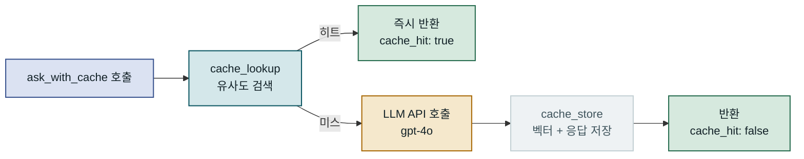
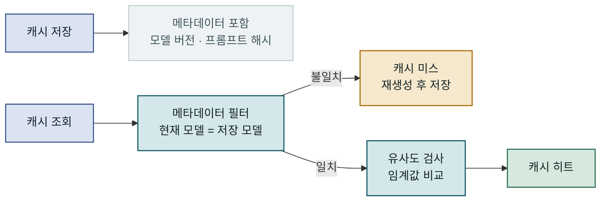

## 목차

1. 개요
2. Semantic Cache의 동작 원리
3. 임베딩 유사도 계산 구현
4. 벡터 저장소 설계와 아키텍처
5. 임계값 튜닝과 운영 환경 함정
6. 비용 절감 효과와 트레이드오프
7. 맺음말

---

## 개요

### 문제 배경: LLM API 비용의 구조적 특성

LLM(Large Language Model) API는 토큰 소비량에 따라 비용이 청구됩니다. GPT-4o 기준 입력 토큰 100만 개당 $2.50, 출력 토큰 100만 개당 $10.00 수준이며, 실제 운영 서비스에서는 동일하거나 매우 유사한 질문이 반복적으로 들어오는 경우가 상당합니다. **Semantic Cache**는 임베딩 벡터의 유사도 비교를 통해 의미적으로 동일한 질문에 저장된 응답을 재사용함으로써, LLM API 호출 횟수를 줄이고 비용을 절감합니다. 반복 질문 비율이 높은 고객지원 챗봇이나 내부 지식 베이스 검색 서비스에서 API 호출 횟수를 30~60% 줄인 사례가 보고되고 있으며, 이 글에서는 임베딩 유사도 기반 캐시의 설계 원리부터 운영 환경 적용 시 주의해야 할 함정까지 다룹니다.

> LLM API 비용 문제는 단순히 프롬프트를 줄이는 것만으로는 해결되지 않습니다. 반복적인 질문 패턴이 존재하는 한, 캐시 레이어가 가장 구조적인 해법입니다.

### 기존 방식의 한계: 정확 일치 캐시의 맹점

Redis나 Memcached 기반의 **정확 일치(exact-match) 캐시**는 캐시 키와 요청 텍스트가 문자 단위로 완전히 일치할 때만 히트가 발생합니다. 실제 사용자 질문은 오탈자, 존댓말·반말 혼용, 동의어 치환, 어순 변경 등으로 인해 같은 의미더라도 표현이 달라지는 경우가 빈번합니다. "비밀번호 재설정 방법"과 "패스워드 변경하는 법"은 사실상 같은 의도이지만 정확 일치 캐시에서는 별개 키로 처리되어 두 번 모두 API를 호출하게 됩니다. 특히 멀티턴 대화나 동적 프롬프트 템플릿 환경에서는 가변 부분이 조금만 달라져도 캐시 히트율이 사실상 0%에 가까워집니다.

```diagram
2026-09-23-bf87766d-01
```

Semantic Cache는 벡터 공간에서 두 질문을 같은 의도로 인식하지만, 정확 일치 캐시는 어휘 차이만으로 두 번 모두 API를 호출합니다.

---

## Semantic Cache의 동작 원리

### 임베딩 벡터와 의미 공간

임베딩(Embedding)은 텍스트를 고차원 실수 벡터로 변환하는 표현 방식입니다. 여기서 **차원**은 벡터 하나에 들어 있는 숫자의 개수입니다. OpenAI `text-embedding-3-small`은 문장 하나를 숫자 1536개짜리 목록으로 바꾸고, 이 숫자들이 1536차원 공간의 좌표가 됩니다. 숫자 하나하나에 사람이 읽을 수 있는 뜻이 붙어 있지는 않지만, 차원이 높을수록 의미를 더 세밀하게 구분하는 대신 저장 공간과 비교 연산이 늘어납니다. 의미적으로 유사한 문장들은 이 벡터 공간에서 서로 가까이 위치합니다. "비밀번호를 잊어버렸어요"와 "계정 비밀번호를 모르겠습니다"는 전혀 다른 토큰 시퀀스이지만, 임베딩 공간에서는 코사인 유사도 0.93~0.96 수준으로 매우 가깝습니다. 반면 "비밀번호 변경"과 "배송 조회"는 0.2~0.3 수준에 그칩니다.

임베딩 모델 선택지는 크게 두 가지입니다. OpenAI·Cohere 같은 원격 API와 `sentence-transformers` 같은 로컬 오픈소스 모델입니다. `text-embedding-3-small`의 가격은 토큰 100만 개당 $0.02로 GPT-4o 입력 비용의 약 1/125에 불과합니다. 따라서 캐시 히트율이 충분히 높다면 임베딩 호출 비용은 무시할 수 있는 수준이고, 원격 API 쪽이 더 높은 임베딩 품질을 제공합니다. 로컬 모델은 비용이 없고 지연도 낮지만, 다국어 지원과 도메인 특화 정확도 측면에서 원격 모델보다 부족할 수 있습니다.

```diagram
2026-09-23-bf87766d-02
```

임베딩 모델이 벡터를 생성하고 ANN 인덱스가 수백만 개의 캐시 항목 중에서도 수십 밀리초 내에 유사 후보를 찾아냅니다.

### 코사인 유사도와 거리 지표 선택

Semantic Cache에서 두 벡터 간 유사성을 측정하는 가장 일반적인 방법은 **코사인 유사도(Cosine Similarity)**입니다. 코사인 유사도는 두 벡터의 방향 유사성을 -1에서 1 사이의 값으로 표현하며, 벡터의 크기(길이)에 영향을 받지 않습니다. 짧은 질문과 긴 질문처럼 문장 길이가 크게 다를 때도 의미적 유사성을 공정하게 비교할 수 있다는 점이 핵심입니다. 임베딩 벡터가 이미 L2 정규화된 경우에는 코사인 유사도와 내적(dot product)이 동일하므로, 벡터 DB 설정에서 내적을 선택하면 연산이 더 빠릅니다.

유클리드 거리(L2 distance)는 벡터의 크기도 반영하기 때문에, 문장 길이 차이가 큰 환경에서는 짧은 질문끼리만 유사하게 분류되는 편향이 생길 수 있습니다. 실제 Semantic Cache 구현에서는 코사인 유사도, 또는 이미 정규화된 벡터에 내적을 사용하는 방식이 권장됩니다.

| 유사도 지표 | 범위 | 크기 의존성 | 권장 상황 | 주의점 |
|---|---|---|---|---|
| 코사인 유사도 | -1 ~ 1 | 없음 | 문장 길이 편차 클 때 | 연산 상대적으로 느림 |
| 내적 (dot product) | 비제한 | 있음 | 정규화된 벡터 환경 | 정규화 선행 필수 |
| 유클리드 거리 | 0 ~ ∞ | 있음 | 길이 유사한 항목 비교 | 짧은 텍스트 편향 |
| 맨하탄 거리 | 0 ~ ∞ | 있음 | 희소 벡터 | Semantic Cache에 부적합 |

### ANN 인덱스와 검색 성능

벡터 저장소에 저장된 캐시 항목이 수만~수백만 개로 늘어나면, 모든 항목과 일일이 유사도를 계산하는 브루트 포스(Brute Force) 방식은 응답 지연이 항목 수에 선형적으로 증가합니다. **HNSW(Hierarchical Navigable Small World)**는 현재 가장 널리 쓰이는 ANN 알고리즘으로, 수백만 개의 벡터에서도 수십 밀리초 내에 검색을 완료합니다. 정확한 최근접 이웃 대신 약간의 근사 오차를 허용하는 대신 속도를 크게 높이는 방식이며, 실제 Semantic Cache 환경에서 그 근사 오차는 거의 문제가 되지 않습니다.

> HNSW의 핵심 파라미터인 `M`(연결 수)과 `ef_construction`(빌드 품질)을 높이면 검색 정밀도가 올라가지만 메모리와 인덱스 빌드 시간도 증가합니다. 캐시 항목 10만 개 이하에서는 기본값으로 충분합니다.

---

## 임베딩 유사도 계산 구현

### Redis 벡터 인덱스 생성과 기본 구조

아래 예제는 Python에서 OpenAI 임베딩 API와 Redis Stack(벡터 검색 지원)을 조합하여 Semantic Cache를 구현합니다. `redis-py` 라이브러리의 `SearchCommands`를 활용하면 Redis에서 직접 벡터 유사도 검색이 가능하므로, 별도의 전용 벡터 DB를 추가하지 않아도 됩니다. 이 방식은 이미 Redis를 캐시 레이어로 운영 중인 팀에서 인프라 변경 없이 빠르게 시작할 때 적합합니다. `DIM`은 임베딩 모델의 출력 차원과 반드시 일치해야 하며, `text-embedding-3-small`이면 1536, `text-embedding-3-large`이면 3072입니다. 인덱스의 차원은 만들 때 고정되므로 1536으로 만든 인덱스에 3072차원 벡터를 넣을 수 없고, 모델마다 좌표계도 다르기 때문에 나중에 임베딩 모델을 바꾸면 캐시에 쌓인 벡터를 모두 다시 만들어야 합니다. 참고로 `text-embedding-3` 계열은 `dimensions` 파라미터로 더 짧은 벡터를 받을 수 있습니다. `text-embedding-3-large`를 1024차원으로 줄여 받는 식이며, 정확도가 조금 떨어지는 대신 저장 공간과 검색 비용이 줄어듭니다.

```python
from redis import Redis
from redis.commands.search.field import VectorField, TextField
from redis.commands.search.indexDefinition import IndexDefinition, IndexType

redis_client = Redis(host="localhost", port=6379, decode_responses=False)
INDEX_NAME = "semantic_cache"

def create_index():
    """Redis 벡터 검색 인덱스 생성 (최초 1회만 실행)."""
    try:
        redis_client.ft(INDEX_NAME).info()
    except Exception:
        schema = (
            TextField("query"),
            TextField("response"),
            VectorField(
                "embedding",
                "HNSW",
                {
                    "TYPE": "FLOAT32",
                    "DIM": 1536,              # text-embedding-3-small 출력 차원
                    "DISTANCE_METRIC": "COSINE",
                    "INITIAL_CAP": 10000,
                    "M": 16,                  # 연결 수 — 높을수록 정확하지만 메모리 증가
                    "EF_CONSTRUCTION": 200,   # 빌드 품질 — 높을수록 검색 정밀도 향상
                },
            ),
        )
        redis_client.ft(INDEX_NAME).create_index(
            schema,
            definition=IndexDefinition(
                prefix=["sc:"], index_type=IndexType.HASH
            ),
        )
        # 결과: HNSW 인덱스 활성화, "sc:" 프리픽스를 가진 모든 해시 자동 인덱싱
```

`M=16`, `EF_CONSTRUCTION=200`은 HNSW의 기본값으로, 10만 개 이하의 캐시 항목 환경에서는 이 값으로 충분합니다. 항목이 수백만 개를 넘기 시작하면 메모리 사용량을 모니터링하며 `M`을 낮추는 것을 검토해야 합니다.

### 캐시 조회·저장 핵심 로직

임베딩 생성 시 L2 정규화를 수행하면, Redis의 COSINE 거리 결과(`1 - cosine_similarity`)를 단순 변환으로 유사도로 환산할 수 있습니다. 별도 유사도 계산 라이브러리 없이 Redis 내부 연산만으로 처리되므로 네트워크 왕복 횟수도 줄어듭니다.

```python
import hashlib, json
import numpy as np
from openai import OpenAI
from redis.commands.search.query import Query

client = OpenAI()
THRESHOLD = 0.92  # 도메인에 따라 0.88~0.96 범위에서 조정

def get_embedding(text: str) -> list[float]:
    """텍스트를 임베딩 벡터로 변환 후 L2 정규화."""
    resp = client.embeddings.create(
        model="text-embedding-3-small", input=text, encoding_format="float"
    )
    vec = np.array(resp.data[0].embedding, dtype=np.float32)
    return (vec / np.linalg.norm(vec)).tolist()

def cache_lookup(query: str) -> str | None:
    """유사 캐시 항목 조회. 임계값 미만이면 None 반환."""
    vec_bytes = np.array(get_embedding(query), dtype=np.float32).tobytes()
    q = (
        Query("*=>[KNN 1 @embedding $vec AS score]")
        .sort_by("score").return_fields("response", "score").dialect(2)
    )
    results = redis_client.ft(INDEX_NAME).search(
        q, query_params={"vec": vec_bytes}
    )
    if not results.docs:
        return None
    doc = results.docs[0]
    similarity = 1 - float(doc.score)   # COSINE 거리 → 유사도 변환
    # 결과: similarity=0.95 → 캐시 히트 / similarity=0.81 → 미스
    return json.loads(doc.response) if similarity >= THRESHOLD else None

def cache_store(query: str, response: str) -> None:
    """질문·응답·벡터를 Redis 해시에 저장."""
    vec = get_embedding(query)
    key = f"sc:{hashlib.md5(query.encode()).hexdigest()}"
    redis_client.hset(key, mapping={
        "query": query,
        "response": json.dumps(response),
        "embedding": np.array(vec, dtype=np.float32).tobytes(),
    })
    redis_client.expire(key, 86400 * 7)  # TTL 7일 — 도메인에 따라 조정
```

`cache_lookup`이 `None`을 반환하면 LLM API를 호출하고, 그 결과를 즉시 `cache_store`로 저장합니다. 이 두 함수만으로 Semantic Cache의 핵심 동작이 완성됩니다.

### LLM 호출 통합 래퍼

기존 LLM 호출 코드를 최소한으로 변경하려면 래퍼 함수를 통해 캐시 로직을 투명하게 적용하는 구조가 권장됩니다. 아래 코드는 캐시 히트·미스를 응답 메타데이터에 포함하여, 모니터링 시스템에서 히트율을 추적할 수 있게 합니다.

```python
def ask_with_cache(user_query: str, system_prompt: str = "") -> dict:
    """
    Semantic Cache를 거쳐 LLM 응답을 반환.
    반환값: {"response": str, "cache_hit": bool}
    """
    cached = cache_lookup(user_query)
    if cached is not None:
        return {"response": cached, "cache_hit": True}   # 결과: LLM 호출 없음

    messages = []
    if system_prompt:
        messages.append({"role": "system", "content": system_prompt})
    messages.append({"role": "user", "content": user_query})

    completion = client.chat.completions.create(
        model="gpt-4o", messages=messages
    )
    response_text = completion.choices[0].message.content
    cache_store(user_query, response_text)
    return {"response": response_text, "cache_hit": False}  # 결과: 캐시 저장 후 반환
```

`cache_hit` 필드를 OpenTelemetry 스팬 속성이나 Prometheus 카운터로 연결하면 실시간 히트율 대시보드를 구성할 수 있습니다. 히트율이 꾸준히 낮다면 임계값이 지나치게 높게 설정되어 있거나, 해당 서비스의 질문 다양성이 너무 높은 것으로 볼 수 있습니다.



캐시 히트 경로는 임베딩 생성과 벡터 검색만 거치므로 전체 응답이 100~200ms 내에 완료됩니다.

---

## 벡터 저장소 설계와 아키텍처

### 벡터 저장소 비교와 선택 기준

Semantic Cache의 성능과 운영 복잡도는 벡터 저장소 선택에 크게 좌우됩니다. 기존 인프라와의 통합 가능성, 예상 캐시 항목 수, 필터링 요구사항을 함께 고려해야 합니다. Redis Stack은 이미 Redis를 운영 중인 팀에서 인프라 추가 없이 시작할 수 있는 가장 빠른 경로입니다. Qdrant는 Rust로 구현된 고성능 독립 서비스로 페이로드 필터링이 강력하여 다양한 메타데이터 기반 필터 조건을 결합해야 하는 경우에 유리합니다. Chroma는 로컬·개발 환경에서 프로토타이핑할 때는 편리하지만, 프로덕션 규모의 고가용성 운영에는 적합하지 않습니다.

| 벡터 저장소 | 특징 | 최적 규모 | 운영 부담 | 주의점 |
|---|---|---|---|---|
| Redis Stack | 기존 Redis 재사용 가능 | ~ 수백만 건 | 낮음 | 메모리 비용 선형 증가 |
| Qdrant | 고성능 Rust 구현 · 필터링 강력 | 수백만~억 건 | 중간 | 별도 인스턴스 필요 |
| Weaviate | GraphQL API · 멀티 테넌시 | 수백만 건 이상 | 높음 | 설정 복잡 · 학습 곡선 |
| Chroma | Python 네이티브 · 빠른 프로토타이핑 | ~ 수십만 건 | 매우 낮음 | 프로덕션 미권장 |
| Pinecone | 완전 관리형 서비스 | 제한 없음 | 없음 | 비용 높음 · 벤더 종속 |

완전 관리형인 Pinecone은 인프라 부담을 없애지만, 캐시 항목 수가 많아질수록 비용이 빠르게 증가하므로 반드시 비용 예측 시뮬레이션을 수행한 뒤 선택해야 합니다.

### 다층 캐시 구조 설계

Semantic Cache만 단독으로 운용하는 것보다, **정확 일치 캐시를 L1으로 두고 Semantic Cache를 L2로 배치**하는 다층 구조가 더 효율적입니다. 동일한 문자열이 반복되는 경우(예: 자동화된 헬스체크 질문, 메뉴 탐색)는 L1에서 처리하면 임베딩 API 호출 비용조차 아낄 수 있습니다. L1 캐시는 애플리케이션 서버의 인메모리 딕셔너리나 기존 Redis 문자열 키로 구현하며, L1 미스가 발생했을 때만 L2 Semantic Cache를 호출하는 방식입니다.

```diagram
2026-09-23-bf87766d-04
```

L1이 문자 단위 중복을 처리하고 L2가 의미 단위 중복을 처리하므로, 두 레이어 합산 히트율은 각각을 단독 운용할 때보다 높아집니다.

### 멀티 테넌시와 데이터 격리

여러 서비스나 고객사가 동일한 Semantic Cache 인프라를 공유할 때는 캐시 항목이 서로 섞이지 않도록 **네임스페이스** 단위로 분리해야 합니다. Redis에서는 키 프리픽스(`sc:{tenant_id}:`)와 태그 필터를 조합하고, Qdrant에서는 컬렉션(collection) 단위로 분리하거나 페이로드 필터(`tenant_id` 필드 일치)를 사용합니다. 네임스페이스를 분리하지 않으면 서비스 A의 "결제 오류" 질문이 서비스 B의 "결제 완료" 답변과 의도치 않게 매칭되는 크로스 테넌트 오염이 발생할 수 있습니다.

사용자 개인화 컨텍스트가 포함된 질문("내 주문 상태는요?")은 개인 정보가 캐시에 잔류하지 않도록 Semantic Cache 대상에서 제외하거나, 개인 식별 정보를 마스킹한 뒤 캐시 키를 생성하는 전처리 파이프라인을 반드시 추가해야 합니다.

```diagram
2026-09-23-bf87766d-05
```

개인화 컨텍스트와 일반 질문을 전처리 단계에서 분리하는 것이 데이터 오염과 프라이버시 침해를 방지하는 핵심입니다.

---

## 임계값 튜닝과 운영 환경 함정

### 도메인별 임계값 설정 전략

Semantic Cache에서 유사도 임계값(threshold)은 가장 중요한 단일 하이퍼파라미터입니다. 임계값이 너무 높으면(예: 0.98) 거의 동일한 문장만 히트되어 캐시 효과가 미미합니다. 너무 낮으면(예: 0.75) 의미가 다른 질문이 같은 응답을 받는 **허위 캐시 히트(false cache hit)**가 발생합니다. "환불 정책"과 "교환 정책"은 표면적으로 유사하지만 실제로는 다른 답변이 필요하며, 임계값을 지나치게 낮추면 이 두 질문이 잘못 매칭됩니다.

도메인별 적정 임계값은 반드시 실험 데이터로 결정해야 합니다. 처음에는 보수적(높은 임계값)으로 시작해 실제 질문 로그를 수집한 뒤 False Positive(잘못된 히트) 비율을 확인하며 점진적으로 낮추는 전략이 안전합니다.

```diagram
2026-09-23-bf87766d-06
```

임계값은 도메인의 오류 허용 수준과 히트율 목표에 따라 다르게 설정하며, 처음에는 보수적으로 시작하여 데이터를 수집하면서 조정합니다.

### 스테일 캐시와 응답 드리프트

LLM 모델 버전이 업그레이드되거나 시스템 프롬프트가 변경되면, 과거에 저장된 캐시 응답이 새 모델의 응답 스타일·내용과 달라지는 **응답 드리프트(response drift)** 문제가 발생합니다. GPT-4o에서 GPT-4o-mini로 마이그레이션했을 때 응답 형식이 달라진 상황에서, 이전 모델로 생성된 캐시 항목이 그대로 반환되면 사용자는 일관성 없는 경험을 하게 됩니다. 이를 방지하려면 캐시 항목에 **모델 버전**과 **시스템 프롬프트 해시**를 메타데이터로 저장하고, 조회 시 이 값이 현재 설정과 일치하는 항목만 히트로 인정하는 필터를 추가해야 합니다. 모델 버전이 바뀌면 기존 캐시 전체가 자동으로 무효화되는 효과를 얻을 수 있습니다.

비즈니스 정책 변경(예: 환불 가능 기간 30일 → 14일)이 있을 때 관련 캐시를 능동적으로 무효화하는 메커니즘도 필요합니다. Qdrant의 페이로드 필터 삭제 기능이나 Redis의 태그 기반 삭제를 활용하면 특정 카테고리에 해당하는 항목만 선택적으로 제거할 수 있습니다.



모델 버전과 프롬프트 해시를 메타데이터로 관리하면 모델 업그레이드 시 이전 캐시가 자동으로 우회됩니다.

### TTL 정책과 용량 관리

캐시 항목의 **TTL(Time-To-Live)**은 데이터 신선도와 히트율 사이의 균형점입니다. 자주 변경되지 않는 FAQ 답변은 TTL을 7~30일로 설정해도 무방하지만, 가격 정보나 재고 상태처럼 자주 변경되는 내용은 캐시 대상에서 제외하거나 1~2시간 이하의 짧은 TTL을 설정해야 합니다. 벡터 DB에 TTL 기능이 내장되지 않은 경우, 별도의 스케줄러(Celery Beat, AWS Lambda 등)로 만료 항목을 주기적으로 삭제하는 배치 작업이 필요합니다.

용량 측면에서 1536차원 FLOAT32 벡터 1개는 약 6KB이고, 메타데이터와 응답 텍스트를 합치면 항목당 평균 10~20KB를 차지합니다. 10만 개 캐시 항목 기준으로 약 1~2GB이므로, LRU(Least Recently Used) 방식으로 오래된 항목을 제거하는 정책을 TTL과 병행하여 운영해야 합니다.

| TTL 전략 | 적합한 데이터 | 히트율 영향 | 주의점 |
|---|---|---|---|
| 7~30일 | FAQ · 정책 정보 | 높음 | 정책 변경 시 수동 무효화 |
| 1~24시간 | 가격 · 재고 | 중간 | TTL 만료 후 재생성 비용 |
| 캐시 제외 | 개인화 · 실시간 데이터 | 해당 없음 | 전처리 필터 필수 |
| LRU 기반 | 용량 초과 시 자동 제거 | 장기 안정 | 핫 데이터 보호 메커니즘 필요 |

---

## 비용 절감 효과와 트레이드오프

### LLM API 비용 절감 계산

Semantic Cache의 비용 절감 효과는 캐시 히트율과 평균 토큰 소비량에 따라 결정됩니다. 월 10만 건의 GPT-4o 호출을 기준으로, 평균 요청 500토큰 + 응답 300토큰이라고 가정하면 월 API 비용은 약 $415입니다. Semantic Cache를 도입하여 히트율 40%를 달성하면 LLM 호출이 6만 건으로 줄어 $249로 감소합니다. 여기에 추가되는 비용은 전체 10만 건의 임베딩 생성(500토큰 × 10만 건 = 5천만 토큰 × $0.02/백만 = $1)과 Redis 메모리 비용 정도입니다. 순수 절감액은 약 $165/월이며, 히트율이 60%로 올라가면 절감액은 $249/월로 증가합니다.

```diagram
2026-09-23-bf87766d-08
```

히트율 40%에서 임베딩 비용 $1은 절감액 $165의 0.6%에 불과하므로, 비용 관점에서 임베딩 호출은 사실상 무시할 수 있는 수준입니다.

### 응답 지연 시간 프로파일

Semantic Cache 도입이 항상 지연을 줄이는 것은 아닙니다. 캐시 미스 시에는 임베딩 생성(50~150ms) + 벡터 검색(10~30ms) 만큼의 오버헤드가 기존 LLM 호출에 추가됩니다. LLM 호출 자체가 1~5초 소요되는 환경에서는 200ms 이하의 오버헤드가 충분히 감내할 만하지만, 스트리밍 응답(SSE)을 사용하는 서비스에서는 캐시 미스 시 첫 토큰 지연(TTFT)이 길어진다는 점을 사용자 경험 설계에 반영해야 합니다. 스트리밍 환경에서는 캐시 히트 시 저장된 응답을 토큰 단위로 분할하여 가짜 스트리밍(fake streaming)으로 반환하는 방식도 UX 일관성을 위해 적용할 수 있습니다.

| 처리 경로 | 소요 시간 | LLM API 비용 | 임베딩 비용 |
|---|---|---|---|
| L1 정확 일치 캐시 히트 | 5~20ms | 없음 | 없음 |
| L2 Semantic Cache 히트 | 100~200ms | 없음 | $0.00001 |
| Semantic Cache 미스 (LLM 호출) | 1.2~5.5s | 정상 청구 | $0.00001 |
| 캐시 없이 LLM 직접 호출 | 1~5s | 정상 청구 | 없음 |

### 정확도 리스크와 적용 제외 규칙

Semantic Cache의 근본적인 리스크는 의미적으로 유사하지만 답변이 달라야 하는 질문에 잘못된 응답을 반환하는 것입니다. "5% 할인이 적용되나요?"와 "10% 할인이 적용되나요?"는 임베딩 유사도가 높을 수 있지만 숫자가 다르므로 동일한 답변을 반환해서는 안 됩니다. 이런 숫자·날짜·고유명사가 포함된 질문은 Semantic Cache 대상에서 제외하는 **전처리 필터**가 필수입니다. 정규식으로 숫자·날짜·코드 패턴을 감지하여 해당 질문은 캐시를 우회하도록 처리하는 것이 현실적인 방어책입니다.

> 숫자·날짜·고유명사(제품명, 주문 번호, 사람 이름)가 포함된 질문은 임계값과 무관하게 캐시 대상에서 제외하는 것이 가장 안전합니다.

---

## 맺음말

### 핵심 요약

Semantic Cache는 임베딩 벡터의 코사인 유사도를 기반으로 의미가 동일하지만 표현이 다른 질문들을 하나의 캐시 항목으로 재사용합니다. 전통적인 정확 일치 캐시가 처리하지 못하는 어휘 변형, 동의어, 표현 차이를 흡수하여 반복적인 질문 패턴이 많은 도메인에서 LLM API 호출 횟수를 30~60% 줄일 수 있습니다. Redis Stack을 활용하면 기존 인프라를 크게 바꾸지 않고도 빠르게 시작할 수 있으며, 다층 캐시 구조로 L1 정확 일치와 L2 의미 기반 캐시를 조합하면 전체 히트율을 더욱 높일 수 있습니다.

| 핵심 결정 사항 | 권장 접근 |
|---|---|
| 임계값 초기값 | 0.92~0.95로 보수적 시작, 이후 데이터로 조정 |
| 벡터 저장소 | Redis 운영 중이면 Redis Stack, 필터링 복잡하면 Qdrant |
| 개인화 쿼리 | 전처리에서 분리, 캐시 제외 또는 사용자별 네임스페이스 |
| 모델 업그레이드 시 | 모델 버전 메타데이터로 자동 무효화 |
| 숫자·날짜 포함 쿼리 | 정규식 필터로 캐시 우회 |

### 적용 판단 기준

Semantic Cache가 효과적인 상황은 세 가지로 좁혀집니다. 첫째, 유사 질문 반복 비율이 높은 도메인입니다. FAQ, 고객지원, 내부 지식 베이스 검색처럼 질문 패턴이 안정적이고 유사 질문이 반복적으로 들어오는 서비스일수록 히트율이 높아지고 절감 효과가 커집니다. 캐시 히트율이 20% 미만으로 예상된다면 추가 복잡도 대비 효익이 제한적이므로, 먼저 실제 질문 로그를 분석하여 의미 중복 비율을 측정하는 것이 선행되어야 합니다. 둘째, 응답 정확도보다 비용 효율이 우선되는 도메인입니다. 오답이 치명적인 의료·법률·금융 도메인에서는 임계값을 0.95 이상으로 높게 잡거나 Semantic Cache 적용 범위를 엄격하게 제한하는 것이 나을 수 있습니다. 셋째, LLM 호출 지연이 이미 1초 이상인 경우입니다. 임베딩과 벡터 검색의 추가 지연이 전체 응답 시간 대비 10% 미만일 때 사용자 경험을 해치지 않으면서 비용을 절감할 수 있습니다. 이 세 가지 조건을 충족한다면, Semantic Cache는 LLM 기반 서비스의 운영 비용을 구조적으로 낮추는 가장 실용적인 방법 중 하나입니다.
