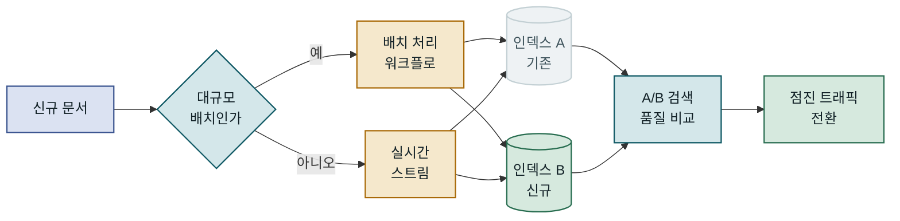

## 목차

1. 개요
2. 멀티모달 RAG의 핵심 구조
3. PDF 파싱과 요소 추출
4. 멀티모달 임베딩과 인덱싱
5. 검색 파이프라인 구현
6. 운영 환경 고려사항
7. 맺음말

---

## 개요

### 문서 이해의 새로운 난제

현대 기업 환경에서 생산되는 PDF 문서의 상당수는 텍스트만으로 구성되지 않습니다. 재무 보고서에는 분기별 수치를 담은 복잡한 표가, 기술 매뉴얼에는 회로도와 플로차트가, 연구 논문에는 실험 결과 그래프가 함께 포함되어 있습니다. 이런 문서에서 "3분기 영업이익 추이를 보여주는 차트에서 반등 시점을 찾아줘"라는 질문에 답하려면 텍스트 임베딩 기반의 검색만으로는 구조적으로 불가능합니다. 멀티모달 RAG(Retrieval-Augmented Generation)는 이미지·표·수식이 혼재하는 복합 문서에서도 의미 기반 검색과 언어 모델 생성이 작동하도록 설계된 파이프라인입니다. 이 글에서는 이미지와 표가 포함된 PDF를 처리하는 전체 파이프라인을 파싱 전략부터 벡터 인덱스 설계, 하이브리드 검색, 응답 생성까지 순서대로 다룹니다.

### 기존 텍스트 RAG의 한계

전통적인 RAG 시스템은 PDF에서 텍스트를 추출한 뒤 청크로 분할하고, 각 청크를 텍스트 임베딩 벡터로 변환하여 벡터 데이터베이스에 저장합니다. 이 방식은 텍스트 밀도가 높은 문서에서는 충분히 잘 작동하지만, 시각적 정보가 핵심인 문서에서는 세 가지 구조적 결함이 드러납니다.

첫째, 이미지는 검색 대상에서 완전히 제외됩니다. PDF 파서가 이미지를 건너뛰거나 `[Figure 1]` 같은 자리표시자로 대체하면, 그 이미지가 담고 있는 핵심 정보는 검색 인덱스에 존재하지 않는 것과 마찬가지입니다. 둘째, 표 구조가 파괴됩니다. `pdfminer`나 `PyPDF2` 같은 일반 파서로 추출한 표는 행·열 구분이 무너진 채 평문으로 이어지는 경우가 많고, 이런 텍스트는 의미 있는 임베딩 벡터를 만들기 어렵습니다. 셋째, 그림과 해당 설명(caption) 사이의 의미적 연결이 단절됩니다. 모델은 "그림 3"이라는 텍스트와 실제 그림 내용을 연결할 방법이 없습니다. 멀티모달 RAG는 이 문제를 텍스트·이미지·표를 각각 다른 방법으로 처리하는 파이프라인을 통해 해결합니다.

---

## 멀티모달 RAG의 핵심 구조

### 파이프라인 개요

멀티모달 RAG 파이프라인은 크게 두 단계로 나뉩니다. **오프라인 인덱싱 단계**에서는 원본 문서를 파싱하고 요소별로 분류·임베딩·저장합니다. **온라인 검색 단계**에서는 사용자 질의를 분석하여 관련 요소를 가져온 뒤, 멀티모달 LLM이 최종 응답을 생성합니다. 두 단계를 명확히 분리하는 이유는 인덱싱은 비동기·배치로 처리하더라도 검색은 실시간으로 응답해야 하는 요구가 다르기 때문입니다.

```diagram
2026-10-02-1cb47ab1-01
```

파싱 품질이 전체 파이프라인 품질의 상한선을 결정하기 때문에, 파서 선택과 후처리 로직이 가장 중요한 설계 결정입니다.

### 문서 파싱 전략

문서 파싱에는 크게 세 가지 접근 방식이 있습니다. **규칙 기반 파서**(PyMuPDF, pdfplumber)는 속도가 빠르고 비용이 낮지만, 복잡한 레이아웃이나 스캔 문서에서 성능이 급격히 떨어집니다. **레이아웃 인식 모델**(LayoutParser, Unstructured.io)은 딥러닝 모델이 영역을 감지하므로 품질이 훨씬 높지만, 처리 시간이 길어집니다. **비전-언어 모델 기반 파싱**(GPT-4o, Claude 3.5 Sonnet)은 가장 정확하지만 페이지당 API 비용이 발생합니다.

| 방식 | 정확도 | 속도 | 비용 | 언제 선택하나 |
|---|---|---|---|---|
| 규칙 기반 파서 | 낮음~중간 | 매우 빠름 | 거의 없음 | 텍스트 위주 디지털 PDF |
| 레이아웃 인식 모델 | 높음 | 중간 | 낮음 | 표·그림 혼합 문서 |
| VLM 기반 파싱 | 매우 높음 | 느림 | 높음 | 스캔 문서·고정밀 필요 시 |

### 임베딩 전략 선택

멀티모달 RAG에서 가장 중요한 설계 결정 중 하나는 **이미지를 어떤 형태로 임베딩할지**입니다. 세 가지 전략이 현재 주로 활용됩니다. 첫 번째는 이미지를 텍스트로 요약한 뒤 텍스트 임베딩하는 방식으로, 기존 검색 인프라를 그대로 재사용할 수 있지만 VLM 호출 비용이 발생하고 시각 정보 일부가 소실됩니다. 두 번째는 CLIP 계열 멀티모달 임베딩으로 텍스트와 이미지를 같은 벡터 공간에 직접 투영하며, 추론 비용이 낮고 실시간 처리에 적합합니다. 세 번째는 ColPali 같은 후기 상호작용 모델로 페이지 이미지 자체를 패치 토큰으로 인코딩하며 정밀도가 높지만 저장 공간을 많이 요구합니다.

```diagram
2026-10-02-1cb47ab1-02
```

세 전략 중 하나만 고르는 것이 아니라, 문서 내 요소 유형에 따라 혼합 적용하는 것이 현실적으로 더 효과적입니다.

---

## PDF 파싱과 요소 추출

### 텍스트·이미지·표 분리

PDF 파싱의 핵심 과제는 단순히 텍스트를 추출하는 것이 아니라 페이지 내 각 요소의 **경계 박스(bounding box)와 유형을 함께 인식**하는 것입니다. `Unstructured.io`의 `partition_pdf` 함수나 `pymupdf4llm`은 이 작업을 어느 정도 자동화해 주지만, 실제 프로젝트에서는 문서마다 레이아웃이 달라 후처리 로직이 반드시 필요합니다.

표 인식에서 자주 만나는 함정은 **병합된 셀**입니다. HTML 표의 `colspan`·`rowspan`에 해당하는 구조를 PDF에서 복원하려면 좌표 기반 알고리즘이 필요하며, 이를 제대로 처리하지 못하면 숫자 데이터가 뒤죽박죽 섞이게 됩니다. `pdfplumber`의 `extract_tables` 메서드나 `Camelot` 라이브러리는 격자선 기반 표 추출에 강점이 있지만, 격자선 없는 표(borderless table)에서는 별도의 휴리스틱이 필요합니다. 이미지 추출에서는 **벡터 그래픽과 래스터 이미지를 구분**하는 것도 중요합니다. PyMuPDF의 `get_drawings()` 메서드는 벡터 그래픽을 SVG 형태로 추출할 수 있으며, 텍스트 레이어가 포함되어 있어 이후 임베딩 품질이 더 높아집니다.

다음은 PyMuPDF를 사용해 페이지별 텍스트 블록과 이미지를 일괄 추출하는 기본 뼈대입니다. 실제 파이프라인에서는 여기에 표 감지 로직과 이미지 필터링(너무 작은 아이콘 제외 등)을 추가해야 합니다.

```python
import fitz  # PyMuPDF

def extract_page_elements(pdf_path: str) -> list[dict]:
    """
    PDF 각 페이지에서 텍스트 블록과 이미지를 추출합니다.
    반환 리스트의 각 항목은 type / page / bbox / content 키를 포함합니다.
    """
    doc = fitz.open(pdf_path)
    elements = []

    for page_num, page in enumerate(doc):
        # 텍스트 블록 추출 — 각 블록은 (x0, y0, x1, y1, text, no, type) 튜플
        for block in page.get_text("blocks"):
            if block[6] == 0:  # 0 = 텍스트 블록
                elements.append({
                    "type": "text",
                    "page": page_num,
                    "bbox": block[:4],
                    "content": block[4].strip()
                })

        # 이미지 추출 — xref로 바이트 데이터 접근
        for img in page.get_images(full=True):
            xref = img[0]
            base_image = doc.extract_image(xref)
            elements.append({
                "type": "image",
                "page": page_num,
                "content": base_image["image"],   # bytes
                "ext": base_image["ext"]           # "png" 또는 "jpeg"
            })

    doc.close()
    return elements
    # 결과: [{"type": "text", "page": 0, "bbox": (72, 100, 540, 120), "content": "..."}, ...]
```

`get_text("blocks")` 호출에서 block_type이 1인 경우는 이미지 블록을 나타내므로, 이를 활용하면 이미지의 페이지 내 위치(bbox)도 함께 기록할 수 있어 이후 캡션 매핑에 유용합니다.

### 레이아웃 인식 파싱

레이아웃 인식이 필요한 상황이라면 `Unstructured.io`의 Hi-Res 전략이 좋은 출발점입니다. 내부적으로 `detectron2` 기반의 레이아웃 분석 모델이 Title, NarrativeText, Table, Figure, ListItem 등 요소를 분류합니다. 단순 텍스트 추출과 달리 **문서 구조 계층**을 유지한다는 점이 핵심 장점입니다. 섹션 제목 아래의 단락들이 어느 섹션에 속하는지 메타데이터로 기록되므로, 검색 후 컨텍스트 확장 시 관련 섹션 전체를 함께 불러오는 것이 가능해집니다.

```diagram
2026-10-02-1cb47ab1-03
```

섹션 계층 메타데이터를 보존하면 검색된 요소의 맥락 품질이 크게 향상됩니다.

### 추출 결과의 정규화

각기 다른 파서에서 나온 결과를 통합하려면 **공통 스키마(canonical schema)**가 필요합니다. 최소한 `element_id`, `doc_id`, `page_num`, `element_type`, `content`, `bbox`, `parent_section` 필드를 포함하는 구조를 정의하고, 모든 파서 출력을 이 형식으로 변환하는 어댑터 계층을 두는 것이 권장됩니다. 이렇게 하면 나중에 파서를 교체하더라도 다운스트림 파이프라인 코드를 수정할 필요가 없습니다.

이미지의 경우 추출 후 **이미지 전처리 단계**가 효과를 발휘합니다. 너무 작은 아이콘(예: 32×32픽셀 이하)은 제거하고, 흑백 스캔 이미지는 대비를 높여 OCR 정확도를 개선하며, 페이지 전체 스크린샷은 영역별로 분할하는 작업이 이에 해당합니다. 특히 이미지와 바로 아래 캡션 텍스트를 명시적으로 연결해 메타데이터로 저장해두면, 검색 후 LLM에 전달하는 컨텍스트가 훨씬 풍부해집니다.

---

## 멀티모달 임베딩과 인덱싱

### CLIP vs. ColPali 비교

멀티모달 임베딩 모델 선택은 파이프라인 전체의 정밀도와 비용을 결정하는 핵심 변수입니다. **CLIP**(Contrastive Language-Image Pretraining)은 OpenAI가 공개한 이후 사실상 멀티모달 임베딩의 baseline이 되었습니다. 텍스트 쿼리와 이미지를 같은 512차원(또는 768차원) 벡터 공간에 투영하므로, "전력 소비 그래프"라는 텍스트 쿼리로 해당 차트 이미지를 직접 검색할 수 있습니다. OpenCLIP이나 `sentence-transformers`의 `clip-ViT-B-32` 같은 오픈소스 구현을 사용하면 추론 비용이 낮고 로컬 배포도 가능합니다.

**ColPali**는 2024년 이후 주목받기 시작한 접근 방식으로, PaliGemma 같은 비전-언어 모델을 이용해 문서 페이지 이미지 전체를 패치 단위 토큰 시퀀스로 인코딩합니다. 그 후 late interaction(MaxSim 연산)으로 쿼리 토큰과 문서 패치 사이의 유사도를 계산합니다. 이 방식은 표나 수식처럼 텍스트-이미지 경계에 걸쳐있는 요소에서 CLIP보다 높은 재현율을 보입니다. 단점은 페이지당 수백 개의 패치 토큰을 저장해야 하므로 저장 공간이 CLIP 대비 수십 배 더 필요하다는 점입니다.

| 항목 | CLIP | ColPali |
|---|---|---|
| 인코딩 단위 | 전체 이미지 1벡터 | 패치별 다중 토큰 |
| 검색 방식 | 코사인 유사도 | MaxSim late interaction |
| 저장 공간 | 낮음 (1×D) | 높음 (N_patches×D) |
| 재현율 | 중간 | 높음 |
| 처리 속도 | 빠름 | 느림 |
| 언제 선택하나 | 빠른 프로토타입·대용량 | 고정밀·문서 검색 특화 |

```diagram
2026-10-02-1cb47ab1-04
```

CLIP은 속도가, ColPali는 정밀도가 강점입니다. 두 모델을 병렬로 실행하는 앙상블 전략도 가능하며, 이 경우 RRF로 점수를 합산합니다.

### 벡터 인덱스 설계

멀티모달 RAG에서 벡터 인덱스를 설계할 때 핵심 결정은 **단일 컬렉션 vs. 요소 유형별 분리 컬렉션**입니다. 단일 컬렉션은 구현이 단순하지만, 텍스트와 이미지 벡터의 차원·분포 특성이 달라 검색 품질이 저하될 수 있습니다. 요소 유형별로 컬렉션을 분리하면 각 유형에 최적화된 HNSW 파라미터(`m`, `ef_construction`)를 별도로 적용할 수 있지만, 쿼리 시 여러 컬렉션을 병렬로 조회하는 라우팅 로직이 필요합니다.

**Qdrant**나 **Weaviate**는 멀티벡터 필드를 지원하므로, 같은 문서 요소에 대해 텍스트 임베딩과 이미지 임베딩을 모두 저장한 뒤 검색 시 가중치를 조정하는 것이 가능합니다. 표처럼 텍스트 요약본과 이미지 렌더링을 동시에 저장해야 하는 경우 특히 유용한 방식입니다.

### 메타데이터 전략

벡터 인덱스에 저장되는 메타데이터는 검색 후 필터링과 컨텍스트 재구성에 결정적 역할을 합니다. 최소한 `doc_id`, `page_num`, `element_type`, `parent_section_title`, `caption`(이미지·표의 경우), `language` 필드를 포함해야 합니다. 특히 `parent_section_title`은 검색된 요소가 문서 내 어느 맥락에 속하는지 LLM이 파악할 수 있게 해주므로, 응답 품질에 직접 영향을 미칩니다.

> **핵심 규칙**: 이미지 임베딩에는 반드시 해당 이미지의 캡션과 주변 단락 텍스트를 메타데이터로 함께 저장할 것. 검색 후 LLM에 전달할 컨텍스트가 크게 풍부해집니다.

---

## 검색 파이프라인 구현

### 쿼리 라우팅과 하이브리드 검색

사용자 질의가 들어오면 파이프라인은 가장 먼저 이 질의가 **텍스트 중심인지, 시각 정보를 요구하는지**를 판단해야 합니다. "3분기 매출이 얼마야?"는 텍스트 검색만으로 충분하지만, "영업이익 추이 그래프에서 반등 구간을 찾아줘"는 이미지 검색이 필수입니다. LLM을 이용한 간단한 의도 분류기를 앞단에 두거나, 질의 키워드에서 시각적 지시어(그래프, 표, 차트, 다이어그램 등)를 감지하는 규칙 기반 필터를 사용하는 방법이 있습니다. 두 방식을 조합하면 분류 정확도와 응답 속도 사이에서 균형을 맞출 수 있습니다.

**하이브리드 검색**은 밀집 벡터 검색(ANN)과 희소 키워드 검색(BM25)을 결합하는 방식입니다. 고유명사·제품코드처럼 임베딩이 잘 되지 않는 정확한 문자열에는 BM25가 강하고, 의미적 유사성이 있는 표현에는 ANN이 강합니다. 두 방식의 점수를 `RRF(Reciprocal Rank Fusion)` 알고리즘으로 결합하면 둘의 장점을 모두 취할 수 있으며, 이 방식은 별도의 가중치 튜닝 없이도 안정적인 성능을 보입니다.

```diagram
2026-10-02-1cb47ab1-05
```

의도 분석에서 라우팅이 결정되고, RRF에서 두 검색 방식의 결과가 하나로 합쳐집니다.

### 재랭킹과 컨텍스트 조합

벡터 검색으로 얻은 상위 K개 후보를 그대로 LLM에 넘기는 것보다 **Cross-Encoder 재랭커**로 한 번 더 정제하면 정밀도가 유의미하게 올라갑니다. Cross-Encoder는 쿼리와 문서를 쌍으로 입력받아 관련도 점수를 출력하는 모델로, Bi-Encoder 기반 벡터 검색보다 느리지만 훨씬 정확합니다. 일반적으로 벡터 검색으로 50~100개를 가져온 뒤, Cross-Encoder로 5~10개로 압축하는 two-stage 전략을 사용합니다.

이미지가 검색된 경우에는 해당 이미지를 직접 LLM 컨텍스트에 포함하거나, 사전에 생성해둔 이미지 요약 텍스트를 포함하는 방식 중에서 선택해야 합니다. GPT-4o나 Claude 3.5 Sonnet처럼 네이티브 멀티모달 입력을 지원하는 LLM을 사용한다면 이미지를 직접 포함하는 것이 더 정확합니다. 텍스트 전용 LLM이라면 요약 텍스트를 사용해야 하므로, 인덱싱 단계에서 미리 요약을 생성해두는 것이 좋습니다.

```diagram
2026-10-02-1cb47ab1-06
```

재랭킹 후 컨텍스트를 어떻게 구성하느냐가 최종 응답 품질을 좌우합니다.

### 응답 생성 단계

멀티모달 RAG의 응답 생성 단계에서는 단순 텍스트 RAG와 달리 **어떤 요소를 얼마나 많이 컨텍스트에 포함할지** 세밀한 제어가 필요합니다. 이미지는 토큰을 많이 소모하므로(GPT-4o 기준 고해상도 이미지 1장 ≈ 700~1400 토큰), 관련도 점수가 낮은 이미지는 요약 텍스트로 대체하고 높은 이미지만 원본을 포함하는 전략이 비용 효율적입니다.

```python
from openai import OpenAI
import base64

client = OpenAI()

def generate_answer(query: str, retrieved_elements: list[dict]) -> str:
    """
    검색된 텍스트·이미지 요소를 조합하여 멀티모달 LLM 응답을 생성합니다.
    관련도 점수 0.7 이상인 이미지만 원본 bytes로 포함합니다.
    """
    content = [{"type": "text", "text": f"질문: {query}\n\n참조 자료:"}]

    for elem in retrieved_elements:
        if elem["element_type"] == "text":
            content.append({
                "type": "text",
                "text": f"[{elem['doc_id']} p.{elem['page']}] {elem['content']}"
            })
        elif elem["element_type"] == "image":
            if elem["score"] >= 0.7:  # 고관련도 이미지: 원본 포함
                b64 = base64.b64encode(elem["content"]).decode()
                content.append({
                    "type": "image_url",
                    "image_url": {"url": f"data:image/png;base64,{b64}", "detail": "high"}
                })
            else:                     # 저관련도 이미지: 요약 텍스트만 포함
                content.append({
                    "type": "text",
                    "text": f"[이미지 요약 — {elem['doc_id']} p.{elem['page']}] {elem.get('caption', '')} / {elem.get('summary', '')}"
                })

    content.append({
        "type": "text",
        "text": "\n답변에 출처(문서명·페이지·요소 유형)를 반드시 명시하세요."
    })

    response = client.chat.completions.create(
        model="gpt-4o",
        messages=[{"role": "user", "content": content}],
        max_tokens=1024
    )
    return response.choices[0].message.content
    # 결과: 출처가 포함된 답변 문자열 (예: "3분기 영업이익은 ... [보고서.pdf p.12 표]")
```

관련도 점수 임계값(0.7)은 정밀도와 비용 사이의 트레이드오프 지점입니다. 임계값을 높이면 비용이 낮아지지만 시각 정보를 놓칠 위험이 있고, 낮추면 그 반대입니다. 운영 중 로그를 수집해 단계적으로 조정하는 것이 좋습니다.

---

## 운영 환경 고려사항

### 흔한 실수와 함정

멀티모달 RAG를 처음 구축할 때 가장 자주 만나는 문제 중 하나는 **페이지 경계 단절**입니다. 페이지를 넘어가는 표나 그림이 두 페이지로 분할되면, 파서는 이를 두 개의 별개 요소로 처리합니다. 검색 시 두 조각이 각각 검색되더라도 LLM에게 이 둘이 연결된 것임을 알려주지 않으면 부정확한 답변으로 이어질 수 있습니다. 이를 방지하려면 인접 페이지의 동일 요소를 감지하는 병합 로직이 필요합니다.

두 번째 함정은 **임베딩 모델 버전 불일치**입니다. 인덱스 생성 시 사용한 임베딩 모델과 쿼리 시 사용한 모델이 다르면 코사인 유사도 계산이 의미 없어집니다. 모델 버전과 파라미터를 인덱스 메타데이터에 반드시 기록해두고, 모델 업그레이드 시에는 전체 재인덱싱을 수행해야 합니다. 세 번째는 **해상도 vs. 처리 시간 트레이드오프**입니다. 이미지를 고해상도로 저장하면 OCR·이미지 임베딩 품질이 높아지지만, 스토리지와 처리 시간이 급격히 증가합니다. 페이지당 150 DPI는 대부분의 텍스트·차트에 충분하며, 도면이나 수식이 많은 경우에만 300 DPI를 권장합니다.

```diagram
2026-10-02-1cb47ab1-07
```

세 가지 함정 모두 초기 설계 단계에서 미리 대비할 수 있는 문제들입니다.

### 모니터링과 품질 평가

멀티모달 RAG의 품질 평가는 일반 텍스트 RAG보다 훨씬 복잡합니다. 텍스트 검색의 경우 사람이 만든 Ground Truth QA 셋으로 MRR, NDCG, Hit@K 같은 지표를 측정할 수 있지만, 이미지 검색의 경우 "올바른 이미지가 검색되었는가"를 자동으로 판단하기 어렵습니다. **LLM-as-a-judge** 방식을 이용해 GPT-4o에게 검색된 이미지가 질의와 관련 있는지 평가하도록 하면 어느 정도 자동화할 수 있습니다. 이 방식은 완전하지 않지만, 인간 평가자 없이 지속적으로 품질을 추적하는 현실적인 방법으로 활용되고 있습니다.

운영 환경에서는 다음 지표를 지속적으로 추적하는 것이 좋습니다.

| 지표 | 설명 | 경보 기준 |
|---|---|---|
| 파싱 실패율 | 요소 추출 실패 비율 | > 5% |
| 이미지 임베딩 지연 | 이미지 1장 처리 시간 | > 2초 |
| 검색 재현율@5 | 상위 5개 중 관련 요소 포함률 | < 0.7 |
| 컨텍스트 토큰 사용량 | LLM 호출당 평균 입력 토큰 | > 4,000 |
| 종단간 응답 지연 | 질의 수신~응답 완료까지 | > 8초 |

### 확장성과 마이그레이션

문서 수가 증가할수록 인덱싱 파이프라인은 **배치 처리**와 **증분 업데이트**를 명확히 분리해야 합니다. 신규 문서를 실시간으로 인덱싱하는 것과 수십만 건의 기존 문서를 일괄 처리하는 것은 전혀 다른 인프라를 요구합니다. `Apache Airflow`나 `Prefect` 같은 워크플로 오케스트레이터를 사용하면 파싱 → 임베딩 → 인덱싱의 각 단계를 독립적으로 재시도하고 모니터링할 수 있습니다.

파서나 임베딩 모델을 교체할 때는 **섀도우 인덱스 전략**이 유용합니다. 기존 인덱스를 그대로 유지하면서 새 파이프라인으로 새 인덱스를 동시에 구축하고, A/B 테스트로 품질을 비교한 뒤 트래픽을 점진적으로 전환합니다.



섀도우 인덱스 전략으로 파서·모델 교체 시 서비스 단절 없이 안전하게 전환합니다.

---

## 맺음말

### 핵심 요약

멀티모달 RAG는 이미지·표·수식이 혼재하는 실제 문서에서 텍스트 전용 RAG의 구조적 한계를 극복하는 접근입니다. PDF 파싱 단계에서 요소 유형을 분리하고 각각에 적합한 임베딩 전략(텍스트 임베딩, CLIP, ColPali)을 선택하는 것이 첫 번째 핵심입니다. 검색 단계에서는 의도 분석 → 하이브리드 검색(ANN+BM25) → Cross-Encoder 재랭킹 → 컨텍스트 조합의 순서로 파이프라인을 구성합니다. 메타데이터 설계와 섹션 계층 보존이 최종 응답 품질에 생각보다 큰 영향을 미친다는 점도 반드시 고려해야 합니다. 운영 환경에서는 페이지 경계 단절, 임베딩 모델 버전 불일치, 해상도 설정 오류가 품질 저하의 주요 원인이므로, 초기 설계 단계에서 미리 대비하는 것이 중요합니다.

### 적용 판단 기준

멀티모달 RAG는 구축 비용이 텍스트 전용 RAG보다 높기 때문에, 모든 문서에 무조건 적용하는 것은 비효율적입니다. 다음 상황에서 투자 가치가 분명합니다. 처리해야 할 PDF 중 **30% 이상에 표나 그림이 핵심 정보를 담고 있는 경우**, 사용자 질의 중 **시각적 정보를 명시적으로 요구하는 비율이 20% 이상인 경우**, 또는 규제·감사 목적으로 **이미지 출처 추적이 필요한 경우**입니다. 반대로 문서가 텍스트 위주이고 표나 이미지가 보조적 역할에 그친다면, 일반 텍스트 RAG에 표 Markdown 변환 정도만 추가하는 것이 더 현실적인 선택입니다. 규모가 작다면 ColPali보다 CLIP을 먼저 도입하고, 검색 품질 로그를 통해 실제 이미지 검색 정밀도가 병목인지 확인한 뒤 점진적으로 고도화하는 것을 권장합니다.
