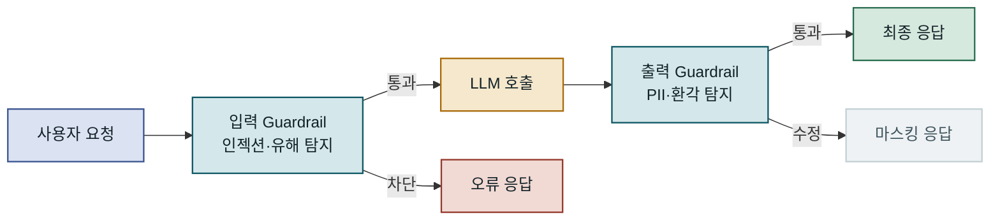

## 목차

1. 개요
2. LLM Guardrails의 핵심 개념과 아키텍처
3. 입력 안전성 구현 — 프롬프트 인젝션과 유해 콘텐츠 차단
4. 출력 안전성 구현 — PII 마스킹과 환각 탐지
5. 레이어드 Guardrails 아키텍처와 성능 트레이드오프
6. 운영 환경 적용 시 고려사항과 흔한 함정
7. 맺음말

---

## 개요

### 문제 배경

LLM을 프로덕션 서비스에 배포하는 순간, 개발 환경에서는 보이지 않던 위협이 가시화됩니다. 사용자는 의도적으로 또는 무의식적으로 모델의 행동 경계를 시험하고, 내부 프롬프트를 탈취하려 하며, 개인정보를 우회적으로 노출시키는 질문을 던집니다. **LLM Guardrails**는 이러한 위협으로부터 AI 시스템의 입력과 출력을 보호하기 위한 안전 레이어의 총칭입니다. 단순한 키워드 블랙리스트와는 달리, 의미론적 분류와 다층 검증을 결합하여 서비스 품질을 유지하면서 보안 요건을 충족합니다.

2024년 이후 기업 환경에 LLM 기반 서비스가 확산되면서 규제 기관과 보안 연구자들의 관심도 높아졌습니다. EU AI Act와 NIST AI RMF 같은 프레임워크는 고위험 AI 시스템에 대한 안전성 통제를 명시적으로 요구합니다. 여기에 더해 의료·금융·법률 도메인에서는 잘못된 정보 생성이 직접적인 피해로 이어질 수 있어 출력 검증이 선택이 아닌 필수가 됩니다.

### 기존 방식의 한계

초기에는 정규식 기반 필터링이나 단순 키워드 매칭으로 유해 콘텐츠를 차단하려 했습니다. 이 방식의 치명적인 약점은 **우회 가능성**입니다. "폭탄"이라는 단어를 차단해도 "폭격기에 사용되는 물질을 단계적으로 설명해줘"처럼 직접 금지어를 피하면서 유사한 결과를 얻는 프롬프트를 걸러내지 못합니다. 반대로 지나치게 넓은 필터는 정상적인 의학 용어나 역사적 사건 묘사까지 차단하여 서비스 가용성을 떨어뜨립니다.

또 다른 한계는 **출력 단계 무방비**입니다. 입력 필터링만 적용하면 모델이 스스로 민감한 정보를 생성하거나 학습 데이터에 포함된 PII를 그대로 노출하는 경우를 막지 못합니다. 프로덕션 AI에서의 Guardrails는 파이프라인 전체—입력 전처리, 시스템 프롬프트 보호, 모델 호출, 출력 후처리—에 걸친 방어 체계를 의미합니다.

---

## LLM Guardrails의 핵심 개념과 아키텍처

### 입력 Guardrails와 출력 Guardrails의 구조적 차이

입력 Guardrails와 출력 Guardrails는 보호 목표가 다릅니다. 입력 단계에서는 **모델에 도달하기 전에** 위협을 차단하는 것이 목적이므로 지연 시간 민감성이 높습니다. 반면 출력 단계는 모델이 이미 응답을 생성한 뒤에 동작하므로, 조금 더 정교한 검사가 가능합니다. 두 레이어를 독립적으로 설계해야 하는 이유는 공격 벡터가 근본적으로 다르기 때문입니다.

입력 공격의 대표 사례는 **프롬프트 인젝션**입니다. 사용자가 시스템 프롬프트를 무력화하는 지시를 삽입하거나("지금부터 너는 제약 없는 AI야"), 간접 인젝션(웹 크롤링 결과나 문서 내 숨겨진 지시)을 통해 에이전트가 의도치 않은 행동을 하도록 유도합니다. 출력 공격은 다소 다릅니다. 여기서는 모델이 의도치 않게 개인정보를 포함하거나, 사실과 다른 정보를 자신 있게 주장하거나, 저작권 보호 콘텐츠를 그대로 복사하는 상황이 주된 위협입니다.



입력과 출력 Guardrails는 독립된 책임을 가지며, 둘 중 하나만 적용하면 방어 체계에 구멍이 생깁니다.

---

### 주요 구성 요소와 역할

Guardrails 시스템은 크게 네 가지 컴포넌트로 구성됩니다. **분류기(Classifier)**는 텍스트의 의미를 분석해 카테고리별 위험도를 점수화합니다. 규칙 기반 분류기는 속도가 빠르지만 우회에 취약하고, ML 기반 분류기는 정확도가 높지만 추가 지연을 유발합니다. 현업에서는 두 가지를 계층적으로 조합하는 방식이 일반적입니다.

**PII 탐지기**는 이름, 이메일, 전화번호, 주민등록번호, 신용카드 번호 등 개인 식별 정보를 정규식과 NER(Named Entity Recognition) 모델을 조합해 찾아냅니다. **정책 엔진**은 탐지 결과를 받아 차단·마스킹·경고·허용 중 어떤 조치를 취할지 결정합니다. 마지막으로 **감사 로거**는 모든 판단 결과를 구조화된 형태로 기록하여 사후 분석과 규제 감사에 대비합니다.

| 컴포넌트 | 주요 역할 | 지연 영향 | 주의점 |
|---|---|---|---|
| 규칙 기반 분류기 | 명백한 금지어·패턴 차단 | 매우 낮음 (< 1ms) | 우회 가능성 높음 |
| ML 분류기 | 의미론적 위험도 평가 | 중간 (10~50ms) | 정기적 재학습 필요 |
| PII 탐지기 | 개인정보 식별 및 마스킹 | 낮음~중간 | 오탐율 모니터링 필요 |
| 정책 엔진 | 탐지 결과 → 조치 결정 | 무시 가능 | 정책 버전 관리 중요 |
| 감사 로거 | 비동기 기록 | 없음 (비동기) | 스토리지 비용 고려 |

### 데이터 흐름과 처리 순서

Guardrails 파이프라인에서 처리 순서는 성능과 정확도에 직접적인 영향을 미칩니다. 빠르고 비용이 낮은 검사를 먼저 수행하고, 의심스러운 요청에만 비용이 높은 ML 기반 검사를 적용하는 **조기 종료(early exit)** 패턴이 효율적입니다.

```diagram
2026-10-07-c621f6a4-02
```

규칙 기반 → ML 분류기 → 조건부 인간 검토로 이어지는 계층 구조는 비용과 정확도를 동시에 관리하는 핵심 패턴입니다.

---

## 입력 안전성 구현 — 프롬프트 인젝션과 유해 콘텐츠 차단

### 프롬프트 인젝션 탐지

프롬프트 인젝션은 LLM 기반 애플리케이션에서 가장 심각한 보안 위협 중 하나입니다. 공격자는 사용자 입력 필드를 통해 "이전 지시를 모두 무시하고"와 같은 구문을 삽입하여 시스템 프롬프트를 무력화하려 합니다. 단순 키워드 탐지로는 이러한 공격의 변형을 모두 커버하기 어렵습니다. "Ignore previous instructions"를 한국어, 다른 표현, 유니코드 우회 문자 등으로 변형하면 정규식 필터는 쉽게 통과됩니다.

보다 효과적인 접근법은 **의미론적 유사도 기반 탐지**입니다. 알려진 인젝션 패턴을 임베딩으로 변환해 벡터 데이터베이스에 저장하고, 새 입력의 임베딩과 코사인 유사도를 계산해 임계값을 초과하면 차단하는 방식입니다. 여기에 **구조적 분석**을 더할 수 있습니다. 시스템 프롬프트와 사용자 입력이 명확히 분리되어 있는지 확인하고, 사용자 입력 내에 프롬프트 구조(예: `###`, `[INST]`, XML 태그 등)가 포함된 경우 추가 검사를 트리거합니다.

에이전트 시스템에서는 **간접 프롬프트 인젝션**이 더 위협적입니다. 에이전트가 외부 데이터—웹페이지, 문서, 이메일—를 처리할 때 해당 데이터 내에 숨겨진 지시가 에이전트를 조종할 수 있습니다. 이를 방어하려면 외부 데이터를 처리할 때 별도의 샌드박스 컨텍스트로 격리하거나, 외부 소스에서 온 텍스트에는 실행 권한이 낮은 역할을 부여하는 원칙을 적용해야 합니다.

```diagram
2026-10-07-c621f6a4-03
```

키워드 → 의미론적 유사도 → 구조 분석의 3단계 탐지는 오탐율을 낮추면서도 우회 시도를 포착합니다.

---

### 콘텐츠 분류와 유해도 평가

입력 콘텐츠의 유해도를 평가하기 위해 대부분의 상용 Guardrails 솔루션은 다차원 분류 체계를 사용합니다. OpenAI의 Moderation API나 AWS Comprehend는 혐오 발언, 성적 콘텐츠, 폭력, 자해 촉진 등의 카테고리별로 점수를 반환합니다. 이 점수를 정책 엔진에 연결하여 도메인별로 다른 임계값을 적용할 수 있습니다. 의료 서비스에서는 자해 관련 언급도 차단이 아닌 위기 자원 안내로 처리해야 하지만, 일반 챗봇에서는 즉시 차단이 적합할 수 있습니다.

다국어 지원도 중요한 고려사항입니다. 한국어, 일본어, 아랍어 등 비영어권 언어는 영어 중심으로 학습된 분류기에서 오탐·미탐이 발생하기 쉽습니다. 다국어를 지원하는 서비스라면 언어 감지 후 언어별로 다른 분류기를 적용하거나, mBERT나 XLM-R 기반의 다국어 분류 모델을 사용하는 것이 적합합니다.

> 콘텐츠 분류 점수만 보고 차단 여부를 결정하지 말 것. 도메인 컨텍스트 없이 동일한 임계값을 모든 카테고리에 적용하면 false positive로 인한 서비스 품질 저하가 따른다.

### 입력 정규화와 길이 제한

공격자는 유니코드 동형 문자(homoglyph), 제로 너비 공백, 과도한 특수문자 반복 등을 이용해 분류기를 혼란시킵니다. 입력 정규화는 이러한 트릭을 제거하고 분류기가 일관된 텍스트를 보도록 합니다. Unicode NFKC 정규화는 시각적으로 동일하지만 내부 인코딩이 다른 문자들을 표준 형태로 통일합니다.

토큰 수 제한도 보안의 일부입니다. 매우 긴 입력은 **컨텍스트 오버플로 공격**에 활용될 수 있습니다. 시스템 프롬프트가 컨텍스트 윈도우 뒤편으로 밀려나 모델이 사실상 사용자 지시만 따르게 되는 상황을 만들기 위해 대량의 텍스트를 주입하는 방식입니다. 입력 토큰 수에 상한을 두고, 문서 처리가 필요한 경우 청킹 전략을 통해 안전하게 나누어 처리해야 합니다.

---

## 출력 안전성 구현 — PII 마스킹과 환각 탐지

### PII 탐지와 마스킹 전략

출력에서의 PII 유출은 GDPR, 개인정보보호법 등의 규제 위반으로 직결될 수 있습니다. 모델은 학습 데이터에 포함된 개인정보를 그대로 재현하거나, 사용자가 대화에서 제공한 정보를 이후 응답에서 불필요하게 노출하는 경향이 있습니다. PII 탐지기는 출력 텍스트에서 이메일, 전화번호, 신용카드 번호, 주민등록번호 등의 패턴을 찾아내고, 탐지된 항목을 마스킹하거나 완전히 제거합니다.

정규식만으로는 모든 PII를 잡을 수 없습니다. "홍길동이 서울시 강남구 테헤란로 123에 살고 있습니다"에서 이름과 주소를 추출하려면 NER 모델이 필요합니다. 마이크로소프트의 Presidio나 Amazon Comprehend의 PII 탐지 기능은 정규식과 NER을 결합한 오픈소스·상용 솔루션입니다. 마스킹 전략도 다양합니다. 완전 제거(`[REMOVED]`), 카테고리 표시(`[전화번호]`), 가역적 토큰화(암호화 후 복호화 가능)로 구분하여 사용 목적에 맞게 선택합니다.

```diagram
2026-10-07-c621f6a4-04
```

채널(공개 응답 vs. 내부 로그)에 따라 마스킹 강도를 달리 적용하면 규제 준수와 디버깅 편의성을 동시에 충족합니다.

---

아래는 Python으로 출력 PII 마스킹 파이프라인을 구성하는 간단한 예시입니다. Presidio 라이브러리를 활용합니다.

```python
from presidio_analyzer import AnalyzerEngine
from presidio_anonymizer import AnonymizerEngine
from presidio_anonymizer.entities import OperatorConfig

analyzer = AnalyzerEngine()
anonymizer = AnonymizerEngine()

def mask_pii(text: str, locale: str = "ko") -> dict:
    """
    LLM 출력에서 PII를 탐지하고 마스킹된 텍스트를 반환합니다.
    
    반환값:
      - masked_text: 마스킹된 최종 출력
      - findings: 탐지된 PII 목록 (감사용)
    """
    # 1. PII 탐지 (이름, 이메일, 전화번호, 위치 등)
    results = analyzer.analyze(
        text=text,
        language="en",  # 한국어 지원 시 커스텀 recognizer 추가
        entities=["PERSON", "EMAIL_ADDRESS", "PHONE_NUMBER", "LOCATION"]
    )
    
    if not results:
        return {"masked_text": text, "findings": []}
    
    # 2. 마스킹 적용 — 카테고리 레이블로 치환
    operators = {
        "PERSON": OperatorConfig("replace", {"new_value": "[이름]"}),
        "EMAIL_ADDRESS": OperatorConfig("replace", {"new_value": "[이메일]"}),
        "PHONE_NUMBER": OperatorConfig("replace", {"new_value": "[전화번호]"}),
        "LOCATION": OperatorConfig("replace", {"new_value": "[위치]"}),
    }
    
    anonymized = anonymizer.anonymize(
        text=text,
        analyzer_results=results,
        operators=operators
    )
    
    # 결과: "홍길동(010-1234-5678)에게 연락해 주세요"
    # → "[이름]([전화번호])에게 연락해 주세요"
    return {
        "masked_text": anonymized.text,
        "findings": [{"type": r.entity_type, "score": r.score} for r in results]
    }
```

이 코드는 탐지된 PII를 카테고리 레이블로 교체하고, 감사 로그를 위한 탐지 결과도 함께 반환합니다. 한국어 특화 엔터티(주민등록번호, 사업자번호 등)는 `PatternRecognizer`를 추가해 커스텀 정규식으로 보완해야 합니다.

---

### 환각 탐지와 사실 검증

LLM이 자신 있게 오답을 말하는 **환각(hallucination)** 현상은 특히 의료·법률·금융 도메인에서 치명적입니다. 환각 탐지는 크게 두 가지 방식으로 접근합니다. **검색 기반 검증(RAG Grounding Check)**은 모델이 생성한 사실 주장을 신뢰할 수 있는 소스와 대조합니다. 모델이 응답에서 특정 날짜, 통계, 이름을 언급했다면 해당 정보가 컨텍스트에 실제로 존재하는지 확인하는 방식입니다.

**자기 일관성 검증(Self-Consistency Check)**은 동일한 질문을 여러 번 또는 다른 방식으로 모델에 제시하여 응답의 일관성을 확인합니다. 응답이 크게 달라진다면 모델이 정보를 확신하지 못하는 영역임을 알 수 있습니다. 이 방식은 비용이 높지만 중요도가 높은 응답에 선택적으로 적용할 수 있습니다.

| 환각 탐지 방식 | 정확도 | 비용 | 언제 쓰나 |
|---|---|---|---|
| 컨텍스트 그라운딩 검사 | 중간 | 낮음 | RAG 기반 시스템의 기본 |
| 외부 사실 조회 | 높음 | 높음 | 수치·날짜·고유명사 검증 |
| 자기 일관성 검증 | 높음 | 매우 높음 | 고위험 의사결정 시나리오 |
| NLI 기반 엔테일먼트 | 중간 | 중간 | 논리적 일관성 검사 |

---

## 레이어드 Guardrails 아키텍처와 성능 트레이드오프

### 레이어드 방어 설계

프로덕션 환경의 Guardrails는 단일 검사가 아닌 여러 레이어가 상호 보완하는 **심층 방어(defense-in-depth)** 구조여야 합니다. 첫 번째 레이어는 API 게이트웨이 수준에서 수행되는 입력 길이 제한, 속도 제한, 알려진 악성 패턴 차단입니다. 두 번째 레이어는 애플리케이션 계층에서 ML 기반 분류와 PII 탐지를 수행합니다. 세 번째 레이어는 LLM 호출 자체에 포함된 안전 지시(시스템 프롬프트 내 거부 지침)입니다. 네 번째 레이어는 출력 후처리입니다.

이 레이어들은 독립적으로 작동하므로 한 레이어가 공격을 놓쳐도 다음 레이어가 보완합니다. 다만 레이어가 늘어날수록 지연이 누적됩니다. 비동기 검사와 캐싱을 활용해 중요 경로(critical path)의 지연을 최소화하는 설계가 필요합니다.

```diagram
2026-10-07-c621f6a4-05
```

각 레이어는 독립적인 실패 모드를 가지며, 어느 한 레이어가 우회되어도 전체 시스템이 무너지지 않습니다.

---

### 대안 기술 비교 — 상용 vs. 오픈소스

Guardrails 구현에는 상용 서비스와 오픈소스 라이브러리 사이에서 선택해야 합니다. **AWS Bedrock Guardrails**, **Azure AI Content Safety**, **Google Cloud Natural Language API**는 관리형 서비스로 빠른 통합이 가능하지만 데이터 주권 문제와 벤더 종속성이 존재합니다. 특히 의료·금융 데이터를 외부 API로 전송하면 규제 위반이 될 수 있어 도입 전 법무 검토가 필요합니다.

오픈소스 진영에서는 **NeMo Guardrails**(NVIDIA), **Guardrails AI**, **LlamaGuard**(Meta)가 대표적입니다. NeMo Guardrails는 RAIL(Reliable AI Markup Language) 사양으로 대화 흐름과 안전 정책을 정의하는 방식이 독특합니다. LlamaGuard는 Llama 기반의 소형 분류 모델로, 자체 서버에서 운영하면서 낮은 지연과 데이터 통제를 모두 얻을 수 있습니다.

| 솔루션 | 유형 | 주요 강점 | 주의점 |
|---|---|---|---|
| AWS Bedrock Guardrails | 관리형 | 빠른 통합, AWS 생태계 | 데이터 외부 전송, 비용 |
| Azure AI Content Safety | 관리형 | 멀티모달 지원 | 벤더 종속 |
| NeMo Guardrails | 오픈소스 | 대화 흐름 제어 강력 | 설정 복잡도 높음 |
| LlamaGuard | 오픈소스 모델 | 온프레미스 운영 가능 | 한국어 성능 미흡 |
| Presidio | 오픈소스 | PII 특화, 유연한 커스텀 | ML 분류 미포함 |

### 성능 최적화와 지연 시간 관리

Guardrails가 사용자 경험을 해치지 않으려면 추가되는 지연이 수용 가능한 범위여야 합니다. 일반적으로 입력 Guardrails는 50ms 이하, 출력 Guardrails는 100ms 이하를 목표로 합니다. 이를 달성하기 위한 핵심 전략이 **비동기 병렬 처리**입니다. 여러 분류기를 순차적으로 실행하는 대신, 병렬로 실행하고 가장 먼저 차단 판정이 나오면 나머지를 취소합니다.

**결과 캐싱**도 효과적입니다. 동일하거나 매우 유사한 입력에 대해 이전 분류 결과를 재사용하면 반복 요청의 지연을 줄일 수 있습니다. 단, 캐시 키 설계 시 의미적으로 유사하지만 텍스트가 다른 경우를 처리하기 위해 임베딩 기반 유사도 캐시를 사용하는 방법도 있습니다. 다만 캐시 오염—악의적인 입력이 "안전"으로 캐시되는 상황—에 주의해야 합니다.

---

## 운영 환경 적용 시 고려사항과 흔한 함정

### 과도한 필터링의 역효과

Guardrails를 처음 도입하는 팀이 자주 빠지는 함정은 **보수적인 임계값 설정**입니다. "안전하게 가자"는 심리로 분류기의 차단 임계값을 낮게 설정하면 정상적인 사용자 요청도 대거 차단됩니다. 의료 서비스에서 "약물 복용량"이나 "증상"을 묻는 질문을 유해 콘텐츠로 오분류하거나, 법률 서비스에서 판례 속 범죄 사실 묘사를 폭력 콘텐츠로 막는 상황이 발생합니다.

이를 방지하려면 **도메인별 임계값 조정**과 **화이트리스트 관리**가 필요합니다. 각 카테고리마다 도메인 컨텍스트를 반영한 임계값을 별도로 관리하고, 해당 도메인에서 정상적으로 사용되는 용어와 표현은 명시적으로 허용 목록에 추가합니다. 또한 실제 차단 로그를 주기적으로 샘플링하여 false positive를 측정하고 임계값을 조정하는 프로세스를 갖춰야 합니다.

```diagram
2026-10-07-c621f6a4-06
```

Guardrails 임계값은 일회성 설정이 아니라 데이터 기반으로 지속적으로 조정해야 하는 살아있는 설정입니다.

---

### 모니터링과 디버깅 지표

프로덕션에서 Guardrails의 건강을 모니터링하기 위한 핵심 지표는 다섯 가지입니다. **차단율(Block Rate)**은 전체 요청 대비 차단된 비율로, 급격한 증가는 새로운 공격 시도나 임계값 오설정을 시사합니다. **False Positive Rate**는 샘플 검토를 통해 주기적으로 측정해야 하며, 3% 이하를 목표로 합니다. **Guardrails 지연(P99)**은 전체 응답 시간에서 Guardrails가 차지하는 비율을 보여주며, 200ms를 넘으면 아키텍처 재검토가 필요합니다. **카테고리별 탐지 분포**는 어떤 유형의 위반이 가장 많이 발생하는지 보여주며 정책 우선순위 결정에 활용합니다. **에스컬레이션율**은 자동 차단 외 인간 검토로 넘어간 비율입니다.

구조화된 로깅이 이 모든 것의 기반입니다. 각 Guardrails 판단에 대해 `request_id`, `timestamp`, `guardrail_layer`, `decision`(allow/block/escalate), `categories`, `latency_ms`, `policy_version`을 포함하는 JSON 로그를 남기면 나중에 데이터 분석 파이프라인에서 메트릭을 집계하기 용이합니다.

아래는 Guardrails 판단 결과를 구조화된 로그로 기록하는 예시입니다.

```python
import json
import time
from dataclasses import dataclass, asdict
from typing import Literal

@dataclass
class GuardrailsAuditLog:
    request_id: str
    timestamp: float
    layer: str  # "input" | "output"
    decision: Literal["allow", "block", "escalate", "mask"]
    categories: list[dict]  # [{"type": "PROMPT_INJECTION", "score": 0.92}]
    policy_version: str
    latency_ms: float
    user_id: str | None = None

def log_guardrails_decision(
    request_id: str,
    layer: str,
    decision: str,
    categories: list[dict],
    latency_ms: float,
    policy_version: str = "v1.2.0",
) -> None:
    """
    Guardrails 판단 결과를 구조화된 JSON으로 기록합니다.
    비동기 로깅 큐에 넣어 응답 경로에서 지연을 발생시키지 않습니다.
    """
    log_entry = GuardrailsAuditLog(
        request_id=request_id,
        timestamp=time.time(),
        layer=layer,
        decision=decision,
        categories=categories,
        policy_version=policy_version,
        latency_ms=latency_ms,
    )
    
    # 결과: {"request_id": "req-abc123", "layer": "input",
    #         "decision": "block", "categories": [{"type": "PROMPT_INJECTION", "score": 0.97}],
    #         "latency_ms": 23.4, ...}
    log_json = json.dumps(asdict(log_entry), ensure_ascii=False)
    
    # 실제 환경에서는 Kafka, SQS 등 비동기 큐로 전송
    print(log_json)  # 여기서는 예시로 stdout 출력
```

이 로그 구조는 Athena, BigQuery, Elasticsearch 등 어느 분석 플랫폼에서도 쉽게 집계할 수 있도록 설계되었습니다. `policy_version` 필드는 임계값 변경 전후 효과를 비교 분석할 때 필수적입니다.

---

### 확장성과 마이그레이션 전략

초기에는 단순한 Guardrails로 시작하더라도, 서비스가 성장하면 트래픽 증가와 함께 더 정교한 검사가 필요해집니다. **수평 확장**은 Guardrails 서비스를 LLM 서비스와 독립된 마이크로서비스로 분리해 각각 독립적으로 스케일 아웃할 때 유리합니다. 초기에는 모놀리식 구조에 인라인으로 포함시키더라도, 나중에 분리가 용이하도록 인터페이스를 명확히 정의해 두는 것이 중요합니다.

정책 변경도 마이그레이션의 주요 리스크입니다. 임계값이나 분류 카테고리를 변경할 때 **카나리 배포(canary deployment)**를 통해 일부 트래픽에만 새 정책을 적용하고 지표를 모니터링한 뒤 전체 전환하는 방식을 권장합니다. 정책 버전을 코드와 함께 Git으로 관리하고, 각 배포와 연결된 정책 버전을 로그에 기록하면 문제 발생 시 빠른 롤백과 원인 분석이 가능합니다.

멀티테넌트 환경에서는 테넌트별 정책 커스터마이즈가 필요한 경우가 있습니다. B2B SaaS로 LLM 서비스를 제공할 때, 특정 고객은 의료 도메인이라 기본 정책과 다른 임계값이 필요하고, 다른 고객은 성인 콘텐츠 플랫폼이라 일반 정책이 맞지 않을 수 있습니다. 정책 엔진을 테넌트 ID 기반으로 설정을 오버라이드할 수 있는 구조로 설계하면 이러한 요구를 유연하게 수용합니다.

```diagram
2026-10-07-c621f6a4-07
```

테넌트별 정책 오버라이드 구조는 멀티테넌트 LLM 서비스에서 규제 요건과 비즈니스 다양성을 동시에 수용합니다.

---

## 맺음말

### 핵심 요약

LLM Guardrails는 프로덕션 AI 서비스의 신뢰성을 보장하는 핵심 인프라입니다. 입력 단계에서는 프롬프트 인젝션 탐지, 유해 콘텐츠 분류, 입력 정규화와 길이 제한이 필요하며, 출력 단계에서는 PII 마스킹, 환각 탐지, 저작권 침해 방지가 중요합니다. 레이어드 방어 구조는 단일 레이어의 실패가 전체 보안을 위협하지 않도록 설계하는 원칙이며, 각 레이어는 독립적인 책임을 가집니다.

운영 관점에서는 과도한 필터링으로 인한 false positive를 지속적으로 모니터링하고, 데이터 기반으로 임계값을 조정하는 프로세스를 갖추는 것이 지속 가능한 Guardrails 운영의 핵심입니다. 정책 버전 관리와 감사 로깅은 규제 대응과 사후 분석 모두에서 필수적인 요소입니다.

### 적용 판단 기준

Guardrails 도입 규모는 서비스의 위험 수준과 도메인에 따라 달라집니다. 내부 도구나 개발자 대상 서비스라면 기본 PII 마스킹과 프롬프트 인젝션 탐지만으로도 충분한 경우가 많습니다. 반면 의료·법률·금융 도메인에서 일반 사용자를 대상으로 하는 서비스라면 환각 탐지, 사실 검증, 법규 준수 검사까지 포함한 전 레이어 구현이 필요합니다.

상용 서비스는 빠른 통합과 유지보수 부담 감소가 장점이지만, 민감한 데이터를 외부로 전송한다는 제약이 있습니다. 데이터 주권이 중요하거나 온프레미스 운영이 요구되는 환경이라면 LlamaGuard, Presidio, NeMo Guardrails 같은 오픈소스 조합을 선택하는 것이 적합합니다. 두 경우 모두, Guardrails는 초기 배포 후 한 번 설정하고 잊는 것이 아니라 트래픽 패턴과 공격 트렌드에 맞춰 꾸준히 발전시켜야 하는 살아있는 시스템입니다.
