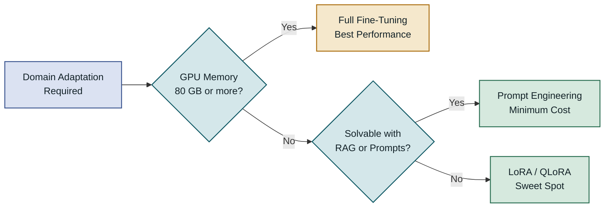
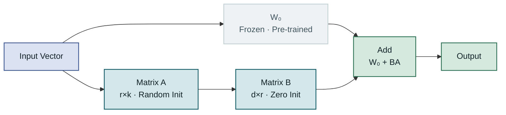
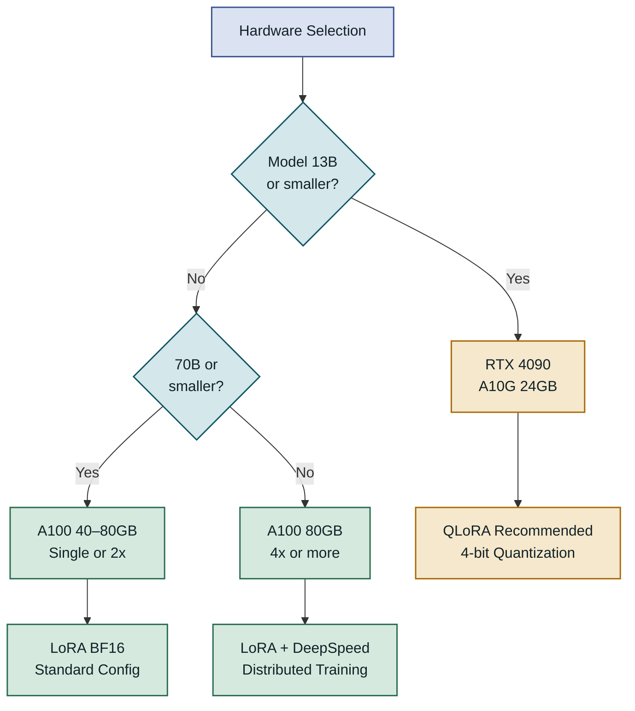
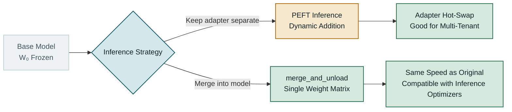
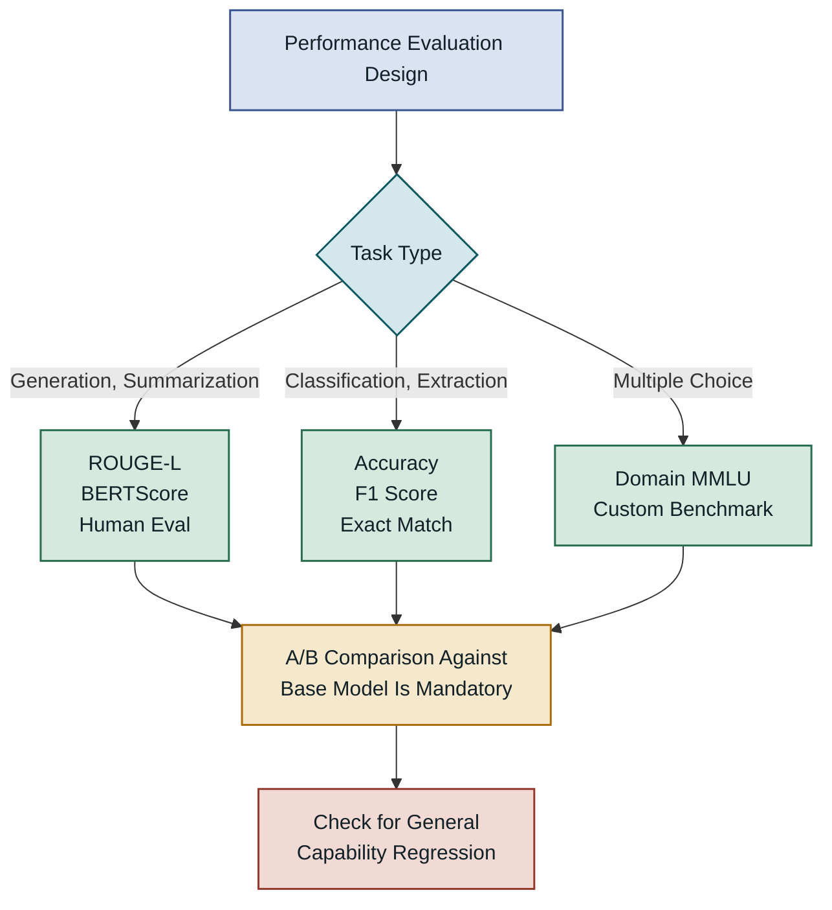
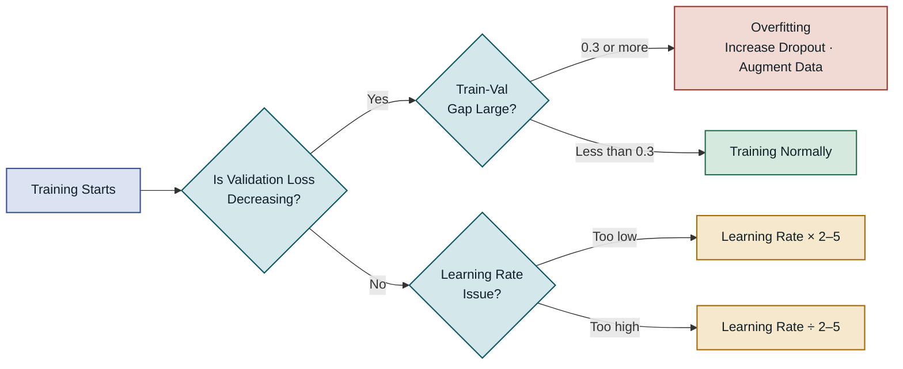
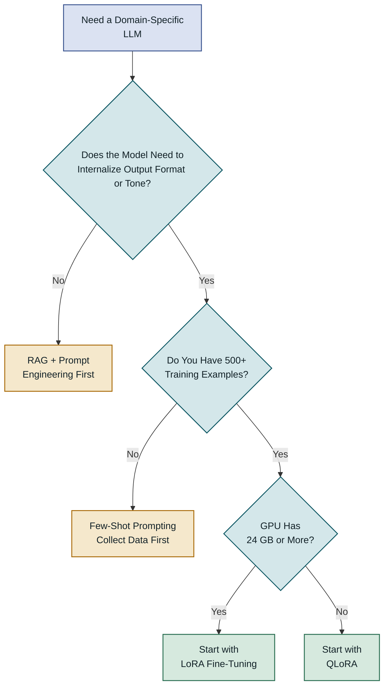

## Table of Contents

1. Overview
2. LoRA's Mathematical Principles and Internal Structure
3. Setting Up the Fine-Tuning Environment and Preparing Data
4. LoRA Fine-Tuning Implementation Steps
5. Performance Characteristics and Comparison with Alternative Techniques
6. Considerations for Production Deployment
7. Closing Thoughts

---

## Overview

### Background: The Barrier to Fine-Tuning Large Language Models

To adapt a large language model (LLM) to a specific domain or workflow, the traditional approach has been full fine-tuning, which updates every parameter. Even a relatively small model like LLaMA 3 8B requires 4 bytes per parameter in FP32, demanding roughly 32 GB of GPU memory for inference alone. Add Adam optimizer state (an extra 8 bytes per parameter) and gradient storage, and memory requirements at training time are 3–4x what inference needs. **LoRA (Low-Rank Adaptation)** is a parameter-efficient fine-tuning (PEFT) technique that breaks down this barrier: it trains fewer than 1% of total parameters while achieving domain adaptation quality close to full fine-tuning. A single RTX 4090 or A10G GPU is enough to run domain-specific fine-tuning on 7B–8B models, so even with limited resources you can specialize an open-source LLM to match your organization's language and output format.

### Limitations of the Traditional Approach

Full fine-tuning suffers not only from memory pressure but also from a structural weakness called **catastrophic forgetting**. Training for several epochs on domain-specific data alone causes the model to lose the language understanding and general world knowledge it previously had. Replay buffers and regularization techniques that prevent this substantially increase pipeline complexity. Prompt engineering and RAG (Retrieval-Augmented Generation) can patch some of these gaps, but when the model needs to consistently internalize a specific tone or output format, fine-tuning is the only option. Representative scenarios include legal document summarization, medical code classification, and learning a company's proprietary response style.



Choosing how to meet domain-specific requirements requires weighing both GPU resources and the nature of the task. LoRA is the practical path that can satisfy both constraints in a balanced way.

---

## LoRA's Mathematical Principles and Internal Structure

### The Intuition Behind Low-Rank Matrix Decomposition

LoRA was proposed in the 2021 Microsoft Research paper "LoRA: Low-Rank Adaptation of Large Language Models." The core hypothesis is that "the weight matrices of a pre-trained model have a low intrinsic dimension for the changes actually needed during fine-tuning." In other words, the update ΔW to the original weight matrix W₀ is effectively low-rank.

Formally, given a pre-trained weight W₀ ∈ ℝ^(d×k), full fine-tuning directly learns W₀ + ΔW. LoRA instead decomposes ΔW into two smaller matrices: **ΔW = BA**, where B ∈ ℝ^(d×r) and A ∈ ℝ^(r×k), with r ≪ min(d, k). `r` is the **rank**, typically a small value between 4 and 64. During training, W₀ is frozen and only B and A are updated. When d = k = 4096 and r = 8, you only need to train 65,536 parameters instead of the original 16.7 million — a roughly 256x reduction.



At the start of training, B is initialized to zero so that ΔW = BA = 0. This is a safety design that guarantees LoRA behaves identically to the original model at the beginning of training. At inference time, W₀ + BA can be precomputed and merged into a single matrix, so there is no added inference latency.

---

### Strategy for Choosing Which Layers to Apply LoRA To

LoRA can be applied to any linear layer in a transformer architecture, but which layers you target has a significant impact on performance. The original paper suggested applying it only to the query (Q) and value (V) matrices of attention, but subsequent research showed that including the key (K), output (O), and FFN (Feed-Forward Network) layers often yields better results. FFN layers in particular play an important role in storing domain-specific vocabulary and factual knowledge, so including FFN is advantageous when you want the model to learn domain language patterns.

| Target | Trainable Parameters | Performance | Memory | When to Use |
|---|---|---|---|---|
| Q, V only | Very few | Adequate for most cases | Minimum | Small datasets, overfitting concerns |
| Q, K, V, O | Few | Strong | Low | Good general starting point |
| Full attention + FFN | Moderate | Best | Moderate | Large datasets, high-precision requirements |

With small datasets (a few thousand samples or fewer), training only Q and V tends to give stable results without overfitting. For large datasets (tens of thousands or more) and tasks requiring high precision, a configuration that includes all attention layers plus FFN is recommended.

### The rank (r) and alpha (α) Hyperparameters

LoRA has two main hyperparameters. **Rank r** determines the size of the adapter matrices. A larger r means more trainable parameters, which increases expressiveness but also increases memory usage and the risk of overfitting. r = 8–16 is a reasonable starting point; for complex domain adaptation you might push to r = 32–64.

**Scaling factor α** controls the magnitude of the LoRA update. The actual scale is computed as α/r, so α = r gives a scale of 1.0. The common practice is to set α to twice the value of r (e.g., r = 8, α = 16), which makes the LoRA update contribute more strongly than the original weights. When training is unstable or the distribution gap between the target domain and the original model is large, keeping α equal to r is safer. Both values need to be tuned experimentally based on data size and domain distance — there is no single optimal setting.

---

## Setting Up the Fine-Tuning Environment and Preparing Data

### Hardware and Software Requirements

GPU memory required for LoRA fine-tuning varies by base model size, batch size, sequence length, and LoRA configuration. The table below shows approximate memory requirements at BF16 precision with LoRA r = 16.

| Model Size | Minimum GPU | Recommended GPU | Batch × Sequence |
|---|---|---|---|
| 7B | RTX 4090 24GB | A10G 24GB | 4×512 |
| 13B | A10G 24GB (4-bit) | A100 40GB | 2×512 |
| 33B | A100 80GB | 2×A100 40GB | 4×1024 |
| 70B | 4×A100 80GB | 8×A100 80GB | 8×2048 |

In cloud environments, AWS g5.xlarge (A10G 24GB, ~$1.01/hr) and GCP a2-highgpu-1g (A100 40GB, ~$3.67/hr) are realistic choices for fine-tuning 7B–13B models.



If GPU memory is insufficient, consider **QLoRA**. QLoRA loads the base model with 4-bit NF4 (Normal Float 4) quantization and trains the LoRA adapter in BF16, making it possible to fine-tune models up to 13B on a single RTX 4090. Recommended software versions: PyTorch 2.0+, Transformers 4.38+, PEFT 0.10+, TRL 0.8+.

### Dataset Preparation and Format

The quality of your fine-tuning data determines the outcome. Quality matters far more than quantity — 1,000 well-curated samples can often outperform 100,000 noisy ones. The most widely used format for supervised fine-tuning (SFT) is the **chat format**. The Llama 3 family uses a unique chat template with special tokens like `<|begin_of_text|>`, `<|start_header_id|>`, and `<|eot_id|>`. Mistral and Mixtral use the `[INST]...[/INST]` format. Applying the wrong template prevents the model from learning role boundaries correctly, causing misbehavior at inference time such as generating user-side text when the model should be responding as the assistant.


Applying label masking (-100) to the input prompt portion to exclude it from the loss calculation is mandatory. Training without this causes the model to learn to generate the question itself.

### Tokenizer Configuration and Sequence Length

Overlooking tokenizer configuration is the most common mistake in data preprocessing. You must set `padding_side="right"`, `truncation_side="right"`, and configure `pad_token` (fall back to `eos_token` if absent). Without a `pad_token`, you will get errors during batched processing, or in some models the eos token will be used as padding, causing abnormal early termination of training.

Maximum sequence length (`max_seq_length`) scales directly with GPU memory. The attention mechanism consumes memory proportional to the square of the sequence length, so going from 512 to 1024 roughly quadruples attention memory. Analyze the token length distribution of your actual data first and set the 95th-percentile length as `max_seq_length`. **Flash Attention 2** largely mitigates this issue: it keeps memory close to linear compared to standard attention while also improving speed, and it can be enabled with a single argument, `attn_implementation="flash_attention_2"`, in Transformers 4.36+. It requires Ampere or newer GPUs (A100, RTX 3000 series or later).

---

## LoRA Fine-Tuning Implementation Steps

### Loading the Model and Configuring LoRA

Here is the core code from loading the base model to configuring the LoRA adapter. Combining Hugging Face Transformers with the PEFT library lets you complete the main setup in a few dozen lines. The example below shows loading Llama 3 8B Instruct with QLoRA on an RTX 4090 and attaching the LoRA adapter.

```python
from transformers import AutoModelForCausalLM, AutoTokenizer, BitsAndBytesConfig
from peft import LoraConfig, get_peft_model, TaskType
import torch

MODEL_ID = "meta-llama/Meta-Llama-3-8B-Instruct"

# QLoRA: 4-bit NF4 quantization cuts memory to less than half
bnb_config = BitsAndBytesConfig(
    load_in_4bit=True,
    bnb_4bit_quant_type="nf4",           # 4-bit representation optimized for normal distributions
    bnb_4bit_compute_dtype=torch.bfloat16,
    bnb_4bit_use_double_quant=True,      # Double quantization: saves an extra ~0.4 bpw
)

model = AutoModelForCausalLM.from_pretrained(
    MODEL_ID,
    quantization_config=bnb_config,
    device_map="auto",                    # Automatically distributes layers to fit GPU memory
    attn_implementation="flash_attention_2",
)
model.config.use_cache = False            # Disable KV cache during training (saves memory)

tokenizer = AutoTokenizer.from_pretrained(MODEL_ID)
tokenizer.padding_side = "right"         # Right padding is required for SFT

lora_config = LoraConfig(
    task_type=TaskType.CAUSAL_LM,
    r=16,                                # Rank: start somewhere between 8 and 32
    lora_alpha=32,                       # Scale = alpha/r = 2.0
    lora_dropout=0.05,
    target_modules=[                     # Full attention + FFN for Llama 3 architecture
        "q_proj", "k_proj", "v_proj", "o_proj",
        "gate_proj", "up_proj", "down_proj",
    ],
    bias="none",
)

model = get_peft_model(model, lora_config)
model.print_trainable_parameters()
# trainable params: 83,886,080 || all params: 8,114,569,216 || trainable%: 1.03
```

The trainable parameter percentage (~1%) printed by `print_trainable_parameters()` gives an intuitive sense of what LoRA is doing. Including the FFN layers (`gate_proj`, `up_proj`, `down_proj`) in `target_modules` is justified by evidence that FFN plays an important role in acquiring domain-specific vocabulary and concepts. Compared to targeting only attention, it roughly doubles the trainable parameters but often yields a larger performance gain.

### Training Configuration and SFTTrainer

TRL's `SFTTrainer` provides convenience features designed for supervised fine-tuning: automatic chat template application, prompt portion label masking, and sequence packing, all built in. This significantly simplifies the complex preprocessing that previously had to be done by hand. The following example shows the full flow from loading data to running training.

```python
from trl import SFTTrainer, SFTConfig
from datasets import load_dataset

dataset = load_dataset("json", data_files={
    "train": "data/train.jsonl",
    "validation": "data/val.jsonl"
})

training_args = SFTConfig(
    output_dir="./lora-llama3-domain",
    num_train_epochs=3,
    per_device_train_batch_size=4,
    gradient_accumulation_steps=4,       # Effective batch size = 4×4 = 16
    learning_rate=2e-4,
    lr_scheduler_type="cosine",
    warmup_ratio=0.05,
    bf16=True,
    gradient_checkpointing=True,         # Recompute activations to save 30–40% memory
    max_seq_length=2048,
    packing=False,
    dataset_text_field="text",
    logging_steps=10,
    eval_strategy="steps",
    eval_steps=100,
    save_steps=200,
    save_total_limit=3,
    load_best_model_at_end=True,
    max_grad_norm=0.3,                   # Recommended value for QLoRA environments
)

trainer = SFTTrainer(
    model=model,
    args=training_args,
    train_dataset=dataset["train"],
    eval_dataset=dataset["validation"],
    processing_class=tokenizer,
)

trainer.train()
trainer.save_model("./lora-adapter-final")  # Saves adapter weights only (~80–200 MB)
```

`gradient_accumulation_steps=4` is the key technique for increasing effective batch size when GPU memory is limited. Only 4 samples are on the GPU at a time, but forward passes are accumulated 4 times before the backward pass, making it behave like a batch of 16. `gradient_checkpointing=True` avoids storing intermediate activations during the forward pass, recomputing them during the backward pass instead. Training speed drops by roughly 20–30% but memory decreases by 30–40%.

### Merging the Adapter and Running Inference

After training, the LoRA adapter is saved separately from the base model (file size is tens to hundreds of MB). At inference time you have two options.



Keeping the adapter separate is advantageous for multi-tenant setups where multiple adapters are swapped on top of a single base model. `merge_and_unload()` adds ΔW = BA into W₀ to produce a single model, resulting in inference latency identical to the original model and full compatibility with inference optimization frameworks like vLLM and TensorRT-LLM, making it the recommended approach for production deployment.

---

## Performance Characteristics and Comparison with Alternative Techniques

### Comparing LoRA with Other PEFT Methods

PEFT techniques extend well beyond LoRA. Each method involves different trade-offs across trainable parameter count, performance, memory efficiency, and inference overhead. No single method is universally superior; the right choice depends on data volume, available GPU capacity, and required precision.

| Method | Trainable Params | GPU Memory | Inference Overhead | Notes |
|---|---|---|---|---|
| Full Fine-Tuning | 100% | Maximum | None | High cost, forgetting risk |
| LoRA | 0.1–1% | Low | None when merged | General-purpose, most widely used |
| QLoRA | 0.1–1% | Very low | Minor error | Best for small GPUs |
| IA³ | ~0.01% | Minimal | Slight | Limited model support |
| Prefix Tuning | ~0.1% | Low | Sequence length increases | Strong for classification |
| Prompt Tuning | ~0.001% | Minimal | Present | Only effective on large models |

**IA³ (Infused Adapter by Inhibiting and Amplifying Inner Activations)** has far fewer trainable parameters than LoRA, but mainstream model support is currently weaker and peak performance often falls short of LoRA. **Prefix Tuning** prepends learnable tokens to each layer, which works well for classification tasks but increases sequence length and thus inference cost. For the combination of versatility and performance, LoRA is currently the best default choice.

### The Relationship Between LoRA and QLoRA

QLoRA is not a variant of LoRA — it is a **combination of LoRA and 4-bit quantization**. The base model is quantized to 4-bit NF4 to reduce memory, while the adapter is trained in BF16. The 2023 QLoRA paper by Tim Dettmers et al. showed that a 33B model could be fine-tuned on a single 48 GB GPU, dramatically lowering the barrier to LLM fine-tuning for small teams.

That said, QLoRA incurs information loss from 4-bit quantization, so final performance can be slightly lower (1–3%) compared to standard LoRA with the same configuration. If memory allows, BF16-based standard LoRA is preferable for quality. Even when merging after training, small errors accumulate during the dequantization of 4-bit weights back to BF16, so this should be factored in for high-precision domains.

### Benchmarks and Measuring Actual Performance

Measuring fine-tuning performance requires choosing metrics that match your target task. Generic language understanding benchmarks (MMLU, HellaSwag, etc.) often fail to accurately reflect the gains from domain-specific fine-tuning.



Success metrics for domain fine-tuning include performance improvement on a custom test set, accuracy on domain-specific questions relative to the base model, and output format compliance rate. At the same time, **regression in general language ability** must also be measured. Low validation loss does not guarantee high performance on the actual domain task, so comparing general MMLU or MT-Bench scores before and after fine-tuning is recommended.

---

## Considerations for Production Deployment

### Common Mistakes and Pitfalls

The most frequent mistakes in LoRA fine-tuning projects are data-related. Typical examples are failing to apply the correct chat template for the model family and omitting label masking. Training without label masking causes the model to learn to generate the input prompt itself, leading to prompt repetition or role confusion at inference time. Using Hugging Face's `apply_chat_template()` method together with TRL `SFTTrainer`'s `dataset_text_field` option handles this fairly safely.

Learning rate is also critical. For LoRA fine-tuning, the appropriate range is typically 2e-4 to 3e-4 — one to two orders of magnitude higher than full fine-tuning. Too low and learning is slow; too high and the adapter weights diverge. If the gap between training loss and validation loss grows beyond 0.3, treat it as a sign of overfitting and increase LoRA dropout or augment your data.



LoRA's low trainable parameter ratio acts as a natural buffer against catastrophic forgetting, but it can still occur if you run too many epochs on domain data alone. The recommended approach is to not exceed 3–5 epochs and to stop early once validation loss passes its minimum.

### Monitoring and Debugging

Key metrics to monitor during training are training loss, validation loss, gradient norm, GPU memory usage, and throughput (tokens/sec). Weights & Biases or MLflow can visualize these metrics and track experiment history. When comparing multiple LoRA rank and alpha combinations, reproducing which configuration was effective is difficult without systematic logging.

A sudden spike in gradient norm signals training instability. Clipping with `max_grad_norm=0.3` mitigates this; 0.3 is recommended for QLoRA environments rather than the default of 1.0. NaN loss is almost always caused by a data preprocessing error (long sequences being clipped, incorrect token IDs) or an excessively high learning rate.

> **Core principle**: Fine-tuned outputs must always be validated with an A/B test against the base model. Low validation loss does not guarantee high performance on the actual domain task.

In production deployment, versioning adapters is essential. Store adapters in a Hugging Face Hub private repository or a self-hosted registry, and record training metadata alongside each adapter (data version, LoRA config, validation metrics) to ensure reproducibility. Deploying only adapter files and sharing the base model across them improves both storage costs and deployment speed.

### Scaling and Migration Strategy

Once a fine-tuned model is validated in production, further improvements often follow. LoRA adapters can be stacked in multiple stages: first train a stage-1 adapter for general instruction following, then train a stage-2 adapter on top for a specific sub-domain.

| Strategy | Description | When It Fits | Caution |
|---|---|---|---|
| Single adapter | One adapter covers the entire domain | Domain is single and homogeneous | Performance diluted if too diverse |
| Sequential merge | Merge adapter into model, then train again | Two-stage: domain adaptation then task specialization | Validation required at each stage |
| Adapter switching | Dynamically load different adapters per request | Multi-tenant service with many customers | Factor in switching latency |
| Ensemble | Parallel inference with multiple adapters, then combine | High accuracy and diversity requirements | Inference cost increases |

When the base model is upgraded (e.g., Llama 3 8B → Llama 3.1 8B), adapters need to be retrained. Because LoRA adapters are trained to match the shape of specific weight matrices, they cannot be directly reused when the model architecture changes. This makes it essential to keep the fine-tuning dataset and training scripts under version control. Since adapter training costs are low, the retraining cost when upgrading the base model is entirely manageable.

---

## Closing Thoughts

### Key Takeaways

LoRA decomposes the weight update of a large language model into low-rank matrices, training fewer than 1% of all parameters while achieving domain adaptation quality close to full fine-tuning. A single RTX 4090 is enough to domain-specialize a 7B–8B open-source LLM, and combining QLoRA with 4-bit quantization extends that range to 13B models. Data quality and correct chat template application have as decisive an impact on results as the training parameter settings. Adapters are small, separately managed files; for production deployment, merging with `merge_and_unload()` lets you serve the fine-tuned model with no inference speed penalty.

### Decision Criteria for Applying LoRA



There are three situations where LoRA fine-tuning is the right call. First, when the model needs to consistently internalize domain-specific language patterns, output format, and tone. If prompt engineering and RAG alone cannot enforce consistent format compliance, fine-tuning delivers clear improvement. Second, when your available GPU is below A100 80GB and full fine-tuning is physically impossible. LoRA and QLoRA are the practical alternatives within that constraint. Third, when you want to preserve the model's general language understanding while improving performance on a specific task. LoRA's low trainable parameter ratio naturally reduces the risk of catastrophic forgetting.

On the other hand, if you have fewer than 500 training examples, or if the behavioral change you want is simply output formatting, then system prompt optimization or few-shot prompt engineering may be faster and more cost-effective than fine-tuning. Starting fine-tuning only after a clear need has been established is the sensible approach.
