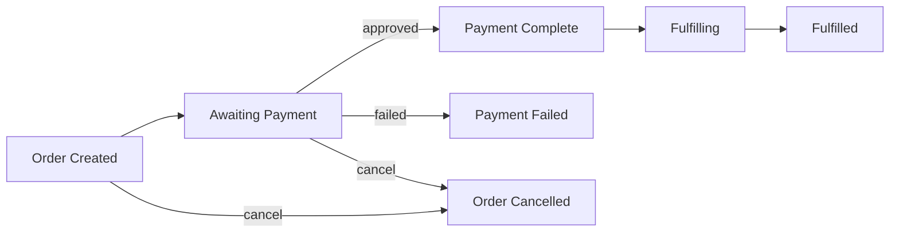
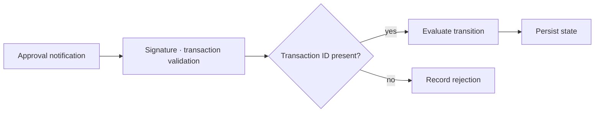
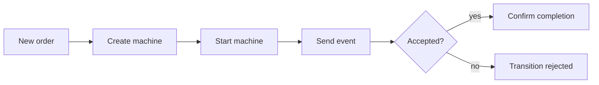
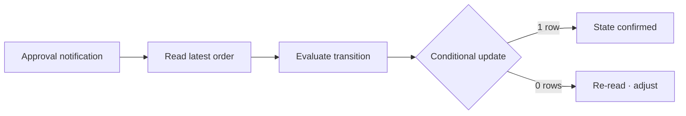
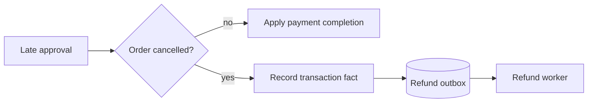
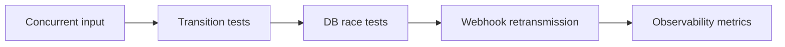
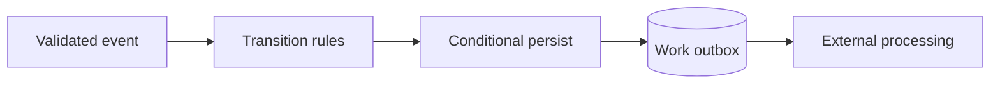

## Table of Contents

1. Separating order state from payment state first
2. Defining transition rules in Spring State Machine
3. Sending events and checking results
4. Connecting the database and payment notifications
5. Choosing and validating in production
6. Closing thoughts

---

## Separating order state from payment state first

### Why you should distinguish states from events

An order/payment flow has both **states** like `CREATED` and `PAID`, and **events** like a payment approval notification or a cancellation request. A state is a confirmed fact about the present; an event is input that tries to change that fact. If you use only two booleans, `paid` and `cancelled`, you have to decide every time what it means when both are true. Even if you centralise all the `switch` statements in one place, HTTP requests, payment provider callbacks, and batch jobs each modify state through different paths, and you can end up with disallowed combinations again.

Spring State Machine lets you declare states, events, transitions, and guards (conditions that allow a transition) in a single model. You can treat each order as the identifier for one state machine, but that alone does not solve concurrency or persistence. The first step in the design is to **explicitly define which changes are allowed**, and then make the database atomically confirm those decisions.



This diagram shows the allowed paths for order state. A path like `Payment Complete → Order Cancelled` that involves a refund is not a simple arrow here; it is handled as a separate procedure.

### Order state and payment state are not the same value

Receiving an approval response from a payment provider is not the same as deciding the order is safe to fulfill. The payment provider can process cancellations, partial cancellations, and refunds after approval, and the order can enter a shipping or service-delivery stage. It is therefore safer to keep the order table's state separate from the payment attempt and transaction table's state. For example, if an order is `CANCELLED` and a payment approval notification arrives late, record it in the payment transaction and route it to a refund or manual adjustment process. You must not flip an already-cancelled order back to `PAID`.

| Record | Question | Example states | Used in |
|---|---|---|---|
| Order | Should the goods be delivered? | `PAYMENT_PENDING`, `PAID`, `CANCELLED` | Fulfillment, customer UI |
| Payment attempt | What did the payment provider process? | `REQUESTED`, `APPROVED`, `FAILED`, `REFUNDED` | Settlement, refunds |
| Payment notification | Has this notification been handled? | Unique event ID + received-at timestamp | Deduplication, audit |

This distinction does not mean you need two state machines. The examples in this post focus on the **order state machine**, while the payment provider ledger and notification records are preserved as separate data.

---

## Defining transition rules in Spring State Machine

### The roles of states, events, and guards

A transition is defined by a source state, a target state, and an event. For example, receiving `PAYMENT_SUCCEEDED` while in `PAYMENT_PENDING` can move the machine to `PAID`. The same event arriving in `CANCELLED` has no matching transition, so the state does not change. A **guard** attaches an additional condition to a transition. You can require that a payment transaction ID be present before accepting an approval event. Guards do not replace payment provider signature verification or an actual approval lookup, however. External input must be validated before you send the event.

**Actions** are operations to run during a transition. They are convenient for safe-to-replay work such as logging or metrics, but putting external calls like payment approval requests or refunds directly inside an action makes retries and failure recovery difficult. It is better to keep transitions responsible for deciding internal state and to drive external calls from a persisted work record.



The guard only expresses the transition condition. The step that verifies the payment provider's notification is genuine belongs earlier in the flow.

### Example order transition configuration

The code below uses `@EnableStateMachineFactory` from Spring Statemachine 4.x to create a separate machine per order. What the code shows is **transition rules**; restoring and saving per-order state is covered later. It assumes that a validated payment transaction ID is passed as a message header with `PAYMENT_SUCCEEDED`.

```java
enum OrderState {
    CREATED, PAYMENT_PENDING, PAID, PAYMENT_FAILED,
    CANCELLED, FULFILLING, COMPLETED
}

enum OrderEvent {
    START_PAYMENT, PAYMENT_SUCCEEDED, PAYMENT_FAILED,
    CANCEL, START_FULFILLMENT, COMPLETE
}

@Configuration
@EnableStateMachineFactory
class OrderMachineConfig
        extends EnumStateMachineConfigurerAdapter<OrderState, OrderEvent> {

    @Override
    public void configure(StateMachineStateConfigurer<OrderState, OrderEvent> states)
            throws Exception {
        states.withStates()
                .initial(OrderState.CREATED)
                .states(EnumSet.allOf(OrderState.class));
    }

    @Override
    public void configure(StateMachineTransitionConfigurer<OrderState, OrderEvent> transitions)
            throws Exception {
        transitions
            .withExternal().source(OrderState.CREATED)
                .target(OrderState.PAYMENT_PENDING).event(OrderEvent.START_PAYMENT)
            .and().withExternal().source(OrderState.PAYMENT_PENDING)
                .target(OrderState.PAID).event(OrderEvent.PAYMENT_SUCCEEDED)
                .guard(ctx -> ctx.getMessageHeader("paymentId") instanceof String id
                        && !id.isBlank())
            .and().withExternal().source(OrderState.PAYMENT_PENDING)
                .target(OrderState.PAYMENT_FAILED).event(OrderEvent.PAYMENT_FAILED)
            .and().withExternal().source(OrderState.CREATED)
                .target(OrderState.CANCELLED).event(OrderEvent.CANCEL)
            .and().withExternal().source(OrderState.PAYMENT_PENDING)
                .target(OrderState.CANCELLED).event(OrderEvent.CANCEL)
            .and().withExternal().source(OrderState.PAID)
                .target(OrderState.FULFILLING).event(OrderEvent.START_FULFILLMENT)
            .and().withExternal().source(OrderState.FULFILLING)
                .target(OrderState.COMPLETED).event(OrderEvent.COMPLETE);
    }
}
```

In this example, `CANCEL` is only allowed before payment completes. Cancelling from `PAYMENT_PENDING` is permitted, but since a payment provider request may already be in flight, real services need additional policy for querying or cancelling the payment, and for refunding a late approval. The configuration alone does not eliminate that race.

---

## Sending events and checking results

### Testing transitions on a new order

Spring Statemachine 4.x provides a **reactive API** via `sendEvent(Mono<Message<E>>)`. If you do not subscribe to the returned `Flux`, the event is never processed. At the boundary of a synchronous application, wait for completion and check whether the result was accepted, rejected, or deferred. The example below shows the minimal flow of starting a machine for a new order and sending the first event. Applying this code as-is to an existing order would restart from the initial state, so you must restore the saved state first.

```java
StateMachine<OrderState, OrderEvent> machine =
        factory.getStateMachine(orderId.toString());
machine.startReactively().block();

Message<OrderEvent> event = MessageBuilder
        .withPayload(OrderEvent.START_PAYMENT)
        .build();
List<StateMachineEventResult<OrderState, OrderEvent>> results = machine
        .sendEventCollect(Mono.just(event))
        .block();

if (results == null || results.stream().noneMatch(result ->
        result.getResultType() == StateMachineEventResult.ResultType.ACCEPTED)) {
    throw new IllegalStateException("Transition not allowed for this order");
}
for (StateMachineEventResult<OrderState, OrderEvent> result : results) {
    result.complete().block(); // action failures surface here too
}
```

`ACCEPTED` means the machine accepted the event. It does not mean the actual approval request to the payment provider succeeded or that the database commit finished. The order API response must judge those two outcomes separately.



Result checking does not end immediately after the event call. If you use actions, you need to verify their completion signal and any errors as well.

### Per-order machines and state restoration

Sharing a single singleton machine across multiple orders will mix their states. Use `StateMachineFactory` to obtain a machine per order identifier, or use `StateMachineService` to manage machine acquisition and release. When processing an existing order, restore the machine from the state saved in the database before evaluating the event. Trusting only server memory for the machine's current state means it resets to `CREATED` after a restart and also misses the latest state processed by other instances.

Spring provides `StateMachineContext`, `StateMachinePersister`, and `StateMachineRuntimePersister`. If you are actually using hierarchical states, extended variables, or multiple regions, you may need to persist the full machine context. On the other hand, if you are only using flat order states as in the example above, **using the order table's state as the source of truth** and restoring from it on each event is simpler. If you store state in two places, decide up front which one is authoritative when they disagree.

> The current state of a single order must be read from one persistent record, not from memory spread across multiple servers.

---

## Connecting the database and payment notifications

### Conditional update after the transition decision

Even when the state machine allows a transition, two concurrent requests reading the same order can both be accepted. For instance, a cancellation request and a payment approval notification can both read `PAYMENT_PENDING` and evaluate their transitions at the same time. The final verdict must come from a **conditional database update**. Include the order state and a version number as conditions, and treat the update as successful only when exactly one row is affected. The SQL below assumes named parameters with Spring's `NamedParameterJdbcTemplate`.

```sql
UPDATE orders
SET status = :next_status,
    version = version + 1
WHERE id = :order_id
  AND status = :expected_status
  AND version = :expected_version;
```

An update count of 0 may mean another request already changed the state. Re-read the latest order and payment transaction, then determine whether this is a duplicate of the same event or a race that requires compensation. The state machine's `ACCEPTED` and SQL's **single-row update** are two separate validation steps. Saving both the order state and the payment notification record in the same transaction lets you track which events were processed even after a mid-flight failure.



If the state machine allows a transition but the conditional update fails, do not confirm that transition.

### Webhook retries and late approvals

Payment provider webhooks can be retransmitted due to network failures. Start by putting a **unique constraint** on the provider's event ID and returning the same response for an already-processed ID. Validate the webhook signature, amount, order ID, and payment transaction ID before converting it into an internal event. Each provider has different scopes for unique IDs and different retry policies, so configure the deduplication key to match the provider's contract.

If a cancellation commits first and an approval arrives later, there is no approval transition from `CANCELLED`. But discarding the notification means losing the fact that money actually moved. Record the approval in the payment transaction and raise a refund or operator adjustment. If you call the external refund API directly inside the order transaction, lock time grows due to network latency and retries. Writing a refund request to an **outbox** in the same transaction, then having a separate worker deliver it to the payment provider with an idempotency key, is more resilient to failure.



A late approval should not simply end as a rejected transition. Separating the order and payment records is what makes the refund path possible.

---

## Choosing and validating in production

### What you need to test: the transition table and race conditions

In unit tests, build a table of expected outcomes per state/event combination and verify each one. `PAYMENT_PENDING + PAYMENT_SUCCEEDED` should be accepted; `CANCELLED + PAYMENT_SUCCEEDED` should be rejected; an approval event missing a transaction ID should fail the guard. Then in integration tests, have two threads attempt cancellation and approval against the same order version and verify that only one conditional update succeeds. When payment webhooks arrive multiple times or arrive late after cancellation, notification records and refund work items must not be created more than once.

| Scenario | Expected result | Record to verify |
|---|---|---|
| Valid approval | One `PAID` transition | Order version, payment transaction |
| Same webhook retransmitted | No order state change | Notification ID unique constraint |
| Cancel and approval arrive simultaneously | Only one conditional update succeeds | Update row count, re-read result |
| Late approval after cancellation | Cancelled state preserved, refund requested | Payment transaction, outbox |

Observing transition rejection count, conditional update conflict count, payment notification latency, and pending refund work item count together makes it easier to isolate failure causes. Aggregating rejected events as simple errors makes it hard to distinguish normal duplicate requests from real design gaps.



Tests that only pass the transition table have validated half of the order/payment flow. You can only predict production behaviour once you have also verified persistence and retransmission.

### Deciding whether to adopt it in a new project

Spring Statemachine is useful when transition rules grow to include hierarchical states, guards, actions, and multiple regions. But if you only have a handful of states like `CREATED → PAID → COMPLETED`, explicit Java transition functions and conditional SQL may be smaller and easier to understand. Regardless of which approach you choose, idempotent handling of external payments, database race control, and compensation work all have to be designed separately.

Another factor in the decision is project longevity. **The official Spring Statemachine GitHub repository was archived and marked read-only on 5 July 2026.** For existing systems, check the version you are using and its dependency compatibility first. For new projects, review the maintenance outlook before committing. Ignoring this status and adding the framework as a core dependency for order and payment increases the long-term cost of change.

> A state machine is a tool for organising transition rules. The truth about payment transactions and the final verdict on concurrency belong in the persistence layer.

---

## Closing thoughts

### Key takeaways

Separating order state from payment transaction state lets you record and recover from a late approval that arrives after cancellation. Declare the allowed order transitions in Spring State Machine, validate external notifications, then deliver them as events. Even when an event is accepted, you must update the database conditionally on state and version to ensure only one of the concurrent requests is confirmed. Handle webhook retransmissions idempotently using unique IDs, and route external work like refunds through an outbox.



Following this sequence keeps the transition decision and the actual state confirmation separate, and lets you retry failed external work.

### Criteria for applying this approach

If you have few, flat states, explicitly coding the transition table and using SQL to prevent races may be enough. Spring State Machine is worth considering when state hierarchies, conditional branches, and complex event combinations grow to the point where transition rules need separate verification. That said, the archived repository status should be weighed as a maintenance risk for any new adoption. Either way, the priority is a design that does not conflate order state with payment records and does not discard late-arriving events.

> Before deciding whether to adopt the framework, verify that whichever of cancellation or approval commits first, the records of money and order remain consistent.

References: [Spring Statemachine 4.0.2 official documentation](https://docs.spring.io/spring-statemachine/docs/current/reference/index.html), [Spring Statemachine GitHub repository](https://github.com/spring-attic/spring-statemachine), [StateMachineEventResult API](https://docs.spring.io/spring-statemachine/docs/current/api/org/springframework/statemachine/StateMachineEventResult.html)
