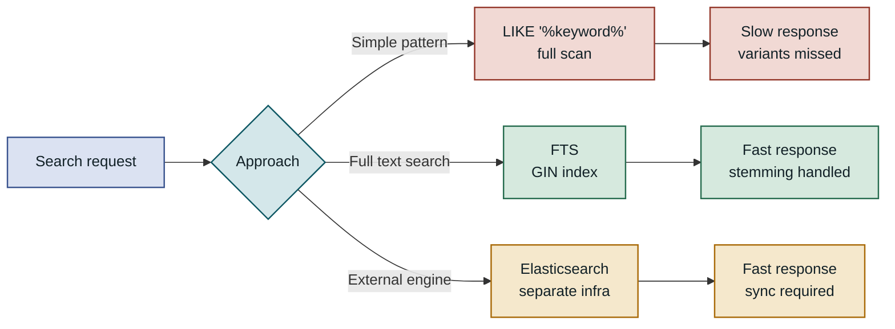
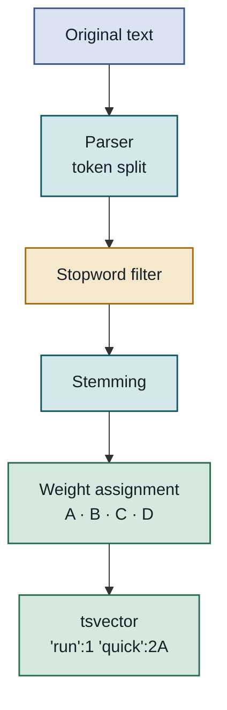
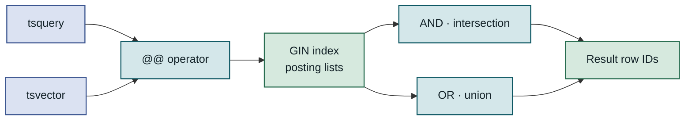
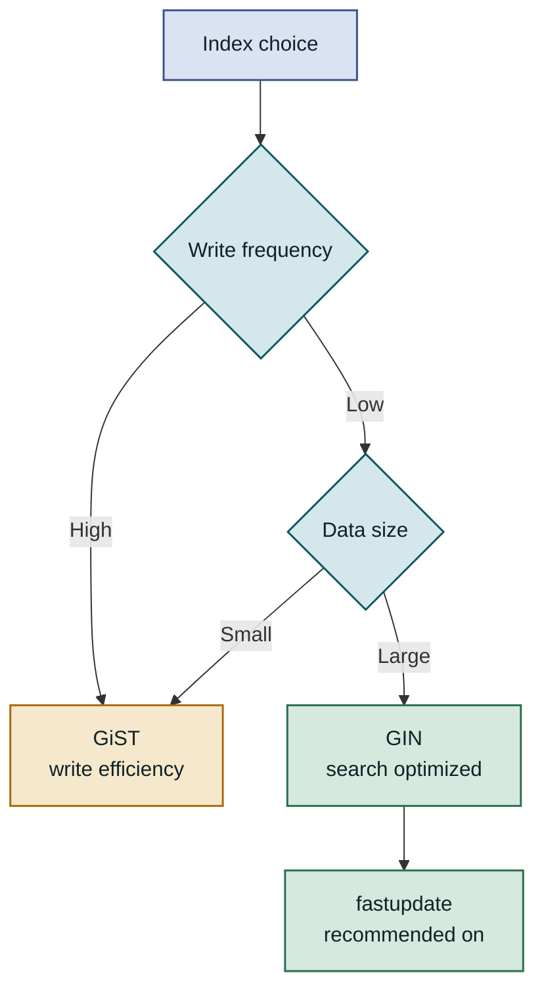
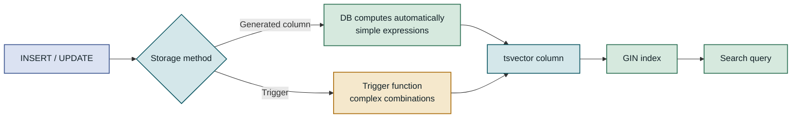
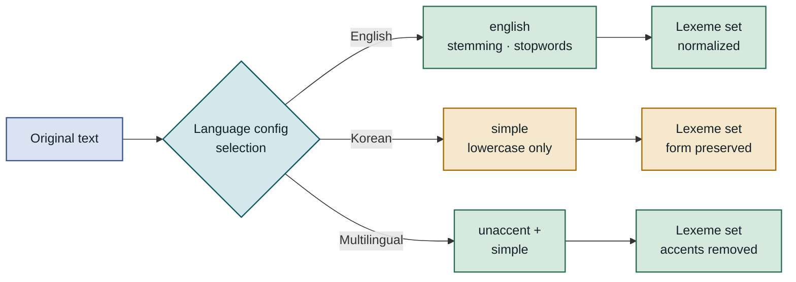
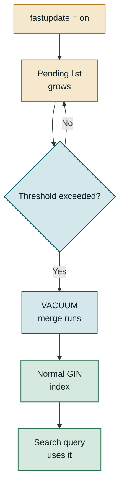

## Table of Contents

1. Overview
2. How tsvector and tsquery Work
3. GIN Index Design and Performance Characteristics
4. Implementing Search in Practice
5. Korean Search and Multilingual Handling
6. Considerations for Production
7. Closing Thoughts

---

## Overview

### Background

Text search requirements in a database generally fall into two categories: finding exact values with `=` or pattern matching with `LIKE`, and meaning-based full text search. `LIKE '%keyword%'` seems fine at first, but the moment your data crosses a few million rows, performance and quality problems hit at the same time. PostgreSQL's Full Text Search normalizes documents with `tsvector`, expresses search conditions with `tsquery`, and enables millisecond-level responses with GIN indexes. The core value is implementing meaningful full text search entirely within your existing PostgreSQL instance, with no additional infrastructure.

### Limits of the Old Approach

The biggest problem with `LIKE '%keyword%'` is that it cannot use indexes at all. A leading wildcard (`%`) causes PostgreSQL to give up on B-tree range scans and do a full sequential scan instead. On top of that, `LIKE` does simple string matching without morphological analysis, so searching for "execute" won't find "executing", "execution", or "re-execute". Both search quality and performance suffer.

Bringing in a dedicated search engine like Elasticsearch or OpenSearch solves this, but it raises operational complexity considerably: you need a synchronization pipeline, separate infrastructure, and data consistency management. PostgreSQL Full Text Search sits in the middle. If your application already uses PostgreSQL, you can get stemming-based search and index acceleration at the same time, with no additional infrastructure.



LIKE, FTS, and external search engines each carry different cost/quality tradeoffs. FTS sits in the middle, securing both operational simplicity and search quality.

---

## How tsvector and tsquery Work

### tsvector: Making Documents Searchable

`tsvector` is the result of PostgreSQL preprocessing a document. Instead of storing the original text, it compresses a list of normalized words called **lexemes** along with positional information for each word. Lexemes are produced after stopword removal, lowercasing, and stemming. For example, "Running quickly through the forest" becomes `'forest':4 'quick':2 'run':1`. "the" is removed as a stopword, "Running" is stemmed to "run", and "quickly" to "quick".

Positional information goes beyond simple presence checks: it enables phrase search and proximity search. The letters `A`, `B`, `C`, `D` appended after a position number indicate weight, with `A` being highest and `D` the default. You can use these weights to build a ranking system that scores a keyword hit in the title higher than one in the body. Weights are assigned with `setweight(to_tsvector('english', title), 'A')`, and two `tsvector` values are combined with the `||` operator.

The `to_tsvector(config, text)` function handles this conversion. The first argument `config` specifies the text search configuration. Passing `'english'` uses the English morphological analyzer and stopword dictionary. Omitting the configuration falls back to the `default_text_search_config` session variable, which is usually `'simple'` or a language matching the server locale.



The conversion from raw text to tsvector flows: parser → filter → stemming → weight assignment. Each step determines lexeme quality.

---

### tsquery: Expressing Search Conditions

`tsquery` is the type that expresses search conditions. It connects lexemes with the operators `&` (AND), `|` (OR), `!` (NOT), and `<->` (FOLLOWED BY, for phrase search). `to_tsquery('english', 'running & forest')` is internally converted to `'run' & 'forest'`. The input words go through the same normalization process as `tsvector`, so words in different forms still match.

`plainto_tsquery` is better suited for handling user input. It takes natural language without special operators and connects all words with AND. Passing "fast full text search" produces `'fast' & 'full' & 'text' & 'search'`. `websearch_to_tsquery`, on the other hand, supports Google-style search syntax: double quotes for phrase search, a minus sign for exclusion, and unquoted words joined with AND. For a search box exposed directly to users, `websearch_to_tsquery` gives the most natural experience.

| Function | Purpose | Example input | Result |
|---|---|---|---|
| `to_tsquery` | Precise control, direct operators | `'run & forest'` | `'run' & 'forest'` |
| `plainto_tsquery` | Simple AND search | `'run fast'` | `'run' & 'fast'` |
| `phraseto_tsquery` | Phrase (word-order) search | `'quick brown'` | `'quick' <-> 'brown'` |
| `websearch_to_tsquery` | User-friendly search box | `'"quick fox" -lazy'` | `'quick' <-> 'fox' & !'lazi'` |

### The Text Processing Pipeline

When `tsvector` and `tsquery` match via the `@@` operator, what PostgreSQL actually does is check the intersection of two lexeme sets. With a GIN index present, this intersection operation is replaced by a posting list lookup, handling millions of rows in milliseconds. A posting list is the list of row IDs where a given lexeme appears. GIN keeps posting lists per lexeme in sorted order, implementing AND as list intersection and OR as list union.

Because of this structure, the `@@` operation incurs cost proportional only to the number of lexemes in the condition. The less frequent a lexeme (the higher its selectivity), the shorter its posting list and the cheaper the intersection. Conversely, very common words like "data" have long posting lists and higher cost. This is why including specific words in your `tsquery` is better for performance.



When the `@@` operator uses a GIN index, AND/OR operations are handled as posting list set operations, producing results without a full table scan.

---

## GIN Index Design and Performance Characteristics

### GIN vs GiST: Which Index to Choose

PostgreSQL Full Text Search supports two index types: GIN (Generalized Inverted Index) and GiST (Generalized Search Tree). Both can index a `tsvector` column, but their internal structures and tradeoffs differ.

GIN is an inverted index structure. It stores lexeme → row ID list mappings inside a B-tree. Search is fast, especially for AND conditions where intersecting two posting lists is cheap. The downside is write cost. When a new document is inserted, the posting list for every lexeme in that document must be updated. PostgreSQL offers the `fastupdate` option to reduce this burden. Rather than applying changes immediately, it buffers them in a "pending list" and merges them all at once. Read performance improves, but a temporary spike can occur at `VACUUM` time.

GiST uses lossy compression, giving a smaller index size. A heap recheck is always required after an index scan, but write overhead is lower. It is advantageous for small datasets or write-heavy workloads. For large, read-heavy services, GIN is almost always the better choice.

| Item | GIN | GiST |
|---|---|---|
| Search speed | Fast (posting list intersection) | Slower than GIN (heap recheck) |
| Index size | Large | Small |
| Insert/update cost | High | Low |
| fastupdate support | Yes | No |
| Best for | Read-heavy, static data | Write-heavy, small data |
| Watch out for | Temporary load at VACUUM | Recheck cost |



Write frequency and data size determine which of GIN or GiST is the better fit.

---

### Index Creation and the Stored Column Strategy

Computing `tsvector` on the fly for every query has a CPU cost. Especially when combining multiple columns (title, body, tags, etc.) for search, the repeated computation becomes hard to ignore. The solution is to pre-compute `tsvector` and store it in a separate column.

Using a **generated stored column** lets PostgreSQL update it automatically. Defined with `GENERATED ALWAYS AS (...) STORED`, the expression is recomputed and stored whenever a row is inserted or updated. There is no need to manage separate application logic or triggers, making consistency easy to maintain. As of PostgreSQL 16, however, GENERATED STORED columns cannot use volatile functions inside the expression, and there are constraints when combining `setweight` across multiple columns. In those cases, a trigger-based approach is more flexible.

The trigger approach lets you freely implement complex `tsvector` combination logic inside a PostgreSQL function. A `BEFORE INSERT OR UPDATE` trigger that directly computes `NEW.search_vector` handles it. The flexibility is higher, but you need to be careful managing the trigger function and handling it in migrations.



Putting a GIN index on a pre-computed tsvector column means search queries only scan the index, with no per-query computation.

---

### Analyzing Query Execution Plans

Use `EXPLAIN (ANALYZE, BUFFERS)` to confirm the index is actually being used. If you see `Bitmap Index Scan on gin_idx`, the GIN index is active. A `Seq Scan` means the statistics are stale, or the result set is large enough that the planner chose a sequential scan. On small tables, even with an index in place, the planner often chooses a sequential scan. That is the planner making the right call, so validate execution plans at production-scale row counts (hundreds of thousands or more).

The `ts_rank` and `ts_rank_cd` functions assign relevance scores to search results. Both take a `tsvector` and a `tsquery` and return a `float4` score. `ts_rank` scores based on lexeme frequency; `ts_rank_cd` scores based on cover density, which reflects how close together the keywords appear in the document and therefore captures phrase relevance better. Both functions accept a `normalization` parameter to control whether document length is factored into the score. To correct for the bias where longer documents naturally have higher keyword frequency, use `normalization = 1` (divide by document length) or `normalization = 32` (divide by own rank).

---

## Implementing Search in Practice

### Schema Design and Adding a tsvector Column

Take blog post search as an example. The `posts` table has `title` and `body` columns, and the title should receive a higher weight than the body. Use `setweight` to assign weight `A` to the title and `C` to the body, then combine the two `tsvector` values with `||`. Defining this as a GENERATED STORED column means it updates automatically with no separate trigger.

```sql
-- Add a search column to an existing table and create a GIN index
ALTER TABLE posts
  ADD COLUMN search_vector tsvector
  GENERATED ALWAYS AS (
    setweight(to_tsvector('english', coalesce(title, '')), 'A') ||
    setweight(to_tsvector('english', coalesce(body,  '')), 'C')
  ) STORED;

CREATE INDEX idx_posts_search
  ON posts USING GIN (search_vector);
  -- fastupdate defaults to on; pending list merges are delegated to VACUUM

-- Existing rows are populated immediately (ALTER TABLE performs a full rewrite)
-- For millions of rows, run during a maintenance window or use pg_repack
```

If you don't use `coalesce` to convert NULL to an empty string, `to_tsvector` returns NULL and the entire `||` expression becomes NULL. This mistake comes up more often than you'd expect. Generated columns compute values immediately for existing rows, so running `ALTER TABLE` on a table with millions of rows triggers a full table rewrite. A tool like `pg_repack` can add the column while minimizing locks.

| Weight | Label | Recommended use |
|---|---|---|
| A | Highest priority | Title, URL slug |
| B | High | Subtitle, meta description |
| C | Medium | Tags, categories |
| D | Default | Full body text |

### Writing Search Queries and Ranking Results

Always process user input safely through `websearch_to_tsquery` or `plainto_tsquery`. Passing raw user input to `to_tsquery` directly can cause parse errors from special characters. In the search query, use `@@` for matching and `ts_rank_cd` to compute scores.

```sql
-- Basic search query: with ranking and snippet
SELECT
  p.id,
  p.title,
  ts_rank_cd(p.search_vector, query, 1) AS score,
  ts_headline(
    'english', p.body, query,
    'MaxWords=35, MinWords=15, ShortWord=3, HighlightAll=false'
  ) AS snippet
FROM posts p,
     websearch_to_tsquery('english', 'keywords to search') AS query
WHERE p.search_vector @@ query
ORDER BY score DESC
LIMIT 20;

-- score: relevance score between 0.0 and 1.0 (normalization=1 applied)
-- snippet: HTML fragment with keyword context highlighted in <b> tags
```

`ts_headline` extracts context around keywords from the body and highlights them with HTML `<b>` tags. This function **does not use the index** and processes the original text, so it must run after the WHERE clause and ORDER BY. Calling `ts_headline` on thousands of results causes a sharp performance drop. Always reduce the result set with `LIMIT` first. Control snippet length with `MaxWords` and `MinWords`, and use `ShortWord` to tune highlighting of short words.

### Compound Filters and Pagination

Full text search almost always runs alongside other filter conditions: searching within a specific category, restricting a date range, or targeting only rows with status `'published'`. Index selection strategy matters here. The PostgreSQL planner compares the selectivity of `search_vector @@ query` against conditions like `category_id = 5` to decide which index to apply first. If the category condition is more selective, filtering with the B-tree index first and then applying the GIN scan to the remaining rows can be more efficient.

For pagination, keyset pagination beats OFFSET. With OFFSET, requesting page 50 means scanning and discarding the first 950 rows, and performance degrades as you page further back. Remembering the last row's values under a `score DESC, id DESC` sort and using `WHERE (score, id) < (last_score, last_id)` on the next page keeps performance consistent. Combining Full Text Search with keyset pagination delivers consistent response times even at hundreds of thousands of rows.


`ts_headline` must be applied to a small number of rows after LIMIT to maintain performance.

---

## Korean Search and Multilingual Handling

### Language-Specific Text Search Configurations

PostgreSQL separates text search configurations by language. Use the `\dF` meta-command to list installed configurations. Major European languages like `english`, `german`, and `french` are included in the default installation. Each configuration is a combination of a parser, stopword dictionary, synonym dictionary, and stemmer.

Choosing the right language configuration matters because stemming and stopword handling differ completely by language. With the `'english'` configuration, "the", "is", and "at" are removed as stopwords. The `'simple'` configuration only lowercases and does no stemming or stopword removal. If stemming is unnecessary or the language cannot be determined, `'simple'` is a safe default. For multilingual content that must fit into a single `tsvector` column, a practical approach is to use `'simple'` with the `unaccent` extension to strip accent marks.



Different language configurations produce different lexeme quality. Without a separate extension, `simple` is the realistic best option for Korean.

---

### The Real Limits of Korean Search

PostgreSQL's default installation has no Korean-specific text search configuration. Korean morphological analyzers such as Eunjeon (MeCab-based), KoNLPy, and Komoran do not integrate directly with PostgreSQL's built-in framework. Using `'simple'` gives only lowercasing and no stemming, so "search" and "searching" are treated as different lexemes. A user typing "search" will not match documents containing "searching".

> **Key rule**: Using only PostgreSQL's built-in FTS for Korean means morphological variants cannot be handled. You must supplement it with the `pg_bigm` extension or a preprocessing approach that stores externally analyzed morphemes.

There are practical workarounds. The **pg_bigm** extension provides bigram-based full text search. Bigrams treat every pair of consecutive characters as a token. "Korean" becomes "Ko", "or", "re", "ea", "an". This enables partial string search without morphological analysis, and since it uses a GIN index, it is far faster than `LIKE '%keyword%'`. Be aware that very short words (a single character) are hard to search with bigrams, and index size grows larger.

### Korean Bigram Search with pg_bigm

Installing `pg_bigm` enables the `%` operator (similarity search) and GIN-accelerated `LIKE` search. Creating an index with `CREATE INDEX idx_title_bigm ON posts USING GIN (title gin_bigm_ops)` makes a `WHERE title LIKE '%keyword%'` query use the GIN index instead of a sequential scan. It can also be used alongside native FTS: apply `tsvector` + GIN to English fields and `pg_bigm` + GIN to Korean fields, then combine results at the query layer.

The external morpheme analysis approach extracts morphemes in the application layer (Python, Java, etc.) and stores them in a separate column. For example, extract only nouns using KoNLPy, join them with spaces into a string, store that in a `morphemes` column, and apply `tsvector` with the `simple` configuration to that column. Quality is higher, but pipeline complexity increases and you depend on the accuracy of the morphological analyzer. Between the two, `pg_bigm` has a lower setup cost; external morpheme analysis produces better search quality. Choose one or combine both depending on your service requirements.

---

## Considerations for Production

### Common Mistakes and Pitfalls

The most frequent mistake is computing `tsvector` inline on every query. Writing `WHERE to_tsvector('english', body) @@ query` in the WHERE clause means the GIN index does not activate. The index is built on the pre-computed column value, so wrapping it in a function creates a different expression the planner does not recognize as indexed. You need either a functional index or a stored computed column to activate GIN.

The second pitfall is `ts_headline` performance. This function incurs cost that scales linearly with the number of result rows. Calling `ts_headline` on 1,000 results means parsing the original text 1,000 times. Always reduce the result set with `LIMIT` before applying it. Using a CTE to explicitly separate the search step from snippet generation makes the intent clear.

The third is the interaction between `fastupdate` and `VACUUM`. With `fastupdate = on`, the GIN pending list grows and is merged into the index at `VACUUM` time. If the pending list gets too large, either run `SELECT gin_clean_pending_list('idx_posts_search')` manually or tune autovacuum settings to prevent the pending list from growing excessively.



When the fastupdate pending list exceeds the threshold, VACUUM merges it, causing a temporary write spike at that moment.

---

### Monitoring and Debugging

There are specific metrics to watch when tracking Full Text Search performance in production. Monitor `idx_scan` (number of index scans), `idx_tup_read` (index tuples read), and `idx_tup_fetch` (tuples fetched from the heap) in the `pg_stat_user_indexes` view. A zero or very low `idx_scan` signals that the index is not actually being used.

Track slow queries with the `pg_stat_statements` extension. Find Full Text Search queries with high `mean_exec_time` and analyze them with `EXPLAIN (ANALYZE, BUFFERS, FORMAT JSON)`. If `Recheck Cond` appears in a `Bitmap Heap Scan`, a recheck is happening from a GiST index or a GIN `fastupdate` pending list.

The `ts_debug(config, text)` function makes each stage of the text processing pipeline transparent. It is useful for debugging why a specific word is not being recognized as a lexeme. Use `ts_lexize(dictionary, word)` to see how a specific dictionary processes a word, and `ts_parse(parser, text)` to see what tokens the parser generates.

| Tool | Purpose | How to use |
|---|---|---|
| `EXPLAIN (ANALYZE, BUFFERS)` | Execution plan, index usage | Check for Bitmap Index Scan |
| `pg_stat_user_indexes` | Index usage statistics | Track `idx_scan` trend |
| `pg_stat_statements` | Slow query tracking | Sort by `mean_exec_time` |
| `ts_debug` | Text pipeline transparency | Diagnose unrecognized lexemes |
| `gin_clean_pending_list` | Manual pending list merge | Manage fastupdate environments |

### Scaling and Migration Strategy

As data grows past tens of millions of rows, the limits of PostgreSQL FTS become apparent. The cost of maintaining a GIN index on a single server rises, and distributed processing is not possible. At this point, migrating to Elasticsearch or OpenSearch is worth considering. As an intermediate migration step, you can use the **dual write** pattern, running PostgreSQL FTS and the external search engine in parallel. Write to both, read from PostgreSQL initially, and switch reads to the search engine once validation is complete.

The reverse migration, from Elasticsearch back to PostgreSQL, also happens. When search traffic is lower than expected, data stays below a few hundred thousand rows, or the cost of maintaining separate infrastructure outweighs the benefits. A well-designed PostgreSQL FTS setup can serve comfortably up to millions of rows. Combining partitioning with read replicas pushes the single-instance ceiling further. Full Text Search queries tend to be I/O-bound rather than CPU-bound, so distributing search load across read replicas is effective.

---

## Closing Thoughts

### Key Takeaways

PostgreSQL Full Text Search is a built-in full text search solution with `tsvector` and `tsquery` as its core types and GIN indexes as its performance structure. `tsvector` converts raw text into a lexeme set after stemming and stopword removal; `tsquery` expresses search conditions with logical operators. When the `@@` operator matches the two types, the GIN index uses posting list intersection to produce results in tens of milliseconds.

The basic pattern is: use `setweight` for field-level weighting, `ts_rank_cd` for relevance scoring, and `ts_headline` for search snippets. Pre-computing `tsvector` in a GENERATED STORED column lowers query cost. Korean requires the `pg_bigm` extension or external morpheme analysis preprocessing. The `fastupdate`/`VACUUM` interaction, when to apply `ts_headline`, and the prohibition on inline `tsvector` computation are the points most often missed in production.

### When to Use It

PostgreSQL Full Text Search is the right fit when you are already using PostgreSQL as your data store, search traffic is below a few hundred requests per second, and data size stays under tens of millions of rows. For English content, the default configuration works immediately with no extra infrastructure, keeping operational complexity low while delivering meaningful performance and quality improvements over `LIKE` search.

On the other hand, Elasticsearch or OpenSearch is more appropriate for thousands of search requests per second, data at the hundreds of millions scale, precise Korean morphological analysis, or environments where real-time indexing is required. A practical strategy that keeps initial investment low is to introduce PostgreSQL FTS first, measure actual load, and migrate to a dedicated search engine when a bottleneck actually appears.
