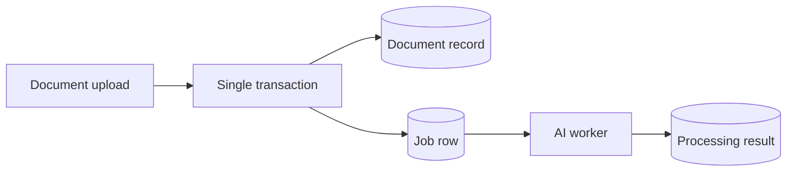
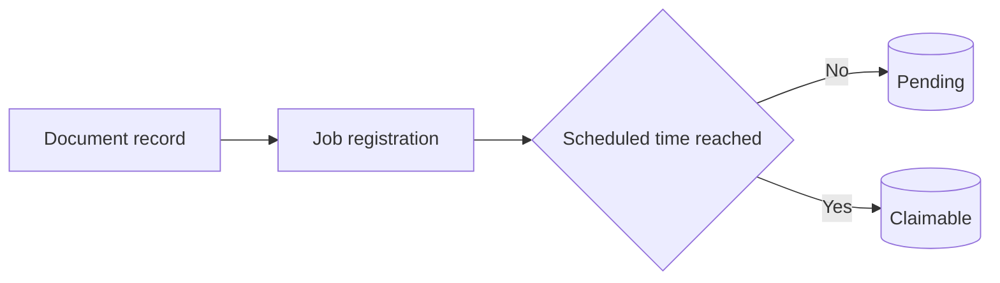
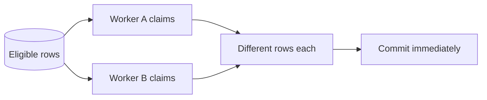
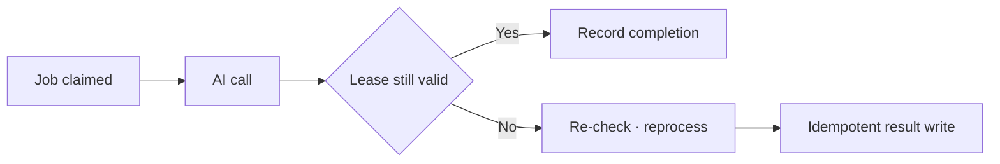
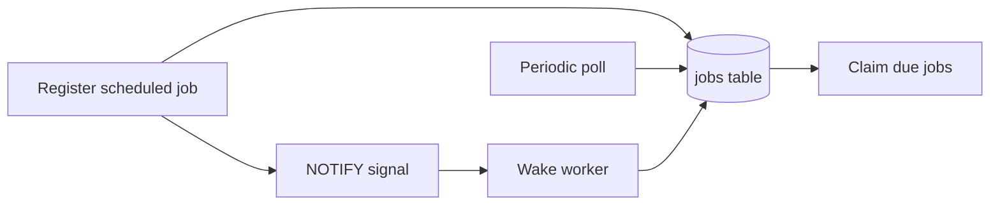
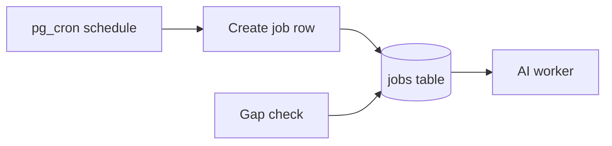
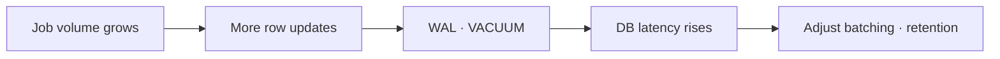
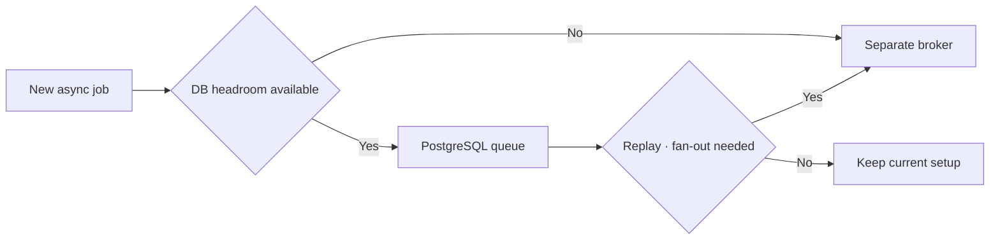
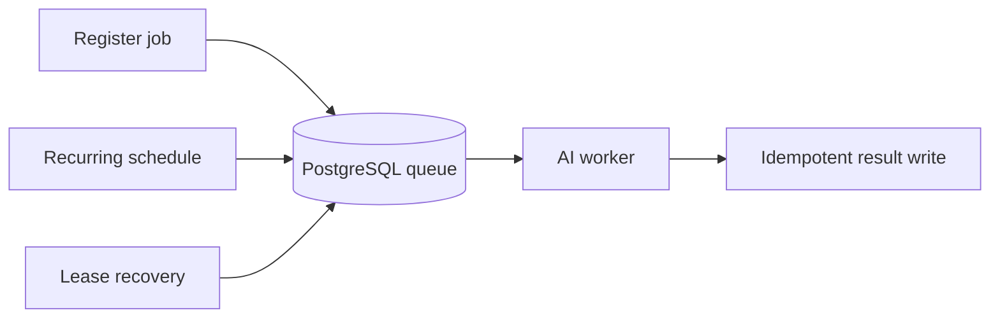

## Table of Contents

1. Why use PostgreSQL as a queue
2. Job table and atomic claim
3. Failures, duplicate runs, and lease recovery
4. Scheduled jobs and recurring schedules
5. Production bottlenecks and observability metrics
6. When a separate broker is necessary
7. Closing thoughts

---

## Why use PostgreSQL as a queue

### When AI work doesn't fit inside a synchronous request

If you try to finish AI work inside an HTTP request — text extraction after a document upload, embedding generation, image analysis, tasks that take anywhere from seconds to minutes — response times become unpredictable and failure handling gets messy. The cleaner shape is: the request registers a job and immediately returns an ID, and a worker handles it in the background. That doesn't mean you have to introduce Kafka or RabbitMQ right away. If you're already on PostgreSQL, a **queue where job rows are stored and multiple workers claim them** is worth trying first.

The key advantage of this approach is that you can put business data writes and job registration in a single transaction. You eliminate the gap where document metadata commits successfully but the message that triggers embedding generation fails to publish. The flip side is that the database is also handling your regular reads and writes. Once frequent updates and polling on job rows start affecting latency on your core tables, the isolation problem outweighs the infrastructure savings.



Committing the document and the job row together means you can check job registration status in the same database. The AI call itself happens after commit, inside the worker.

### Queue, scheduler, and worker are distinct roles

A **queue** stores work to be done and tracks who claimed it. A **scheduler** decides when a job becomes eligible to run. A **worker** actually makes the embedding API call or converts the file. PostgreSQL can store the state the first two roles need, but that doesn't mean it's a good idea to run long-lived external API calls inside the database. AI jobs in particular vary widely in execution time depending on model server rate limits, large inputs, and retry policies.

| Role | What PostgreSQL handles | What the application handles | Watch out for |
|---|---|---|---|
| Job queue | Job rows, status, scheduled time | Claiming, executing, completing | Duplicate execution |
| Schedule | Stores `run_at`, optionally runs `pg_cron` | Creating recurring jobs, recovering gaps | Timezones, failure recovery |
| AI worker | Stores results and progress | Model calls, concurrency limits | Run outside a DB transaction |

Keeping these three roles separate means that if you later move only the queue to a dedicated service, the business code that creates jobs and the worker execution code stay relatively clean.

---

## Job table and atomic claim

### What a job row needs to represent

An AI job table needs: job type, an input reference, the time the job becomes eligible to run, status, attempt count, and the expiry time of the execution lease. Rather than copying the full input document or user prompt into `payload`, storing just identifiers and necessary options makes retention and access control easier to manage. The example below uses `ready → running → done` as the happy path and routes repeated failures to `dead`. `idempotency_key` is an optional key to prevent registering duplicate jobs for the same document and model version.

```sql
CREATE TABLE jobs (
    id bigint GENERATED ALWAYS AS IDENTITY PRIMARY KEY,
    kind text NOT NULL,
    payload jsonb NOT NULL,
    status text NOT NULL DEFAULT 'ready'
        CHECK (status IN ('ready', 'running', 'done', 'dead')),
    run_at timestamptz NOT NULL DEFAULT now(),
    attempts integer NOT NULL DEFAULT 0 CHECK (attempts >= 0),
    max_attempts integer NOT NULL DEFAULT 5 CHECK (max_attempts > 0),
    lease_token uuid,
    lease_until timestamptz,
    idempotency_key text UNIQUE,
    created_at timestamptz NOT NULL DEFAULT now(),
    finished_at timestamptz
);

CREATE INDEX jobs_ready_due_idx ON jobs (run_at, id)
    WHERE status = 'ready';
CREATE INDEX jobs_running_lease_idx ON jobs (lease_until)
    WHERE status = 'running';
```

Partial indexes can help queries that only look for `ready` jobs. Jobs with a future `run_at` live in the same table, so workers read only eligible rows with `run_at <= now()`. Document upload and job registration should be wrapped in the same transaction. If duplicate registrations can happen legitimately, use `INSERT ... ON CONFLICT (idempotency_key) DO NOTHING`. The key's scope must cover all inputs that affect the outcome — something like `document ID + model version + job type`.



Scheduled and immediate jobs can be distinguished with a single `run_at` field, no separate queues needed. That said, indexes and retention policies need to be validated against real job volumes.

### Preventing two workers from claiming the same job

If a worker reads a job with `SELECT` and then updates its status in a separate `UPDATE`, two workers can see the same row. PostgreSQL's `FOR UPDATE SKIP LOCKED` skips rows locked by another transaction rather than waiting on them. The official documentation describes this as being useful precisely for **reducing lock contention between consumers on queue-like tables**. The query below selects up to 10 rows and sets them to `running` in a single statement, returning the claimed rows via `RETURNING`. `:lease_token` is a UUID the application generates fresh for each claim attempt.

```sql
WITH picked AS (
    SELECT id
    FROM jobs
    WHERE status = 'ready' AND run_at <= now()
    ORDER BY run_at, id
    LIMIT 10
    FOR UPDATE SKIP LOCKED
)
UPDATE jobs AS j
SET status = 'running',
    attempts = attempts + 1,
    lease_token = :lease_token,
    lease_until = clock_timestamp() + interval '2 minutes'
FROM picked
WHERE j.id = picked.id
RETURNING j.id, j.kind, j.payload, j.attempts, j.lease_until;
```

The claim query must run in a **short transaction and commit immediately**. Holding the row lock until the embedding API finishes puts pressure not just on other workers but on PostgreSQL's cleanup processes. `SKIP LOCKED` skips locked rows, so it does not guarantee strict FIFO order. If ordering is a business rule, a plain `ORDER BY` alone won't solve it.



The row lock prevents duplicate selection only for the duration of the claim transaction. Long-running work after commit requires separate lease and idempotency handling.

---

## Failures, duplicate runs, and lease recovery

### A lease is not a completion guarantee

If the worker process dies after claiming a job, the job stays in `running`. To recover it, you use a **lease** — an execution token that is valid only for a fixed window. A separate short-running job resets expired `lease_until` rows back to `ready`, or moves them to `dead` if `max_attempts` is exceeded. Workers that run legitimately for a long time should extend the lease periodically. Two minutes is just an example value; the real value should be set based on your job duration distribution and retry delay requirements.

When recording completion, check not just the job ID but also the **current lease token** and its expiry. The SQL below restricts the update to the specific claim attempt identified by `:id` and `:lease_token`. If the affected row count is 0, the worker may have already lost its lease or another worker may have reclaimed the job, which prevents a stale worker from overwriting results. Lease extension for long-running jobs should use the same token in the condition.

```sql
UPDATE jobs
SET status = 'done',
    lease_token = NULL,
    lease_until = NULL,
    finished_at = clock_timestamp()
WHERE id = :id
  AND status = 'running'
  AND lease_token = :lease_token
  AND lease_until > clock_timestamp();
```

The lease may have expired while the external AI API call already succeeded. Rerunning the job could duplicate API costs or result storage. This condition **only prevents a stale worker from writing a completion record** — it does not guarantee the external side effect happened exactly once. Guard against re-execution by putting a unique constraint on `document ID + model version` and using upsert for embedding results, or by passing an idempotency key to external APIs that support it.



A lease is a mechanism to prevent a job from stalling forever after a failure. The result-writing step needs to reflect the fact that it is not a mechanism to prevent duplicate execution.

### Retries and failures that need to be isolated

For a transient model API timeout, push `run_at` into the future and reset to `ready`. For an error that will fail again regardless — a malformed file format — send it straight to `dead`. Apply exponential backoff with a small random jitter so a batch of jobs that all failed at the same time doesn't all retry at exactly the same time. Jobs that reach max attempts need the failure reason and input reference preserved so you can decide whether to reprocess.

Failure writes also use `WHERE id = :id AND lease_token = :lease_token AND status = 'running'`, because the lease-recovery job and the worker's own failure write can race. The recovery job should only target rows where `lease_until < clock_timestamp()`, handle them in small batches, and branch rows where `attempts >= max_attempts` to `dead`. Even during repeated outages, cap worker concurrency to avoid hammering the database and the model API with infinite retries.

| Failure point | Retry condition | What to record | Watch out for |
|---|---|---|---|
| Transient model API failure | Retry after backoff | Error type, attempt count | Limit concurrent requests |
| Worker process killed | Recover after lease expiry | Previous lease token | External call may have run |
| Bad input | Stop retrying | Validation failure reason | Review `dead` jobs |
| Completion write failure | Re-check result, reprocess | Result idempotency key | May have already been billed |

---

## Scheduled jobs and recurring schedules

### A single `run_at` is enough for one-off scheduled jobs

For a one-off job with a fixed scheduled time, just store a future `run_at` and let workers claim rows that have come due. For example, to generate embeddings at night rather than immediately after upload, just adjust the timestamp on the job row. Store times as `timestamptz` and be explicit about which timezone you're using for display versus for execution. Even if the server and application have different timezone settings, defining the input time's timezone explicitly keeps comparisons consistent.

Workers can poll for eligible jobs on a regular interval. To reduce wait time, you can send a `NOTIFY` after a new job is registered to wake a worker up immediately. But `LISTEN/NOTIFY` **cannot replace durable job records**. Jobs registered while a connection was down or while no worker was listening must survive in the table. Use notifications as a fast wake-up signal, and keep periodic polling as a safety net that recovers missed signals.



If a notification is lost or a connection resets, periodic polling finds unprocessed rows in the table.

### Consider `pg_cron` for recurring schedules

For **recurring execution** — for instance, a schedule that creates a fresh set of embedding update jobs every day — you can use the `pg_cron` extension. `pg_cron` runs SQL commands on a schedule inside PostgreSQL. Since it's not a worker that calls an external model API directly, the pattern is: have it create job rows at a fixed time and let the application workers process those rows, as in the example below. The example assumes the extension is installed in the application database and `cron.timezone` is set to UTC.

```sql
SELECT cron.schedule(
    'daily-ai-ingest',
    '0 2 * * *',
    $$
    INSERT INTO jobs (kind, payload, run_at, idempotency_key)
    VALUES (
        'daily_ingest',
        '{}'::jsonb,
        statement_timestamp(),
        'daily_ingest:' || to_char(
            statement_timestamp() AT TIME ZONE 'UTC', 'YYYY-MM-DD'
        )
    )
    ON CONFLICT (idempotency_key) DO NOTHING
    $$
);
```

The unique key prevents the same day's job from being created twice. It does not automatically backfill days that were skipped entirely due to a database failure or a schedule misconfiguration. You need a separate procedure to check for gaps and insert the missing jobs. On managed PostgreSQL, check extension availability and permissions first. `pg_cron` itself consumes connection and background worker resources. For schedules that use daylight saving time, specific times can be skipped or repeated — consider using the **logical execution date** as the idempotency key rather than the wall-clock scheduled time.



The recurring schedule **creates** jobs; the queue **delivers** them. Both steps need idempotency keys and gap checks.

---

## Production bottlenecks and observability metrics

### The database carries the lifecycle cost of job rows

A job queue constantly updates rows along `ready → running → done` and eventually deletes or archives completed jobs. These writes produce WAL and leave dead tuples, so as job volume grows you need to watch autovacuum and index maintenance costs. If you share an instance with your business data, queue spikes can affect latency on your regular API and replication lag. `SKIP LOCKED` reduces the time workers spend waiting on the same row — it does not eliminate this write cost.

Define a retention policy and clean up completed jobs periodically. Deleting everything in one large batch can spike WAL and lock pressure; use small batches instead, or consider date-based partitioning if the scale demands it. Partitioning is not required from day one. The right first step is to run `EXPLAIN (ANALYZE, BUFFERS)` on the claim query, see how much it actually reads, and confirm the index matches the conditions.



Queue cost may show up in **how often you write and delete rows** before it shows up in raw row count.

### Look at latency and missed jobs before throughput

Watching only the count of waiting rows can produce noisy alerts because of normal scheduled jobs whose `run_at` hasn't come yet. You need to also track the **oldest wait time** of jobs that are eligible but haven't been picked up, completions and failures per unit time, and the count of expired leases. For AI jobs specifically, log model call duration and error rate per model, and track rate-limit responses from external APIs separately. You need to distinguish whether workers are slow or whether claiming is slow at the database level before you know which way to scale.

| Metric | Problem it reveals | Check first | Watch out for |
|---|---|---|---|
| Max wait time of due jobs | Worker processing lag | Worker count, model response time | Exclude future-scheduled jobs |
| Lease expiry and retry rate | Crashes, timeouts | Job duration distribution | Lease window may be too short |
| `dead` job growth | Permanent errors, retry exhaustion | Input validation, external outages | No infinite retries |
| DB writes, WAL, replication lag | Queue impact on core workload | Job row cleanup, indexes | Observe the whole instance |

In production, tune worker concurrency and claim batch size independently. Claiming a large batch doesn't help if GPU capacity or the external model call limit is the real ceiling — you end up with more lease-held rows that aren't processing. Claim only what you can handle; leave the rest in `ready` so recovery is straightforward.

---

## When a separate broker is necessary

### Conditions where PostgreSQL fits

If throughput is relatively modest, job results are tightly coupled to business data in the same PostgreSQL instance, and you can tolerate a few seconds of queuing latency, starting with a single store is a reasonable choice. You can register document state changes and embedding jobs in one transaction, and you can investigate failed jobs with plain SQL. That said, **no specific row count or throughput number can be offered as a safe threshold without measurement**. The limit depends on job size, indexes, worker count, and existing database load.

On the other hand, if you need to fan events out to many independent consumers, need high throughput with long retention and replay, or need to isolate queue spikes from your business database, a dedicated broker is the better fit. Kafka's log replay and RabbitMQ's message routing serve different needs, so don't pick one just because "the queue got big" — start from the delivery and reprocessing model you actually need. Regardless of which broker you use, idempotency for external API calls and deduplication for result writes remain the application's responsibility.



The deciding factor is **your business database's available headroom and the messaging features you need**, not which product has the better reputation. Abstracting worker code behind a thin interface up front limits the blast radius when you swap out the store.

### The contract to preserve during migration

Worker code doesn't need to depend directly on every column in the `jobs` table from the start. Wrap job registration, claiming, completion, and failure behind a small interface, and treat job type, input reference, and idempotency key as a stable contract. When you replace the database queue with a separate broker, the scope of what needs rewriting in the AI processing logic stays narrow. One caveat: you can no longer publish to the broker inside a transaction, so at migration time you need a pattern — outbox or CDC — that **handles the gap between your business DB commit and the publish**.

During migration, decide up front how to drain existing `ready` jobs, which store new jobs go to, and whether a duplicate delivery is safe given how results are written. During any period where you're writing to both queues at once, the same job can run twice. Validating result upserts against document ID and model version is what keeps that transition controlled.

> You can swap the queue store, but you can't undo an external job that already ran. That's why idempotency keys belong in the job contract.

---

## Closing thoughts

### The core judgment call

You can handle one-off scheduling, job claiming, and recurring job creation all with PostgreSQL alone. `run_at` manages when a job becomes eligible, `FOR UPDATE SKIP LOCKED` lets multiple workers claim concurrently without collision, and optional `pg_cron` handles recurring SQL schedules. But don't read this combination as meaning **the database runs AI work directly without separate workers**. Long model calls must run outside a transaction, and results must be protected with lease tokens and idempotency keys.



Job rows outlive the workers that process them, workers can restart at any time, and rerunning the same job must produce a safe result.

### When to apply this

If your existing PostgreSQL has headroom and job volume is bounded, starting with a small queue is fine. Measure oldest wait time for due jobs, lease expiry rate, `dead` job growth, and WAL and replication lag to judge where the limits are. Move to a separate broker when the queue starts interfering with your database's primary workload, or when you need replay or multi-consumer features. Keep the scheduler's job scoped to deciding when to create work, and have a procedure in place to backfill missed execution days.

> The conclusion is not "PostgreSQL is enough." It's that PostgreSQL is enough within the bounds where you can absorb the queue's failure recovery requirements and database resource costs.

References: [PostgreSQL `SELECT` locking clauses](https://www.postgresql.org/docs/current/sql-select.html), [PostgreSQL `NOTIFY` documentation](https://www.postgresql.org/docs/current/sql-notify.html), [`pg_cron` official repository](https://github.com/citusdata/pg_cron)
