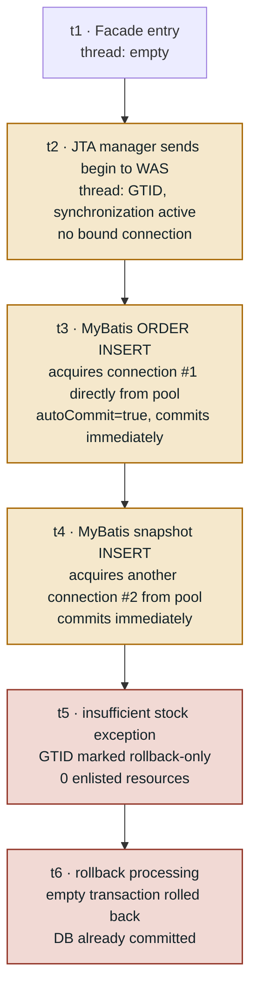
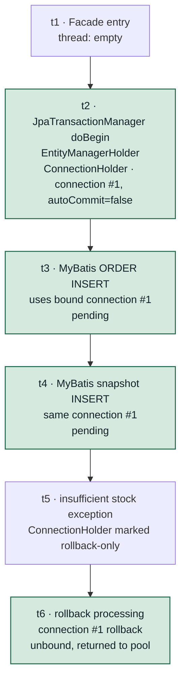

`@Transactional` is an annotation you almost never question during development. You put it on a method, and when an exception is thrown, everything gets rolled back automatically. I'd trusted it that way for years.

Then strange data started showing up in the production DB.

- Orders that were registered but whose inventory was never decremented
- Documents with a header but an empty detail
- Lots where stock was decremented twice

Every case looked the same: **an exception had occurred mid-way, but the writes from earlier steps were still there**. The exception was a `RuntimeException` subclass, and the method had `@Transactional` on it.

This post is a record of what I checked and measured between first not believing the "rollback isn't working" report and finally accepting it as fact. The root cause was not in the code, and the fix was a single line of YAML. Most of this post is about everything that happened before that one line.

## 1. Symptom: Data that was only half-saved

Let me start with what it actually looked like. The order-creation logic I'll use as an example goes roughly like this:

```java
@Transactional
public void createOrder(OrderRequest request) {
    validateCreditUnpaid(request);              // ① unpaid credit check
    validateAddressOwnership(request);          // ② shipping address ownership check

    orderService.insert(order);                 // ③ ORDER INSERT
    snapshotService.insert(customerSnapshot);   // ③-1 customer snapshot INSERT

    List<LotMapping> mappings = allocateGreedy();  // ④ stock lot allocation
    lotMappingService.bulkInsert(mappings);        //    mapping bulk INSERT

    if (allocatedQty < request.getQty()) {
        throw new BusinessException(INSUFFICIENT_STOCK);  // ⑤ insufficient stock
    }

    stockLotService.decreaseRemainQty(mappings);   // ⑥ decrement lot remaining qty
    creditService.increaseUsedAmount(order);       // ⑦ increment credit usage
}
```

When an exception is thrown at ⑤, steps ③, ③-1, and ④ should all be rolled back. But when I queried the production DB, all three were still there.

```sql
-- the order row is in there
SELECT * FROM ORDER_MASTER WHERE ORDER_ID = 'ORD-20260812-0001';        -- 1 row
-- some lot mappings are in there too
SELECT * FROM ORDER_LOT_MAPPING WHERE ORDER_ID = 'ORD-20260812-0001';   -- 3 rows
-- but credit usage wasn't updated
SELECT USED_AMOUNT FROM CREDIT_ACCOUNT WHERE CUSTOMER_ID = 'C-1001';    -- unchanged
```

The most confusing part was that **the same scenario rolled back cleanly on local**. Same code, same SQL, same exception — but only on production did the data survive.

## 2. I checked every line of code and found nothing

My first instinct was to blame the code. There are well-known reasons why `@Transactional` can stop working, so I built a checklist and went through it one by one.

| Common cause | Result |
| --- | --- |
| `@Transactional` missing entirely | Present on the facade, correct |
| Private method bypassing the proxy | All public, called from outside |
| Self-invocation within the same class | None |
| Exception swallowed with a catch | None |
| Checked exception, not eligible for rollback | `BusinessException extends RuntimeException`, fine |
| Unusual propagation (`NOT_SUPPORTED`, etc.) | All services use `REQUIRED` |
| MyBatis using a different transaction | Standard mybatis-spring auto-configuration |

Everything was normal. I spent a full day staring at code and found nothing wrong.

This is the most unsettling place to be. If there's no problem in the code but the result is wrong, it means you're looking in the wrong place entirely. So I changed the question.

> From "why isn't the code working?" to "what's different between local and production?"

## 3. The suspect was the runtime environment, not the code

Production runs as a WAR on JEUS WAS; local runs with the embedded Tomcat. I started from that difference.

Spring Boot has an auto-configuration called `JtaAutoConfiguration`. It's a well-intentioned feature. In plain terms, its reasoning goes like this:

> "There's a `java:comp/UserTransaction` in JNDI? This app must be running on a WAS. Let's hand transaction management over to the WAS."
> → Registers `JtaTransactionManager`

The problem is that this reasoning was only half right. The transaction manager was switched to JTA (global transactions), but the data source was not XA. A non-XA data source cannot be enlisted in a global transaction.

The result is the following chain:

1. The WAS exposes `java:comp/UserTransaction` in JNDI.
2. Spring Boot's `JtaAutoConfiguration` detects it.
3. `JtaTransactionManager` is registered instead of the local transaction manager.
4. `@Transactional` starts a global transaction through the WAS.
5. **The data source is non-XA and cannot enlist in the global transaction.** ← This is where it breaks.
6. The connection operates with `autoCommit=true`, and every SQL statement commits immediately.
7. An exception is thrown and rollback is attempted.
8. There's no connection to roll back, so only an empty transaction is rolled back.
9. Data that was already committed stays in the DB.

Steps 1 through 4 each did exactly what they were supposed to. The only thing that went wrong was step 5, and everything after it is just a consequence.

Laying this out made several things click.

- There was no `PlatformTransactionManager` bean definition anywhere in the project. Everything depended entirely on auto-configuration.
- Not a single line of `spring.jta.*` configuration appeared in any module's YAML. But `spring.jta.enabled` has `matchIfMissing = true`, so leaving it out means it's treated as enabled.
- We never intentionally added a JTA starter, but `jakarta.transaction-api`, pulled in transitively by `spring-boot-starter-data-jpa`, was on the classpath, satisfying the `@ConditionalOnClass` condition.

In other words, we had no intention of using JTA, yet **the moment the app was deployed to a WAS, the transaction manager silently changed**.

### "Why are other services on the same WAS fine?"

The team asked this question, and it's a fair one. The WAS data source configuration is shared by multiple services, so if that were the problem, everything should be broken. The answer is that **the problem is in the combination, not the data source itself**.

There's nothing wrong with a non-XA data source on its own. It works correctly for local transactions: `setAutoCommit(false)` → `commit()` / `rollback()`. Legacy applications that open and close connections directly are completely unaffected.

There's only one problematic combination:

> The JTA manager believes it is responsible for commit and rollback, but there's no connection inside that transaction.

And what created that combination wasn't the WAS — it was Spring Boot's automatic selection. So the fact that other services are fine doesn't contradict this hypothesis. But at this point everything was still reasoning. Plausible isn't the same as proven, so before making any change, I decided to measure first.

## 4. What is the thread holding?

Before getting to measurements, let me be precise about what's actually different — that determines what to measure. Spring's transaction state lives in a `ThreadLocal` attached to the thread handling the request. Comparing what the thread holds at the same point in time shows the difference clearly.

First, some terminology. This problem is fundamentally a "transaction manager type × data source type" combination problem, so the picture only makes sense when all four cases are on the table.

| | Non-XA data source | XA data source |
| --- | --- | --- |
| **JTA manager** | ❌ **JTA case (this incident)**: manager opens a global transaction but the connection can't enlist | ✅ The intended JTA combination: enlist succeeds, 2PC works |
| **Local manager** (`JpaTransactionManager`, etc.) | ✅ **Local case (after fix)**: manager grabs one connection and commits/rolls back directly | ⚠️ Works correctly; XA capabilities just aren't used |

This post only covers the left column — those are the two cases I actually measured.

- **JTA case**: JTA manager + non-XA data source → broken production state
- **Local case**: local (JPA) manager + non-XA data source → healthy state after fix

One thing worth emphasizing: the **data source was never touched** while moving between the two cases. Within the table, I only moved up and down in the same column (non-XA). The only thing that changed was the manager.

The right-side option — switching the data source to XA — also existed in theory. But it would require changing a shared WAS configuration used by multiple teams and accepting 2PC overhead, so we didn't go that route. Our application uses a single DB, so there was no need for distributed transactions. The right answer wasn't "set up the global transaction correctly" — it was "**don't start a global transaction in the first place**."

### JTA case: JTA manager + non-XA data source



The key is t2. A transaction marker is set, but no connection is ever bound. With no designated connection on the thread, MyBatis at t3 and t4 each pulls a fresh connection (#1, #2) from the pool — both with `autoCommit=true` — and each commits immediately.

**Are connection #1 and #2 different types?**

No. Both come from the same data source (connection pool) and are the same class. In the actual diagnostic results, `connectionClass` was `com.zaxxer.hikari.pool.HikariProxyConnection` in both the JTA case and the local case. The difference is only how many instances are used per request, and who controls those connections.

| | Connection origin | Instances used this request | Who disabled autoCommit |
| --- | --- | --- | --- |
| JTA case | Data source (pool) | Fresh one per SQL, multiple | Nobody |
| Local case | Data source (pool) | One, bound by the manager | The manager |

So "no bound connection" doesn't mean an unusual connection arrives. It means **there's no designated instance for this transaction, so a new one is fetched every time**. The pool may reuse a physical connection that was returned earlier, but logically each use is independent and they don't share a commit boundary.

### Local case: local (JPA) manager + non-XA data source



The connection is bound at t2. Every subsequent SQL uses the same connection #1, so a single `rollback()` at t6 undoes everything. The pool and data source are identical to the JTA case. The only thing that changed is the manager.

### Side-by-side timeline

| Point | Code | JTA case: thread & MyBatis connection | Local case: thread & MyBatis connection |
| --- | --- | --- | --- |
| t1 | Facade entry | empty | empty |
| t2 | Transaction start | GTID only, no connection | connection #1 bound, `autoCommit=false` |
| t3 | ORDER INSERT | fresh #1, `autoCommit=true` → immediate commit | bound #1, pending |
| t4 | Snapshot INSERT | another fresh #2 → immediate commit | same #1, pending |
| t5 | Exception | GTID marked rollback-only, 0 resources | ConnectionHolder marked rollback-only |
| t6 | Rollback | empty transaction rolled back → no DB change | connection #1 rollback → all changes undone |

The one difference at t2 determines the outcome at t6. That also makes clear exactly what to measure: **"is a connection bound at t2?"** — just that.

### The actual structure behind "what the thread holds": TransactionSynchronizationManager

"What the thread holds" isn't a metaphor — it's a real class. `org.springframework.transaction.support.TransactionSynchronizationManager` (TSM) stores state in several `ThreadLocal` fields.

| Item (ThreadLocal) | Contents | Key |
| --- | --- | --- |
| `resources` | Map of resource holders: `ConnectionHolder`, `EntityManagerHolder`, `SqlSessionHolder`, etc. | Resource factory object (`DataSource`, `EntityManagerFactory`, `SqlSessionFactory`) |
| `synchronizations` | List of callbacks for before/after commit and rollback | - |
| `currentTransactionName` | Current transaction name | - |
| `currentTransactionReadOnly` | Read-only flag | - |
| `currentTransactionIsolationLevel` | Isolation level | - |
| `actualTransactionActive` | Whether an actual transaction has started | - |

The important thing about `resources` is that it's a map keyed on resource factory. MyBatis can only find a connection if there's a `ConnectionHolder` keyed on the `DataSource`.

Now let's compare what each manager puts into TSM.

| TSM item | JpaTransactionManager | JtaTransactionManager |
| --- | --- | --- |
| `actualTransactionActive` | ✔ | ✔ |
| `synchronizations` | ✔ | ✔ |
| Transaction name, read-only, isolation level | ✔ | ✔ |
| `resources` `EntityManagerHolder` (key: EMF) | ✔ | ✘ |
| `resources` `ConnectionHolder` (key: DataSource) | ✔ | ✘ |

This surprised me. The JTA manager does use TSM. It doesn't ignore it — it marks the transaction as active and registers synchronizations just fine. **It just doesn't put the DataSource resource in.** It considers connection binding to be the enlist mechanism's responsibility. And that enlist is exactly what didn't happen with a non-XA data source — that's the JTA case.

## 5. Why wasn't a single line logged?

This was the most frustrating part. Rollback had been completely broken for months, and not a single warning appeared anywhere in the logs.

If you follow the path MyBatis takes to obtain a connection, the reason becomes clear. MyBatis core has no knowledge of Spring transactions; the bridge between them is mybatis-spring.

```text
Mapper method call
  → SqlSessionTemplate                                   (mybatis-spring)
  → SqlSessionUtils.getSqlSession()
       └ TSM.getResource(sqlSessionFactory)              ← SqlSessionHolder lookup
  → SpringManagedTransaction.openConnection()            (mybatis-spring)
       └ DataSourceUtils.getConnection(dataSource)       ← Spring utility
            └ TSM.getResource(dataSource)                ← ConnectionHolder lookup
                 ├ found → return that connection         (local case)
                 └ not found → dataSource.getConnection() (JTA case)
```

The fork at the bottom is the cause. When there's no bound connection on the thread, `DataSourceUtils` doesn't throw an error — it **quietly fetches a new connection from the pool**. This is intentional behavior, not a bug. Calling a Mapper outside of a transaction is a perfectly valid use case. The problem was that in the JTA case every single SQL took this path, and at the code level there was no way to distinguish it from "normal call outside a transaction."

The commit behavior makes it even clearer. `SpringManagedTransaction` records two values when it opens a connection:

```java
this.connection = DataSourceUtils.getConnection(this.dataSource);
this.autoCommit = this.connection.getAutoCommit();
this.isConnectionTransactional =
        DataSourceUtils.isConnectionTransactional(this.connection, this.dataSource);
```

And when committing:

```java
public void commit() throws SQLException {
    if (this.connection != null && !this.isConnectionTransactional && !this.autoCommit) {
        this.connection.commit();
    }
}
```

In the JTA case `autoCommit == true`, so the condition is false and nothing happens. The driver already committed each statement, so there's nothing to do. `rollback()` also does nothing for the same reason.

Everything flows through the normal path, silently. No exceptions, no warnings, no stack traces. This is why a line-by-line code review found nothing. The code was genuinely correct. The problem was **which branch of a utility the code called ended up taking at runtime**.

## 6. I built a diagnostic API instead of guessing

Everything up to this point was reasoning. Plausible — but I didn't want to change production configuration on reasoning alone. If the reasoning was wrong, I'd spend several more days in a "fixed but not fixed" state. So I built diagnostic APIs before making any change. The order mattered: I had to reproduce the broken state first, so I could say "this was the cause."

### 6-1. Wiring diagnostic API (read-only)

```text
GET /api/v1/admin/diagnostics/transaction
```

I took each of the checkpoints I identified and made them response fields directly.

| Field | What it checks | BROKEN value |
| --- | --- | --- |
| `transactionManagers` | Map of TransactionManager bean name → class name | `JtaTransactionManager` |
| `jndiUserTransaction` | Whether `java:comp/UserTransaction` lookup succeeded | present |
| `dataSourceClass` / `xaCapable` | Actual DataSource class, `isWrapperFor(XADataSource)` | non-XA |
| `actualTransactionActive` | `TSM.isActualTransactionActive()` | `true` |
| `connectionHolderBound` | `TSM.hasResource(dataSource)` | `false` |
| `autoCommitInsideTx` | `DataSourceUtils.getConnection(ds).getAutoCommit()` inside a transaction | `true` |
| `verdict` | Overall assessment | `BROKEN_TX_WITHOUT_CONNECTION` |

The core logic, stripped to essentials, looks like this. It's a short method, but every conclusion in this post came from it.

```java
@Transactional  // ← must be measured inside a transaction to mean anything
public TransactionWiringResponse inspect() {
    TransactionWiringResponse res = new TransactionWiringResponse();

    // ① which manager is registered
    Map<String, PlatformTransactionManager> beans =
            applicationContext.getBeansOfType(PlatformTransactionManager.class);
    Map<String, String> managers = new LinkedHashMap<String, String>();
    for (Map.Entry<String, PlatformTransactionManager> e : beans.entrySet()) {
        managers.put(e.getKey(), e.getValue().getClass().getName());
    }
    res.setTransactionManagers(managers);

    // ② is the transaction active: ask TSM
    res.setActualTransactionActive(
            TransactionSynchronizationManager.isActualTransactionActive());

    // ③ does the active transaction have a connection bound: ask the same TSM
    res.setConnectionHolderBound(
            TransactionSynchronizationManager.hasResource(dataSource));

    // ④ obtain a connection the same way MyBatis does and check autoCommit
    Connection conn = DataSourceUtils.getConnection(dataSource);
    try {
        res.setAutoCommitInsideTx(conn.getAutoCommit());
        res.setConnectionClass(conn.getClass().getName());
    } catch (SQLException e) {
        throw new BusinessException(DIAGNOSTICS_CONNECTION_FAILED);
    } finally {
        DataSourceUtils.releaseConnection(conn, dataSource);
    }

    // ⑤ overall verdict
    if (res.isActualTransactionActive() && !res.isConnectionHolderBound()) {
        res.setVerdict("BROKEN_TX_WITHOUT_CONNECTION");
    } else if (res.isActualTransactionActive() && !res.isAutoCommitInsideTx()) {
        res.setVerdict("HEALTHY_LOCAL_TX");
    } else {
        res.setVerdict("UNKNOWN");
    }
    return res;
}
```

Two things I was deliberate about in the design.

**First, the two key metrics must be read together.**

```json
"actualTransactionActive": true,
"connectionHolderBound":   false
```

- Looking at `actualTransactionActive` alone, it reads `true` and looks healthy. The JTA manager sets this too.
- Looking at `connectionHolderBound` alone, you can't tell the difference from a case where there's no transaction at all.

Only together do they prove: "there is a transaction, but it has no connection." The fact that both values come from the same TSM instance is what makes the verdict valid.

**Second, the diagnostic code must obtain the connection the same way MyBatis does.**

```java
// This always gives autoCommit=true and tells you nothing useful
Connection conn = dataSource.getConnection();                  // ✘

// Same path as MyBatis's SpringManagedTransaction
Connection conn = DataSourceUtils.getConnection(dataSource);   // ✔
```

`dataSource.getConnection()` pulls a raw connection from the pool, which always has `autoCommit=true`. Checking that value only confirms the obvious. You need to see the connection that MyBatis actually uses.

This API writes nothing, so it's safe to call on production. I also added a line to log the verdict at INFO level during application startup, so if the problem recurs it's visible immediately in the logs.

### 6-2. Rollback verification probe

Checking the wiring is one thing; you also have to check the outcome.

```text
POST /api/v1/admin/diagnostics/transaction/rollback-probe
```

The behavior is simple:

```java
// Facade: checks the result "outside" the transaction
public RollbackProbeResponse runProbe() {
    String probeKey = UUID.randomUUID().toString();

    try {
        probeService.insertThenThrow(probeKey);   // ← always throws
    } catch (BusinessException expected) {
        // intentional exception; swallow it and check the result
    }

    // query outside the transaction: should return 0 rows if rolled back
    boolean survived = probeMapper.existsByKey(probeKey);

    RollbackProbeResponse res = new RollbackProbeResponse();
    res.setProbeKey(probeKey);
    res.setSurvived(survived);
    res.setVerdict(survived ? "ROLLBACK_NOT_WORKING" : "ROLLBACK_OK");

    if (survived) {
        res.setCleanedRows(probeMapper.deleteByKey(probeKey));  // clean up leftover row
    }
    return res;
}

// Service: "inside" the transaction
@Transactional
public void insertThenThrow(String probeKey) {
    probeMapper.insert(probeKey, "rollback probe");
    throw new BusinessException(PROBE_INTENTIONAL_ROLLBACK);
}
```

```text
survived = true   → rollback is not working
survived = false  → healthy
```

It only touches a dedicated table, so business data is completely untouched. That meant I could use the same API for post-deployment verification — which turned out to be very useful.

```sql
CREATE TABLE TX_ROLLBACK_PROBE (
    PROBE_KEY  VARCHAR2(64)  PRIMARY KEY,   -- UUID
    NOTE       VARCHAR2(200),               -- call context
    CRT_BY     VARCHAR2(100),
    CRT_DT     TIMESTAMP DEFAULT SYSTIMESTAMP
);
```

### 6-3. Verification environment: no WAS configuration changes required

This was the best decision I made during the whole exercise.

The condition that triggers JTA auto-configuration is not the data source type — it's **the presence of a JNDI UserTransaction** (`@ConditionalOnJndi`). So deploying to the dev WAS with the dev profile (Hikari, direct dev DB connection) results in exactly the same `JtaTransactionManager` being registered, and a Hikari connection also can't be enlisted — so the same symptoms are reproduced.

That meant I never had to touch the shared WAS data source configuration (`domain.xml`), and in fact it produced a cleaner reproduction environment by eliminating data source as a variable.

The A/B comparison was also straightforward. The same WAR stays as-is; only the WAS JVM startup option changes.

```text
-Dspring.jta.enabled=true   →  BROKEN  (reproduction)
-Dspring.jta.enabled=false  →  HEALTHY (fix in effect)
```

I could compare before and after without redeployment, and this option also became the instant-revert handle in case something went wrong after the production deployment.

All calls were made from the terminal. No UI needed, so the entire frontend build step was skipped.

```bash
BASE=http://<devIP>:<port>/app
TOKEN=$(curl -s -X POST "$BASE/api/v1/auth/login" \
  -H 'Content-Type: application/json' \
  -d '{"userId":"admin","password":"***"}' \
  | python3 -c 'import sys,json;print(json.load(sys.stdin)["data"]["accessToken"])')

curl -s "$BASE/api/v1/admin/diagnostics/transaction" -H "Authorization: Bearer $TOKEN"
curl -s -X POST "$BASE/api/v1/admin/diagnostics/transaction/rollback-probe" -H "Authorization: Bearer $TOKEN"
```

## 7. Measurement: changing only one option on the same WAR

I ran the A/B test on the dev environment (JEUS 8.5, `spring.profiles.active=dev`, Hikari + dev DB). Every metric flipped exactly as expected.

| Metric | `spring.jta.enabled=true` | `spring.jta.enabled=false` |
| --- | --- | --- |
| Transaction manager | `JtaTransactionManager` | `JpaTransactionManager` |
| `connectionHolderBound` | `false` | `true` |
| `autoCommitInsideTx` | `true` | `false` |
| `verdict` | `BROKEN_TX_WITHOUT_CONNECTION` | `HEALTHY_LOCAL_TX` |
| Probe row survived (`survived`) | `true` (`cleanedRows=1`) | `false` |

The JNDI lookup results were the same on both sides. The WAS kept exposing UserTransaction the whole time; Spring just stopped using it.

```text
java:comp/UserTransaction          → jeus.transaction.UserTransactionImpl      ✔
java:comp/TransactionManager       → not found (NameNotFoundException)
java:appserver/TransactionManager  → jeus.transaction.TransactionManagerImpl   ✔
java:pm/TransactionManager         → not found (NameNotFoundException)
java:/TransactionManager           → jeus.transaction.TransactionManagerImpl   ✔
```

Three of the five names that Spring Boot's `JndiJtaConfiguration` checks resolve successfully. The conditions for JTA auto-configuration are fully met.

### Things the measurement corrected

Two things I had wrong in the reasoning phase surfaced here. Worth recording.

**First, the manager that registers after the fix is `JpaTransactionManager`, not `DataSourceTransactionManager`.**

My initial hypothesis notes said `DataSourceTransactionManager`, but this project has `spring-boot-starter-data-jpa`, so `JpaBaseConfiguration#transactionManager` registers the actual bean. That manager pulls the DataSource from the `EntityManagerFactory` and binds a `ConnectionHolder`, which is why MyBatis shares the same connection. This also explained why rollback had always worked correctly on local.

> ⚠️ If you go looking for `DataSourceTransactionManager` in the logs and don't find it, it's easy to mistakenly think the fix didn't apply. I actually got confused by this myself for a moment.

**Second, the data source type was not a root cause.**

My initial thinking treated the non-XA configuration in the WAS `domain.xml` as part of the problem, but the same issue reproduced identically with Hikari. Any data source that can't be enlisted produces the same result regardless of type. So `domain.xml` dropped out of the fix scope, and the earlier question — "if it's a shared configuration, shouldn't all services be broken?" — was fully resolved.

The only problematic combination is **"JTA manager + a connection that can't be enlisted,"** and that combination was created by Spring Boot's automatic selection.

## 8. Which data survived depended on where the exception occurred

Separately from the measurements, the pattern of surviving data was itself strong evidence. Here's what remains in the DB for each exception location in the order-creation flow:

| Exception location | What remains in the DB |
| --- | --- |
| ① unpaid credit check fails | ✅ Nothing. Stopped before any writes |
| ② shipping address ownership check fails | ✅ Nothing. Stopped before any writes |
| ③ ORDER INSERT statement itself fails (PK conflict ORA-00001, etc.) | ✅ Nothing. Statement-level atomicity is guaranteed by the DB |
| ⑤ insufficient stock (`INSUFFICIENT_STOCK`) | ❌ Order + snapshot + some mappings |
| ⑥ lot decrement guard fails | ❌ Order + snapshot + mappings (decrement only partial) |
| ⑦ credit increment fails | ❌ Order + snapshot + mappings + decrement. Only usage amount missing, causing double decrement |

The most important row in this table is actually ③.

When the INSERT statement itself fails, nothing survives. The DB engine guarantees **statement-level atomicity** — a failed SQL statement leaves no partial effect.

In other words, only **transaction-level atomicity** — canceling a group of statements together — was broken. And the surviving data in production was distributed exactly along those boundaries. It was a perfect counterexample that fit the hypothesis "each statement is being committed immediately."

After the fix, ⑤, ⑥, and ⑦ all become "nothing."

The two values from the diagnostic API tell the same story from a different angle. `connectionHolderBound` asks "is a connection bound to the thread?"; `autoCommitInsideTx` asks "who controls commit for that connection?" Both are different views of the same single cell — t2 — in the earlier timeline.

## 9. The fix was one line

After all of that, the fix is almost anticlimactic.

```yaml
---
spring:
  config:
    activate:
      on-profile: prod
  datasource:
    jndi-name: java:comp/env/jdbc/AppDS
  jta:
    enabled: false          # prevents JtaTransactionManager from being registered
                            # via automatic JNDI UserTransaction detection in the WAS
```

`spring.jta.enabled: false`. That's it.

This setting turns off the `@ConditionalOnProperty` in `JtaAutoConfiguration`, which lets `JpaBaseConfiguration#transactionManager` register `JpaTransactionManager`. The manager binds the connection, MyBatis uses the same connection, and rollback works correctly.

It's a little absurd that days of investigation produced a single configuration line. But I think the order was right. I built diagnostic tooling, reproduced the issue, measured it, and then added this line — which is why I can say with confidence that it's actually fixed. If I had started with just this line, I'd still be unsure whether it was really fixed.

## 10. New concerns that came up after the fix

That would have been a satisfying ending, but this fix has a property that demands caution.

> Until now, every SQL on production was committed immediately.
> That means the transaction propagation settings written in the code were effectively meaningless.
> Only after the fix do they start working as intended for the first time.

"Fixed" also means "**code that has never run correctly is now running correctly for the first time.**" So the following paths all needed review.

### ① NOT_SUPPORTED and manual TransactionTemplate

```java
@Transactional(propagation = Propagation.NOT_SUPPORTED)
public void uploadAndProcess(MultipartFile file) {
    ...
    TransactionTemplate tt = new TransactionTemplate(transactionManager);  // ← the injected manager has changed
    tt.execute(new TransactionCallbackWithoutResult() {
        @Override
        protected void doInTransactionWithoutResult(TransactionStatus status) {
            headerService.insert(header);
            detailService.bulkInsert(details);
            summaryService.upsert(summary);
        }
    });
}
```

The `transactionManager` injected here changes from JTA to JPA. I needed to verify that the three-step write group commits and rolls back correctly.

### ② Per-record REQUIRES_NEW

`REQUIRES_NEW` appears in several batch processing flows:

```java
@Transactional(propagation = Propagation.REQUIRES_NEW)
public void applyOne(StagingRow row) {
    // even if the outer transaction rolls back, we want this "record was processed" state to persist
    stagingMapper.updateStatus(row.getId(), "APPLIED");
}
```

The design intent is "even if the outer transaction rolls back, the processing status persists." But until now, every statement committed immediately anyway, so this intent was being preserved by accident.

Using `REQUIRES_NEW` with a local manager comes with a cost: while holding the outer transaction's connection, it acquires one more. The dev profile had a small pool (`maximum-pool-size: 5`), which made false positives likely, so I bumped the pool size to production levels when running verification.

### ③ Class-level MANDATORY

```java
@Transactional(propagation = Propagation.MANDATORY)
public class DocumentNoIssuanceFacade { ... }
```

If the caller has no active transaction, this throws `IllegalTransactionStateException`. This was a setting that had never actually been verified, so the entire issuance code path needed a fresh review.

### ④ Lock hold duration: the most delicate part

Previously, row locks were released almost immediately because each statement committed right away. Now locks are held for the duration of the transaction. Lock contention and timeouts that had never appeared before could show up during bulk uploads or allocation jobs.

It can feel unfair that fixing a bug creates a performance concern. But it's just paying a cost that was always owed. That's why I added a final item to the regression verification list: run an upload and an order creation concurrently and observe response times.

### ⑤ Ship with other fixes

Until this change lands, any exception will leave data behind. So it was safer to bundle this fix together with other bug fixes in the same deployment. Without it, exceptions thrown by other fixes would also leave data behind.

### ⑥ Have a revert plan ready

`-Dspring.jta.enabled=true` as a WAS JVM option reverts immediately without redeployment. System properties take precedence over YAML. The mechanism I built for A/B testing became the rollback plan. More design than luck — the experiment was set up that way from the start.

The post-deployment check takes about 3 minutes:

```text
① Check the "Transaction wiring:" line in the startup log
② GET  /api/v1/admin/diagnostics/transaction                 → verify verdict
③ POST /api/v1/admin/diagnostics/transaction/rollback-probe  → verify survived=false
```

Both the wiring and the actual behavior can be confirmed without touching any business data.

## 11. What's left and what I learned

### Still remaining

- The corrupted data that accumulated is not removed by this fix. Data recovery is an entirely separate effort.

### What I learned

**① When the conclusion is "there's nothing wrong with the code," you're looking at the wrong layer.**

I was demoralized after spending a full day on the code and finding nothing. But in hindsight that was the most important piece of information. Code being confirmed clean meant I could move one layer down to runtime wiring. Without that exhaustive check, I'd have kept suspecting the code.

**② Silent failures are the most dangerous.**

`DataSourceUtils.getConnection()` returning a new connection instead of throwing when there's no holder is correct by design. But that correct design perfectly concealed months of data corruption. No error logs doesn't mean things are healthy — it might mean nobody has looked yet.

**③ Metrics need to be read in pairs.**

`actualTransactionActive` alone reads `true` and looks healthy. `connectionHolderBound` alone is indistinguishable from the no-transaction case. Only together do they prove "transaction exists but has no connection." Since I started doing diagnostics, I now always ask myself: "can this single value make the call by itself?"

**④ Design your experiment so the setup doubles as the rollback plan.**

The JVM option built for A/B comparison became the production rollback mechanism. The reproduction probe API became the post-deployment verification tool. Not treating diagnostics as throwaway — that was the biggest practical gain. The diagnostic APIs are still running in production.

**⑤ The prevention rule fits in two sentences.**

> When deploying a Spring Boot application to a WAS, always check the transaction manager auto-configuration result in the startup log.
> If you're not intentionally using JTA, set `spring.jta.enabled: false` explicitly. The data source type (XA or not) and the transaction manager type must match.

I no longer assume that adding `@Transactional` means a transaction is in effect. I now have a habit of checking the transaction manager name directly in server logs, and that's the most valuable thing I got out of this whole incident. If you're running Spring Boot on a WAS, I'd suggest grepping for `TransactionManager` in today's startup log. It takes 30 seconds.
