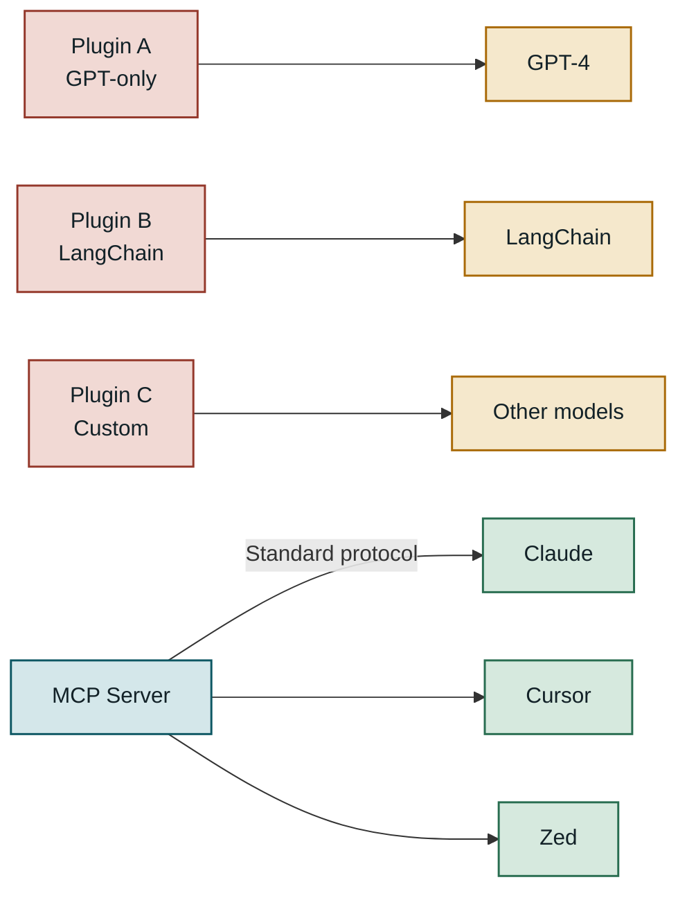
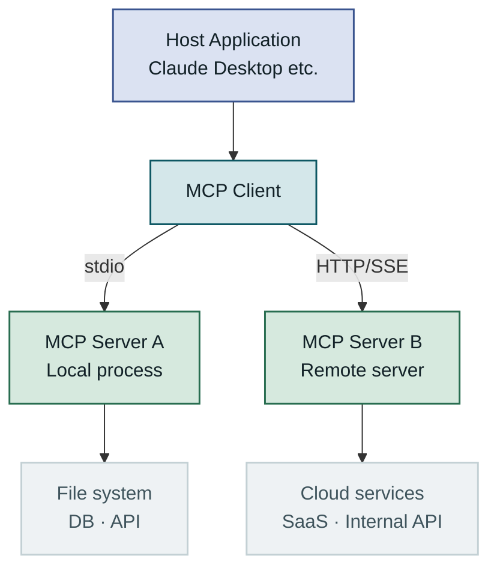
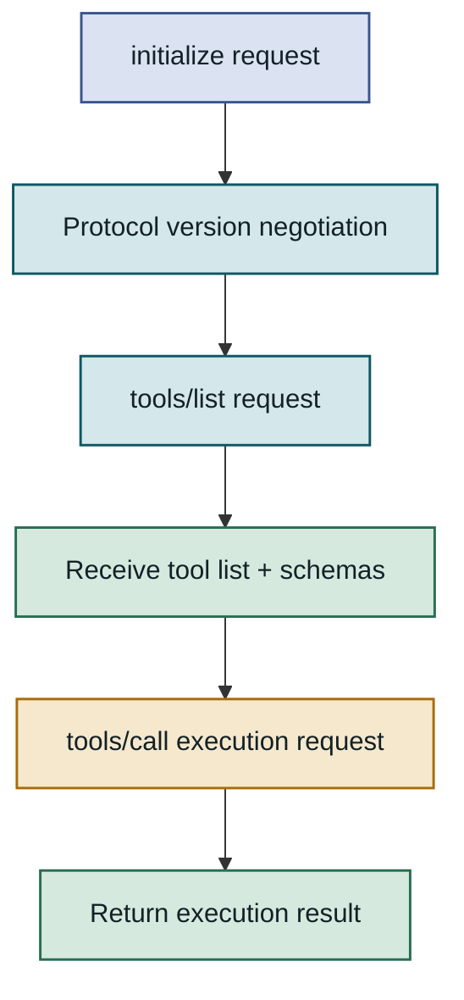
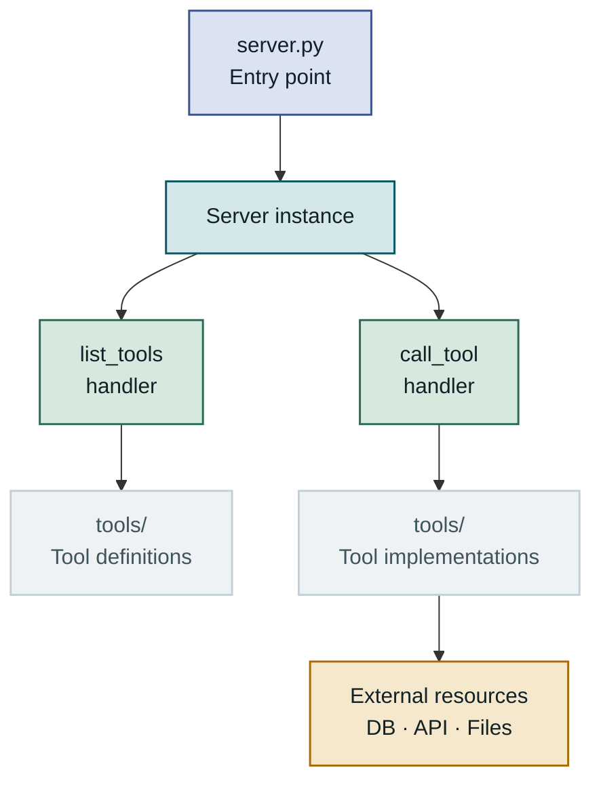
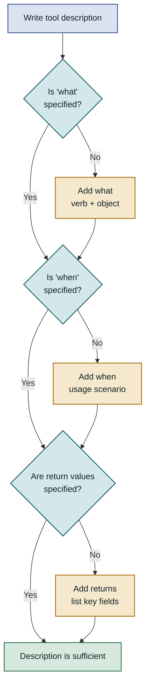
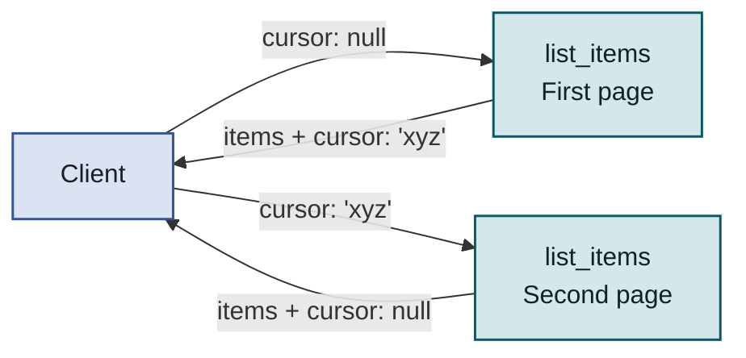
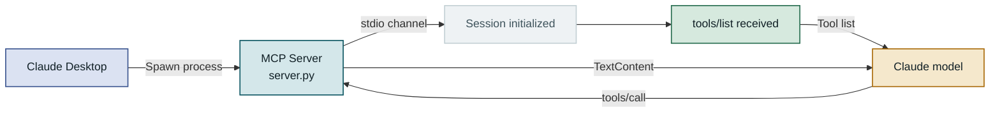
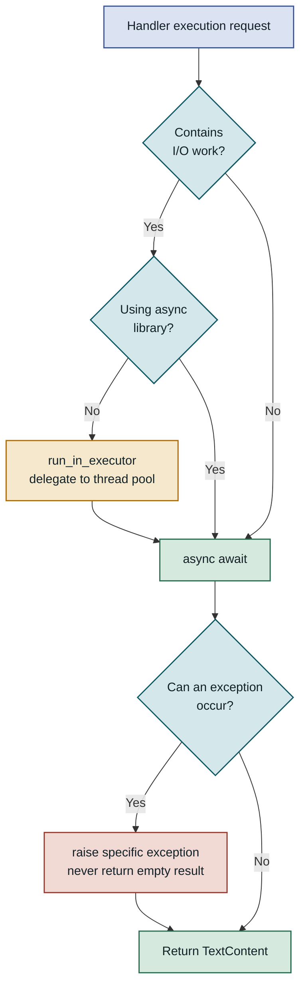
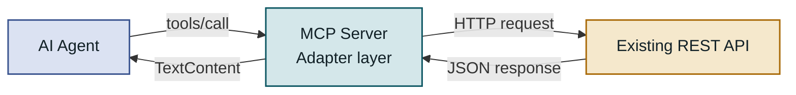

## Table of Contents

1. Overview
2. MCP Protocol Structure and How It Works
3. Implementing an MCP Server with the Python SDK
4. Designing Custom Tool Schemas
5. AI Agent Integration and End-to-End Testing
6. Considerations for Production
7. Closing Thoughts

---

## Overview

### Background

**MCP (Model Context Protocol)** is an open standard Anthropic published in 2024 that standardizes how AI models access external tools and data sources. Anyone who has built LLM-based applications will have run into the same wall: the model itself is capable, but every time you need to query a real database, call an internal API, or access a specific file system, you have to write separate integration code. If you implement a custom MCP server with the MCP Python SDK, you write that integration code once in a standardized way and immediately reuse it from any AI client that supports MCP.

### Limits of the Old Approach

Ways to attach tools to an LLM existed before MCP — OpenAI Function Calling, LangChain's Tool abstraction, and the plugin systems each framework provided are the obvious examples. Their shared problem is **lock-in to a specific model or framework**. A function schema written for GPT-4 cannot be used as-is with Claude, and code written as a LangChain Tool is hard to port to a different orchestration layer.

The more fundamental problem is **fragmentation of communication methods**. Some tools expose a REST endpoint, some require you to import a Python function directly, and some use gRPC. That fragmentation creates significant complexity when you need to scale or maintain an AI agent system. Every time you introduce a new model into a running service, you end up rewriting the integration code from scratch.

MCP solves this with **a single standard protocol**. A server exposes its tools once in MCP format, and any client that supports MCP — Claude Desktop, Cursor, Zed, and others — can use those tools immediately. Teams can manage MCP servers independently and build a loosely coupled architecture with AI agent clients.



Before MCP, each tool required its own integration method. A single MCP server covers every supported client.

---

## MCP Protocol Structure and How It Works

### Architecture Overview

MCP follows a **client-server model**. The **host application** where the AI agent runs acts as the client; the **MCP server** that provides actual tools or data acts as the server. Communication between them is based on [JSON-RPC 2.0](https://www.jsonrpc.org/specification), and two transport layers are supported: **stdio** (standard I/O) and **HTTP/SSE** (Server-Sent Events).

With stdio, the host process directly spawns the MCP server as a child process. Because it is inter-process communication, no network configuration is needed and latency is low. This is mainly used for Claude Desktop integration and local development. **HTTP/SSE** has the server expose an independent HTTP endpoint, making it suitable for remote deployment or environments where multiple clients need simultaneous access. It is also worth noting that a single client can connect to multiple MCP servers at the same time. Each server operates independently, and the client manages the tools from all connected servers as a unified list.



The host can connect to local and remote servers simultaneously through the MCP client, and each server operates independently.

### Message Exchange Flow

An MCP session has three phases. First, the client sends an `initialize` request to negotiate the protocol version and supported capabilities — the **handshake** phase. Next, the client calls `tools/list` to receive the list of tools the server provides. The AI model uses this list to understand which tools are available and in what situations. Finally, when actual work is needed, a `tools/call` request executes a specific tool.

The important design decision in this flow is that **tool list retrieval and actual invocation are separated**. The model does not need to re-query tools on every turn; it decides whether to call a tool based on the schema information received at session start. This design means that if you dynamically add or remove tools on the server side, the change takes effect from the next session. If the tool list changes mid-session, the server can send a `notifications/tools/list_changed` notification to prompt the client to re-fetch the list.



Handshake → tool list retrieval → tool invocation are the three phases of an MCP session. The tool list is loaded once at session start.

### Core Building Blocks

An MCP server can expose three kinds of resources: **Tools**, **Resources**, and **Prompts**. Tools are the most general-purpose and are central to interaction with AI agents. Resources are read-only data exposed like file contents or DB records, and Prompts are reusable prompt templates that users can select.

| Resource type | Role | Typical use | Who decides |
|---|---|---|---|
| Tools | Execute actions, change state | API calls, DB writes | Model decides to call |
| Resources | Expose read-only data | File contents, config values | Client loads |
| Prompts | Provide prompt templates | Workflow guidance | User selects |

A tool is defined by its name, description, and an input schema in JSON Schema format. The description is not a mere comment — it is **the primary signal the model uses to decide when to use the tool**. A vague description causes the model to pick the wrong tool or call tools unnecessarily. This is why you should put as much care into schema design and description writing as into the code itself.

---

## Implementing an MCP Server with the Python SDK

### Setting Up the Development Environment

The Python MCP SDK is published to PyPI as the `mcp` package. Python 3.10 or later is required, and `uv` is recommended for dependency management. `uv` installs faster than `pip` and integrates virtual environment management with package management, making it the de facto standard tool for MCP server projects. The `mcp` package alone is sufficient for a basic server, but if you use HTTP/SSE transport you also need `uvicorn` and `starlette`.

Keep the project structure simple to start. Begin with a single `server.py` file and split concerns into a `tools/` subdirectory as tool implementations grow. The pattern of registering each tool module from the server entry point means you do not have to touch existing code when adding a new tool. Externalize configuration as environment variables so you can inject values without code changes when deploying to a container environment. Hard-coding API keys may feel faster during an early prototype, but it always causes problems when you move to team collaboration and automated deployment.



The entire server structure is three steps: create a `Server` instance from the entry point, register two handlers, and start the transport layer.

### Implementing the Basic Server Structure

The `Server` class is the core of the `mcp` SDK. You create an instance with a server name and version, then register two handlers using decorators. `@server.list_tools()` is called when a client requests the tool list; `@server.call_tool()` is called when the model requests a specific tool to be executed. Both handlers must be async functions, and I/O-bound work like external API calls or DB queries can be handled directly inside the handlers with `await`.

Below is a basic MCP server implementation providing two tools — weather lookup and temperature conversion. The actual logic is simplified to focus on the structure; a real environment would include external API calls.

```python
import asyncio
from mcp.server import Server
from mcp.server.stdio import stdio_server
from mcp.types import Tool, TextContent

# Create a server instance — the name and version are exposed to clients
server = Server("weather-tools", version="1.0.0")

@server.list_tools()
async def list_tools() -> list[Tool]:
    return [
        Tool(
            name="get_weather",
            description=(
                "Look up the current weather for a city by name. "
                "Returns temperature (Celsius), humidity (%), and weather condition. "
                "Use when a customer asks about the weather in a specific location."
            ),
            inputSchema={
                "type": "object",
                "properties": {
                    "city": {
                        "type": "string",
                        "description": "Name of the city to look up (English or local language)"
                    }
                },
                "required": ["city"]
            }
        ),
        Tool(
            name="convert_temperature",
            description="Convert a temperature between Celsius and Fahrenheit.",
            inputSchema={
                "type": "object",
                "properties": {
                    "value": {"type": "number", "description": "Temperature value to convert"},
                    "from_unit": {
                        "type": "string",
                        "enum": ["celsius", "fahrenheit"],
                        "description": "Unit of the input value"
                    }
                },
                "required": ["value", "from_unit"]
            }
        )
    ]

@server.call_tool()
async def call_tool(name: str, arguments: dict) -> list[TextContent]:
    if name == "get_weather":
        city = arguments["city"]
        # In production, call a weather API with httpx here
        result = f"{city}: 22°C, humidity 65%, clear"  # Simplified result
        return [TextContent(type="text", text=result)]

    elif name == "convert_temperature":
        value = arguments["value"]
        if arguments["from_unit"] == "celsius":
            converted = value * 9 / 5 + 32
            return [TextContent(type="text", text=f"{value}°C = {converted:.1f}°F")]
        else:
            converted = (value - 32) * 5 / 9
            return [TextContent(type="text", text=f"{value}°F = {converted:.1f}°C")]

    raise ValueError(f"Unknown tool: {name}")

async def main():
    async with stdio_server() as (read_stream, write_stream):
        await server.run(
            read_stream, write_stream,
            server.create_initialization_options()
        )

if __name__ == "__main__":
    asyncio.run(main())
```

When you `raise ValueError`, the SDK converts it into a JSON-RPC error response and delivers it to the client. If you catch the exception and return an empty list or an arbitrary error string instead, the model will interpret it as success and reach the wrong conclusion.

### Registering Tools and Wiring Up Handlers

Branching inside `call_tool` by tool name is intuitive when you have five or fewer tools, but it becomes hard to maintain as the number grows. The **registry pattern** addresses this. Map tool names to handler functions in a dictionary, and the branching logic shrinks to two lines. Adding a new tool means writing a handler function and adding one entry to the dictionary.

```python
from typing import Callable, Awaitable

ToolHandler = Callable[[dict], Awaitable[list[TextContent]]]

async def handle_get_weather(args: dict) -> list[TextContent]:
    city = args["city"]
    # In production: await httpx.AsyncClient().get(WEATHER_API_URL, params={"city": city})
    return [TextContent(type="text", text=f"{city}: clear, 22°C, humidity 65%")]

async def handle_convert_temperature(args: dict) -> list[TextContent]:
    value, unit = args["value"], args["from_unit"]
    result = value * 9/5 + 32 if unit == "celsius" else (value - 32) * 5/9
    label = "°F" if unit == "celsius" else "°C"
    return [TextContent(type="text", text=f"Result: {result:.1f}{label}")]

# Tool name → handler mapping (register new tools here only)
TOOL_REGISTRY: dict[str, ToolHandler] = {
    "get_weather": handle_get_weather,
    "convert_temperature": handle_convert_temperature,
}

@server.call_tool()
async def call_tool(name: str, arguments: dict) -> list[TextContent]:
    handler = TOOL_REGISTRY.get(name)
    if not handler:
        raise ValueError(f"Unknown tool: {name}")
    return await handler(arguments)
```

When you separate handler functions into independent modules and register them in the registry, you can unit-test each tool's business logic without running the server.

---

## Designing Custom Tool Schemas

### Schema Design Principles

Paradoxically, the part of an MCP server implementation that deserves the most time is not the code — it is the **tool descriptions and schemas**. The AI model relies entirely on `name`, `description`, and the `description` of each property in `inputSchema` to decide whether to call a tool and what arguments to pass. Most cases where a model picks the wrong tool or omits an argument trace back to descriptions that are insufficient or ambiguous.

A good tool description contains three elements. **What it does (what)**: state the action clearly as verb + object. **When to use it (when)**: describe the usage scenario or trigger condition. **What it returns (returns)**: list the key fields of the return value. A vague description like "fetches data" gives the model no basis for deciding whether to use this tool. Write something concrete: "Retrieves order details by order number. Returns order status, shipping tracking number, and estimated delivery date. Use when a customer asks about the status of their order."



Having all three elements — what, when, returns — in a tool description raises the accuracy of the model's tool selection.

### Input/Output Types and Validation

`inputSchema` follows [JSON Schema Draft 7](https://json-schema.org/specification-links.html#draft-7). You can use all standard keywords: `type`, `properties`, `required`, `enum`, `minimum`, `maximum`, `pattern`, and so on. Defining the schema carefully gives you two benefits. First, the model is more likely to generate arguments in the correct format. Second, when invalid arguments arrive, they can be caught at the SDK level without writing separate validation code inside the handler.

For a tool that takes a date range, specify `"format": "date"`. For values that must come from a fixed set like status codes, use `enum`. For bounded numbers use `minimum` and `maximum`; for strings with a required pattern use `pattern` with a regular expression. A precise schema reduces the room for the model to generate invalid values.

| Argument type | Recommended schema keywords | Notes |
|---|---|---|
| Date | `"type": "string", "format": "date"` | Encourages ISO 8601 format |
| Fixed options | `"enum": ["a", "b", "c"]` | Strong protection against model errors |
| Numeric range | `"minimum": 1, "maximum": 100` | Prevents boundary mistakes |
| Normalized ID | `"pattern": "^[A-Z]{3}-\\d{6}$"` | Automatic format validation |
| Array input | `"type": "array", "items": {...}` | Also specify `minItems` |

### Complex Tool Patterns

Avoid the pattern of using a dispatcher argument like `action` to let one tool perform multiple operations. A design where "if action is 'create' do A; if action is 'delete' do B" puts unnecessary context inference burden on the model and makes it hard to express the different required arguments for each action in the schema. Following the single-responsibility principle — one tool, one action — improves the model's tool selection accuracy.

For cases that need to maintain state, like paginated list queries, the **cursor pattern** is recommended. The server returns an opaque cursor string, and the next call passes that cursor back so the server can restore its position. This approach eliminates the need to manage page numbers on the server side and guarantees consistent traversal even if data is added or removed in the middle.



A `null` cursor means the first page; a non-null value resumes from where the previous call left off; `null` is returned again on the last page.

---

## AI Agent Integration and End-to-End Testing

### Connecting to Claude

Connecting your MCP server to Claude Desktop is straightforward. For stdio transport, add the server path and run command to the Claude Desktop configuration file (`claude_desktop_config.json`). On macOS this file is in `~/Library/Application Support/Claude/`; on Windows the path is `%APPDATA%\Claude\`. If you specify the server to run as `uv run server.py`, Claude Desktop will automatically start the server process when a session begins.

Adding an `env` key to the configuration file injects environment variables into the server process. Not hard-coding sensitive values like API keys and instead injecting them at runtime is an essential pattern when you manage development and production with the same codebase. Building this habit early means you can change deployment environments later by updating configuration alone, without touching code.



Claude Desktop spawns the server as a child process, receives the tool list over the stdio channel, and the model calls tools as needed.

### Testing Strategy

It is efficient to divide MCP server tests into three layers. In the fastest-running **unit tests**, call tool handler functions directly. Replace external dependencies (DB, API) with `unittest.mock` and verify only the return values. Keeping handler functions as standalone functions separate from the server instance makes tests at this layer easy to write. These tests can run on every commit in CI without any overhead.

**Integration tests** verify the actual MCP protocol flow. Using `ClientSession` from the `mcp` SDK, you can call `initialize`, `tools/list`, and `tools/call` in sequence just like a real client. Use test-only stubs instead of real external services at this layer. Finally, **E2E tests** use [MCP Inspector](https://github.com/modelcontextprotocol/inspector) to confirm that tools are registered and called correctly. MCP Inspector runs a browser-based UI with `npx @modelcontextprotocol/inspector` and lets you inspect JSON-RPC messages in real time, so you can quickly validate server behavior without going through Claude Desktop.

| Test layer | Target | Speed | External dependencies | When to run |
|---|---|---|---|---|
| Unit | Handler functions | Very fast | Mock | Every commit |
| Integration | MCP protocol flow | Medium | Stubs | Before PR merge |
| E2E | Full server + Inspector | Slow | Real services | Before deployment |

### Error Handling and Debugging

MCP server errors fall into two broad categories. The first is **protocol errors** — malformed JSON, missing required fields — which the SDK handles automatically. The second is **business logic errors** — querying an order number that does not exist, external API timeout — which occur inside the handler. For business errors, `raise` the specific exception directly and the SDK will convert it to a JSON-RPC error response for the client.

> Do not catch exceptions in handlers and return an empty list or an arbitrary error string. The model will interpret it as success and reach the wrong conclusion.

Seeing the actual JSON-RPC messages during debugging is important. Checking the `tools/list` response in MCP Inspector's browser UI immediately tells you whether your schema serialized as intended. Sending a `tools/call` request directly and verifying the return format lets you validate most of your server implementation before ever opening Claude Desktop.

---

## Considerations for Production

### Common Mistakes and Pitfalls

The most frequent problem when first deploying an MCP server to production is **blocking the event loop**. Using synchronous I/O inside a `call_tool` handler — the `requests` library, for example — prevents the entire server from handling other requests while it waits for a response. The MCP Python SDK is fully async, so you must use async libraries: `httpx` or `aiohttp` for external HTTP requests, `asyncpg` or `sqlalchemy[asyncio]` for database access. When you must reuse existing synchronous code, delegate it to a thread pool with `asyncio.run_in_executor` to avoid blocking the event loop.

The second common mistake is **neglecting version control of tool descriptions**. If a tool's behavior changes but the description is left as-is, the model will call the tool based on stale information until the session is restarted. Make it a team rule to version-control tool descriptions alongside the code and update them whenever behavior changes. When an argument type changes or a new required argument is added, the safe approach is a gradual transition: keep the old schema, add the new-version tool, and mark the old one as deprecated.



Applying async I/O checks and exception handling consistently to every handler is what keeps the server stable.

### Monitoring and Debugging

The first metrics to monitor on a running MCP server are **tool call response time** and **error rate**. When a tool is slow or fails often, the model tends to call it again repeatedly or reach incorrect conclusions. Logging the start and end time, a summary of arguments, and error status for each tool call with Python's standard `logging` module makes problem tracing much easier. However, since arguments may contain sensitive data, control the log level with an environment variable and avoid logging full arguments in production.

For servers deployed with HTTP/SSE transport, visualizing call counts per tool, response time distribution (P50/P95/P99), and error rate with a Prometheus + Grafana dashboard is effective. Attaching metric collection code to handlers via a decorator pattern means you can understand the performance characteristics of the entire server without inserting instrumentation code into each tool implementation directly. If a specific tool's P95 response time is significantly high, check whether the external dependencies that tool calls have adequate timeouts and retry logic.

### Scaling and Migration

When a single server starts to exceed 20-30 tools, it is time to consider **splitting servers by domain**. Moving order-related tools to an `order-tools` server and customer-related tools to a `customer-tools` server lets each team deploy and manage their server independently. Because an MCP client can connect to multiple servers simultaneously, you can add a new server by appending an entry to the configuration file alone, without any changes to client code.

Wrapping an existing REST API as MCP tools is another migration scenario that comes up frequently in practice. Using the **adapter pattern** — placing the MCP server in front of the existing API, providing only the tool interface — means you do not need to touch the existing system. Argument transformation or response processing can also be handled in the MCP server layer, so even if the existing API's format is not optimized for AI agents, you can adjust it in the middle.



Placing an MCP server as an adapter in front of an existing REST API lets AI agents use it immediately without modifying the existing system.

---

## Closing Thoughts

### Key Takeaways

MCP is a protocol that standardizes communication between AI agents and external tools. Implementing a server with the Python SDK comes down to writing two handlers correctly: `list_tools` and `call_tool`. Tool descriptions and JSON Schema schemas determine the model's tool selection accuracy, so put as much effort into schema design as into the code. Validating incrementally in the order unit tests → integration tests → MCP Inspector → Claude Desktop significantly reduces debugging cost.

In production, the long-term stability of the server depends on consistent async I/O, a clear exception handling policy, and keeping tool descriptions under version control. As the number of tools grows, the registry pattern keeps the structure clean, and splitting servers by domain enables independent per-team deployment — that is the direction for a scalable design.

### When to Use This Approach

There are two main situations where implementing a custom MCP server is the right call. First, when your AI agent needs to access internal systems (internal DB, legacy API, file server) that are not covered by existing public MCP servers. Second, when you need to share a tool implementation across multiple clients — Claude Desktop, Cursor, your own agent, and so on.

On the other hand, if you are building a one-off prototype that just attaches a function to the Claude API, using the tool_use API directly is faster than implementing an MCP server. MCP shows its value **at the point where the benefits of interface standardization outweigh the operational complexity** — when you need to support multiple agent clients or when teams need to manage separate servers independently. If you are still at the single-model, single-client stage, the pragmatic path is to validate quickly with the tool_use API first, then migrate to an MCP server when your requirements outgrow it.
