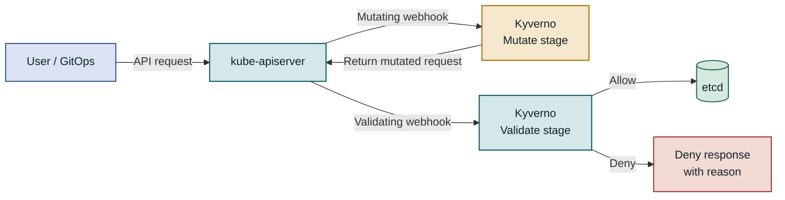
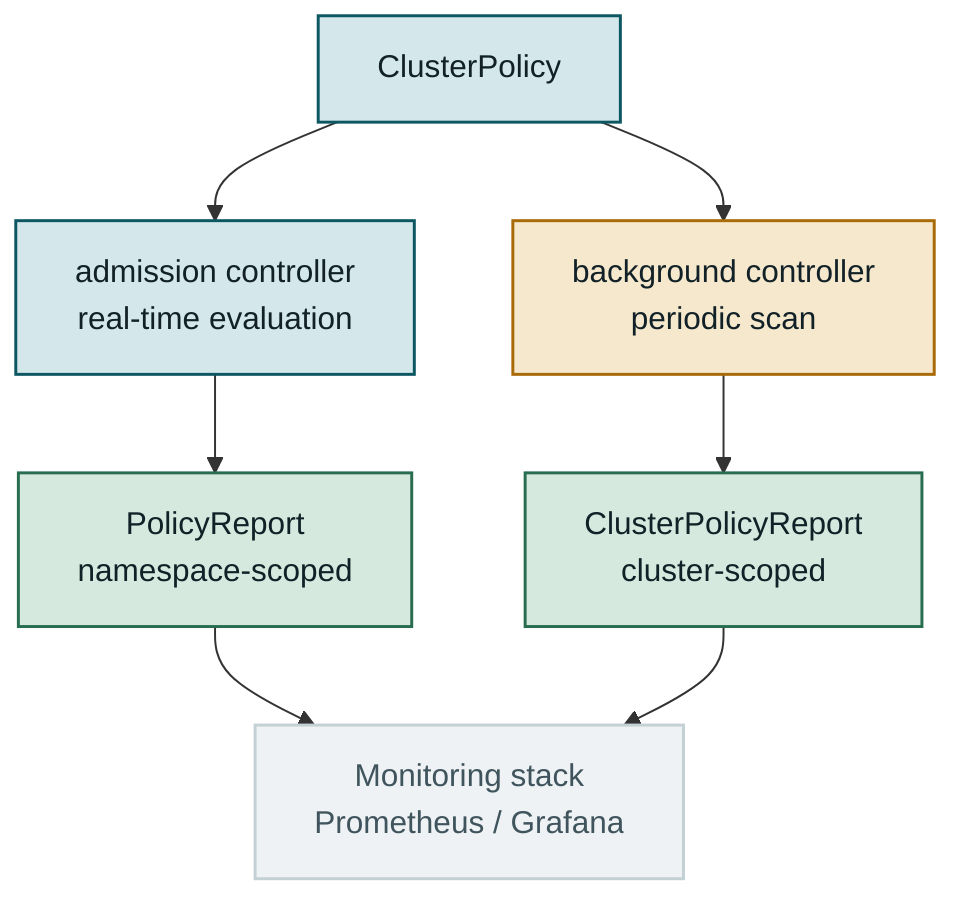
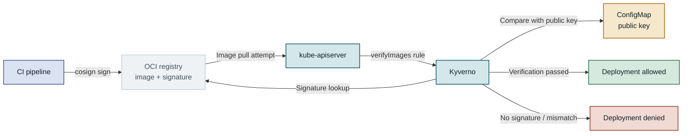
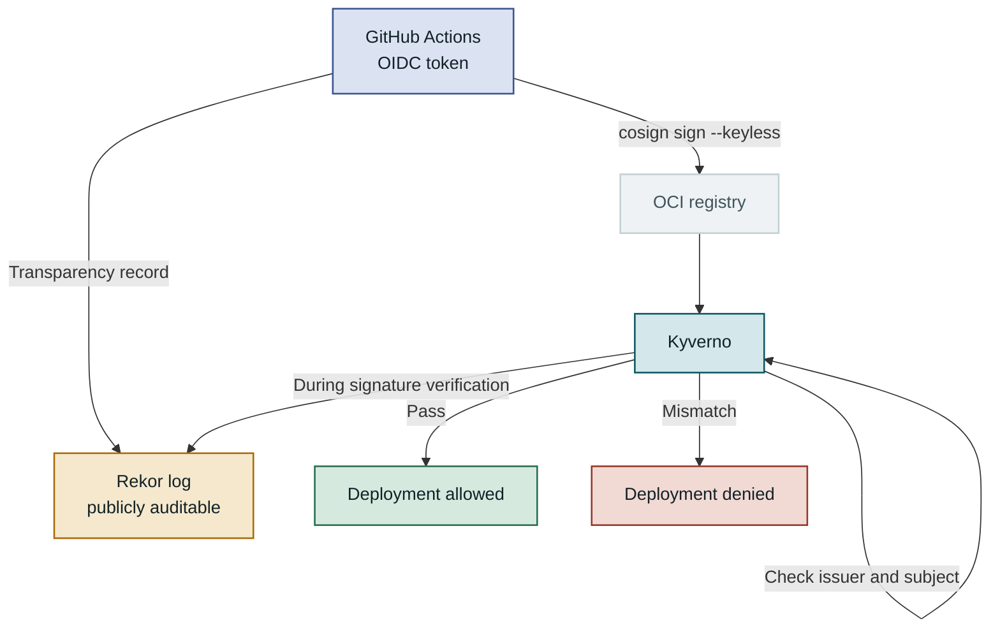
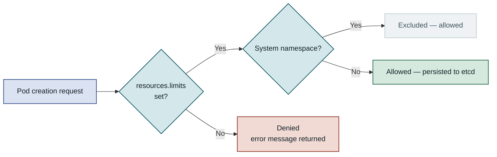
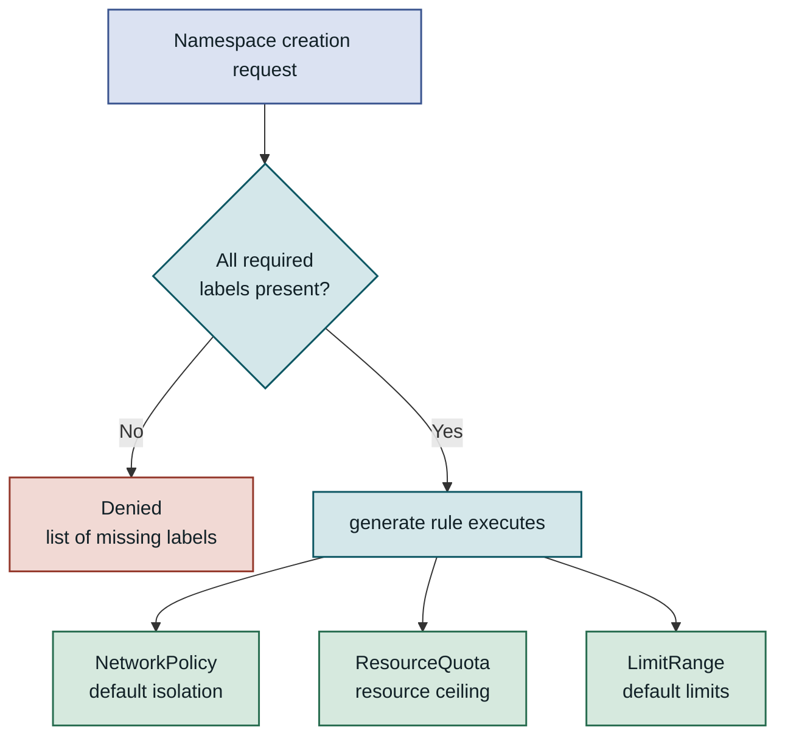
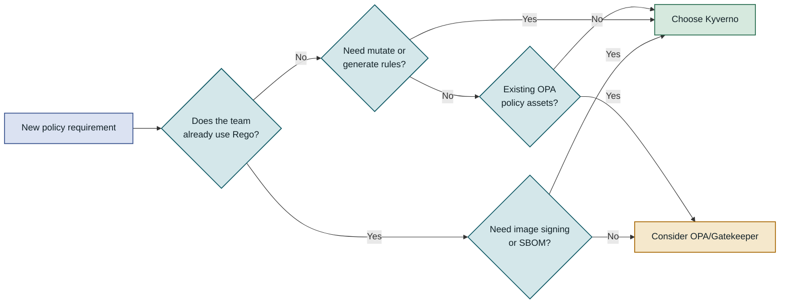
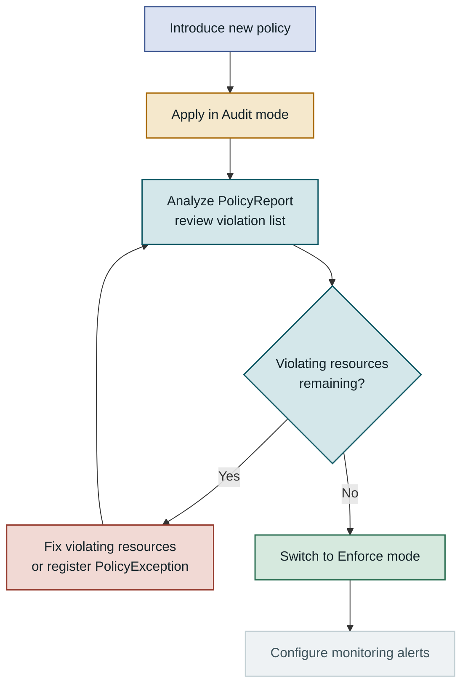
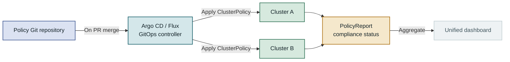

## Table of Contents

1. Overview
2. Kyverno Architecture and Policy Processing Flow
3. Implementing Image Signature Verification with ClusterPolicy
4. Enforcing Resource Constraints and Security Contexts
5. Comparison with OPA/Gatekeeper and Selection Criteria
6. Considerations for Production Deployment
7. Closing Thoughts

---

## Overview

### The Problem: Weak Spots in Distributed Cluster Policies

As more teams operate Kubernetes clusters, applying common policies consistently becomes increasingly difficult. Development teams frequently deploy unverified public images to production, run pods without CPU and memory limits, or start containers as `root`. These cases go beyond simple configuration mistakes — they become entry points for supply-chain attacks. **Kyverno** is a policy engine that solves this problem in a Kubernetes-native way. It runs on top of Admission Webhooks, inspecting and automatically remediating resources before they are persisted to the cluster. This post covers Kyverno's core architecture through **image signature verification** and **resource constraint enforcement** at a level you can apply directly in a real project.

### Limits of Existing Approaches: Gaps in Manual Review and Static Analysis

Most teams start by adding static analysis tools like `kube-score` or `kubeval` to the CI/CD pipeline, or having operators manually review manifests at the PR stage. This approach has a fatal gap. A direct `kubectl apply` that bypasses the pipeline, or an emergency deployment through a GitOps controller, skips static analysis entirely. Policies scattered across code repositories are also hard to keep in sync with the actual state of the cluster.

Some teams choose OPA (Open Policy Agent) and Gatekeeper, but the learning curve for Rego — its dedicated policy language — is steep, and Kubernetes-specific features like image signature verification require separate implementation. Kyverno writes policies in the same YAML structure as Kubernetes resources and delivers image signature verification, resource mutation, and policy generation through a single CRD system. Being able to implement production-grade policies without a separate language is the biggest reason most teams choose Kyverno.

---

## Kyverno Architecture and Policy Processing Flow

### How Admission Webhook-Based Operation Works

Kyverno operates on top of Kubernetes's **Dynamic Admission Control** mechanism. Once installed in the cluster, it automatically registers a `MutatingWebhookConfiguration` and a `ValidatingWebhookConfiguration`, forwarding matching resource requests to the Kyverno controller. Kyverno compares each request against **ClusterPolicy** or **Policy** rules and decides whether to allow, deny, or mutate it.



An API request passes through Kyverno in the order Mutate → Validate; only requests that pass validation are persisted to etcd.

The key point is that the Mutate stage runs first. This means replacing an image tag with a digest or adding default labels is completed before the Validate stage. Validation is therefore performed against the mutated state, so combining mutate and validate rules lets you build more precise policies.

---

The Kyverno controller is not a single pod but a setup split into four roles: **admission**, **background**, **reports**, and **cleanup**. The admission controller handles real-time requests; the background controller periodically re-evaluates policies against already-existing resources. This means that when you add a new policy, existing resources are also checked for compliance, and pods deployed before a policy change that violate the new policy are detected. In HA mode, each controller can be scaled out independently, allowing stable operation as the cluster grows.

### Structure of Policy and ClusterPolicy

Kyverno has two policy units. **Policy** is a namespace-scoped resource that applies to a specific namespace; **ClusterPolicy** is a cluster-scoped resource that applies across the entire cluster. Both have an identical spec structure — the only difference is scope. In production, the common practice is to manage security policies and image validation rules that must be applied consistently organization-wide as ClusterPolicies, and team- or service-specific customizations as Policies.

Each policy is composed of one or more **rules**. A rule is divided into three main parts: the `match` block selects which resources and operations the rule applies to, the `exclude` block defines exceptions, and the body contains one of `validate`, `mutate`, `generate`, or `verifyImages`.

| Rule type | Role | Typical use case |
|---|---|---|
| validate | Allow or deny a request | Require resource limits, enforce labels |
| mutate | Automatically modify a request | Add default labels, replace image tag with digest |
| generate | Automatically create related resources | Auto-create NetworkPolicy when a namespace is created |
| verifyImages | Verify image signatures and SBOMs | Require Cosign signatures, check attestations |

Because rule types are separate, you can bundle multiple rules into a single ClusterPolicy and manage logically related policies in one place. For example, putting an image signature verification rule and a resource limits verification rule together in a "production deployment standard" ClusterPolicy improves policy visibility.

### Policy Evaluation Results and PolicyReport

Kyverno records policy evaluation results in the **PolicyReport** and **ClusterPolicyReport** CRDs. These reports include not only real-time Admission results but also results from periodic full-cluster scans by the background controller.



PolicyReport aggregates both real-time and background evaluation results, giving a single view of policy compliance across the entire cluster.

PolicyReport records each resource's policy compliance status as `pass`, `fail`, `warn`, `skip`, or `error`. Collecting this data with the open-source `policy-reporter` exporter lets you visualize cluster-wide policy compliance rates in a Grafana dashboard. Because the background controller runs re-evaluations on a schedule, any existing resource that transitions into a new violation state is detected immediately — even if the policy itself hasn't changed.

---

## Implementing Image Signature Verification with ClusterPolicy

### Supply Chain Security and the Role of Cosign

Container image signature verification is central to supply chain security. Even if someone uploads a malicious image to the image registry or overwrites an existing tag, images without a valid signature from a trusted source can be blocked before entering the cluster. **Cosign** is the de facto standard tool for signing and verifying container images, part of the Sigstore project. Cosign doesn't manage signature data as separate files — it stores signatures as artifacts in the same repository in the OCI registry. This means the image and its signature always travel together and are never lost during registry replication or image migration.

Kyverno's `verifyImages` rule supports both Cosign and Notary v2. For the Cosign method, you can choose between **static key** signing and **keyless** signing. Static key signing has the CI pipeline sign with a private key and the cluster verify with a registered public key. Keyless signing proves the signer's identity with an OIDC token and uses the Fulcio CA and Rekor transparency log.



Image signature verification is the admission gate that ensures only images built by your CI pipeline can enter the cluster.

---

Why this structure matters comes down to the fact that image tags are not immutable. A tag like `latest` or `v1.2.3` can be overwritten with a different image at any time. Signature verification cryptographically guarantees that the image currently in the registry was produced by a trusted build pipeline.

### Writing a verifyImages Policy

Here is a ClusterPolicy that verifies image signatures using the Cosign static key method. First, generate a key pair with `cosign generate-key-pair` and store the public key either in a Kubernetes Secret or inline in the ClusterPolicy spec. This example inlines the public key directly in the ClusterPolicy.

```yaml
apiVersion: kyverno.io/v1
kind: ClusterPolicy
metadata:
  name: verify-image-signatures
  annotations:
    policies.kyverno.io/title: Image Signature Verification
    policies.kyverno.io/description: >
      Verifies that all pod container images are signed with a trusted key.
spec:
  validationFailureAction: Enforce   # Audit (log only) or Enforce (deny)
  background: true                   # Also scan existing resources in the background
  rules:
    - name: check-image-signature
      match:
        any:
        - resources:
            kinds:
              - Pod
            namespaces:
              - "production"
              - "staging"
      verifyImages:
        - imageReferences:
            - "registry.corp.internal/myorg/*"  # Image pattern to verify
          attestors:
            - entries:
                - keys:
                    publicKeys: |-
                      -----BEGIN PUBLIC KEY-----
                      MFkwEwYHKoZIzj0CAQYIKoZIzj0DAQcDQgAExamplePublicKey==
                      -----END PUBLIC KEY-----
                    signatureAlgorithm: sha256
          mutateDigest: true   # Automatically replace tag with SHA256 digest
          verifyDigest: true   # Verify digest consistency
          required: true       # Deny if no signature is present
```

Setting `validationFailureAction` to `Enforce` causes images with no signature or an invalid one to be denied cluster entry immediately. Setting it to `Audit` records violations in the PolicyReport without blocking, which is useful for understanding the impact when first rolling out a policy.

`mutateDigest: true` automatically replaces the image tag with the actual digest at deploy time (`sha256:abc...`). If that tag is later changed to point to a different image in the registry, pods already deployed still reference the original digest, implicitly guaranteeing tag immutability. This combination achieves both security and reproducibility at once.

### Keyless Signing and SBOM Attestation Verification

The **keyless** method eliminates the risk of key leakage because you never manage signing keys directly. Signing with an OIDC token issued by GitHub Actions or GitLab CI is increasingly common in production. Cosign proves the signer's identity to the Fulcio CA with the OIDC token and records the signature in the Rekor transparency log so anyone can verify it.



In keyless mode, Kyverno verifies both the signature's `issuer` (e.g., `https://token.actions.githubusercontent.com`) and `subject` (e.g., a specific GitHub Actions workflow path) to allow deployment only for images built by an authorized pipeline.

SBOM (Software Bill of Materials) attestation verification can also be handled within the same `verifyImages` rule. Define the SBOM type and validation conditions in the `attestations` block (for example, deny if the image contains a vulnerability with CVSS 7.0 or higher), and Kyverno will also check SBOM attestations attached to the image. This makes the Kubernetes cluster itself act as a vulnerability gate. If CI attaches and signs vulnerability scan results from `grype` or `trivy` as an SBOM, this criterion can be enforced at the cluster level.

---

## Enforcing Resource Constraints and Security Contexts

### Requiring CPU and Memory Limits and Pattern Validation

In Kubernetes, a pod without resource `limits` can monopolize all CPU and memory on a node. This is the **Noisy Neighbor** problem — one pod consumes excessive resources and starves other pods on the same node into an unresponsive state. `LimitRange` lets you set namespace-level defaults, but if a container explicitly requests a large value, that value is accepted as-is. Kyverno's `validate` rule can express finer-grained conditions than that.

```yaml
apiVersion: kyverno.io/v1
kind: ClusterPolicy
metadata:
  name: require-resource-limits
spec:
  validationFailureAction: Enforce
  background: true
  rules:
    - name: check-container-resources
      match:
        any:
        - resources:
            kinds:
              - Pod
      exclude:
        any:
        - resources:
            namespaces:
              - kube-system
              - kyverno
      validate:
        message: "All containers must set CPU and memory limits."
        pattern:
          spec:
            containers:
              - name: "*"
                resources:
                  limits:
                    memory: "?*"   # Value must exist and be non-empty
                    cpu: "?*"
                  requests:
                    memory: "?*"
                    cpu: "?*"
```

Pattern-based validation inspects the resource structure using an intuitive YAML pattern without JMESPath expressions. `?*` means "the value must exist and be non-empty." The `kube-system` and `kyverno` namespaces are excluded with the `exclude` block so that cluster components are unaffected.



In the resource limits validation flow, system namespaces are treated as exceptions so that cluster components are isolated from the policy's effects.

---

Once this policy is applied, any attempt to create a pod without `resources.limits.cpu` or `resources.limits.memory` is denied immediately. When rolling this out for the first time, the safe approach is to deploy in `Audit` mode first to identify existing pods that lack limits, fix them incrementally, and then switch to `Enforce`. To apply the same criteria to `init` containers and `ephemeral` containers, add `pattern.spec.initContainers` and `pattern.spec.ephemeralContainers` as well.

### Security Context Policies and Comparison with PSS

The security context defines the privilege level of a container. Containers with `runAsRoot: true` or `privileged: true` have far broader access to the host system, so production environments need a policy that explicitly prohibits them. **Pod Security Standards (PSS)**, built into Kubernetes since 1.25, and Kyverno can be used together as complements. PSS applies quickly with just a namespace label and no additional installation, but has limitations around custom messages and handling exceptions for specific workloads.

| Policy item | PSS restricted profile | Kyverno ClusterPolicy |
|---|---|---|
| Prohibit running as root | Supported | Supported + custom message |
| Prohibit privileged | Supported | Supported + fine-grained namespace exceptions |
| Capability allowlist | Limited | Flexible condition expression |
| Image signature verification | Not supported | Built in |
| Auto-remediation (mutate) | Not supported | Supported |
| Exception management | Annotation-based | `exclude` block + PolicyException CRD |
| Violation recording (PolicyReport) | Not supported | Auto-generated |

Kyverno's **PolicyException** CRD is the explicit way to declare that a specific workload is exempted without triggering a policy violation. Because the exempted resource and reason are managed in YAML, it prevents the situation where "nobody knows why this container is exempt." The exception definition itself is tracked in Git, leaving a change history and review record.

### Linking Namespace Labels with generate Rules

Many organizations require namespaces to carry labels such as team owner, cost center, and environment. Without those labels, resource cost tracking and RBAC automation break down. Kyverno's `validate` rule checks for required labels when a namespace is created, and pairing it with a `generate` rule automatically creates resources like NetworkPolicy, ResourceQuota, and LimitRange after validation passes.



When a namespace is created, policies execute in validate → generate order, so label checking and resource auto-creation are handled in a single flow.

When a new team requests a namespace, just specifying the required labels is enough for the rest of the cluster resources to be provisioned automatically. Compared to manually following an onboarding checklist, this approach reduces the chance of something being missed and keeps cluster configuration consistent across teams.

---

## Comparison with OPA/Gatekeeper and Selection Criteria

### Policy Authoring Complexity

Beyond Kyverno, **OPA/Gatekeeper** is also widely used in the Kubernetes policy engine space. The biggest difference between the two is the policy language. OPA/Gatekeeper uses **Rego**, a declarative query language with rich logical expressiveness that takes considerable time to learn. Rego is influenced by Datalog; set operations and recursive expressions feel natural in it, but it's not intuitive if your background is only YAML and Go. Kyverno writes policies in the same YAML structure as Kubernetes resources, so operators already familiar with Kubernetes can start without learning a separate language.



Choosing a policy engine is a decision that should weigh the team's existing skills, the scope of features needed, and operational complexity together.

### Feature Scope and Trade-offs

| Feature | Kyverno | OPA/Gatekeeper |
|---|---|---|
| Policy language | YAML + JMESPath | Rego |
| Image signature verification | Built in | Requires separate implementation |
| Mutate rules | Built in | Limited |
| Generate rules | Built in | Not supported |
| External data queries | Limited | Flexible with Rego |
| Complex business logic | Possible with JMESPath but verbose | Easier to express with Rego |
| PolicyReport CRD | Auto-generated | Requires additional configuration |
| Community policy library | Official Kyverno Policies repository | OPA Policy Library |
| Learning cost | Low (YAML-based) | High (requires learning Rego) |

OPA/Gatekeeper's strengths show up in policies that need complex conditional branching or external data lookups. For example, a policy that calls an external API to dynamically determine approval, or one that evaluates relationships between multiple resources using complex set operations, is expressed more naturally in Rego.

Kyverno, on the other hand, is optimized for handling patterns commonly needed in Kubernetes operations — image signing, resource mutation, automatic creation of related resources — declaratively. Because everything is written in YAML and can be locally validated with the `kyverno test` CLI, it creates an environment where every team member can understand and modify policies.

### Coexistence and Selection Criteria

The two tools are better seen as complementary than competing. Some large organizations use Kyverno for image signature verification and resource standardization, while managing complex business policies with OPA (for example, certain applications may only be deployed to specific cluster zones, or certain teams may only use specific registries). That said, running both tools simultaneously increases management overhead and Admission Webhook chain complexity, so if a single tool can cover your needs, picking one is generally recommended.

> If you're introducing a policy engine for the first time in a new project, choosing Kyverno first — with its low learning curve and built-in image security features — will deliver quick results in most situations.

---

## Considerations for Production Deployment

### Common Mistakes and a Safe Rollout Procedure

The most common problem when first introducing Kyverno to a production environment is **applying a policy directly in Enforce mode without an Audit phase**. Existing clusters often already have resources that violate a new policy. Starting in Enforce mode in this situation abruptly blocks existing pod restarts or new deployments, leading to unexpected service outages. Always start with `validationFailureAction: Audit`, use the PolicyReport to understand the scope of violations, fix violating resources incrementally, and then switch to Enforce.

The second pitfall is **policies being applied to Kyverno's own pods**. The `kyverno` namespace must either be included in `exclude` blocks or handled with the webhook annotations created during Kyverno installation. If Kyverno encounters an error validating its own pods, the admission webhook can become entirely unresponsive for the cluster. The third issue is the **`failurePolicy` setting**. If the Kubernetes Admission Webhook's `failurePolicy` is set to `Fail`, a Kyverno outage blocks resource creation across the entire cluster. Setting it to `Ignore` means policy checks are skipped during a Kyverno outage. Deploying Kyverno in **HA mode** to eliminate the single point of failure is a prerequisite.



Policy rollout must always follow the sequence Audit → fix violations → Enforce to minimize impact on running services.

### Monitoring Metrics and Debugging

Kyverno exposes Prometheus metrics by default. `kyverno_policy_results_total` aggregates policy evaluation results (pass/fail) by label, and `kyverno_admission_requests_total` tracks the number of processed Admission requests. Visualizing these metrics in a Grafana dashboard lets you identify how frequently a specific policy blocks requests or when processing latency spikes.

| Monitoring metric | What it tells you | Example alert condition |
|---|---|---|
| `kyverno_policy_results_total{result="fail"}` | Policy violation count | Alert if 10 or more occur within 5 minutes |
| `kyverno_admission_review_duration_seconds` | Policy evaluation latency | p99 > 500ms |
| `kyverno_controller_reconcile_errors_total` | Controller error count | Alert immediately if greater than 0 |
| `kyverno_policy_changes_total` | Number of policy changes | Detect unexpected spikes |
| `kyverno_background_scan_errors_total` | Background scan errors | Alert if they persist |

When debugging policy evaluation failures, check `kubectl describe clusterpolicy <name>` together with the Kyverno controller pod logs. Setting `--log-level=4` or higher outputs detailed logs showing which rule failed and why. The `kyverno test` CLI lets you test policies against resource manifests locally without a real cluster. Including this CLI test in your CI pipeline lets you verify that a policy change behaves as intended before it is deployed.

### Multi-Cluster Environments and GitOps Integration

In multi-cluster environments, managing Kyverno policies through GitOps is close to the standard. Syncing policy definition files to each cluster via Argo CD or Flux keeps policy change history in Git and makes audit tracking straightforward.



Managing policies through GitOps maintains consistency across clusters and integrates the policy change review process with code review.

Keeping the policy repository separate from application code repositories is recommended. Security policies affect the entire organization, so designating separate reviewers and managing change procedures strictly is the sensible approach. When introducing Kyverno to an existing cluster, a **phased rollout by namespace** is the safe strategy. Apply Enforce mode to new namespaces first, start existing namespaces in Audit mode, and resolve violations incrementally. This approach takes longer to reach full coverage, but it's a realistic way to minimize impact on running services.

---

## Closing Thoughts

### Summary

Kyverno is a Kubernetes-native policy engine that handles a wide range of cluster governance requirements — image signature verification, resource constraint enforcement, namespace auto-provisioning, and more — through a single YAML-based declarative system. **verifyImages rules** cryptographically block images without a Cosign signature or from an untrusted source from entering the cluster; **validate rules** declaratively enforce resource limits and security contexts; **generate rules** automatically create required resources alongside a namespace to standardize onboarding. The PolicyReport CRD records both real-time request results and background scan results in one place, making policy compliance across the entire cluster visible.

Kyverno's main advantages over OPA/Gatekeeper are built-in image signature verification, support for mutate and generate rules, and a low barrier to entry. You can implement production-grade policies quickly without learning Rego. That said, Rego's expressiveness may be more advantageous for policies requiring highly complex conditional branching or external API queries, so understanding your team's requirements first is important.

### When to Consider Kyverno

If any of the following apply, Kyverno is worth evaluating immediately: you want to block public registry images from entering production clusters without any verification; node instability from pods without resource limits is a recurring problem; or NetworkPolicy and ResourceQuota settings being missed during new namespace creation is a frequent issue. On the other hand, if you're already running OPA/Gatekeeper with a large Rego policy asset, augmenting just the image verification part with Kyverno is more realistic than a full replacement. Either way, the first step in rolling out any policy must always be **Audit mode** — follow that principle and you'll prevent most operational incidents. The official Kyverno policy library ([https://kyverno.io/policies/](https://kyverno.io/policies/)) publishes hundreds of validated policies covering image signing, security contexts, network policies, and more, making it a good reference for teams getting started.
