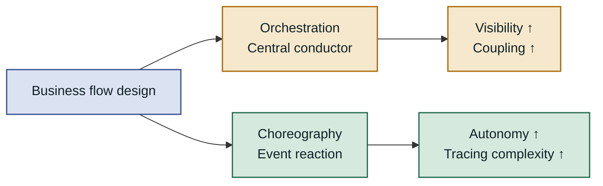
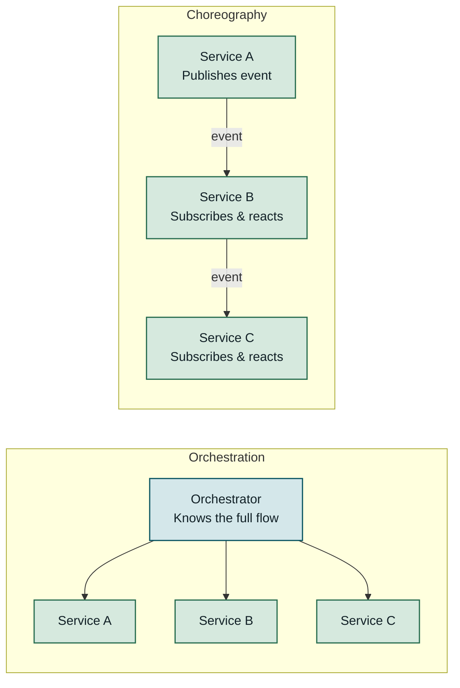
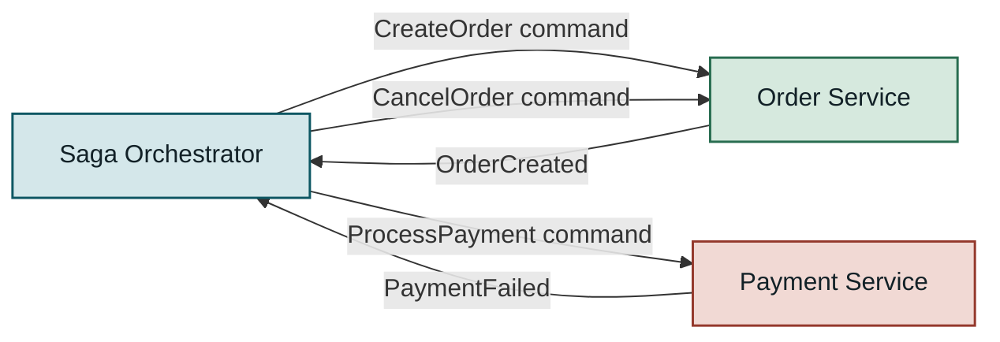
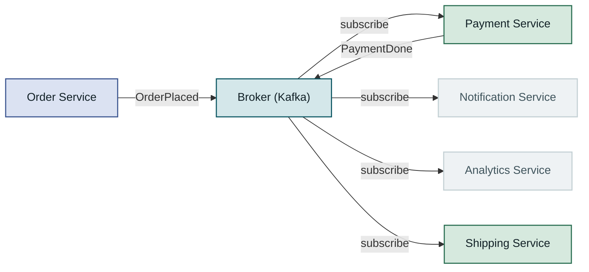
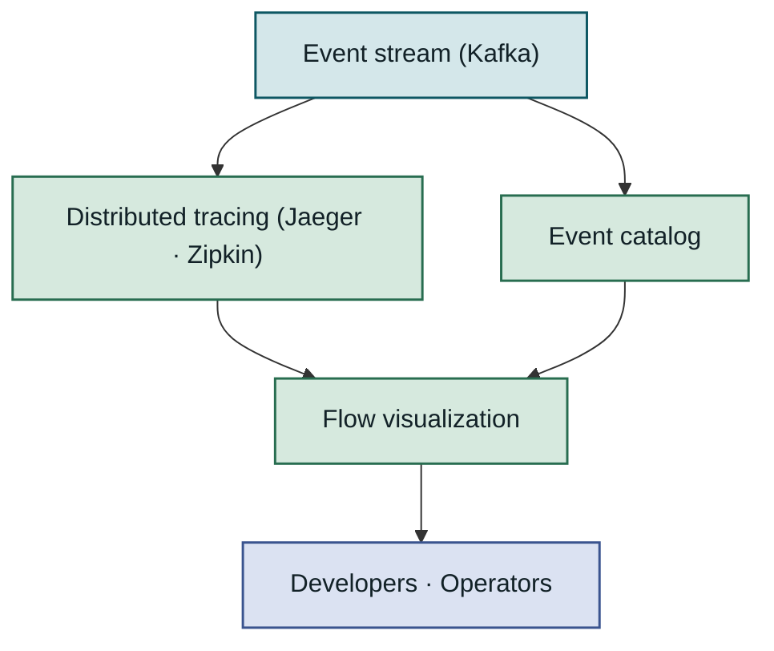
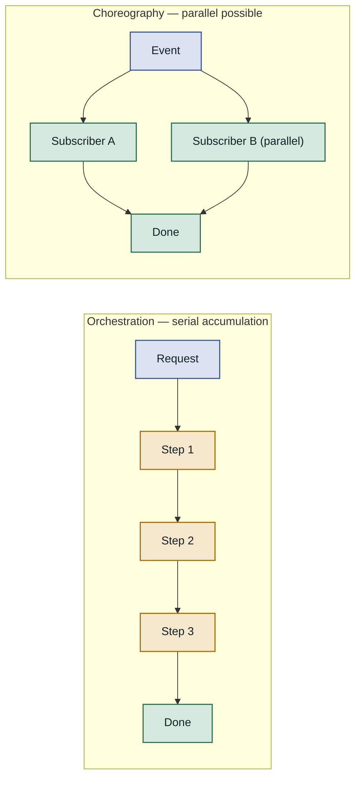
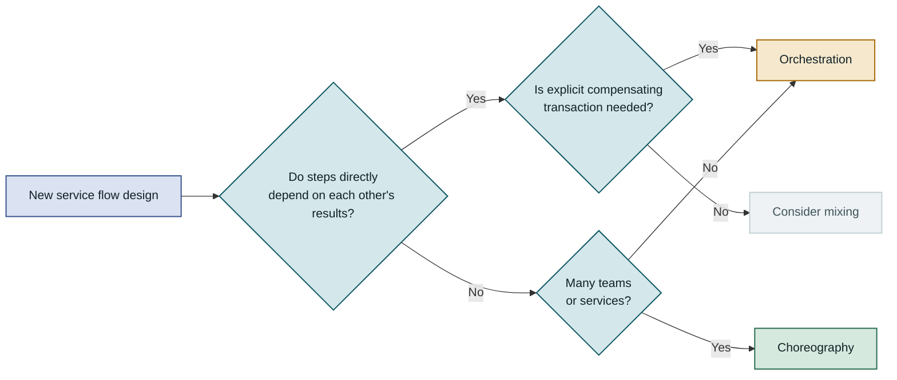
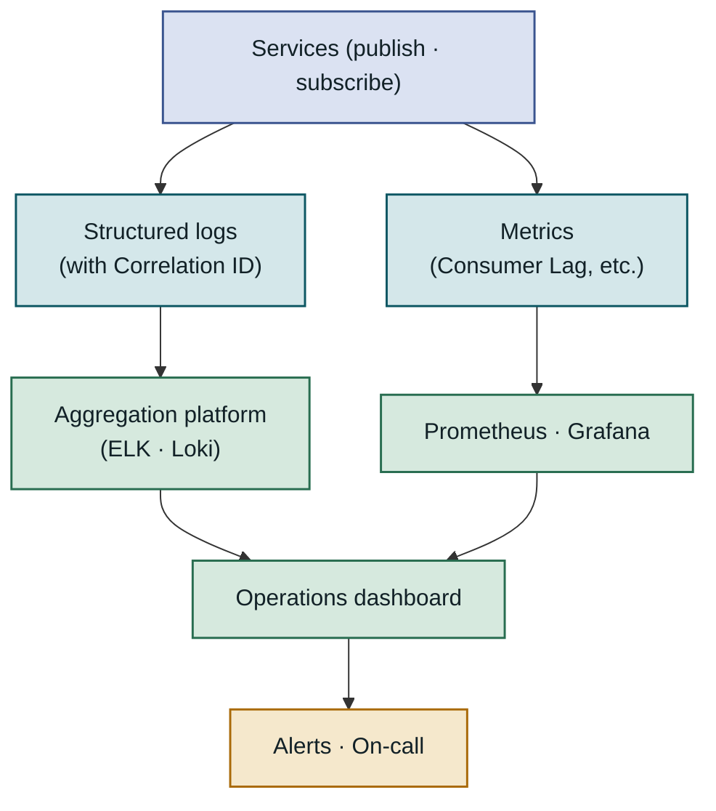

## Table of Contents

1. Overview
2. Core Concepts: Orchestration and Choreography
3. Orchestration Pattern — Central Conductor
4. Choreography Pattern — Autonomous Event Reaction
5. Performance and Tradeoffs
6. Design Decision Criteria for Production
7. Closing

---

## Overview

### The Problem

In a microservice architecture, when multiple services collaborate to complete a single business transaction, the collaboration model determines the system's complexity, maintainability, and team autonomy. **Service Orchestration** and **Choreography** are two fundamental approaches to designing this collaboration structure. The difference is not merely a style preference — it is a fundamental philosophical question of "where does knowledge about the business flow live?" The choice affects how you debug, how much coordination overhead exists between teams, and how failures are isolated. This post analyzes how each pattern works and what tradeoffs it carries, with concrete examples, and offers a decision framework for choosing between them.

### Limits of the Obvious First Choice

When migrating from a monolith to microservices, the most natural instinct is to have one place issue calls to each service in order. This is clear and intuitive at first, but once the service count exceeds a few dozen, the centralized approach becomes either a bottleneck or a source of confusion with no clear owner. Conversely, introducing event-driven design without a plan makes it hard to track which services publish or subscribe to which events, and tracing failures becomes very painful. Both patterns have distinct strengths and limits. Without a deliberate decision framework, you accumulate architectural debt no matter which one you pick.



The two patterns resolve the visibility-vs-autonomy tradeoff in opposite directions.

---

## Core Concepts: Orchestration and Choreography

### Definitions and the Philosophical Difference

**Orchestration** has a single central coordinator (Orchestrator) that knows the entire business flow and issues commands to each participating service to drive work forward. The coordinator waits for each step's result, decides what comes next, and directly manages error handling and compensating transactions. Think of an orchestra conductor giving each section its cue to control the whole performance.

**Choreography** has no central coordinator. Each service publishes events, and other services that care about those events subscribe and react autonomously. No service directly commands another, and the business process emerges naturally as a chain of events between services. The analogy is dancers who complete a performance by reacting to each other's movements, with no conductor.

The core difference between the two patterns is not merely "who makes the call." It is **knowledge location**. In orchestration, knowledge of the business flow is concentrated in one place — the orchestrator. In choreography, that knowledge is distributed across services. The rule "when an order is created, start payment" lives in the payment service. The rule "when payment is done, prepare shipment" lives in the shipping service. This difference becomes a real design pressure as the system grows.



Whether knowledge is concentrated in one place or distributed across services is the essential distinction between the two patterns.

### Commands vs Events

Understanding these two patterns requires a clear distinction between **commands** and **events**. A command asks a recipient to perform a specific action. "Process this payment" is a command; the sender knows who the recipient is and expects a result. Orchestration operates primarily on commands.

An event declares a fact that has already occurred. "An order was placed" is an event; the publisher does not know or care who consumes it. Choreography exploits this property of events to reduce coupling between services. Confusing the two concepts leads to designs that look like choreography but are actually implicit orchestration — for example, publishing an event while embedding in the code an assumption that a specific service must process it.

### At Which Layer Do You Choose?

Both patterns are strategies at the inter-service communication layer, but you do not have to apply only one across the entire system. In practice, a single microservice system often mixes them: orchestration for complex transactional flows, choreography for loose event propagation. For example, an order-processing Saga can be implemented with an orchestrator, while the reactions of marketing, analytics, and notification systems after the order-completed event are designed with choreography. The key question for each situation is which pattern gives you a better deal on **cost of change** and **operational transparency**.

---

## Orchestration Pattern — Central Conductor

### Saga Orchestrator Structure

The most common orchestration implementation for distributed transactions is the **Saga pattern**. Each step is handled as a local transaction, and on failure, compensating transactions from previous steps execute in reverse order. The Saga orchestrator manages the entire flow as a state machine. The orchestrator issues commands to each service; the service responds with result events; the orchestrator reads those responses and decides the next command or triggers compensation.



When payment fails, the orchestrator immediately takes control of the compensating transaction flow.

In the Spring ecosystem, **Axon Framework** and **Temporal** both support orchestration-based Sagas. Below is the core structure of an order-processing Saga using Axon Framework. When the order service publishes `OrderPlacedEvent`, the Saga starts; the Saga orchestrator then issues a payment command and decides the next step based on the success or failure event it receives.

```java
@Saga
public class OrderSaga {

    @Autowired
    private transient CommandGateway commandGateway;

    private String orderId;

    @StartSaga
    @SagaEventHandler(associationProperty = "orderId")
    public void handle(OrderPlacedEvent event) {
        this.orderId = event.getOrderId();
        // Issue command to payment service
        commandGateway.send(new ProcessPaymentCommand(
            event.getOrderId(),
            event.getAmount()
        ));
    }

    @SagaEventHandler(associationProperty = "orderId")
    public void handle(PaymentProcessedEvent event) {
        // Payment succeeded → issue shipment command
        commandGateway.send(new PrepareShipmentCommand(
            event.getOrderId(),
            event.getShippingAddress()
        ));
    }

    @SagaEventHandler(associationProperty = "orderId")
    public void handle(PaymentFailedEvent event) {
        // Payment failed → compensate: cancel order command
        commandGateway.send(new CancelOrderCommand(event.getOrderId()));
        // Result: OrderCancelledEvent published → Saga ends
    }

    @EndSaga
    @SagaEventHandler(associationProperty = "orderId")
    public void handle(ShipmentPreparedEvent event) {
        // Saga complete — Axon persists state and terminates the instance
    }
}
```

Axon automatically persists and manages state for classes annotated with `@Saga`. Lifecycle boundaries are declared explicitly with `@StartSaga` and `@EndSaga`, and each step is handled with `@SagaEventHandler`. Compensating transaction logic is concentrated in one place — the orchestrator — so understanding or modifying the entire flow requires opening a single file.

### Visibility and Debugging in Orchestration

The biggest practical strength of orchestration is **visibility**. You can find out what step you are on and where a failure occurred just by querying the orchestrator's state. Tools like Temporal and AWS Step Functions provide visual execution history dashboards and can replay a specific instance's timeline. In production, being able to immediately answer "why hasn't order #12345 shipped?" significantly reduces the on-call burden for the team.

On the downside, the orchestrator itself can become a single point of failure. If it goes down, all in-flight flows stop. To prevent this, you either configure the orchestrator for high availability or adopt an approach like Temporal's, which checkpoints workflow state to external storage. Another risk is the **God Object** problem — the orchestrator gradually accumulates more and more logic. Once "if this service succeeds, check that condition, then call the next service" patterns pile up, one class ends up containing every business decision in the system.

| Orchestration Strengths | Orchestration Weaknesses |
|---|---|
| Business flow is explicit in one place | Orchestrator complexity tends to grow |
| Easy to debug and monitor | Potential single point of failure |
| Explicit compensating transaction management | Higher coupling between orchestrator and services |
| Consistent ordering and retry control | Deployment depends on orchestrator releases |

### When Orchestration Fits

Orchestration is the right choice when a business transaction requires a strict order of steps or needs a clear rollback procedure on failure. The classic case is a **linear, dependent flow** where each step's result directly feeds the next: financial transactions, flight reservations, medical workflows. Examples include payment amounts that determine shipping options, or stock-check results that decide whether an order is accepted — situations where the response data from one step must be included in the next command. When the flow involves external system integration (legacy API calls, third-party payment gateways), centrally managing retries, timeouts, and circuit breakers is far safer.

---

## Choreography Pattern — Autonomous Event Reaction

### Event Broker-Based Design

Choreography is built around an **event broker**. Brokers like Kafka, RabbitMQ, or AWS EventBridge relay events; each service subscribes to events it cares about and reacts independently. No service calls another directly — services only publish to or consume from the broker. Publishers do not need to know who consumes their events, and consumers have no involvement in the publisher's internal implementation.



With the broker at the center, publishers and subscribers are fully decoupled — no direct service-to-service dependency exists.

Each service manages only the schema of the events it publishes as a contract; it does not need to know who subscribes to them. This property is what creates choreography's biggest strength: **low coupling**. Adding a new service requires no changes to existing services — just subscribe to the relevant event. Running a parallel processing service for an A/B test, or adding a new analytics pipeline, is possible without touching existing code at all. This scalability becomes an overwhelming advantage over orchestration as teams grow and the service count increases.

### Choreography Implementation and Event Contracts

In choreography, event schemas are contracts between services. If those contracts break, all subscribers are affected. When using Kafka, the industry-proven approach is to combine a **Schema Registry** with Avro or Protobuf to manage schema evolution. Enforcing a policy that only allows **backward-compatible changes** at the Schema Registry level ensures existing subscribers can safely consume new events.

Below is the structure for publishing and consuming order events with Spring Kafka. The order service publishes `OrderPlacedEvent` to a Kafka topic, and the payment service and notification service each consume it independently. The two consumers have no knowledge of each other.

```java
// Publisher — Order Service (Team A)
@Service
public class OrderService {
    private final KafkaTemplate<String, OrderPlacedEvent> kafkaTemplate;

    public void placeOrder(Order order) {
        order.save(); // local transaction complete
        // Publish event — does not know who will consume it
        kafkaTemplate.send("order.placed", order.getId(),
            new OrderPlacedEvent(order.getId(), order.getAmount(),
                order.getUserId()));
        // Result: message written to Kafka "order.placed" topic
    }
}

// Subscriber — Payment Service (Team B, deployed independently)
@KafkaListener(topics = "order.placed", groupId = "payment-service")
public void handleOrderPlaced(OrderPlacedEvent event) {
    paymentProcessor.process(event.getOrderId(), event.getAmount());
    // Publish own event — next subscriber (shipping service) will react
    kafkaTemplate.send("payment.processed",
        new PaymentProcessedEvent(event.getOrderId()));
    // Result: message written to "payment.processed" topic
}
```

The publisher sends messages only to the topic. The subscriber pulls messages from the topic, processes them, and publishes its own event. The two services have zero code-level dependency and can be deployed and scaled independently. When a new consumer appears (e.g., a points-accrual service), it simply subscribes to the same topic without any changes to existing code.

### The Complexity of Choreography — Tracing a Distributed Flow

The biggest challenge in choreography is that **the overall flow is not explicitly stated anywhere in the code**. The "order processing process" is expressed implicitly through event handlers scattered across the order, payment, shipping, and notification services. A new developer who wants to understand the full flow must manually trace the event publish/subscribe lists across all services. Left unaddressed, this becomes a **spaghetti event** structure as the event chain grows longer.



Operational visibility in a choreography environment does not appear automatically — you must build separate tracing infrastructure.

There are three practical approaches to this problem. First, maintain a dedicated **Event Catalog** that documents each event's publisher, subscribers, and schema ([EventCatalog](https://www.eventcatalog.dev/) is gaining traction as an open-source tool for this). Second, apply **Distributed Tracing** so you can visualize a single business flow in Jaeger or Zipkin using a Correlation ID. Third, use the **Event Storming** design technique to have the entire team explicitly model the event flow before writing any code. All three approaches compensate for the lack of visible flow by making it explicit outside the code — which means adopting choreography implies investing in this infrastructure.

---

## Performance and Tradeoffs

### Latency and Throughput Characteristics

When orchestration uses a synchronous request-response flow, the latency of each step adds up. In a ping-pong structure of orchestrator → service A → orchestrator → service B → orchestrator, network round-trips occur `steps × 2` times. Designing with asynchronous command-event exchanges improves this, but increases implementation complexity. Workflow engines like Temporal introduce additional I/O from state checkpointing, which can become a bottleneck in high-frequency, low-latency scenarios.

Choreography is inherently asynchronous. The moment the order service publishes an event, its own work is done, and subsequent steps can proceed in parallel. If payment and notification proceed independently and concurrently, the total flow time is determined by the single slowest step. This is the core reason choreography is preferred in high-throughput environments processing thousands of simultaneous orders.



The difference between serial and parallel processing determines overall latency in high-throughput environments.

### Failure Isolation and Resilience

In choreography, the event broker acts as a **buffer**. Even if the payment service goes down temporarily, events remain in the broker and are consumed once the service recovers. The publisher — the order service — is unaware of the consumer's failure and can keep publishing events without interruption. In Kafka, configuring a retention period lets you keep days' worth of events, enabling reprocessing after a service outage.

In orchestration, the orchestrator's own availability is the availability of the entire flow. Even with an asynchronous orchestrator, if one service stops responding, the flow stalls at that step or retry logic must intervene. Temporal addresses this by persisting workflow state, but then the availability of the Temporal cluster becomes a new dependency.

| Characteristic | Orchestration | Choreography |
|---|---|---|
| Flow visibility | High — single coordinator to query | Low — distributed tracing required |
| Service coupling | Medium — coupled to orchestrator | Low — only to event schema |
| Failure isolation | Limited — depends on orchestrator | High — broker buffers events |
| Throughput scaling | Requires vertical scaling per step | Easy horizontal scaling of subscribers |
| Rollback/compensation | Explicit and centralized | Each service implements its own |
| Adding new features | Requires orchestrator changes | Just add a new subscriber |
| Team autonomy | Low — must coordinate with orchestrator team | High — teams develop independently |

### Decision Criteria

Neither pattern is unconditionally better. The decision flow below summarizes the criteria that repeatedly emerge in practice.



Whether steps directly depend on each other's results, and whether compensating transactions are required, are the first decision criteria.

If steps directly depend on each other (payment amount determines shipping option) and strict rollback is needed, orchestration is the natural fit. If multiple systems need to react independently after an event fires (marketing, analytics, email after order completion), choreography is far more flexible. Choreography also aligns better with the organization when teams have different deployment cadences and want to minimize inter-team coordination overhead.

---

## Design Decision Criteria for Production

### Common Mistakes and Pitfalls

The most frequent mistake when adopting orchestration is **accumulating business logic in the orchestrator**. The orchestrator should manage flow only. The judgment "if the payment amount exceeds one million won, request additional authentication" belongs inside the payment service — the orchestrator does not need to know about it. Once that boundary breaks down, the orchestrator grows bloated and every service becomes dependent on orchestrator changes. When this problem materializes, you end up with "new features only ship when the orchestrator ships."

A common pitfall in choreography is **event ordering dependency**. Kafka guarantees order within a partition, but not across partitions or different topics. If you bake into your code the assumption that "a shipment-started event must always arrive after a payment-completed event," an unexpected delivery order will cause a failure. Additionally, the same event can be delivered more than once due to network retries. Each subscriber must process events **idempotently** and handle duplicate or out-of-order events safely.

> Each service in a choreography system should process events as if they are arriving for the first time, while being able to safely ignore an event that has already been processed. Idempotency is a prerequisite, not an option.

Another pitfall is **breaking backward compatibility of event schemas**. If a publisher removes a field or changes a type, every subscriber consuming that event is affected. Event schemas must be versioned as strictly as a public API. When a field needs to be removed, keep it in a Deprecated state for a period so subscribers have time to migrate.

### Monitoring and Debugging Strategy

In both patterns, **Correlation ID**-based distributed tracing is mandatory in production. Every service call and every event that originates from a single business event must carry the same ID, and logs and metrics must be aggregatable by that ID. In Spring, combining Micrometer with OpenTelemetry lets you automatically propagate Trace Context across HTTP, Kafka, gRPC, and other channels.



Operational visibility is complete only when structured logs and metrics come together.

In an orchestration environment, the orchestrator's state table is the primary monitoring target. You need alerts for instances stuck in a particular state for too long, or instances where the retry count has exceeded a threshold. Temporal makes this relatively straightforward with its built-in workflow state dashboard and alert hooks. In a choreography environment, **Consumer Lag** is the key metric. A sudden spike in lag for a particular consumer group signals that the service cannot keep up with processing and needs immediate scaling or a review of its processing logic.

### Scaling and Migration Strategy

Most systems end up mixing both patterns over time. A pragmatic evolution path is to start with simple orchestration, then progressively migrate some flows to choreography as the service count grows and teams diverge. The safest migration strategy is the **Event Bridge** pattern: relay the result events that the existing orchestrator publishes to a broker, and gradually transition new subscribers to consume directly. This approach lets you preserve the existing orchestrator without risk while incrementally expanding the choreography layer.

| Organization Scale | Recommended Pattern | Reason |
|---|---|---|
| 1-2 teams, up to 5 services | Orchestration | Simplicity, fast debugging |
| 3-5 teams, 10-30 services | Mixed (choose per flow) | Orchestration for transactions, choreography for propagation |
| 5+ teams, 30+ services | Choreography first | Team autonomy and independent deployments are paramount |

Team size and service count are significant variables. If there are fewer than three teams and fewer than ten services, the benefits of choreography may not outweigh the management convenience of orchestration. Conversely, if there are five or more teams and dozens of services, managing every flow around a central orchestrator becomes a bottleneck in itself. Conway's Law ("systems mirror the communication structure of the organization that builds them") applies here too. Each team must be able to publish and subscribe to events autonomously in order to maintain independent deployment cadences.

---

## Closing

### Key Takeaways

Orchestration and choreography are two fundamentally different philosophies for designing microservice event flows. Orchestration concentrates knowledge of the flow in one place to gain visibility and control, at the cost of coupling to the orchestrator. Choreography distributes that knowledge across services to achieve low coupling and team autonomy, at the cost of requiring separate infrastructure investment for overall flow visibility and distributed tracing. The two patterns are not mutually exclusive — mixing them within a single system based on context is the norm. What matters is clearly understanding the consequences of each choice and consciously accepting the tradeoffs.

### Decision Criteria

In the end, the choice comes down to three questions. **First**: does this flow have direct dependencies between steps, and is strict rollback required on failure? If yes, orchestration fits. **Second**: are there three or more services that need to react to this event, with the possibility of more subscribers in the future? If yes, choreography scales better. **Third**: is this flow owned by a single team or multiple teams? If multiple teams, choreography reduces organizational friction by letting each team deploy independently without touching the orchestrator. Architecture decisions must reflect team structure, deployment cadence, and operational maturity just as much as technical correctness. No pattern is best in every situation, and the design should evolve alongside the system.
