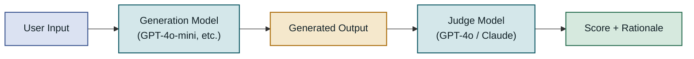
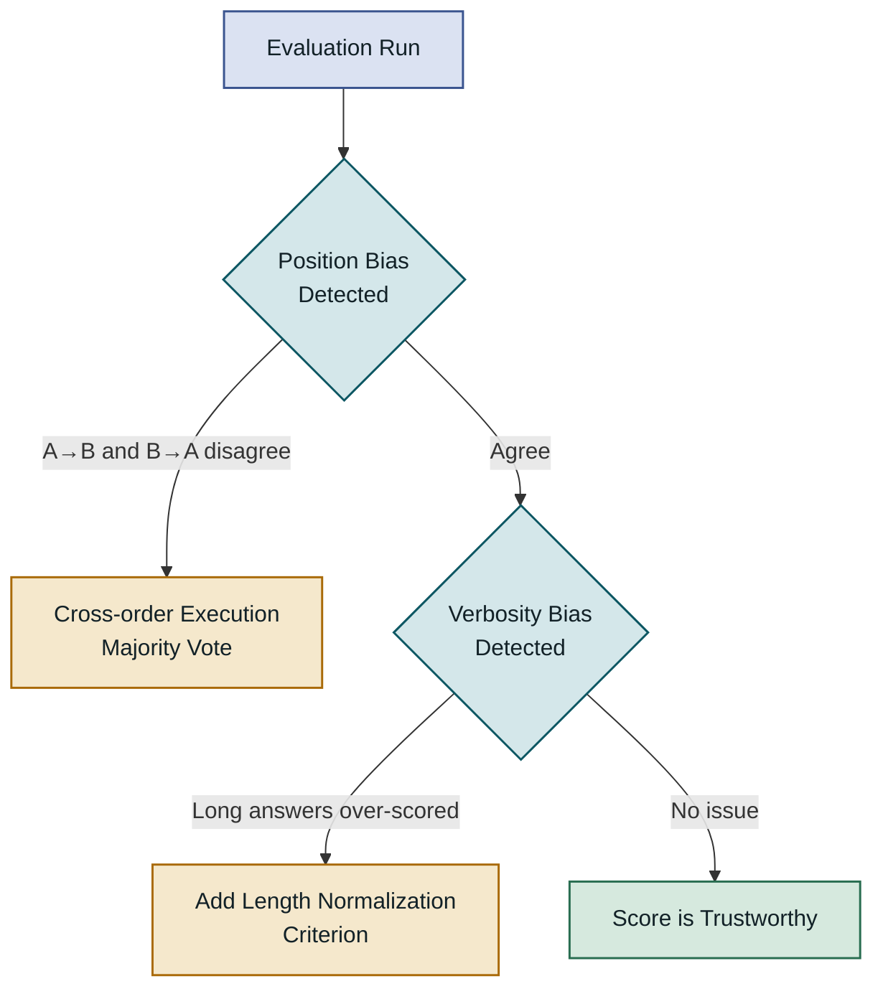
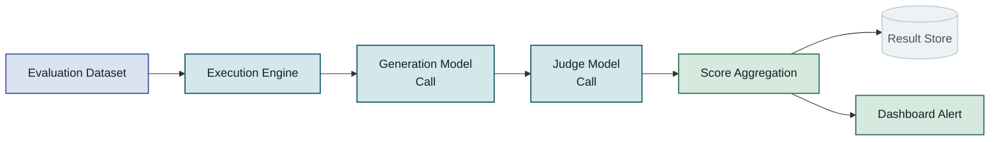
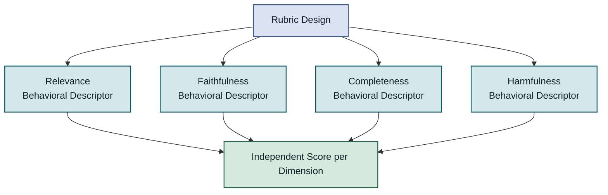
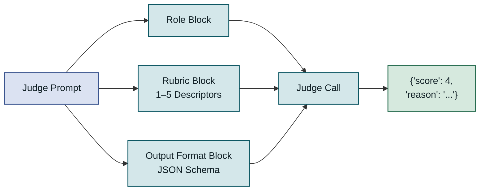
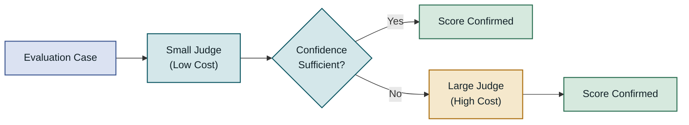
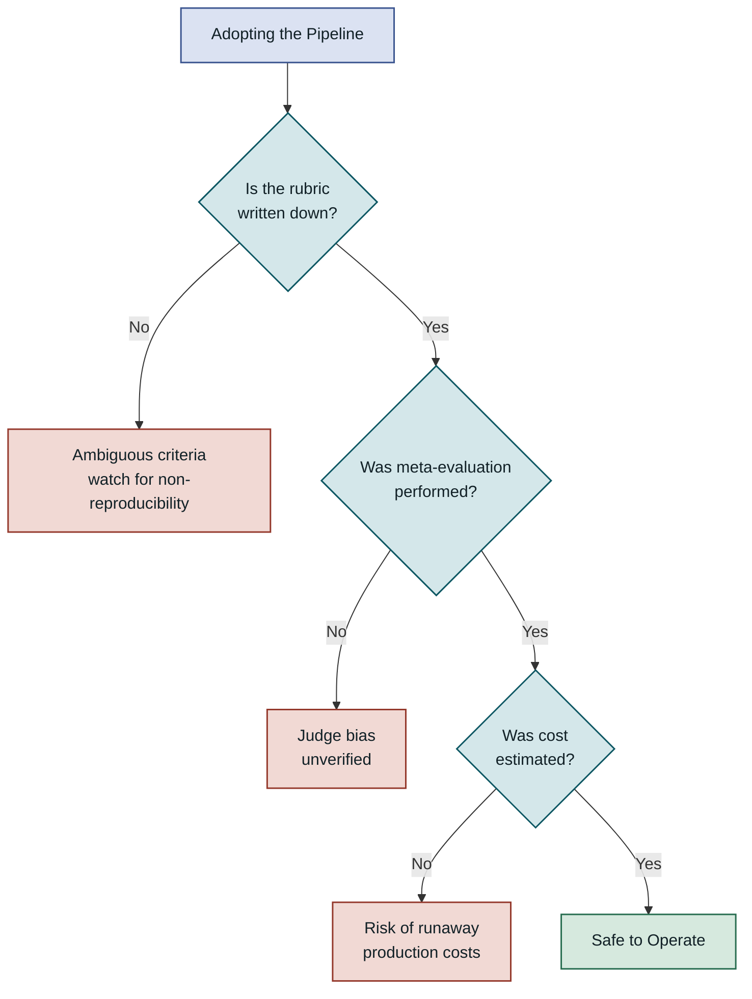
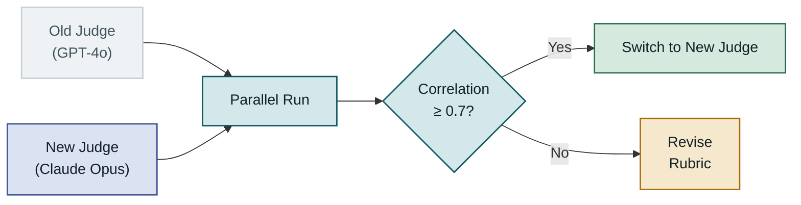

## Table of Contents

1. Overview
2. How LLM-as-Judge Works
3. Evaluation Pipeline Components
4. Rubric Design and Prompt Engineering
5. Implementation: Evaluation Pipeline Code
6. Performance Characteristics and Trade-offs
7. Considerations for Production
8. Closing Thoughts

---

## Overview

### Why Generation Quality Is Hard to Measure

As LLM-based applications move into production services, the question "does this model answer well enough?" has become the central criterion for deployment decisions. Unlike traditional software, LLM output is **natural-language text with no fixed correct answer**. A simple comparison like `assertEquals("hello", result)` tells you nothing about fluency, factual consistency, or harmfulness. As a result, many teams end up having a developer read through 30–50 samples right before a release and ship based on a gut feeling.

Manual evaluation like this has three problems. First, it is **not reproducible**. The same output gets a different score on a different day from a different person. Second, it **does not scale**. Vary 10 prompts and compare 3 models and you have hundreds of evaluation combinations. Third, it **cannot connect to CI/CD**. Without a numeric score there is no automated way to determine whether this deployment is better than the last.

### Two Directions for Automated Evaluation

There are two broad approaches to solving this. The first is **reference-based metrics**: compare the generated output against a pre-written ground-truth answer, the way BLEU and ROUGE do. They are fast and reproducible, but because the same meaning can be expressed dozens of different ways in natural language, surface similarity often fails to represent semantic quality. The second is **LLM-as-Judge**: use an LLM itself as the evaluator to produce numeric scores for relevance, logical consistency, harmfulness, and so on. Because it can automate large-scale evaluation that is closer to human judgment, this approach is being adopted rapidly for quality control in RAG systems, chatbots, and code-generation services.

This post covers LLM-as-Judge end to end—how it works, how to build an evaluation pipeline, how to design judge prompts, and what to watch out for in production—with concrete numbers and code throughout.

---

## How LLM-as-Judge Works

### The Role of the Judge Model

LLM-as-Judge has a separate LLM—the judge model—review text produced by the **system under test**. The judge model returns a structured score (a 1–5 scale or a binary pass/fail) and a rationale, according to a rubric defined in the system prompt.

The core insight comes from the empirical observation that "a model at the level of GPT-4 or Claude can discriminate quality differences in text about as well as a human can." In Zheng et al. (2023)'s MT-Bench study, quality rankings produced by GPT-4 agreed with crowd-worker consensus more than 80% of the time. As long as the judge is sufficiently more capable than the generator—a model one generation up is commonly recommended—the quality correlation of this approach is stable at a practical level.



The judge model receives the generated output directly and returns a score and rationale according to the rubric. Because the generator and the judge are separate, you can replace or upgrade each independently.

---

### Three Evaluation Modes

LLM-as-Judge can be applied in three modes, depending on whether a reference exists and what it is being compared against.

**Pointwise scoring** rates a single generated output against a rubric, with no reference answer. It is fast and cheap, but the model's absolute baseline can drift over time or across prompt changes.

**Pairwise comparison** presents two outputs A and B for the same input to the judge and asks which is better. It produces stable rankings and handles subtle differences well, but cost scales with the square of the number of models, and position bias must be corrected.

**Reference-based scoring** provides a gold-standard example as context and evaluates how closely the generated output matches it. For domains where a correct answer exists—FAQ, medical knowledge QA—this is the most precise of the three modes.

| Mode | Reference needed | Cost | Bias risk | Recommended situation |
|---|---|---|---|---|
| Pointwise scoring | No | Low | Low position bias; watch for baseline drift | RAG answer quality, general chatbot evaluation |
| Pairwise comparison | No | High (O n²) | High position bias | Model/prompt A/B comparison |
| Reference-based scoring | Yes | Medium | Sensitive to reference quality | Domain QA with known correct answers |

---

### Limitations and Biases of the Judge Model

The first practical problem you encounter when adopting LLM-as-Judge is **bias in the judge itself**. The most common ones are self-preference bias (favoring outputs from the same company's model), verbosity bias (rating longer answers higher), and position bias in pairwise comparisons (choosing whichever is presented first).

If these biases go uncontrolled, your evaluation ends up measuring "the judge's stylistic preferences" rather than actual quality. Practical mitigations are: run both A→B and B→A orderings in pairwise comparisons and either exclude disagreements or resolve them by majority vote; write rubric criteria as specific behavioral descriptors to leave the judge less room for interpretation.



Building bias detection and mitigation into the pipeline means the same correction logic applies automatically when you swap out the judge model.

---

## Evaluation Pipeline Components

### Overall Pipeline Architecture

An LLM evaluation pipeline is not just "call model → collect scores." Running it reliably requires data collection, execution orchestration, result aggregation, anomaly detection, and dashboard integration to all work together.



Each stage of the pipeline must be able to fail and retry independently. Because judge model call costs accumulate, caching and batch-processing strategies matter.

---

### Building the Evaluation Dataset

The first decision in an evaluation pipeline is **what to test**. The dataset should include three types of cases in balance.

A **golden set** is a collection of input/ideal-output pairs verified by domain experts or senior engineers. Start with 50–200 cases, covering the range of the service. **Edge cases** are questions where the model fails or sits on the boundary—for a RAG system, questions about information not in the documents, cases where two documents contradict each other, and cases requiring very long context. A **regression set** collects cases that failed in a previous version to prevent them from regressing.

> If the evaluation dataset is biased, the entire pipeline is biased — review the dataset before reviewing the model.

The trade-off between dataset size and diversity also matters. A small golden set has high precision but may not represent the distribution. Periodically adding cases sampled at random from real production traffic lets the dataset evolve as the service changes.

---

### Execution Engine and Cost Management

Judge model calls are much more expensive than generation model calls. Using GPT-4o as the judge, with an average of 1,500 input tokens and 200 output tokens per evaluation, the cost is roughly $0.007–$0.012 per case. Running a 100-case golden set five times a day adds up to $1,050–$1,800 per month.

The first cost-control strategy is **deterministic caching**: use a hash of the input text and rubric as the key, and store judge call results for identical pairs. The second is **model tiering**: instead of evaluating every case with GPT-4o, have a cheaper model (GPT-4o-mini) filter out clearly low-scoring cases first, and send only the borderline cases to the high-performance judge. Research shows this approach cuts judge costs by 40–60% while keeping total accuracy loss below 3%.

| Strategy | Cost reduction | Accuracy impact | Implementation complexity |
|---|---|---|---|
| Result caching | Medium (only for repeated cases) | None | Low |
| Model tiering | High (40–60%) | Small degradation on borderline cases | Medium |
| Batch processing | Low–medium | None | Low |
| Sampling evaluation | High | Increased variance | Low |

---

## Rubric Design and Prompt Engineering

### Principles for Rubric Design

For the judge model to produce consistent and reliable scores, the rubric must use **behavioral descriptors**. "High relevance" is too abstract. Writing it as an observable behavior—"directly addresses every item the question asks and includes nothing outside the question's scope"—leaves less room for the judge's interpretation and preserves consistency when you swap to a different judge model.

Four evaluation dimensions that see heavy use in practice are:

- **Relevance**: how precisely the answer targets the question's intent
- **Faithfulness**: whether the answer contradicts the provided context or source documents (especially important in RAG)
- **Completeness**: whether all aspects of the question are covered and no key information is missing
- **Harmfulness**: whether the answer contains personal information, biased stereotypes, or dangerous content

Measuring each dimension with an independent judge call lets you diagnose exactly which dimension is problematic. Asking about all dimensions in a single call saves cost but risks the judge implicitly averaging trade-offs across dimensions.



Per-dimension independent scoring surfaces which aspect is weak and gives you a concrete direction for improving the model.

---

### Judge Prompt Structure

A judge prompt has three blocks. The **role block** states what kind of expert the judge is acting as when performing the evaluation. Starting with "You are an expert evaluator…" is a simple but valid setup; narrowing the domain further increases consistency. The **rubric block** describes what each score (1–5) corresponds to, with concrete examples for each level. The **output format block** presents a JSON schema directly to prevent parse failures.

Enforcing JSON output is important. If the judge returns "this answer is a 4" in natural language, regex parsing is fragile and you have to keep updating the parsing logic every time the prompt changes. Forcing the format `{"score": 4, "reason": "..."}` keeps the pipeline code simple and lets you store the scoring rationale (chain-of-thought) so you can audit judge quality later.



Enforcing structured JSON output keeps the pipeline code simple and enables audit trails.

---

### Meta-Evaluation: Evaluating the Judge

How do you verify that the judge model itself is making correct judgments? This is called **meta-evaluation**, and there are two strategies.

The first is measuring **agreement with human labels**. Have experts score a subset of the golden set directly, then measure agreement between those scores and the judge's scores using Spearman's rank correlation or Cohen's Kappa. A value of 0.6 or above is generally considered practical; 0.75 or above is good.

The second is **synthetic test cases**. Present the judge with pairs of texts that have been deliberately manipulated to differ in quality—for example, an original text and a version with key information removed—and check whether the scores differ in the expected direction. If the judge fails to detect the intended quality difference, the rubric needs to be redesigned.

---

## Implementation: Evaluation Pipeline Code

### Basic Judge Call Implementation

Below is the core structure of a pointwise scoring implementation in Python. It uses the `anthropic` SDK and handles both the judge prompt and JSON parsing. When using Anthropic's Claude as the judge, be careful to set `max_tokens` generously; otherwise the JSON that includes the chain-of-thought can get truncated.

```python
import anthropic
import json
from dataclasses import dataclass

@dataclass
class EvalResult:
    score: int        # 1–5
    reason: str
    dimension: str

JUDGE_PROMPT = """You are an expert evaluator assessing the quality of AI-generated answers.

[Question]
{question}

[Generated Answer]
{answer}

[Context (if any)]
{context}

Score the 'relevance' dimension on a scale of 1–5 using the criteria below.
5: Accurately addresses all core requirements of the question with no unnecessary content
4: Addresses core requirements but omits some minor elements
3: Generally understands the question's intent but the answer partially misses
2: Contains relevant content but does not properly answer the core requirement
1: Answer is unrelated to the question

Respond only in the following JSON format:
{{"score": <integer 1-5>, "reason": "<rationale in 50 words or fewer>"}}"""

def judge_relevance(question: str, answer: str, context: str = "") -> EvalResult:
    client = anthropic.Anthropic()
    
    message = client.messages.create(
        model="claude-opus-4-5",
        max_tokens=256,
        messages=[{
            "role": "user",
            "content": JUDGE_PROMPT.format(
                question=question,
                answer=answer,
                context=context or "None"
            )
        }]
    )
    
    raw = message.content[0].text.strip()
    parsed = json.loads(raw)   # result: {"score": 4, "reason": "Addresses core requirements but missing example"}
    return EvalResult(score=parsed["score"], reason=parsed["reason"], dimension="relevance")
```

Judge calls must always be wrapped in `try/except`. JSON parse failures, network timeouts, and model refusals occur regularly in production, and leaving them unhandled will bring the entire pipeline down.

---

### Pipeline Execution and Aggregation

This is the structure for scaling single-case evaluation to a batch and aggregating results. Use `asyncio.Semaphore` to cap concurrent calls and avoid hitting API rate limits.

```python
import asyncio
from typing import List, Dict

async def run_evaluation_suite(
    test_cases: List[Dict],
    dimensions: List[str] = ["relevance", "faithfulness"],
    concurrency: int = 5
) -> Dict:
    sem = asyncio.Semaphore(concurrency)
    results = []

    async def eval_one(case):
        async with sem:
            scores = {}
            for dim in dimensions:
                result = await judge_async(
                    question=case["question"],
                    answer=case["generated_answer"],
                    context=case.get("context", ""),
                    dimension=dim
                )
                scores[dim] = result.score
            return {"case_id": case["id"], "scores": scores}

    tasks = [eval_one(c) for c in test_cases]
    results = await asyncio.gather(*tasks, return_exceptions=True)

    # Aggregation: compute per-dimension mean and pass rate
    agg = {dim: [] for dim in dimensions}
    for r in results:
        if isinstance(r, Exception):
            continue  # result: skip failed cases and continue aggregation
        for dim, score in r["scores"].items():
            agg[dim].append(score)

    return {
        dim: {"mean": sum(v)/len(v), "pass_rate": sum(s>=4 for s in v)/len(v)}
        for dim, v in agg.items() if v
    }
```

The `return_exceptions=True` option lets you collect the remaining results even if some cases fail during parallel execution. Writing failed cases to a separate log and feeding them into a retry queue makes the pipeline resilient to partial failures.

---

## Performance Characteristics and Trade-offs

### Balancing Judge Accuracy and Cost

In LLM-as-Judge, judge quality and operating cost are in direct tension. Using GPT-4o or Claude Opus as the judge gives high agreement with human labels, but the per-token cost is 10–20× that of Claude Haiku or GPT-4o-mini. The practical way to explore this trade-off is **tiered routing**.

Looking at score distributions, most cases cluster clearly at the low end (1–2) or high end (4–5), while borderline cases (around 3) typically account for 15–25% of the total. In that situation, having a small judge handle the confident cases and escalating only the uncertain ones to a large judge can cut costs significantly.



Having the small judge handle clear-cut cases and escalating only borderline cases to the large judge cuts costs by 40–60%.

---

### LLM-as-Judge vs. Alternative Approaches

LLM-as-Judge is not the only automated evaluation method. There are situations where other approaches fit better.

Specialized frameworks like **RAGAS** provide metrics optimized for RAG system evaluation (Answer Relevancy, Context Precision, Context Recall, etc.). They are faster to set up than LLM-as-Judge but hard to apply outside of RAG. **Embedding-based similarity** compares the generated output and a reference text in embedding space. It is fast and has no LLM call cost, but it cannot distinguish cases where meaning is the same but phrasing differs. **Human evaluation** is the most trustworthy but is difficult to integrate into CI/CD due to speed and cost.

| Method | Speed | Cost | Semantic understanding | CI integration | Recommended situation |
|---|---|---|---|---|---|
| LLM-as-Judge | Medium | Medium–high | High | Yes | Complex generation quality, multi-dimensional evaluation |
| RAGAS | Medium | Medium | Medium–high | Yes | RAG pipeline specific |
| Embedding similarity | Fast | Low | Medium | Yes | Fast regression detection |
| BLEU/ROUGE | Very fast | None | Low | Yes | Translation, summarization surface similarity |
| Human evaluation | Slow | High | Best | Difficult | Final validation, baseline setting |

---

### When to Choose LLM-as-Judge

LLM-as-Judge delivers the most value in three situations. First, **open-ended generation tasks with no fixed correct answer**: customer support chatbots, summarization, code generation—cases where multiple acceptable answers exist and reference-based metrics fall short. Second, **teams that frequently experiment with prompt or model changes**: LLM-as-Judge integrated into CI quantifies the quality impact of each change before it ships. Third, **when multi-dimensional quality measurement is needed**: a diagnosis of "high relevance but low completeness" is impossible with a single metric and gives concrete direction for improvement.

On the other hand, for small teams that are cost-sensitive per token, or when the output is objectively verifiable—multiple-choice or numeric output—embedding similarity or regex-based validation is a better fit.

---

## Considerations for Production

### Common Mistakes and Pitfalls

The mistake teams most often make when first adopting LLM-as-Judge is **calling the judge without a rubric**. Telling the judge "rate this answer's quality from 1 to 5" is not enough—the judge will apply a different standard each time. You lose the ability to compare results from two months ago with today's results, and even running the same pipeline multiple times produces different scores.

The second pitfall is **treating judge scores as an absolute standard**. LLM-as-Judge scores are strongest as relative comparisons. "Average relevance rose from 3.4 to 3.9 after this prompt change" is a meaningful signal, but "current average is 3.9 so quality is sufficient" is a dangerous conclusion without any guarantee that the judge's standard aligns with humans.

The third is **deploying without cost estimates**. Running 100 cases in a development environment costs almost nothing, but turning on real-time evaluation against production traffic can produce a bill of tens of thousands of dollars per day. You need an architecture that evaluates a sample rather than every request, or processes evaluations offline in asynchronous batches.



You need to pass all three gates—written rubric, meta-evaluation, cost estimate—before you can operate reliably.

---

### Monitoring and Drift Detection

After deploying the pipeline, continuously watch for **drift in the score distribution**. A sudden change in score distribution has one of two causes: the actual quality of the generation model changed (the signal we want to detect), or the judge model was updated or its temperature/sampling parameters changed and the judging standard itself drifted (noise).

To tell these apart, pin the judge version and specify the exact version snapshot in the `model` parameter of every judge call. Writing `claude-opus-4-5` without a date snapshot leaves you exposed to provider updates silently changing the judging standard; use a specific snapshot identifier wherever possible.

Key monitoring metrics to track are: per-dimension mean score trends, pass rate (fraction of cases scoring ≥4), judge call failure rate, and average response time. Plot all four as time series on a dashboard and set up alerts when any value deviates more than 2σ from the moving average to catch anomalies early.

---

### Scaling and Migration Strategy

As a service grows, the evaluation pipeline needs to scale in several directions. The first problem you hit is **multilingual support**. If the judge model learned its rubric in English, it may produce inconsistent scores when evaluating outputs in Korean. Options are to write the rubric in the same language as the outputs being evaluated, or to translate outputs into English before evaluation—but each option brings its own trade-off: cost of maintaining per-language rubrics versus quality loss from translation.

The second is **judge migration**. When switching from GPT-4 to Claude Opus as the judge, you need to preserve comparability with the existing baseline. The recommended approach is to run both judges in parallel for 3–4 weeks, collect scores for the same cases from each, and switch over once statistically significant correlation is confirmed. If the correlation coefficient is below 0.7, revisit the rubric or reconsider the judge choice.



Running both judges in parallel and verifying correlation before switching guarantees baseline continuity during a judge migration.

---

## Closing Thoughts

### Key Takeaways

LLM-as-Judge is a practical way to automate natural-language generation quality measurement and integrate it into CI/CD. The main points:

- **Separating the judge from the generator** lets you evolve the two models independently; the judge should be one generation ahead of the generator.
- **Rubric criteria must be written as observable behavioral descriptors** to ensure reproducibility. Abstract criteria destroy the baseline when you swap the judge.
- Without periodic **meta-evaluation** to verify the judge's own accuracy, the pipeline ends up measuring the judge's stylistic preferences rather than what you actually want to measure.
- **Tiered routing and caching** make large-scale evaluation practical while cutting costs by 40–60%.

---

### When to Adopt It

The decision to adopt LLM-as-Judge is straightforward. **If your team changes prompts or models regularly, the benefit is immediate.** Quantifying the impact of a change before it ships alone raises release confidence. On the other hand, if your outputs are simply verifiable—classification or numeric—or if you are still at a very early stage with no evaluation dataset yet, a more realistic path is to start with simple embedding similarity checks, build up your dataset, and layer in LLM-as-Judge incrementally.

A judge pipeline is not a one-time build. Rubric version control, judge drift monitoring, and dataset expansion are all ongoing needs—it is a living system. Managing it as code and keeping it in version control from the start is what determines how trustworthy your evaluation pipeline is over the long run.
