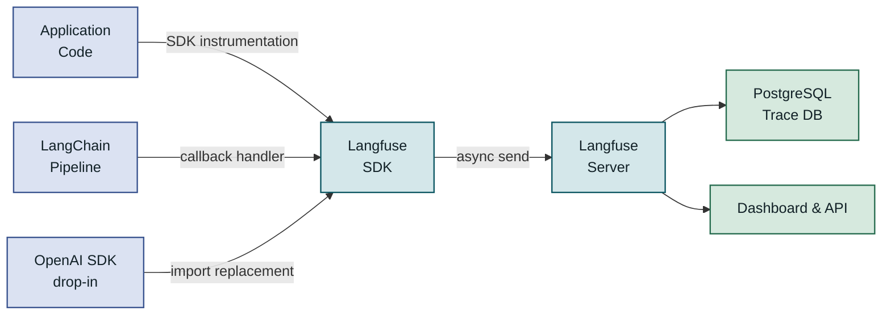
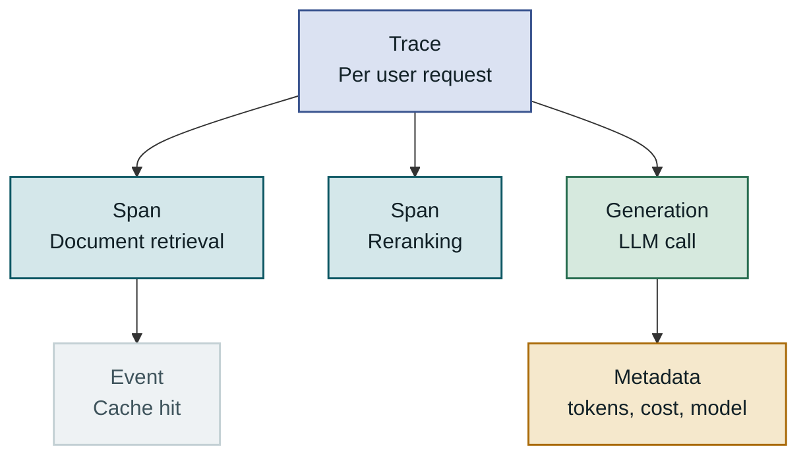
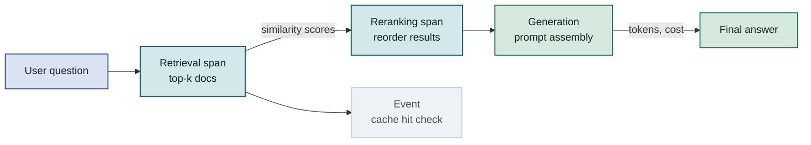
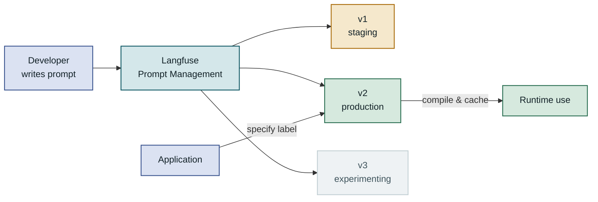
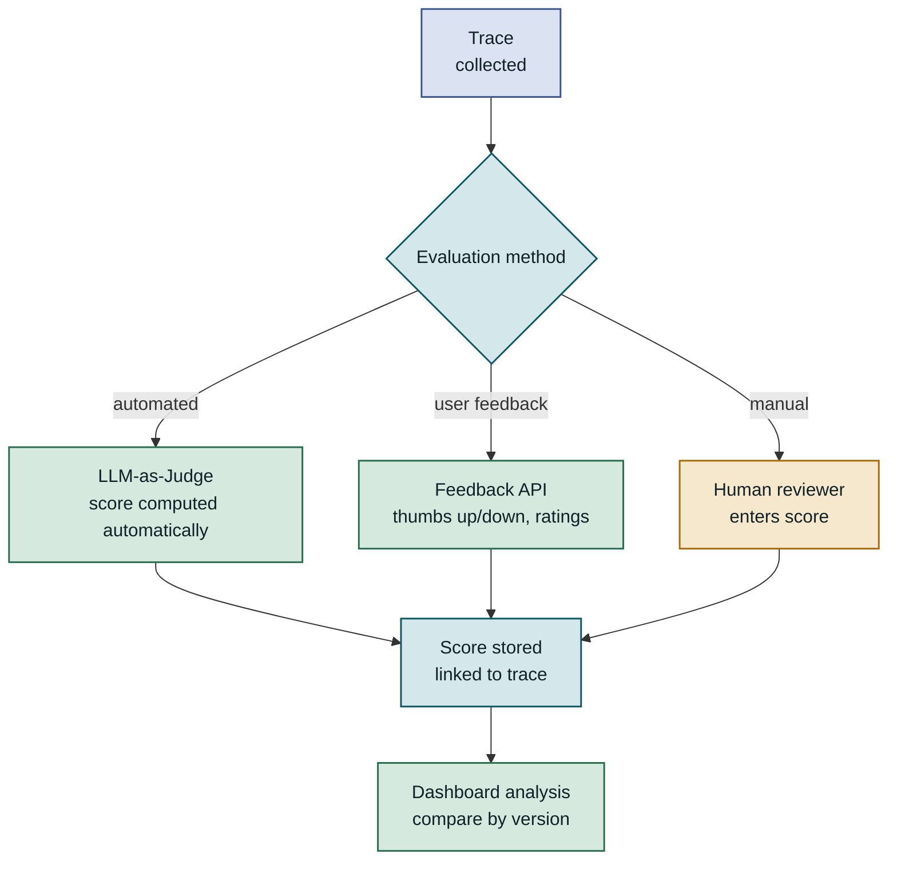
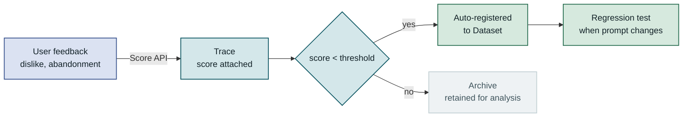
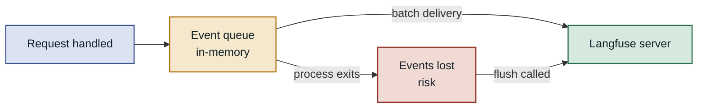
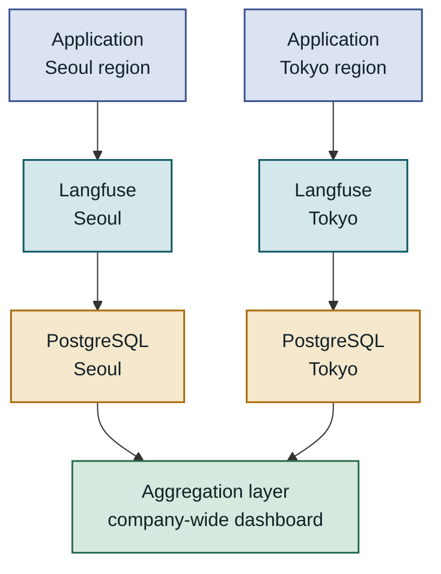

## Table of Contents

1. Overview
2. Langfuse Architecture and Core Concepts
3. Tracing Implementation — See the Request Flow
4. Prompt Version Management — Separate Experimentation from Deployment
5. Evaluation Automation — Measure Quality Continuously
6. Considerations for Production
7. Closing Thoughts

---

## Overview

### The Problem: Why LLM Applications Are Hard to Observe

Once you deploy an LLM to production, you face a completely different kind of uncertainty than traditional software systems. When a user reports "the response was weird," reproducing exactly what prompt was sent, what tokens the model consumed, and at which step in the chain the intent got distorted is nearly impossible. HTTP logs contain JSON payloads, but they don't reveal what actually mattered. **Langfuse** is an open-source LLM observability platform designed to close that gap. It provides tracing, prompt version management, and evaluation automation in a single platform, recording every LLM-related call in a structured way — from RAG pipelines to agent loops.

### The Limits of the Old Approach: Logs Aren't Enough

Traditional APM (Application Performance Monitoring) tools handle numeric metrics like latency and error rates well, but they can't quantify the quality of an LLM call. Plain logging lets you store prompts and responses, but loses the causal relationship between individual steps in a multi-step chain. In a RAG pipeline — where retrieval, reranking, and generation run in sequence — when the final response is wrong, you can't tell whether the problem was in the retrieval step or in how the prompt was constructed. **Hard-coding prompts in source code** makes version management difficult and A/B testing impossible. Langfuse addresses all three of these gaps simultaneously through its three pillars: tracing, prompt management, and evaluation.

---

## Langfuse Architecture and Core Concepts

### Platform Structure and Data Flow

Langfuse collects data through three main paths. First, direct instrumentation via SDK. Insert the Python or TypeScript SDK into your application code and a trace is generated automatically for each LLM call. Second, framework integrations with LangChain, LlamaIndex, Haystack, and others. Register a single callback handler and the entire pipeline is recorded without any additional instrumentation code. Third, OpenAI SDK drop-in replacement. Change the import to `from langfuse.openai import openai` and all calls are tracked with no changes to existing code. Collected data is sent asynchronously to the Langfuse server (cloud or self-hosted PostgreSQL) and is available for near-real-time analysis in the dashboard.



All three instrumentation paths converge on the same Langfuse server, and regardless of how data was collected it's viewable together in the dashboard.

### Trace, Span, and Event Hierarchy

Langfuse's data model is hierarchical. The top-level unit is a **Trace**, which corresponds to a single user request. Inside a trace, **Spans** can be nested, each representing one logical operation (retrieval, LLM call, post-processing, etc.). A **Generation** is a span specialized for LLM calls; it stores LLM-specific metadata in dedicated fields: prompt, response, model name, token count, and cost. Finally, an **Event** is a point-in-time record with only a timestamp, used to capture instantaneous state such as a cache hit or a condition being met. Using these four layers correctly lets you fully reconstruct the execution path of a complex agent loop as a tree.



The trace is the root, with spans, generations, and events nested below it in a tree structure.

### Self-Hosting vs. Cloud

Langfuse is MIT-licensed open source and can be self-hosted; a cloud version at langfuse.com is also available. Self-hosting starts with a single Docker Compose command, and since data never leaves your infrastructure it's preferred in regulated industries like finance and healthcare. The cloud version eliminates infrastructure management overhead and has a generous free tier (50,000 observation events per month). That said, self-hosting requires capacity planning and a backup strategy for PostgreSQL — trace data accumulates faster than you'd expect. In practice, a common approach is to use cloud for development and staging and self-hosted for production.

| Item | Cloud | Self-Hosted |
|---|---|---|
| Initial setup | Sign up only | Docker Compose required |
| Data ownership | Langfuse servers | Fully on your own |
| Maintenance burden | None | PostgreSQL + version upgrades |
| Free tier | 50k events/month | Unlimited (server costs only) |
| When to choose | Prototypes, startups | Regulated industries, high volume |

---

## Tracing Implementation — See the Request Flow

### SDK Installation and Basic Instrumentation

Installing the Langfuse Python SDK and setting environment variables is all it takes to start basic instrumentation. The three essential environment variables are `LANGFUSE_PUBLIC_KEY`, `LANGFUSE_SECRET_KEY`, and `LANGFUSE_HOST`. The simplest approach is the OpenAI SDK drop-in replacement, which tracks all LLM calls with almost no changes to existing code. The example below shows the typical pattern for applying Langfuse instrumentation to a FastAPI-based Q&A endpoint. A single `observe` decorator wraps the entire function as a span, and nested calls are automatically linked as parent-child relationships.

```python
from langfuse.decorators import langfuse_context, observe
from langfuse.openai import openai  # drop-in replacement

@observe()  # automatically creates the trace root
async def answer_question(user_id: str, question: str) -> str:
    # add metadata to the trace
    langfuse_context.update_current_trace(
        user_id=user_id,
        tags=["qa", "production"],
        metadata={"question_length": len(question)},
    )

    docs = await retrieve_documents(question)  # nested span created automatically
    answer = await generate_answer(question, docs)
    return answer

@observe(name="retrieve_documents")
async def retrieve_documents(query: str) -> list[str]:
    # retrieval logic — this span is a child of answer_question
    results = vector_store.similarity_search(query, k=5)
    langfuse_context.update_current_observation(
        output={"doc_count": len(results)}
    )
    return [r.page_content for r in results]

@observe(name="generate_answer")
async def generate_answer(question: str, docs: list[str]) -> str:
    context = "\n".join(docs)
    response = openai.chat.completions.create(  # Generation recorded automatically
        model="gpt-4o-mini",
        messages=[
            {"role": "system", "content": "Answer based on context."},
            {"role": "user", "content": f"Context:\n{context}\n\nQuestion: {question}"},
        ],
    )
    return response.choices[0].message.content
    # What you can see in the Langfuse dashboard:
    # - total trace latency
    # - time spent per span
    # - token usage and estimated cost
    # - raw prompt and response
```

Nesting `@observe()` decorators converts the call tree directly into a trace hierarchy. No manual context management code required.

### Instrumenting an Entire RAG Pipeline

Unlike a simple LLM call, retrieval quality has a decisive impact on the final response in a RAG pipeline. Recording metadata alongside each Langfuse span — number of retrieved results, similarity scores, rank changes after reranking — means that when you later investigate "why did this question get a nonsensical answer," you can trace back to the retrieval step. Call `langfuse_context.update_current_observation` inside a span to attach an arbitrary dictionary to it; that data is accessible both from the span detail view in the dashboard and from analytical queries via the API.



Each step is recorded as an independent span, making it possible to compare per-step latency and quality metrics after the fact.

### Linking Sessions and Users

Looking at traces only as individual calls breaks the context. In a multi-turn conversation application, you can set a shared `session_id` key to group multiple traces into a single conversation. Declare `langfuse_context.update_current_trace(session_id="conv_abc123", user_id="user_456")` and the dashboard lets you view a specific user's entire conversation session in chronological order or aggregate average token usage per session. This is also useful for cost allocation by subscription plan and per-user anomaly detection (e.g., detecting cases where unusually long prompts are sent repeatedly).

> Traces are useful on their own, but session analysis and cost attribution only work if you consistently attach `session_id` and `user_id`. If you don't design this in early, retrofitting it later is painful.

---

## Prompt Version Management — Separate Experimentation from Deployment

### Why You Should Decouple Prompts from Code

Hard-coding prompts as strings in source code is simple at small scale, but it quickly leads to problems. Changing a prompt requires a code deployment. Running multiple prompt versions simultaneously requires wiring up a feature flag system. Rolling back to a previous prompt that worked means digging through git history or reverting a deployment. Langfuse prompt management solves this by **treating prompts as independently versioned artifacts**. Each prompt has a name, labels, and a list of variables. The version tagged with the `production` label is automatically selected at runtime. Experimental versions run under a `staging` label; once validated, a label change is all it takes to go live. Code deployments and prompt deployments become fully decoupled.



Changing only the label (`production`, `staging`) switches the active prompt without a code deployment.

### Prompt Compilation and Trace Linking

Langfuse prompts support Mustache-style `{{variable_name}}` templates. Injecting variables at runtime to compile the final prompt lets you automatically link which version with which variables produced a particular response — directly in the trace. Pass a `langfuse_prompt` parameter to `openai.chat.completions.create` and the prompt version is automatically tagged on that generation span. Without this link, writing an analytical query like "did average response length increase after rolling out prompt v2?" becomes awkward. With it, you can compare token usage, latency, and user rating distributions by version directly in the Langfuse dashboard.

```python
from langfuse import Langfuse

langfuse = Langfuse()

# fetch the latest production version from the prompt management server (cached locally)
prompt = langfuse.get_prompt("qa-system-prompt", label="production")

# compile by injecting variables
compiled_messages = prompt.compile(
    language="English",
    domain="finance",
)
# compiled_messages example:
# [{"role": "system", "content": "You are a finance Q&A assistant. Answer in English."}]

response = openai.chat.completions.create(
    model="gpt-4o-mini",
    messages=compiled_messages + [{"role": "user", "content": user_question}],
    langfuse_prompt=prompt,  # automatically links v3 (production) to the trace
)
```

`get_prompt` uses a default 600-second TTL cache, so there's no server round-trip cost on every request.

### A/B Testing and Version Rollback

The real value of prompt management shows up in experiment design. Label two versions of the same prompt `v4-experiment` and `production` respectively, split traffic at the application level, and you have an A/B test. In the Langfuse dashboard, filter by `prompt_version` to see quality scores or user feedback for the two groups side by side. When something goes wrong, re-assigning the `production` label to a previous version in the dashboard is all it takes for an immediate rollback. No application redeployment required — a product manager can execute the rollback themselves, without an engineer. That matters in practice.

| Scenario | Hard-coded approach | Langfuse prompt management |
|---|---|---|
| Modifying a prompt | Code change + deployment | Instantly from the dashboard |
| A/B testing | Feature flags + complex branching | Simplified with label separation |
| Rollback | Revert a code deployment | Reassign label, done in seconds |
| Version history | `git blame` | Dashboard timeline |
| Cost attribution | Version unidentifiable | Token cost aggregated by version |

---

## Evaluation Automation — Measure Quality Continuously

### The Limits of Manual Review and the Need for Automation

The most reliable way to validate LLM response quality is to have a person read and rate it. But in a production environment processing tens of thousands of requests per day, even sampling is a burden. The bigger problem is gradual quality degradation. The compounding effect of prompt changes, model version upgrades, and search index changes slowly worsening response quality is hard to catch with alerting the way you'd catch a single anomalous event. Langfuse's evaluation feature addresses this in two ways. First, write an automated evaluation script using the LLM-as-a-Judge pattern to attach scores to traces. Second, convert explicit and implicit signals collected via the user feedback API into scores and link them to traces. Combining both lets you automatically filter cases that need manual review by score, focusing human effort on the highest-uncertainty cases.



Automated, manual, and feedback-based evaluations all converge into the same score field, aggregated together in the dashboard.

### Implementing Automated Scoring with LLM-as-a-Judge

LLM-as-a-Judge is a pattern where another LLM evaluates the quality of an original response. Langfuse supports running evaluation pipelines natively; you operate them by calling a Python script or GitHub Actions on a schedule. The example below shows automatic scoring of **faithfulness** in a RAG pipeline — whether the response is grounded in the retrieved documents. The score is immediately attached to the corresponding trace via `langfuse.score()`.

```python
from langfuse import Langfuse
from langfuse.openai import openai

langfuse = Langfuse()

def evaluate_faithfulness(trace_id: str, answer: str, context: str) -> float:
    """Automatically scores retrieval faithfulness on a 0-1 scale."""
    eval_prompt = f"""
    Given the following context and answer, rate the faithfulness of the answer
    on a scale of 0 to 1. Only output a number.
    
    Context: {context}
    Answer: {answer}
    """
    response = openai.chat.completions.create(
        model="gpt-4o-mini",
        messages=[{"role": "user", "content": eval_prompt}],
    )
    score = float(response.choices[0].message.content.strip())

    # link the score to the original trace
    langfuse.score(
        trace_id=trace_id,
        name="faithfulness",
        value=score,
        comment=f"Auto-evaluated. Score: {score:.2f}",
    )
    return score
    # What you can see in the dashboard:
    # - faithfulness: 0.87 shown on the trace detail view
    # - average faithfulness trend graph by version and time period
```

Define score names (`faithfulness`, `relevance`, `toxicity`, etc.) consistently, and you can compare results from multiple evaluation scripts in the dashboard or set up alerts when a score drops below a threshold.

### Integrating User Feedback and Building Datasets

The signals that automated evaluation misses come from users directly. Converting behavioral signals — thumbs up/down buttons, regeneration requests, conversation abandonment — into Langfuse scores lets you build a multi-signal quality metric alongside LLM-as-a-Judge. Going further, selecting traces with poor evaluation results and adding them to a **Dataset** naturally accumulates regression test scenarios. Using the Langfuse Dataset API, you can write a script that queries traces matching certain conditions (faithfulness score below 0.5, for example) and registers them as dataset items automatically. That dataset then serves as the baseline for regression evaluation whenever you change a prompt or swap a model.



Low-quality traces accumulate automatically in the regression test dataset, providing a quality comparison baseline before and after prompt experiments.

---

## Considerations for Production

### Common Mistakes and Performance Pitfalls

The Langfuse SDK uses asynchronous batch delivery by default, but if the process exits abruptly, events queued in memory can be lost. In environments where the process terminates immediately after handling a request — AWS Lambda, Google Cloud Run, etc. — you must call `langfuse.flush()` explicitly to guarantee all events have been sent to the server. Another common mistake is **leaving sensitive data in traces as-is**. When prompts include user personal information or internal document content, you need a policy to mask it or separate it into dedicated fields before it reaches the Langfuse server (even self-hosted servers are visible to team members with access). At the SDK level, you can register a `mask` callback to automatically replace specific patterns (phone numbers, email addresses, account numbers, etc.).



In serverless environments, if the process exits without `flush()`, events are lost.

### Monitoring and Cost Management

Langfuse's cost tracking feature aggregates LLM API costs by model, user, and prompt version. You can use this data to identify which types of questions consume the most tokens and target them for prompt compression or model downgrading. For latency, tracking P95/P99 percentile trends is more informative than looking at averages. In multi-step pipelines especially, P99 can spike sharply on specific cases (long document retrieval, multi-hop reasoning) even when average latency looks fine. To catch these early, periodically review per-span latency distributions and wire up alerts to Slack or PagerDuty when thresholds are breached.

| Metric | Check frequency | Action threshold |
|---|---|---|
| Average LLM cost per request | Daily | Investigate if up >20% vs. prior week |
| P95 latency | Real-time, alerting | Alert immediately on SLO breach |
| Average faithfulness | Weekly | Review prompts if drops >0.05 |
| Error rate (LLM calls) | Real-time, alerting | Alert if exceeds 5% |
| Token quota burn rate | Weekly | Capacity review if >70% |

### Scalability and Migration Strategy

For self-hosted Langfuse, trace data can reach tens of gigabytes per day. If you start with a single PostgreSQL instance and later find you need partitioning or a migration to ClickHouse, the migration cost is significant. Define a **data retention policy** from the start (for example, auto-delete traces after 90 days or archive to S3), and set up PostgreSQL auto-partitioning (`pg_partman`) early — it pays off long-term. In multi-region deployments, placing a Langfuse server in each region and keeping data isolated per region is better for both latency and compliance. The trade-off is that viewing aggregate traffic across all regions in a single dashboard requires a separate aggregation layer.



Per-region isolation satisfies compliance requirements while the aggregation layer maintains a unified company-wide view.

---

## Closing Thoughts

### Key Takeaways

Langfuse is an open-source LLM observability tool that provides tracing, prompt management, and evaluation in a single platform. The `@observe()` decorator and the OpenAI drop-in replacement let you instrument an entire pipeline with minimal code changes. Prompts are decoupled from code and can be deployed or rolled back instantly using labels. Combining LLM-as-a-Judge with the user feedback API gives you an automated quality monitoring system, and the flow from accumulating low-quality traces into a dataset for regression evaluation is all self-contained within the same ecosystem.

### When to Actually Adopt It

There are three situations where you should seriously consider Langfuse. **First**, when your LLM calls have grown beyond a single step into chains or agent loops. A single call is fine with basic logging, but the moment two or more steps connect, you need causal tracing. **Second**, when you want to decouple prompt experimentation from code deployments — especially if non-engineering contributors (product managers, domain experts) are involved in improving prompts. **Third**, when you have a production service that needs to proactively detect quality degradation. Manual review alone tends to miss gradual decline; automated evaluation metrics serve as an early warning system.

Conversely, if you're still in the prototype stage or LLM calls are fewer than a few hundred per day, the setup cost outweighs the benefit. In that case, the pragmatic approach is to start light with Langfuse Cloud's free tier, build up your instrumentation experience, and migrate to self-hosting once you've grown to the point where it makes sense.
