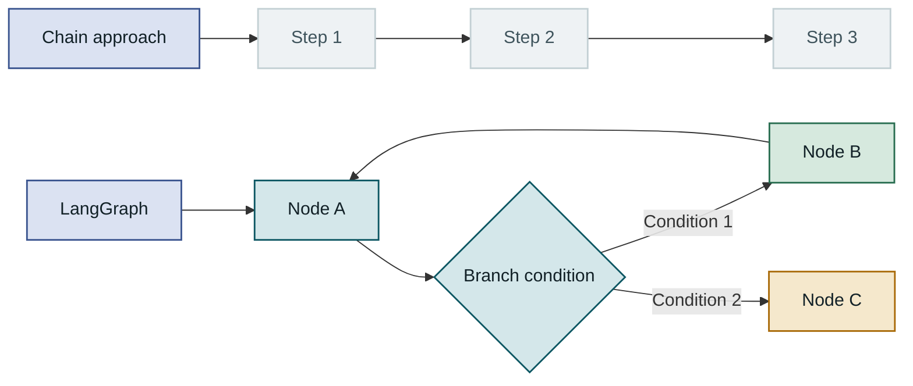
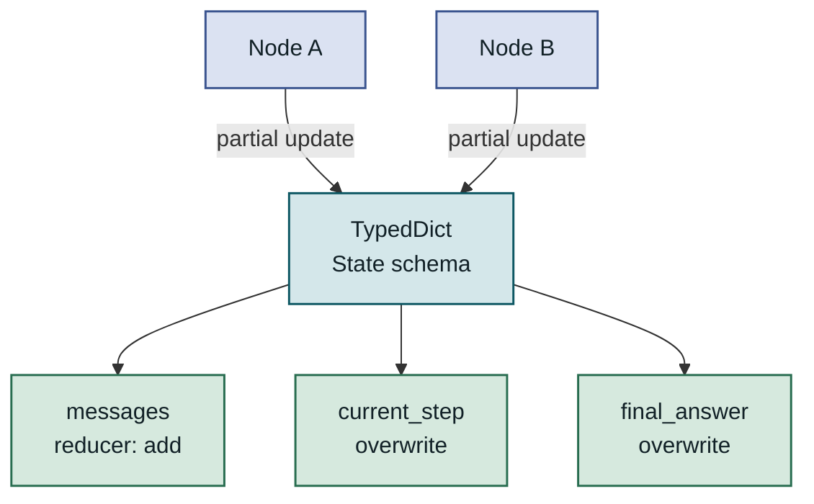
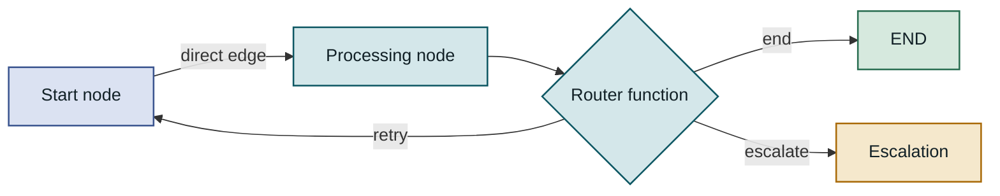
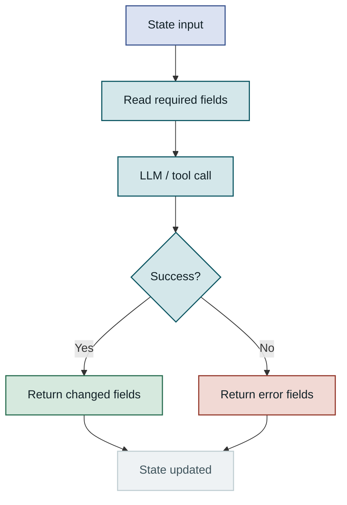
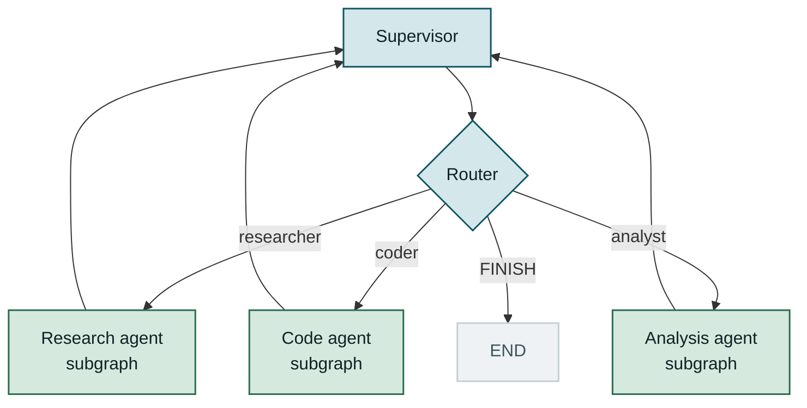
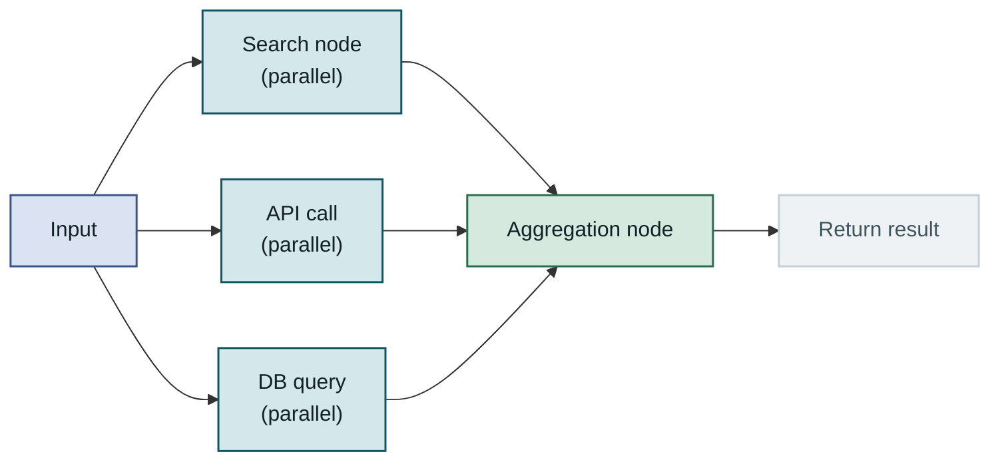
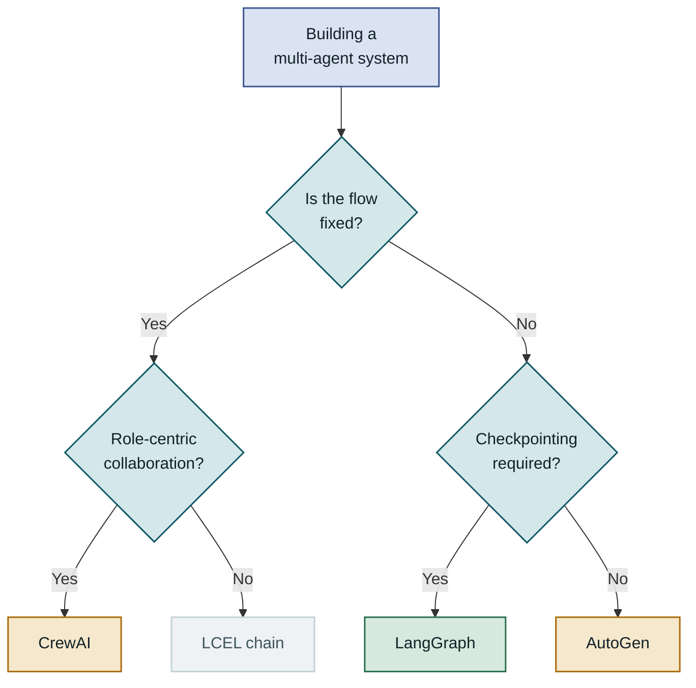
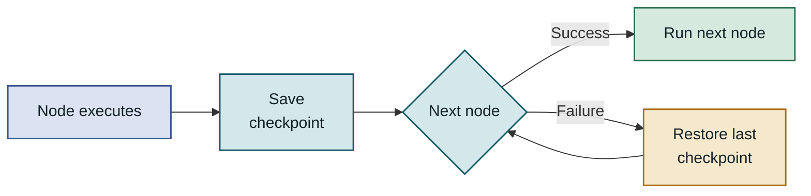

## Table of Contents

1. Overview
2. Understanding LangGraph's Core Structure
3. State Schema and Node Design
4. Implementing Multi-Agent Workflows
5. Performance Characteristics and Framework Comparison
6. Production Considerations
7. Closing Thoughts

---

## Overview

### The Problem: Why Simple Chains Fall Short

As LLM-based applications have proliferated, tasks that can't be handled with a single prompt call or a linear pipeline have multiplied fast. Workflows that analyze search results, generate code, check execution errors, and loop back to fix them—flows that need to change direction based on intermediate results or return to an earlier step—have become routine in real projects. **LangGraph** is an orchestration library the LangChain team released in early 2024 to meet exactly this need. It uses a directed graph structure so you can declare complex workflows where agents collaborate around a shared state. This post covers LangGraph's core abstractions and the judgment calls and pitfalls you'll encounter when designing and running multi-agent systems in actual projects.

### Limits of the Existing Approach

LangChain's LCEL (LangChain Expression Language) and plain chains can wire together multiple LLM calls. But chains are fundamentally designed around a **linear pipeline**. Once you need to change the execution path dynamically based on intermediate results, build cycles that return to an earlier step, or have multiple agents work in parallel on shared state, a chain structure hits a wall. You can implement branching logic directly in Python, but state passing becomes scattered, complexity rises quickly, and reuse suffers. The pattern repeats: when you try to implement a ReAct-style cycle or a supervisor structure with chains, the orchestration code grows thicker than the business logic.



A chain always flows in a straight line; LangGraph expresses conditional branches and cycles naturally through graph declarations alone.

---

## Understanding LangGraph's Core Structure

Everything in LangGraph is built from three abstractions: **State**, **Node**, and **Edge**. You create a `StateGraph` instance, add nodes and edges, then call `compile()`. The resulting graph implements LangChain's Runnable protocol and becomes an executable object. Call `invoke()` or `ainvoke()` and the LangGraph runtime traverses the graph, calling each node in turn. What sets LangGraph apart from other graph-based systems is that a node function receives the entire state (a State dict) as input but returns only a **partial update** to that state as output. You don't need to return fields you didn't change, so each node can focus exclusively on its own area of responsibility, and accidentally overwriting other fields is structurally prevented.

### StateGraph and State Management

`StateGraph` is the entry point for a LangGraph workflow. Pass the state type as a generic when you create an instance, and every node and edge you add afterward shares that schema. State is typically defined as a Python `TypedDict`, and you can use `Annotated` type hints to assign a **reducer function** to each field. Reducers decide how values are merged when multiple nodes try to update the same field at the same time. If you assign `operator.add` as the reducer for the `messages` field, the message lists returned by each node get **appended** to the existing list rather than overwriting it. This matters especially for maintaining conversation history in multi-agent systems. Fields without a reducer are simply overwritten by the last node to return a value, so you need to choose reducers explicitly to match each field's intended update behavior.



The state schema is the single source of truth shared by the entire graph; the reducer declared on each field resolves concurrent update conflicts.

### The Role of Nodes and Edges

A node is just a plain Python function. There's no special class to inherit or interface to implement—it takes the state dict as an argument and returns a dict containing only the fields it changed. This design makes wrapping existing business logic or LangChain chains as nodes cheap, and unit testing straightforward. Edges define connections between nodes and come in two flavors. A **direct edge** always moves to the specified destination node after the source node runs. A **conditional edge** uses a router function that takes the state and returns the name of the next node as a string. The string the router returns determines the branch, and returning the special constant `END` terminates execution.



The conditional edge's router function looks at the current state and picks the next node; routing back to the same node creates a cycle.

### Designing Conditional Branches and Cycles

The most important thing that distinguishes LangGraph from a plain DAG (Directed Acyclic Graph) is that it **allows cycles**. Patterns like ReAct—where an agent calls a tool, checks the result, and returns to the reasoning step—are expressed naturally. However, LangGraph itself imposes no limit on iteration count, so preventing infinite loops is entirely the designer's responsibility. The usual approach is to add a counter field like `step_count` to the state and have the router function force-return `END` when the maximum iteration count is exceeded. When designing graphs with cycles, defining the exit condition first and then working backward to place nodes and edges is an effective way to avoid mistakes.

---

## State Schema and Node Design

A workflow's robustness depends heavily on how carefully the state schema is designed. A state that's too large forces each node to process information it doesn't need; a state that's too sparse makes it impossible to pass context between nodes. A mistake that keeps showing up in real projects is putting everything into a single flat dict. It looks simple at first, but as the number of agents grows it becomes hard to tell which node owns which field, and field name collisions or unintentional overwrites start appearing. One way to address this is to use **nested TypedDicts** to give each agent its own dedicated state area—a design principle that also connects naturally to keeping parent graph state and subgraph state clearly separated.

### Defining the State Schema with TypedDict

When defining the state schema, field **ownership** and **update behavior** should be settled at design time. Fields that accumulate history, like `messages`, get the `operator.add` reducer. Single-value fields that every node refreshes, like `current_step`, use the default behavior (last write wins). If you plan to introduce parallel execution (fan-out), you must assign reducers to every field that could receive concurrent updates ahead of time to avoid runtime errors.

```python
from typing import Annotated, TypedDict
import operator
from langchain_core.messages import BaseMessage

class AgentState(TypedDict):
    # operator.add reducer: messages from each node are accumulated
    messages: Annotated[list[BaseMessage], operator.add]
    current_agent: str   # name of the currently running agent
    step_count: int      # counter to prevent infinite loops
    final_answer: str    # empty means not yet complete

def should_continue(state: AgentState) -> str:
    """Router function: inspect state and return the next node name"""
    if state["step_count"] >= 10:
        return "end"                 # max iterations exceeded -> force stop
    if state.get("final_answer"):
        return "end"                 # answer complete -> stop
    return "continue"               # keep running
```

Attaching `operator.add` to the `messages` field means that even when multiple nodes append messages in parallel, the history accumulates safely without being overwritten.

### Node Function Implementation Patterns

Design node functions to read from state and return only the fields that changed. Even when the node does external I/O (LLM calls, DB queries, etc.), restricting state mutations to the return value makes unit testing and debugging much easier. Nodes that call an LLM should always handle exceptions and write error information back into the state on failure—a defensive pattern that lets subsequent router functions or dedicated error-handling nodes implement recovery logic.



Internal node failures must be passed to the next node through state so that error recovery logic inside a cycle can be implemented safely.

### Resolving State Conflicts with Reducers

In parallel execution (fan-out/fan-in patterns), multiple nodes updating the same field simultaneously causes conflicts. LangGraph resolves this with reducers. `operator.add` merges lists; writing a custom function lets you declare arbitrary merge logic such as dict merging or set unions. Define a reducer once in the state schema declaration and it is automatically applied to every node that writes to that field.

| Update pattern | Reducer | Example | Caveat |
|---|---|---|---|
| Accumulate history | `operator.add` | `messages: list[BaseMessage]` | Watch for list size growth |
| Last value wins | None (default) | `current_agent: str` | Non-deterministic under parallel execution |
| Dict merge | Custom merge function | `tool_results: dict` | Must handle key conflicts |
| Deduplicated set | Custom union function | `visited_urls: set` | Consider set serialization |
| Keep maximum | Custom max function | `max_confidence: float` | Initial value matters |

---

## Implementing Multi-Agent Workflows

The most widely used structure when building multi-agent systems with LangGraph is the **Supervisor Pattern**. A supervisor agent analyzes the overall task and decides which specialist agent to delegate work to. Each specialist focuses on its own domain (web search, code execution, data analysis, etc.), writes results back to the shared state when done, and returns control to the supervisor. Compared to a single agent managing all tools directly, this structure lets each agent's system prompt focus on a specific role, which tends to improve the quality of LLM calls. It's also easier to extend: adding a new specialist doesn't affect existing agents.

### Implementing the Supervisor Pattern

Design the supervisor node to give the LLM the current state and a list of available agents, then receive the next agent name back as **structured output**. Using LangChain's `with_structured_output` forces the LLM to return only valid agent names, reducing the error-handling burden in the router function. Store the agent name the supervisor returns in a state field; have the conditional edge's router function read that field to branch, and the supervisor's decision flows naturally into the graph's execution path.

```python
from pydantic import BaseModel
from langchain_openai import ChatOpenAI

AGENTS = ["researcher", "coder", "analyst"]

class RouteDecision(BaseModel):
    next: str  # agent name or "FINISH"

llm = ChatOpenAI(model="gpt-4o")

def supervisor_node(state: AgentState) -> dict:
    # LLM sees the agent list and returns the next assignee as structured output
    supervisor = (
        supervisor_prompt           # includes agent list + current state
        | llm.with_structured_output(RouteDecision)
    )
    decision = supervisor.invoke({"messages": state["messages"],
                                  "agents": AGENTS})
    return {
        "current_agent": decision.next,            # field the router reads
        "step_count": state["step_count"] + 1
    }

def router(state: AgentState) -> str:
    agent = state["current_agent"]
    return "end" if agent == "FINISH" else agent   # node name or END
```

The agent name the supervisor returns flows through the router function to control the graph's branching—that's the core mechanism.

### Encapsulating Agents with Subgraphs

A **subgraph** encapsulates a complex agent as an independent `StateGraph`. A subgraph can have its own state schema separate from the parent graph; the mapping between the two is handled by input/output transformation functions when you register the subgraph as a node. This lets you reuse agents that are common across projects (a RAG retrieval agent, a code execution agent, etc.) like independent packages. Because state changes inside a subgraph are isolated from the parent graph's state, changing a specialist's internal implementation doesn't affect the supervisor logic.



When each specialist finishes its task, control returns to the supervisor, and this cycle forms the basic repeating structure of multi-agent collaboration.

### Human-in-the-Loop Pattern

LangGraph supports an **interrupt** mechanism that can pause the graph just before a specific node executes and wait for human approval. This feature requires a **Checkpointer**—it persists the paused state, then resumes the graph from that point when the approval signal arrives. You can declare interrupt points at compile time with `interrupt_before=["payment_node"]`, or call the `interrupt()` function dynamically inside a node to collect input. Actions that must have human review even within an automated flow—payment processing, data deletion, outbound API calls—can be safely included this way.

> When resuming a graph with an active interrupt, you must pass `Command(resume=<input value>)`. Calling `invoke()` again without it starts a new execution from the beginning.

---

## Performance Characteristics and Framework Comparison

Doing a comparative review before adopting LangGraph is important for avoiding unnecessary technical debt. Each framework assumes a different agent collaboration model and offers a different level of control, and the optimal choice varies by use case. LangGraph is closer to a **low-level orchestrator** that delegates full control of graph execution to the developer. The initial design cost is higher than higher-abstraction frameworks, but it has a clear edge in scenarios that need fine-grained control—complex branching, cycles, checkpointing. For simple collaboration scenarios where agent roles are fixed and the order is clear, the configuration cost may outweigh the benefit.

### Choosing Between Synchronous and Asynchronous Execution

LangGraph supports both synchronous execution and `async/await`-based asynchronous execution. Define node functions with `async def` and call `await graph.ainvoke()`. **Fan-out** (running multiple nodes in parallel) is implemented through the `Send` API: independent tasks run concurrently, and a fan-in node aggregates results when they're all done. For I/O-heavy workflows (many API calls, web searches, etc.), async parallel execution can significantly reduce total latency. Because concurrent access to shared state is involved, any parallel nodes that update the same field must have a reducer assigned.



Fan-out nodes execute independently and the aggregation node collects results only after all of them finish.

### LangGraph vs. Alternative Frameworks

| Framework | Collaboration model | Cycle support | State management | Control level | When to use |
|---|---|---|---|---|---|
| **LangGraph** | Graph-based | ✅ Native | TypedDict + reducers | Low (fine-grained) | Complex branching or checkpointing needed |
| **AutoGen** | Conversation-based | Limited | Message history | Medium | Free-form conversation between agents |
| **CrewAI** | Role-based | ❌ | Agent memory | High (abstracted) | Fixed roles with a clear execution order |
| **LlamaIndex Workflows** | Event-based | ✅ | Context object | Medium | Already using the LlamaIndex ecosystem |
| **LCEL chain** | Linear pipeline | ❌ | None | Very high | Simple, fixed pipelines |

### When to Choose Which



When the flow changes based on conditions and you need fine-grained control like execution resumption or Human-in-the-Loop, LangGraph is the most fitting choice.

---

## Production Considerations

When moving a LangGraph workflow from prototype to production, things that worked fine locally often reveal unexpected problems at scale or under failure conditions. Multi-agent systems in particular rack up costs fast due to the number of LLM calls, and a failure in a middle step can force the entire workflow to restart from scratch. Tracking which node caused which state transition in a structure where multiple agents collaborate on shared state is difficult, making it time-consuming to reproduce unexpected behavior or identify its cause. Preparing systematically for these problems is the core challenge of the production phase.

### State Persistence and Checkpointing

LangGraph's checkpointer saves state after each node executes. The built-in `MemorySaver` is an in-memory store suited for development—all state is lost when the process restarts. In production, use `SqliteSaver` or `AsyncPostgresSaver` to persist state durably. This way, a failure at a specific node lets you resume from the last checkpoint instead of rerunning expensive LLM calls from scratch. When using a checkpointer, always specify a **thread ID** via `config={"configurable": {"thread_id": "..."}}`. The thread ID is the key that identifies an independent execution context, isolating multiple users' workflows from interfering with each other. Accidentally reusing the same thread ID starts a new execution on top of a previous run's state, so define your ID generation strategy explicitly.



With a checkpointer, an intermediate failure doesn't cascade into a full restart from the beginning, saving both cost and time.

### Monitoring and Debugging

Multi-agent workflows interweave multiple LLM calls, making root-cause analysis difficult when something goes wrong. **LangSmith** is the official tracing tool in the LangChain ecosystem; it gives you a visual view of the LLM call, prompt content, token count, and latency for each node. Set the `LANGCHAIN_TRACING_V2=true` environment variable and tracing activates without any code changes. For local debugging, `astream_events()` lets you see each node's inputs and outputs as a real-time stream, and `graph.get_graph().draw_mermaid_png()` renders the current graph structure as an image.

| Metric | How to measure | Threshold | Caveat |
|---|---|---|---|
| Node execution time | LangSmith timeline | Baseline per node type | Includes LLM latency |
| Average cycle count | `step_count` state field | Max value set at design time | Early warning for infinite loops |
| LLM call failure rate | Exception logs / LangSmith | Target below 1% | Retry policy is mandatory |
| State storage size | Checkpoint storage volume | ~100 KB per node or less | Do not let messages accumulate without bound |

### Scalability and Migration Strategy

When a single-process deployment outgrows itself, you can consider migrating to **LangGraph Platform** (formerly LangGraph Cloud). The platform deploys workflows as a REST API server and provides horizontal scaling, queue-based async execution, and state visualization through a web UI. However, it introduces platform lock-in, so if you need to maintain your own infrastructure, a FastAPI + `AsyncPostgresSaver` combination is a realistic alternative that delivers similar capabilities. When changing the state schema, always verify **deserialization compatibility** with existing checkpoints. Adding fields or changing types can break reading older checkpoints, so prepare migration scripts in advance. In particular, if you use custom message types in the `messages` field, Pydantic schema version changes can cause silent deserialization errors in production—treat schema changes with care.

---

## Closing Thoughts

### Key Takeaways

LangGraph combines three abstractions—**State, Node, and Conditional Edge**—to express complex multi-agent workflows declaratively. A `TypedDict`-based state schema with reducers lets you manage shared state between agents safely, and the supervisor pattern gives structure to agent collaboration. Checkpointing is the key feature that provides resilience for long-running workflows and makes Human-in-the-Loop possible. In production, tracing via LangSmith, managing state size, and a clear thread ID strategy are the foundations of a reliable service.

### Decision Criteria for Adoption

When evaluating LangGraph, the core criteria are the workflow's **complexity** and **control requirements**. For a simple RAG pipeline or an agent chain with a fixed order, a higher-abstraction tool like LCEL or CrewAI is more appropriate. On the other hand, if the execution path changes based on runtime conditions, humans need to intervene midway, the workflow must be resumable at a specific point, and the number of agents and roles is likely to grow over time, LangGraph's low-level control pays off in the long run. A pragmatic incremental approach is also valid: validate quickly with a high-abstraction tool in the prototype phase, then redesign with LangGraph when production-level control and reliability become necessary. The official documentation and example repository (https://github.com/langchain-ai/langgraph) continuously add reference implementations for key patterns—supervisor, ReAct, multi-agent collaboration—so consulting them early in the design phase is recommended.
