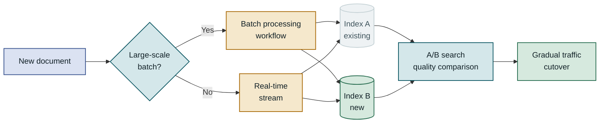

## Table of Contents

1. Overview
2. Core Structure of Multimodal RAG
3. PDF Parsing and Element Extraction
4. Multimodal Embedding and Indexing
5. Search Pipeline Implementation
6. Production Considerations
7. Closing Thoughts

---

## Overview

### A New Challenge in Document Understanding

A large share of PDF documents produced in modern enterprise environments are not text-only. Financial reports contain complex tables packed with quarterly figures, technical manuals include circuit diagrams and flowcharts, and research papers embed graphs of experimental results. To answer a question like "find the inflection point in the chart showing Q3 operating profit trends," a search pipeline built purely on text embeddings is architecturally incapable of doing the job. Multimodal RAG (Retrieval-Augmented Generation) is a pipeline designed so that semantic search and language model generation both work on compound documents that mix images, tables, and formulas. This post walks through the entire pipeline for processing PDFs that contain images and tables — from parsing strategy to vector index design, hybrid search, and response generation.

### Limitations of Conventional Text RAG

A traditional RAG system extracts text from a PDF, splits it into chunks, converts each chunk into a text embedding vector, and stores those vectors in a vector database. This works well enough for text-dense documents, but on documents where visual information is central, three structural flaws appear.

First, images are completely excluded from the search target. When a PDF parser skips images or replaces them with placeholders like `[Figure 1]`, the key information those images carry simply does not exist in the search index. Second, table structure is destroyed. Tables extracted by general-purpose parsers like `pdfminer` or `PyPDF2` frequently collapse into a flat stream of text with no row or column separation, and that kind of text is hard to turn into a meaningful embedding vector. Third, the semantic connection between a figure and its caption is severed. The model has no way to link the text "Figure 3" to the actual content of that figure. Multimodal RAG solves this by running text, images, and tables through separate processing paths in the same pipeline.

---

## Core Structure of Multimodal RAG

### Pipeline Overview

A multimodal RAG pipeline divides cleanly into two phases. The **offline indexing phase** parses the source documents, classifies elements by type, embeds them, and stores them. The **online retrieval phase** analyzes the user query, fetches relevant elements, and hands them to a multimodal LLM to generate the final response. Keeping the two phases strictly separate matters because indexing can run asynchronously in batches, whereas retrieval must respond in real time.

```diagram
en/2026-10-02-1cb47ab1-01
```

Parsing quality sets the ceiling for overall pipeline quality, which makes the choice of parser and post-processing logic the most important design decision.

### Document Parsing Strategy

There are three broad approaches to document parsing. **Rule-based parsers** (PyMuPDF, pdfplumber) are fast and cheap but degrade sharply on complex layouts or scanned documents. **Layout-aware models** (LayoutParser, Unstructured.io) use deep learning models to detect regions and produce much higher quality, at the cost of longer processing time. **Vision-language model-based parsing** (GPT-4o, Claude 3.5 Sonnet) is the most accurate but incurs per-page API costs.

| Approach | Accuracy | Speed | Cost | When to choose |
|---|---|---|---|---|
| Rule-based parser | Low–medium | Very fast | Near zero | Text-heavy digital PDFs |
| Layout-aware model | High | Medium | Low | Documents mixing tables and figures |
| VLM-based parsing | Very high | Slow | High | Scanned documents or high-accuracy requirements |

### Choosing an Embedding Strategy

One of the most important design decisions in multimodal RAG is **what form to embed images in**. Three strategies are currently used most often. The first is to summarize images into text and then embed that text — it lets you reuse existing search infrastructure, but incurs VLM call costs and loses some visual information. The second is CLIP-style multimodal embedding, which projects text and images directly into a shared vector space — inference costs are low and it is suitable for real-time processing. The third is a late-interaction model like ColPali, which encodes the page image itself as patch tokens — precision is high but storage requirements are much larger.

```diagram
en/2026-10-02-1cb47ab1-02
```

Rather than picking one strategy and applying it everywhere, mixing strategies according to the type of element found in the document is more practical and effective.

---

## PDF Parsing and Element Extraction

### Separating Text, Images, and Tables

The core challenge of PDF parsing is not simply extracting text but **recognizing each element's bounding box and type together** within the page. `Unstructured.io`'s `partition_pdf` function and `pymupdf4llm` automate this to some degree, but real projects always need post-processing logic because every document has a different layout.

The most common trap in table recognition is **merged cells**. Restoring the equivalent of HTML's `colspan` and `rowspan` from a PDF requires coordinate-based algorithms; fail to handle this correctly and numeric data ends up scrambled. `pdfplumber`'s `extract_tables` method and the `Camelot` library are strong at grid-line-based table extraction, but borderless tables need separate heuristics. For image extraction, **distinguishing vector graphics from raster images** also matters. PyMuPDF's `get_drawings()` method can extract vector graphics as SVG, and because the text layer is preserved, downstream embedding quality improves.

The following is a basic skeleton for bulk-extracting text blocks and images from each page using PyMuPDF. A real pipeline would add table detection logic and image filtering (e.g., dropping icons that are too small) on top of this.

```python
import fitz  # PyMuPDF

def extract_page_elements(pdf_path: str) -> list[dict]:
    """
    Extracts text blocks and images from each page of a PDF.
    Each item in the returned list contains type / page / bbox / content keys.
    """
    doc = fitz.open(pdf_path)
    elements = []

    for page_num, page in enumerate(doc):
        # Extract text blocks — each block is an (x0, y0, x1, y1, text, no, type) tuple
        for block in page.get_text("blocks"):
            if block[6] == 0:  # 0 = text block
                elements.append({
                    "type": "text",
                    "page": page_num,
                    "bbox": block[:4],
                    "content": block[4].strip()
                })

        # Extract images — access byte data via xref
        for img in page.get_images(full=True):
            xref = img[0]
            base_image = doc.extract_image(xref)
            elements.append({
                "type": "image",
                "page": page_num,
                "content": base_image["image"],   # bytes
                "ext": base_image["ext"]           # "png" or "jpeg"
            })

    doc.close()
    return elements
    # Result: [{"type": "text", "page": 0, "bbox": (72, 100, 540, 120), "content": "..."}, ...]
```

When `get_text("blocks")` returns a block with block_type 1, that indicates an image block. Using this, you can also record the image's position on the page (bbox), which is useful for caption mapping later.

### Layout-Aware Parsing

When layout awareness is needed, `Unstructured.io`'s Hi-Res strategy is a good starting point. Internally, a `detectron2`-based layout analysis model classifies elements as Title, NarrativeText, Table, Figure, ListItem, and so on. The key advantage over plain text extraction is that it **preserves the document structure hierarchy**. Because the paragraphs under each section heading are recorded as metadata indicating which section they belong to, it becomes possible to pull in an entire related section during context expansion after retrieval.

```diagram
en/2026-10-02-1cb47ab1-03
```

Preserving section hierarchy metadata substantially improves the quality of context around retrieved elements.

### Normalizing Extraction Results

Combining output from different parsers requires a **canonical schema**. The recommended approach is to define a structure that includes at minimum `element_id`, `doc_id`, `page_num`, `element_type`, `content`, `bbox`, and `parent_section` fields, then add an adapter layer that converts every parser's output into this format. That way you can swap parsers later without touching any downstream pipeline code.

For images, an **image preprocessing step** after extraction pays off. This means dropping icons that are too small (e.g., 32×32 pixels or smaller), boosting contrast on black-and-white scans to improve OCR accuracy, and splitting full-page screenshots by region. In particular, explicitly linking each image to the caption text immediately below it and storing that link as metadata makes the context you pass to the LLM after retrieval significantly richer.

---

## Multimodal Embedding and Indexing

### CLIP vs. ColPali

The choice of multimodal embedding model is the key variable that determines overall pipeline precision and cost. **CLIP** (Contrastive Language-Image Pretraining) has effectively become the baseline for multimodal embedding since OpenAI released it. Because it projects text queries and images into the same 512-dimensional (or 768-dimensional) vector space, you can search for a chart image directly with a text query like "power consumption graph." Using an open-source implementation like OpenCLIP or `sentence-transformers`' `clip-ViT-B-32` keeps inference costs low and enables local deployment.

**ColPali** is an approach that has attracted attention since 2024. It uses a vision-language model such as PaliGemma to encode an entire document page image as a sequence of patch-level tokens, then computes similarity between query tokens and document patches via late interaction (MaxSim). This approach achieves higher recall than CLIP on elements that straddle the text-image boundary — tables and formulas in particular. The downside is that storing hundreds of patch tokens per page requires tens of times more storage than CLIP.

| Item | CLIP | ColPali |
|---|---|---|
| Encoding unit | 1 vector per whole image | Multiple tokens per patch |
| Retrieval method | Cosine similarity | MaxSim late interaction |
| Storage | Low (1×D) | High (N_patches×D) |
| Recall | Medium | High |
| Processing speed | Fast | Slow |
| When to choose | Fast prototyping, large scale | High precision, document-search-specific |

```diagram
en/2026-10-02-1cb47ab1-04
```

CLIP's strength is speed; ColPali's is precision. An ensemble strategy that runs both in parallel and combines scores with RRF is also viable.

### Vector Index Design

The central decision when designing a vector index for multimodal RAG is **a single collection vs. separate collections per element type**. A single collection is simpler to implement, but text and image vectors differ in dimensionality and distribution, which can degrade retrieval quality. Separating collections by element type lets you tune HNSW parameters (`m`, `ef_construction`) independently for each type, but it requires routing logic that queries multiple collections in parallel at search time.

**Qdrant** and **Weaviate** support multi-vector fields, so you can store both a text embedding and an image embedding for the same document element and then adjust their weights at search time. This is especially useful for elements like tables that need both a text summary and an image rendering stored simultaneously.

### Metadata Strategy

The metadata stored in the vector index plays a decisive role in post-retrieval filtering and context reconstruction. At minimum, include `doc_id`, `page_num`, `element_type`, `parent_section_title`, `caption` (for images and tables), and `language`. `parent_section_title` in particular directly affects response quality because it lets the LLM understand which context within the document a retrieved element belongs to.

> **Key rule**: Always store the caption and surrounding paragraph text of an image as metadata alongside the image embedding. The context you pass to the LLM after retrieval becomes substantially richer.

---

## Search Pipeline Implementation

### Query Routing and Hybrid Search

When a user query arrives, the pipeline must first decide whether this query **centers on text or requires visual information**. "What was revenue in Q3?" is answerable by text search alone, but "find the rebound period in the operating profit trend graph" requires image search. You can put a simple intent classifier powered by an LLM in front, or use a rule-based filter that detects visual keywords in the query (graph, table, chart, diagram, etc.). Combining both approaches lets you balance classification accuracy against response latency.

**Hybrid search** combines dense vector search (ANN) with sparse keyword search (BM25). BM25 is strong on exact strings — proper nouns, product codes — that do not embed well, while ANN is strong on semantically similar expressions. Combining the two scores with the `RRF (Reciprocal Rank Fusion)` algorithm takes the best of both, and this approach delivers stable performance without manual weight tuning.

```diagram
2026-10-02-1cb47ab1-05
```

Routing is decided in the intent analysis step; RRF merges the results of both search approaches into one.

### Reranking and Context Assembly

Passing the top-K candidates from vector search directly to the LLM gives decent results, but running them through a **Cross-Encoder reranker** for one more pass of refinement meaningfully improves precision. A Cross-Encoder takes a query-document pair as input and outputs a relevance score — slower than Bi-Encoder-based vector search, but far more accurate. The typical strategy is to retrieve 50–100 candidates with vector search and then compress them to 5–10 with a Cross-Encoder: a two-stage approach.

When an image is retrieved, you must choose between including it directly in the LLM context or including a pre-generated text summary of it. If you are using an LLM with native multimodal input support — GPT-4o or Claude 3.5 Sonnet — including the image directly is more accurate. For a text-only LLM you must use the summary, so generating that summary ahead of time during the indexing phase is worthwhile.

```diagram
en/2026-10-02-1cb47ab1-06
```

How you assemble context after reranking determines the final response quality.

### Response Generation

In the response generation step of multimodal RAG, unlike plain text RAG, you need fine-grained control over **which elements to include in context and how many**. Images are token-expensive (a high-resolution image in GPT-4o costs roughly 700–1,400 tokens), so a cost-efficient strategy is to substitute text summaries for images with low relevance scores and include originals only for images with high scores.

```python
from openai import OpenAI
import base64

client = OpenAI()

def generate_answer(query: str, retrieved_elements: list[dict]) -> str:
    """
    Combines retrieved text and image elements to generate a multimodal LLM response.
    Only images with a relevance score >= 0.7 are included as raw bytes.
    """
    content = [{"type": "text", "text": f"Question: {query}\n\nReference material:"}]

    for elem in retrieved_elements:
        if elem["element_type"] == "text":
            content.append({
                "type": "text",
                "text": f"[{elem['doc_id']} p.{elem['page']}] {elem['content']}"
            })
        elif elem["element_type"] == "image":
            if elem["score"] >= 0.7:  # High-relevance image: include original
                b64 = base64.b64encode(elem["content"]).decode()
                content.append({
                    "type": "image_url",
                    "image_url": {"url": f"data:image/png;base64,{b64}", "detail": "high"}
                })
            else:                     # Low-relevance image: include summary text only
                content.append({
                    "type": "text",
                    "text": f"[Image summary — {elem['doc_id']} p.{elem['page']}] {elem.get('caption', '')} / {elem.get('summary', '')}"
                })

    content.append({
        "type": "text",
        "text": "\nAlways cite the source (document name, page, element type) in your answer."
    })

    response = client.chat.completions.create(
        model="gpt-4o",
        messages=[{"role": "user", "content": content}],
        max_tokens=1024
    )
    return response.choices[0].message.content
    # Result: answer string with citations (e.g., "Q3 operating profit was ... [report.pdf p.12 table]")
```

The relevance score threshold (0.7) is the trade-off point between precision and cost. Raising it lowers cost but risks missing visual information; lowering it does the opposite. Collect logs in production and adjust the threshold incrementally.

---

## Production Considerations

### Common Mistakes and Pitfalls

One of the most frequent problems when first building a multimodal RAG system is **page boundary breaks**. When a table or figure spans two pages, the parser treats it as two separate elements. If those two pieces are each retrieved separately but the LLM is never told they are connected, the result is an inaccurate answer. Preventing this requires merge logic that detects the same element continuing across adjacent pages.

The second pitfall is **embedding model version mismatch**. If the embedding model used at index creation differs from the one used at query time, cosine similarity calculations become meaningless. Always record the model version and parameters in the index metadata, and perform a full reindex when upgrading the model. The third is the **resolution vs. processing time trade-off**. Storing images at high resolution improves OCR and image embedding quality, but storage and processing time grow sharply. 150 DPI is sufficient for most text and charts; 300 DPI is recommended only when there are many technical drawings or formulas.

```diagram
en/2026-10-02-1cb47ab1-07
```

All three pitfalls are problems you can guard against in the initial design phase.

### Monitoring and Quality Evaluation

Evaluating the quality of a multimodal RAG system is significantly more complex than for a plain text RAG. For text retrieval you can measure metrics like MRR, NDCG, and Hit@K against a human-authored ground-truth QA set, but for image retrieval it is hard to automatically determine "was the right image retrieved?" Using the **LLM-as-a-judge** approach — having GPT-4o evaluate whether a retrieved image is relevant to a query — allows some automation. It is not perfect, but it is a practical way to track quality continuously without human evaluators.

In production, continuously track the following metrics.

| Metric | Description | Alert threshold |
|---|---|---|
| Parsing failure rate | Fraction of element extractions that fail | > 5% |
| Image embedding latency | Processing time per image | > 2 s |
| Retrieval recall@5 | Fraction of top-5 results containing a relevant element | < 0.7 |
| Context token usage | Average input tokens per LLM call | > 4,000 |
| End-to-end response latency | From query received to response complete | > 8 s |

### Scalability and Migration

As document volume grows, the indexing pipeline must clearly separate **batch processing** from **incremental updates**. Indexing new documents in real time and bulk-processing hundreds of thousands of existing documents are entirely different infrastructure problems. Using a workflow orchestrator like `Apache Airflow` or `Prefect` lets you independently retry and monitor each stage of parse → embed → index.

When replacing a parser or embedding model, a **shadow index strategy** is useful. Keep the existing index running, build a new index in parallel with the new pipeline, compare quality with an A/B test, and gradually shift traffic over.



The shadow index strategy lets you swap parsers or models safely with no service interruption.

---

## Closing Thoughts

### Key Takeaways

Multimodal RAG is the approach that overcomes the structural limitations of text-only RAG on real documents mixing images, tables, and formulas. The first core point is separating element types during PDF parsing and choosing an appropriate embedding strategy for each (text embedding, CLIP, ColPali). For the retrieval phase, structure the pipeline as intent analysis → hybrid search (ANN+BM25) → Cross-Encoder reranking → context assembly, in that order. Metadata design and section hierarchy preservation have a larger impact on final response quality than most people expect — this must not be overlooked. In production, the main causes of quality degradation are page boundary breaks, embedding model version mismatch, and incorrect resolution settings, so preparing for these during the initial design phase is critical.

### When to Apply It

Because multimodal RAG costs more to build than text-only RAG, applying it indiscriminately to every document is wasteful. The investment is clearly justified in the following situations: **30% or more of the PDFs you need to process contain tables or figures that carry key information**, **20% or more of user queries explicitly ask for visual information**, or **image provenance tracking is required for regulatory or audit purposes**. Conversely, if documents are text-heavy and tables or images play only a supporting role, the more realistic choice is to stick with plain text RAG and simply add table-to-Markdown conversion. If you are starting small, bring in CLIP before ColPali, collect search quality logs to confirm whether image retrieval precision is actually the bottleneck, and then iterate toward a more sophisticated setup.
