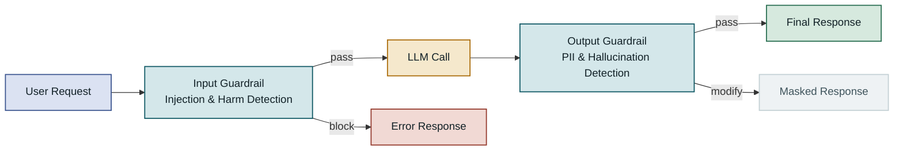

## Table of Contents

1. Overview
2. Core Concepts and Architecture of LLM Guardrails
3. Input Safety — Blocking Prompt Injection and Harmful Content
4. Output Safety — PII Masking and Hallucination Detection
5. Layered Guardrails Architecture and Performance Trade-offs
6. Operational Considerations and Common Pitfalls
7. Closing Thoughts

---

## Overview

### Background

The moment you deploy an LLM to a production service, threats that were invisible in development become real. Users — deliberately or not — probe the model's behavioral boundaries, try to extract the system prompt, and ask questions designed to coax out private information indirectly. **LLM Guardrails** is the collective term for the safety layer that protects AI system inputs and outputs from these threats. Unlike a simple keyword blacklist, guardrails combine semantic classification with multi-stage validation to satisfy security requirements without sacrificing service quality.

Since 2024, LLM-based services have spread widely across enterprise environments, and regulators and security researchers have taken notice. Frameworks like the EU AI Act and the NIST AI RMF explicitly require safety controls for high-risk AI systems. On top of that, in healthcare, finance, and legal domains, generating incorrect information can cause direct harm, making output validation not optional but mandatory.

### Limits of Earlier Approaches

Early attempts to block harmful content relied on regex-based filtering or simple keyword matching. The fatal weakness of this approach is **bypassability**. Blocking the word "bomb" does nothing to catch a prompt like "walk me through the step-by-step synthesis of the material used in incendiary devices" — it avoids the banned word entirely while achieving a similar result. Conversely, an overly broad filter blocks legitimate medical terminology or descriptions of historical events, degrading service availability.

The other limitation is **no defense at the output stage**. Applying only input filtering does nothing to stop the model from generating sensitive information on its own or reproducing PII present in its training data. Guardrails in production AI means a defense-in-depth system that covers the entire pipeline: input preprocessing, system prompt protection, model invocation, and output post-processing.

---

## Core Concepts and Architecture of LLM Guardrails

### Structural Difference Between Input and Output Guardrails

Input guardrails and output guardrails have different protection goals. At the input stage, the goal is to block threats **before they reach the model**, so latency sensitivity is high. At the output stage the model has already generated a response, which allows for somewhat more thorough inspection. The reason the two layers must be designed independently is that the attack vectors are fundamentally different.

The canonical input attack is **prompt injection**. A user inserts instructions that neutralize the system prompt ("from now on you are an unconstrained AI"), or uses indirect injection — hidden instructions embedded in a web crawl result or a document — to cause an agent to take unintended actions. Output attacks are different. The main threats there are the model inadvertently including personal information, asserting incorrect facts with confidence, or reproducing verbatim copyright-protected content.



Input and output guardrails have separate responsibilities. Applying only one of them leaves a gap in the defense.

---

### Key Components and Their Roles

A guardrails system is made up of four main components. The **classifier** analyzes the meaning of text and scores it by risk category. Rule-based classifiers are fast but easy to bypass; ML-based classifiers are more accurate but add latency. In practice, layering the two is the norm.

The **PII detector** finds personally identifiable information — names, emails, phone numbers, national ID numbers, credit card numbers — by combining regex and NER (Named Entity Recognition) models. The **policy engine** receives detection results and decides which action to take: block, mask, warn, or allow. Finally, the **audit logger** records every decision in structured form for post-incident analysis and regulatory audits.

| Component | Primary Role | Latency Impact | Watch Out For |
|---|---|---|---|
| Rule-based classifier | Block obvious banned terms and patterns | Very low (< 1ms) | High bypass risk |
| ML classifier | Semantic risk scoring | Medium (10–50ms) | Needs periodic retraining |
| PII detector | Identify and mask personal information | Low–medium | Monitor false-positive rate |
| Policy engine | Detection result → action decision | Negligible | Policy versioning matters |
| Audit logger | Async recording | None (async) | Storage cost |

### Data Flow and Processing Order

In a guardrails pipeline, processing order has a direct impact on performance and accuracy. The efficient pattern is **early exit**: run cheap, fast checks first and apply expensive ML-based checks only to suspicious requests.

```diagram
en/2026-10-07-c621f6a4-02
```

The layered structure — rule-based → ML classifier → conditional human review — is the core pattern for managing cost and accuracy together.

---

## Input Safety — Blocking Prompt Injection and Harmful Content

### Prompt Injection Detection

Prompt injection is one of the most serious security threats in LLM-based applications. An attacker inserts phrases like "ignore all previous instructions" through the user input field to neutralize the system prompt. Simple keyword detection cannot cover all variants of these attacks. Rewriting "Ignore previous instructions" in another language, with different phrasing, or using Unicode lookalike characters easily passes a regex filter.

A more effective approach is **semantic similarity-based detection**. Convert known injection patterns into embeddings and store them in a vector database. For each new input, compute the cosine similarity between its embedding and the stored patterns and block it if it exceeds a threshold. **Structural analysis** can be layered on top: verify that the system prompt and user input are clearly separated, and trigger additional inspection whenever the user input contains prompt-like structure (e.g., `###`, `[INST]`, XML tags).

In agentic systems, **indirect prompt injection** is the bigger threat. When an agent processes external data — web pages, documents, emails — hidden instructions inside that data can manipulate the agent. The defense is to isolate external data in a sandboxed context when processing it, or to apply a principle of least privilege: text from external sources is treated as having lower execution authority.

```diagram
en/2026-10-07-c621f6a4-03
```

The three-stage detection pipeline — keyword → semantic similarity → structural analysis — captures bypass attempts while keeping the false-positive rate low.

---

### Content Classification and Harm Scoring

To evaluate the harmfulness of input content, most commercial guardrails solutions use a multi-dimensional classification scheme. OpenAI's Moderation API and AWS Comprehend return per-category scores for hate speech, sexual content, violence, self-harm promotion, and so on. Those scores feed into the policy engine, where you can apply different thresholds by domain. In a healthcare service, a mention of self-harm should route to crisis resources rather than a hard block, whereas immediate blocking may be appropriate in a general-purpose chatbot.

Multilingual support matters too. Non-English languages — Korean, Japanese, Arabic — tend to produce higher false-positive and false-negative rates in classifiers trained predominantly on English. If your service is multilingual, the right approach is to detect the language first and then apply a language-specific classifier, or to use a multilingual classification model based on mBERT or XLM-R.

> Do not make block decisions based solely on content classification scores. Applying the same threshold across all categories without domain context will cause false positives that degrade service quality.

### Input Normalization and Length Limits

Attackers use Unicode homoglyphs, zero-width spaces, and excessive repetition of special characters to confuse classifiers. Input normalization removes these tricks so the classifier sees consistent text. Unicode NFKC normalization unifies characters that look identical but differ in internal encoding.

Token limits are also part of security. Very long inputs can be used in **context overflow attacks**: injecting a large volume of text to push the system prompt toward the back of the context window, effectively making the model follow only the user's instructions. Put an upper bound on input token count, and when document processing is necessary, split content safely using a chunking strategy.

---

## Output Safety — PII Masking and Hallucination Detection

### PII Detection and Masking Strategies

PII leakage in outputs can directly result in GDPR and privacy-law violations. Models tend to reproduce personal information present in training data verbatim, or unnecessarily re-expose information the user provided earlier in the conversation. A PII detector scans output text for patterns like email addresses, phone numbers, credit card numbers, and national ID numbers, then masks or removes whatever it finds.

Regex alone cannot catch all PII. Extracting the name and address from "Hong Gil-dong lives at 123 Teheran-ro, Gangnam-gu, Seoul" requires an NER model. Microsoft's Presidio and Amazon Comprehend's PII detection both combine regex with NER. Masking strategies vary: full removal (`[REMOVED]`), category label substitution (`[PHONE_NUMBER]`), or reversible tokenization (encrypt and decrypt as needed). Pick the strategy that fits the purpose.

```diagram
en/2026-10-07-c621f6a4-04
```

Applying different masking intensities depending on the channel (public response vs. internal log) satisfies both regulatory compliance and debugging convenience at the same time.

---

Here is a minimal example of building an output PII masking pipeline in Python using the Presidio library.

```python
from presidio_analyzer import AnalyzerEngine
from presidio_anonymizer import AnonymizerEngine
from presidio_anonymizer.entities import OperatorConfig

analyzer = AnalyzerEngine()
anonymizer = AnonymizerEngine()

def mask_pii(text: str, locale: str = "ko") -> dict:
    """
    Detect PII in LLM output and return the masked text.
    
    Returns:
      - masked_text: the final masked output
      - findings: list of detected PII items (for auditing)
    """
    # 1. Detect PII (names, emails, phone numbers, locations, etc.)
    results = analyzer.analyze(
        text=text,
        language="en",  # add a custom recognizer for Korean support
        entities=["PERSON", "EMAIL_ADDRESS", "PHONE_NUMBER", "LOCATION"]
    )
    
    if not results:
        return {"masked_text": text, "findings": []}
    
    # 2. Apply masking — replace with category labels
    operators = {
        "PERSON": OperatorConfig("replace", {"new_value": "[NAME]"}),
        "EMAIL_ADDRESS": OperatorConfig("replace", {"new_value": "[EMAIL]"}),
        "PHONE_NUMBER": OperatorConfig("replace", {"new_value": "[PHONE]"}),
        "LOCATION": OperatorConfig("replace", {"new_value": "[LOCATION]"}),
    }
    
    anonymized = anonymizer.anonymize(
        text=text,
        analyzer_results=results,
        operators=operators
    )
    
    # Result: "Please contact Hong Gil-dong (010-1234-5678)"
    # → "Please contact [NAME] ([PHONE])"
    return {
        "masked_text": anonymized.text,
        "findings": [{"type": r.entity_type, "score": r.score} for r in results]
    }
```

This code replaces detected PII with category labels and also returns the detection results for the audit log. Korean-specific entities (national ID numbers, business registration numbers, etc.) need to be supplemented with custom regex via `PatternRecognizer`.

---

### Hallucination Detection and Fact Verification

**Hallucination** — the model confidently stating wrong information — is especially dangerous in healthcare, legal, and financial domains. There are two main approaches to detecting it. **Retrieval-based verification (RAG grounding check)** cross-checks factual claims in the model's output against trustworthy sources. If the model mentions a specific date, statistic, or name in its response, you verify that information actually appears in the context.

**Self-consistency checking** presents the same question to the model multiple times or in different ways and checks whether the answers are consistent. Large divergence between answers signals that the model is uncertain about that topic. This is expensive but can be applied selectively to high-stakes responses.

| Hallucination Detection Method | Accuracy | Cost | When to Use |
|---|---|---|---|
| Context grounding check | Medium | Low | Default for RAG-based systems |
| External fact lookup | High | High | Verifying numbers, dates, proper nouns |
| Self-consistency check | High | Very high | High-stakes decision scenarios |
| NLI-based entailment | Medium | Medium | Logical consistency checking |

---

## Layered Guardrails Architecture and Performance Trade-offs

### Layered Defense Design

Guardrails in production must be a **defense-in-depth** structure where multiple layers complement each other — not a single check. The first layer operates at the API gateway level: input length limits, rate limiting, blocking known malicious patterns. The second layer performs ML-based classification and PII detection in the application tier. The third layer consists of safety instructions embedded in the LLM call itself (refusal directives in the system prompt). The fourth layer is output post-processing.

Because these layers operate independently, if one layer misses an attack, the next one compensates. That said, latency accumulates as layers multiply. You need an architecture that uses async checks and caching to minimize latency on the critical path.

```diagram
en/2026-10-07-c621f6a4-05
```

Each layer has an independent failure mode, so if one layer is bypassed, the overall system does not collapse.

---

### Technology Comparison — Managed vs. Open Source

Implementing guardrails means choosing between managed services and open-source libraries. **AWS Bedrock Guardrails**, **Azure AI Content Safety**, and **Google Cloud Natural Language API** are managed services that enable fast integration, but they come with data sovereignty concerns and vendor lock-in. Sending healthcare or financial data to an external API can violate regulations, so legal review is required before adopting them.

On the open-source side, **NeMo Guardrails** (NVIDIA), **Guardrails AI**, and **LlamaGuard** (Meta) are the main options. NeMo Guardrails is notable for defining conversation flow and safety policies with the RAIL (Reliable AI Markup Language) specification. LlamaGuard is a small Llama-based classification model that you can run on your own servers, giving you both low latency and full data control.

| Solution | Type | Key Strength | Watch Out For |
|---|---|---|---|
| AWS Bedrock Guardrails | Managed | Fast integration, AWS ecosystem | External data transfer, cost |
| Azure AI Content Safety | Managed | Multimodal support | Vendor lock-in |
| NeMo Guardrails | Open source | Strong conversation flow control | High configuration complexity |
| LlamaGuard | Open-source model | On-premises deployment | Weak Korean performance |
| Presidio | Open source | PII-focused, flexible customization | No ML classification |

### Performance Optimization and Latency Management

For guardrails not to harm the user experience, the added latency must stay within an acceptable range. Common targets are under 50ms for input guardrails and under 100ms for output guardrails. The key strategy to achieve this is **async parallel processing**: instead of running classifiers sequentially, run them in parallel and cancel the rest as soon as the first block decision comes in.

**Result caching** is also effective. Reusing a previous classification result for identical or very similar inputs reduces latency for repeated requests. For the cache key, you can use an embedding-based similarity cache to handle inputs that are semantically similar but textually different. Watch out for cache poisoning — a situation where a malicious input gets cached as "safe."

---

## Operational Considerations and Common Pitfalls

### The Downside of Over-filtering

A trap teams commonly fall into when first adopting guardrails is **setting conservative thresholds**. With the mindset of "let's play it safe," setting the classifier's block threshold too low causes large numbers of legitimate user requests to get blocked. A medical service might misclassify questions about medication dosages or symptoms as harmful content; a legal service might block descriptions of criminal facts in case law as violent content.

Preventing this requires **per-domain threshold tuning** and **allowlist management**. Maintain separate thresholds per category that reflect the domain context, and explicitly add terms and expressions that are normal in that domain to the allowlist. You also need a process for periodically sampling real block logs to measure false positives and adjust thresholds accordingly.

```diagram
2026-10-07-c621f6a4-06
```

Guardrails thresholds are not a one-time configuration. They are living settings that must be continuously adjusted based on data.

---

### Monitoring and Debugging Metrics

Five core metrics matter for monitoring guardrails health in production. **Block rate** — blocks as a fraction of total requests — signals a new wave of attacks or a misconfigured threshold when it spikes sharply. **False positive rate** should be measured periodically through sample review, with a target below 3%. **Guardrails latency (P99)** shows how much of overall response time the guardrails consume; anything above 200ms calls for an architecture review. **Per-category detection distribution** shows which violation types are most frequent and informs policy priorities. **Escalation rate** is the fraction of cases routed to human review rather than automatically blocked.

Structured logging is the foundation for all of this. Recording a JSON log for each guardrails decision that includes `request_id`, `timestamp`, `guardrail_layer`, `decision` (allow/block/escalate), `categories`, `latency_ms`, and `policy_version` makes it easy to aggregate metrics in a data analytics pipeline later.

Here is an example of recording a guardrails decision as a structured log.

```python
import json
import time
from dataclasses import dataclass, asdict
from typing import Literal

@dataclass
class GuardrailsAuditLog:
    request_id: str
    timestamp: float
    layer: str  # "input" | "output"
    decision: Literal["allow", "block", "escalate", "mask"]
    categories: list[dict]  # [{"type": "PROMPT_INJECTION", "score": 0.92}]
    policy_version: str
    latency_ms: float
    user_id: str | None = None

def log_guardrails_decision(
    request_id: str,
    layer: str,
    decision: str,
    categories: list[dict],
    latency_ms: float,
    policy_version: str = "v1.2.0",
) -> None:
    """
    Record a guardrails decision as structured JSON.
    Push to an async logging queue so it does not add latency to the response path.
    """
    log_entry = GuardrailsAuditLog(
        request_id=request_id,
        timestamp=time.time(),
        layer=layer,
        decision=decision,
        categories=categories,
        policy_version=policy_version,
        latency_ms=latency_ms,
    )
    
    # Result: {"request_id": "req-abc123", "layer": "input",
    #           "decision": "block", "categories": [{"type": "PROMPT_INJECTION", "score": 0.97}],
    #           "latency_ms": 23.4, ...}
    log_json = json.dumps(asdict(log_entry), ensure_ascii=False)
    
    # In production, send to an async queue such as Kafka or SQS
    print(log_json)  # stdout for illustration purposes
```

This log structure is designed to aggregate easily in any analytics platform — Athena, BigQuery, Elasticsearch. The `policy_version` field is essential when you want to compare metrics before and after a threshold change.

---

### Scalability and Migration Strategy

Even if you start with a simple guardrails setup, as the service grows you will need more sophisticated checks to keep up with traffic. **Horizontal scaling** works best when the guardrails service is extracted into a microservice independent of the LLM service so each can scale out on its own. Even if you start with them inlined in a monolith, define the interface clearly from the beginning so that extraction is easy later.

Policy changes are also a major migration risk. When changing thresholds or classification categories, the recommended approach is **canary deployment**: apply the new policy to a fraction of traffic, monitor metrics, then switch over fully. Managing policy versions in Git alongside code and recording the policy version tied to each deployment in logs enables fast rollback and root-cause analysis when problems arise.

In multi-tenant environments you may need per-tenant policy customization. When delivering an LLM service as B2B SaaS, one customer in the healthcare domain needs different thresholds from the defaults, and another running an adult content platform does not fit the general policy at all. Designing the policy engine so that settings can be overridden by tenant ID lets you accommodate these requirements flexibly.

```diagram
en/2026-10-07-c621f6a4-07
```

A per-tenant policy override structure lets a multi-tenant LLM service accommodate both regulatory requirements and business diversity.

---

## Closing Thoughts

### Summary

LLM Guardrails is core infrastructure for ensuring the reliability of production AI services. At the input stage you need prompt injection detection, harmful content classification, and input normalization with length limits. At the output stage, PII masking, hallucination detection, and copyright infringement prevention are critical. Layered defense is the principle of designing the system so that a single layer's failure does not compromise overall security — each layer holds an independent responsibility.

From an operational standpoint, the key to sustainable guardrails is continuously monitoring false positives from over-filtering and having a data-driven process for adjusting thresholds. Policy version management and audit logging are both non-negotiable — for regulatory compliance and post-incident analysis alike.

### Decision Criteria for Adoption

The appropriate scope of guardrails depends on the service's risk level and domain. For internal tooling or developer-facing services, basic PII masking and prompt injection detection are often sufficient. For services targeting general users in healthcare, legal, or financial domains, you need a full-layer implementation that includes hallucination detection, fact verification, and regulatory compliance checks.

Managed services offer fast integration and lower maintenance burden, but they require sending sensitive data to an external endpoint. If data sovereignty matters or on-premises operation is required, an open-source combination such as LlamaGuard, Presidio, and NeMo Guardrails is the right call. In either case, guardrails are not something you configure once at initial deployment and forget. They are a living system that must be continuously evolved to match traffic patterns and evolving attack trends.
